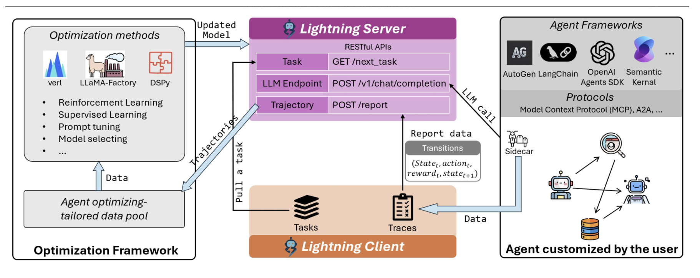

**Microsoft Agent Lightning** differs from **Unsloth** and the **Hugging Face fine-tune library** in several key ways:

- **Purpose & Scope**:
  - **Agent Lightning** is designed to *automate optimization of AI agents* in real production environments—this means not just fine-tuning LLMs, but also orchestrating prompts, reward-based RL, supervised fine-tuning, and managing agent workflows and traces. It can interface with multiple agent frameworks (LangChain, CrewAI, etc.) and integrates fine-tuning directly into the agent's operational loop.[1][2][3]
  - **Unsloth** focuses specifically on *speeding up and simplifying LLM fine-tuning*. It optimizes memory to support larger models on smaller GPUs and significantly reduces time and complexity for traditional supervised fine-tuning tasks.[4][5][6]
  - **Hugging Face’s library** (Transformers/Trainer) provides the foundational tools for *fine-tuning and training models* using standard workflows, with flexibility but less opinionated automation for agent-centric RL loops or multi-agent scenarios compared to Agent Lightning.[5][7][8][4]

- **Workflow Integration**:
  - With **Agent Lightning**, you can organize rollouts, track the best-performing agent actions, and create datasets from real agent traces, then pass these directly into Unsloth or Hugging Face fine-tuning routines for seamless optimization in a production-like loop.[1]
  - **Unsloth** plugs into the Hugging Face ecosystem for dataset and model handling, but specializes in fast, quantized (e.g., 4-bit) training and LoRA/QLoRA adapters; it's not designed for agent orchestration or reward-driven RL out of the box.[6][4]
  - **Hugging Face Transformers** provides general fine-tuning utilities but is more manual—users choose the dataset, model, and config, and do not get built-in agent-centric RL workflows.

- **Key Differentiators**:
  - **Agent Lightning** is the “trainer” and orchestrator for *agents*, not just LLMs—it can combine reward models, prompt optimization (APO), supervised fine-tuning, and interacts with Unsloth/Transformers pipeline for the training component.[2][3][9][1]
  - **Unsloth** makes standard LLM fine-tuning super-fast and memory efficient, and can be called from Agent Lightning or independently (great for hardware/budget constraints).[4][5]
  - **Hugging Face Transformers** is universal and highly flexible for fine-tuning models, but users must build custom logic for agent RL, rollouts, or intelligent prompt optimization.

**Summary Table:**

| Feature                          | Agent Lightning            | Unsloth                   | Hugging Face Fine-tune |
|-----------------------------------|----------------------------|---------------------------|------------------------|
| Agent workflow management         | Yes                        | No                        | No                     |
| RL & prompt optimization          | Yes                        | No (standard SFT)         | No (manual setup)      |
| Fast, memory-efficient SFT        | Delegates via Unsloth      | Yes                       | No                     |
| Multi-agent support               | Yes                        | No                        | No                     |
| Built on HF ecosystem             | Partially                  | Yes                       | Yes                    |
| Use case focus                    | Production agent training  | LLM fine-tuning speed     | General fine-tuning    |

**In essence:**  
- Use **Agent Lightning** if you want agent-centric workflows, automated RL, and direct integration with fast fine-tuning backends (like Unsloth).
- Use **Unsloth** if you want rapid, resource-efficient fine-tuning of LLMs (and it’s often a backend for Agent Lightning).
- Use **Hugging Face fine-tune library** for full-control, custom training of models, especially outside of the agent context.

Let me know if you want a practical setup flow or code comparisons for these tools!

[1](https://microsoft.github.io/agent-lightning/stable/how-to/unsloth-sft/)
[2](https://huggingface.co/papers/2508.03680)
[3](https://news.ycombinator.com/item?id=45706729)
[4](https://www.linkedin.com/posts/muhammad-sawaiz-668976248_llm-ai-huggingface-activity-7344624430494498816-aWAS)
[5](https://www.datacamp.com/tutorial/unsloth-guide-optimize-and-speed-up-llm-fine-tuning)
[6](https://unsloth.ai)
[7](https://learn.microsoft.com/en-us/azure/databricks/machine-learning/train-model/huggingface/fine-tune-model)
[8](https://huggingface.co/docs/transformers/en/index)
[9](https://blog.vllm.ai/2025/10/22/agent-lightning.html)
[10](https://www.youtube.com/watch?v=jCoPEJTIA4o)
[11](https://slashdot.org/software/comparison/Lightning-AI-vs-Unsloth/)
[12](https://sourceforge.net/software/compare/Lightning-AI-vs-Unsloth/)
[13](https://www.linkedin.com/posts/ashishpatel2604_agent-lightening-sft-with-unsloth-activity-7391085514709254146-vKXJ)
[14](https://microsoft.github.io/agent-lightning/latest/)
[15](https://www.reddit.com/r/MachineLearning/comments/1azck48/d_hugging_face_accelerate_versus_lightning_fabric/)
[16](https://www.youtube.com/watch?v=jCoPEJTIA4o)
[17](https://www.reddit.com/r/MachineLearning/comments/14ze05e/d_pytorch_lighting_vs_huggingface_for_production/)
[18](https://lightning.ai/lightning-ai/studios/finetune-an-image-classifier-with-hugging-face)
[19](https://docs.unsloth.ai/get-started/reinforcement-learning-rl-guide/training-ai-agents-with-rl)
[20](https://arxiv.org/html/2508.03680)
[21](https://lightning.ai)

**Microsoft Agent Lightning** and **DSpy** are both agent optimization frameworks, but they differ significantly in their **scope, workflow, and integration model**:

- **Agent Lightning**:
  - **Framework-Agnostic**: Optimizes agents built with *any* agent framework (LangChain, CrewAI, OpenAI Agent SDK, etc.)—no rewrite required. You simply wrap your agent workflows, and it collects traces, rewards, and feedback for RL/fine-tuning, with zero code changes needed for agent logic.[1][2]
  - **Workflow**: Decouples agent development (the logic) from the training and optimization loop. You continue using your agent code and stack. Agent Lightning orchestrates rollout collection, automatic prompt optimization (APO), RL, and supervised fine-tuning based on real agent execution data.[3][1]
  - **Techniques**: Supports RL, prompt tuning, supervised fine-tuning, and error monitoring out-of-the-box. It’s designed for continuous self-improvement in real/production agent settings—multi-turn, multi-agent, context handling.[4][1]
  - **Integration**: Sits between your agent framework and training backend (Unsloth, Hugging Face, verl, etc.)—you don’t have to adopt a new agent API.

- **DSpy**:
  - **DSPy-Specific API**: Requires agents (programs, flows) written using *DSPy’s declarative module and sensor API*. You build your agent logic as DSPy modules, which are classes/functions decorated for optimization.
  - **Optimization Focus**: DSpy mainly targets *prompt optimization* and LM parameter tuning through its optimizer API (DSpot, DSpotMonteCarlo, etc.). You write DSPy programs, specify objectives, and run sample-based or RL-style optimization.[5][6]
  - **Judge Models**: Uses dual LLM setup—one generates, another (judge) evaluates outputs. The optimization is inside the DSPy framework, tightly coupled with its abstractions for flows/modules/goals.
  - **Integration**: If you’re using LangChain, CrewAI, etc., you would need to port your workflows to DSPy’s modular API for optimization. DSPy doesn’t directly wrap arbitrary third-party agent frameworks.

**Key Differences Table:**

| Feature             | Agent Lightning                 | DSpy                               |
|---------------------|--------------------------------|------------------------------------|
| Agent Framework     | Wraps any agent system         | Requires DSPy API                  |
| Setup               | No agent code changes needed   | Rewrite into DSPy modules          |
| Optimization Type   | RL, SFT, prompt tuning, etc.   | Prompt, program, LM weight tuning  |
| Rollouts/Tracing    | Aggregates from any agent      | DSPy-owned execution only          |
| Production Focus    | Multi-agent, context, error    | Prototype & single-agent mainly    |
| Backend Choice      | HuggingFace, Unsloth, verl     | Usually HuggingFace or OpenAI API  |

**Summary:**
- **Agent Lightning** is purpose-built for production use—*zero rewrite*, plug-and-play, supports any agent framework, and unifies real-world data-driven agent optimization and continuous learning.[7][2][1][3]
- **DSpy** is powerful for prompt logic optimization and declarative agent flows, but requires you to build (or port) your agent system using DSPy’s API and abstractions.[6][5]

**Bottom line:**  
If your workflow already uses LangChain, CrewAI, or any agentic stack, and you want to scale up RL/prompt optimization without migrating/rebuilding your agents, choose **Agent Lightning**. If you are designing new, highly-controllable LLM programs and want detailed module-by-module optimization and automatic prompt search, **DSpy** may be a good fit, but with the cost of re-architecting.[8][5][6]

[1](https://www.microsoft.com/en-us/research/project/agent-lightning/)
[2](https://github.com/microsoft/agent-lightning)
[3](https://www.linkedin.com/pulse/thoughts-microsofts-agent-lightning-framework-aimed-george-polzer-8zhef)
[4](https://www.linkedin.com/posts/ashishpatel2604_agent-lightening-sft-with-unsloth-activity-7391085514709254146-vKXJ)
[5](https://towardsdatascience.com/systematic-llm-prompt-engineering-using-dspy-optimization/)
[6](https://dspy.ai/learn/optimization/optimizers/)
[7](https://www.youtube.com/watch?v=QjwsvyXvDPA)
[8](https://news.ycombinator.com/item?id=45706729)
[9](https://aiagentstore.ai/compare-ai-agents/dspy-vs-floai)
[10](https://www.youtube.com/watch?v=PVXxPYWTG-Y)

This tweet by Aran Komatsuzaki confirms that **Microsoft Agent Lightning can seamlessly optimize agents built on any agent framework (like LangChain) with any optimization framework (like DSPy) without any modifications to the agent code**. The attached diagram illustrates different agent frameworks (including LangChain) and optimization methods (including DSPy) being connected by Agent Lightning, which acts as a bridge for tracing, reporting, and tuning.

**Key points supported by this tweet:**
- You can plug DSPy and Agent Lightning together.
- You **do not need to rewrite your agent workflows**, whether built in LangChain, DSPy, or any other popular stack.
- Agent Lightning’s interface lets DSPy serve as the optimizer on one end and agents built in external frameworks on the other, with data flow and optimization managed in-between.
- This confirms (from an authoritative source) developer intent and real-world capability—**the frameworks are meant to be interoperable for production-grade agent optimization**.

**Reference:**  
- Aran’s tweet, Aug 7, 2025, features a visual diagram showing Agent Lightning server/client coordinating between DSPy (optimizer) and LangChain (agent).  
- “Microsoft presents Agent Lightning Enables seamless agent optimization for any existing agent framework (e.g. LangChain) with any optim framework (e.g. DSPy) without any modifications to the agent code…”

**Conclusion:**  
Yes, combining DSPy and Agent Lightning is officially supported in the design intent, and internet content (including this tweet) explicitly showcases their interoperability. If you want a code sketch showing how to wire these together, just ask!

