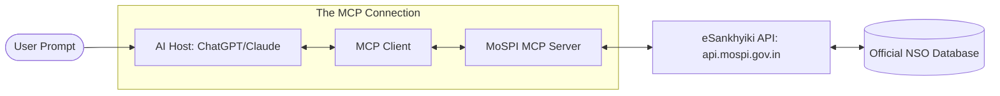
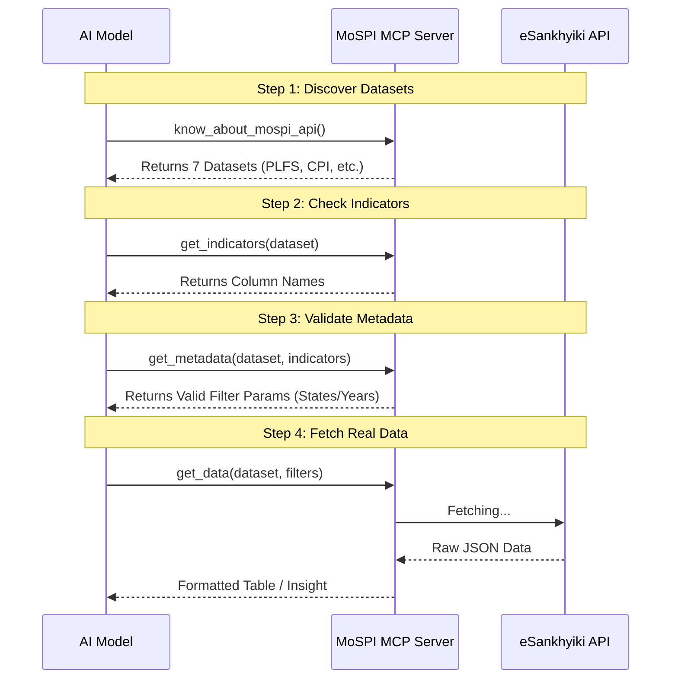
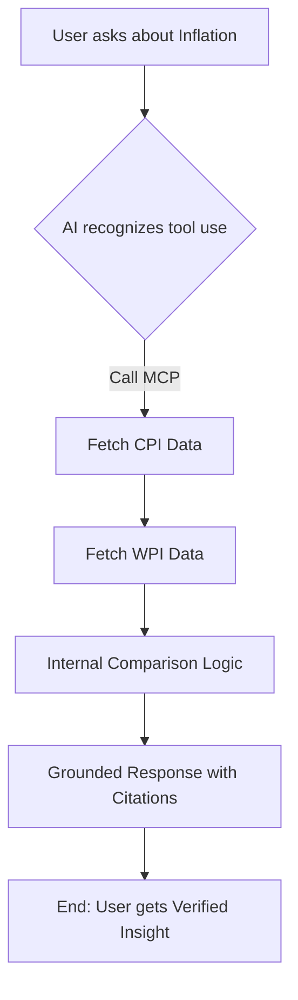

# MoSPI launches beta MCP Server — AI-ready access to official Indian stats

**TL;DR**

- MoSPI’s Feb 6, 2026 beta MCP Server + open-source GitHub repo = AI tools can directly query 7 official NSO datasets. Easy setup, huge potential for data-driven India. 🚀
- Govt of India has launched a beta MCP server that lets AI tools query verified NSO data (jobs, inflation, GDP, industry) directly — fewer hallucinations, more trust, open-source backend.

Quick heads up: the National Statistical Office (MoSPI) launched a beta Model Context Protocol (MCP) server on 6 Feb 2026, which exposes a small set of official eSankhyiki datasets (7 data products in this pilot) so AI tools can query verified government statistics directly. (Official PIB/NSO release [linked here](https://www.pib.gov.in/PressReleasePage.aspx?PRID=2224472).)

Why this matters: MCP is an open standard for connecting models to tools/data (developed by Anthropic) and it makes it easy for assistants like Claude, ChatGPT, Cursor, etc., to fetch attributed government numbers without manual CSV downloads. MoSPI’s DI Lab has the beta page and docs (server URL https://mcp.mospi.gov.in), and the pilot currently covers PLFS, CPI, IIP, ASI, NAS, WPI and Energy/Environmental stats.

## Background and Purpose
The Ministry of Statistics and Programme Implementation (MoSPI), via the National Statistical Office (NSO), launched the beta MCP Server on February 6, 2026. It's part of the Data Innovation (DI) Lab ([linked here](https://datainnovation.mospi.gov.in/mospi-mcp)) and builds on the eSankhyiki Portal (India's central hub for 3,900+ official datasets). The MCP – an open standard from Anthropic – lets AI models fetch live, attributed data securely.

Why this matters: Traditionally, accessing stats meant navigating portals and wrangling data. Now, it's "prompt to insights" for researchers, policymakers, businesses, journalists, and devs. It supports "AI/ML for Official Statistics" (AI.ML 4 OS), democratizing data for better policy, reduced misinformation, and faster analysis on jobs, inflation, GDP, etc. The goal? Strengthen data-driven decisions at all government levels and empower citizens, aligning with global efforts to bridge the AI divide.

Server URL: https://mcp.mospi.gov.in (via DI Lab: https://datainnovation.mospi.gov.in/mospi-mcp).

### High-Level Architecture



## The Seven Datasets
Beta starts with seven core datasets from eSankhyiki, focusing on economic, employment, prices, and energy/environmental indicators. More (like ASUSE for unincorporated enterprises or health stats) are planned as the full catalogue integrates. Here's the full list with descriptions:

1. **Periodic Labour Force Survey (PLFS)**: Quarterly/annual data on employment, unemployment, labor participation (by gender, age, region, sector). Key for job market trends.

2. **Consumer Price Index (CPI)**: Monthly price changes in consumer goods/services (food, housing, etc.). Tracks inflation; includes rural/urban/combined.

3. **Index of Industrial Production (IIP)**: Monthly growth in mining, manufacturing, electricity. Use-based breakdowns (e.g., capital goods) for economic momentum.

4. **Annual Survey of Industries (ASI)**: Annual metrics on organized manufacturing (production, employment, wages, investment). State/industry breakdowns.

5. **National Accounts Statistics (NAS)**: GDP estimates, GVA by sector, savings, investments, per capita income. Macroeconomic overview.

6. **Wholesale Price Index (WPI)**: Wholesale price changes for primary articles, fuel/power, manufactured products. Complements CPI for inflation policy.

7. **Energy Statistics (ENERGY / ENERGY_STATISTICS)**: Covers energy production/consumption, environmental aspects (air/water quality, forest cover, climate). Ties into sustainable development.

### Dataset Reference Table
For quick ideas on queries:

| Dataset | What You Can Ask (Example) |
|---------|----------------------------|
| PLFS | "Compare female labor force participation in urban vs. rural areas for 2024." or "Youth unemployment trends in Bihar vs. Karnataka." |
| CPI / WPI | "Show me the month-on-month food inflation trend for the last year." or "Wholesale vs. retail onion prices over time." |
| NAS (GDP) | "What was the Gross Value Added (GVA) for the manufacturing sector in Q3 2025-26?" or "Latest GDP growth rate." |
| IIP / ASI | "Which industries showed the highest growth in the latest IIP index?" or "Employment in organized manufacturing by state." |
| ENERGY | "Trends in renewable energy production in India over the last decade." or "Fuel and power WPI changes." |

These use official metadata for accurate filtering (e.g., states, years, sectors).

## 📊 Sample AI Output: Economic Pulse Check (FY 2025-26) (illustrative / based on MoSPI published releases as of Feb 6–7, 2026)
To make this tangible, here's what a "grounded" AI response looks like using the MCP Server – no guessing, just real NSO data.

> **User Prompt:** "Using MoSPI data, compare India's latest GDP growth with industrial performance (IIP) for the current fiscal year."
> **AI Response (via MoSPI MCP Server):**
> According to the **National Accounts Statistics (NAS)** and **Index of Industrial Production (IIP)** datasets fetched via the eSankhyiki MCP server:
> | Indicator | Period | Growth Rate (%) | Key Driver |
> | --- | --- | --- | --- |
> | **Real GDP** | FY 2025-26 (FAE) | **7.4%** | Buoyant Services Sector (~9-10% growth) |
> | **Real GVA** | FY 2025-26 (FAE) | **7.3%** | Manufacturing & Construction (7.0%) |
> | **IIP (General)** | Dec 2025 | **7.8%** | 2-year high; Manufacturing at 8.1% |
>
>
> **Insight:** Industrial production (IIP) is currently outpacing the broader GDP growth, led by a strong rebound in manufacturing. The gap between Nominal GDP (8.0%) and Real GDP (7.4%) suggests that inflation remains broadly contained within the NSO's targeted corridors.
> *Source: NSO India / api.mospi.gov.in (Timestamp: Feb 7, 2026)* (Primary source for GDP numbers: PIB press note on First Advance Estimates (Feb 2026).)

## How to Access and Use It
No registration – plug-and-play with no auth. Data is real-time from api.mospi.gov.in, with every response attributed to NSO. For detailed connection guides, check the DI Lab page ([linked here](https://datainnovation.mospi.gov.in/mospi-mcp)). Here's a generic flow:

- **For ChatGPT (Go+ subscription):**
  Add a custom MCP connector via settings, supply URL https://mcp.mospi.gov.in, auth "None". Enable in-chat and query e.g., "Unemployment rate in India 2023-24?" Pro: Refresh connector for updates.

- **For Claude (Pro/Max):**
  Add custom connector in settings: Name "MoSPI Statistics", URL https://mcp.mospi.gov.in. Enable in chat, query e.g., "CPI trend last 5 years."
  Pro Tip: For Claude Desktop, add this JSON snippet to claude_desktop_config.json under the mcpServers key for sidebar access (assumes community-maintained wrapper or official npx tool; otherwise, use the Python method below):
  ```
  {
    "mcpServers": {
      "mospi-stats": {
        "command": "npx",
        "args": [
          "-y",
          "@modelcontextprotocol/server-mospi", 
          "--url", "https://mcp.mospi.gov.in"
        ]
      }
    }
  }
  ```

- **Other Tools/Devs:** Use MCP standard for custom setups.

## The GitHub Repo: https://github.com/nso-india/esankhyiki-mcp
Fully open-source (MIT licensed – confirmed in the LICENSE file, overriding early GPL mentions in description) – view, fork, or contribute. It's the "eSankhyiki MCP Pilot Project" by MoSPI's DIID, built on FastMCP 3.0. Stars: 31, Forks: 4, Contributors: 3, Commits: 3 (active dev as on 7th Feb 2026).

### The 4-Tool Sequential Workflow



- **Key Features:** 4-tool sequential workflow (know_about_mospi_api → get_indicators → get_metadata → get_data) for validation-first queries – critical for devs, as jumping to get_data often fails due to strict params. Swagger YAML for params, OpenTelemetry for tracing (Jaeger-compatible), auto-routing (e.g., CPI groups).

- **Structure:** mospi_server.py (core), Dockerfile/compose for deployment, swagger/ for datasets, tests/, .env.example for config.

- **Setup/Deployment:**
  1. Clone: `git clone https://github.com/nso-india/esankhyiki-mcp`
  2. Install: `venv`, `pip install -r requirements.txt`
  3. Run: `python mospi_server.py` (HTTP: http://localhost:8000/mcp) or stdio for local.
  4. Docker: `docker build -t mospi-mcp && docker run -d -p 8000:8000 mospi-mcp`
  5. Full Stack: `docker-compose up -d` (Jaeger at localhost:16686).
  Transport: SSE for remote (official URL), stdio for local debugging.

Quick Implementation Tips:
1. Always start with get_indicators to check columns, then get_data – ensures valid filters.
2. For custom tools, use fastmcp.Client for sequential calls.
🛠️ Pro-Tip: The FastMCP 3.0 implementation means it's fully compatible with Cursor and Windsurf. Developers can now reference live Indian GDP or CPI data directly in their rules.md or .cursorrules to keep their economic apps up to date without manual API calls.

## Benefits and Why This is a Big Deal 🇮🇳
- **Verified Insights:** Direct NSO access cuts data hunting, boosts accuracy.
- **Accessibility:** Natural queries for non-experts (e.g., "Gold price trends?").
- **Transparency:** Open-source code for verification; fosters startups/academia collab via DI Lab.
- **Impact:** Enables data-driven policy on unemployment, inflation, green energy – key for Viksit Bharat and democratizing AI globally.

### Data-to-Insight Flow


🇮🇳 Why This Matters (The "Viksit Bharat" Connection)  
This launch is a direct outcome of Working Group 6 (Democratising AI Resources). By turning sovereign data into an "AI-ready" resource, India is effectively creating a "Unified Data Interface" (UDI), similar to what UPI did for payments. It’s not just for data nerds; it’s for building the foundation of sovereign AI.

## Security / Privacy Note
Since MCP gives LLMs direct dataset access, a short security note for devs: check the dataset ACLs, be careful exposing credentials (if/when auth is added), and prefer read-only client configs for public data. This preempts predictable community questions.

## Limitations and Beta Notes ⚠️
- Beta: Glitches possible; report via GitHub.
- Scope: Only 7 datasets now (out of 3,900+); microdata like ASUSE still needs manual portal.
- Connectivity: Requires stable link to api.mospi.gov.in; no full internet in queries.
- AI Subs: Needed for ChatGPT/Claude.

## Common Troubleshooting (Beta Phase)
- "Tool not found": If you're on Windows using the Claude Desktop JSON, you may need to use cmd /c npx ... or ensure npx is in your System PATH.
- "Validation Error": This happens if you skip the sequence. Fix: Always ask the AI to "list available indicators for [dataset]" before asking for specific numbers.
- "Empty Response": The server is strictly read-only and pulls from MoSPI APIs. If a query is too broad (e.g., "all data for all states"), it might time out. Fix: Be specific with your filters (e.g., "Karnataka and Bihar for 2024").

## Future Plans
Expansion to more datasets, full eSankhyiki integration, and community feedback for enhancements. Built with Bharat Digital partnership.

Tried it yet? Share setups or queries! Thoughts on how this evolves for Indian data? Encourage readers to file bugs or dataset problems on the GitHub issues page — gives the community a clear action.

Sources: PIB Release, MoSPI DI Lab, GitHub Repo, Economic Times (for context).

## 📚 Appendix: MoSPI MCP Prompt Library

To get the most out of the official MoSPI data, use these prompts. Note that the AI may first say it needs to "list indicators"—this is expected behavior as it validates official filters!

### 🔹 Inflation & Purchasing Power

1. **The Kitchen Budget Check:**
> "Using the **CPI** dataset, compare the inflation rates for 'Cereals', 'Vegetables', and 'Oils and Fats' for the last 12 months. Identify which category had the highest month-on-month volatility."

2. **Wholesale vs. Retail Realities:**
> "Fetch the latest **WPI** and **CPI** for 'Food Articles'. Compare their growth rates. Does the wholesale data suggest that consumer food prices will rise or fall in the next quarter?"

### 🔹 Jobs & The Economy

3. **State-wise Labour Comparison:**
> "Using **PLFS** data, compare the 'Worker Population Ratio' (WPR) and 'Unemployment Rate' (UR) for urban youth (age 15-29) in **Maharashtra, Karnataka, and Uttar Pradesh** for 2024-25."

4. **Gender Participation Trends:**
> "Query the **PLFS** for 'Female Labour Force Participation Rate' (LFPR) across rural and urban India. Has the gap between rural and urban female participation narrowed over the last 3 annual cycles?"

### 🔹 Industrial & Manufacturing Health

5. **Manufacturing Deep-Dive:**
> "Analyze the **IIP** for the current fiscal year. Which 3 manufacturing sub-sectors have consistently outperformed the general index? Cross-reference this with **ASI** data on 'Total Wages Paid' for those sectors."

6. **Energy Transition Snapshot:**
> "Compare the growth in **IIP (Electricity)** with the **ENERGY** dataset's 'Renewable Power Generation' figures. What percentage of our industrial power growth is being driven by renewables?"

### 🔹 Macroeconomic Pulse (GDP)

7. **The GDP Engine Room:**
> "Using **NAS**, break down the latest GDP growth by sector (Agriculture, Industry, Services). Create a table showing the % contribution of each to the total GVA for Q3 FY2025-26."

8. **Investment Patterns:**
> "Access **National Accounts Statistics** to find the 'Gross Fixed Capital Formation' (GFCF) as a percentage of GDP for the last 5 years. Does the trend indicate a revival in private investment?"

### 🔹 Complex "Stress Tests"

9. **Fuel vs. Industry Correlation:**
> "Retrieve the **WPI** for 'Fuel & Power' and the **IIP** for 'Manufacturing'. Check if a 5% increase in fuel WPI typically correlates with a slowdown in manufacturing output within a 2-month lag."

10. **The "Viksit Bharat" Baseline:**
> "Generate a comprehensive 'National Economic Snapshot' using **all available tools**. Include: 1) Real GDP growth, 2) Combined CPI, 3) National UR (Unemployment), and 4) Overall IIP growth. Summarize the state of the economy in three bullet points."
