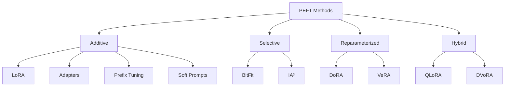
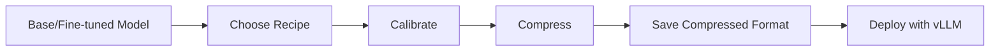

# Parameter-Efficient Fine-Tuning (PEFT) & Model Compression Guide

## Executive Summary

This guide covers two complementary approaches to making Large Language Models practical and deployable:

1. **Parameter-Efficient Fine-Tuning (PEFT)**: Techniques for adapting models to specific tasks using minimal trainable parameters
2. **Model Compression**: Post-training optimization for reducing memory, latency, and deployment costs

**PEFT Benefits:**
- Train on consumer GPUs (single GPU instead of clusters)
- Reduce memory usage by 40-75%
- Maintain 90-95% of full fine-tuning accuracy
- Enable multiple task-specific adapters from one base model

**Compression Benefits:**
- Reduce VRAM requirements by 50-75%
- Increase throughput by 2-4x
- Lower latency by 40-60%
- Decrease deployment costs and energy usage

**Typical Production Pipeline:**
```
Base Model → Fine-Tune (PEFT) → Compress (Quantization/Sparsity) → Deploy (vLLM)
```

---

## Table of Contents

1. [Introduction to PEFT](#1-introduction-to-peft)
2. [Core PEFT Categories](#2-core-peft-categories)
3. [Low-Rank Adaptation Methods](#3-low-rank-adaptation-methods)
4. [Prompt-Based Methods](#4-prompt-based-methods)
5. [Alignment and Preference Optimization](#5-alignment-and-preference-optimization)
6. [Advanced PEFT Methods](#6-advanced-peft-methods)
7. [Model Compression for Deployment](#section-7-model-compression-for-deployment)

---

## 1. Introduction to PEFT

### What is PEFT?

Parameter-Efficient Fine-Tuning adapts pre-trained LLMs to specific tasks by updating only a small subset of model parameters (typically 0.01% - 3%). This contrasts with full fine-tuning, which updates all billions of parameters.

### Why Use PEFT?

**Traditional Fine-Tuning Challenges:**
- Requires expensive hardware (multiple high-end GPUs)
- High memory consumption (780GB+ for 65B models)
- Long training times
- Difficult to manage multiple task-specific models

**PEFT Solutions:**
- Single GPU training for large models
- Memory reduction up to 75%
- Faster training (2-3x speedup)
- Multiple adapters from one base model

---

## 2. Core PEFT Categories



### Additive Methods
Add new trainable parameters to the base model while freezing original weights.

### Selective Methods
Update only specific existing parameters (like bias terms or activation scalers).

### Reparameterized Methods
Transform the weight update process through decomposition or alternative representations.

### Hybrid Methods
Combine multiple approaches (e.g., quantization + low-rank adaptation).

---

## 3. Low-Rank Adaptation Methods

### 3.1 LoRA (Low-Rank Adaptation)

**How it Works:**
Decomposes weight updates into two small matrices (A and B) instead of updating full weight matrices.

**Formula:** `ΔW = B × A` where rank r << original dimensions

**Key Features:**
- Updates 0.01% - 1% of parameters
- No inference latency (adapters merge into base model)
- Typical configuration: rank=8-32, alpha=16, dropout=0.1

**Performance:**
- Reduces trainable parameters by 10,000x
- Matches full fine-tuning on most tasks
- Works well for 7B+ parameter models

**Use Cases:**
- Text generation and classification
- Domain adaptation
- Multi-task learning with swappable adapters

**Implementation:**
```python
from peft import LoraConfig, get_peft_model

config = LoraConfig(
    r=8,                    # Rank
    lora_alpha=16,          # Scaling factor
    lora_dropout=0.1,       # Dropout rate
    target_modules=["q_proj", "v_proj"]  # Which layers to adapt
)

model = get_peft_model(base_model, config)
```

---

### 3.2 QLoRA (Quantized LoRA)

**How it Works:**
Combines LoRA with 4-bit quantization of base model weights. Uses three key optimizations:
1. **4-bit NormalFloat (NF4):** Optimized quantization for normally distributed weights
2. **Double Quantization:** Quantizes both weights and quantization constants
3. **Paged Optimizers:** Prevents memory spikes during training

**Key Features:**
- Trains 70B models on <48GB VRAM
- Matches 16-bit full fine-tuning accuracy
- Storage in 4-bit, computation in 16-bit
- Requires more LoRA adapters than standard LoRA

**Performance:**
- Memory reduction: 75% vs standard LoRA
- Training speed: Slightly slower than LoRA (due to quantization/dequantization)
- Quality: No significant accuracy loss

**Use Cases:**
- Consumer GPU fine-tuning (single RTX 3090/4090)
- Large model adaptation (30B-70B parameters)
- Research and experimentation on limited budgets

**Implementation:**
```python
from transformers import BitsAndBytesConfig
from peft import LoraConfig, prepare_model_for_kbit_training

# 4-bit quantization config
bnb_config = BitsAndBytesConfig(
    load_in_4bit=True,
    bnb_4bit_quant_type="nf4",
    bnb_4bit_use_double_quant=True,
    bnb_4bit_compute_dtype=torch.bfloat16
)

# Load quantized model
model = AutoModelForCausalLM.from_pretrained(
    model_name,
    quantization_config=bnb_config,
    device_map="auto"
)

model = prepare_model_for_kbit_training(model)

# Apply LoRA (target all linear layers for QLoRA)
lora_config = LoraConfig(
    r=16,
    lora_alpha=32,
    target_modules="all-linear",  # QLoRA best practice
    lora_dropout=0.05
)
```

**LoRA vs QLoRA Decision Matrix:**

| Factor | Choose LoRA | Choose QLoRA |
|--------|-------------|--------------|
| GPU Memory | >40GB VRAM | <40GB VRAM |
| Model Size | <13B params | >13B params |
| Training Speed | Priority | Can sacrifice |
| Inference | Frequent | Infrequent |
| Accuracy | Maximum | 95%+ acceptable |

---

### 3.3 DoRA (Weight-Decomposed LoRA)

**How it Works:**
Decomposes pre-trained weights into magnitude and direction components. Applies LoRA only to the direction while learning a separate magnitude parameter.

**Formula:** `W' = m × (W + ΔW) / ||W + ΔW||`

**Key Features:**
- Outperforms LoRA by 2-5% on reasoning tasks
- Better performance at low ranks (rank 8 matches LoRA rank 32)
- No inference overhead (merges like LoRA)
- More stable training than LoRA

**Performance:**
- LLaMA-7B: +3.7% accuracy over LoRA
- LLaMA-13B: +1.0% accuracy over LoRA
- Llama 3 8B: +4.4% accuracy over LoRA
- Better generalization across tasks

**Use Cases:**
- Complex reasoning tasks (math, coding)
- When quality is critical
- Low-rank training scenarios
- Alternative to full fine-tuning

**Implementation:**
```python
from peft import LoraConfig

config = LoraConfig(
    r=8,
    lora_alpha=16,
    use_dora=True,  # Enable DoRA
    target_modules=["q_proj", "v_proj", "k_proj", "o_proj"]
)
```

---

### 3.4 VeRA (Vector-based Random Matrix Adaptation)

**How it Works:**
Uses shared frozen random matrices across all layers, with only small scaling vectors trained per layer.

**Key Features:**
- Extreme parameter efficiency (~0.0005% trainable)
- Shared random projection across layers
- Layer-specific scaling vectors

**Performance:**
- Can match LoRA with 10x fewer parameters
- Sensitive to random initialization
- Works best combined with DoRA (DVoRA)

**Use Cases:**
- Extremely limited memory scenarios
- Multiple adapters with minimal storage
- Experimentation on edge devices

---

## 4. Prompt-Based Methods

### 4.1 Prefix Tuning

**How it Works:**
Adds trainable soft prefix tokens to input sequences at each layer, conditioning model behavior.

**Key Features:**
- Updates ~0.1% of parameters
- Prefix length: typically 20-100 tokens
- Strong for generation tasks
- Less effective for classification

**Use Cases:**
- Text generation (summarization, translation)
- Long-sequence tasks
- When task-specific prompting is insufficient

**Implementation:**
```python
from peft import PrefixTuningConfig

config = PrefixTuningConfig(
    num_virtual_tokens=20,
    prefix_projection=True
)
```

---

### 4.2 P-Tuning

**How it Works:**
Learns continuous prompt embeddings automatically instead of discrete prompts.

**Versions:**
- **P-Tuning v1:** Input-level prompts
- **P-Tuning v2:** Multi-layer prompts (more stable)

**Key Features:**
- Updates <0.01% of parameters
- Robust to prompt engineering
- Effective on GLUE benchmarks

**Use Cases:**
- Classification tasks
- Sentiment analysis
- When discrete prompts perform poorly

---

### 4.3 Soft Prompts (Prompt Tuning)

**How it Works:**
Learns dense, trainable vectors prepended to inputs while keeping LLM frozen.

**Key Features:**
- Scales with model size (better on >1B parameters)
- Prompt length optimization needed
- Can outperform GPT-3 few-shot learning

**Use Cases:**
- Large models (>10B parameters)
- Domain-specific adaptation
- When full fine-tuning is impractical

---

## 5. Alignment and Preference Optimization

### 5.1 RLHF (Reinforcement Learning from Human Feedback)

**How it Works:**
Three-stage process:
1. Supervised fine-tuning (SFT)
2. Train reward model on human preferences
3. Optimize policy with PPO using reward model

**Key Features:**
- Industry standard for alignment
- Used in ChatGPT, Claude, Gemini
- Requires human annotation
- PPO optimization can be unstable

**Challenges:**
- Human annotation expensive (~$1-5 per comparison)
- PPO memory-intensive (2x model size)
- Sensitive to hyperparameters
- Training instability

**Use Cases:**
- Safety alignment
- Helpfulness optimization
- Production chatbots

---

### 5.2 DPO (Direct Preference Optimization)

**How it Works:**
Eliminates reward model by treating alignment as classification on preference pairs. Directly optimizes policy using preference data.

**Key Features:**
- No reward model needed
- 2-3x faster than RLHF
- More stable training than PPO
- 40-75% lower compute cost

**Performance:**
- Achieves 90-95% of RLHF alignment
- Better stability and convergence
- Simpler implementation

**Key Parameters:**
- Beta (β): Controls divergence from reference model (0.1-0.5)
- Learning rate: 10-100x smaller than SFT (e.g., 5e-6 vs 2e-4)

**Use Cases:**
- Cost-effective alignment
- Academic research
- Offline preference optimization
- When PPO instability is problematic

**Implementation:**
```python
from trl import DPOTrainer, DPOConfig

config = DPOConfig(
    beta=0.1,                    # KL penalty strength
    learning_rate=5e-6,          # Much smaller than SFT
    per_device_train_batch_size=2
)

trainer = DPOTrainer(
    model=model,
    ref_model=ref_model,         # Reference model (copy of SFT model)
    train_dataset=preference_data,
    tokenizer=tokenizer,
    args=config
)
```

---

### 5.3 GRPO (Group Relative Policy Optimization)

**How it Works:**
Generates multiple responses per prompt (group), computes relative advantages within the group using group normalization, and optimizes policy without a value network.

**Formula for Advantage:**
```
A_i = (r_i - mean(r_group)) / (std(r_group) + ε)
```

**Key Features:**
- No critic/value model needed (reduces memory)
- Group-based normalization (typically 4-16 samples)
- Reverse KL regularization for stability
- Better for multi-step reasoning

**Performance:**
- Used in DeepSeek-R1
- Outperforms PPO on reasoning tasks
- More sample-efficient than pairwise methods
- Can work with as few as 2 samples (2-GRPO)

**Advantages over PPO:**
- Lower memory usage (no value network)
- More stable training
- Better for structured reasoning

**Advantages over DPO:**
- Learns from multiple ranked outputs
- Better for reasoning tasks with verifiable rewards
- More flexible reward signals

**Use Cases:**
- Math and coding tasks
- Chain-of-thought reasoning
- When multiple responses can be verified
- Reinforcement learning with verifiable rewards (RLVR)

**Implementation:**
```python
# Typical GRPO configuration
config = GRPOConfig(
    group_size=8,              # Number of samples per prompt
    kl_coef=0.05,             # KL penalty
    learning_rate=1e-5,
    per_device_train_batch_size=1
)
```

**Group Size Trade-offs:**

| Group Size | Memory | Quality | Speed |
|------------|--------|---------|-------|
| 2 (2-GRPO) | Low | Good | Fast |
| 8 | Medium | Better | Medium |
| 16 | High | Best | Slow |

---

### 5.4 RLAIF (RL from AI Feedback)

**How it Works:**
Replaces human annotators with AI judges (LLMs) for generating preference labels.

**Key Features:**
- Scales without human annotators
- Uses AI models to rate/compare responses
- Mirrors RLHF pipeline with synthetic preferences

**Advantages:**
- Cost reduction (1000x cheaper than human labels)
- Rapid iteration
- Scalable to millions of examples

**Risks:**
- AI judge biases propagate
- May miss subtle human preferences
- Quality depends on judge model

**Use Cases:**
- Constitutional AI
- Iterative model improvement
- When human annotation is impractical

---

### 5.5 ORPO (Odds Ratio Preference Optimization)

**How it Works:**
Uses odds ratio loss instead of DPO's Bradley-Terry model. Single-stage optimization without needing SFT.

**Key Features:**
- More stable than DPO
- Simpler than RLHF
- Can skip SFT stage

**Use Cases:**
- Alternative to DPO
- When training stability is critical

---

### 5.6 KTO (Kahneman-Tversky Optimization)

**How it Works:**
Based on prospect theory from behavioral economics. Treats losses and gains asymmetrically (overweights losses).

**Key Features:**
- Handles imbalanced preference data
- Human-aligned loss weighting
- Better for scenarios with sparse positive examples

**Use Cases:**
- Imbalanced datasets
- Safety-critical alignment
- When human psychology matters

---

## 6. Advanced PEFT Methods

### 6.1 Adapter Tuning

**How it Works:**
Inserts small feed-forward networks (adapters) between transformer layers. Only adapters are trained.

**Variants:**
- **Series Adapters (Houlsby):** After attention and FFN
- **Parallel Adapters (Pfeiffer):** Parallel to FFN
- **Compacter:** Uses hypercomplex multiplication

**Key Features:**
- Modular (easy to add/remove)
- Updates 0.5-3% of parameters
- Minor inference overhead (~1-2%)
- Effective for 7B+ models

**Use Cases:**
- Multi-task scenarios
- When modularity is valuable
- Domain adaptation with task switching

**Implementation:**
```python
from peft import AdapterConfig, get_peft_model

config = AdapterConfig(
    adapter_type="houlsby",    # or "pfeiffer"
    adapter_dim=64,
    adapter_dropout=0.1
)
```

---

### 6.2 BitFit

**How it Works:**
Fine-tunes only bias terms in the model, freezing all other weights.

**Key Features:**
- Extreme efficiency (<0.1% parameters)
- Fast training
- Competitive on GLUE benchmarks
- Limited expressiveness

**Use Cases:**
- Quick task adaptation
- Similar domain shifts
- Minimal resource scenarios

---

### 6.3 (IA)³ (Infused Adapter)

**How it Works:**
Rescales activations using learned vectors. Modifies key/value projections and FFN outputs.

**Key Features:**
- Selective PEFT
- ~0.01% parameters
- No architectural changes
- Effective in low-data regimes

**Use Cases:**
- Very limited training data
- When simplicity is critical
- Transformer-only applications

---

### 6.4 Instruction Tuning

**How it Works:**
Trains on (instruction, output) pairs to improve following user directives.

**Key Features:**
- Bridges pre-training and task execution
- Enhances zero/few-shot learning
- Foundation for chat models
- Often precedes RLHF

**Popular Datasets:**
- **FLAN:** 4.4M instruction instances
- **xP3:** 81M multilingual instructions
- **Alpaca:** 52K synthetic instructions

**Risks:**
- Can create superficial alignment (mimics format without understanding)
- Quality depends on instruction diversity

**Use Cases:**
- Creating instruction-following models
- Foundation for conversational AI
- Zero-shot task generalization

---

### 6.5 Multi-Task Fine-Tuning

**How it Works:**
Trains single model on multiple tasks simultaneously with shared parameters.

**Key Features:**
- Improves cross-task transfer
- Single model serves multiple purposes
- Risk of task interference

**Use Cases:**
- General-purpose assistants
- When model deployment cost matters
- Transfer learning scenarios

---

### 6.6 Federated Fine-Tuning

**How it Works:**
Aggregates model updates from decentralized devices without sharing raw data.

**Key Features:**
- Privacy-preserving
- Decentralized training
- Works with PEFT methods (especially LoRA)
- Communication overhead

**Use Cases:**
- Healthcare (HIPAA compliance)
- Mobile/edge AI
- Privacy-regulated industries

---

# Section 7: Model Compression for Deployment

## 7.1 Overview: Compression vs PEFT

**Key Distinction:**

PEFT and compression serve different purposes and are typically used sequentially:

| Aspect | PEFT (Fine-Tuning) | Compression |
|--------|-------------------|-------------|
| **Goal** | Adapt model behavior/capabilities | Optimize inference efficiency |
| **When Applied** | During model development | Post-training, pre-deployment |
| **What Changes** | Model weights (task-specific) | Weight representation (memory/speed) |
| **Data Needed** | Task-specific labeled data (1k-100k samples) | Little/no data (calibration only, 128-512 samples) |
| **Primary Benefit** | Better task performance, alignment | Lower latency, memory, deployment cost |
| **Typical Methods** | LoRA, QLoRA, DoRA, DPO | Quantization, sparsification, distillation |

**Standard Production Pipeline:**
```
Base Model → Fine-Tune (PEFT) → Compress → Deploy (vLLM/TensorRT)
          ↓                    ↓           ↓
      (Behavior)          (Efficiency)  (Serving)
```

**Complementary Nature:**
- Fine-tune a 7B model with LoRA to specialize it for your domain
- Compress the fine-tuned model with W4A16 quantization
- Deploy with vLLM for 3x throughput improvement
- Result: Domain-specialized model running efficiently at scale

---

## 7.2 Quantization: Reducing Numerical Precision

**What is Quantization?**
Converts model weights and activations from high precision (FP32, BF16, FP16) to lower precision (INT8, INT4, FP8) to reduce memory and increase speed.

### Quantization Approaches

**Post-Training Quantization (PTQ):**
- Applied after full training
- No retraining required — ideal for compressing pre-trained LLMs
- Works well down to 4-bit with minimal loss (using methods like GPTQ/AWQ)
- Lower precision (e.g., <4-bit) usually causes significant degradation

**Quantization-Aware Training (QAT):**
- Simulates low-precision during training (fake quantization)
- Allows extreme compression (even 1-2 bit models) with recovered performance
- Requires full or significant retraining — expensive for large LLMs
- Used when maximum compression is needed and training budget allows

**Practical Note for LLMs:** PTQ is dominant due to training costs; QAT is more common for smaller models or research into binary/ternary LLMs.

### Common Quantization Schemes

| Scheme | Weights | Activations | VRAM Reduction | Quality | Hardware Support |
|--------|---------|-------------|----------------|---------|------------------|
| **W8A8** | INT8 | INT8 | ~50% | Excellent | Universal |
| **W4A16** | INT4 | FP16 | ~75% | Good | NVIDIA, AMD |
| **FP8** | FP8 | FP8 | ~50% | Excellent | H100, H200 |
| **NVFP4** | FP4 | FP16 | ~75% | Good | H100+ (experimental) |

### Quantization Algorithms

**1. RTN (Round to Nearest):**
- Fastest, simplest
- No calibration needed
- Lower quality (2-3% accuracy loss)
- Use for: Quick baseline, ablation studies

**2. GPTQ (Gradient-based PTQ):**
- Industry standard for W4A16
- Uses second-order information (Hessian)
- Requires 128-512 calibration samples
- Quality: <1% loss at W4A16
- Use for: Production W4A16 compression

**3. AWQ (Activation-aware Weight Quantization):**
- Protects salient weights based on activation magnitudes
- Often better than GPTQ on reasoning tasks
- Similar calibration requirements
- Use for: W4A16 with emphasis on reasoning quality

**4. SmoothQuant:**
- Migrates quantization difficulty from activations to weights
- Best for W8A8 schemes
- Requires calibration
- Use for: INT8 quantization with activation quantization

### Implementation Example

```python
from transformers import AutoModelForCausalLM
from llmcompressor import quantize

# 1. Load base model (or fine-tuned model)
model = AutoModelForCausalLM.from_pretrained("meta-llama/Llama-2-7b-hf")

# 2. Prepare calibration data (small sample from training distribution)
from datasets import load_dataset
calib_data = load_dataset("HuggingFaceH4/ultrachat_200k", split="train[:512]")

# 3. Apply quantization
compressed = quantize(
    model=model,
    scheme="W4A16",         # 4-bit weights, 16-bit activations
    algorithm="GPTQ",       # Use GPTQ algorithm
    calibration_data=calib_data,
    group_size=128          # Quantization block size
)

# 4. Save in compressed format
compressed.save_pretrained("./llama2-7b-gptq-w4a16")

# 5. Deploy with vLLM
from vllm import LLM
llm = LLM(model="./llama2-7b-gptq-w4a16")
outputs = llm.generate("What is machine learning?")
```

### Dynamic vs Static Quantization

**Static Quantization:**
- Scales computed once during calibration
- Faster inference (no runtime overhead)
- Used for W4A16, W8A8

**Dynamic Quantization:**
- Scales computed per-token at runtime
- Better quality for varied inputs
- Used for FP8 schemes
- Example: FP8 dynamic per-token quantization

```python
# FP8 dynamic quantization (H100)
from vllm import LLM

llm = LLM(
    model="meta-llama/Llama-2-70b-hf",
    quantization="fp8",
    kv_cache_dtype="fp8"  # Also compress KV cache
)
```

---

## 7.3 Sparsification: Structured Pruning

**What is Sparsification?**
Zeroing out weights in structured patterns to reduce computation while maintaining accuracy.

### Pruning Types

**Unstructured Pruning:**
- Removes individual weights arbitrarily
- High sparsity possible (60-90%)
- Requires specialized sparse tensor hardware for speedups
- Limited real-world acceleration on current GPUs

**Structured Pruning:**
- Removes entire structures (neurons, channels, heads, layers)
- Naturally reduces computation without sparsity
- Hardware-friendly but less aggressive compression
- Common in LLMs: N:M patterns (e.g., 2:4)

### Key Sparsity Patterns

**1. N:M Sparsity (Semi-Structured):**
- Most common: **2:4 sparsity** (2 zeros in every 4 consecutive weights)
- Hardware-accelerated on NVIDIA Ampere+ (A100, H100)
- ~50% theoretical speedup
- <1-2% accuracy loss with proper pruning

**2. Unstructured Sparsity:**
- Any weights can be zero
- Higher compression potential (60-80%)
- Limited hardware support
- Better for research than production

### Sparsification Algorithms

**1. Magnitude Pruning:**
- Remove smallest-magnitude weights
- Simple, fast
- Quality degrades at >50% sparsity

**2. SparseGPT:**
- Layer-wise reconstruction approach
- Better quality preservation
- Can achieve 50-60% sparsity with <1% loss
- Recommended for production

**3. Wanda (Weights and Activations):**
- Prunes based on weight × activation magnitude
- No backpropagation needed
- Better than weight-only methods

### Implementation

```python
from llmcompressor import sparsify

sparse_model = sparsify(
    model=model,
    sparsity_pattern="2:4",        # N:M pattern
    algorithm="SparseGPT",         # Pruning algorithm
    calibration_data=calib_data,
    target_sparsity=0.5            # 50% weights zeroed
)
```

### Combining Quantization + Sparsity

Maximum compression with both techniques:

```python
from llmcompressor import compress

compressed = compress(
    model=model,
    quantization={
        "scheme": "W4A16",
        "algorithm": "GPTQ"
    },
    sparsity={
        "pattern": "2:4",
        "algorithm": "SparseGPT"
    },
    calibration_data=calib_data
)
```

**Expected Results (Llama-2-70B):**

| Technique | VRAM | Throughput | Quality Loss |
|-----------|------|------------|--------------|
| Baseline (BF16) | 140GB | 1x | 0% |
| W8A8 (INT8) | 70GB | 1.8x | <1% |
| W4A16 (GPTQ) | 35GB | 2.5x | 1-2% |
| W4A16 + 2:4 Sparse | 35GB | 3.5-4x | 2-3% |
| FP8 (H100) | 70GB | 2.2x | <0.5% |

---

## 7.4 KV-Cache Quantization

**Problem:**
During inference, storing past key-value pairs for attention consumes massive memory, especially for long contexts.

**Solution:**
Quantize KV-cache to INT8 or FP8 (separate from weight quantization).

**Benefits:**
- 50-75% KV-cache memory reduction
- Support for longer context lengths
- Larger batch sizes for throughput
- Minimal quality impact (<0.5% degradation)

**Implementation:**
```python
from vllm import LLM

llm = LLM(
    model="path/to/model",
    kv_cache_dtype="fp8",      # Quantize KV cache
    max_model_len=32768        # Longer context enabled
)
```

**When Critical:**
- Long context applications (>8K tokens)
- High-throughput serving (many concurrent users)
- Limited VRAM with long sequences

---

## 7.5 LLM Compressor: Practical Framework

**What is LLM Compressor?**
Open-source toolkit from Neural Magic for systematically applying quantization and sparsity to LLMs for deployment.

**Key Features:**
- Pre-validated compression recipes
- One-command compression
- vLLM integration for serving
- Supports all major quantization schemes

**Typical Workflow:**



**Quick Start:**

```python
from llmcompressor.recipes import get_recipe
from llmcompressor import compress

# 1. Load fine-tuned model
model = AutoModelForCausalLM.from_pretrained("./my-finetuned-llama")

# 2. Use pre-validated recipe
recipe = get_recipe("w4a16_gptq")  # or "fp8_dynamic", "2:4_sparse_w8a8"

# 3. Compress with recipe
compressed = compress(
    model=model,
    recipe=recipe,
    calibration_data=calib_data
)

# 4. Save and deploy
compressed.save_pretrained("./compressed-model", format="compressed-tensors")
```

**Available Recipes:**
- `fp8_dynamic_per_token` - FP8 for H100 (highest quality)
- `w4a16_gptq` - 4-bit GPTQ (maximum compression)
- `w8a8_smoothquant` - INT8 (balanced)
- `2:4_sparse_w8a8` - Sparsity + INT8 (maximum speedup)

---

## 7.6 Other Compression Approaches

### 1. Knowledge Distillation (Expanded with practical details)

**Concept:** Train smaller "student" model to mimic larger "teacher" model.

**Process:**
```
Large Model (Teacher) → Generate soft labels → Train Small Model (Student)
```

**Detailed Mechanism:**
- **Soft Targets:** Instead of hard one-hot labels, use teacher's softened probability distribution (logits)
- **Temperature Scaling:** Apply temperature T > 1 to logits before softmax to increase entropy and reveal inter-class relationships
  - Softened probability: `p_i = softmax(logits / T)`
- **Distillation Loss:** KL Divergence between teacher and student softened distributions
- **Combined Loss:** α × distillation_loss + (1-α) × standard_cross_entropy (on ground truth)
- **Synthetic Data Distillation:** Teacher generates instruction-response pairs to train student (e.g., Alpaca used ChatGPT outputs to train LLaMA-7B)

**Key Observations:**
- Student models can sometimes outperform teacher on downstream tasks (Occam's razor — simpler models generalize better when teacher is overparameterized)
- Often combined with quantization for 5-10x total size reduction

**Characteristics:**
- Creates entirely new smaller model
- Not parameter-efficient (requires full training)
- Can achieve 2-4x compression with 5-10% quality loss
- Examples: DistilBERT (66% smaller than BERT), TinyLLaMA

**When to Use:**
- Need smallest possible model
- Can afford training from scratch
- Target deployment is extremely constrained (mobile, edge)

**Comparison to Quantization:**
- Distillation: New smaller architecture
- Quantization: Same architecture, different precision

### 2. GGUF Format (llama.cpp ecosystem)

**Purpose:** CPU and Metal (Apple Silicon) optimized quantization format.

**Key Schemes:**
- Q4_0, Q4_K_M: 4-bit quantization variants
- Q5_K_M: 5-bit (better quality)
- Q8_0: 8-bit (highest quality)

**Characteristics:**
- Optimized for CPU inference (x86, ARM)
- Used by Ollama, LM Studio, local deployment tools
- Different from GPU-focused formats (vLLM)

**When to Use:**
- Deploying on laptops, edge devices without GPUs
- Local/offline inference requirements
- Consumer hardware (M1/M2 Macs, consumer CPUs)

**Conversion:**
```bash
# Convert HuggingFace model to GGUF
python convert.py model.safetensors --outfile model.gguf

# Quantize to Q4_K_M
./quantize model.gguf model-q4_k_m.gguf Q4_K_M
```

### 3. TensorRT-LLM (NVIDIA)

**Purpose:** NVIDIA's optimized inference engine with built-in quantization.

**Key Features:**
- FP8, INT4, INT8 quantization
- Fused kernels for maximum throughput
- Multi-GPU inference optimization
- Best performance on NVIDIA GPUs

**When to Use:**
- Production deployment on NVIDIA infrastructure
- Need maximum throughput on A100/H100
- Willing to invest in conversion/optimization

### 4. MLX (Apple)

**Purpose:** Apple Silicon optimized framework.

**Key Features:**
- Unified memory architecture optimization
- Quantization for M-series chips
- Native Metal acceleration

**When to Use:**
- Deploying on Apple Silicon (M1/M2/M3)
- macOS-specific applications

---

## 7.7 Compression Decision Matrix

### By Hardware Target

| Hardware | Best Approach | Scheme | Framework |
|----------|---------------|--------|-----------|
| NVIDIA H100/H200 | FP8 dynamic | FP8 | vLLM + LLM Compressor |
| NVIDIA A100/A6000 | W4A16 or 2:4 sparse W8A8 | GPTQ + Sparsity | vLLM + LLM Compressor |
| NVIDIA RTX 4090 | W4A16 | GPTQ/AWQ | vLLM or ExLLaMA |
| Apple M1/M2/M3 | Q4_K_M | GGUF | llama.cpp/Ollama |
| CPU (x86/ARM) | Q4_0, Q5_K_M | GGUF | llama.cpp |
| AMD Instinct | W8A8 | INT8 | vLLM |

### By Use Case

| Use Case | Priority | Recommended Compression |
|----------|----------|------------------------|
| **Production API (high QPS)** | Throughput | FP8 (H100) or W4A16 + KV-cache quantization |
| **Long context (>16K tokens)** | Memory | W4A16 + FP8 KV-cache |
| **Edge deployment** | Model size | Q4_K_M (GGUF) |
| **Highest quality** | Accuracy | W8A8 or FP8 |
| **Maximum speedup** | Speed | W4A16 + 2:4 sparsity |
| **Local/offline** | Privacy | Q4/Q5 GGUF on CPU/Metal |

### By Model Size

| Model Size | VRAM Available | Compression Strategy |
|------------|----------------|---------------------|
| 7B | 24GB (RTX 4090) | W4A16 or no compression |
| 13B | 24GB | W4A16 required |
| 70B | 48GB (A6000) | W4A16 + KV-cache FP8 |
| 70B | 80GB (A100) | FP8 or W8A8 |
| 70B | 2x80GB (A100) | FP8 for max throughput |

---

## 7.8 Integration with PEFT

**Optimal Production Workflow:**

```
1. Base Model (Llama-2-7B, BF16)
   ↓
2. Fine-Tune with QLoRA (Section 3.2)
   - 4-bit base model + LoRA adapters
   - Train on domain-specific data
   ↓
3. Merge LoRA adapters
   - model.merge_and_unload()
   ↓
4. Compress merged model (This section)
   - Apply W4A16 GPTQ or FP8
   - KV-cache quantization
   ↓
5. Deploy with vLLM
   - 3-4x throughput improvement
   - 75% VRAM reduction
```

**Example End-to-End:**

```python
# Step 1-3: Fine-tune with QLoRA (from Section 3.2)
from peft import LoraConfig, get_peft_model
from transformers import AutoModelForCausalLM, BitsAndBytesConfig

bnb_config = BitsAndBytesConfig(load_in_4bit=True, ...)
model = AutoModelForCausalLM.from_pretrained("meta-llama/Llama-2-7b-hf", 
                                              quantization_config=bnb_config)
lora_config = LoraConfig(r=16, lora_alpha=32, ...)
model = get_peft_model(model, lora_config)

# Train...
trainer.train()

# Merge adapters
model = model.merge_and_unload()
model.save_pretrained("./finetuned-llama-merged")

# Step 4: Compress the fine-tuned model
from llmcompressor import quantize

compressed = quantize(
    model="./finetuned-llama-merged",
    scheme="W4A16",
    algorithm="GPTQ",
    calibration_data=calib_data
)
compressed.save_pretrained("./finetuned-llama-compressed")

# Step 5: Deploy
from vllm import LLM
llm = LLM(model="./finetuned-llama-compressed", kv_cache_dtype="fp8")
```

**Why This Order?**
1. **QLoRA training**: Memory-efficient fine-tuning
2. **Merge adapters**: Get full fine-tuned weights
3. **Compression**: Optimize merged model for inference
4. **Deploy**: Serve with maximum efficiency

**Alternative: Compress then Fine-Tune?**
- Possible but less common
- Use quantization-aware fine-tuning
- More complex, limited tooling support
- Standard approach (fine-tune → compress) is simpler and well-validated

---

## 7.9 Compression Best Practices

### Calibration Data Selection

**Guidelines:**
- Use 128-512 samples representative of inference distribution
- More data ≠ better (diminishing returns after 512 samples)
- Prioritize diversity over quantity
- Include edge cases if critical

```python
# Good calibration set
calib_data = dataset.select(range(256))  # 256 diverse samples

# Poor calibration set
calib_data = dataset.select(range(10000))  # Unnecessary, slower
```

### Quality Validation

**Essential Checks Before Deployment:**

1. **Perplexity:** Should increase <5% for W4A16, <1% for W8A8/FP8
2. **Task-specific metrics:** Test on your actual use case
3. **Edge cases:** Test rare but important scenarios
4. **Long context:** Verify quality doesn't degrade at max context length

```python
# Validation script
from evaluate import load

# 1. Perplexity check
original_ppl = evaluate_perplexity(original_model, eval_set)
compressed_ppl = evaluate_perplexity(compressed_model, eval_set)
degradation = (compressed_ppl - original_ppl) / original_ppl
assert degradation < 0.05, f"Perplexity degraded {degradation*100:.1f}%"

# 2. Task accuracy
accuracy = load("accuracy")
results = accuracy.compute(predictions=preds, references=labels)
```

### Common Pitfalls

**Problem 1: Over-aggressive compression**
- Symptom: >5% quality degradation
- Solution: Use W8A8 instead of W4A16, or reduce sparsity

**Problem 2: Wrong calibration data**
- Symptom: Good perplexity but poor task performance
- Solution: Use task-specific calibration data

**Problem 3: KV-cache not quantized**
- Symptom: Still running out of memory on long contexts
- Solution: Enable `kv_cache_dtype="fp8"`

**Problem 4: Incompatible serving runtime**
- Symptom: Compressed model won't load
- Solution: Use vLLM or compatible runtime, ensure correct format

### Monitoring in Production

**Key Metrics:**
- Latency (P50, P95, P99)
- Throughput (tokens/second)
- GPU utilization
- Memory usage
- Quality metrics (task-specific)

**Red Flags:**
- Latency spikes (>2x expected)
- Quality degradation over time
- Memory leaks
- GPU underutilization (<70%)

---

## Summary: PEFT + Compression Together

| Stage | Technique | Goal | Tools |
|-------|-----------|------|-------|
| **Training** | QLoRA, LoRA, DoRA | Adapt to task efficiently | HF PEFT, TRL |
| **Post-Training** | Quantization, Sparsity | Optimize for deployment | LLM Compressor |
| **Serving** | Optimized inference | Low latency, high throughput | vLLM, TensorRT-LLM |

**Key Takeaways:**
1. PEFT and compression are complementary, not competing
2. Standard flow: Base → Fine-tune (PEFT) → Compress → Deploy
3. Compression can reduce VRAM by 50-75% with <2% quality loss
4. Always validate quality on your specific use case
5. Match compression scheme to hardware (FP8 for H100, W4A16 for older GPUs)

---

## Resources and References

### Official Documentation

**PEFT Libraries:**
- **Hugging Face PEFT:** https://huggingface.co/docs/peft
- **TRL Library:** https://huggingface.co/docs/trl
- **Transformers:** https://huggingface.co/docs/transformers
- **BitsAndBytes:** https://github.com/TimDettmers/bitsandbytes

**Compression Frameworks:**
- **LLM Compressor:** https://github.com/vllm-project/llm-compressor
- **vLLM:** https://docs.vllm.ai/
- **llama.cpp:** https://github.com/ggerganov/llama.cpp
- **TensorRT-LLM:** https://github.com/NVIDIA/TensorRT-LLM
- **MLX:** https://github.com/ml-explore/mlx

### Key Papers

**Low-Rank Adaptation:**
1. **LoRA:** Hu et al. (2021) - "LoRA: Low-Rank Adaptation of Large Language Models" - https://arxiv.org/abs/2106.09685
2. **QLoRA:** Dettmers et al. (2023) - "QLoRA: Efficient Finetuning of Quantized LLMs" - https://arxiv.org/abs/2305.14314
3. **DoRA:** Liu et al. (2024) - "DoRA: Weight-Decomposed Low-Rank Adaptation" - https://arxiv.org/abs/2402.09353
4. **VeRA:** Kopiczko et al. (2024) - "VeRA: Vector-based Random Matrix Adaptation" - https://arxiv.org/abs/2310.11454

**Prompt-Based Methods:**

5. **Prefix Tuning:** Li & Liang (2021) - "Prefix-Tuning: Optimizing Continuous Prompts for Generation" - https://arxiv.org/abs/2101.00190
6. **P-Tuning v2:** Liu et al. (2022) - "P-Tuning v2: Prompt Tuning Can Be Comparable to Fine-tuning Universally Across Scales and Tasks" - https://arxiv.org/abs/2110.07602
7. **Prompt Tuning:** Lester et al. (2021) - "The Power of Scale for Parameter-Efficient Prompt Tuning" - https://arxiv.org/abs/2104.08691

**Alignment Methods:**

8. **RLHF:** Ouyang et al. (2022) - "Training language models to follow instructions with human feedback" - https://arxiv.org/abs/2203.02155
9. **DPO:** Rafailov et al. (2023) - "Direct Preference Optimization: Your Language Model is Secretly a Reward Model" - https://arxiv.org/abs/2305.18290
10. **GRPO:** DeepSeek (2025) - "DeepSeek-R1: Incentivizing Reasoning Capability in LLMs via Reinforcement Learning" - https://arxiv.org/abs/2501.12948
11. **RLAIF:** Lee et al. (2023) - "RLAIF: Scaling Reinforcement Learning from Human Feedback with AI Feedback" - https://arxiv.org/abs/2309.00267
12. **ORPO:** Hong et al. (2024) - "ORPO: Monolithic Preference Optimization without Reference Model" - https://arxiv.org/abs/2403.07691
13. **KTO:** Ethayarajh et al. (2024) - "KTO: Model Alignment as Prospect Theoretic Optimization" - https://arxiv.org/abs/2402.01306

**Adapter Methods:**

14. **Adapters (Houlsby):** Houlsby et al. (2019) - "Parameter-Efficient Transfer Learning for NLP" - https://arxiv.org/abs/1902.00751
15. **AdapterFusion:** Pfeiffer et al. (2020) - "AdapterFusion: Non-Destructive Task Composition for Transfer Learning" - https://arxiv.org/abs/2005.00247
16. **Compacter:** Mahabadi et al. (2021) - "Compacter: Efficient Low-Rank Hypercomplex Adapter Layers" - https://arxiv.org/abs/2106.04647

**Selective Methods:**

17. **BitFit:** Zaken et al. (2021) - "BitFit: Simple Parameter-efficient Fine-tuning for Transformer-based Masked Language-models" - https://arxiv.org/abs/2106.10199
18. **IA³:** Liu et al. (2022) - "Few-Shot Parameter-Efficient Fine-Tuning is Better and Cheaper than In-Context Learning" - https://arxiv.org/abs/2205.05638

**Quantization:**

19. **GPTQ:** Frantar et al. (2023) - "GPTQ: Accurate Post-Training Quantization for Generative Pre-trained Transformers" - https://arxiv.org/abs/2210.17323
20. **AWQ:** Lin et al. (2023) - "AWQ: Activation-aware Weight Quantization for LLM Compression and Acceleration" - https://arxiv.org/abs/2306.00978
21. **SmoothQuant:** Xiao et al. (2023) - "SmoothQuant: Accurate and Efficient Post-Training Quantization for Large Language Models" - https://arxiv.org/abs/2211.10438
22. **FP8:** Micikevicius et al. (2022) - "FP8 Formats for Deep Learning" - https://arxiv.org/abs/2209.05433

**Sparsification:**

23. **SparseGPT:** Frantar & Alistarh (2023) - "SparseGPT: Massive Language Models Can Be Accurately Pruned in One-Shot" - https://arxiv.org/abs/2301.00774
24. **Wanda:** Sun et al. (2023) - "A Simple and Effective Pruning Approach for Large Language Models" - https://arxiv.org/abs/2306.11695

**Knowledge Distillation:**

25. **DistilBERT:** Sanh et al. (2019) - "DistilBERT, a distilled version of BERT: smaller, faster, cheaper and lighter" - https://arxiv.org/abs/1910.01108
26. **TinyLLaMA:** Zhang et al. (2024) - "TinyLlama: An Open-Source Small Language Model" - https://arxiv.org/abs/2401.02385

**Instruction Tuning:**

27. **FLAN:** Wei et al. (2022) - "Finetuned Language Models are Zero-Shot Learners" - https://arxiv.org/abs/2109.01652
28. **Alpaca:** Taori et al. (2023) - "Alpaca: A Strong, Replicable Instruction-Following Model" - https://crfm.stanford.edu/2023/03/13/alpaca.html
29. **Self-Instruct:** Wang et al. (2023) - "Self-Instruct: Aligning Language Models with Self-Generated Instructions" - https://arxiv.org/abs/2212.10560

### Survey Papers & Comprehensive Reviews

30. **PEFT Survey:** Lialin et al. (2023) - "Scaling Down to Scale Up: A Guide to Parameter-Efficient Fine-Tuning" - https://arxiv.org/abs/2303.15647
31. **LLM Compression Survey:** Zhu et al. (2023) - "A Survey on Model Compression for Large Language Models" - https://arxiv.org/abs/2308.07633
32. **Efficient LLMs:** Zhao et al. (2023) - "A Survey of Large Language Models" - https://arxiv.org/abs/2303.18223

### Benchmarks & Datasets

**Alignment Datasets:**
- **Anthropic HH-RLHF:** https://huggingface.co/datasets/Anthropic/hh-rlhf
- **UltraFeedback:** https://huggingface.co/datasets/openbmb/UltraFeedback
- **UltraChat:** https://huggingface.co/datasets/HuggingFaceH4/ultrachat_200k

**Instruction Datasets:**
- **FLAN Collection:** https://huggingface.co/datasets/conceptofmind/FLAN_2022
- **Alpaca:** https://huggingface.co/datasets/tatsu-lab/alpaca
- **Dolly:** https://huggingface.co/datasets/databricks/databricks-dolly-15k

**Evaluation Benchmarks:**
- **MMLU:** https://github.com/hendrycks/test
- **BBH (Big-Bench Hard):** https://github.com/suzgunmirac/BIG-Bench-Hard
- **HumanEval:** https://github.com/openai/human-eval
- **GSM8K:** https://github.com/openai/grade-school-math

### Community Resources

**Forums & Discussions:**
- **Hugging Face Discord:** https://hf.co/join/discord
- **Hugging Face Forums:** https://discuss.huggingface.co
- **vLLM Discord:** https://discord.gg/vllm

**GitHub Repositories:**
- **PEFT:** https://github.com/huggingface/peft
- **TRL:** https://github.com/huggingface/trl
- **Unsloth:** https://github.com/unslothai/unsloth
- **Axolotl:** https://github.com/OpenAccess-AI-Collective/axolotl (training framework)

**Model Collections:**
- **PEFT Models:** https://huggingface.co/models?library=peft
- **Quantized Models:** https://huggingface.co/models?library=bitsandbytes
- **GGUF Models:** https://huggingface.co/models?library=gguf

### Video Tutorials & Talks

- **LLM Compressor Deep Dive:** Neural Magic (2024) - https://www.youtube.com/neuralmmagic
- **QLoRA Explained:** Hugging Face (2023)
- **DPO Tutorial:** Hugging Face (2024)
- **Compressing Large Language Models (Quantization, Pruning, Distillation with code examples):** Shaw Talebi (2024) - https://www.youtube.com/watch?v=FLkUOkeMd5M

### Blogs & Technical Articles

- **Hugging Face Blog:** https://huggingface.co/blog
  - "Making LLMs even more accessible with bitsandbytes, 4-bit quantization and QLoRA"
  - "Preference Tuning LLMs with Direct Preference Optimization Methods"
- **Neural Magic Blog:** https://neuralmagic.com/blog
  - "Deploying Quantized LLMs at Scale"
- **vLLM Blog:** https://blog.vllm.ai

### Books

- **"Natural Language Processing with Transformers"** - Tunstall, von Werra, & Wolf (2022)
- **"Building LLMs for Production"** - Oswald & Christen (2024)

---

## Quick Reference Card

### Method Selection Cheat Sheet

```
TRAINING PHASE:
├─ Single GPU, 7B model → QLoRA (r=16)
├─ Multi-GPU, 7B model → LoRA (r=32) or DoRA (r=16)
├─ Single GPU, 70B model → QLoRA (r=64)
├─ Best Quality → DoRA (r=16-32)
├─ Fastest Training → LoRA (r=8)
├─ Lowest Memory → VeRA or BitFit
├─ Multi-Task → Adapters
├─ Alignment (simple) → DPO
├─ Alignment (reasoning) → GRPO
└─ Alignment (production) → RLHF

COMPRESSION PHASE:
├─ NVIDIA H100/H200 → FP8 dynamic
├─ NVIDIA A100/A6000 → W4A16 GPTQ or 2:4 sparse W8A8
├─ NVIDIA RTX 4090 → W4A16 GPTQ/AWQ
├─ Apple M1/M2/M3 → Q4_K_M (GGUF)
├─ CPU (x86/ARM) → Q4_0/Q5_K_M (GGUF)
├─ Long context (>16K) → W4A16 + FP8 KV-cache
└─ Maximum quality → W8A8 or FP8
```

### Common Configurations

**Conservative (Safe Default):**
```python
# PEFT
LoraConfig(r=8, lora_alpha=16, lora_dropout=0.1)
learning_rate=5e-5, num_epochs=3

# Compression
W8A8 with SmoothQuant
```

**Balanced (Recommended):**
```python
# PEFT
LoraConfig(r=16, lora_alpha=32, lora_dropout=0.05, use_dora=True)
learning_rate=2e-4, num_epochs=1-2

# Compression
W4A16 GPTQ + FP8 KV-cache
```

**Aggressive (Maximum Performance):**
```python
# PEFT
LoraConfig(r=64, lora_alpha=128, lora_dropout=0.0)
learning_rate=3e-4, num_epochs=1

# Compression
W4A16 GPTQ + 2:4 Sparsity
```

### Production Pipeline Template

```bash
# 1. Fine-tune with QLoRA
python train.py \
  --model meta-llama/Llama-2-7b-hf \
  --method qlora \
  --rank 16 \
  --dataset custom_data.jsonl

# 2. Merge adapters
python merge_lora.py \
  --base meta-llama/Llama-2-7b-hf \
  --adapter ./checkpoints/final \
  --output ./merged_model

# 3. Compress with LLM Compressor
python compress.py \
  --model ./merged_model \
  --recipe w4a16_gptq \
  --calibration ultrachat:512 \
  --output ./compressed_model

# 4. Deploy with vLLM
python -m vllm.entrypoints.openai.api_server \
  --model ./compressed_model \
  --kv-cache-dtype fp8 \
  --max-model-len 8192
```