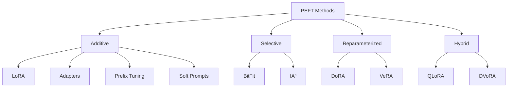
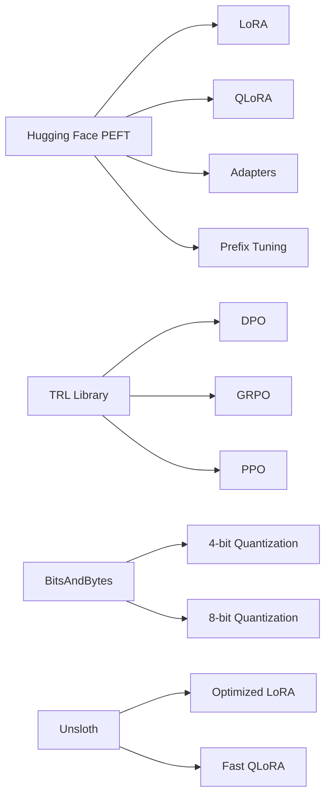
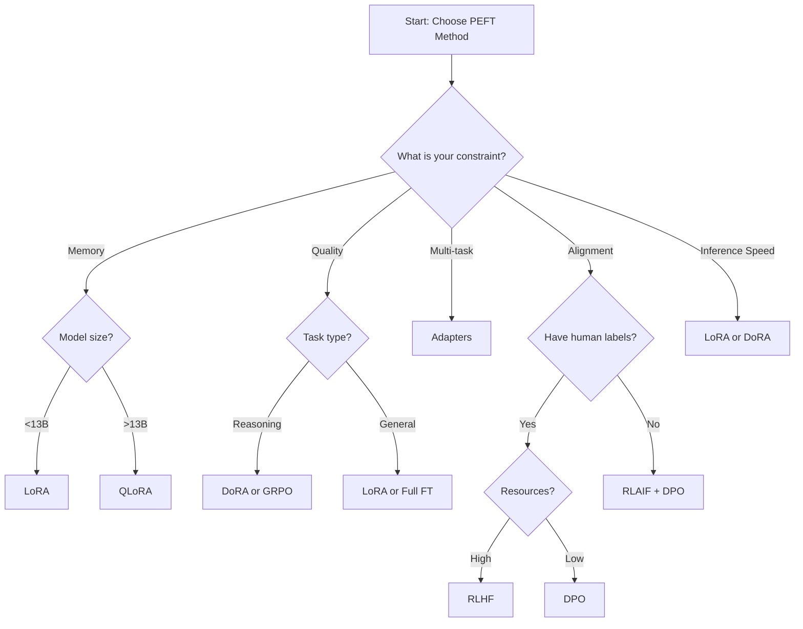

# Parameter-Efficient Fine-Tuning (PEFT) Methods for Large Language Models

## Executive Summary

This whitepaper provides developers and architects with a complete guide to Parameter-Efficient Fine-Tuning (PEFT) methods for Large Language Models (LLMs). PEFT enables fine-tuning of large models by updating less than 1% of parameters while achieving near full fine-tuning performance. These methods are essential for resource-constrained environments and production deployments.

**Key Benefits:**
- Train on consumer GPUs (single GPU instead of clusters)
- Reduce memory usage by 40-75%
- Maintain 90-95% of full fine-tuning accuracy
- Enable multiple task-specific adapters from one base model

---

## Table of Contents

1. [Introduction to PEFT](#introduction-to-peft)
2. [Core PEFT Categories](#core-peft-categories)
3. [Low-Rank Adaptation Methods](#low-rank-adaptation-methods)
4. [Prompt-Based Methods](#prompt-based-methods)
5. [Alignment and Preference Optimization](#alignment-and-preference-optimization)
6. [Advanced Methods](#advanced-methods)
7. [Implementation Guide](#implementation-guide)
8. [Method Comparison](#method-comparison)
9. [Best Practices](#best-practices)

---

## 1. Introduction to PEFT

### What is PEFT?

Parameter-Efficient Fine-Tuning adapts pre-trained LLMs to specific tasks by updating only a small subset of model parameters (typically 0.01% - 3%). This contrasts with full fine-tuning, which updates all billions of parameters.

### Why Use PEFT?

**Traditional Fine-Tuning Challenges:**
- Requires expensive hardware (multiple high-end GPUs)
- High memory consumption (780GB+ for 65B models)
- Long training times
- Difficult to manage multiple task-specific models

**PEFT Solutions:**
- Single GPU training for large models
- Memory reduction up to 75%
- Faster training (2-3x speedup)
- Multiple adapters from one base model

---

## 2. Core PEFT Categories



### Additive Methods
Add new trainable parameters to the base model while freezing original weights.

### Selective Methods
Update only specific existing parameters (like bias terms or activation scalers).

### Reparameterized Methods
Transform the weight update process through decomposition or alternative representations.

### Hybrid Methods
Combine multiple approaches (e.g., quantization + low-rank adaptation).

---

## 3. Low-Rank Adaptation Methods

### 3.1 LoRA (Low-Rank Adaptation)

**How it Works:**
Decomposes weight updates into two small matrices (A and B) instead of updating full weight matrices.

**Formula:** `ΔW = B × A` where rank r << original dimensions

**Key Features:**
- Updates 0.01% - 1% of parameters
- No inference latency (adapters merge into base model)
- Typical configuration: rank=8-32, alpha=16, dropout=0.1

**Performance:**
- Reduces trainable parameters by 10,000x
- Matches full fine-tuning on most tasks
- Works well for 7B+ parameter models

**Use Cases:**
- Text generation and classification
- Domain adaptation
- Multi-task learning with swappable adapters

**Implementation:**
```python
from peft import LoraConfig, get_peft_model

config = LoraConfig(
    r=8,                    # Rank
    lora_alpha=16,          # Scaling factor
    lora_dropout=0.1,       # Dropout rate
    target_modules=["q_proj", "v_proj"]  # Which layers to adapt
)

model = get_peft_model(base_model, config)
```

---

### 3.2 QLoRA (Quantized LoRA)

**How it Works:**
Combines LoRA with 4-bit quantization of base model weights. Uses three key optimizations:
1. **4-bit NormalFloat (NF4):** Optimized quantization for normally distributed weights
2. **Double Quantization:** Quantizes both weights and quantization constants
3. **Paged Optimizers:** Prevents memory spikes during training

**Key Features:**
- Trains 70B models on <48GB VRAM
- Matches 16-bit full fine-tuning accuracy
- Storage in 4-bit, computation in 16-bit
- Requires more LoRA adapters than standard LoRA

**Performance:**
- Memory reduction: 75% vs standard LoRA
- Training speed: Slightly slower than LoRA (due to quantization/dequantization)
- Quality: No significant accuracy loss

**Use Cases:**
- Consumer GPU fine-tuning (single RTX 3090/4090)
- Large model adaptation (30B-70B parameters)
- Research and experimentation on limited budgets

**Implementation:**
```python
from transformers import BitsAndBytesConfig
from peft import LoraConfig, prepare_model_for_kbit_training

# 4-bit quantization config
bnb_config = BitsAndBytesConfig(
    load_in_4bit=True,
    bnb_4bit_quant_type="nf4",
    bnb_4bit_use_double_quant=True,
    bnb_4bit_compute_dtype=torch.bfloat16
)

# Load quantized model
model = AutoModelForCausalLM.from_pretrained(
    model_name,
    quantization_config=bnb_config,
    device_map="auto"
)

model = prepare_model_for_kbit_training(model)

# Apply LoRA (target all linear layers for QLoRA)
lora_config = LoraConfig(
    r=16,
    lora_alpha=32,
    target_modules="all-linear",  # QLoRA best practice
    lora_dropout=0.05
)
```

**LoRA vs QLoRA Decision Matrix:**

| Factor | Choose LoRA | Choose QLoRA |
|--------|-------------|--------------|
| GPU Memory | >40GB VRAM | <40GB VRAM |
| Model Size | <13B params | >13B params |
| Training Speed | Priority | Can sacrifice |
| Inference | Frequent | Infrequent |
| Accuracy | Maximum | 95%+ acceptable |

---

### 3.3 DoRA (Weight-Decomposed LoRA)

**How it Works:**
Decomposes pre-trained weights into magnitude and direction components. Applies LoRA only to the direction while learning a separate magnitude parameter.

**Formula:** `W' = m × (W + ΔW) / ||W + ΔW||`

**Key Features:**
- Outperforms LoRA by 2-5% on reasoning tasks
- Better performance at low ranks (rank 8 matches LoRA rank 32)
- No inference overhead (merges like LoRA)
- More stable training than LoRA

**Performance:**
- LLaMA-7B: +3.7% accuracy over LoRA
- LLaMA-13B: +1.0% accuracy over LoRA
- Llama 3 8B: +4.4% accuracy over LoRA
- Better generalization across tasks

**Use Cases:**
- Complex reasoning tasks (math, coding)
- When quality is critical
- Low-rank training scenarios
- Alternative to full fine-tuning

**Implementation:**
```python
from peft import LoraConfig

config = LoraConfig(
    r=8,
    lora_alpha=16,
    use_dora=True,  # Enable DoRA
    target_modules=["q_proj", "v_proj", "k_proj", "o_proj"]
)
```

**DoRA Advantages:**
- Magnitude and direction learned independently
- Better gradient flow during training
- Improved performance at lower computational cost

---

### 3.4 VeRA (Vector-based Random Matrix Adaptation)

**How it Works:**
Uses shared frozen random matrices across all layers, with only small scaling vectors trained per layer.

**Key Features:**
- Extreme parameter efficiency (~0.0005% trainable)
- Shared random projection across layers
- Layer-specific scaling vectors

**Performance:**
- Can match LoRA with 10x fewer parameters
- Sensitive to random initialization
- Works best combined with DoRA (DVoRA)

**Use Cases:**
- Extremely limited memory scenarios
- Multiple adapters with minimal storage
- Experimentation on edge devices

---

## 4. Prompt-Based Methods

### 4.1 Prefix Tuning

**How it Works:**
Adds trainable soft prefix tokens to input sequences at each layer, conditioning model behavior.

**Key Features:**
- Updates ~0.1% of parameters
- Prefix length: typically 20-100 tokens
- Strong for generation tasks
- Less effective for classification

**Use Cases:**
- Text generation (summarization, translation)
- Long-sequence tasks
- When task-specific prompting is insufficient

**Implementation:**
```python
from peft import PrefixTuningConfig

config = PrefixTuningConfig(
    num_virtual_tokens=20,
    prefix_projection=True
)
```

---

### 4.2 P-Tuning

**How it Works:**
Learns continuous prompt embeddings automatically instead of discrete prompts.

**Versions:**
- **P-Tuning v1:** Input-level prompts
- **P-Tuning v2:** Multi-layer prompts (more stable)

**Key Features:**
- Updates <0.01% of parameters
- Robust to prompt engineering
- Effective on GLUE benchmarks

**Use Cases:**
- Classification tasks
- Sentiment analysis
- When discrete prompts perform poorly

---

### 4.3 Soft Prompts (Prompt Tuning)

**How it Works:**
Learns dense, trainable vectors prepended to inputs while keeping LLM frozen.

**Key Features:**
- Scales with model size (better on >1B parameters)
- Prompt length optimization needed
- Can outperform GPT-3 few-shot learning

**Use Cases:**
- Large models (>10B parameters)
- Domain-specific adaptation
- When full fine-tuning is impractical

---

## 5. Alignment and Preference Optimization

### 5.1 RLHF (Reinforcement Learning from Human Feedback)

**How it Works:**
Three-stage process:
1. Supervised fine-tuning (SFT)
2. Train reward model on human preferences
3. Optimize policy with PPO using reward model

**Key Features:**
- Industry standard for alignment
- Used in ChatGPT, Claude, Gemini
- Requires human annotation
- PPO optimization can be unstable

**Challenges:**
- Human annotation expensive (~$1-5 per comparison)
- PPO memory-intensive (2x model size)
- Sensitive to hyperparameters
- Training instability

**Use Cases:**
- Safety alignment
- Helpfulness optimization
- Production chatbots

---

### 5.2 DPO (Direct Preference Optimization)

**How it Works:**
Eliminates reward model by treating alignment as classification on preference pairs. Directly optimizes policy using preference data.

**Key Features:**
- No reward model needed
- 2-3x faster than RLHF
- More stable training than PPO
- 40-75% lower compute cost

**Performance:**
- Achieves 90-95% of RLHF alignment
- Better stability and convergence
- Simpler implementation

**Key Parameters:**
- Beta (β): Controls divergence from reference model (0.1-0.5)
- Learning rate: 10-100x smaller than SFT (e.g., 5e-6 vs 2e-4)

**Use Cases:**
- Cost-effective alignment
- Academic research
- Offline preference optimization
- When PPO instability is problematic

**Implementation:**
```python
from trl import DPOTrainer, DPOConfig

config = DPOConfig(
    beta=0.1,                    # KL penalty strength
    learning_rate=5e-6,          # Much smaller than SFT
    per_device_train_batch_size=2
)

trainer = DPOTrainer(
    model=model,
    ref_model=ref_model,         # Reference model (copy of SFT model)
    train_dataset=preference_data,
    tokenizer=tokenizer,
    args=config
)
```

---

### 5.3 GRPO (Group Relative Policy Optimization)

**How it Works:**
Generates multiple responses per prompt (group), computes relative advantages within the group using group normalization, and optimizes policy without a value network.

**Formula for Advantage:**
```
A_i = (r_i - mean(r_group)) / (std(r_group) + ε)
```

**Key Features:**
- No critic/value model needed (reduces memory)
- Group-based normalization (typically 4-16 samples)
- Reverse KL regularization for stability
- Better for multi-step reasoning

**Performance:**
- Used in DeepSeek-R1
- Outperforms PPO on reasoning tasks
- More sample-efficient than pairwise methods
- Can work with as few as 2 samples (2-GRPO)

**Advantages over PPO:**
- Lower memory usage (no value network)
- More stable training
- Better for structured reasoning

**Advantages over DPO:**
- Learns from multiple ranked outputs
- Better for reasoning tasks with verifiable rewards
- More flexible reward signals

**Use Cases:**
- Math and coding tasks
- Chain-of-thought reasoning
- When multiple responses can be verified
- Reinforcement learning with verifiable rewards (RLVR)

**Implementation:**
```python
# Typical GRPO configuration
config = GRPOConfig(
    group_size=8,              # Number of samples per prompt
    kl_coef=0.05,             # KL penalty
    learning_rate=1e-5,
    per_device_train_batch_size=1
)
```

**Group Size Trade-offs:**

| Group Size | Memory | Quality | Speed |
|------------|--------|---------|-------|
| 2 (2-GRPO) | Low | Good | Fast |
| 8 | Medium | Better | Medium |
| 16 | High | Best | Slow |

---

### 5.4 RLAIF (RL from AI Feedback)

**How it Works:**
Replaces human annotators with AI judges (LLMs) for generating preference labels.

**Key Features:**
- Scales without human annotators
- Uses AI models to rate/compare responses
- Mirrors RLHF pipeline with synthetic preferences

**Advantages:**
- Cost reduction (1000x cheaper than human labels)
- Rapid iteration
- Scalable to millions of examples

**Risks:**
- AI judge biases propagate
- May miss subtle human preferences
- Quality depends on judge model

**Use Cases:**
- Constitutional AI
- Iterative model improvement
- When human annotation is impractical

---

### 5.5 ORPO (Odds Ratio Preference Optimization)

**How it Works:**
Uses odds ratio loss instead of DPO's Bradley-Terry model. Single-stage optimization without needing SFT.

**Key Features:**
- More stable than DPO
- Simpler than RLHF
- Can skip SFT stage

**Use Cases:**
- Alternative to DPO
- When training stability is critical

---

### 5.6 KTO (Kahneman-Tversky Optimization)

**How it Works:**
Based on prospect theory from behavioral economics. Treats losses and gains asymmetrically (overweights losses).

**Key Features:**
- Handles imbalanced preference data
- Human-aligned loss weighting
- Better for scenarios with sparse positive examples

**Use Cases:**
- Imbalanced datasets
- Safety-critical alignment
- When human psychology matters

---

## 6. Advanced Methods

### 6.1 Adapter Tuning

**How it Works:**
Inserts small feed-forward networks (adapters) between transformer layers. Only adapters are trained.

**Variants:**
- **Series Adapters (Houlsby):** After attention and FFN
- **Parallel Adapters (Pfeiffer):** Parallel to FFN
- **Compacter:** Uses hypercomplex multiplication

**Key Features:**
- Modular (easy to add/remove)
- Updates 0.5-3% of parameters
- Minor inference overhead (~1-2%)
- Effective for 7B+ models

**Use Cases:**
- Multi-task scenarios
- When modularity is valuable
- Domain adaptation with task switching

**Implementation:**
```python
from peft import AdapterConfig, get_peft_model

config = AdapterConfig(
    adapter_type="houlsby",    # or "pfeiffer"
    adapter_dim=64,
    adapter_dropout=0.1
)
```

---

### 6.2 BitFit

**How it Works:**
Fine-tunes only bias terms in the model, freezing all other weights.

**Key Features:**
- Extreme efficiency (<0.1% parameters)
- Fast training
- Competitive on GLUE benchmarks
- Limited expressiveness

**Use Cases:**
- Quick task adaptation
- Similar domain shifts
- Minimal resource scenarios

---

### 6.3 (IA)³ (Infused Adapter)

**How it Works:**
Rescales activations using learned vectors. Modifies key/value projections and FFN outputs.

**Key Features:**
- Selective PEFT
- ~0.01% parameters
- No architectural changes
- Effective in low-data regimes

**Use Cases:**
- Very limited training data
- When simplicity is critical
- Transformer-only applications

---

### 6.4 Instruction Tuning

**How it Works:**
Trains on (instruction, output) pairs to improve following user directives.

**Key Features:**
- Bridges pre-training and task execution
- Enhances zero/few-shot learning
- Foundation for chat models
- Often precedes RLHF

**Popular Datasets:**
- **FLAN:** 4.4M instruction instances
- **xP3:** 81M multilingual instructions
- **Alpaca:** 52K synthetic instructions

**Risks:**
- Can create superficial alignment (mimics format without understanding)
- Quality depends on instruction diversity

**Use Cases:**
- Creating instruction-following models
- Foundation for conversational AI
- Zero-shot task generalization

---

### 6.5 Multi-Task Fine-Tuning

**How it Works:**
Trains single model on multiple tasks simultaneously with shared parameters.

**Key Features:**
- Improves cross-task transfer
- Single model serves multiple purposes
- Risk of task interference

**Use Cases:**
- General-purpose assistants
- When model deployment cost matters
- Transfer learning scenarios

---

### 6.6 Federated Fine-Tuning

**How it Works:**
Aggregates model updates from decentralized devices without sharing raw data.

**Key Features:**
- Privacy-preserving
- Decentralized training
- Works with PEFT methods (especially LoRA)
- Communication overhead

**Use Cases:**
- Healthcare (HIPAA compliance)
- Mobile/edge AI
- Privacy-regulated industries

---

## 7. Implementation Guide

### 7.1 Library Ecosystem



**Primary Libraries:**

1. **Hugging Face PEFT**
   - Core PEFT methods (LoRA, adapters, prefix tuning)
   - Integrated with Transformers
   - Production-ready

2. **TRL (Transformer Reinforcement Learning)**
   - Alignment methods (RLHF, DPO, GRPO)
   - Supervised fine-tuning
   - Reward modeling

3. **BitsAndBytes**
   - Quantization (4-bit, 8-bit)
   - Required for QLoRA
   - Memory-efficient optimizers

4. **Unsloth**
   - Optimized PEFT implementations
   - 2x faster training
   - Lower memory usage

---

### 7.2 Quick Start Example

**Full Pipeline: SFT → DPO**

```python
# 1. Install dependencies
# pip install transformers peft trl bitsandbytes accelerate

from transformers import AutoTokenizer, AutoModelForCausalLM, BitsAndBytesConfig
from peft import LoraConfig, prepare_model_for_kbit_training, get_peft_model
from trl import SFTTrainer, DPOTrainer, SFTConfig, DPOConfig
import torch

# 2. Load base model with quantization
bnb_config = BitsAndBytesConfig(
    load_in_4bit=True,
    bnb_4bit_quant_type="nf4",
    bnb_4bit_use_double_quant=True,
    bnb_4bit_compute_dtype=torch.bfloat16
)

model = AutoModelForCausalLM.from_pretrained(
    "meta-llama/Llama-2-7b-hf",
    quantization_config=bnb_config,
    device_map="auto"
)
tokenizer = AutoTokenizer.from_pretrained("meta-llama/Llama-2-7b-hf")
model = prepare_model_for_kbit_training(model)

# 3. Configure LoRA
lora_config = LoraConfig(
    r=16,
    lora_alpha=32,
    target_modules="all-linear",
    lora_dropout=0.05,
    bias="none",
    task_type="CAUSAL_LM"
)

model = get_peft_model(model, lora_config)

# 4. Supervised Fine-Tuning (SFT)
sft_config = SFTConfig(
    output_dir="./sft_model",
    num_train_epochs=3,
    per_device_train_batch_size=4,
    gradient_accumulation_steps=4,
    learning_rate=2e-4,
    max_seq_length=512,
    logging_steps=10,
    save_strategy="epoch"
)

trainer = SFTTrainer(
    model=model,
    train_dataset=sft_dataset,
    tokenizer=tokenizer,
    args=sft_config
)
trainer.train()

# 5. Direct Preference Optimization (DPO)
# Load SFT model as both policy and reference
ref_model = AutoModelForCausalLM.from_pretrained(
    "./sft_model",
    quantization_config=bnb_config,
    device_map="auto"
)

dpo_config = DPOConfig(
    output_dir="./dpo_model",
    num_train_epochs=1,
    per_device_train_batch_size=2,
    learning_rate=5e-6,  # 10-100x smaller than SFT
    beta=0.1,
    max_length=512,
    max_prompt_length=256
)

dpo_trainer = DPOTrainer(
    model=model,
    ref_model=ref_model,
    train_dataset=preference_dataset,
    tokenizer=tokenizer,
    args=dpo_config
)
dpo_trainer.train()

# 6. Merge and save
model = model.merge_and_unload()
model.save_pretrained("./final_model")
```

---

### 7.3 Hardware Requirements

**Memory Estimates (QLoRA with 4-bit):**

| Model Size | Base Memory | +LoRA | Total VRAM |
|------------|-------------|-------|------------|
| 7B params | 3.5GB | 0.5GB | ~8GB |
| 13B params | 6.5GB | 0.8GB | ~12GB |
| 30B params | 15GB | 1.5GB | ~24GB |
| 70B params | 35GB | 2GB | ~48GB |

**Recommended GPUs:**

- **7B models:** RTX 3090/4090 (24GB), A6000
- **13B models:** A100 40GB, H100
- **70B models:** 2x A100 80GB, H100

---

## 8. Method Comparison

### 8.1 Efficiency Comparison

| Method | Trainable % | Memory | Training Speed | Inference Cost |
|--------|-------------|---------|----------------|----------------|
| Full FT | 100% | 100% | Baseline | Baseline |
| LoRA | 0.1-1% | 30% | 1.2x | None |
| QLoRA | 0.1-1% | 10% | 1.0x | None |
| DoRA | 0.15-1.2% | 32% | 1.1x | None |
| Adapters | 0.5-3% | 35% | 1.3x | +2% |
| Prefix Tuning | 0.1% | 25% | 1.4x | +5% |
| BitFit | 0.05% | 20% | 1.5x | None |

---

### 8.2 Task Performance

**Recommendation by Task Type:**

| Task | Best Method | Alternative | Notes |
|------|-------------|-------------|-------|
| Text Generation | LoRA, DoRA | QLoRA | DoRA better for reasoning |
| Classification | LoRA, BitFit | Prefix Tuning | BitFit for speed |
| Reasoning (Math/Code) | DoRA, GRPO | LoRA | GRPO for RL scenarios |
| Alignment | DPO, GRPO | RLHF | DPO simpler, GRPO for reasoning |
| Few-shot Tasks | Soft Prompts | P-Tuning | Scale with model size |
| Multi-task | Adapters | LoRA | Modularity advantage |
| Limited VRAM | QLoRA | VeRA | QLoRA more mature |

---

### 8.3 Alignment Method Comparison

| Method | Compute Cost | Training Stability | Quality | Setup Complexity |
|--------|--------------|-------------------|---------|------------------|
| RLHF (PPO) | High | Low | Excellent | High |
| DPO | Medium | High | Very Good | Low |
| GRPO | Medium-High | Medium | Excellent | Medium |
| RLAIF | Medium | Medium | Good | Medium |
| ORPO | Medium | High | Very Good | Low |

---

## 9. Best Practices

### 9.1 Method Selection Decision Tree



---

### 9.2 Hyperparameter Guidelines

**LoRA Configuration:**

```python
# Conservative (safer, slower convergence)
r=8, alpha=16, dropout=0.1

# Balanced (recommended default)
r=16, alpha=32, dropout=0.05

# Aggressive (faster convergence, risk of overfitting)
r=32, alpha=64, dropout=0.0
```

**Learning Rates:**

| Stage | Learning Rate | Explanation |
|-------|--------------|-------------|
| SFT | 2e-4 to 5e-4 | Standard fine-tuning |
| DPO | 5e-6 to 1e-5 | 10-100x smaller than SFT |
| GRPO | 1e-5 to 5e-5 | Between SFT and DPO |

**Training Duration:**

- **SFT:** 1-3 epochs (more risks overfitting)
- **DPO:** 1 epoch usually sufficient
- **GRPO:** 1-2 epochs

---

### 9.3 Common Pitfalls

**Problem 1: Catastrophic Forgetting**
- **Symptom:** Model loses general knowledge
- **Solution:** Use lower learning rates, shorter training, or mix in general data

**Problem 2: Rank Collapse**
- **Symptom:** LoRA adapters learn low-rank representations that underfit
- **Solution:** Increase rank (r), check if DoRA helps

**Problem 3: Memory Overflow**
- **Symptom:** OOM errors during training
- **Solutions:**
  - Reduce batch size
  - Enable gradient checkpointing
  - Use QLoRA instead of LoRA
  - Reduce sequence length

**Problem 4: Unstable Training**
- **Symptom:** Loss spikes, nan values
- **Solutions:**
  - Lower learning rate
  - Enable gradient clipping
  - Use DPO instead of PPO
  - Check for data quality issues

---

### 9.4 Production Deployment

**Adapter Management:**

```python
# Load base model
base_model = AutoModelForCausalLM.from_pretrained("base-model")

# Load task-specific adapter
model = PeftModel.from_pretrained(base_model, "adapter-path")

# Switch adapters dynamically
model.load_adapter("another-adapter", adapter_name="task2")
model.set_adapter("task2")

# Merge for deployment (removes adapter overhead)
merged_model = model.merge_and_unload()
merged_model.save_pretrained("production-model")
```

**Inference Optimization:**

1. **Always merge adapters** before deployment (eliminates overhead)
2. **Use ONNX/TensorRT** for additional speedup
3. **Consider quantization** (8-bit or 4-bit) for deployment
4. **Test thoroughly** after merging (edge cases can differ)

---

### 9.5 Monitoring and Evaluation

**Key Metrics to Track:**

1. **Training Metrics:**
   - Loss (should decrease steadily)
   - Gradient norms (watch for explosion)
   - Learning rate schedule
   - GPU memory usage

2. **Quality Metrics:**
   - Perplexity (lower is better)
   - Task-specific accuracy
   - Human evaluation (for alignment)
   - Safety scores

3. **Efficiency Metrics:**
   - Training time per epoch
   - Memory peak usage
   - Inference latency

**Evaluation Code:**

```python
from evaluate import load
from torch.utils.data import DataLoader

# Evaluate perplexity
def evaluate_perplexity(model, eval_dataset, tokenizer):
    model.eval()
    total_loss = 0
    total_tokens = 0
    
    dataloader = DataLoader(eval_dataset, batch_size=4)
    
    for batch in dataloader:
        with torch.no_grad():
            outputs = model(**batch)
            loss = outputs.loss
            total_loss += loss.item() * batch['input_ids'].numel()
            total_tokens += batch['input_ids'].numel()
    
    perplexity = torch.exp(torch.tensor(total_loss / total_tokens))
    return perplexity.item()

# Task-specific evaluation
accuracy = load("accuracy")
rouge = load("rouge")

# Compute metrics
results = accuracy.compute(predictions=preds, references=labels)
rouge_scores = rouge.compute(predictions=generated, references=targets)
```

---

### 9.6 Cost Analysis

**Training Cost Estimates (AWS p4d.24xlarge - 8x A100 80GB):**

| Model | Method | Duration | Cost | Per Task |
|-------|--------|----------|------|----------|
| 7B | Full FT | 12 hours | $390 | $390 |
| 7B | LoRA | 4 hours | $130 | $130 |
| 7B | QLoRA (1 GPU) | 6 hours | $50 | $50 |
| 70B | Full FT | 48 hours | $1,560 | $1,560 |
| 70B | QLoRA | 12 hours | $390 | $390 |

**Storage Cost:**

| Model | Method | Disk Space | Monthly Cost (S3) |
|-------|--------|------------|-------------------|
| 7B | Full FT | 28GB | $0.64 |
| 7B | LoRA | 50MB | $0.001 |
| 70B | Full FT | 280GB | $6.40 |
| 70B | LoRA | 200MB | $0.005 |

**Key Insight:** LoRA/QLoRA enables 5-10 task-specific models for the cost of one full fine-tune.

---

## 10. Advanced Topics

### 10.1 Combining PEFT Methods

**Effective Combinations:**

1. **QLoRA + DoRA**
   - Best quality-efficiency trade-off
   - Recommended for production

2. **LoRA + Adapters**
   - Layer-wise LoRA + task-specific adapters
   - Maximum modularity

3. **Prefix Tuning + LoRA**
   - Generation tasks with parameter efficiency

4. **VeRA + DoRA (DVoRA)**
   - Extreme efficiency with quality

**Implementation:**

```python
# Combine multiple PEFT methods
config = LoraConfig(
    r=16,
    lora_alpha=32,
    use_dora=True,  # Enable DoRA
    target_modules="all-linear"
)

# Add prefix tuning
prefix_config = PrefixTuningConfig(
    num_virtual_tokens=20
)

# Apply both
model = get_peft_model(model, config)
model = get_peft_model(model, prefix_config)
```

---

### 10.2 Scaling Laws for PEFT

**Key Findings:**

1. **Parameter Count vs Performance**
   - LoRA: Performance plateaus at r=32-64
   - DoRA: Achieves same quality at r=16
   - More isn't always better

2. **Model Size Effects**
   - PEFT more effective on larger models (>7B)
   - Soft prompts scale better than LoRA on >10B models
   - QLoRA gap narrows with model size

3. **Data Efficiency**
   - PEFT requires 2-5x less data than full FT
   - Adapters best for limited data (<1k examples)
   - LoRA best for 10k+ examples

---

### 10.3 Multi-Modal PEFT

**Vision-Language Models:**

```python
# LoRA for vision-language models
config = LoraConfig(
    r=16,
    lora_alpha=32,
    target_modules=[
        "q_proj", "v_proj",  # Text encoder
        "vision_proj"        # Vision encoder
    ]
)

# Freeze vision encoder, train text adapter
for param in model.vision_model.parameters():
    param.requires_grad = False
```

**Audio Models:**
- Apply LoRA to Whisper for speech recognition
- QLoRA enables large audio model fine-tuning

---

### 10.4 Continual Learning with PEFT

**Challenge:** Catastrophic forgetting when learning new tasks sequentially.

**Solutions:**

1. **Task-Specific Adapters**
   - Train separate adapter per task
   - No interference between tasks
   - Easily composable

2. **Progressive LoRA**
   - Gradually increase rank for new tasks
   - Regularize against previous tasks

3. **Elastic Weight Consolidation + LoRA**
   - Identify important parameters
   - Protect them during new task learning

**Implementation:**

```python
# Task 1
model = get_peft_model(base_model, lora_config_task1)
trainer.train(task1_data)
model.save_adapter("task1_adapter")

# Task 2 (without forgetting task 1)
model.load_adapter("task1_adapter", adapter_name="task1")
model.add_adapter(lora_config_task2, adapter_name="task2")
model.set_adapter("task2")
trainer.train(task2_data)

# Inference: use specific adapter
model.set_adapter("task1")  # or "task2"
```

---

## 11. Troubleshooting Guide

### 11.1 Common Error Messages

**Error:** `CUDA out of memory`

**Solutions:**
```python
# 1. Reduce batch size
per_device_train_batch_size=1
gradient_accumulation_steps=16  # Effective batch size = 16

# 2. Enable gradient checkpointing
model.gradient_checkpointing_enable()

# 3. Use QLoRA
quantization_config = BitsAndBytesConfig(load_in_4bit=True)

# 4. Reduce sequence length
max_seq_length=512  # instead of 2048
```

---

**Error:** `RuntimeError: Expected all tensors to be on the same device`

**Solution:**
```python
# Ensure consistent device mapping
model = AutoModelForCausalLM.from_pretrained(
    model_name,
    device_map="auto"  # Automatic device placement
)
```

---

**Error:** `Loss is NaN` or `Loss exploding`

**Solutions:**
```python
# 1. Lower learning rate
learning_rate=1e-5  # Instead of 2e-4

# 2. Enable gradient clipping
max_grad_norm=1.0

# 3. Use mixed precision carefully
fp16=False,  # Try disabling if using
bf16=True    # Use bf16 instead

# 4. Check data quality
# Ensure no extremely long sequences or corrupted data
```

---

**Error:** `Adapter not found` or `Multiple adapters conflict`

**Solution:**
```python
# List available adapters
print(model.peft_config.keys())

# Set active adapter explicitly
model.set_adapter("adapter_name")

# Delete unused adapters
model.delete_adapter("old_adapter")
```

---

### 11.2 Performance Optimization

**Slow Training:**

```python
# 1. Enable Flash Attention 2
model = AutoModelForCausalLM.from_pretrained(
    model_name,
    attn_implementation="flash_attention_2"
)

# 2. Use optimized libraries
# pip install flash-attn unsloth

# 3. Increase batch size with gradient accumulation
per_device_train_batch_size=8
gradient_accumulation_steps=4

# 4. Use DeepSpeed for multi-GPU
# deepspeed --num_gpus=4 train.py
```

---

**Poor Quality Output:**

1. **Check learning rate:** Too high causes instability, too low prevents learning
2. **Verify data format:** Ensure proper chat templates
3. **Increase rank:** Try r=32 or r=64 for complex tasks
4. **Try DoRA:** Often 2-5% better than LoRA
5. **Add more training data:** PEFT needs 1k+ examples
6. **Adjust target modules:** Include all linear layers for QLoRA

---

## 12. Future Directions

### Emerging Trends (2025-2026)

1. **Mixture of Adapters (MoA)**
   - Dynamic routing between multiple LoRA adapters
   - Task-specific expert selection

2. **Ultra-Low Rank Methods**
   - VeRA, DoRA pushing efficiency boundaries
   - <0.001% trainable parameters

3. **Alignment Without Preference Data**
   - Self-alignment techniques
   - Constitutional AI methods

4. **Quantization-Aware PEFT**
   - Training directly in quantized space
   - Better accuracy than post-training quantization

5. **Federated PEFT**
   - Privacy-preserving collaborative fine-tuning
   - Healthcare and finance applications

---

## 13. Resources and References

### Official Documentation

- **Hugging Face PEFT:** https://huggingface.co/docs/peft
- **TRL Library:** https://huggingface.co/docs/trl
- **Transformers:** https://huggingface.co/docs/transformers

### Key Papers

1. **LoRA:** Hu et al. (2021) - "LoRA: Low-Rank Adaptation of Large Language Models"
2. **QLoRA:** Dettmers et al. (2023) - "QLoRA: Efficient Finetuning of Quantized LLMs"
3. **DoRA:** Liu et al. (2024) - "DoRA: Weight-Decomposed Low-Rank Adaptation"
4. **DPO:** Rafailov et al. (2023) - "Direct Preference Optimization"
5. **GRPO:** DeepSeek (2025) - "DeepSeek-R1: Reasoning with Group Relative Policy Optimization"

### Community Resources

- **GitHub:** huggingface/peft, huggingface/trl
- **Discord:** Hugging Face Discord server
- **Forums:** discuss.huggingface.co

---

## 14. Quick Reference

### Method Selection Cheatsheet

```
Single GPU, 7B model → QLoRA (r=16)
Multi-GPU, 7B model → LoRA (r=32) or DoRA (r=16)
Single GPU, 70B model → QLoRA (r=64)
Best Quality → DoRA (r=16-32)
Fastest Training → LoRA (r=8)
Lowest Memory → VeRA or BitFit
Multi-Task → Adapters
Alignment (simple) → DPO
Alignment (reasoning) → GRPO
Alignment (production) → RLHF
```

### Common Configurations

**Conservative (Safe Default):**
```python
LoraConfig(r=8, lora_alpha=16, lora_dropout=0.1)
learning_rate=5e-5
num_epochs=3
```

**Balanced (Recommended):**
```python
LoraConfig(r=16, lora_alpha=32, lora_dropout=0.05, use_dora=True)
learning_rate=2e-4
num_epochs=1-2
```

**Aggressive (Maximum Quality):**
```python
LoraConfig(r=64, lora_alpha=128, lora_dropout=0.0)
learning_rate=3e-4
num_epochs=1
```

---

## 15. Conclusion

Parameter-Efficient Fine-Tuning has democratized LLM adaptation, making it accessible on consumer hardware while maintaining competitive performance. Key takeaways:

1. **Start with QLoRA** if memory-constrained, **LoRA** otherwise
2. **Use DoRA** when quality is critical (reasoning tasks)
3. **Choose DPO** for alignment unless doing complex reasoning (then GRPO)
4. **Always merge adapters** before production deployment
5. **Monitor metrics** throughout training to catch issues early

The PEFT landscape continues evolving rapidly. Stay updated with the Hugging Face ecosystem for latest methods and optimizations.
