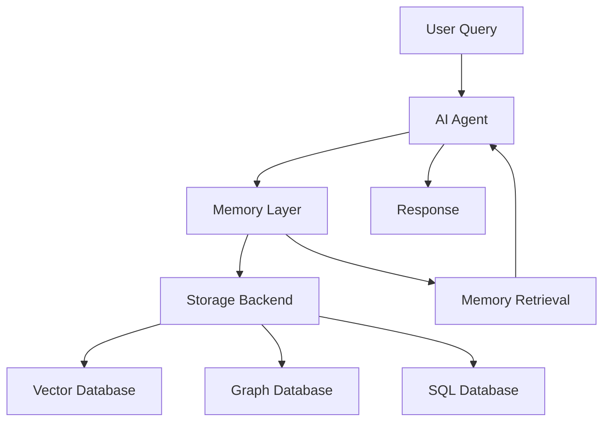
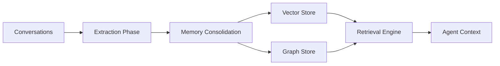
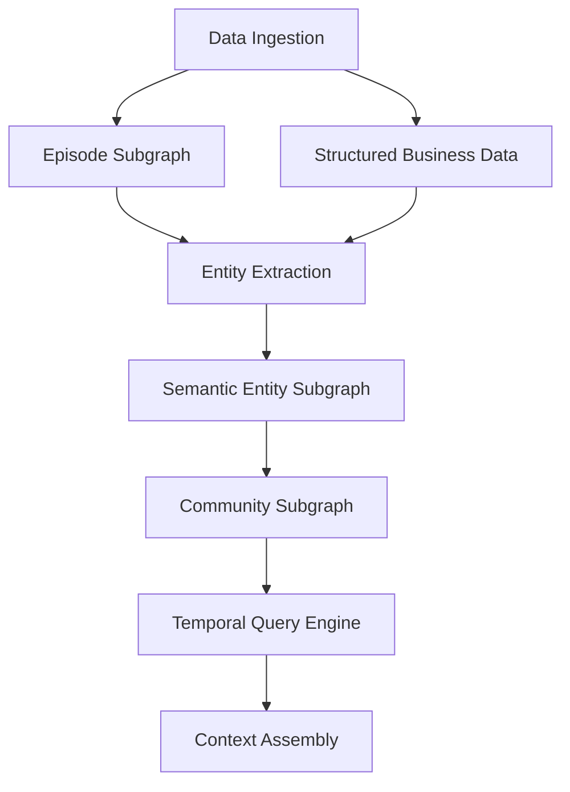
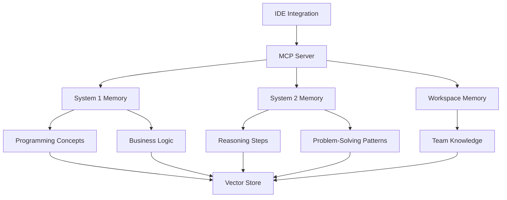
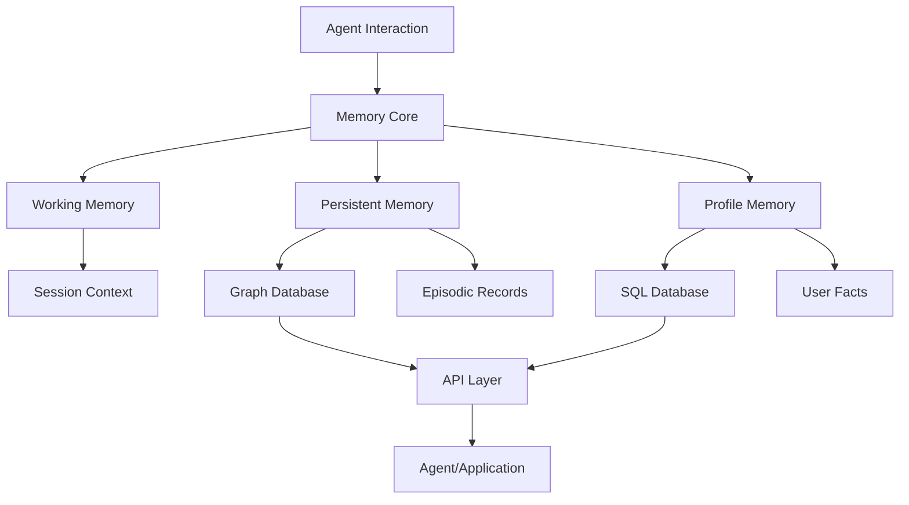
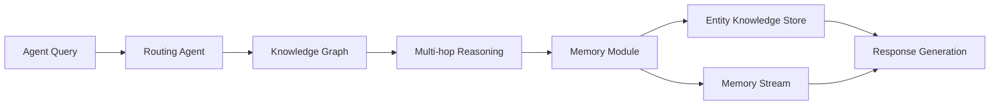
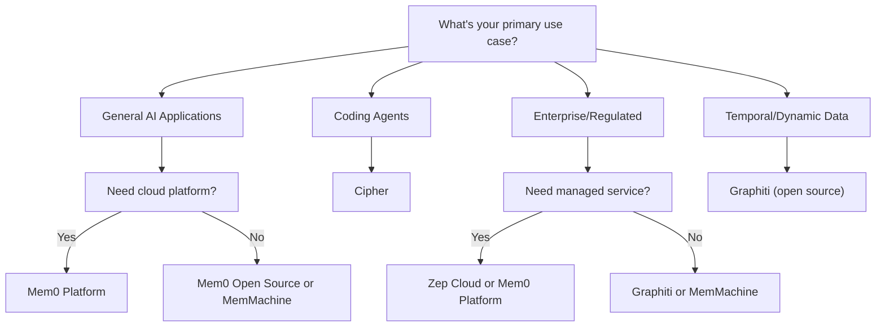

# Persistent Memory Layers for AI Agents
## A Comprehensive Technical Guide

## Introduction

Large Language Models are stateless by design. They process each request independently, with no built-in way to remember previous interactions. This creates a major problem for real-world applications where users expect AI to remember them, learn from past conversations, and provide personalized experiences.

Persistent memory layers solve this by adding a separate memory system that stores, retrieves, and updates information across sessions. Think of it as giving AI a working memory (for immediate context) and long-term memory (for facts and preferences that persist over time).

This guide covers the main open-source memory layers you can self-host or extend, with a focus on practical implementation.

---

## Why Memory Layers Matter

### The Problem

Without memory, AI agents:
- Ask users to repeat information every conversation
- Cannot learn from past mistakes or successes
- Lack personalization and context awareness
- Waste tokens by repeatedly processing the same context
- Cannot maintain consistency across sessions

### The Solution

Memory layers provide:
- **Long-term retention**: Facts and preferences stored permanently
- **Efficient retrieval**: Only relevant memories are loaded per query
- **Token savings**: 90%+ reduction in context size
- **Personalization**: Agents adapt to individual users over time
- **Better accuracy**: Context-aware responses based on history

---

## Core Memory Systems

### Architecture Overview



### Memory Types

Most systems implement three memory types:

1. **Working Memory (Short-term)**: Current conversation context
2. **Episodic Memory (Session-based)**: Specific interaction records
3. **Semantic Memory (Long-term)**: General facts, preferences, and knowledge

### Open Source vs Commercial

| Solution | Open Source Status | License | Commercial Option |
|----------|-------------------|---------|-------------------|
| **Mem0** | ✓ Open Source + Cloud | Apache 2.0 | Mem0 Platform (managed) |
| **Graphiti** | ✓ Fully Open Source | Apache 2.0 | Powers Zep Cloud |
| **Cipher** | ✓ Open Source | Apache 2.0 | ByteRover Cloud (planned) |
| **MemMachine** | ✓ Open Source | Apache 2.0 | Enterprise version |
| **Memary** | ✓ Open Source | MIT | None (community) |

**Note on Zep**: Zep Community Edition (the self-hosted open source memory service) was discontinued in April 2025. The company now focuses on:
- **Graphiti** (open source framework) - fully maintained
- **Zep Cloud** (commercial service) - uses Graphiti under the hood

If you want open source temporal knowledge graphs, use **Graphiti directly**.

---

## Detailed Analysis

### 1. Mem0 (Universal Memory Layer)

**Type**: General-purpose memory for all AI agents

**Key Features**:
- Automatic memory extraction from conversations
- Graph-based memory with relationship tracking
- Multi-backend support (Redis, Valkey, Neptune, Qdrant)
- Platform and open-source versions available
- MCP integration for universal AI tools

**Architecture**:



**How It Works**:
1. **Extraction**: Analyzes conversations to identify key facts
2. **Consolidation**: Merges and deduplicates memories
3. **Storage**: Saves in vector database for semantic search
4. **Retrieval**: Fetches relevant memories based on current query

**Performance** (LOCOMO Benchmark):
- 26% higher accuracy than OpenAI memory
- 91% lower latency than full-context approaches
- 90% token cost reduction

**Best For**:
- Customer support chatbots
- Personal AI assistants
- Healthcare applications
- Educational platforms
- Any application needing personalized memory

**Deployment Options**:
- Cloud platform (managed service)
- Self-hosted (Docker, Kubernetes)
- Python/JavaScript SDKs

**Supported Backends**:
- ElastiCache for Valkey (vector storage)
- Amazon Neptune Analytics (graph memory)
- Qdrant, Pinecone, Chroma
- PostgreSQL with pgvector

---

### 2. Graphiti (Open Source Temporal Knowledge Graph)

**Type**: Standalone temporal knowledge graph framework (powers Zep Cloud)

**License**: Apache 2.0 (fully open source)

**Key Features**:
- Temporal knowledge graphs (tracks how facts change over time)
- Bi-temporal modeling (when events occurred vs. when recorded)
- Real-time updates without graph recomputation
- Incremental graph updates (no batch reprocessing)
- MCP server integration for AI tools

**Important Note**: 
- **Graphiti** = Open source framework you can use anywhere
- **Zep Community Edition** = Discontinued (no longer maintained as of April 2025)
- **Zep Cloud** = Commercial service using Graphiti (SOC2/HIPAA compliant)

**Architecture**:



**How It Works**:
1. **Episode Layer**: Stores raw interactions (non-lossy)
2. **Semantic Layer**: Extracts entities and relationships
3. **Community Layer**: Groups related entities
4. **Temporal Tracking**: Maintains validity periods for all facts

**Temporal Features**:
- Tracks when information was valid
- Handles conflicting information by time
- Preserves full historical context
- Enables "point-in-time" queries

**How It Works**:
1. **Episode Ingestion**: Processes conversations, JSON data, unstructured text
2. **Entity Extraction**: Identifies entities and relationships in real-time
3. **Conflict Resolution**: Uses temporal metadata to update/invalidate facts
4. **Hybrid Retrieval**: Combines semantic search + BM25 + graph traversal
5. **Point-in-Time Queries**: Reconstruct knowledge state at any moment

**Temporal Features**:
- Tracks validity periods for all facts (t_valid, t_invalid)
- Handles conflicting information by time
- Preserves full historical context
- Enables "what did we know when?" queries
- Automatic invalidation of outdated facts

**Performance**:
- Sub-100ms search latency (excluding embedding API)
- Real-time incremental updates (no batch recomputation)
- Scales to large graphs with constant-time retrieval
- 20,000+ GitHub stars, 25,000+ weekly PyPI downloads

**Best For**:
- Applications with frequently changing data
- Agent systems requiring temporal reasoning
- RAG pipelines needing dynamic context
- Building custom memory solutions
- Research and development projects

**Supported Backends**:
- Neo4j (recommended)
- FalkorDB
- Kuzu
- Amazon Neptune

**Deployment**:
- Python package: `pip install graphiti-core`
- Self-hosted with any supported graph database
- MCP server available for AI tools (Cursor, Claude, etc.)
- Can be integrated into custom applications

**Integrations**:
- OpenAI, Anthropic, Google Gemini, Groq (LLMs)
- OpenAI, Voyage, Google (embeddings)
- Neo4j, FalkorDB, Kuzu, Neptune (databases)

---

### 3. Cipher by ByteRover (Coding-Focused Memory)

**Type**: Specialized memory layer for coding agents

**Key Features**:
- Auto-generates coding memories from codebase
- MCP-based integration with all major IDEs
- Dual memory architecture (System 1 + System 2)
- Team workspace memory sharing
- Zero-configuration setup

**Architecture**:



**Memory Types**:
1. **System 1 (Knowledge)**: Programming concepts, business logic, past interactions
2. **System 2 (Reflection)**: AI reasoning steps when generating code
3. **Workspace Memory**: Team-shared context across IDEs

**How It Works**:
1. Analyzes your codebase automatically
2. Extracts programming patterns and business logic
3. Captures AI reasoning during code generation
4. Shares knowledge across team members
5. Works seamlessly across different IDEs

**Supported IDEs**:
- Cursor, Claude Code, Windsurf, Cline
- VS Code, Roo Code, Trae, Amp Code
- Gemini CLI, AWS Kiro, Warp
- Any MCP-compatible coding agent

**Best For**:
- Development teams using AI coding assistants
- Cross-IDE workflows (Cursor → VS Code)
- Sharing coding best practices across teams
- Maintaining coding context in large codebases
- AI pair programming

**Deployment**:
- NPM package (global or local)
- Docker-based self-hosting
- Works with OpenAI, Anthropic, Ollama, Qwen

#### Cipher Usage

##### 1. Install and configure Claude Code CLI

1. Install Claude Code CLI with the install command from anthropic.com/claude-code (the command is shown around the “Tools Needed” section).
2. Confirm `code` (Claude Code CLI) runs in your terminal by running the `code` command in a project folder.

***

##### 2. Set up Kimi K2 (Moonshot) for Claude Code

1. Go to `https://platform.moonshot.ai/console` and sign up.
2. Recharge at least about 10 USD from the “Recharge” section so you can call Kimi K2.
3. In the console, go to the “API Keys” section and create a new API key; copy it once (it is only shown once).
4. In your terminal, set the environment variables so Claude Code uses Moonshot/Kimi K2 instead of the default Anthropic models:
   - First run the “override base URL” command shown in the video (one export/ENV command for the base URL).  
   - Then run  
     ```bash
     export ANTHROPIC_OAUTH_TOKEN="YOUR_MOONSHOT_API_KEY"
     ```  
     replacing the value with the API key you generated on Moonshot.
5. Open a project and run `code`; ensure the status line shows “overrides via env” with the Moonshot base URL and key, confirming Kimi K2 is now the active model for Claude Code.

This is your **first CLI setup**: Claude Code + Kimi K2. You can leave these env vars in your shell profile if you want this as your default.

***

##### 3. Install Cipher once on your machine

1. Open the Cipher docs page at `https://docs.byterover.dev/cipher/overview` and go to the “Installation” section.
2. Copy the `pip` (or equivalent) install command, for example:  
   ```bash
   pip install cipher
   ```  
   and run it once in your terminal.

Cipher is now installed system‑wide and can be reused from any CLI or IDE. You don’t need to reinstall it per tool.

***

##### 4. Configure Cipher’s API keys (one‑time)

1. Open the Cipher GitHub repo and go to `examples/strict-memory-layer`.
2. In that example, copy the environment variable exports for the LLM providers (e.g. `OPENAI_API_KEY`, `ANTHROPIC_API_KEY`, or Kimi K2 key).
3. Replace the placeholder values with your real keys (OpenAI, Anthropic, or Kimi K2) and run those `export ...` commands in your terminal.

This binds Cipher to the underlying models, and it is **independent** from which CLI (Claude Code, Gemini CLI, etc.) you are using.

***

##### 5. Download the `cipher.iml` file (shared config)

1. From the docs page, find and open the `cipher.iml` (or similarly named) MCP config file.
2. Use the “Download raw file” button and save it somewhere stable on your disk, e.g.  
   - `~/mcp/cipher.iml`

You will reuse **this same file path** across all CLIs/IDEs you connect to Cipher.

***

##### 6. Run Cipher as an MCP server (shared server)

1. In your terminal, run the Cipher MCP server command shown in the docs, for example:  
   ```bash
   cipher modem mcp agent --config /absolute/path/to/cipher.iml
   ```  
   replacing the path with the absolute path to where you saved `cipher.iml`.
2. Keep this terminal running; it becomes the shared MCP server that all tools can talk to.

This is **the piece you “save once”** and reuse from any CLI that supports MCP.

***

##### 7. Create a shared `mcp.json` client config

1. In your project (or in a common config folder), create a file named `mcp.json`.
2. Paste the MCP client config from the Cipher docs/example, including the `cipher` client entry.
3. Edit the `vector_store` section:
   - Go to `https://cloud.zilliz.com/` and create a free Milvus cluster (or any supported store).
   - Copy the public endpoint, token/API key, username, and password.
   - In `mcp.json`, set:
     - `store_type` to `"milvus"` (or as shown).
     - `store_url`, `store_api_key`, `username`, `password` to the Zilliz/Milvus values.
4. In the `agents` section of `mcp.json`, set the `config_path` (or equivalent field) to the **absolute path** of `cipher.iml`.
5. Save `mcp.json`.

This `mcp.json` can be reused by **multiple CLIs** to talk to the same Cipher memory layer.

***

##### 8. Wire Cipher into Claude Code (first CLI using the shared memory)

1. In the same project where you use Claude Code, ensure the created `mcp.json` is in the right location Claude Code expects (as in the video).
2. Run `code`, type `/mcp`, and press Enter.
3. Confirm that `cipher` shows as **connected** in Claude Code.

Now Claude Code + Kimi K2 are using the **shared Cipher memory**.

***

##### 9. Reuse the same Cipher setup from another CLI (e.g., Gemini CLI)

To “save” one CLI and reuse Cipher from another:

1. Open the second CLI/IDE (e.g., Gemini CLI) on the **same project folder** or any folder where you can point it to the same `mcp.json`.
2. Configure that tool to read the same `mcp.json` (the video shows Gemini reading the same MCP config).
3. Ensure the Cipher MCP server is still running in the background (step 6).
4. In the second CLI, use its MCP invocation command (e.g., type `/mcp` or similar), and verify `cipher` shows as connected.
5. Ask questions like “What is my database preference?” or “What is my language preference?” and confirm it reads the same memories (Postgres SQL, TypeScript, etc.) created from Claude Code.

You have now **saved one CLI’s memory (Claude Code)** and **reused it from another CLI (Gemini CLI)** via the shared Cipher + vector store setup.

---

### 4. MemMachine (Multi-Layered Architecture)

**Type**: Comprehensive memory system with multiple memory types

**Key Features**:
- Three distinct memory layers (Working, Persistent, Profile)
- Graph database for episodic memory
- SQL database for profile memory
- Model-agnostic (works with any LLM)
- MCP server integration

**Architecture**:



**Memory Types**:
1. **Working Memory**: Immediate conversational context
2. **Persistent Memory**: Long-term facts across sessions
3. **Profile Memory**: User-specific personalization data

**How It Works**:
1. Captures interactions via REST API or Python SDK
2. Stores episodic memory in graph database
3. Stores profile memory in SQL database
4. Retrieves context based on current query
5. Provides personalized responses

**Performance** (LoCoMo Benchmark):
- 84.87% accuracy score
- Model-agnostic deployment
- Works across multiple LLMs simultaneously

**Best For**:
- CRM applications (client history, deal stages)
- Personal finance advisors
- Healthcare chatbots
- Content creation tools
- Any app requiring rich user profiles

**Deployment**:
- Docker container
- Python package
- Open-source (Apache 2.0)
- Enterprise version available

---

### 5. Memary (Autonomous Agent Memory)

**Type**: Research-focused memory layer for autonomous agents

**Key Features**:
- Knowledge graph-based storage (Neo4j, FalkorDB)
- Multi-hop reasoning for complex queries
- Memory analytics dashboard
- Local model support (Ollama)
- ReAct agent implementation included

**Architecture**:



**How It Works**:
1. **Routing**: Determines which tools/memory to query
2. **Knowledge Graph**: Stores entities and relationships
3. **Memory Stream**: Tracks all entities encountered
4. **Entity Store**: Ranks entities by relevance
5. **Multi-hop**: Joins related subgraphs for complex queries

**Best For**:
- Research applications
- Autonomous agent development
- Applications requiring complex reasoning
- Privacy-focused deployments (local models)
- Educational projects

**Deployment**:
- Python package
- Requires Neo4j or FalkorDB
- Supports Ollama (local) or OpenAI

---

## Performance Comparison

### Benchmark Results Summary

| Solution | Accuracy | Latency | Token Savings | Benchmark |
|----------|----------|---------|---------------|-----------|
| **Mem0** | +26% vs OpenAI | 91% reduction | 90% | LOCOMO |
| **Graphiti** | State-of-the-art | <100ms search | N/A | DMR, LongMemEval |
| **MemMachine** | 84.87% | N/A | N/A | LoCoMo |
| **Cipher** | N/A | N/A | N/A | Not benchmarked |
| **Memary** | N/A | N/A | N/A | Research-focused |

**Note**: Graphiti powers Zep's memory system which achieved 94.8% accuracy on DMR benchmark.

### Feature Comparison

| Feature | Mem0 | Graphiti | Cipher | MemMachine | Memary |
|---------|------|----------|--------|------------|--------|
| **General Purpose** | ✓ | ✓ | ✗ | ✓ | ✓ |
| **Coding Focus** | ✗ | ✗ | ✓ | ✗ | ✗ |
| **Temporal Awareness** | Basic | Advanced | ✗ | ✗ | ✗ |
| **Graph Memory** | ✓ | ✓ | ✗ | ✓ | ✓ |
| **Vector Search** | ✓ | ✓ | ✓ | ✗ | ✓ |
| **MCP Integration** | ✓ | ✓ | ✓ | ✓ | ✗ |
| **Fully Open Source** | ✓ | ✓ | ✓ | ✓ | ✓ |
| **Cloud Platform** | ✓ | ✗* | ✗ | ✓ | ✗ |
| **Self-Hosted** | ✓ | ✓ | ✓ | ✓ | ✓ |
| **Team Collaboration** | Limited | Via apps | ✓ | Limited | ✗ |
| **Enterprise Features** | ✓ | Via Zep Cloud* | ✗ | ✓ | ✗ |

*Graphiti is the open source framework. Zep Cloud is a commercial service built on Graphiti.

---

## Use Cases

### Customer Support

**Recommended**: Mem0, MemMachine

**Why**: Need to remember customer history, preferences, ongoing issues
- Reduces resolution times
- Eliminates need for customers to repeat information
- Maintains conversation context across sessions

### Healthcare Applications

**Recommended**: Graphiti, Mem0

**Why**: Requires audit trails, temporal tracking, compliance
- Track patient symptoms over time
- Maintain medication history
- Handle conflicting medical information with temporal context
- Zep Cloud offers HIPAA compliance (Graphiti itself is framework-level)

### Coding Agents

**Recommended**: Cipher

**Why**: Specialized for development workflows
- Captures programming patterns automatically
- Shares knowledge across team and IDEs
- Maintains codebase context
- Zero configuration needed

### Enterprise Workflows

**Recommended**: Graphiti, MemMachine, Mem0

**Why**: Need advanced features, compliance, scalability
- Audit trails and data lineage (via Zep Cloud if needed)
- Multi-agent coordination
- Cross-session synthesis
- Temporal reasoning for changing business data

### Personal AI Assistants

**Recommended**: Mem0, MemMachine

**Why**: Focus on personalization and adaptation
- Learn user preferences over time
- Adapt to communication style
- Remember context across devices
- Multi-modal support

---

## Choosing the Right Solution

### Decision Matrix



### Quick Selection Guide

**Choose Mem0 if**:
- You need a general-purpose solution
- You want both cloud and self-hosted options
- Performance benchmarks matter
- You need extensive LLM integrations

**Choose Graphiti if**:
- You need temporal awareness (facts changing over time)
- You want a fully open source solution
- You're building on Neo4j or FalkorDB
- Data changes frequently and you need real-time updates
- You want to build custom memory solutions
- You need sub-100ms retrieval latency

**Choose Cipher if**:
- You're building coding agents
- You use multiple IDEs
- You need team collaboration on code
- You want zero-config setup

**Choose MemMachine if**:
- You need multiple memory types
- You want model-agnostic deployment
- You need rich user profiles
- You prefer traditional databases (SQL + Graph)

**Choose Memary if**:
- You're doing research
- You need full control and customization
- You want local model support
- You're building autonomous agents

---

## Implementation Considerations

### Storage Requirements

**Vector Databases** (for semantic search):
- Qdrant, Pinecone, Chroma, Weaviate
- PostgreSQL with pgvector
- Redis/Valkey with vector extensions

**Graph Databases** (for relationships):
- Neo4j (recommended for Zep, Memary)
- Amazon Neptune
- FalkorDB

**Traditional Databases**:
- PostgreSQL, MySQL (for structured data)
- MongoDB (for document storage)

### Scalability

**Small Applications** (< 1000 users):
- Self-hosted open-source solutions work well
- Single vector database instance sufficient
- Local storage acceptable

**Medium Applications** (1K-100K users):
- Consider managed platforms (Mem0 Platform, Zep Cloud)
- Distributed vector databases
- Proper indexing and caching

**Large Applications** (> 100K users):
- Enterprise platforms recommended
- Multi-region deployment
- Advanced caching strategies
- Load balancing

### Privacy & Security

**Data Privacy**:
- All listed solutions offer self-hosted options for full control
- Cloud platforms: check data residency options
- Graphiti is framework-level (you control all data)
- Consider local models (Ollama) for sensitive data

**Compliance**:
- Graphiti: Framework-level (compliance depends on your deployment)
- Zep Cloud: SOC2 Type 2, HIPAA available
- Mem0: SOC2, HIPAA available
- Self-hosted: You control compliance

**Access Control**:
- User-level memory isolation
- Role-based access
- Audit logging (varies by solution)

---

## Conclusion

Persistent memory layers are becoming essential for modern AI applications. They solve the fundamental limitation of stateless LLMs by providing long-term context, personalization, and continuous learning.

### Key Takeaways

1. **Memory layers dramatically improve AI applications**: 90%+ token savings, 20-30% accuracy improvements

2. **Choose based on use case**:
   - General apps → Mem0
   - Temporal/dynamic data → Graphiti
   - Coding → Cipher
   - Multi-layered → MemMachine
   - Research → Memary

3. **Open source is thriving**: All major solutions are open source (Apache 2.0 or MIT)

4. **Graphiti is the temporal champion**: If you need temporal awareness and want open source, use Graphiti directly

5. **Start simple**: Begin with open-source, self-hosted solutions. Migrate to cloud platforms as you scale.

6. **Benchmark matters**: Mem0 and Graphiti have proven results. For production, choose solutions with benchmarks.

7. **Integration is key**: MCP support makes memory layers work across different AI tools seamlessly.

### Future Trends

- **Multi-modal memory**: Supporting images, audio, video
- **Federated memory**: Sharing memories across organizations securely
- **On-device memory**: Running memory layers locally on edge devices
- **Advanced reasoning**: Graph-based multi-hop reasoning becoming standard
- **Automatic optimization**: Self-tuning memory systems

### Getting Started

1. **Evaluate your needs**: Use case, scale, compliance requirements
2. **Start with open-source**: Test Mem0 or Cipher locally
3. **Prototype quickly**: Use platform versions for faster validation
4. **Measure improvement**: Track accuracy, latency, token usage
5. **Scale gradually**: Move to self-hosted or enterprise when needed

### Resources

- **Mem0**: [mem0.ai](https://mem0.ai) | [GitHub](https://github.com/mem0ai/mem0)
- **Graphiti**: [getzep.com/product/open-source](https://www.getzep.com/product/open-source) | [GitHub](https://github.com/getzep/graphiti)
- **Graphiti Paper**: [Zep: A Temporal Knowledge Graph Architecture for Agent Memory](https://arxiv.org/abs/2412.09510)
- **Zep Cloud** (commercial): [getzep.com](https://www.getzep.com)
- **Cipher**: [byterover.dev](https://byterover.dev) | [GitHub](https://github.com/campfirein/cipher)
- **MemMachine**: [memmachine.ai](https://memmachine.ai) | [GitHub](https://github.com/MemMachine/MemMachine)
- **Memary**: [GitHub](https://github.com/kingjulio8238/Memary)


