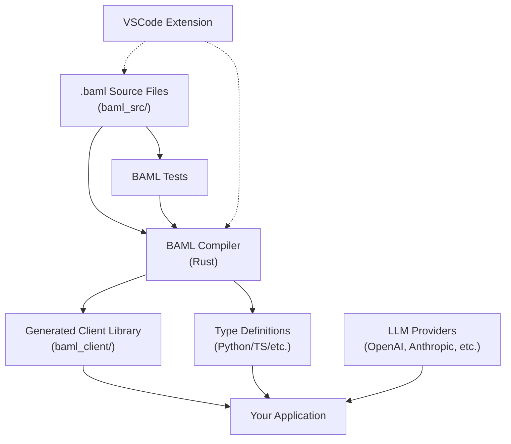

# BAML: A Domain-Specific Language for Reliable AI Prompt Engineering

**Complete Technical Reference & Developer Guide**

---

## Table of Contents

1. [Executive Summary](#executive-summary)
2. [What is BAML?](#what-is-baml)
3. [The Problem with Traditional Prompt Engineering](#the-problem-with-traditional-prompt-engineering)
4. [Core Concepts](#core-concepts)
5. [Architecture Overview](#architecture-overview)
6. [Language Syntax & Basics](#language-syntax--basics)
7. [Schema-Aligned Parsing (SAP)](#schema-aligned-parsing-sap)
8. [Key Features](#key-features)
9. [Real-World Usage & Examples](#real-world-usage--examples)
10. [Performance & Benchmarks](#performance--benchmarks)
11. [Developer Experience](#developer-experience)
12. [Multi-Language Support](#multi-language-support)
13. [Testing & Validation](#testing--validation)
14. [Production Deployment](#production-deployment)
15. [Comparison with Alternatives](#comparison-with-alternatives)
16. [When to Use BAML](#when-to-use-baml)
17. [Getting Started](#getting-started)
18. [Conclusion](#conclusion)
19. [Resources](#resources)

---

## Executive Summary

**BAML (Boundary AI Markup Language)** is a domain-specific language (DSL) that transforms prompt engineering into software engineering by treating LLM prompts as **strongly-typed functions** with defined inputs and structured outputs.

### Key Value Propositions

- **10× more reliable** AI pipelines through type safety and validation
- **2-4× faster** structured output generation compared to OpenAI's native APIs
- **50-80% reduction** in token usage through concise schema definitions
- **Works with any LLM** (OpenAI, Anthropic, Gemini, local models) from day one
- **Multi-language support**: Python, TypeScript, Ruby, Java, Go, C#, Rust
- **Production-ready**: Used by over 1,000 companies including Fortune 50 enterprises

### Mental Model

> "What TypeScript did for JavaScript, BAML does for AI agents. What React/JSX did for web development, BAML does for prompt engineering."

---

## What is BAML?

BAML is a **configuration language** and **compiler toolchain** that:

1. **Defines prompts as typed functions** with explicit inputs and outputs
2. **Generates type-safe client libraries** in your target language
3. **Provides robust parsing** that handles LLM output errors automatically
4. **Enables testing and validation** before deployment

### The Core Philosophy

Instead of writing prompts as unstructured strings:

```python
# Traditional approach ❌
prompt = f"Extract the person's name and skills from: {resume_text}"
response = llm.complete(prompt)
# Hope it returns valid JSON, manually parse, handle errors...
```

BAML treats prompts as functions:

```baml
// BAML approach ✅
class Resume {
  name string
  skills string[]
}

function ExtractResume(resume_text: string) -> Resume {
  client GPT4
  prompt #"
    Extract resume details from: {{ resume_text }}
    {{ ctx.output_format }}
  "#
}
```

Then use it in your application:

```python
# Python
from baml_client import b

resume = b.ExtractResume(raw_text)
print(resume.name)      # Type-safe!
print(resume.skills)    # IDE autocomplete works!
```

---

## The Problem with Traditional Prompt Engineering

### Common Pain Points

#### 1. **No Type Safety or IDE Support**
- Prompts are plain strings → spelling errors only caught at runtime
- No autocomplete, refactoring support, or compile-time checks
- Changes break downstream code silently

#### 2. **Brittle JSON Parsing**
- LLMs frequently output malformed JSON (missing quotes, extra text)
- Requires retry loops, regex hacks, or manual cleanup
- Each retry adds latency and token costs

#### 3. **Maintenance Nightmare**
- Changing output schema requires updating every prompt manually
- No way to track which prompts use which schemas
- Refactoring is error-prone

#### 4. **Testing Difficulties**
- No standard way to test prompts
- Bugs only appear in production
- Hard to validate behavior across model updates

#### 5. **Token Waste**
- Verbose JSON schemas (e.g., `{"type": "array", "items": {"type": "string"}}`)
- Can use 4× more tokens than necessary

#### 6. **Lack of Transparency**
- Prompts hidden in code or configs
- Hard to review what's actually sent to the LLM
- Difficult to audit or debug

---

## Core Concepts

### 1. Prompts as Functions

Every BAML prompt is a **function** with:
- **Named parameters** (typed inputs)
- **Return type** (structured output schema)
- **Client specification** (which LLM to use)
- **Prompt template** (the actual instructions)

```baml
// BAML
function ClassifyTicket(message: string) -> Ticket {
  client GPT4o
  prompt #"
    Classify this support ticket:
    {{ message }}
    
    {{ ctx.output_format }}
  "#
}
```

### 2. Schema Engineering

Define data structures using familiar syntax:

```baml
// BAML

class Ticket {
  category Category
  urgency Urgency
  summary string
}

enum Category {
  Technical
  Billing
  General
}

enum Urgency {
  Low
  Medium
  High
  Critical
}
```

### 3. Separation of Concerns

- **BAML files**: Define prompts, schemas, and LLM configurations
- **Application code**: Business logic, data processing
- **Generated clients**: Type-safe bridge between the two

### 4. The `ctx.output_format` Magic

BAML automatically injects your schema into prompts using `{{ ctx.output_format }}`:

```
Instead of seeing verbose JSON schema, the LLM sees:
{
  category: Category (Technical | Billing | General)
  urgency: Urgency (Low | Medium | High | Critical)
  summary: string
}
```

This concise format:
- Reduces tokens by 50-80%
- Is easier for LLMs to understand
- Matches their training data better

---

## Architecture Overview



### Compilation Pipeline

1. **Parsing**: Convert `.baml` files to Abstract Syntax Tree (AST)
2. **Type Checking**: Validate schemas, function signatures
3. **Code Generation**: Produce language-specific client code
4. **Optional Bytecode**: Compile to bytecode for VM execution

### Runtime Flow

1. Application calls `b.FunctionName(args)`
2. Generated client constructs prompt with schema
3. Request sent to configured LLM provider
4. **SAP parser** validates and coerces response
5. Type-safe object returned to application

---

## Language Syntax & Basics

### Data Types

#### Primitive Types
```baml
// BAML
string   // Text
int      // Integer
float    // Floating point
bool     // Boolean
```

#### Complex Types
```baml
// BAML
string[]           // Array of strings
int?               // Optional integer
map<string, int>   // Map/dictionary
```

#### Custom Types
```baml
// BAML
class Person {
  name string
  age int
  email string?              // Optional field
  skills string[]            // Array
  metadata map<string, string>
}
```

#### Enums
```baml
// BAML
enum Status {
  Active
  Inactive
  Pending
}
```

#### Unions
```baml
// BAML
// Either type A or type B
class Result {
  data Success | Error
}
```

### Multimodal Types
```baml
// BAML
Image    // Image inputs
Audio    // Audio files
Video    // Video files (provider-dependent)
```

### Functions

```baml
// BAML
function ExtractData(
  document: string,
  context: string?
) -> DocumentData {
  client Anthropic/Claude
  prompt #"
    {{ document }}
    
    
    Additional context: {{ context }}
    
    
    {{ ctx.output_format }}
  "#
}
```

### Annotations

```baml
// BAML
class Product {
  name string @description("Product name in English")
  
  price float @assert({{ this > 0 }}, "Price must be positive")
  
  category Category @alias("product_category")
}
```

### Client Configuration

```baml
// BAML
client<llm> GPT5 {
  provider openai
  options {
    model "gpt-5.2"
    api_key env.OPENAI_API_KEY
    temperature 0.0
  }
}

client<llm> Claude {
  provider anthropic
  options {
    model "claude-sonnet-4-20250514"
    api_key env.ANTHROPIC_API_KEY
  }
}
```

### Retry Policies

```baml
// BAML
retry_policy StandardRetry {
  max_retries 3
  strategy {
    type exponential_backoff
    initial_delay 1000  // ms
    max_delay 10000
  }
}

client<llm> GPT5WithRetry {
  provider openai
  retry_policy StandardRetry
  options {
    model "gpt-5.2"
  }
}
```

### Fallback Strategies

```baml
// BAML
client<llm> RobustClient {
  provider fallback
  options {
    strategy [GPT5, Claude, Gemini]
  }
}
```

---

## Schema-Aligned Parsing (SAP)

### The Problem SAP Solves

Traditional approaches require **strict JSON compliance**:
- Missing quote → entire parse fails
- Extra text → retry needed
- Wrong format → another API call

Each failure costs:
- Additional latency (2-5 seconds per retry)
- Extra tokens (~500-1000 per retry)
- User frustration

### How SAP Works

SAP is a **Rust-based algorithm** (~10ms execution) that:

1. **Aligns tokens** from LLM output with expected schema
2. **Corrects common errors**:
   - Missing quotes around keys/values
   - Trailing commas
   - Extra whitespace
   - Mixed quote styles
3. **Coerces types** (string "42" → int 42)
4. **Handles extra content** (markdown, chain-of-thought)

### Example

This malformed output **parses successfully** with SAP:

```javascript
// BAML
// LLM returns (missing quotes):
[
  { streaming_service: Netflix, show_list: [Friends], sort_by_rating: true },
  { streaming_service: Hulu, show_list: [The Office, Stranger Things] }
]

// SAP successfully parses to:
[
  { 
    "streaming_service": "Netflix", 
    "show_list": ["Friends"], 
    "sort_by_rating": true 
  },
  { 
    "streaming_service": "Hulu", 
    "show_list": ["The Office", "Stranger Things"],
    "sort_by_rating": null  // Missing field handled
  }
]
```

### Performance Impact

- **Parsing time**: <10ms (vs 2-5s for LLM retry)
- **Cost**: Free (vs $0.0001-0.001 per retry)
- **Success rate**: Near 100% for structured tasks
- **Token savings**: No retry overhead

### Comparison to Alternatives

| Approach | Parse Failures | Avg Latency | Token Overhead |
|----------|---------------|-------------|----------------|
| JSON.parse() | 15-30% | +0s | 0 tokens |
| JSON Mode + Retry | 5-10% | +2-5s | +500-1000 tokens |
| Constrained Generation | 1-5% | +0.5-1s | +200-500 tokens |
| **BAML SAP** | **<1%** | **+0.01s** | **-300 tokens** |

---

## Key Features

### 1. Type-Safe Code Generation

```typescript
// Generated TypeScript client
import { b } from "./baml_client";

// Full type inference and autocomplete
const resume: Resume = await b.ExtractResume(text);
console.log(resume.name);     // ✅ Type-safe
console.log(resume.invalid);  // ❌ Compile error
```

### 2. Streaming Support

```python
# Stream partial results as they arrive
stream = b.stream.ExtractResume(resume_text)

for partial in stream:
    print(f"Progress: {partial.name or 'pending'}")
    
final_result = stream.get_final_response()
```

```typescript
// TypeScript streaming
const stream = b.stream.ExtractResume(resumeText);

for await (const partial of stream) {
  console.log(partial);  // Partial<Resume>
}

const final = await stream.getFinalResponse();
```

### 3. Native Testing Framework

```baml
// BAML
test ResumeExtraction {
  functions [ExtractResume]
  args {
    resume_text #"
      Srini Ragothaman
      Senior Software Engineer
      Skills: Java, Python, TypeScript
    "#
  }
}
```

Run tests:
```bash
baml test                    # Run all tests
baml test ResumeExtraction  # Run specific test
baml test --filter resume   # Filter by name
baml test --parallel        # Run in parallel
```

### 4. Visual Prompt Playground

The VSCode extension provides:
- **Live prompt preview** with actual variable substitution
- **Instant testing** without running your app
- **Raw cURL visibility** to see exact API calls
- **Response inspection** with schema validation
- **Hot reload** for rapid iteration

### 5. Multi-Provider Support

```baml
// BAML
// Works with any provider
client<llm> Local {
  provider openai-compatible
  options {
    base_url "http://localhost:11434"
    model "llama3"
  }
}
```

Supported providers:
- OpenAI (GPT-5.2, GPT-4, GPT-3.5)
- Anthropic (Claude 3.5 Sonnet, Claude 4.5)
- Google (Gemini, Vertex AI)
- AWS Bedrock
- Azure OpenAI
- Ollama, VLLM, LMStudio
- OpenRouter, Together.ai
- Any OpenAI-compatible API

### 6. Validation & Constraints

```baml
// BAML
class Order {
  total_price float @assert({{ this > 0 }})
  
  items OrderItem[] @assert({{ this.length > 0 }}, 
                            "Order must have at least one item")
  
  status OrderStatus @check(
    {{ this == "pending" or this == "processing" }},
    "Invalid initial status"
  )
}
```

### 7. Dynamic Types

```python
# Python
# Build schemas at runtime
from baml_client import TypeBuilder

builder = TypeBuilder()
builder.add_class("DynamicEntity", {
    "name": "string",
    "attributes": builder.field("map<string, string>")
})

result = b.ExtractData(text, type_builder=builder)
```

---

## Real-World Usage & Examples

### Example 1: Resume Parsing

```baml
// BAML
class Experience {
  role string @description("Job title")
  company string
  start_date string @description("Format: YYYY-MM")
  end_date string? @description("Format: YYYY-MM or 'Present'")
}

class Resume {
  name string
  email string?
  phone string?
  experience Experience[]
  skills string[]
  education string[]
}

function ExtractResume(resume_text: string) -> Resume {
  client GPT4o
  prompt #"
    Extract structured information from this resume:
    
    {{ resume_text }}
    
    {{ ctx.output_format }}
  "#
}
```

Usage:
```python
# Python
from baml_client import b

resume_text = """
Srini Ragothaman
srini@boundaryml.com | (555) 123-4567

Experience:
- Senior Software Engineer at TechCorp (Jan 2020 - Present)
- Software Engineer at StartupXYZ (Jun 2018 - Dec 2019)

Skills: Java, Python, TypeScript, React, AWS, Docker
"""

result = b.ExtractResume(resume_text)
print(f"{result.name} has {len(result.experience)} positions")
for exp in result.experience:
    print(f"- {exp.role} at {exp.company}")
```

### Example 2: Receipt OCR

```baml
// BAML
class ReceiptItem {
  description string
  quantity float
  unit string? @description("e.g., 'lbs', 'gallons'")
  price float
}

class Receipt {
  merchant string
  date string
  total float
  items ReceiptItem[]
  payment_method string?
}

function ExtractReceipt(image: Image) -> Receipt {
  client GPT4Vision
  prompt #"
    Extract all details from this receipt image.
    
    {{ image }}
    {{ ctx.output_format }}
  "#
}
```

Usage:
```python
# Python
from baml_client import b
from baml_client.types import ImageUrl

image = ImageUrl("https://example.com/receipt.jpg")
receipt = b.ExtractReceipt(image)

print(f"Total: ${receipt.total}")
for item in receipt.items:
    print(f"- {item.quantity} {item.description}: ${item.price}")
```

### Example 3: Customer Support Classifier

```baml
// BAML
enum TicketCategory {
  Technical @alias("tech")
  Billing
  Account
  Feature_Request @alias("feature")
}

enum TicketUrgency {
  Low
  Medium
  High
  Critical
}

class Ticket {
  category TicketCategory
  urgency TicketUrgency
  summary string @description("One-sentence summary")
  suggested_action string?
}

function ClassifyTicket(message: string, history: string?) -> Ticket {
  client Claude
  prompt #"
    Classify this support ticket:
    
    Message: {{ message }}
    
    
    Previous conversation:
    {{ history }}
    
    
    {{ ctx.output_format }}
  "#
}
```

### Example 4: RAG with Citations

```baml
// BAML
class Citation {
  source string
  page_number int?
  relevance_score float @assert({{ this >= 0 and this <= 1 }})
}

class AnswerWithCitations {
  answer string
  citations Citation[]
  confidence float @assert({{ this >= 0 and this <= 1 }})
}

function RAGAnswer(
  query: string,
  context: string[]
) -> AnswerWithCitations {
  client GPT4o
  prompt #"
    Answer this question using only the provided context.
    Include citations for all claims.
    
    Question: {{ query }}
    
    Context:
    
    [{{ loop.index }}] {{ doc }}
    
    
    {{ ctx.output_format }}
  "#
}
```

---

## Performance & Benchmarks

### Berkeley Function Calling Leaderboard Results

BAML achieves **state-of-the-art** results:

| Model | Method | Accuracy | Speed | Cost |
|-------|--------|----------|-------|------|
| GPT-4o | OpenAI Structured | 94.2% | 1.0× | 1.0× |
| GPT-4o | **BAML + SAP** | **96.1%** | **2.4×** | **0.6×** |
| GPT-4o-mini | OpenAI Structured | 88.5% | 1.0× | 1.0× |
| GPT-4o-mini | **BAML + SAP** | **91.3%** | **3.1×** | **0.5×** |
| Claude-3.5 | Native | 93.8% | 1.0× | 1.0× |
| Claude-3.5 | **BAML + SAP** | **95.7%** | **2.8×** | **0.6×** |

### Token Efficiency

**Example: User profile extraction**

Traditional JSON schema approach:
```json
{
  "type": "object",
  "properties": {
    "name": {"type": "string"},
    "skills": {
      "type": "array",
      "items": {"type": "string"}
    }
  },
  "required": ["name", "skills"]
}
```
**~120 tokens**

BAML schema:
```
{
  name: string
  skills: string[]
}
```
**~25 tokens** (79% reduction)

### Real-World Impact

**Case Study: LangChain Graph RAG → BAML**
- Success rate: 25% → **99.4%**
- Average latency: 8.2s → **2.1s**
- Token costs: -60%
- Development time: -70%

---

## Developer Experience

### IDE Integration

**VSCode Extension Features:**
- Syntax highlighting
- Code completion
- Inline type checking
- Prompt visualization
- Interactive testing
- Error diagnostics

### Instant Feedback Loop

```
Traditional: Write code → Build → Run app → Test → Debug → Repeat
            (2-5 minutes per iteration)

BAML: Write .baml → Test in editor → Iterate
      (5-10 seconds per iteration)
```

**Result: 10-30× faster iteration**

### Version Control Friendly

```bash
# All prompts in source control
baml_src/
  ├── schemas.baml
  ├── extraction.baml
  ├── classification.baml
  └── generation.baml

# Generated code (gitignored)
baml_client/
  ├── __init__.py
  ├── types.py
  └── async_client.py
```

### CI/CD Integration

```yaml
# .github/workflows/test.yml
name: Test BAML Functions

on: [push, pull_request]

jobs:
  test:
    runs-on: ubuntu-latest
    steps:
      - uses: actions/checkout@v3
      - name: Install BAML
        run: npm install -g @boundaryml/baml
      - name: Run BAML tests
        run: baml test
        env:
          OPENAI_API_KEY: ${{ secrets.OPENAI_API_KEY }}
```

---

## Multi-Language Support

### Python

```python
from baml_client import b
from baml_client.types import Resume

# Sync
resume: Resume = b.ExtractResume(text)

# Async
resume: Resume = await b.async_extract_resume(text)

# Streaming
stream = b.stream.ExtractResume(text)
for partial in stream:
    print(partial)
```

### TypeScript

```typescript
import { b } from "./baml_client";
import type { Resume } from "./baml_client/types";

// Async
const resume: Resume = await b.ExtractResume(text);

// Streaming
const stream = b.stream.ExtractResume(text);
for await (const partial of stream) {
  console.log(partial);
}
```

### Ruby

```ruby
require 'baml_client'

# Sync
resume = BamlClient.extract_resume(text)
puts resume.name

# Async
resume = BamlClient.async_extract_resume(text).wait
```

### Java

```java
import com.boundaryml.baml.BamlClient;
import com.boundaryml.baml.types.Resume;

BamlClient client = new BamlClient();
Resume resume = client.extractResume(text);
System.out.println(resume.getName());
```

### Go

```go
import "github.com/boundaryml/baml/go"

client := baml.NewClient()
resume, err := client.ExtractResume(text)
if err != nil {
    log.Fatal(err)
}
fmt.Println(resume.Name)
```

---

## Testing & Validation

### Test Structure

```baml
// BAML
test ExtractSriniRagothamanResume {
  functions [ExtractResume]
  args {
    resume_text #"
      Srini Ragothaman
      Software Engineer
      Skills: Python, Rust
    "#
  }
}

test ExtractJaneSmithResume {
  functions [ExtractResume]
  args {
    resume_text file("fixtures/jane-resume.txt")
  }
  // Optional: Assert expected results
  asserts {
    resume.name == "Jane Smith"
    resume.skills.length >= 3
  }
}
```

### Running Tests

```bash
# Run all tests
baml test

# Run specific test
baml test ExtractSriniRagothamanResume

# Filter tests
baml test --filter extract

# Parallel execution
baml test --parallel

# Watch mode
baml test --watch

# Verbose output
baml test --verbose
```

### Validation Strategies

```baml
// BAML
class ValidatedOrder {
  id string @assert({{ this.length == 10 }}, "Invalid ID length")
  
  total float @assert(
    {{ this > 0 and this < 1000000 }},
    "Total must be between 0 and 1M"
  )
  
  items OrderItem[] @assert(
    {{ this.length > 0 and this.length <= 100 }},
    "Must have 1-100 items"
  )
  
  status OrderStatus @check(
    {{ ["pending", "processing", "shipped"].includes(this) }},
    "Invalid order status"
  )
}
```

---

## Production Deployment

### Environment Configuration

```baml
// BAML
// baml_src/clients.baml
client<llm> Production {
  provider openai
  options {
    model "gpt-4o"
    api_key env.OPENAI_API_KEY
    max_tokens 2000
    temperature 0.0
  }
  retry_policy ProductionRetry
}

client<llm> Development {
  provider openai
  options {
    model "gpt-4o-mini"
    api_key env.OPENAI_API_KEY
  }
}

retry_policy ProductionRetry {
  max_retries 3
  strategy {
    type exponential_backoff
    initial_delay 1000
    max_delay 10000
  }
}
```

### Usage in Application

```python
# Python
import os
from baml_client import b

# Use environment-specific client
if os.getenv("ENV") == "production":
    result = b.ExtractResume.with_client("Production")(text)
else:
    result = b.ExtractResume.with_client("Development")(text)
```

### Monitoring & Observability

```python
# Python
from baml_client import b
from baml_client.tracing import Collector

# Collect metrics
collector = Collector()

result = b.ExtractResume(text, collector=collector)

# Access metrics
print(f"Tokens: {collector.total_tokens}")
print(f"Latency: {collector.latency_ms}ms")
print(f"Raw response: {collector.raw_response}")
```

### Error Handling

```python
# Python
from baml_client import b
from baml_client.errors import BamlError, BamlValidationError

try:
    resume = b.ExtractResume(text)
except BamlValidationError as e:
    # Schema validation failed
    print(f"Validation error: {e.message}")
    print(f"Field: {e.field}")
    print(f"Value: {e.value}")
except BamlError as e:
    # Other BAML errors (API, parsing, etc.)
    print(f"BAML error: {e}")
```

---

## Comparison with Alternatives

| Feature | LangChain | Instructor | Marvin | OpenAI Structured | **BAML** |
|---------|-----------|-----------|--------|-------------------|----------|
| **Type Safety** | ⚠️ Runtime | ✅ Pydantic | ✅ Pydantic | ✅ Native | ✅ **Native + Generated** |
| **Multi-Language** | ❌ Python only | ❌ Python only | ❌ Python only | 🟡 SDK-dependent | ✅ **7+ languages** |
| **Token Efficiency** | ❌ Verbose | ❌ Verbose | ❌ Verbose | 🟡 Good | ✅ **50-80% savings** |
| **Parsing Robustness** | ❌ JSON.parse | ⚠️ Retries | ⚠️ Retries | 🟡 Good | ✅ **SAP (<1% failure)** |
| **IDE Support** | ⚠️ Basic | ⚠️ Basic | ⚠️ Basic | ⚠️ Basic | ✅ **Full LSP** |
| **Testing Framework** | ⚠️ Manual | ⚠️ Manual | ⚠️ Manual | ⚠️ Manual | ✅ **Built-in** |
| **Streaming** | ✅ Yes | ✅ Yes | ❌ No | ✅ Yes | ✅ **Typed partials** |
| **Works Day-1 w/ New Models** | ⚠️ Depends | ⚠️ Depends | ⚠️ Depends | ❌ OpenAI only | ✅ **Any model** |
| **Prompt Transparency** | ⚠️ Hidden | ⚠️ Hidden | ⚠️ Hidden | ⚠️ Hidden | ✅ **Full visibility** |

---

## When to Use BAML

### ✅ Ideal Use Cases

1. **Structured data extraction** (receipts, resumes, documents)
2. **Classification & routing** (support tickets, content moderation)
3. **RAG systems** with typed responses and citations
4. **Agent workflows** requiring reliable tool calls
5. **Production systems** where reliability matters
6. **Multi-language projects** (one schema, many clients)
7. **Teams** wanting prompt review and version control

### ⚠️ Consider Alternatives When

1. **Simple one-off prompts** with no structure needs
2. **Pure text generation** (creative writing, chatbots)
3. **Prototype/exploration** with frequent prompt changes
4. **No structured output** requirements

### 🎯 BAML Excels At

- **Replacing brittle JSON parsing** with robust SAP
- **Reducing token costs** through schema efficiency
- **Improving reliability** from 70-90% → 95-99%+
- **Accelerating development** with instant testing
- **Enabling refactoring** with type safety

---

## Getting Started

### Installation

**Python:**
```bash
pip install baml-py
baml-cli init
```

**TypeScript:**
```bash
npm install @boundaryml/baml
npx baml-cli init
```

**Ruby:**
```bash
gem install baml
baml-cli init
```

**Go:**
```bash
go get github.com/boundaryml/baml
baml-cli init
```

### Quick Start

1. **Create a BAML file** (`baml_src/main.baml`):

```baml
// BAML

class Person {
  name string
  age int
}

function ExtractPerson(text: string) -> Person {
  client GPT4o
  prompt #"
    Extract the person's name and age from:
    {{ text }}
    
    {{ ctx.output_format }}
  "#
}

client<llm> GPT4o {
  provider openai
  options {
    model "gpt-4o"
    api_key env.OPENAI_API_KEY
  }
}
```

2. **Generate client code:**
```bash
baml-cli generate
```

3. **Use in your application:**

```python
# Python
from baml_client import b

person = b.ExtractPerson("Srini is 40 years old")
print(f"{person.name} is {person.age}")
```

```typescript
// TypeScript
import { b } from "./baml_client";

const person = await b.ExtractPerson("Srini is 40 years old");
console.log(`${person.name} is ${person.age}`);
```

4. **Add a test:**

```baml
// BAML
test ExtractSrini {
  functions [ExtractPerson]
  args {
    text "Srini is 40 years old"
  }
}
```

5. **Run tests:**
```bash
baml-cli test
```

6. **HTTP serve**

The `serve` command starts a BAML-over-HTTP API server that exposes your BAML functions via HTTP endpoints. This feature allows you to interact with your BAML functions through a RESTful API interface.

#### Usage

```bash
baml-cli serve [OPTIONS]
```

**For active development with hot-reload:**

```bash
baml-cli dev [OPTIONS]
```

[See more about `dev` command](https://docs.boundaryml.com/ref/baml-cli/dev)

#### Options

| Option | Description | Default |
|--------|-------------|---------|
| `--from <PATH>` | Path to the `baml_src` directory | `./baml_src` |
| `--port <PORT>` | Port to expose BAML on | `2024` |
| `--no-version-check` | Generate `baml_client` without checking for version mismatch | `false` |


#### Description

The `serve` command performs the following actions:

1. Exposes BAML functions as HTTP endpoints on the specified port
2. Provides authentication middleware for secure access


#### Endpoints

##### Function Endpoints

**`POST /call/:function_name`** - Call a BAML function

```bash
curl \
  -X POST \
  "http://localhost:2024/call/MyFunctionName" \
  -H "Content-Type: application/json" \
  -d '{"arg1": "value1", "arg2": "value2"}'
```

**`POST /stream/:function_name`** - Stream results from a BAML function

```bash
curl \
  -X POST \
  "http://localhost:2024/stream/MyFunctionName" \
  -H "Content-Type: application/json" \
  -d '{"arg1": "value1", "arg2": "value2"}'
```

##### Debugging Endpoints

- **`GET /docs`** - Interactive API documentation (Swagger UI)
- **`GET /openapi.json`** - OpenAPI specification for the BAML functions
- **`GET /_debug/ping`** - Health check endpoint
- **`GET /_debug/status`** - Server status and authentication check


#### Stability

`baml-cli serve` is currently in **Tier 2 stability**. This means that the CLI and the HTTP APIs are stable, but there are a number of features which are not yet available:

- The [TypeBuilder API](https://docs.boundaryml.com/ref/baml_client/type-builder)
- The [Collector API](https://docs.boundaryml.com/guide/baml-advanced/collector-track-tokens)
- The [Modular API](https://docs.boundaryml.com/guide/baml-advanced/modular-api)
- Custom trace annotations for [Boundary Studio](https://docs.boundaryml.com/guide/boundary-cloud/observability/tracking-usage)


#### Authentication

**Supported header:** `x-baml-api-key`

Set the `BAML_PASSWORD` environment variable to enable authentication.


#### Examples

##### 1. Start the server with default settings

```bash
baml-cli serve --preview
```

##### 2. Start with custom source directory and port

```bash
baml-cli serve --from /path/to/my/baml_src --port 3000 --preview
```

#### Testing the HTTP server

##### Check if the server is running

```bash
curl http://localhost:2024/_debug/ping
```

##### Call a function

**Without API key:**

```bash
curl -X POST \
  http://localhost:2024/call/MyFunctionName \
  -H "Content-Type: application/json" \
  -d '{"arg1": "value1", "arg2": "value2"}'
```

**With API key:**

```bash
curl -X POST \
  http://localhost:2024/call/MyFunctionName \
  -H "Content-Type: application/json" \
  -H "x-baml-api-key: ${BAML_PASSWORD}" \
  -d '{"arg1": "value1", "arg2": "value2"}'
```

##### Access the API documentation

Open `http://localhost:2024/docs` in your web browser.

---

## Next Steps

- Install VSCode extension for live preview
- Read the full docs at [docs.boundaryml.com](https://docs.boundaryml.com)
- Explore examples at [baml-examples.vercel.app](https://baml-examples.vercel.app)
- Join Discord community for support

---

## Conclusion

BAML represents a **paradigm shift** in AI application development. By treating prompts as first-class code artifacts with:

- **Strong typing** → Catch errors at compile time
- **Testing framework** → Validate behavior before deployment  
- **Multi-language support** → Use any tech stack
- **Robust parsing (SAP)** → 99%+ reliability
- **Token efficiency** → 50-80% cost reduction
- **IDE integration** → 10× faster iteration

BAML brings **software engineering discipline** to prompt engineering, making AI systems:
- More reliable (25% → 99%+ success rates)
- Faster to develop (10× iteration speed)
- Easier to maintain (type-safe refactoring)
- Cheaper to run (2-4× faster, less tokens)

As one developer summarized: *"What TypeScript did for JavaScript, BAML does for AI agents. What React/JSX did for web apps, BAML does for prompt engineering."*

### Key Takeaways

1. **BAML = Prompts as Functions** with types, tests, and tooling
2. **SAP > JSON Mode** for reliability and efficiency
3. **Works with ANY model** from day one
4. **Production-ready** (1,000+ companies use it)
5. **Free and open-source** with commercial support available

---

## Resources

### Official Links
- **Homepage**: [boundaryml.com](https://boundaryml.com)
- **Documentation**: [docs.boundaryml.com](https://docs.boundaryml.com)
- **GitHub**: [github.com/BoundaryML/baml](https://github.com/BoundaryML/baml)
- **Examples**: [baml-examples.vercel.app](https://baml-examples.vercel.app)

### Community
- **Discord**: Join the BAML community
- **Twitter/X**: [@boundary_ml](https://twitter.com/boundary_ml)
- **Blog**: [boundaryml.com/blog](https://boundaryml.com/blog)

### Learning Resources
- [Getting Started Tutorial](https://docs.boundaryml.com/getting-started)
- [BAML Syntax Guide](https://docs.boundaryml.com/syntax)
- [Best Practices](https://docs.boundaryml.com/best-practices)
- [Migration Guides](https://docs.boundaryml.com/migration)

### Technical Deep Dives
- [Schema-Aligned Parsing Explained](https://boundaryml.com/blog/sota-function-calling)
- [BAML vs OpenAI Structured Outputs](https://boundaryml.com/blog/baml-vs-openai)
- [Building Production AI Systems](https://thedataquarry.com/blog/baml-is-building-blocks-for-ai-engineers)
