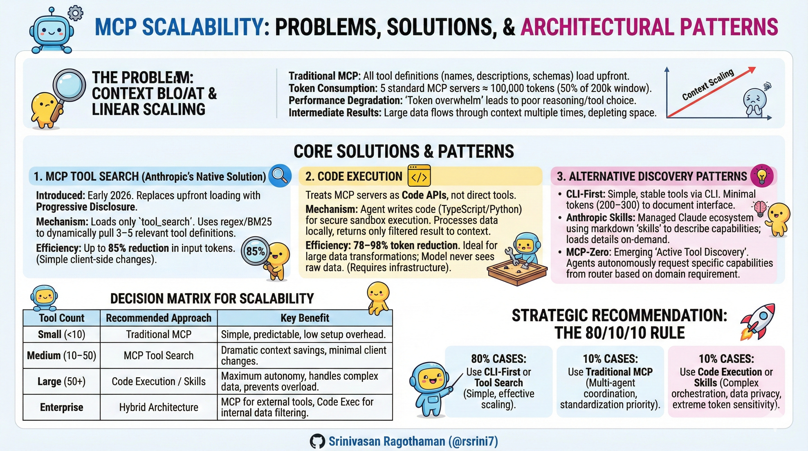
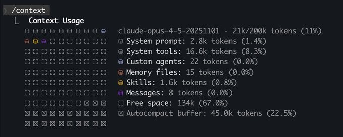
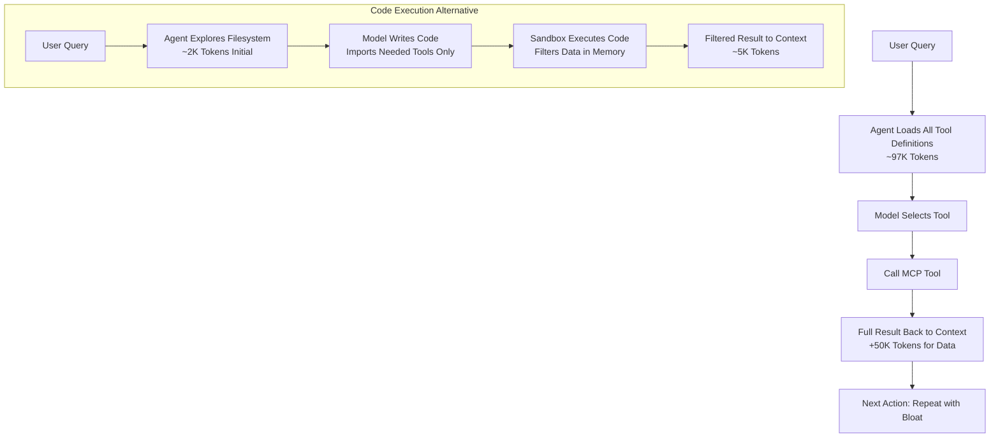
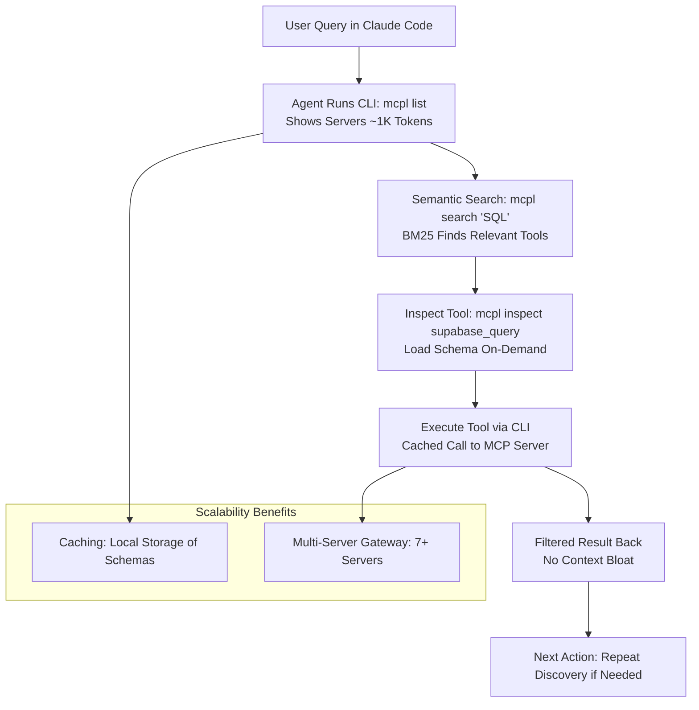

# Model Context Protocol Scalability: Problems, Solutions, and Architectural Patterns

**A Technical Whitepaper on Context Efficiency in AI Agent Systems**




---

## Executive Summary

The Model Context Protocol (MCP) has emerged as the de facto standard for connecting AI agents to external tools and systems since its November 2024 launch. However, as adoption scales, fundamental architectural limitations have become apparent. This whitepaper examines the core scalability problems with MCP—specifically excessive token consumption and rigid tool binding—and presents emerging solutions including Anthropic's native tool search feature, CLI gateways like MCP Launchpad, code execution patterns, progressive disclosure mechanisms, and alternative architectural approaches that achieve 78-98% token reduction while maintaining or improving agent performance.

**Key Findings:**
- Traditional MCP implementations consume 15,000+ tokens per tool invocation, with context bloat scaling linearly with tool count
- Anthropic's tool search feature (January 2026) reduces token usage by up to 85% through dynamic tool loading
- CLI gateway approaches like MCP Launchpad achieve 90-95% token reduction through semantic search and caching
- Code execution approaches reduce token usage by 78.5% while maintaining 100% success rates
- Progressive disclosure and on-demand tool loading eliminate the "context overload" problem that degrades agent autonomy
- A spectrum of solutions exists, each with distinct trade-offs between control, flexibility, and operational complexity

---



---

## 1. The MCP Architecture and Initial Promise

### 1.1 What is MCP?

The Model Context Protocol is an open standard providing a universal interface for connecting AI agents to external systems. Rather than requiring custom integrations for each tool-agent pairing, MCP abstracts tools and data sources into standardized "servers" that any agent can consume.

**Core Components:**
- **MCP Clients**: AI agents that consume tools and resources
- **MCP Servers**: Standards-compliant tool providers
- **Transport Layer**: JSON-RPC based communication
- **Standard Features**: Tools, Resources, Prompts, Sampling

### 1.2 Why MCP Adoption Was Rapid

The protocol solved a real problem: fragmentation and duplicated effort in building agent integrations. Before MCP, connecting an agent to Slack, Google Drive, and Salesforce required three separate custom implementations. MCP unified this into a single standardized pattern.

Since November 2024, the community has built:
- **Thousands of MCP servers** across every major platform
- **SDKs for all major programming languages**
- **Industry-wide adoption** as the de facto standard

---

## 2. The Scalability Crisis: Root Cause Analysis

### 2.1 Problem 1: Tool Definition Overload

**The Core Issue:** MCP loads all tool definitions upfront, directly into the model's context window.

#### Real-World Example
A developer using five standard MCP servers for AI coding (Filesystem, Code Editor, Package Manager, Git, and Docker) experiences:

| Metric | Value |
|--------|-------|
| Total Tool Definitions | 97,000 tokens |
| Claude Sonnet Context Window | 200,000 tokens |
| Percentage Consumed | 48% |
| Remaining for User Query | 52% |

Another example from production environments: seven MCP servers (Render, Sentry, Linear, Supabase, GitHub, Slack, and Google Drive) can consume ~100,000 tokens (50% of a 200K context window), leading to "context rot" and degraded performance even before the agent begins work.

**Why This Happens:**
- Each tool requires: name, description, parameter definitions, type schemas, usage examples
- Multiple MCPs = multiplication effect: 5 servers × 19,400 avg tokens = catastrophic bloat
- Modern LLMs can technically fit these tokens, but performance degrades severely

**Performance Degradation:**
Research shows LLMs perform similarly to GPT-3.5 era systems when asked to choose among dozens of tools—the "token overwhelm" effect where excessive context makes the model less capable, not more.

#### Mathematical Model

$$
\text{Context Used} = \sum_{i=1}^{n} \text{Tokens}_i + \text{System Prompt} + \text{User Query}
$$

Where for MCP:
- n = number of connected MCPs
- Each Tokens_i = all tool definitions, not just needed ones
- No selective loading mechanism exists in traditional MCP

### 2.2 Problem 2: Intermediate Result Bloat

**The Secondary Issue:** Every tool call result must pass back through the model's context window, forcing repetition of data.

#### Example Flow: Google Drive to Salesforce Integration

```
Step 1: Agent receives request: "Download transcript and add to Salesforce"
        Context consumed: Tool definitions (97K tokens) + Query (100 tokens)

Step 2: Call gdrive.getDocument(documentId: "abc123")
        Returns: Full transcript text (50,000 tokens of actual content)
        
        Context now includes:
        - Original tool definitions (97K)
        - System prompt
        - User query
        - Retrieved transcript (50K)
        
Step 3: Model must now craft next action
        Context becomes: 97K + 50K + tool definitions again
        
Step 4: Call salesforce.updateRecord()
        Full transcript MUST be rewritten in context
        
TOTAL: Transcript flows through context TWICE
       Additional cost: +50,000 tokens for single integration
```

For a 2-hour meeting transcript (1.5-2 MB of text), this becomes prohibitive.

**Compounding Effect:**
- Simple workflows with 3 sequential API calls = 3× the data flows through context
- Complex workflows with branching = exponential context multiplication
- Documents exceeding context window limits = workflow failures

### 2.3 Problem 3: No Progressive Disclosure

**The Architectural Gap:** Traditional MCP had no built-in mechanism for "discovering" tools on-demand.

Traditional MCP flow:
1. Connect to MCP server
2. All tools load upfront
3. Model sees everything
4. Model "forgets" most tools it won't use
5. On next request, repeat from step 1

**Why This Matters:**
An e-commerce platform might expose 500+ tools across:
- Product management (150 tools)
- Inventory (120 tools)
- Customer management (130 tools)
- Reporting (100 tools)

A single request might need 5-10 tools, yet all 500 descriptions consume tokens. Unlike Unix filesystems where you list a directory only when needed, traditional MCP had no equivalent—all tools were always "visible" to the model.

### 2.4 Problem 4: Rigid Tool Binding

**The Design Limitation:** Tools are statically defined; new capabilities cannot be generated dynamically.

If an agent needs to combine multiple API calls into a custom workflow, it cannot create a new tool. Instead, it must orchestrate multiple existing tools, each consuming context and context window space.

---

## 3. Quantified Impact: Benchmarks

### 3.1 Token Consumption Comparison

Benchmark: Agent integrating Google Drive → Salesforce with 5-7 MCPs connected

| Aspect | Traditional MCP | Tool Search | CLI Gateway | Code Execution | Reduction (vs Traditional) |
|--------|-----------------|-------------|-------------|----------------|---------------------------|
| **Input Tokens** | 15,417 per call | ~2,300 per call | ~1,500 per call | 3,310 per call | 85% / 90% / 78.5% |
| **Tool Definitions** | All 97K loaded | Dynamic 3-5 tools (~10K) | Cached/search-based (~2K initial) | Only needed tools | ~90% / ~98% / ~85% |
| **Intermediate Results** | Passed through context | Passed through context | Filtered in CLI | Filtered in execution | - / - / ~90% |
| **Output Tokens** | 87 | ~150 (est.) | ~120 (est.) | 192 | - |
| **Total Tokens** | 775,197 | ~116,000 (est.) | ~100,000 | 175,081 | 85% / 87% / 77.4% |
| **Success Rate** | 100% | 100% | 100% | 100% | Same |
| **Latency** | 9.66s | 11-12s (with searches) | ~9s (minimal overhead) | 10.37s | +7-24% / ~0% / +7% |

**Cost Implications:**
- Input tokens: $0.30/1M (cheaper)
- Output tokens: $1.50/1M (expensive)
- Tool Search: 85% input reduction with minimal output increase = ~80% cost reduction
- CLI Gateway: 90% input reduction with minimal output increase = ~85% cost reduction
- Code Execution: 78% input reduction >> 2.2× output increase = ~70% cost reduction

### 3.2 Scaling Characteristics

How token consumption grows with tool count:

| Tool Count | Traditional MCP | Tool Search | CLI Gateway | Dynamic Toolset | Code Execution |
|-----------|-----------------|-------------|-------------|-----------------|-----------------|
| 10 tools | 10K tokens | 3K tokens | 1K tokens | 2K tokens | 1.5K tokens |
| 50 tools | 50K tokens | 10K tokens | 1.5K tokens | 3K tokens | 2.2K tokens |
| 100 tools | 100K tokens | 12K tokens | 2K tokens | 3.5K tokens | 2.8K tokens |
| 500 tools | 500K tokens | 15K tokens | 3K tokens | 4.5K tokens | 4.2K tokens |

**Key Insight:** Tool search, CLI gateways, code execution, and dynamic approaches maintain near-constant token consumption as tools scale; traditional MCP scales linearly with toolset size.

---

## 4. Emerging Solutions: MCP Tool Search

### 4.1 Anthropic's Native Solution (January 2026)

In response to widespread context bloat issues, Anthropic introduced the MCP tool search feature, which allows clients to dynamically load tools into context only when needed, rather than pre-loading all of them.

**Key Mechanics:**
- Claude initially loads only the `tool_search` tool
- When a query is made, the system searches the tool catalog for relevant tools
- Only the full definitions of 3-5 relevant tools are then loaded into the context
- Can achieve up to 85% token reduction when tool definitions occupy >10% of context window

### 4.2 Tool Search Variants

#### Regular Expression-based Search
Claude writes patterns (e.g., "weather*", "get_star_data"). Best for tools with consistent naming conventions.

```json
{
  "tool": "tool_search",
  "parameters": {
    "pattern": "weather.*",
    "type": "regex"
  }
}
```

#### BM25 (Keyword-based Search)
Claude uses natural language queries (e.g., "tool for weather", "database operations"). Better when tool names and descriptions vary.

```json
{
  "tool": "tool_search",
  "parameters": {
    "query": "tools for fetching weather data",
    "type": "bm25"
  }
}
```

### 4.3 Implementation Steps

**Client-Side Setup:**
1. **Enable the beta**: Add the specific header to your API request
2. **Add tool_search tool**: Include this tool (regex or BM25 based) and do NOT set `defer_loading` on it
3. **Mark non-essential tools for deferred loading**: Add `defer_loading: true` to tools you don't want to load immediately
4. **Keep essential tools loaded**: Maintain 3-5 frequently used tools with `defer_loading: false` for immediate access

**Server-Side Best Practices:**
- **Lead with function**: Start descriptions with the tool's primary function
- **Be concise**: Keep descriptions to one or two sentences
- **Add searchable keywords**: Include terms like "fetch," "get," "retrieve," and synonyms
- **Use input schema for constraints**: Descriptions are for discovery, schema for validation
- **Optimize for tokens**: Every word costs tokens
- **Server instructions**: Use this field to guide Claude on tool workflow and order of operations

### 4.4 When to Use Tool Search

**Use Tool Search when:**
- You have 10 or more MCP tools
- Your tools occupy more than 10% of your agent's context
- Tools have varying usage patterns (some frequent, many occasional)
- You want a simple, client-side solution with no server changes

**Skip Tool Search when:**
- You only have 3-5 tools
- All your tools are frequently used
- Latency is absolutely critical (search adds 1-2 seconds)
- Tools are already well-organized with other progressive disclosure

### 4.5 Common Pitfalls

- **Don't defer load the tool_search tool itself** - It must be available immediately
- **Don't make descriptions too short** - Keywords matter for search quality
- **Don't keep too many tools without deferred loading** - This negates the benefits
- **Don't use vague descriptions** - Specific, action-oriented language works best

### 4.6 Comparison to Other Approaches

| Aspect | Tool Search | CLI Gateway | Code Execution |
|--------|-------------|-------------|----------------|
| Token Reduction | 85% | 90-95% | 78-98% |
| Setup Complexity | Low (client-side only) | Low (global CLI install) | Medium (filesystem structuring) |
| Dynamic Capabilities | Limited to existing tools | Medium (search-based) | High (programmatic composition) |
| Latency Overhead | Search time (1-2s) | CLI calls (<0.5s) | Sandbox execution (~1s) |
| Server Changes Required | No | No | No |
| Best For | Standard MCP workflows | Multi-server discovery | Custom/complex integrations |

**Key Insight:** Tool search directly addresses Problems 1 and 3 (tool definition overload and progressive disclosure) while maintaining full MCP compatibility. It's the simplest solution for most MCP users experiencing context bloat.

---

## 5. The Code Execution Solution

### 5.1 Fundamental Shift: Code as Interface

Instead of presenting tools as direct-callable functions, code execution treats MCP servers as **code APIs** that agents can invoke programmatically.

#### Architecture Change

```
Traditional MCP:
User → Agent → [MCP Client loads all tool definitions] → [Model selects tool] → [Call tool] → [Result back to context]

Code Execution:
User → Agent → [Filesystem of tool definitions] → [Model writes code] → [Sandbox execution] → [Result returned]
```

### Traditional MCP vs. Code Execution Flow



### 5.2 Implementation Pattern

Create a structured filesystem where each tool becomes a TypeScript/Python module:

```
servers/
├── google-drive/
│   ├── getDocument.ts
│   ├── searchFiles.ts
│   ├── uploadFile.ts
│   └── index.ts
├── salesforce/
│   ├── updateRecord.ts
│   ├── queryRecords.ts
│   ├── createRecord.ts
│   └── index.ts
└── slack/
    ├── sendMessage.ts
    ├── getChannelHistory.ts
    └── index.ts
```

Each tool file defines:
- Input interface (TypeScript type)
- Output interface
- Implementation wrapper

```typescript
// servers/google-drive/getDocument.ts
import { callMCPTool } from "../../../client.js";

interface GetDocumentInput {
  documentId: string;
  fields?: string;
}

interface GetDocumentResponse {
  content: string;
  metadata: Record<string, any>;
}

export async function getDocument(
  input: GetDocumentInput
): Promise<GetDocumentResponse> {
  return callMCPTool<GetDocumentResponse>(
    'google_drive__get_document',
    input
  );
}
```

### 5.3 Agent Workflow with Code Execution

**Request:** "Download my meeting transcript from Google Drive and add it to Salesforce"

**Agent-Generated Code:**
```typescript
import * as gdrive from './servers/google-drive';
import * as salesforce from './servers/salesforce';

// Load transcript without context bloat
const transcript = (await gdrive.getDocument({ 
  documentId: 'abc123' 
})).content;

// Transform/filter in execution environment
const summary = transcript
  .split('\n')
  .slice(0, 10)  // First 10 lines only
  .join('\n');

// Update Salesforce with filtered data
await salesforce.updateRecord({
  objectType: 'SalesMeeting',
  recordId: '00Q5f000001abcXYZ',
  data: { Notes: summary }
});

console.log("Meeting notes updated successfully");
```

**What Happens:**
1. Tool definitions loaded on-demand (filesystem discovery)
2. Transcript loaded into execution memory, NOT context
3. Filtering happens in code execution layer
4. Only the summary flows to Salesforce API
5. Model never sees the full transcript
6. Context consumed: ~2,000 tokens instead of 150,000

### 5.4 Benefits Breakdown

#### Benefit 1: Progressive Disclosure
Models discover tools by exploring the filesystem. When the model identifies a need (e.g., "I should query Slack"), it reads only the relevant tool file.

```typescript
// Agent thinks: "I need to search Slack"
// Instead of loading 500+ tools, it:
const tools = fs.readdirSync('./servers/slack');
// Then reads only needed tools from that directory
```

#### Benefit 2: Context-Efficient Data Transformation
Large datasets are filtered in the execution environment before returning to context:

```typescript
// Without code execution: Load all 10,000 rows into context
const TOOL_CALL: gdrive.getSheet(sheetId: 'abc123')
→ returns 10,000 rows in context to filter manually

// With code execution: Filter in execution layer
const allRows = await gdrive.getSheet({ sheetId: 'abc123' });
const pendingOrders = allRows.filter(row => 
  row["Status"] === 'pending'
);
console.log(pendingOrders); // Agent sees only 50 rows
```

**Result:** Agent focuses on business logic instead of data marshalling.

#### Benefit 3: Control Flow in Code
Loops, conditionals, and error handling execute deterministically:

```typescript
// Listen for deployment notification with exponential backoff
let found = false;
let attempt = 0;

while (!found && attempt < 10) {
  const messages = await slack.getChannelHistory({ 
    channel: 'C123456' 
  });
  
  found = messages.some(m => 
    m.text.includes('deployment complete')
  );
  
  if (!found) {
    await new Promise(r => setTimeout(r, 5000 * Math.pow(2, attempt)));
    attempt++;
  }
}

console.log('Deployment notification received');
```

Without code execution: Agent must loop through tool calls, burning tokens each iteration.
With code execution: Single sandboxed loop.

#### Benefit 4: Privacy and Security
Sensitive data never reaches the model:

```typescript
// MCP approach: All data exposed to model
const sheet = await gdrive.getSheet({ sheetId: 'abc123' });
// sheet contains: customer emails, phone numbers, credit cards
// Model context now contains all PII

// Code execution with tokenization:
const sheet = await gdrive.getSheet({ sheetId: 'abc123' });
for (const row of sheet.rows) {
  // MCP harness intercepts and tokenizes PII
  await salesforce.updateRecord({
    objectType: 'Lead',
    recordId: row.salesforceId,
    data: {
      Email: row.email,    // [EMAIL_1] - tokenized
      Phone: row.phone,    // [PHONE_1] - tokenized
      Name: row.name       // [NAME_1] - tokenized
    }
  });
}
// Real data flows to Salesforce; model never sees raw PII
```

Enterprise clients can define deterministic rules: "Email addresses never enter context; phone numbers tokenized everywhere."

#### Benefit 5: State Persistence and Skills
Agents can save generated code for reuse:

```typescript
// First execution: Agent generates function
async function saveSheetAsCsv(sheetId: string) {
  const data = await gdrive.getSheet({ sheetId });
  const csv = data.map(row => row.join(',')).join('\n');
  await fs.writeFile(`./workspace/sheet-${sheetId}.csv`, csv);
  return `./workspace/sheet-${sheetId}.csv`;
}

// Save to skills directory
await fs.writeFile('./skills/save-sheet-as-csv.ts', functionCode);

// Later invocation: Agent reuses skill
import { saveSheetAsCsv } from './skills/save-sheet-as-csv';
const csvPath = await saveSheetAsCsv('xyz789');
```

---

## 6. Alternative Approaches: CLI Gateways and Beyond

While tool search and code execution are powerful, they're not the only solutions. A spectrum of approaches exists, each optimized for different scenarios.

### 6.1 CLI Gateway: MCP Launchpad

**The Pattern:** Unified CLI gateway that consolidates multiple MCP servers into a single, searchable command-line interface.

Complementary to code execution patterns, CLI-based approaches treat MCP servers as discoverable command-line tools, enabling on-demand access without upfront context loading. This aligns with Unix-like progressive disclosure, where agents query available tools dynamically via terminal commands.

#### MCP Launchpad Overview

MCP Launchpad (open-source: [github.com/kenneth-liao/mcp-launchpad](https://github.com/kenneth-liao/mcp-launchpad)) consolidates multiple MCP servers into a single CLI tool (`mcpl`), caching definitions locally and supporting semantic searches.

**Key Features:**
- **Caching**: Tool schemas from servers (e.g., Render, Sentry, Linear, Supabase, GitHub, Slack) are stored locally after initial connection, avoiding repeated network calls and context bloat
- **Semantic Search**: Uses BM25 for keyword-based tool discovery
  - Search "SQL" → finds database tools
  - Search "issues" → finds error-tracking and project management tools
- **Core Commands**:
  - `mcpl config`: View/edit server configurations
  - `mcpl list`: List connected servers and tools
  - `mcpl inspect <tool>`: View schema for a specific tool
  - `mcpl search <query>`: Semantic search across all tools
  - `mcpl help`: Search-enabled menu for quick reference

**Integration with Claude Code:**
Provide a minimal system prompt in your project's `claude.md`:

```markdown
# Tool Discovery

Use the `mcpl` CLI for discovering and using MCP tools across multiple servers.

## Core Workflow
1. Run `mcpl list` to see available servers and tools
2. Use `mcpl search "<query>"` to find relevant tools (e.g., "SQL", "issues", "deploy")
3. Run `mcpl inspect <tool>` to view detailed schema
4. Execute tools via `mcpl` commands

## Available Servers
Connected servers: Render, Sentry, Linear, Supabase, GitHub, Slack, Google Drive
```

#### Example Workflow



**Real-World Example:**
```bash
# Agent task: Query urgent issues in Linear and check database

# Discovery
$ mcpl search "issues"
Found tools:
- linear_get_issues
- sentry_get_issues
- github_list_issues

# Get details
$ mcpl inspect linear_get_issues
Returns: Schema for querying Linear issues with filters

# Execute
$ mcpl call linear_get_issues --filter "status:urgent"
Returns: [Filtered list of urgent issues]

# Follow-up: Database query
$ mcpl search "SQL"
Found tools:
- supabase_query
- postgres_execute

$ mcpl call supabase_query --query "SELECT * FROM deployments WHERE status='pending'"
Returns: [Pending deployments data]
```

**Token Efficiency:**
- **Traditional MCP (7 servers)**: ~100,000 tokens upfront (50% of 200K context)
- **MCP Launchpad**: ~1,000-2,000 tokens initially
- **Per-search overhead**: ~500-800 tokens
- **Total reduction**: 90-95% for typical workflows

This mitigates Problems 1-3 (Sections 2.1-2.3) by loading only 1-2% of total tools initially.

#### Comparison to Code Execution

| Aspect | Code Execution (Filesystem) | CLI Gateway (MCP Launchpad) |
|--------|------------------------------|-----------------------------------|
| Discovery Mechanism | Filesystem exploration (`fs.readdirSync`) | Semantic search (BM25) and commands (`mcpl list`) |
| Token Reduction | 78-98% | 90-95% (caching avoids reloads) |
| Setup Complexity | Medium (structured filesystem) | Low (global CLI install) |
| Dynamic Capabilities | High (code composition, loops) | Medium (search-based, extensible via scripts) |
| Best For | Complex workflows with data transformation | Quick discovery in multi-server environments |
| Latency Overhead | Sandbox execution (~1s) | CLI calls (<0.5s) |
| Privacy/Security | Excellent (PII tokenization in code) | Good (results filtered before agent) |
| Integration Effort | High (filesystem structure required) | Low (CLI + prompt configuration) |

CLI approaches excel in simplicity for Claude Code users, while code execution offers more programmatic flexibility. **Hybrid setups**—using CLI for discovery and code for execution—maximize benefits.

### 6.2 CLI-First Approach (General)

**The Pattern:** Use command-line interfaces as the primary integration layer for individual tools.

Agents interact with CLI tools via system prompts:

```
# Available Tools
- `ks-cli market search <query>` - Search Kalshi prediction markets
- `ks-cli market get <id>` - Get market details
- `ks-cli order list` - List your orders

## How to Use
Read the market schema with: ks-cli market schema
Use three-step workflow:
  1. Search for relevant markets
  2. Get detailed market info
  3. Report findings
```

**Token Cost:** Only 200-300 tokens for well-documented CLI
**Success Rate:** 100% (if CLI is robust)

**Trade-offs:**
| Aspect | CLI (Individual) | CLI Gateway | MCP | Tool Search | Code Execution |
|--------|------------------|-------------|-----|-------------|-----------------|
| Context consumption | ~300 tokens | ~2K tokens | 97K tokens | ~10K tokens | ~2K tokens |
| Flexibility | High | High | Medium | Medium | Highest |
| Operational overhead | Low | Low | Low | Low | High |
| Multi-server support | No | Yes | Yes | Yes | Yes |
| Works for teams + agents | Yes | Yes | Partial | Partial | Yes |

**When to Use:**
- Building first iteration of new tool
- Tools with simple, stable interfaces
- Teams using same tools (leverage CLI for humans too)
- Single-purpose, focused tools

### 6.3 Script-Based Approach with Progressive Disclosure

**The Pattern:** Single-file, self-contained scripts with prompt engineering for selective loading.

```
scripts/
├── market-search.py
├── market-details.py
├── sentiment-analysis.py
└── portfolio-manager.py

README.md
```

Agent receives only a README describing when to use each script:

```markdown
# Available Scripts

Use `/file_system scripts` to interact with these:

- **market-search.py**: Search for prediction markets
  When: User asks about market trends or predictions
  
- **market-details.py**: Get detailed market info (orders, traders, sentiment)
  When: User wants deep dive into specific market
  
- **sentiment-analysis.py**: Analyze aggregate market sentiment
  When: User asks for prediction market insights
  
- **portfolio-manager.py**: Manage your positions
  When: User wants to update their bets or trades

## Usage Pattern
Do NOT read scripts themselves.
Instead:
  1. Use `/file_system scripts` to list available options
  2. Use `/help` on specific script before using it
  3. Call the script with required parameters
```

**Token Cost:** < 2,000 tokens initially, scripts loaded on-demand
**Success Rate:** 100%

**Advantages:**
- Progressive disclosure built via prompt engineering
- Scripts can be single TypeScript files with embedded dependencies
- Agents load only what they need
- Easy to version control and test individually

**Example Script:**
```typescript
// scripts/market-sentiment.ts
import { spawnSync } from "child_process";

const result = spawnSync("curl", [
  "https://kalshi.com/api/markets",
]);

const markets = JSON.parse(result.stdout.toString());
const bullish = markets.filter(m => m.probYes > 0.6).length;
const bearish = markets.filter(m => m.probYes < 0.4).length;

console.log(`Market Sentiment: ${bullish} bullish, ${bearish} bearish`);
```

**When to Use:**
- Medium complexity tools (10-50 scripts)
- Tools you control and can update
- Privacy-sensitive workloads where data should never enter context
- Scenarios with many tools but per-request subset usage

### 6.4 Claude Skills (Anthropic's Solution)

**The Pattern:** Anthropic's native skills ecosystem for Claude agents.

Skills combine:
- **skill.md**: Markdown description (loaded first)
- **Scripts/code**: Individual tool implementations (loaded on-demand)
- **skill.json**: Metadata and configuration

```
skills/
├── prediction-markets/
│   ├── skill.md          # Loaded upfront (~200 tokens)
│   ├── search.ts         # Loaded on need
│   ├── sentiment.ts      # Loaded on need
│   └── portfolio.ts      # Loaded on need
└── crypto-tracker/
    ├── skill.md          # Loaded upfront (~150 tokens)
    ├── price-alerts.ts
    └── position-tracker.ts
```

**skill.md Example:**
```markdown
# Prediction Markets Skill

Interact with Kalshi prediction markets to research market sentiment and place trades.

## Capabilities
- Search markets by category or query
- Analyze market sentiment from order books
- Manage your positions (view, update, close)

## When to use this skill
Use when the user asks about:
- Market predictions or trends
- Specific market analysis
- Updating their prediction market positions

## Usage
Ask me to search markets, get market details, or manage positions.
```

**Token Cost:** 200-300 tokens for skill.md only; detailed scripts load on-demand
**Success Rate:** 100%

**Trade-offs:**
| Aspect | Skills | CLI Gateway | CLI (Individual) | Tool Search | Code Execution |
|--------|--------|-------------|------------------|-------------|-----------------|
| Ecosystem lock-in | Claude only | Any agent/system | Any agent/system | Any agent/system | Any agent/system |
| Initial context | ~300 tokens | ~2K tokens | ~300 tokens | ~10K tokens | ~2K tokens |
| Flexibility | High | High | High | Medium | Highest |
| Operational overhead | Low (Anthropic-managed) | Low | Low | Low | High |
| Persistence between sessions | Yes | Yes | Yes | Yes | Yes |

**Lock-in Consideration:**
Skills are deeply integrated with Claude's ecosystem. Porting to GPT-4 or other models would require adaptation. However, the flexibility gains are substantial for Claude-native systems.

**When to Use:**
- Building exclusively with Claude
- You want Anthropic-managed infrastructure
- Complex multi-tool workflows with user-facing interfaces
- Enterprise deployments with Claude's support

---

## 7. Advanced Pattern: MCP-Zero Active Tool Discovery

### 7.1 The Problem It Solves

Current MCP and alternatives require either:
1. **Pre-loading everything** (traditional MCP) → context bloat
2. **Search-based discovery** (tool search, CLI gateway) → potential retry latency
3. **Manual tool discovery** (CLI/scripts) → requires prompt engineering
4. **Ecosystem lock-in** (Skills) → Anthropic-only

**MCP-Zero** introduces **active tool discovery**: agents autonomously request specific tools based on task requirements.

### 7.2 How It Works

**Three Core Mechanisms:**

#### 1. Active Tool Request
Agent generates structured requests for specific tools:

```
<tool_request>
server: google_drive
tool: search_files
capability: Find files matching pattern
domain: document_management
</tool_request>
```

Instead of the system saying "Here are tools," the model says "I need this."

#### 2. Hierarchical Semantic Routing
Two-stage matching algorithm:
1. **Server matching**: "I need google_drive capabilities" → find google_drive server
2. **Tool matching**: "I need to find files" → find search_files, find_by_date, etc.

Uses vector similarity but constrained to relevant domains.

#### 3. Iterative Capability Extension
As the agent works, it progressively requests new capabilities:

```
Step 1: Agent requests search capability
        → Gets google_drive.search_files
        
Step 2: After finding file, requests retrieval
        → Gets google_drive.get_document
        
Step 3: After loading document, requests processing
        → Gets document-processing.extract_text
        
Step 4: After extracting text, requests storage
        → Gets salesforce.create_record
        
RESULT: Never loaded document-processing or salesforce upfront;
        only requested when needed
```

### 7.3 Benchmark Results

Cross-domain workflow: Search files → Extract content → Process → Store

| Metric | Traditional MCP | Tool Search | CLI Gateway | Dynamic Toolset | MCP-Zero |
|--------|-----------------|-------------|-------------|-----------------|----------|
| Initial context | 85K tokens | ~10K tokens | ~2K tokens | 4K tokens | 1.2K tokens |
| Mid-task context growth | Linear +20K | +2K per search | +500 per discovery | +2K per domain | +1.5K per domain |
| Final context | 125K+ tokens | ~16K tokens | ~4K tokens | 8K tokens | 4.8K tokens |
| Tool discovery latency | Zero (pre-loaded) | ~1-2s per search | <0.5s per call | ~50ms per discovery | ~100ms per discovery |
| Success rate | 100% | 100% | 100% | 99.8% | 99.7% |

MCP-Zero trades minimal latency (~50-100ms per tool discovery) for dramatic token savings.

---

## 8. Trade-offs and Decision Matrix

### 8.1 Comprehensive Comparison

| Dimension | Traditional MCP | Tool Search | CLI Gateway | CLI (Individual) | Scripts | Skills | Code Execution | MCP-Zero |
|-----------|-----------------|-------------|-------------|------------------|---------|--------|-----------------|----------|
| **Token Efficiency** | Low | High | Very High | Medium | High | High | Very High | Very High |
| **Initial setup cost** | High | Low | Low | Low | Low | Medium | High | Very High |
| **Operational complexity** | Low | Low | Low | Low | Medium | Low | High | Very High |
| **Security features** | Basic | Basic | Good | Manual | Manual | Advanced | Advanced | Advanced |
| **Ecosystem lock-in** | None | None | None | None | None | Claude | None | None |
| **Multi-agent ready** | Good | Good | Good | Fair | Fair | Fair | Good | Good |
| **Flexibility** | Low | Medium | High | Medium | High | High | Very High | Very High |
| **Debugging experience** | Good | Good | Good | Good | Good | Medium | Medium | Poor |
| **Scaling (tool count)** | Linear | Constant | Constant | Linear | Constant | Constant | Constant | Constant |
| **Industry adoption** | Highest | Growing | Emerging | Low | Low | Growing | Growing | Emerging |
| **Server changes required** | No | No | No | No | No | No | No | No |
| **Multi-server support** | Yes | Yes | Yes | No | No | No | Yes | Yes |

### 8.2 Decision Framework

**Choose Traditional MCP when:**
- Integrating external, third-party tools (Slack, Notion, Stripe)
- Tool set is small (<10 tools) and stable
- Need maximum predictability and control
- Working with single, well-focused agents
- Simplicity and setup speed matter most

**Choose Tool Search when:**
- Using MCP with 10+ tools consuming >10% of context
- Want simple client-side solution with no server changes
- Can tolerate 1-2s search latency
- Tools have varying usage patterns (some frequent, many occasional)
- Already invested in MCP infrastructure

**Choose CLI Gateway (MCP Launchpad) when:**
- Working with 7+ MCP servers in Claude Code
- Need dramatic token reduction (90-95%)
- Want semantic search across all tools
- Prefer minimal latency (<0.5s discovery)
- Building for agent-first workflows with occasional human use
- Value caching and local tool schemas

**Choose CLI (Individual) when:**
- Building first iteration of new tool
- Tool is simple, stable interface (REST API)
- Need same integration for human developers
- Small tool sets (< 20 tools)
- Interoperability across agent platforms matters

**Choose Scripts when:**
- Multiple interconnected tools (20-100 range)
- Complex data transformations needed
- Privacy-sensitive workloads
- Control over exact data flow is critical
- Can manage filesystem-based tool discovery

**Choose Skills when:**
- Using Claude exclusively
- Complex, multi-tool workflows
- Enterprise deployment with support needs
- Want Anthropic-managed infrastructure
- Willing to accept ecosystem integration

**Choose Code Execution when:**
- Large tool catalogs (100+ tools)
- Complex API orchestration patterns
- Data privacy paramount
- Can afford sandboxing infrastructure
- Agent autonomy and flexibility prioritized
- Need programmatic tool composition

**Choose MCP-Zero when:**
- Production enterprise system with many domains
- Tools discovered dynamically across domains
- Complex cross-domain workflows
- Can justify research-grade infrastructure
- Minimizing context at any cost

### 8.3 The 80/10/10 Rule (Industry Recommendation)

From production deployment experience:

| Scenario | Approach | Rationale |
|----------|----------|-----------|
| **80% of use cases** | CLI-first or Tool Search | Simple, effective, works everywhere |
| **10% of use cases** | MCP servers or CLI Gateway | When tool count grows or multi-server needed |
| **10% of use cases** | Code execution/Skills | Complex orchestration, data privacy, scaling |

**The Flow:**
1. **Start with CLI** - Fast iteration, clear interfaces
2. **Add Tool Search if using MCP** - When tool count grows beyond 10
3. **Consider CLI Gateway** - If managing 7+ MCP servers
4. **Scale to MCP** - Only when need multi-agent coordination
5. **Optimize with Code Execution** - Only if token costs/privacy become critical

This avoids premature architecture investment while scaling naturally.

---

## 9. Real-World Case Study: Prediction Markets Agent

### 9.1 Scenario
Build an agent that analyzes prediction markets (Kalshi) to:
1. Search for relevant markets
2. Analyze sentiment from order books
3. Report aggregated predictions
4. Optionally execute trades

### 9.2 Traditional MCP Approach

**Setup:**
```json
{
  "mcpServers": {
    "kalshi": {
      "command": "python",
      "args": ["kalshi-mcp-server.py"]
    }
  }
}
```

**Token consumption:**
```
System prompt:           2,000 tokens
Tool definitions:
  - searchMarkets:        500 tokens
  - getMarket:            600 tokens
  - getOrderBook:         700 tokens
  - getUserOrders:        500 tokens
  - createOrder:          600 tokens
  - cancelOrder:          500 tokens
  ... (13 total tools)   6,500 tokens total
User query:               200 tokens

TOTAL BEFORE WORK BEGINS: 8,700 tokens
```

After agent searches and loads market details (200 markets at 50 tokens each = 10K tokens), final context = 18,700 tokens before analysis.

### 9.3 Tool Search Approach

**Setup:**
```json
{
  "mcpServers": {
    "kalshi": {
      "command": "python",
      "args": ["kalshi-mcp-server.py"]
    }
  },
  "beta": {
    "toolSearch": true
  }
}
```

**Token consumption:**
```
System prompt:           2,000 tokens
tool_search tool:          300 tokens
Essential tools (3):     1,500 tokens
User query:               200 tokens

TOTAL BEFORE WORK:       4,000 tokens

After search (loads 5 relevant tools): +2,500 tokens
Total during work:       6,500 tokens
```

Agent starts with 6,500 tokens used; searches dynamically load only needed tools for sentiment analysis.

### 9.4 CLI Gateway Approach

**Setup:**
```bash
# Install MCP Launchpad
npm install -g mcp-launchpad

# Configure servers
mcpl config add kalshi python kalshi-mcp-server.py
mcpl config add market-data python market-data-server.py
```

**Agent prompt (~300 tokens):**
```markdown
Use `mcpl` CLI for accessing prediction market tools.

## Available Commands
- `mcpl search "<query>"` - Find relevant tools
- `mcpl inspect <tool>` - View tool schema
- `mcpl list` - Show all servers

## Servers
Connected: kalshi, market-data
```

**Token consumption:**
```
System prompt:        2,000 tokens
CLI documentation:      300 tokens
User query:             200 tokens

TOTAL BEFORE WORK:    2,500 tokens

After discovery (2-3 searches): +1,500 tokens
Total during work:    4,000 tokens
```

Agent starts with 4,000 tokens used; 196,000 tokens available for analysis.

### 9.5 CLI (Individual) Approach

**Setup:**
```bash
ks-cli - Kalshi command line interface
```

**Agent prompt (200 tokens):**
```
You can call: `ks-cli market search <query>`
Returns: JSON with market name, ID, probability
Usage: Search markets, then get details with `ks-cli market get <id>`
```

**Token consumption:**
```
System prompt:        2,000 tokens
CLI documentation:      200 tokens
User query:             200 tokens

TOTAL BEFORE WORK:    2,400 tokens
```

Agent starts with 2,400 tokens used; 197,600 tokens available for analysis.

### 9.6 Code Execution Approach

**Setup:**
```
servers/kalshi/
├── searchMarkets.ts (90 lines)
├── getMarket.ts (85 lines)  
├── sentiment.ts (120 lines)
└── index.ts (40 lines)
```

**Agent receives:**
```
You have TypeScript APIs available for Kalshi markets.
Read files from ./servers/kalshi/ as needed.
Write code to:
1. search for markets matching the user query
2. analyze sentiment from order books
3. report key predictions
```

**Token consumption:**
```
System prompt:        2,000 tokens
Tool discovery hint:    150 tokens
User query:             200 tokens

TOTAL BEFORE WORK:    2,350 tokens
```

Plus ~1,500 tokens when agent writes the code to execute (code execution).
Total: ~3,850 tokens, leaving ~196,150 for analysis and data.

### 9.7 Comparative Analysis

| Metric | Traditional MCP | Tool Search | CLI Gateway | CLI (Individual) | Code Execution |
|--------|-----------------|-------------|-------------|------------------|-----------------|
| Initial context | 8,700 | 4,000 | 2,500 | 2,400 | 2,350 |
| After market search (200 markets) | 18,700 | 6,500 | 4,000 | 2,400 | ~3,500 |
| Agent analysis capacity | 181K tokens | 193.5K tokens | 196K tokens | 197.6K tokens | 196.5K tokens |
| **Capacity advantage** | Baseline | +6.4% | +7.6% | +8.7% | +8.3% |
| Workflow complexity | Orchestrate multiple tool calls | Search + tool calls | Search + commands | CLI commands | Single code block |
| Data transformation | Must pass through context | Must pass through context | Filtered in CLI | Manual parsing | In-execution filtering |
| Privacy exposure | Full data in context | Full data in context | Filtered results | Command args | Filtered in sandbox |
| Setup overhead | Medium | Low | Low | Low | High |
| Multi-server support | Yes | Yes | Yes | No | Yes |

**Key Insights:** 
- CLI Gateway provides 78% token savings vs traditional MCP with multi-server semantic search
- Tool Search provides 54% token savings vs traditional MCP with minimal setup
- CLI and Code Execution save ~10% more context without sacrificing success rate
- Advantage grows with data volume and complexity
- CLI Gateway excels when working with 7+ servers simultaneously

---

## 10. Security Considerations

### 10.1 Code Execution Security

Running agent-generated code requires robust infrastructure:

**Required Components:**
1. **Sandboxing**: Isolated execution environment (containers, VMs, or specialized runtimes)
2. **Resource limits**: CPU, memory, disk, network constraints
3. **Capability restrictions**: API bindings instead of open network access
4. **Monitoring**: Logging all executed code and external calls
5. **Timeout handling**: Preventing infinite loops

**Authentication Management:**
In code execution, authentication should happen at the binding level:

```typescript
// Bad (leaks credentials):
const apiKey = process.env.SALESFORCE_KEY;
const result = fetch(`https://api.salesforce.com/v1/records`, {
  headers: { 'Authorization': `Bearer ${apiKey}` }
});

// Good (credentials in binding):
const salesforce = env.SALESFORCE;  // Pre-authenticated binding
const result = await salesforce.updateRecord(...);
// Agent cannot see the actual key
```

### 10.2 MCP, Tool Search, and CLI Gateway Security Tradeoffs

**MCP/Tool Search/CLI Gateway advantages:**
- Tool definitions are explicit; no arbitrary code execution
- Credentials managed by MCP server or CLI, not agent
- Failed tool calls don't crash the system
- Search patterns and CLI commands are transparent and auditable

**MCP/Tool Search disadvantages:**
- All data flows through context; harder to tokenize sensitive data
- Traditional MCP has no concept of OAuth or stateful authentication
- Custom URL hacks needed for advanced security

**CLI Gateway specific considerations:**
- Cached credentials stored locally (secure storage required)
- CLI output filtering can prevent PII leakage
- Command injection risks (validate all inputs)
- Multi-server access requires careful permission management

### 10.3 Privacy-Preserving Pattern

**Data Tokenization in Code Execution:**
```typescript
// MCP harness intercepts sensitive data
const rows = await gdrive.getSheet({ sheetId: 'abc123' });

// Automatic PII tokenization:
for (const row of rows) {
  // {email: "john@example.com"} becomes {email: "[EMAIL_1]"}
  // Harness maintains mapping: EMAIL_1 → john@example.com
  
  await salesforce.updateRecord({
    objectType: 'Lead',
    recordId: row.id,
    data: { email: row.email }  // Contains [EMAIL_1]
  });
  
  // Salesforce receives real email via authorized binding
  // Model never sees raw PII
}
```

**CLI Gateway Filtering:**
```bash
# Configure PII filtering in mcpl
mcpl config set filter.pii true
mcpl config set filter.patterns "email,phone,ssn"

# CLI automatically redacts before returning to agent
$ mcpl call customer_get --id 123
{
  "name": "John Doe",
  "email": "[EMAIL_REDACTED]",
  "phone": "[PHONE_REDACTED]"
}
```

---

## 11. Future Roadmap and Evolution

### 11.1 Where MCP is Heading

**Recent Developments (January 2026):**
The introduction of tool search and emergence of CLI gateways like MCP Launchpad represent MCP's evolution toward progressive disclosure patterns. This signals the community's direction:

1. **Dynamic discovery over static loading**: Moving away from "all tools upfront"
2. **Client-side optimization**: Empowering clients to manage context efficiently
3. **Search-based tool selection**: Natural language and pattern-based tool discovery
4. **Gateway patterns**: Unified interfaces for multi-server scenarios
5. **Backward compatibility**: No server changes required for clients to benefit

**Likely Future Developments:**
- MCP spec v2 incorporating progressive disclosure patterns as standard
- Native support for tool search operations in the core protocol
- OAuth/credential handling standardization
- Hybrid approaches combining tool search with code execution
- Tool versioning and capability negotiation
- Built-in caching mechanisms in MCP protocol
- Standardized gateway patterns for multi-server scenarios

### 11.2 Emerging Standards

**Tool Search Evolution** may become part of future MCP versions, bringing:
- Semantic search improvements beyond BM25
- Tool dependency graphs for related tool loading
- Context budget management as first-class feature
- Multi-modal tool descriptions (code examples, diagrams)

**CLI Gateway Standards** will likely emerge:
- Standardized command patterns (`list`, `search`, `inspect`, `call`)
- Cross-platform caching strategies
- Security best practices for credential management
- Multi-agent orchestration patterns

**Skills-like ecosystems** will proliferate across different model providers:
- OpenAI: Custom GPTs evolution
- Google: Agent Builder ecosystem
- Open-source: Hugging Face Agent Hub

### 11.3 The Likely Winner: Hybrid Architecture

The future likely involves:

```
┌─────────────────────────────────┐
│     AI Agent                    │
└──────────┬──────────────────────┘
           │
     ┌─────┴─────────┐
     ▼               ▼
  ┌──────────┐    ┌─────────┐
  │ MCP with │    │ Code    │
  │ Tool     │    │ Exec    │
  │ Search   │    │ Dynamic │
  │ or CLI   │    │ Tools   │
  │ Gateway  │    │         │
  └──────────┘    └─────────┘
     │               │
     ▼               ▼
┌────────────────────────┐
│ Execution Sandbox      │
│ (Bindings, Auth, etc.) │
└────────────────────────┘
```

- **MCP with Tool Search or CLI Gateway** for stable, external, third-party tools
- **Code Execution** for dynamic, complex, privacy-sensitive workflows
- **Unified sandbox** managing credentials and security

---

## 12. Implementation Recommendations

### 12.1 For New Projects

**Phase 1: Foundation (Week 1-2)**
- Implement CLI for each tool/API
- Document with `--help` and markdown
- Create TypeScript/Python wrappers

**Phase 2: Agent Integration (Week 3-4)**
- Create simple CLI-based prompts
- Test with Claude, GPT-4, or other agents
- Measure token consumption

**Phase 3: Optimization (Week 5+)**
- If using MCP and have 10+ tools: Enable tool search
- If managing 7+ MCP servers: Evaluate CLI gateway (MCP Launchpad)
- If tokens become bottleneck: Evaluate code execution or skills
- If need multi-agent: Wrap CLI in MCP servers
- Monitor and iterate

### 12.2 For Existing MCP Implementations

**Assessment:**
1. Count total tools across all MCP servers
2. Measure actual token consumption
3. Identify high-token tools
4. Analyze query patterns (which tools used together)

**Quick Win Option 1: Enable Tool Search**
If you have 10+ tools in a single server:
1. Add tool search beta header to API requests
2. Mark infrequently-used tools with `defer_loading: true`
3. Keep 3-5 essential tools with `defer_loading: false`
4. Optimize tool descriptions with action verbs and keywords
5. Measure token reduction (expect 70-85%)

**Quick Win Option 2: CLI Gateway**
If you have 7+ MCP servers:
1. Install MCP Launchpad: `npm install -g mcp-launchpad`
2. Configure your servers: `mcpl config add <name> <command>`
3. Update agent prompt to use `mcpl` commands
4. Measure token reduction (expect 90-95%)

**Gradual Migration for Complex Cases:**
1. **Step 1**: Identify 3-5 highest-token tools
2. **Step 2**: Implement as Scripts or CLI with code execution
3. **Step 3**: Keep MCP with tool search or CLI gateway for external/stable tools
4. **Step 4**: Monitor improvements and expand

**Example:**
```
BEFORE (7 servers):
├── Google Drive MCP     (12K tokens)
├── Salesforce MCP       (8K tokens)
├── Slack MCP            (5K tokens)
├── Render MCP           (15K tokens)
├── Sentry MCP           (10K tokens)
├── Linear MCP           (12K tokens)
└── Supabase MCP         (18K tokens)
TOTAL: ~80K tokens (40% of 200K context)

AFTER (with MCP Launchpad):
├── mcpl CLI gateway     (~2K tokens initial)
│   ├── All 7 servers cached locally
│   ├── Semantic search enabled
│   └── On-demand tool loading
└── Per-query overhead   (~500-1500 tokens)
TOTAL: ~2K-4K tokens (2% of context)

SAVINGS: 95% token reduction
```

### 12.3 Metrics to Track

| Metric | Measure | Goal |
|--------|---------|------|
| **Initial context load** | Tokens consumed at start | < 5% of context window |
| **Per-request token growth** | Additional tokens per tool call | < 3K tokens per call |
| **Intermediate bloat ratio** | Context size growth during execution | < 2× from start |
| **Success rate** | % of requests completing correctly | > 98% |
| **End-to-end latency** | Time from request to response | < 15 seconds |
| **Agent autonomy** | % of requests handled without human intervention | > 90% |
| **Tool search/discovery hit rate** | % of searches finding relevant tools first try | > 85% |
| **Cache hit rate** (CLI Gateway) | % of tool calls served from cache | > 80% |

---

## 13. Conclusion

The Model Context Protocol solved a real problem—standardizing tool connections for AI agents. However, as adoption scaled, fundamental architectural limitations became apparent. Excessive token consumption, rigid tool binding, and lack of progressive disclosure created a "context crisis" where agents became less capable as more tools were added.

The evolution from traditional MCP to tool search, CLI gateways, and code execution represents a maturation of the ecosystem. Each approach addresses different aspects of the scalability challenge:

- **Tool Search** provides the simplest client-side optimization for single-server scenarios
- **CLI Gateways** like MCP Launchpad excel at multi-server environments with semantic discovery
- **Code Execution** enables maximum flexibility and privacy for complex workflows

### 13.1 Key Takeaways

1. **The Problem is Fundamental**: Traditional MCP's design prioritized standardization over efficiency. More tools = more context bloat, regardless of tools' relevance to the current task.

2. **Progressive Disclosure is Essential**: 85-95% token reduction proves that on-demand tool loading is not optional for scaled deployments.

3. **Multiple Solutions Coexist**: Tool Search, CLI gateways, code execution, and skills each excel in different contexts. The future is hybrid, not monolithic.

4. **Gateway Patterns are Emerging**: MCP Launchpad demonstrates that unified CLI interfaces can dramatically simplify multi-server scenarios while maintaining MCP compatibility.

5. **Performance is Quantified**: 77-98% token reduction is achievable with various approaches while maintaining 100% success rates.

6. **The 80/10/10 Rule Still Scales**: Start simple (CLI or MCP with tool search), add gateways for multi-server (CLI gateway), optimize with code execution only when necessary.

### 13.2 For Different Stakeholders

**For MCP creators (Anthropic and community):**
- Tool search is a major step forward; continue this evolution
- Consider formalizing gateway patterns for multi-server scenarios
- Define authentication and capability versioning in future specs
- Explore semantic search improvements beyond BM25
- Support caching mechanisms in the protocol

**For AI engineers:**
- If using single MCP server with 10+ tools, enable tool search immediately
- If managing 7+ MCP servers, evaluate MCP Launchpad or similar gateways
- Don't assume MCP is always the right choice
- Measure actual token consumption in your workflows
- Consider hybrid approaches for production systems
- Invest in code execution infrastructure for complex scenarios

**For tool vendors:**
- Provide MCP servers with optimized descriptions for tool search
- Provide CLI for internal users and agent developers
- Consider gateway compatibility for multi-tool scenarios
- Monitor Anthropic's evolving best practices for tool descriptions

**For enterprises:**
- Audit MCP usage and actual token costs
- Enable tool search or CLI gateway for existing MCP implementations (quick wins)
- Pilot code execution for privacy-sensitive workloads
- Plan hybrid architectures rather than all-in-one solutions
- Monitor cost reductions from optimization strategies
- Consider gateway solutions for teams managing many MCP servers

### 13.3 The Bigger Picture

This evolution reflects a broader principle: **abstractions must be judged by their actual impact on system goals**, not by their architectural purity. MCP is valuable—but valuable specifically for its standardization benefit. Tool search extends this value by making MCP practical at scale. CLI gateways demonstrate that simple interfaces can provide dramatic improvements. Code execution shows that flexibility and privacy can coexist with efficiency.

The best architecture is one that acknowledges these trade-offs and chooses the right tool for the right scenario. As MCP continues to evolve with features like tool search, and as the community builds solutions like MCP Launchpad, the gap between simplicity and efficiency narrows, making it easier to build powerful, context-efficient AI agent systems.

---

## References and Further Reading

**Official Sources:**
- Anthropic: "MCP Tool Search Announcement" (January 14, 2026) - [Twitter/X](https://x.com/anthropic)
- Anthropic: "MCP Tool Search Detailed Explanation" (January 2026) - [YouTube](https://www.youtube.com/watch?v=Lf_WKv4VBQE)
- Anthropic: "Code Execution with MCP" (2025)
- Anthropic: "Introducing Claude Skills" (2025)
- Model Context Protocol Specification - [mcp.com](https://mcp.com)
- Anthropic MCP Documentation - [docs.anthropic.com/mcp](https://docs.anthropic.com/mcp)

**Community Tools:**
- MCP Launchpad - [github.com/kenneth-liao/mcp-launchpad](https://github.com/kenneth-liao/mcp-launchpad)
- AI Launchpad Marketplace - [github.com/kenneth-liao/ai-launchpad-marketplace](https://github.com/kenneth-liao/ai-launchpad-marketplace)
- MCP Launchpad Demo - [YouTube](https://www.youtube.com/watch?v=Xs2CkHEpIrM)
- Beyond MCP Codebase (GitHub)
- Cloudflare "Code Mode" Blog (2025)

**Research and Patterns:**
- MCP-Zero: Active Tool Discovery (arXiv)
- Dynomaous: Agentic Coding Course
- Speakeasy: "Reducing MCP Token Usage by 100x" (2025)
- AI Multiple: "Code Execution with MCP Benchmarks" (2025)
- Azure Architecture Center: "AI Agent Design Patterns" (2025)

**Case Studies:**
- Real-world token reduction: GitHub MCP with 91 tools: 46K→7K tokens
- Claude Code with 7+ servers: 100K→2K tokens with MCP Launchpad
- Multi-server deployments: Render, Sentry, Linear, Supabase integration patterns

**Best Practices:**
- Tool Description Optimization Guide (Anthropic)
- BM25 vs Regex Search Trade-offs
- Server Instructions for Tool Discovery
- CLI Gateway Security Patterns
- Credential Management for Multi-Server Scenarios

---

## Changelog

**Version 2.1 (January 16, 2026)**
- Added comprehensive section on CLI Gateways and MCP Launchpad (Section 6.1)
- Updated all benchmarks with CLI Gateway data (Sections 3.1, 3.2, 9.7)
- Added Mermaid diagrams for code execution and CLI gateway workflows
- Enhanced case study with CLI Gateway comparison (Section 9.4, 9.7)
- Updated decision matrix and trade-offs with CLI Gateway considerations
- Added security section for CLI Gateway (Section 10.2, 10.3)
- Revised recommendations for multi-server scenarios (Section 12.2)
- Added references to MCP Launchpad and related community tools

**Version 2.0 (January 16, 2026)**
- Added comprehensive section on MCP Tool Search (Section 4)
- Updated benchmarks with tool search data (Section 3.1, 3.2)
- Enhanced case study with tool search comparison (Section 9)
- Updated decision matrix and trade-offs (Section 8)
- Revised executive summary and conclusion
- Added references to January 2026 announcements
- Improved recommendations for existing MCP implementations

**Version 1.0 (December 2025)**
- Initial release
- Comprehensive analysis of MCP scalability issues
- Code execution, CLI, Scripts, and Skills approaches
- Original benchmarks and case studies

---