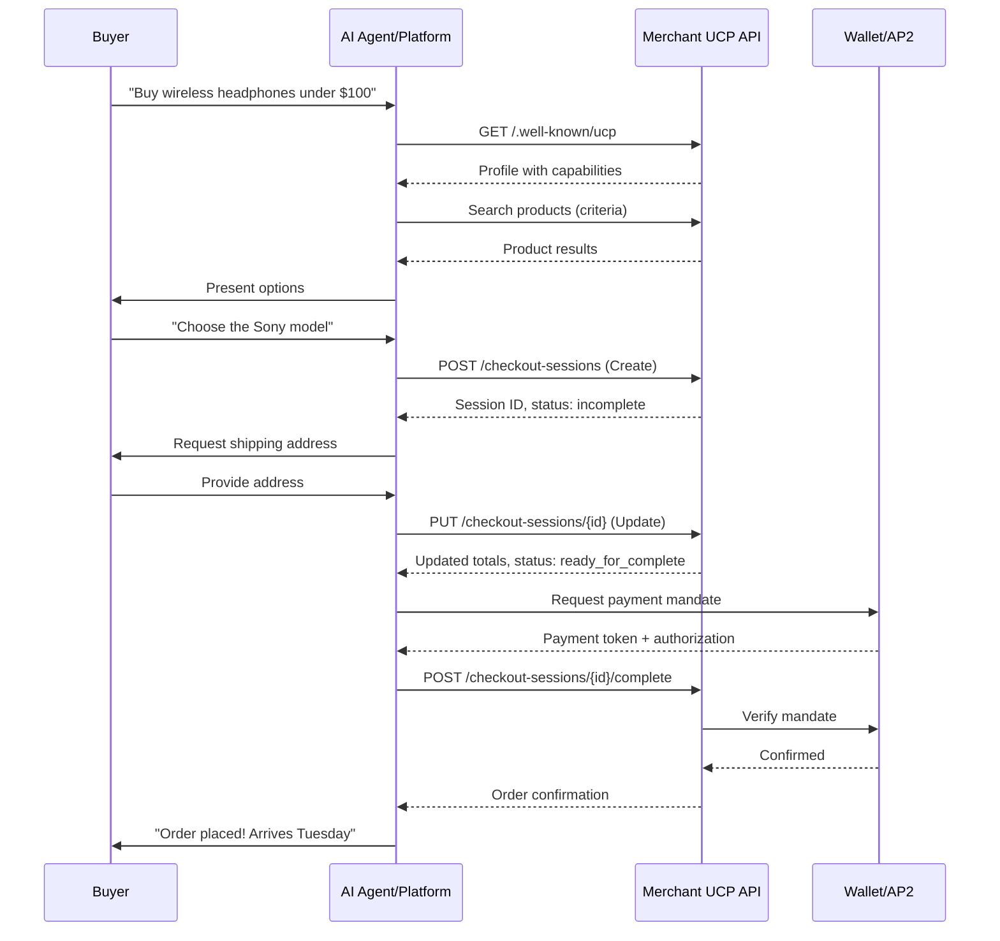
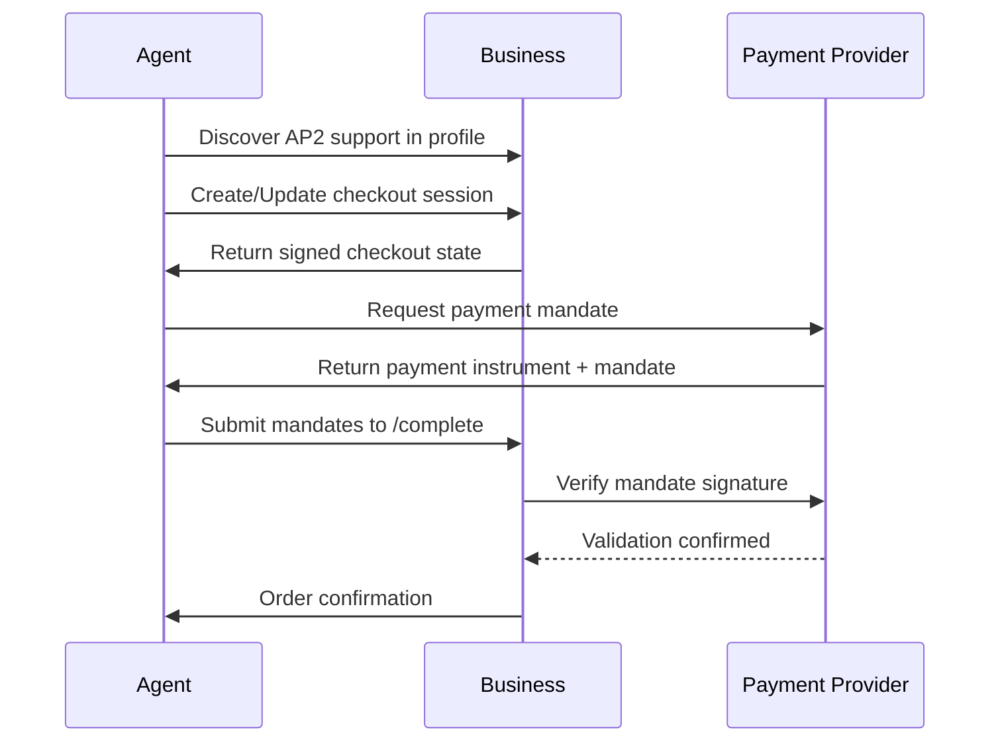

# Universal Commerce Protocol (UCP): Technical Whitepaper for Developers and Architects

## Executive Summary

The Universal Commerce Protocol (UCP) is an open-source standard launched by Google in January 2026 that enables AI agents to handle end-to-end shopping tasks through a standardized interface. By providing a common language for AI agents, retailers, and payment systems, UCP solves the critical N×N integration problem where every agent previously required custom integration with every merchant. This whitepaper provides comprehensive technical guidance for implementing UCP in production systems.

## 1. Introduction

### 1.1 The Problem: N×N Integration Bottleneck

Modern AI shopping agents face a fundamental scalability challenge. Without standardization, each agent needs custom integration with every merchant, creating an N×N bottleneck (N agents × N retailers). This results in:

- Brittle, slow, and expensive integrations
- Fragmented user experiences across platforms
- Limited merchant reach for new AI agents
- Duplicated engineering effort across the ecosystem

### 1.2 The Solution: A Common Commerce Language

UCP establishes a universal standard that any compliant agent can use to communicate with any compliant merchant through a single integration on each side. The protocol was co-developed with major partners including Shopify, Walmart, Target, Etsy, Wayfair, Visa, and Mastercard.

### 1.3 Key Benefits

- **Faster Development**: Build once, work with many agents and merchants
- **Enhanced Security**: Tokenization and cryptographic consents protect user data
- **Scalability**: Handles global markets and complex workflows like loyalty programs
- **Merchant Control**: Businesses remain the merchant of record with full control over pricing, inventory, and policies
- **Open Standard**: Vendor-neutral specification with public GitHub repositories

## 2. Core Concepts and Architecture

### 2.1 Fundamental Building Blocks

UCP is built on four main architectural concepts:

**Profiles**: A JSON manifest hosted at `/.well-known/ucp` that advertises a merchant's capabilities. Agents discover available features by reading this profile.

**Services**: Logical groupings of related capabilities. For example, `dev.ucp.shopping` encompasses all shopping-related operations.

**Capabilities**: Specific actions within a service, such as `checkout`, `search`, or `availability`. Each capability has:
- Version identifier (date-based, e.g., "2026-01-11")
- JSON schema defining data structures
- Specification document outlining behavioral rules

**Schemas**: JSON Schema definitions that enforce data validation for both requests and responses, ensuring interoperability.

### 2.2 Protocol Roles

The UCP ecosystem involves three primary actors:

**AI Agents/Platforms**: Applications like Google Gemini, ChatGPT, or custom voice assistants that:
- Discover merchant profiles
- Initiate and manage shopping sessions
- Process natural language user input
- Orchestrate multi-step commerce workflows

**Merchants/Businesses**: Retailers and service providers that:
- Host UCP profiles and API endpoints
- Maintain catalog and inventory data
- Process transactions while retaining merchant-of-record status
- Control pricing, promotions, and business rules

**Payment Providers**: Financial institutions and wallets that:
- Issue tokenized payment instruments
- Provide cryptographic payment mandates
- Handle secure payment processing via AP2 integration

### 2.3 Supported Transport Layers

UCP supports multiple transport mechanisms for flexibility:

- **REST**: Primary transport using standard HTTP operations (GET, POST, PUT, DELETE)
- **A2A (Agent-to-Agent)**: Enables agent delegation and coordination
- **MCP (Model Context Protocol)**: Allows AI models to access UCP as contextual tools

## 3. Capability Model

### 3.1 Core Capabilities

UCP defines modular capabilities that merchants can implement based on their requirements:

**Product/Offers Capability**: Provides structured catalog data optimized for AI reasoning, including:
- Product attributes and specifications
- Compatibility relationships
- Substitution options
- Pre-authored Q&A and policy information
- Pricing and availability

**Checkout Capability**: Manages the cart-to-order lifecycle through a minimal REST interface with operations for:
- Creating checkout sessions
- Updating session state
- Completing purchases
- Canceling sessions

**Orders/Fulfillment Capability**: Handles post-purchase workflows:
- Order status tracking
- Shipment notifications
- Returns and refunds
- Customer support integration

**Future Extensions**: The protocol is designed for vertical-specific capabilities such as travel bookings, subscriptions, and appointments.

### 3.2 Checkout Session Lifecycle

The checkout capability uses an intentional minimal design optimized for both AI agents and traditional clients. Sessions progress through well-defined states:

**Status Progression**:
- `incomplete`: Required information missing; agent should request data from user
- `requires_escalation`: Complex scenario requiring merchant UI via `continue_url`
- `ready_for_complete`: All prerequisites satisfied; safe to finalize purchase
- `completed`: Order successfully placed; includes order details

**Core Operations**:

1. **Create Checkout**: Initiates a new session with initial items and buyer context
2. **Get Checkout**: Retrieves current session state for status polling
3. **Update Checkout**: Full replacement update with modified items, shipping, or buyer data
4. **Complete Checkout**: Finalizes purchase and processes payment
5. **Cancel Checkout**: Invalidates session and releases inventory holds

This maps to a simplified user experience: "Buy → Review → Confirm" while hiding protocol complexity from end users.

## 4. Discovery and Profile Structure

### 4.1 Profile Discovery

Agents discover merchant capabilities by fetching the UCP profile from the standardized well-known URI: `https://merchant.example.com/.well-known/ucp`

### 4.2 Profile Structure

Example UCP profile:

```json
{
  "ucp": {
    "version": "2026-01-11",
    "services": {
      "dev.ucp.shopping": {
        "version": "2026-01-11",
        "rest": {
          "endpoint": "https://api.merchant.example.com/ucp"
        }
      }
    },
    "capabilities": [
      {
        "name": "dev.ucp.shopping.checkout",
        "version": "2026-01-11",
        "schema": "https://ucp.dev/schemas/checkout-2026-01-11.json",
        "spec": "https://ucp.dev/specification/checkout/"
      },
      {
        "name": "dev.ucp.shopping.products",
        "version": "2026-01-11",
        "schema": "https://ucp.dev/schemas/products-2026-01-11.json"
      }
    ],
    "payment_handlers": [
      {
        "type": "google_pay",
        "gateway": "example_psp",
        "gateway_merchant_id": "merchant123"
      }
    ]
  }
}
```

### 4.3 Versioning Strategy

UCP uses date-based versioning (e.g., "2026-01-11") to ensure:
- Clear compatibility signals
- Gradual migration paths
- Backward compatibility windows
- Explicit breaking change communication

## 5. Complete Checkout Flow

### 5.1 End-to-End Sequence



### 5.2 Three-Step Operation Model

**Step 1: Create Session**
```http
POST /checkout-sessions
Headers:
  UCP-Agent: MyAgent/1.0
  Idempotency-Key: uuid-12345
  Content-Type: application/json

Body:
{
  "items": [
    {
      "offer_id": "sony-wh1000xm5-black",
      "quantity": 1
    }
  ],
  "buyer": {
    "email": "user@example.com"
  }
}

Response:
{
  "id": "session_abc123",
  "status": "incomplete",
  "required_fields": ["shipping_address"],
  "items": [...],
  "totals": {
    "subtotal": "399.99 USD",
    "estimated_total": "399.99 USD"
  }
}
```

**Step 2: Update Session**
```http
PUT /checkout-sessions/session_abc123
Headers:
  Idempotency-Key: uuid-67890

Body:
{
  "items": [...],
  "buyer": {...},
  "shipping": {
    "address": {
      "line1": "123 Main St",
      "city": "San Francisco",
      "state": "CA",
      "postal_code": "94105",
      "country": "US"
    },
    "method": "standard"
  }
}

Response:
{
  "id": "session_abc123",
  "status": "ready_for_complete",
  "totals": {
    "subtotal": "399.99 USD",
    "shipping": "9.99 USD",
    "tax": "35.70 USD",
    "total": "445.68 USD"
  }
}
```

**Step 3: Complete Session**
```http
POST /checkout-sessions/session_abc123/complete
Headers:
  Idempotency-Key: uuid-54321

Body:
{
  "payment_data": {
    "type": "google_pay",
    "token": "encrypted_payment_token",
    "mandate": "signed_ap2_mandate"
  }
}

Response:
{
  "id": "session_abc123",
  "status": "completed",
  "order": {
    "id": "order_xyz789",
    "tracking_url": "https://merchant.example.com/orders/xyz789",
    "estimated_delivery": "2026-01-16"
  }
}
```

## 6. Security Architecture

### 6.1 Payment Security via AP2 Integration

UCP composes with the Agent Payments Protocol (AP2) rather than defining its own payment layer. This separation provides:

**Tokenization**: Payment instruments are transmitted as opaque tokens, never raw card data.

**Cryptographic Mandates**: AP2 provides cryptographically signed proof of user authorization for each transaction.

**Payment Flow Integration**:



### 6.2 Additional Security Controls

**Idempotency Keys**: Required headers prevent duplicate operations during retries:
```http
Idempotency-Key: <uuid>
```

**Consent Logging**: All payment operations require auditable proof of user approval.

**Rate Limiting**: Endpoints enforce request throttling to prevent abuse.

**Data Minimization**: Merchants receive only data necessary for order fulfillment.

**TLS Enforcement**: All UCP endpoints must use HTTPS with valid certificates.

## 7. User Identity and Personalization

### 7.1 Supported Identity Models

**Guest Checkout** (Default):
- No pre-existing relationship required
- Minimal friction for first-time buyers
- Data collected only for current transaction

**Account-Linked Checkout**:
- OAuth 2.0-based account linking
- Reusable profiles with saved addresses
- Loyalty program integration
- Order history access
- Personalized recommendations

### 7.2 Account Linking Flow

Merchants optionally expose OAuth endpoints in their profile:

```json
{
  "ucp": {
    "account_linking": {
      "oauth": {
        "authorization_endpoint": "https://merchant.example.com/oauth/authorize",
        "token_endpoint": "https://merchant.example.com/oauth/token",
        "scopes": ["profile", "orders", "loyalty"]
      }
    }
  }
}
```

Agents can progressively enhance experiences while maintaining protocol compatibility.

## 8. AI-Optimized Product Data

### 8.1 Semantic Enrichment for Agents

UCP treats product data as an AI-facing knowledge graph, not just a minimal feed. Merchants should provide:

**Compatibility Information**:
```json
{
  "product_id": "sony-wh1000xm5",
  "compatibility": {
    "works_with": ["iphone", "android", "ps5"],
    "supported_codecs": ["LDAC", "aptX", "AAC", "SBC"]
  }
}
```

**Substitution Relationships**:
```json
{
  "substitutes": [
    {
      "product_id": "bose-qc45",
      "reason": "Similar features, slightly lower price",
      "price_difference": "-50.00 USD"
    }
  ]
}
```

**Pre-Authored Q&A**:
```json
{
  "faqs": [
    {
      "question": "Is this water resistant?",
      "answer": "No, these headphones are not water resistant."
    },
    {
      "question": "What's the battery life?",
      "answer": "Up to 30 hours with ANC on, 40 hours with ANC off."
    }
  ]
}
```

**Policy Snippets**:
```json
{
  "policies": {
    "returns": "30-day return window for unused items",
    "warranty": "1-year manufacturer warranty included",
    "shipping": "Free shipping on orders over $35"
  }
}
```

### 8.2 Data Pipeline Implications

Architects should ensure:
- Product Information Management (PIM) systems support extended attributes
- Content Management Systems (CMS) can maintain AI-optimized descriptions
- Data freshness pipelines keep compatibility and policy data current
- Analytics track which attributes influence agent recommendations

## 9. Protocol Stack and Ecosystem Positioning

### 9.1 Relationship to Other Protocols

UCP is designed to coexist with complementary protocols rather than compete:

| Protocol | Owner | Primary Focus | Relationship to UCP |
|----------|-------|---------------|---------------------|
| **UCP** | Google + partners | Full commerce lifecycle (discovery → post-purchase) | Orchestrates shopping flows |
| **AP2** (Agent Payments Protocol) | Google + payment ecosystem | Secure payment authorization with cryptographic mandates | UCP's payment substrate; required for transactions |
| **ACP** (Agentic Commerce Protocol) | OpenAI + Stripe | Conversational checkout and fulfillment | Conceptually overlapping; more tied to Stripe/OpenAI |
| **MCP** (Model Context Protocol) | Anthropic | AI ↔ tools/data connectivity | UCP can be exposed as MCP tools |
| **A2A** (Agent-to-Agent) | Community/emerging | Agent coordination and delegation | Compatible; agents can use UCP while coordinating |

### 9.2 UCP vs ACP: Strategic Comparison

Both protocols emerged during the 2025-2026 "protocol wars" with different approaches:

**Universal Commerce Protocol (UCP)**:
- **Strengths**: Broad retail ecosystem (20+ endorsers), full lifecycle coverage, open governance, integrates with multiple payment protocols
- **Weaknesses**: Newer standard, requires profile setup and infrastructure
- **Best For**: Enterprises seeking universal compatibility, merchants building for multiple agent platforms, architects prioritizing long-term standardization

**Agentic Commerce Protocol (ACP)**:
- **Strengths**: Seamless ChatGPT integration, rapid adoption in conversational interfaces, streamlined Stripe payments
- **Weaknesses**: More proprietary, less emphasis on discovery and post-purchase, tied to OpenAI ecosystem
- **Best For**: Quick agent prototypes, OpenAI-first strategies, Stripe-native merchants

**Recommendation**: Choose UCP for broad compatibility and infrastructure plays; choose ACP for OpenAI-specific implementations. Forward-thinking architectures should support both protocols as the ecosystem matures.

## 10. Implementation Guide

### 10.1 Merchant Implementation Checklist

**Phase 1: Profile Setup**
- [ ] Host UCP profile JSON at `/.well-known/ucp`
- [ ] Define supported capabilities and versions
- [ ] Configure REST endpoints
- [ ] Document payment handlers

**Phase 2: API Development**
- [ ] Implement checkout session creation
- [ ] Build update operation with full state replacement
- [ ] Develop completion logic with payment verification
- [ ] Add cancellation and error handling
- [ ] Implement idempotency key processing

**Phase 3: Payment Integration**
- [ ] Integrate AP2 mandate verification
- [ ] Configure payment provider gateways
- [ ] Test tokenized payment flows
- [ ] Set up fraud detection integration

**Phase 4: Testing and Validation**
- [ ] Use Google's Python SDK for testing
- [ ] Validate all JSON schemas
- [ ] Test error scenarios and recovery
- [ ] Verify idempotency behavior
- [ ] Load test checkout flows

**Phase 5: Production Readiness**
- [ ] Set up monitoring and alerting
- [ ] Configure logging for consent audits
- [ ] Implement rate limiting
- [ ] Document internal runbooks
- [ ] Train support teams

### 10.2 Reference Implementation (Python/FastAPI)

```python
from fastapi import FastAPI, Header, HTTPException
from pydantic import BaseModel
from typing import Optional, List
import uuid

app = FastAPI()

# Data models
class Item(BaseModel):
    offer_id: str
    quantity: int

class Address(BaseModel):
    line1: str
    city: str
    state: str
    postal_code: str
    country: str

class CreateCheckoutRequest(BaseModel):
    items: List[Item]
    buyer: dict

class UpdateCheckoutRequest(BaseModel):
    items: List[Item]
    buyer: dict
    shipping: Optional[dict] = None

class CompleteCheckoutRequest(BaseModel):
    payment_data: dict

# In-memory session store (use Redis/DB in production)
sessions = {}

# UCP Profile
@app.get("/.well-known/ucp")
def get_profile():
    return {
        "ucp": {
            "version": "2026-01-11",
            "services": {
                "dev.ucp.shopping": {
                    "version": "2026-01-11",
                    "rest": {
                        "endpoint": "https://api.merchant.example.com/ucp"
                    }
                }
            },
            "capabilities": [
                {
                    "name": "dev.ucp.shopping.checkout",
                    "version": "2026-01-11"
                }
            ],
            "payment_handlers": [
                {
                    "type": "google_pay",
                    "gateway": "example_psp"
                }
            ]
        }
    }

# Create checkout session
@app.post("/checkout-sessions")
def create_session(
    request: CreateCheckoutRequest,
    idempotency_key: str = Header(..., alias="Idempotency-Key")
):
    # Check idempotency
    if idempotency_key in sessions:
        return sessions[idempotency_key]
    
    # Create new session
    session_id = f"session_{uuid.uuid4().hex[:12]}"
    session = {
        "id": session_id,
        "status": "incomplete",
        "items": [item.dict() for item in request.items],
        "buyer": request.buyer,
        "required_fields": ["shipping_address"],
        "totals": calculate_totals(request.items)
    }
    
    sessions[session_id] = session
    sessions[idempotency_key] = session
    
    return session

# Update checkout session
@app.put("/checkout-sessions/{session_id}")
def update_session(
    session_id: str,
    request: UpdateCheckoutRequest,
    idempotency_key: str = Header(..., alias="Idempotency-Key")
):
    if session_id not in sessions:
        raise HTTPException(status_code=404, detail="Session not found")
    
    session = sessions[session_id]
    
    # Full replacement update
    session["items"] = [item.dict() for item in request.items]
    session["buyer"] = request.buyer
    if request.shipping:
        session["shipping"] = request.shipping
        session["status"] = "ready_for_complete"
        session["required_fields"] = []
    
    # Recalculate totals
    session["totals"] = calculate_totals_with_shipping(
        request.items,
        request.shipping
    )
    
    return session

# Complete checkout
@app.post("/checkout-sessions/{session_id}/complete")
def complete_session(
    session_id: str,
    request: CompleteCheckoutRequest,
    idempotency_key: str = Header(..., alias="Idempotency-Key")
):
    if session_id not in sessions:
        raise HTTPException(status_code=404, detail="Session not found")
    
    session = sessions[session_id]
    
    if session["status"] != "ready_for_complete":
        raise HTTPException(
            status_code=400,
            detail="Session not ready for completion"
        )
    
    # Verify payment mandate (integrate with AP2)
    if not verify_payment_mandate(request.payment_data):
        raise HTTPException(status_code=402, detail="Payment failed")
    
    # Create order
    order_id = f"order_{uuid.uuid4().hex[:12]}"
    session["status"] = "completed"
    session["order"] = {
        "id": order_id,
        "tracking_url": f"https://merchant.example.com/orders/{order_id}",
        "estimated_delivery": "2026-01-16"
    }
    
    return session

# Helper functions
def calculate_totals(items):
    subtotal = sum(get_price(item["offer_id"]) * item["quantity"] 
                   for item in items)
    return {
        "subtotal": f"{subtotal:.2f} USD",
        "estimated_total": f"{subtotal:.2f} USD"
    }

def calculate_totals_with_shipping(items, shipping):
    subtotal = sum(get_price(item["offer_id"]) * item["quantity"] 
                   for item in items)
    shipping_cost = 9.99
    tax = subtotal * 0.0875
    total = subtotal + shipping_cost + tax
    return {
        "subtotal": f"{subtotal:.2f} USD",
        "shipping": f"{shipping_cost:.2f} USD",
        "tax": f"{tax:.2f} USD",
        "total": f"{total:.2f} USD"
    }

def get_price(offer_id):
    # Lookup from catalog
    prices = {"sony-wh1000xm5-black": 399.99}
    return prices.get(offer_id, 0.0)

def verify_payment_mandate(payment_data):
    # Integrate with AP2 verification
    # In production: verify cryptographic signature
    return True
```

### 10.3 Agent Implementation Patterns

**Using MCP as Tool Layer**:
```python
# Define UCP checkout as MCP tool
from mcp import Tool

checkout_tool = Tool(
    name="create_ucp_checkout",
    description="Create a checkout session at a UCP-compliant merchant",
    parameters={
        "merchant_url": "string",
        "items": "array",
        "buyer_info": "object"
    },
    handler=ucp_checkout_handler
)

async def ucp_checkout_handler(merchant_url, items, buyer_info):
    # Discover profile
    profile = await fetch_ucp_profile(merchant_url)
    
    # Create session
    response = await create_checkout_session(
        endpoint=profile["services"]["dev.ucp.shopping"]["rest"]["endpoint"],
        items=items,
        buyer=buyer_info
    )
    
    return response
```

**Policy Layer for Escalation**:
```python
def should_escalate_to_ui(session):
    """Determine if agent should hand off to merchant UI"""
    if session["status"] == "requires_escalation":
        return True
    
    if session["totals"]["total"] > user_spending_limit:
        return True
    
    if requires_custom_personalization(session["items"]):
        return True
    
    return False

if should_escalate_to_ui(session):
    return {
        "action": "open_url",
        "url": session["continue_url"],
        "message": "Please complete your purchase in the merchant's checkout"
    }
```

### 10.4 Best Practices

**For Merchants**:
- Use JSON Schema validation on all inputs and outputs
- Implement comprehensive logging for debugging agent interactions
- Design for idempotency from day one (use persistent idempotency key storage)
- Return rich error messages with actionable recovery guidance
- Monitor agent success rates by capability
- Keep profile and capability versions in sync with backend changes

**For Agent Developers**:
- Cache UCP profiles with appropriate TTLs (suggested: 1 hour)
- Implement exponential backoff for retries
- Validate responses against published schemas
- Build robust error recovery flows
- Log consent capture for compliance audits
- Test against multiple merchant implementations

**For Architects**:
- Model UCP as a dedicated façade microservice, not bolted onto existing APIs
- Separate read (product discovery) from write (checkout) traffic patterns
- Plan for horizontal scaling of session state storage
- Implement circuit breakers for payment provider integration
- Design monitoring around the checkout funnel (create → update → complete)
- Build versioning strategy for graceful capability upgrades

## 11. Monitoring and Observability

### 11.1 Key Metrics

**Operational Metrics**:
- Checkout session creation rate
- Session completion rate (funnel conversion)
- Average session lifetime
- API endpoint latency (p50, p95, p99)
- Error rates by status code
- Idempotency key collision rate

**Business Metrics**:
- Agent-driven GMV (Gross Merchandise Value)
- Cart abandonment rate in agent flows
- Average order value by agent
- Escalation rate to merchant UI
- Payment authorization success rate

**Agent-Specific Metrics**:
- Sessions by agent identifier (UCP-Agent header)
- Success rate by agent version
- Most requested capabilities by agent
- Schema validation failure rate

### 11.2 Logging Strategy

Structured logging example:
```json
{
  "timestamp": "2026-01-13T10:30:45Z",
  "level": "INFO",
  "event": "checkout_session_created",
  "session_id": "session_abc123",
  "agent": "GoogleGemini/2.0",
  "idempotency_key": "uuid-12345",
  "items_count": 1,
  "total_value": 445.68,
  "duration_ms": 145
}
```

## 12. Roadmap and Future Evolution

### 12.1 Current State (January 2026)

- ✅ Core checkout capability finalized
- ✅ AP2 payment integration standardized
- ✅ Profile discovery mechanism established
- ✅ REST transport fully specified
- ✅ Open-source reference implementations available

### 12.2 Near-Term Roadmap (Q1-Q2 2026)

- Loyalty program integration
- Multi-item cart optimization
- Subscription commerce support
- Enhanced personalization APIs
- Global expansion (India, Latin America, Europe)
- Improved analytics and reporting capabilities

### 12.3 Long-Term Vision (2026-2027)

- Cross-vertical expansion (travel, services, events)
- Deeper AI model integration with semantic understanding
- Advanced negotiation capabilities for agents
- Real-time inventory synchronization
- Augmented reality product experiences
- Voice commerce optimization

### 12.4 Community Engagement

**Open Source Development**:
- GitHub organization: https://github.com/Universal-Commerce-Protocol
- Specification repository: https://github.com/Universal-Commerce-Protocol/ucp
- Sample implementations: https://github.com/Universal-Commerce-Protocol/samples

**Contribution Process**:
- Submit issues for specification clarifications
- Propose enhancements via pull requests
- Participate in quarterly technical working group meetings
- Join the UCP developer community Slack

**Official Resources**:
- Specification: https://ucp.dev
- Developer documentation: https://developers.google.com/merchant/ucp
- SDK downloads: https://github.com/Universal-Commerce-Protocol

## 13. Strategic Implications for Businesses

### 13.1 The Shift to Agent-Mediated Commerce

AI agents are condensing the traditional shopping funnel:
- **Discovery**: Agents search across multiple merchants simultaneously
- **Decision**: AI reasoning replaces manual comparison shopping
- **Checkout**: Conversation-based purchase without storefront visits

### 13.2 Critical Success Factors

**For Retailers**:
- Implement UCP/ACP before competitors to gain agent visibility
- Invest in AI-optimized product data (semantics, not just SKUs)
- Treat agent channels as first-class sales surfaces
- Monitor "LLM SEO" signals and agent recommendation patterns

**For Platforms**:
- Build trust through transparent agent behavior
- Implement robust consent and authorization flows
- Optimize for conversational commerce UX
- Support multiple commerce protocols for merchant flexibility

**For Payment Providers**:
- Integrate AP2 mandate verification
- Provide seamless tokenization experiences
- Support emerging agent payment patterns
- Build fraud detection optimized for AI-initiated transactions

### 13.3 Competitive Landscape

Early movers in UCP adoption are establishing:
- Prime placement in agent recommendation engines
- First-party data advantages from agent interactions
- Trust signals through reliable API performance
- Network effects as more agents integrate

Failing to implement standards like UCP means forfeiting visibility in the growing agent-mediated commerce channel.

## 14. Conclusion

The Universal Commerce Protocol represents a foundational shift in how commerce transactions are initiated and completed. By standardizing the interface between AI agents and merchant systems, UCP enables:

- **Scale**: One integration reaches many agents and merchants
- **Security**: Cryptographic guarantees protect user data and transactions
- **Flexibility**: Modular capabilities support diverse use cases
- **Control**: Merchants retain pricing authority and business logic

For developers, UCP provides clear technical specifications and reference implementations to accelerate integration. For architects, it offers a proven pattern for building scalable, secure commerce infrastructure. For businesses, early adoption positions them for the agent-first commerce era.

**Next Steps**:
1. Review the UCP specification at ucp.dev
2. Clone reference implementations from GitHub
3. Set up a test profile at `/.well-known/ucp`
4. Implement core checkout capability
5. Test with Google's SDK and partner agents
6. Join the developer community for ongoing support

As AI agents become primary shopping interfaces, UCP provides the standardized foundation for this transformation. Start building today to ensure your commerce systems are ready for the agentic future.

---

**Document Version**: 1.0  
**Last Updated**: January 2026  
**Specification Version**: 2026-01-11  
**Maintained by**: Universal Commerce Protocol Working Group

**Additional Resources**:
- Technical Specification: https://ucp.dev/specification/
- Developer Guides: https://developers.google.com/merchant/ucp/guides
- GitHub Organization: https://github.com/Universal-Commerce-Protocol
- Community Slack: [Join via ucp.dev]