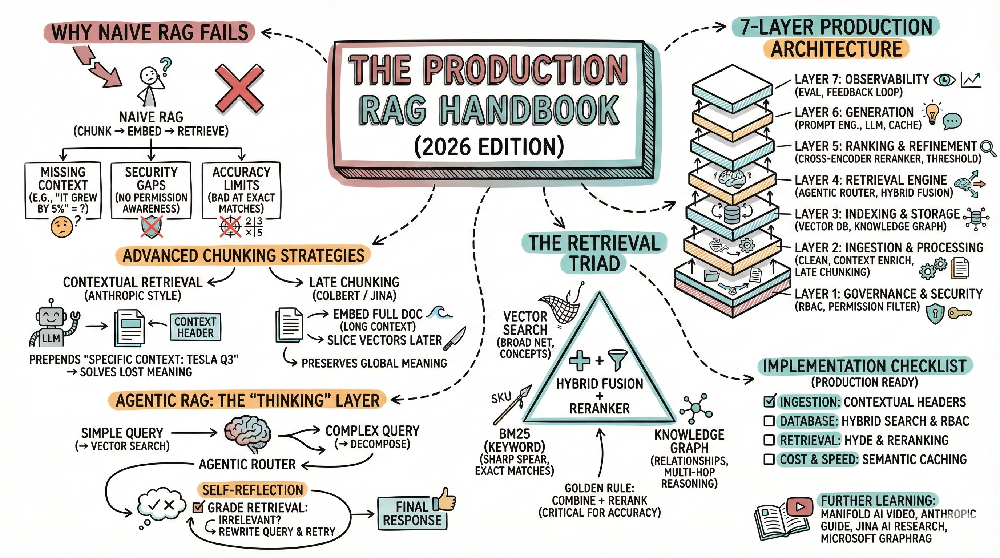
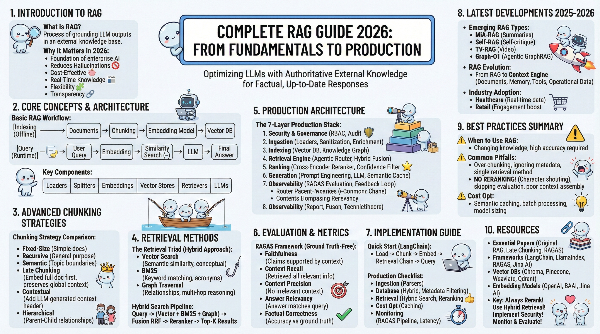
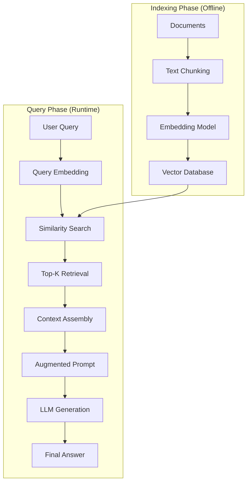
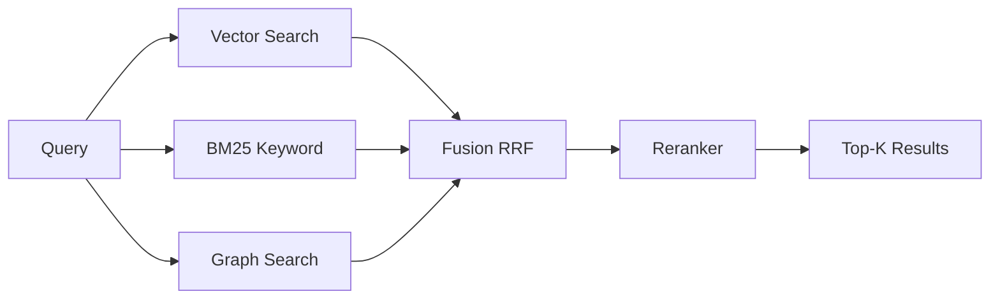
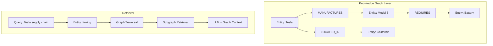
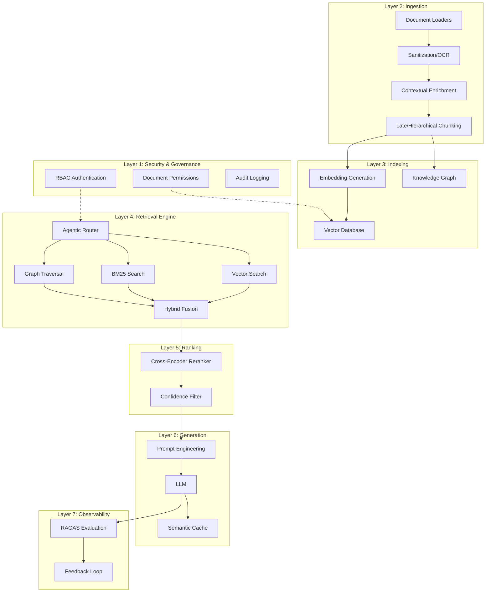
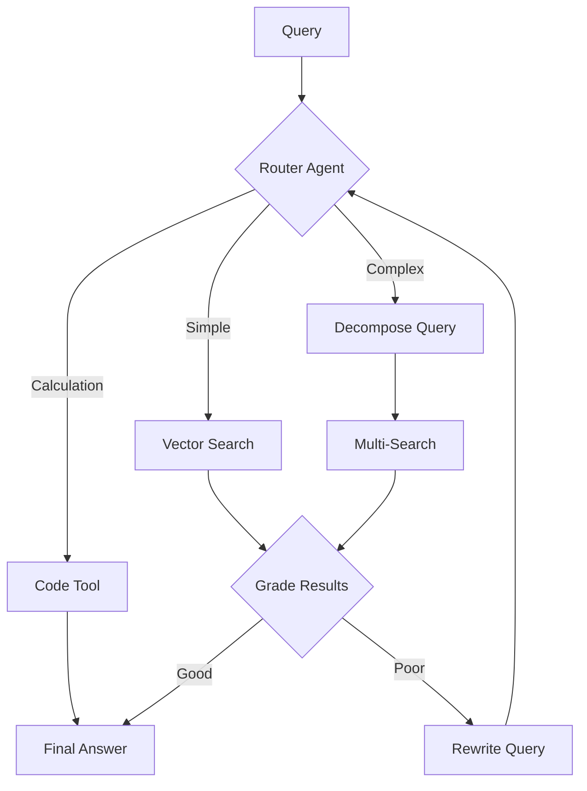

# Complete RAG Guide 2026: From Fundamentals to Production

## Table of Contents
1. [Introduction to RAG](#1-introduction-to-rag)
2. [Core Concepts & Architecture](#2-core-concepts--architecture)
3. [Advanced Chunking Strategies](#3-advanced-chunking-strategies)
4. [Retrieval Methods](#4-retrieval-methods)
5. [Production Architecture](#5-production-architecture)
6. [Evaluation & Metrics](#6-evaluation--metrics)
7. [Implementation Guide](#7-implementation-guide)
8. [Latest Developments 2025-2026](#8-latest-developments-2025-2026)
9. [Best Practices Summary](#9-best-practices-summary)
10. [Resources](#10-resources)
11. [Conclusion](#conclusion)

---

 



---

## 1. Introduction to RAG

### What is RAG?

Retrieval-Augmented Generation (RAG) is the process of optimizing the output of a large language model, so it references an authoritative knowledge base outside of its training data sources before generating a response. Instead of relying solely on training data, RAG systems actively retrieve relevant information before generating responses.

### Why RAG Matters in 2026

In 2026, Retrieval-Augmented Generation (RAG) will move from experimental innovation to a foundational capability that reshapes how organizations operate and interact with AI. Key benefits include:

- **Reduces Hallucinations**: Grounds responses in factual, retrieved evidence
- **Cost-Effective**: No need to retrain models for new information
- **Real-Time Knowledge**: Access up-to-date information without model retraining
- **Flexibility**: Adaptable to any domain with custom knowledge bases
- **Transparency**: Responses can be traced back to source documents

---

## 2. Core Concepts & Architecture

### The Three RAG Paradigms

RAG systems have evolved into three distinct architectural paradigms, each with increasing sophistication:

#### A. Naive RAG (Basic Implementation)

The foundational "Index → Retrieve → Generate" process:

1. **Indexing**: Process domain data, embed into vectors, store in vector database
2. **Retrieval**: Embed user query and find similar chunks via vector search
3. **Generation**: Feed retrieved chunks + query to LLM for answer

**Best For**: Simple Q&A, small document sets, proof-of-concepts

**Limitations**: No query optimization, no result refinement, single-shot retrieval

#### B. Advanced RAG (Optimized Pipeline)

Improves upon Naive RAG with pre- and post-retrieval optimization:

**Pre-Retrieval Optimization**:
- Query rewriting and expansion
- Query transformation for clarity
- Fine-tuned embedding models

**Post-Retrieval Refinement**:
- Re-ranking retrieved chunks
- Context compression and summarization
- Fusion of results from multiple retrievals

**Best For**: Production systems, accuracy-critical applications

#### C. Modular RAG (Flexible Architecture)

Introduces specialized, interchangeable modules:

- **Search Module**: Adapts to scenarios (search engines, databases, knowledge graphs)
- **RAG-Fusion**: Multi-query strategy to address search limitations
- **Memory Module**: Uses LLM memory to guide retrieval
- **Task Adapter**: Tailors prompts for specific downstream tasks
- **Routing & Prediction**: Decides IF and WHERE to retrieve

**Module Arrangements**: Serial, conditional, or parallel patterns

**Best For**: Complex enterprise systems, multi-domain applications

### Basic RAG Workflow



### Key Components

| Component | Purpose | Popular Options |
|-----------|---------|----------------|
| **Document Loaders** | Load data from various sources | LangChain loaders, LlamaIndex readers |
| **Text Splitters** | Break documents into chunks | Recursive, semantic, token-based |
| **Embedding Models** | Convert text to vectors | OpenAI ada-002, BAAI/bge, Jina AI |
| **Vector Stores** | Store and search embeddings | Chroma, Pinecone, Weaviate, Qdrant |
| **Retrievers** | Fetch relevant chunks | Hybrid search, semantic search |
| **LLMs** | Generate final responses | GPT-4, Claude, Gemini, Llama |

### Augmentation Process Patterns

Three key patterns for how retrieval is incorporated into generation:

| Pattern | Description | Use Case |
|---------|-------------|----------|
| **Iterative Retrieval** | Knowledge base searched repeatedly based on initial query and intermediate steps | Multi-step reasoning |
| **Recursive Retrieval** | One retrieval step informs the next in dependency chain | Deep contextual queries |
| **Adaptive Retrieval** | LLM actively determines WHEN and WHAT to retrieve | Complex, unpredictable queries |

---

## 3. Advanced Chunking Strategies

The right chunking strategy — from fixed-size and recursive to semantic, LLM-based, agentic, late, and hierarchical — is one of the biggest levers you have to improve precision, context, and latency.

### Chunking Strategy Comparison

| Strategy | How It Works | Best For | Trade-offs |
|----------|--------------|----------|------------|
| **Fixed-Size** | Split by character/token count | Simple docs, FAQs | May break context |
| **Recursive** | Split hierarchically by separators | General purpose | May miss semantics |
| **Semantic** | Split by meaning/topic boundaries | Thematic content | Computationally expensive |
| **Late Chunking** | Embed full doc, then chunk vectors | Technical docs, references | Requires long-context models |
| **Contextual** | Add LLM-generated context to chunks | High-stakes applications | Higher cost, slower |
| **Hierarchical** | Parent-child relationships | Legal, technical docs | Complex implementation |

### Late Chunking (2024-2025 Innovation)

Research shows late chunking can improve retrieval accuracy by 10–12% on documents with anaphoric references, particularly for queries that involve entities mentioned via pronouns.

**How It Works:**
1. Embed entire document with long-context model
2. Generate token-level embeddings
3. Split embeddings (not text) into chunks
4. Average token embeddings for each chunk

**Example Problem Solved:**
```
Document: "Berlin is the capital of Germany. Its population is 3.85 million."
Traditional chunking: "Its population..." → No context about what "Its" refers to
Late chunking: Preserves Berlin context in the embedding
```

### Contextual Retrieval (Anthropic 2024)

Contextual retrieval preserves semantic coherence more effectively but requires greater computational resources.

**Process:**
1. Chunk document normally
2. LLM generates context header for each chunk
3. Prepend context to chunk: `"[CONTEXT: Tesla Q3 2025 Report] Revenue increased 5%"`
4. Embed enhanced chunks

```python
# Contextual Chunking Example
def add_context(chunk, document_metadata):
    context_prompt = f"""
    Document: {document_metadata['title']}
    Section: {document_metadata['section']}
    Generate a 1-2 sentence context for this chunk:
    {chunk}
    """
    context = llm.generate(context_prompt)
    return f"{context}\n\n{chunk}"
```

---

## 4. Retrieval Methods

### The Retrieval Triad

Do not rely on vector search alone. Modern RAG uses hybrid approaches:

| Method | Mechanism | Best For | Weakness |
|--------|-----------|----------|----------|
| **Vector Search** | Semantic similarity (embeddings) | Conceptual queries | Misses exact matches |
| **BM25 (Keyword)** | Sparse retrieval (TF-IDF) | Acronyms, IDs, names | Ignores semantics |
| **Graph Traversal** | Relationship-based | Multi-hop reasoning | Requires knowledge graph |

### Hybrid Search Pipeline



**Reciprocal Rank Fusion (RRF):**
```python
def reciprocal_rank_fusion(rankings_list, k=60):
    fused_scores = {}
    for rankings in rankings_list:
        for rank, doc_id in enumerate(rankings):
            if doc_id not in fused_scores:
                fused_scores[doc_id] = 0
            fused_scores[doc_id] += 1 / (k + rank + 1)
    return sorted(fused_scores.items(), key=lambda x: x[1], reverse=True)
```

### GraphRAG (2025-2026 Breakthrough)

GraphRAG combines vector search with structured taxonomies and ontologies to bring context and logic into the retrieval process. Using knowledge graphs to interpret relationships between terms has paved the way for deterministic AI accuracy – boosting search precision to as high as 99%.

**GraphRAG Architecture:**


**Key Differences from Baseline RAG:**

- **Data Structure**: Entities as nodes, relationships as edges (vs. flat chunks)
- **Query Processing**: Multi-step graph traversal (vs. single similarity search)
- **Context Assembly**: Connected subgraphs (vs. independent chunks)
- **Reasoning**: Multi-hop relational reasoning (vs. chunk-level only)
- **Explainability**: Traceable paths through graph (vs. opaque similarity)

---

## 5. Production Architecture

### The 7-Layer Production Stack

By 2026–2030, successful enterprise deployments will treat RAG as a knowledge runtime: an orchestration layer that manages retrieval, verification, reasoning, access control, and audit trails as integrated operations.



### Critical Production Features

**1. Security & Permissions**
```python
# Metadata-filtered retrieval
def secure_retrieval(query, user_id):
    filter_metadata = {
        "allowed_users": user_id,
        "access_level": get_user_clearance(user_id)
    }
    results = vector_db.search(
        query=query,
        filter=filter_metadata,
        top_k=10
    )
    return results
```

**2. Reranking (Critical for Accuracy)**
```python
from sentence_transformers import CrossEncoder

reranker = CrossEncoder('BAAI/bge-reranker-large')

def rerank_results(query, initial_results):
    pairs = [[query, doc['text']] for doc in initial_results]
    scores = reranker.predict(pairs)
    
    # Combine with original scores
    reranked = sorted(
        zip(initial_results, scores),
        key=lambda x: x[1],
        reverse=True
    )
    return [doc for doc, score in reranked[:5]]
```

**3. Agentic RAG (Self-Reflective)**



---

## 6. Evaluation & Metrics

With Ragas, we put forward a suite of metrics which can be used to evaluate these different dimensions without having to rely on ground truth human annotations.

### Core RAGAS Metrics

| Metric | What It Measures | Formula/Logic | Target |
|--------|------------------|---------------|--------|
| **Context Relevance** | Do retrieved documents match query? | Relevant docs / Total retrieved | >0.8 |
| **Faithfulness** | Answer supported by context | `Verified claims / Total claims` | >0.9 |
| **Answer Relevancy** | Answer matches query | Cosine similarity of query-answer | >0.85 |
| **Context Recall** | Retrieved all relevant info | `Relevant retrieved / Total relevant` | >0.9 |
| **Context Precision** | No irrelevant context | `Relevant @ k / k` | >0.8 |

### Additional Evaluation Dimensions

**Retrieval Quality Metrics**:
- **Precision**: Proportion of retrieved documents that are relevant
- **Recall**: Proportion of relevant documents that were retrieved
- **MRR (Mean Reciprocal Rank)**: Average of reciprocal ranks of first relevant result
- **Hit Rate**: Percentage of queries with at least one relevant result in top-k

**Generation Quality Metrics**:
- **BLEU**: N-gram overlap with reference answers
- **ROUGE**: Recall-oriented n-gram overlap
- **Perplexity**: How well the model predicts the sample

### Evaluation Frameworks Comparison

| Framework | Focus Areas | Key Features | Best For |
|-----------|-------------|--------------|----------|
| **RAGAS** | Context Relevance, Faithfulness, Answer Relevance | LLM-based evaluation, no ground truth needed | General RAG evaluation |
| **ARES** | Context Relevance, Faithfulness, Answer Relevance | Uses synthetic data generation | Low-resource scenarios |
| **TruLens** | Truthfulness triad tracking | Experiment tracking, detailed analytics | Research & iteration |
| **RGB/RECALL** | Noise robustness | Counterfactual analysis | Adversarial testing |

### Implementation Example

```python
from ragas import evaluate
from ragas.metrics import (
    Faithfulness,
    ContextRecall,
    ContextPrecision,
    AnswerRelevancy
)

# Prepare evaluation dataset
eval_data = {
    'question': ["What is the capital of France?"],
    'answer': ["Paris is the capital of France."],
    'contexts': [["France's capital city is Paris."]],
    'ground_truth': ["Paris"]
}

# Evaluate
result = evaluate(
    dataset=eval_data,
    metrics=[
        Faithfulness(),
        ContextRecall(),
        ContextPrecision(),
        AnswerRelevancy()
    ]
)

print(result)
# Output: {'faithfulness': 0.95, 'context_recall': 1.0, ...}
```

### Important Considerations

Different LLMs are often not in agreement when used as evaluators. They can't all be correct. Always:
- Test evaluation metrics with multiple LLMs
- Validate against human judgments
- Monitor for JSON parsing failures
- Use complementary metrics

---

## 7. Implementation Guide

### Quick Start (LangChain)

```python
from langchain_community.document_loaders import PyPDFLoader
from langchain.text_splitter import RecursiveCharacterTextSplitter
from langchain_openai import OpenAIEmbeddings
from langchain_community.vectorstores import Chroma
from langchain.chains import RetrievalQA
from langchain_openai import ChatOpenAI

# 1. Load documents
loader = PyPDFLoader("document.pdf")
documents = loader.load()

# 2. Chunk documents
text_splitter = RecursiveCharacterTextSplitter(
    chunk_size=1000,
    chunk_overlap=200
)
chunks = text_splitter.split_documents(documents)

# 3. Create embeddings and vector store
embeddings = OpenAIEmbeddings()
vectorstore = Chroma.from_documents(
    documents=chunks,
    embedding=embeddings
)

# 4. Create retrieval chain
llm = ChatOpenAI(model="gpt-4", temperature=0)
qa_chain = RetrievalQA.from_chain_type(
    llm=llm,
    retriever=vectorstore.as_retriever(
        search_kwargs={"k": 4}
    )
)

# 5. Query
response = qa_chain.invoke("What is the main topic?")
print(response)
```

### Production Implementation Checklist

✅ **Ingestion**
- [ ] Implement document parsers (Unstructured.io, LlamaParse)
- [ ] Add contextual headers or late chunking
- [ ] Validate chunk quality

✅ **Database**
- [ ] Choose vector DB with hybrid search (Qdrant, Pinecone, Weaviate)
- [ ] Implement metadata filtering for security
- [ ] Set up backup and versioning

✅ **Retrieval**
- [ ] Enable hybrid search (vector + BM25)
- [ ] Add cross-encoder reranking
- [ ] Implement query expansion (HyDE)

✅ **Cost Optimization**
- [ ] Semantic caching (Redis/GPTCache)
- [ ] Monitor token usage
- [ ] Batch processing where possible

✅ **Monitoring**
- [ ] Set up RAGAS evaluation pipeline
- [ ] Track latency metrics
- [ ] Implement feedback collection

---

## 8. Latest Developments 2025-2026

### Emerging RAG Types (2025)

12 recent advanced approaches to RAG include:

1. **MiA-RAG**: Builds high-level document summaries for better long-document handling
2. **Self-RAG**: Self-critique and improvement of retrievals
3. **HiFi-RAG**: Multi-stage hierarchical filtering pipeline
4. **Bidirectional RAG**: Controlled write-back to corpus with grounding checks
5. **TV-RAG**: Time-aware retrieval for long videos
6. **MegaRAG**: Multimodal knowledge graphs for books
7. **AffordanceRAG**: Zero-shot for mobile robots
8. **Graph-O1**: Agent-based GraphRAG with Monte Carlo Tree Search

### RAG Evolution Trajectory

RAG is undergoing its own profound metamorphosis, evolving from the specific pattern of "Retrieval-Augmented Generation" into a "Context Engine" with "intelligent retrieval" as its core capability.

**From RAG to Context Engine:**
- Retrieval of knowledge documents
- Retrieval of conversation history (Memory)
- Retrieval of tool descriptions (Tool Retrieval)
- Retrieval of operational data (Real-time APIs)

### Industry Adoption (2025)

A recent study in npj Health Systems (2025) discusses how RAG-powered AI transforms healthcare by integrating real-time diagnostic data, drug interactions, and the latest clinical research.

A Forbes (2025) report revealed that a leading online retailer saw a 25% increase in customer engagement after implementing RAG-driven search and product recommendations.

---

## 9. Best Practices Summary

### Decision Framework: RAG vs Fine-Tuning vs Hybrid

Understanding when to use each approach is critical for success:

#### Choose RAG When:

✅ **Dynamic Knowledge**: Information changes frequently (news, regulations, policies)  
✅ **Real-Time Data**: Need up-to-the-minute information  
✅ **Multiple Domains**: One model serving different knowledge bases  
✅ **Source Attribution**: Require traceable, verifiable responses  
✅ **Cost-Conscious**: Limited budget for model training  
✅ **Quick Deployment**: Need to launch quickly

**Example Use Cases**:
- Customer support with evolving product catalogs
- Legal research over changing regulations
- Healthcare with latest clinical guidelines
- Enterprise knowledge management

#### Choose Fine-Tuning When:

✅ **Behavior/Style Change**: Need specific tone, format, or personality  
✅ **Domain Expertise**: Require deep understanding of specialized terminology  
✅ **Low Latency**: Cannot afford retrieval overhead  
✅ **Offline Operation**: No access to external data sources  
✅ **Structured Output**: Need consistent JSON, code, or formatted responses  
✅ **Specialized Reasoning**: Complex domain-specific logic patterns

**Example Use Cases**:
- Brand-specific chatbot personality
- Medical diagnosis with specialized terminology
- Code generation for specific frameworks
- Financial modeling with industry jargon

#### Choose Hybrid (RAFT) When:

✅ **Best of Both Worlds**: Need specialized behavior AND current knowledge  
✅ **High-Stakes Applications**: Healthcare, legal, financial services  
✅ **Complex Queries**: Require both expertise and factual grounding  

**How Hybrid Works**:
1. Fine-tune base model on domain expertise (terminology, reasoning patterns)
2. Deploy in RAG architecture for real-time knowledge access
3. Model understands specialized queries + retrieves latest information

**Example**: Medical chatbot fine-tuned on medical terminology, using RAG to access latest research papers and patient records.

### Detailed Comparison Table

| Aspect | RAG | Fine-Tuning | Hybrid (RAFT) |
|--------|-----|-------------|---------------|
| **Knowledge Currency** | Real-time, always current | Static, frozen at training | Real-time with domain expertise |
| **Update Process** | Add documents to DB | Complete retraining | Update DB + periodic fine-tune |
| **Update Cost** | Low (just data ingestion) | High (GPU hours, time) | Medium (data + occasional retrain) |
| **Initial Setup** | Medium (infrastructure) | High (data curation, training) | High (both systems) |
| **Inference Speed** | Slower (retrieval latency) | Faster (no retrieval) | Slower (retrieval latency) |
| **Domain Accuracy** | Good with right chunks | Excellent (internalized) | Excellent (best of both) |
| **Factual Accuracy** | Excellent (grounded) | Can hallucinate | Excellent (grounded) |
| **Source Attribution** | Easy (cite sources) | Impossible (black box) | Easy (cite sources) |
| **Multi-Domain** | Easy (switch DBs) | Hard (multiple models) | Medium (multiple DBs) |
| **Scalability** | High (add documents) | Low (retrain per domain) | Medium |
| **Transparency** | High (visible sources) | Low (opaque weights) | High (visible sources) |
| **Catastrophic Forgetting** | N/A (no retraining) | Risk (loses old knowledge) | Low risk |
| **Cost at Scale** | Medium (DB + retrieval) | High (multiple models) | High (both systems) |

### Real-World Hybrid Example

**Healthcare Query: "What's the effect of drug X on my hypertension and diabetes?"**

**Fine-Tuned Component** (understands domain):
- Recognizes "hypertension" and "diabetes" as chronic diseases
- Understands "drug X" is a medication
- Knows medical abbreviations and jargon
- Can reason about drug interactions

**RAG Component** (provides current info):
- Retrieves latest clinical trials for drug X
- Finds most recent contraindication warnings
- Accesses current dosage guidelines
- Pulls patient-specific history

**Combined Result**: Skilled medical reasoning + latest factual information = Accurate, trustworthy response

### When to Use RAG vs Alternatives

| Scenario | Best Approach | Reason |
|----------|---------------|--------|
| Static domain behavior | Fine-tuning | Better for style/tone changes |
| Changing knowledge base | RAG | Easy updates without retraining |
| High accuracy required | RAG + Fine-tuning | Combine strengths |
| Simple Q&A | Pure prompting | No infrastructure needed |

### Common Pitfalls to Avoid

1. **Over-chunking**: Don't chunk short documents
2. **Ignoring metadata**: Use document structure for filtering
3. **Single retrieval method**: Always use hybrid search
4. **No reranking**: Critical for production accuracy
5. **Skipping evaluation**: Implement RAGAS from day one
6. **Poor context assembly**: Include source attribution

### Cost Optimization Tips

- Use semantic caching for repeated queries
- Batch embedding generation
- Choose appropriately sized models (Haiku for simple, Sonnet for complex)
- Implement query routing (simple → fast, complex → powerful)
- Monitor and optimize chunk sizes

---

## 10. Resources

### RAG Ecosystem & Tools

#### Orchestration Frameworks
- **LangChain**: https://python.langchain.com/ - Most popular, extensive integrations
- **LlamaIndex**: https://docs.llamaindex.ai/ - Data-centric, great for complex indexing
- **Haystack**: https://haystack.deepset.ai/ - Production-ready pipelines from deepset
- **FlowiseAI**: Visual low-code RAG builder

#### Vector Databases
| Database | Type | Best For | Pricing |
|----------|------|----------|---------|
| **Chroma** | Open-source, local | Development, small-scale | Free |
| **Pinecone** | Managed cloud | Production, scale | Paid |
| **Weaviate** | Hybrid search native | Complex queries | Open-source + cloud |
| **Qdrant** | High performance | Speed-critical apps | Open-source + cloud |
| **Milvus** | Distributed | Enterprise scale | Open-source |
| **FAISS** | Facebook AI | Research, local | Free |
| **PostgreSQL pgvector** | SQL extension | Existing Postgres users | Free |

#### Embedding Models

**Closed-Source**:
- **OpenAI text-embedding-3-large**: 3072 dimensions, general purpose
- **OpenAI text-embedding-3-small**: 1536 dimensions, cost-effective
- **Cohere Embed v3**: Multilingual, compression support

**Open-Source**:
- **BAAI/bge-large**: High quality, 1024 dimensions
- **Jina AI embeddings-v3**: Long context (8192 tokens), late chunking support
- **Sentence Transformers**: all-MiniLM-L6-v2 (lightweight), all-mpnet-base-v2 (balanced)
- **Mistral Embed**: Multilingual

#### LLM Providers
- **OpenAI**: GPT-4, GPT-4 Turbo - Industry standard
- **Anthropic**: Claude 3 (Opus, Sonnet, Haiku) - Strong reasoning
- **Google**: Gemini Pro - Multimodal capabilities
- **Open-Source**: Llama 3, Mistral, Mixtral - Self-hosted options
- **Cohere**: Command R+ - Enterprise focus
- **HuggingFace Transformers**: Access to thousands of models

### Essential Papers & Research

**Foundational**:
- Original RAG Paper (2020): https://arxiv.org/abs/2005.11401
- RAGAS Evaluation (2023): https://arxiv.org/abs/2309.15217

**2024-2025 Innovations**:
- Late Chunking (2024): https://arxiv.org/abs/2409.04701
- Contextual Retrieval Evaluation (2025): https://arxiv.org/abs/2504.19754
- AIR-RAG (2025): https://arxiv.org/abs/2512.XXXXX
- FAIR-RAG (2025): https://arxiv.org/abs/2510.22344
- LogicRAG (2025): https://arxiv.org/abs/2508.06105
- RAG Survey (2025): https://arxiv.org/abs/2506.00054

**Comparative Studies**:
- RAG vs Fine-Tuning (2024): https://arxiv.org/abs/2401.08406
- RAFT (Retrieval Augmented Fine-Tuning): UC Berkeley research

### Evaluation Tools
- **RAGAS**: https://docs.ragas.io/ - Automated RAG evaluation
- **TruLens**: https://www.trulens.org/ - Experiment tracking and evaluation
- **DeepEval**: RAG-specific metrics and testing
- **Arize Phoenix**: Observability for LLM applications

### Learning Resources

**Documentation**:
- LangChain RAG Guide: https://python.langchain.com/docs/use_cases/question_answering/
- LlamaIndex RAG Tutorial: https://docs.llamaindex.ai/en/stable/use_cases/q_and_a/
- Pinecone Learning Center: https://www.pinecone.io/learn/retrieval-augmented-generation/
- Anthropic Contextual Retrieval: https://www.anthropic.com/news/contextual-retrieval

**Video Tutorials** (Hands-on implementations from your sources):
- Production RAG Architecture: https://www.youtube.com/watch?v=Mbe2Tw57QFE
- RAG Fundamentals series: Multiple tutorials covering basics to advanced topics

### Community & Support
- LangChain Discord: Active community for troubleshooting
- r/LocalLLaMA: Reddit community for open-source LLMs and RAG
- Hugging Face Forums: Model and implementation discussions
- Stack Overflow: [retrieval-augmented-generation] tag

---

## Conclusion

RAG has evolved from a simple retrieval-then-generate pattern into a sophisticated knowledge runtime that powers enterprise AI in 2026. Success requires understanding the architectural paradigms and choosing the right approach:

### The RAG Maturity Path

1. **Start with Naive RAG** for proof-of-concepts and simple use cases
2. **Advance to Advanced RAG** when accuracy matters and you're ready for production
3. **Adopt Modular/Agentic RAG** for complex enterprise systems requiring flexibility

### Critical Success Factors

**Technical Foundations**:
1. **Choose the right chunking strategy** for your document types (late chunking for technical docs, contextual for high-stakes)
2. **Implement hybrid retrieval** (vector + BM25 + optional graph) - never rely on vector search alone
3. **Always rerank** results with a cross-encoder before generation
4. **Evaluate systematically** with frameworks like RAGAS from day one
5. **Build security in** with metadata filtering and RBAC

**Strategic Decisions**:
1. **RAG for dynamic knowledge**: When information changes frequently or needs real-time updates
2. **Fine-tuning for behavior**: When you need specific tone, format, or deep domain reasoning
3. **Hybrid (RAFT) for excellence**: When high-stakes applications demand both expertise and current knowledge
4. **Consider GraphRAG** for relationship-heavy domains requiring multi-hop reasoning

### Looking Ahead: 2026 and Beyond

The field continues advancing rapidly with:

- **Agentic systems** that reason, plan, and use tools iteratively
- **Multimodal integration** beyond text to images, video, and audio
- **Edge deployment** for privacy and real-time processing
- **Self-improving systems** that refine queries and critique their own outputs
- **Context engines** that retrieve not just documents but memories, tools, and operational data

### Key Reminders

**Quality Over Quantity**: Better chunking and reranking matter more than retrieval volume

**Grounding is Essential**: RAG's core value is reducing hallucinations through evidence-based generation - maintain this advantage with proper evaluation

**Iterate Based on Metrics**: Use RAGAS and domain-specific evaluations to continuously improve your system

**Security Cannot Be Afterthought**: Implement permission filtering and audit logging from the start

**Cost Optimization**: Semantic caching, efficient chunking, and query routing can dramatically reduce operating costs

### Final Thought

2026 isn't about "RAG vs Fine-Tuning" - it's about knowing when to use which approach and how to combine them intelligently. The real winners will be those who understand the nuances and build modular systems where components can be swapped based on evolving needs.

Remember: hallucinations in RAG systems may be due to insufficient context, and selective generation can mitigate this issue. Always ensure your retrieval provides sufficient, relevant context for accurate generation.

Build smart. Build grounded. Build the future with RAG.

**Related:**- [RAG-Architectures](RAG-Architectures.md) — Deeper architectural taxonomy (Naive through Agentic) that complements this fundamentals handbook.- [RAG-Scaling-10M-Documents](RAG-Scaling-10M-Documents.md) — Scaling extension covering ingestion, retrieval funnel, and orchestration at 10M-document scale.- [Qwen3-VL-Embedding-and-Reranker](../LLMs/models/other/Qwen3-VL-Embedding-and-Reranker.md) — Concrete multimodal embedding and reranker model choice for retrieval and re-ranking pipelines.- [ai-token-optimization-tools](../LLMs/optimization/ai-token-optimization-tools.md) — Token-level compression tools that reduce RAG context window cost and latency.
