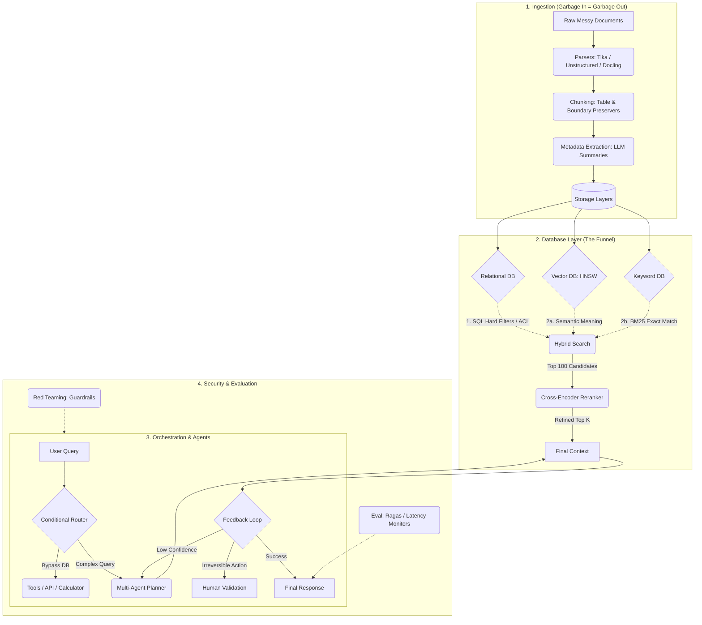

# Scaling RAG to 10 Million Documents

A review and expansion of the enterprise RAG design points from the referenced video, with added commentary on where each piece tends to break in practice and how it maps onto a multi-agent orchestration system.

---

## 1. Ingestion: The Part Everyone Underestimates

At 10M-document scale, the hard problem isn't retrieval — it's the fact that "documents" stop being clean text. You're dealing with scanned contracts, spreadsheets with merged cells, Slack threads, and PDFs with two-column layouts. Ingestion quality is the ceiling on everything downstream; a perfect retrieval pipeline can't fix a chunk that lost its table structure on the way in.

**Universal parsing.** You need a layer that normalizes wildly different formats into structured text before anything else happens:
- **Apache Tika** — the generic extractor; handles hundreds of formats but is format-aware rather than layout-aware.
- **Unstructured** — classifies elements (heading vs. body vs. footnote vs. list item) so downstream chunking can make smarter decisions.
- **Docling** — purpose-built for messy PDFs; recovers multi-column reading order and reconstructs table structure via OCR when the PDF has no text layer at all.

**Context-aware chunking.** Fixed-size splitting (every 512 characters) is the default in most tutorials and the wrong default in production — it slices tables in half and severs a paragraph from the heading that gives it meaning. The fix is a few specialized passes rather than one generic splitter:
- *Table preservers* — treat tables as atomic units, or serialize them to Markdown so the model can still parse rows/columns after retrieval.
- *Boundary detectors* — only cut at natural paragraph breaks, never mid-sentence or mid-table.
- *Heading detectors* — inject the parent section heading into each chunk so an isolated fragment still carries its context when retrieved in isolation.

**Metadata extraction.** Pure vector similarity gets noisy at scale — thousands of chunks can be "close enough" in embedding space. Pre-computing metadata (LLM-generated summaries, keywords, likely questions the chunk answers) at ingestion time lets you apply hard filters before the vector search even runs, e.g., "restrict to public finance documents from 2024."

*My take:* this ingestion layer is where most RAG projects quietly die. Teams budget for the vector DB and the reranker and treat parsing as a solved problem, then spend months debugging why answers are wrong — when the real issue is a table that got chunked into three meaningless fragments six weeks earlier.

---

## 2. The Database Layer: Retrieval as a Funnel, Not a Lookup

At scale, retrieval is never "search the whole corpus." It's a funnel that gets narrower and more expensive at each stage.

- **Vector search (HNSW)** — Hierarchical Navigable Small World graphs trade a small amount of recall for large speed gains, which is the only way approximate nearest-neighbor search stays fast at millions of vectors.
- **Hybrid search** — embeddings are good at *meaning* and bad at *exact strings*. A query like "Stripe error code 402" can return generic payment-failure content from a pure vector search because the embedding doesn't weight the literal code heavily. Running dense vector search alongside **BM25** (keyword-based, exact-match-friendly) and merging the results — commonly in Elasticsearch/OpenSearch — covers both failure modes.
- **SQL / hard filters** — vectors are the wrong tool for enforcing rigid rules like access control. A relational layer filters 10M documents down to the few thousand a given user is even allowed to see, *before* the expensive semantic search runs. This is also just good security practice — you don't want ACL enforcement living inside a similarity score.
- **Reranking** — hybrid search is optimized for speed, not precision, so it returns a rough top-100. A cross-encoder (e.g., Cohere Rerank) then reads the query jointly with each candidate — which is far more expensive per-item but catches relevance nuances that a bi-encoder embedding comparison misses — and re-scores down to a final top-K.

*My take:* the SQL-filter-before-vector-search ordering is the detail people skip most often, and it's the one with real security consequences, not just quality ones. If ACL filtering happens after retrieval, you've already put restricted content into a context window.

---

## 3. Orchestration: Treating RAG as a Team, Not a Pipe

A mature RAG system behaves less like "query in, chunks out" and more like a small team of specialists with a router deciding who gets involved.

- **Conditional routing** — not every prompt needs a database hit. A basic arithmetic question should go straight to a calculator tool, skipping vector search entirely to save both latency and cost.
- **Parallel specialists** — frameworks like LangGraph or CrewAI let a single request fan out to multiple agents working concurrently (one researching, one analyzing, one flagging risk) instead of a single model doing everything sequentially.
- **Feedback loops and validation** — the system needs permission to distrust its own first answer. Low-confidence retrieval should trigger a different retrieval strategy rather than returning a shaky answer. For irreversible or high-stakes actions (sending money, committing to legal language), the loop should route to a human-in-the-loop step with an audit trail — not because the model can't do it, but because some actions shouldn't have a fully automated rollback path.

*My take:* this section is effectively describing a multi-agent orchestration layer with tool-routing and a HITL escape hatch — the same shape as systems like ArcClaw's delegation and approval-guard patterns, just applied to document retrieval instead of general agent tasks. If you're already running that kind of architecture elsewhere, RAG doesn't need a separate mental model — it's another set of tools and a retrieval agent behind the same router.

---

## 4. Security and Evaluation

Opening internal documents to an LLM means defending against both adversarial input and slow operational decay.

- **Red teaming** — prompt injection (instructions hidden inside an ingested PDF, like "ignore previous instructions") and filter-evasion attempts are realistic threats once external or semi-trusted documents enter the corpus. Continuous adversarial testing with frameworks like NeMo Guardrails or Garak is the mitigation, not a one-time audit.
- **Continuous evaluation** — a technically correct answer that costs $2 and 40 seconds per query is still a production failure. LLM-as-judge scoring (faithfulness, relevance) combined with frameworks like Ragas or TruLens tracking precision, recall, latency, and cost turns "does it work" into a monitored, regression-testable metric rather than a vibe.

*My take:* the prompt-injection risk scales directly with how much of your ingestion pipeline touches untrusted or externally-sourced documents. Internal-only, access-controlled corpora are lower risk than anything ingesting user-uploaded or web-scraped content — worth weighting red-teaming effort accordingly rather than treating it uniformly.

---

## Architecture Diagram

---

## Where This Tends to Fail in Practice

A short list of things the original walkthrough gestures at but is worth stating directly:

1. **Ingestion debt compounds.** Bad chunking decisions made in week one show up as "the model hallucinated" complaints in month three, and by then no one traces it back to the parser.
2. **ACL-after-retrieval is a security bug, not a quality bug.** If filtering happens after the vector search instead of before, restricted content has already entered a context window.
3. **Reranking cost scales with top-K, not corpus size.** It's tempting to think reranking gets more expensive as the corpus grows — it doesn't, since it only touches the ~100 candidates hybrid search already narrowed down. The corpus size only affects the earlier stages.
4. **Human-in-the-loop needs an actual audit trail, not just a pause.** A approval gate that isn't logged is a compliance liability dressed up as a safety feature.

**Reference:** [RAG at 10 Million Documents — System Design](https://www.youtube.com/watch?v=NQZqET-jjws)

**Related:**- [RAG-Architectures](RAG-Architectures.md) — Architectural taxonomy (Hybrid/GraphRAG/CRAG/Agentic) that frames the scaling decisions in this guide.- [RAG-Guide-Jan-2026](RAG-Guide-Jan-2026.md) — Foundational RAG concepts (chunking, retrieval, evaluation) that this scaling guide builds on.- [Unlock-the-Dark-Data](../LLMs/optimization/Unlock-the-Dark-Data.md) — Enterprise data-strategy whitepaper directly relevant to the ingestion-quality ceiling discussed here.- [MCP_Scalability_Issue_Solution](../Protocols/MCP_Scalability_Issue_Solution.md) — Context-efficiency patterns for the multi-agent orchestration and tool-routing layers in scaled RAG.
