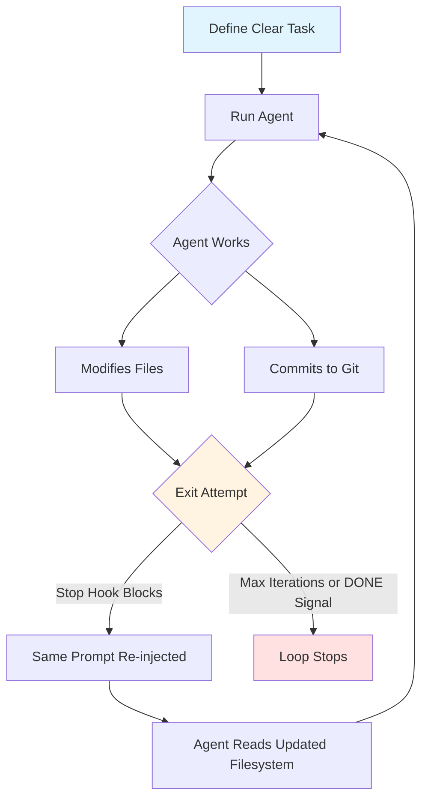
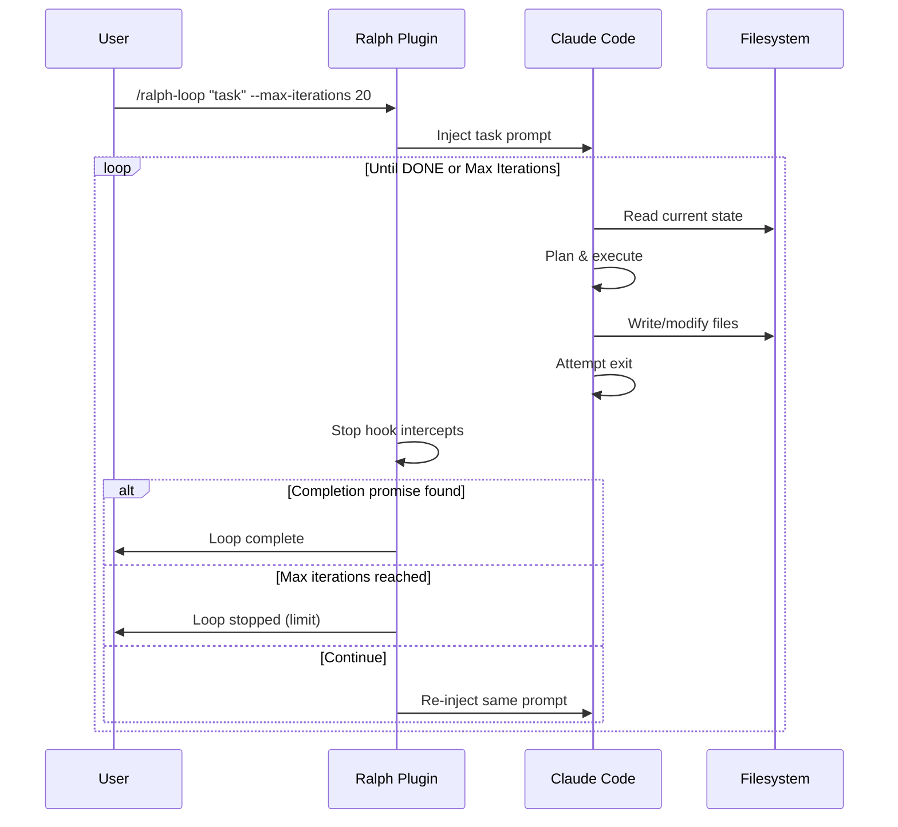
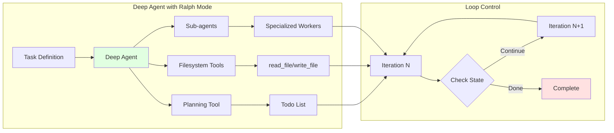
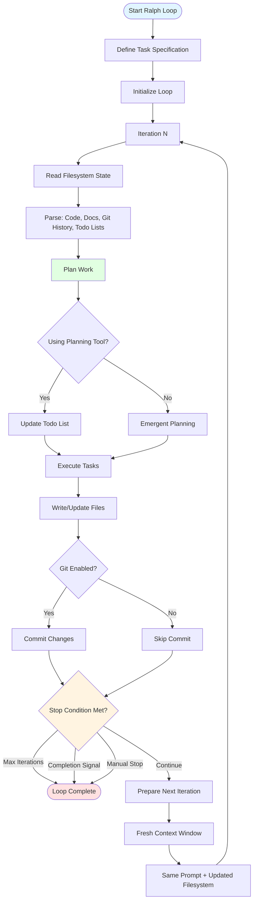
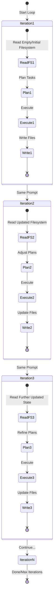
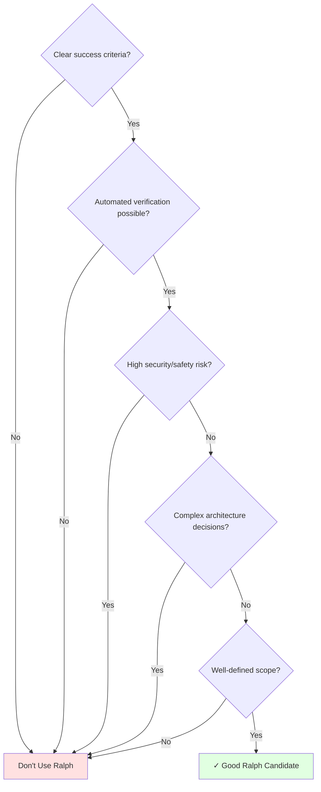
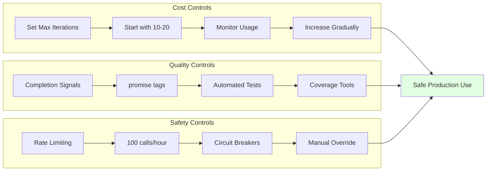
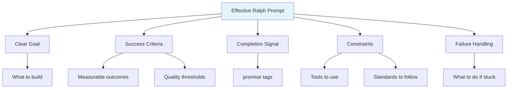

# Ralph Wiggum Loops & Ralph Mode: Complete Guide

## Table of Contents
1. [Overview](#overview)
2. [Core Concept](#core-concept)
3. [Implementation Variants](#implementation-variants)
4. [Architecture & Flow](#architecture--flow)
5. [When to Use](#when-to-use)
6. [Safety & Cost Management](#safety--cost-management)
7. [Best Practices](#best-practices)
8. [Resources](#resources)

Other Ref: [How-Ralph-Works-with-Amp.md](How-Ralph-Works-with-Amp.md)

---

## Overview

**Ralph Wiggum loops** are an autonomous AI coding pattern that enables agents to work for hours or days without human intervention by using the **filesystem as persistent memory** instead of chat history. Named after The Simpsons character, the technique embodies persistent iteration despite setbacks.

### Key Principle
> "Better to fail predictably than succeed unpredictably."  
> — Geoffrey Huntley, creator of the Ralph technique

### Current Status (January 2025)
- **Official Plugin:** Anthropic released the official `ralph-wiggum` plugin for Claude Code (summer 2025)
- **Deep Agents Support:** LangChain's `deepagents` package includes Ralph Mode example implementations
- **Community:** Active development with real-world production usage reported

---

## Core Concept

### The Original Pattern
Geoffrey Huntley's original implementation (May 2025) was elegantly simple:

```bash
# The entire original Ralph loop
while :; do cat PROMPT.md | claude-code; done
```

### How It Works



### Memory Mechanism

**Traditional Approach:**
- Long chat history → context rot → degraded performance

**Ralph Approach:**
- Fresh context each iteration
- Filesystem as source of truth
- Git history for traceability
- No conversation history management

---

## Implementation Variants

### 1. Claude Code (Official Plugin)

**Installation:**
```bash
# Plugin is built into Claude Code
# Enable via plugin system
```

**Usage:**
```bash
# Basic usage
/ralph-loop "Migrate tests from Jest to Vitest" \
  --max-iterations 25 \
  --completion-promise "DONE"

# Recommended safety limits
/ralph-loop "Build todo API" \
  --max-iterations 20
```

**How the Official Plugin Works:**



**Key Features:**
- Stop hook intercepts exit attempts
- Uses exit code 2 to block Claude from stopping
- Same prompt re-injected each iteration
- Markdown file tracks state (can cause issues if deleted)
- Requires `--dangerously-skip-permissions` for reliable operation

### 2. LangChain Deep Agents (Ralph Mode)

**Installation:**
```bash
# Install uv package manager
curl -LsSf https://astral.sh/uv/install.sh | sh

# Setup virtual environment
uv venv
source .venv/bin/activate

# Install Deep Agents CLI
uv pip install deepagents-cli
```

**Usage:**
```bash
# Download Ralph Mode script
curl -O https://raw.githubusercontent.com/langchain-ai/deepagents/main/examples/ralph_mode/ralph_mode.py

# Run Ralph Mode
python ralph_mode.py "Build a Python programming course for beginners"
```

**Architecture:**



**Key Features:**
- Built on LangGraph for stateful workflows
- Planning tool (todo list) for task decomposition
- Sub-agent delegation for complex subtasks
- Filesystem backend for persistent memory
- Supports custom tools and prompts

### 3. Community Implementations

**frankbria/ralph-claude-code** (Popular community tool):
```bash
# Global installation
git clone https://github.com/frankbria/ralph-claude-code
cd ralph-claude-code
./install.sh

# Per-project setup
ralph-setup my-project

# Run with monitoring
ralph --monitor --calls 50
```

**Features:**
- Dual-condition exit gate
- Rate limiting (100 calls/hour default)
- Circuit breaker for error detection
- Response analyzer with semantic understanding
- 308 tests, 100% pass rate

---

## Architecture & Flow

### Detailed Ralph Execution Flow



### State Management Across Iterations



---

## When to Use

### ✅ Ideal Use Cases

| Use Case | Why It Works | Example |
|----------|--------------|---------|
| **Greenfield Projects** | Nothing to break, clear specs | Building new service from scratch |
| **Large Refactors** | Mechanical transformations, tests verify correctness | OOP → FP conversion, framework migration |
| **Test Generation** | Measurable goal (coverage %), automated verification | "Write tests until coverage ≥ 80%" |
| **Documentation** | Batch operations, clear completion criteria | API docs, README updates |
| **Code Migrations** | Well-defined behavior targets | Jest → Vitest, Python 2 → 3 |
| **Course/Content Creation** | Structured output with checkpoints | Programming course with modules & exercises |

### ❌ When to Avoid

| Scenario | Why It Fails | Alternative |
|----------|--------------|-------------|
| **Security-Critical Code** | May produce insecure code that passes naive tests | Manual review, security-focused prompts |
| **Architecture Decisions** | Needs human context & tradeoff analysis | Human-in-the-loop design |
| **Exploratory Work** | No clear "done" criteria, may never converge | Interactive debugging, hypothesis testing |
| **Business Judgment** | Context not fully encodable in prompts | Strategic human decisions |
| **Real-time Systems** | Unpredictable iteration duration | Traditional development |

### Decision Framework



---

## Safety & Cost Management

### Cost Reality Check

**Real-World Examples:**
- 50-iteration loop on large repo: **$50-100+** in API credits
- YC hackathon teams: **6+ repos for $297** overnight
- Geoffrey Huntley's 3-month loop: Built complete programming language (cursed lang)
- Some users reported **several hundred dollars** when forgetting limits

### Essential Safeguards



### Implementation Checklist

**Before Starting:**
- [ ] Set `--max-iterations` (start with 10-20)
- [ ] Define clear completion criteria
- [ ] Set up automated tests/verification
- [ ] Configure spending alerts on API dashboard
- [ ] Prefer fixed-price plans over pay-per-token
- [ ] Enable Git for change tracking
- [ ] Write clear prompt with "done" definition

**During Execution:**
- [ ] Monitor token usage
- [ ] Check iteration progress
- [ ] Review filesystem changes
- [ ] Verify Git commits make sense
- [ ] Ready to Ctrl+C if needed

**After Completion:**
- [ ] Review all changes
- [ ] Run test suite
- [ ] Check security implications
- [ ] Verify against original requirements
- [ ] Document what worked/failed

---

## Best Practices

### Prompt Engineering for Ralph

**Bad Prompt:**
```
Build a good API
```

**Good Prompt:**
```
Build a REST API for todos. Success criteria:
- All CRUD endpoints working (GET, POST, PUT, DELETE)
- Input validation on all endpoints
- Tests passing with coverage > 80%
- README with API documentation
- OpenAPI spec generated

Output <promise>COMPLETE</promise> when all criteria met.
```

**Excellent Prompt (Multi-phase):**
```
Phase 1: Build todo API data models
- User, Todo, and Tag models
- Database schema with migrations
- Model validation
- Unit tests for models
Output: <promise>PHASE1_DONE</promise>

Phase 2: Build API endpoints
- CRUD for todos
- User authentication (JWT)
- Tag management
- Integration tests
Output: <promise>PHASE2_DONE</promise>

Phase 3: Documentation & Polish
- README with examples
- OpenAPI/Swagger docs
- Error handling polish
- Performance optimization
Output: <promise>COMPLETE</promise>

After 15 iterations, if blocked:
- Document blocking issues in BLOCKERS.md
- List attempted approaches
- Suggest alternatives
```

### Prompt Components



### Mental Model Shift

**Traditional AI Coding:**
- Step-by-step direction
- Review each change
- Micromanage execution
- Perfect first attempt

**Ralph Philosophy:**
- Define clear outcomes
- Specify success criteria
- Let agent iterate
- Treat failures as data
- Prompt engineering over prompt perfection

---

## Comparison: Claude Code vs Deep Agents

| Aspect | Claude Code (Official Plugin) | LangChain Deep Agents |
|--------|-------------------------------|----------------------|
| **Installation** | Built-in plugin | `pip install deepagents-cli` |
| **Activation** | `/ralph-loop` command | Python script |
| **Loop Mechanism** | Stop hook intercepts exit | External Python loop |
| **Memory** | Filesystem + Git | Filesystem + optional backends |
| **Planning** | Emergent from workflow | Explicit todo tool |
| **Sub-agents** | Not built-in | Native support |
| **Cost Control** | `--max-iterations` flag | Script-level control |
| **Customization** | Limited to prompts | Full Python customization |
| **Best For** | Quick iterations, standard workflows | Complex multi-agent tasks |

---

## Resources

### Official Documentation
- [Claude Code Ralph Plugin README](https://github.com/anthropics/claude-code/blob/main/plugins/ralph-wiggum/README.md)
- [LangChain Deep Agents Docs](https://docs.langchain.com/oss/python/deepagents/overview)
- [Deep Agents Ralph Mode Example](https://github.com/langchain-ai/deepagents/tree/master/examples/ralph_mode)

### Key Articles
- [Geoffrey Huntley: Ralph as Software Engineer](https://ghuntley.com/ralph/)
- [Paddo.dev: Autonomous Loops for Claude Code](https://paddo.dev/blog/ralph-wiggum-autonomous-loops/)
- [VentureBeat: How Ralph Wiggum Became AI's Biggest Name](https://venturebeat.com/technology/how-ralph-wiggum-went-from-the-simpsons-to-the-biggest-name-in-ai-right-now)
- [HumanLayer: A Brief History of Ralph](https://www.humanlayer.dev/blog/brief-history-of-ralph)

### Community Tools
- [frankbria/ralph-claude-code](https://github.com/frankbria/ralph-claude-code) - Enhanced community implementation
- [Awesome Claude: Ralph Wiggum](https://awesomeclaude.ai/ralph-wiggum) - Comprehensive guide

### Video Content
- [YouTube: Original Ralph Concept](https://www.youtube.com/watch?v=dPG-PsOn-7A)
- [YouTube: Deep Agents Ralph Mode](https://www.youtube.com/watch?v=yi4XNKcUS8Q)

---

## Conclusion

Ralph Wiggum loops represent a fundamental shift in AI-assisted development:

**From:** Babysitting agents through each step  
**To:** Designing environments where agents can run safely

**From:** Crafting perfect prompts  
**To:** Defining clear success criteria

**From:** One-shot attempts  
**To:** Persistent iteration until completion

The technique is "deterministically bad in an undeterministic world"—failures are predictable and teach you about missing specifications. When used appropriately with proper safeguards, Ralph loops can deliver production-ready code overnight for well-defined, mechanical tasks.

As Geoffrey Huntley put it: **"Ralph is a Bash loop."** Sometimes the most powerful automation isn't the cleverest—it's the one that keeps trying until it works.
