# Google TabFM: Can a Frozen Model Really Replace Weeks of Tabular-Model Iteration?

*A plain-language and technical deep dive, checked against Google's announcement, the live source repository, model cards, licence terms, TabArena, and independent testing — last verified July 19, 2026.*

> **About this review:** TabFM is moving quickly. This article separates what Google has officially documented, what the live code currently does, what public benchmarks show, and what independent testing has found. Where the evidence is still thin, it says so.

---

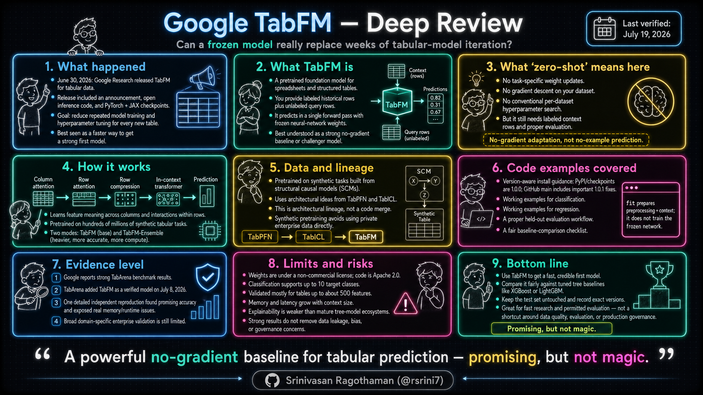

## Before we start: what actually happened

On **June 30, 2026**, Google Research released **TabFM**, a foundation model for spreadsheet-like data. The release included an announcement, an open inference-code repository, and separate PyTorch and JAX model checkpoints.

It quickly drew attention within the tabular-machine-learning community because the promise sounds almost too convenient:

> Give the model labelled historical rows and new unlabelled rows together. It predicts the targets without retraining its neural-network weights or running a conventional hyperparameter search.

That is a meaningful shift, but it is easy to describe it too loosely. TabFM does not remove the need for labelled examples, clean data, sensible evaluation, or production governance. What it tries to remove is the repeated cycle of training and tuning a fresh model for every new table.

---

## Part 1 — For everyone: what problem is this actually solving?

Imagine a new loan officer joining a bank. You do not teach that person arithmetic from the beginning. You show them past cases, explain which borrowers repaid and which defaulted, and ask them to judge a new application.

TabFM works in roughly that spirit. It arrives already pretrained on a huge variety of synthetic tabular problems. When you give it your labelled rows, those rows become examples it can reason over while predicting the new rows.

Traditional tabular ML usually looks like this:

1. Clean the data.
2. Choose or engineer useful features.
3. Select a model.
4. tune its hyperparameters.
5. Train it on the dataset.
6. Validate and repeat.

TabFM does not eliminate step 1 or step 6. It aims to compress much of steps 2–5 into an already-pretrained model that can adapt through context.

### What “zero-shot” means here

The term is slightly confusing because TabFM still needs labelled historical rows. Here, **zero-shot** means:

- no task-specific update to the pretrained neural-network weights;
- no gradient descent on your dataset;
- no conventional per-dataset hyperparameter search;
- prediction through in-context examples supplied at inference time.

So it is better to think of TabFM as **no-gradient adaptation**, not “prediction with no examples.”

### Why this matters outside an ML research lab

Most operational business predictions are built on tables:

- customer churn;
- transaction fraud;
- loan default;
- insurance risk;
- equipment failure;
- sales forecasting;
- patient-risk classification.

A tool that produces a credible first model without days of tuning could change how quickly teams explore these problems. The key phrase, however, is **credible first model**. It does not automatically make the result safe, explainable, or production-ready.

---

## Part 2 — The backstory: why this took so long

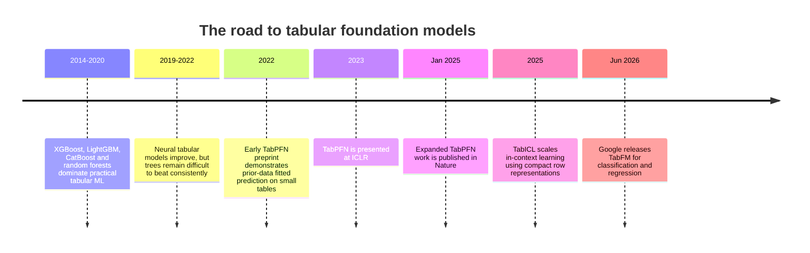

For years, neural networks transformed image, language, speech, and code modelling while gradient-boosted trees remained stubbornly strong on ordinary structured data.

The reason is structural. A sentence has an order. An image has nearby pixels. A table is different:

- rows can usually be rearranged without changing meaning;
- columns can often be reordered without changing the task;
- columns can mix numbers, categories, dates, identifiers, and missing values;
- relationships vary wildly from one dataset to another.

The important lineage is:

- **TabPFN** showed that a transformer pretrained on synthetic tabular tasks could perform in-context prediction on real small datasets.
- **TabICL** introduced a scalable design that first turns each row into a compact representation and then reasons across those row representations.
- **TabFM** builds on this direction with alternating row/column processing, row compression, a larger in-context transformer, and pretraining across hundreds of millions of synthetic tables.

This is architectural lineage, not a merger of the TabPFN and TabICL codebases.

---

## Part 3 — What TabFM actually is

### 3.1 Prediction as in-context learning

Traditional supervised learning adjusts model parameters until the model fits a particular dataset. TabFM keeps its pretrained parameters frozen and presents the historical and target rows together as context.

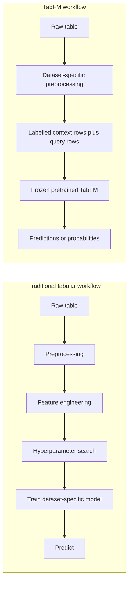

### What `.fit()` really does

The scikit-learn-shaped API can create the wrong impression. Calling `.fit()` does **not** update TabFM’s neural weights. But it is not an empty method either.

The current repository describes `.fit()` as preparing dataset-specific state, including ordinal encoders and numerical scalers, while retaining the labelled rows for use as inference context.

A precise description is:

> `.fit()` prepares the table and stores the examples; it does not train the pretrained neural network.

That distinction matters for both correctness and performance. The historical rows still participate in prediction, so inference cost does not behave like a small XGBoost model that was trained once and then scores each row cheaply.

### 3.2 Why tables are harder than text

A language model receives a one-dimensional sequence. TabFM must reason over a two-dimensional structure whose ordering is mostly arbitrary.

Two constraints dominate the design:

- **Row relationships:** values in one record interact with each other. Income may only make sense when considered with occupation, age, or location.
- **Column relationships:** the meaning and scale of one value depends on the other values in that feature.

This is why TabFM does not simply turn a CSV file into a sentence and send it through a normal language model.

### 3.3 The three-stage architecture

Google describes the architecture in three broad stages.

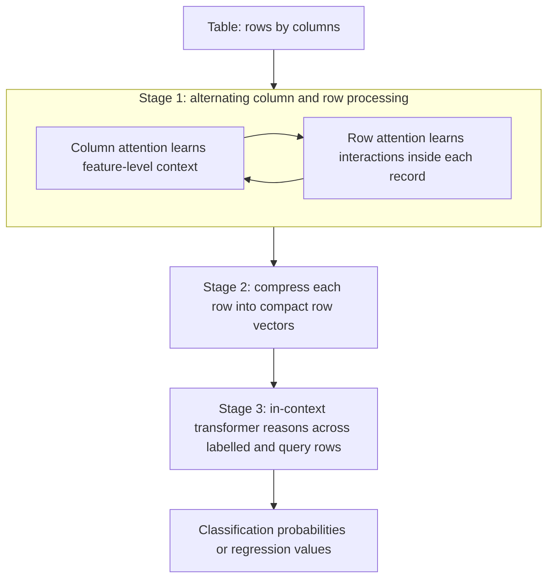

In plain language:

1. **Column attention** helps the model understand a feature relative to other values in that feature.
2. **Row attention** helps it combine the features belonging to one record.
3. **Row compression** prevents the later transformer from attending over every raw cell in the entire table.
4. **The ICL transformer** uses historical rows as worked examples and predicts the query rows.

The model card describes a fairly large network: three column-attention blocks, three row-attention blocks with eight CLS tokens, and a 24-block in-context transformer. This scale helps explain both its benchmark strength and its computational cost.

### 3.4 Why it was trained on synthetic data

The best enterprise tables are rarely public. Banks, hospitals, insurers, manufacturers, and retailers cannot simply upload their production databases to form a public pretraining corpus.

Google’s answer was to generate tabular learning problems using **Structural Causal Models (SCMs)** with many random functions, distributions, and feature relationships.

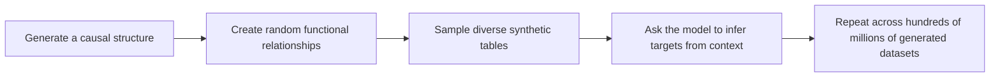

The important idea is not that the synthetic rows look exactly like a bank spreadsheet. It is that the model sees an enormous variety of statistical structures and repeatedly learns how evidence in some rows can predict values in others.

This approach avoids collecting private real-world records, but it creates a transfer question: will the synthetic structures cover the oddities, biases, subgroup patterns, missing-data mechanisms, and operational noise found in your domain? Benchmarks give an encouraging general signal; only evaluation on your own data can answer the local question.

### 3.5 The ensemble mode

Google reports two benchmark configurations:

- **TabFM:** an out-of-the-box model prediction;
- **TabFM-Ensemble:** a more expensive configuration that adds feature crosses, SVD-based features, 32 ensemble members, non-negative least-squares blending, and Platt scaling for classification.

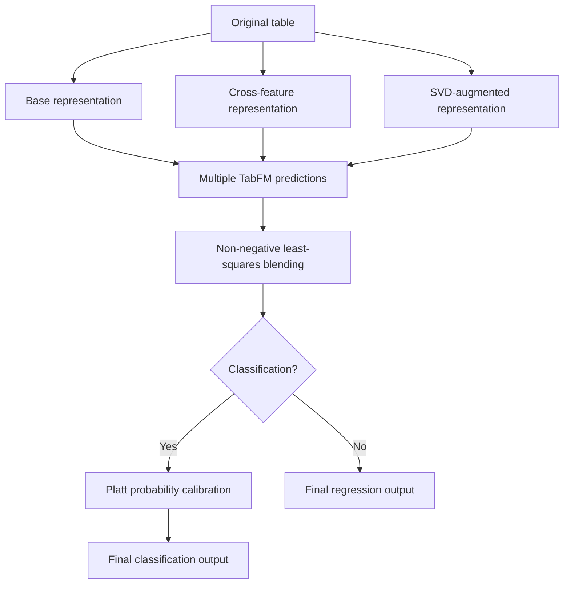

This distinction is easy to miss. “No manual feature engineering” is a fair description of the basic user workflow, but Google’s strongest reported ensemble still creates engineered representations internally.

The public quick-start API focuses on the base classifier and regressor. This article therefore avoids inventing a simplified ensemble call that may not match the evolving repository.

---

## Part 4 — Using it: what the code actually looks like

The original example was enough to show the API shape, but not enough to help a reader test the model responsibly. A useful introduction should cover:

1. the current installation/version situation;
2. classification;
3. regression;
4. held-out evaluation;
5. the boundary between a notebook experiment and a production system.

### 4.1 First, understand the version situation

As of **July 19, 2026**:

- the published model checkpoints are labelled **1.0.0**;
- PyPI still publishes the `tabfm` package as **1.0.0**;
- the GitHub `main` branch contains a **1.0.1 changelog dated July 9, 2026**;
- those repository fixes include safetensors loading, multi-device prediction, estimator output types, pickling, bfloat16 defaults, and activation chunking;
- GitHub does not currently show a formal release object for 1.0.1.

The 1.0.0 loader expected a file that the Hugging Face checkpoint no longer provides, so the safest reproducible route at the time of writing is the current repository code rather than assuming the PyPI package contains the July fixes.

#### Current repository installation

```bash
git clone https://github.com/google-research/tabfm.git
cd tabfm

# PyTorch backend
pip install -e ".[pytorch]"

# Or JAX on CPU
# pip install -e ".[jax]"

# Or JAX with CUDA support
# pip install -e ".[jax,cuda]"
```

For a serious experiment, also record the exact Git commit:

```bash
git rev-parse HEAD
```

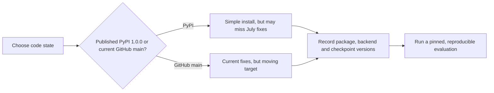

### 4.2 Classification with mixed numerical and categorical columns

This example follows the official estimator pattern and keeps the table deliberately small so the role of the context rows is visible.

```python
import numpy as np
import pandas as pd

from tabfm import TabFMClassifier
from tabfm import tabfm_v1_0_0_pytorch as tabfm_v1_0_0

# Downloads the classification checkpoint on first use.
model = tabfm_v1_0_0.load()

X_context = pd.DataFrame(
    {
        "age": [25.0, 45.0, 22.0, 50.0, 35.0, 60.0],
        "job_role": [
            "engineer",
            "manager",
            "engineer",
            "manager",
            "engineer",
            "manager",
        ],
        "monthly_income": [70_000, 120_000, 65_000, 150_000, 80_000, 180_000],
    }
)

y_context = np.array(
    ["low_risk", "high_risk", "low_risk", "high_risk", "low_risk", "high_risk"]
)

X_query = pd.DataFrame(
    {
        "age": [30.0, 48.0],
        "job_role": ["engineer", "manager"],
        "monthly_income": [85_000, 135_000],
    }
)

classifier = TabFMClassifier(model=model)
classifier.fit(X_context, y_context)  # prepares encoders/scalers and retains context

predicted_labels = classifier.predict(X_query)
predicted_probabilities = classifier.predict_proba(X_query)

print("Predictions:", predicted_labels)
print("Probabilities:\n", predicted_probabilities)
```

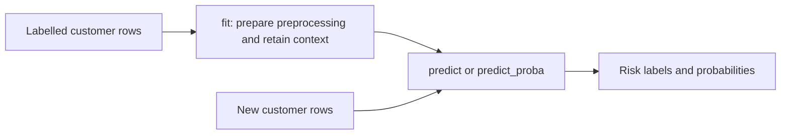

The tiny dataset is only an API illustration. It is not a meaningful credit-risk model, and it should never be interpreted as one.

### 4.3 Regression

TabFM uses a separate regression checkpoint and estimator. Loading classification weights into the regressor was one of the confusing failure modes improved in the 1.0.1 repository code.

```python
import numpy as np
import pandas as pd

from tabfm import TabFMRegressor
from tabfm import tabfm_v1_0_0_pytorch as tabfm_v1_0_0

model = tabfm_v1_0_0.load(model_type="regression")

X_context = pd.DataFrame(
    {
        "floor_area_sqft": [900, 1200, 1500, 1800, 2200, 2800],
        "neighbourhood": ["A", "A", "B", "B", "C", "C"],
        "building_age": [12, 8, 15, 5, 7, 3],
    }
)

y_context = np.array([180_000, 240_000, 275_000, 355_000, 470_000, 620_000])

X_query = pd.DataFrame(
    {
        "floor_area_sqft": [1350, 2500],
        "neighbourhood": ["A", "C"],
        "building_age": [6, 4],
    }
)

regressor = TabFMRegressor(model=model)
regressor.fit(X_context, y_context)
predicted_prices = regressor.predict(X_query)

print("Predicted prices:", predicted_prices)
```

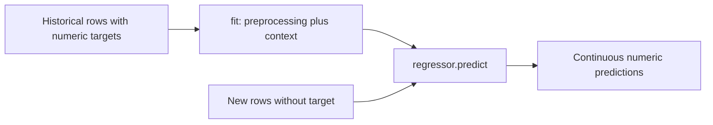

Again, this is an API demonstration, not a valuation system. A real model needs held-out evaluation, time-aware splitting where relevant, domain checks, and error analysis.

### 4.4 A more honest held-out evaluation

The most dangerous beginner mistake is to call `.fit()` on every row and then measure predictions on those same rows. TabFM still needs a genuine train/test separation.

The following example uses scikit-learn’s breast-cancer dataset because it is local, labelled, and small enough for a first test. It is an educational benchmark, not a medical deployment recipe.

```python
from sklearn.datasets import load_breast_cancer
from sklearn.metrics import accuracy_score, roc_auc_score
from sklearn.model_selection import train_test_split

from tabfm import TabFMClassifier
from tabfm import tabfm_v1_0_0_pytorch as tabfm_v1_0_0

# Load a small public dataset as a pandas DataFrame.
data = load_breast_cancer(as_frame=True)
X = data.data
y = data.target

X_context, X_test, y_context, y_test = train_test_split(
    X,
    y,
    test_size=0.25,
    random_state=42,
    stratify=y,
)

model = tabfm_v1_0_0.load()
classifier = TabFMClassifier(model=model)
classifier.fit(X_context, y_context)

predictions = classifier.predict(X_test)
probabilities = classifier.predict_proba(X_test)

accuracy = accuracy_score(y_test, predictions)
auc = roc_auc_score(y_test, probabilities[:, 1])

print(f"Accuracy: {accuracy:.3f}")
print(f"ROC AUC:  {auc:.3f}")
```

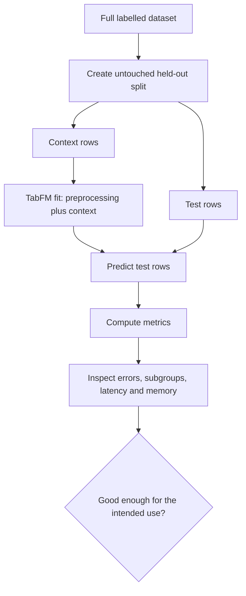

A stronger evaluation would also:

- repeat the split across multiple seeds or use an appropriate cross-validation scheme;
- compare against a simple baseline and a tuned tree model;
- keep all preprocessing inside the training fold;
- use time-based splits for future-prediction problems;
- report latency and GPU memory alongside accuracy;
- examine subgroup performance rather than only one aggregate score.

### 4.5 What a practical comparison should look like

TabFM should not be evaluated in isolation. At minimum, compare it with:

- a simple linear or logistic model;
- a strong default XGBoost, LightGBM, or CatBoost model;
- a properly tuned tree baseline when the decision is important;
- an existing tabular foundation model when that comparison is relevant.

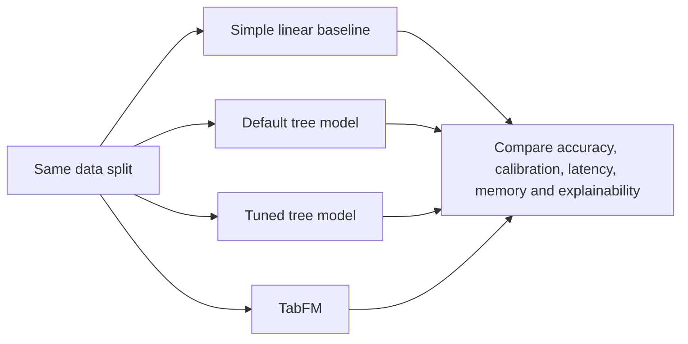

The objective is not to prove TabFM wins. It is to learn what trade-off it offers on **your** problem.

### 4.6 Where it fits in an existing stack

The API resembles scikit-learn, which makes notebook experimentation familiar. Operationally, however, this is not a drop-in replacement for a compact tree model:

- the PyTorch checkpoint repository is roughly 13 GB across classification and regression;
- inference may require significant GPU memory;
- context rows remain involved during prediction;
- the current weights are non-commercial;
- the project is explicitly not an officially supported Google product.

Google has also announced a future BigQuery integration using `AI.PREDICT`. As of this review, the research post says it is coming, but the exact public model identifier, rollout details, and final SQL contract are not yet confirmed in the cited release material.

The following is therefore **conceptual pseudocode**, not a query to copy into production:

```sql
-- Conceptual illustration only.
SELECT *
FROM AI.PREDICT(
  MODEL `your_project.some_future_tabfm_model`,
  (
    SELECT age, job_role, monthly_income
    FROM `your_dataset.rows_to_score`
  )
);
```

---

## Part 5 — Does it actually work? Four levels of evidence

Google evaluated TabFM on **TabArena**, a living benchmark built from 51 datasets: 38 classification and 13 regression tasks, ranging from roughly 700 to 150,000 samples.

The evidence is easier to understand when separated into four levels.

| Level | Evidence | What it tells us | Current status |
|---|---|---|---|
| **1** | Google’s reported TabArena experiments | Whether the model looks competitive in the authors’ own evaluation | Strong results, but author-reported |
| **2** | Verified TabArena integration | Whether an externally maintained benchmark has accepted a confirmed implementation | TabFM added as a **verified model on July 8, 2026** |
| **3** | Independent focused reproduction | Whether the claims survive a separate harness, hardware setup, and comparison | One detailed public study is encouraging and also found real limitations |
| **4** | Broad domain-specific production validation | Whether it works reliably across real banking, healthcare, manufacturing, insurance, and other operational settings | Still limited publicly |

### 5.1 Google’s reported results

Google reports that:

- the base TabFM configuration is competitive without per-dataset tuning;
- TabFM-Ensemble leads its reported TabArena Elo plots;
- the ensemble compares favourably with heavily tuned conventional baselines.

The reasonable interpretation is that TabFM raises the **floor**: teams can reach a strong first result much faster. The public evidence does not prove that it raises the absolute **ceiling** on every individual dataset.

### 5.2 Verified TabArena status

The live TabArena version history records:

- **2026/07/08 — TabArena v0.1.5.2: added new verified model, TabFM.**

This corrects the early-launch situation described by Christoph Molnar, whose July 7 review noted that TabFM was waiting to appear in the live leaderboard at that time.

“Verified” is meaningful because it indicates that the benchmark implementation has been confirmed through the TabArena process. It is still not the same as peer review, a technical paper, or validation in a regulated production environment.

### 5.3 What one detailed independent reproduction found

One of the most detailed independent studies currently available is by Yash Raj Pandey, who published a seeded, reproducible evaluation and contributed a multi-device fix back to the official repository.

Reported findings included:

- TabFM matched or beat an Optuna-tuned XGBoost comparison across the ten fold-matched datasets reported in the comparison;
- two initially claimed wins over TabPFN were downgraded to statistical ties after checking run-to-run variation;
- JAX’s allocator made an early 22.75 GB figure misleading, while the measured working set without preallocation was around 16.95 GB;
- disabling JAX preallocation increased the usable context window on a 24 GB GPU;
- updated PyTorch code with bfloat16 and activation chunking showed a much better practical memory envelope and faster large-context inference in that study;
- a multi-device prediction bug was identified, tested, and fixed upstream;
- a 1,777-feature dataset was a real failure case;
- the largest selected datasets were too slow to evaluate exhaustively on the available hardware.

This is useful engineering evidence because it did not simply repeat a leaderboard number. It measured accuracy stability, memory behaviour, latency, failure cases, and code defects.

It is still one focused study, not a universal verdict. Its own limitations include:

- only part of the selected benchmark subset was fully scored;
- the evaluated subset leaned toward the small-to-medium tables where TabFM is most attractive;
- it did not reproduce the full 51-task TabArena suite;
- some variance comparisons were incomplete.

### 5.4 What remains unknown

As of this review, TabFM has no accompanying technical paper. Public evidence is encouraging across Google’s benchmarks, verified TabArena integration, and one strong independent engineering study.

What remains thin is broad evidence across real operational domains, especially where the data contains:

- temporal drift;
- complex missingness;
- rare but important subgroups;
- entity leakage;
- highly imbalanced outcomes;
- regulatory reason-code requirements;
- strict low-latency service constraints.

---

## Part 6 — The parts that do not make it into the headline

### 6.1 The licence is more restrictive than it first appears

There are two artefacts with different licensing stories:

- the GitHub source repository is presented under **Apache 2.0**;
- the pretrained model weights use the **TabFM Non-Commercial License v1.0**.

The weight licence permits testing, evaluation, research, internal benchmarking, and experimentation only when the work is not tied to commercial gain or production use and its results are not used for commercial decision-making, client deliverables, or paid products and services.

It also states that:

- commercial or production use requires separate permission;
- use in end-user or production systems is outside the non-commercial purpose;
- using TabFM to train, fine-tune, or distil another model for commercial use is outside the permitted purpose;
- the model or derivatives may not be redistributed;
- API access may be governed by other terms if Google later provides such access.

This means a company may be able to perform a genuinely isolated internal benchmark, but it cannot assume that calling something a “prototype” makes every use lawful. If the output drives a product choice, client work, or production roadmap, legal review is needed.

This article is not legal advice; the licence text is the source of truth.

### 6.2 Hard architectural and practical limits

The model card identifies several boundaries:

- **a maximum of 10 target classes** for classification;
- optimisation for tables with up to approximately **500 features**;
- memory usage that scales with the number of context rows;
- no guarantee of matching a task-specific model on every dataset;
- no official Google product support.

Independent testing also found that very wide data can be a genuine failure mode and that large context sizes can make exhaustive evaluation slow, even when memory is available.

### 6.3 Explainability is currently weaker

Tree-based systems are not magically transparent, but they have mature ecosystems for:

- feature importance;
- SHAP values;
- partial-dependence analysis;
- monotonic constraints;
- reason-code pipelines;
- debugging individual predictions.

TabFM does not yet have an equally mature native interpretability stack. That makes it a harder fit for decisions where an organisation must explain why one person was rejected, prioritised, or assigned a particular risk score.

### 6.4 Performance on your data is not guaranteed

Synthetic pretraining gives the model broad statistical experience, not knowledge of your organisation’s data-generating process.

You still need to test:

- unseen categories;
- missing values and their causes;
- domain-specific units and transformations;
- minority subgroups;
- class imbalance;
- time drift;
- sensitivity to context-row selection;
- calibration of predicted probabilities.

### 6.5 Production questions that still need answers

#### Context selection

Every historical row cannot always be carried forever. If the context becomes large, teams may need sampling or selection. That choice can alter accuracy, subgroup coverage, and reproducibility.

#### Batch versus online scoring

TabFM is immediately attractive for research notebooks and batch experiments. Its fit for a high-throughput, low-latency API depends on measured batching, concurrency, GPU memory, warm-up time, and context-reuse behaviour.

#### Data leakage

No-gradient inference does not protect against:

- training on future information;
- duplicate customers in train and test;
- target-derived features;
- preprocessing the full dataset before splitting;
- leakage across related records.

A foundation model can produce an impressive but invalid score just as easily as XGBoost can.

#### Release discipline

The first ten days after launch brought meaningful fixes for loading, multi-device execution, pickling, outputs, dtype, and memory handling. A serious report should record:

- package version and Git commit;
- checkpoint version;
- backend and dependency versions;
- hardware;
- context-selection method;
- random seeds;
- ensemble configuration;
- exact data split.

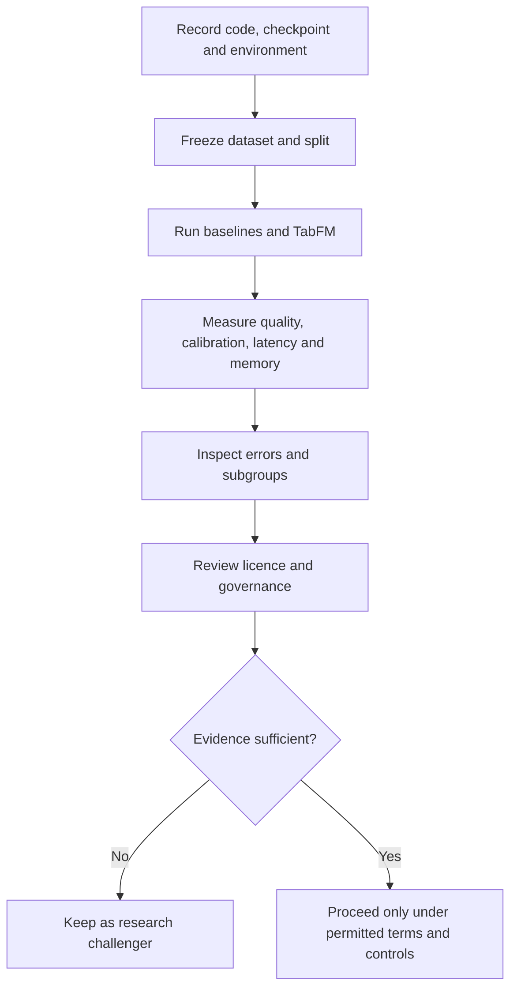

---

## Part 7 — So when should you actually reach for it?

The first decision is legal, not technical.

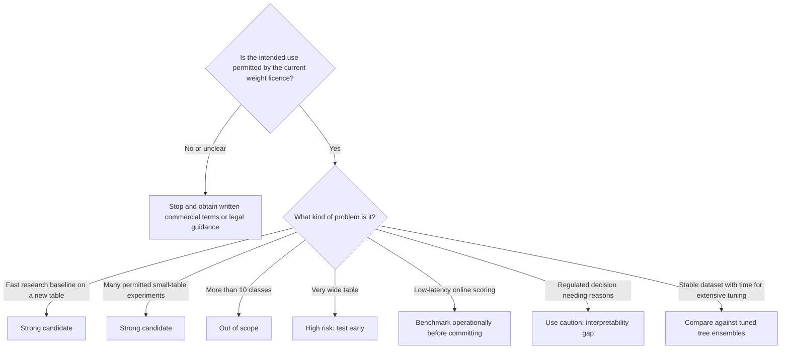

### Good reasons to try it

- You need a strong baseline before spending days designing a modelling pipeline.
- You are comparing many small or medium tabular datasets in a permitted research setting.
- You want to test whether a foundation model can reduce per-dataset tuning effort.
- You can evaluate accuracy, calibration, latency, memory, and subgroup behaviour honestly.

### Reasons to be cautious

- The use contributes to a commercial decision or production system without separate terms.
- The target has more than 10 classes.
- The table is extremely wide.
- You need stable millisecond-level online inference.
- You need mature reason-code and interpretability tooling.
- Your organisation cannot reproduce and pin the rapidly changing software environment.

### The right comparison question

Do not ask:

> Is TabFM better than XGBoost?

Ask:

> On this dataset, under the same split and an honest tuning budget, what combination of quality, effort, latency, memory, explainability, licensing, and operational risk does each approach offer?

That is the decision an engineering or data-science team can act on.

---

## Part 8 — The bottom line

TabFM is a serious attempt to bring the foundation-model pattern to the part of machine learning that quietly runs most organisations: structured tables.

Its main contribution is not that training has become obsolete. It is that a large pretrained model can absorb labelled rows as context and produce a strong prediction without updating its neural weights for every new dataset.

The evidence available on July 19, 2026 is encouraging at three levels:

1. Google reports strong TabArena results.
2. TabArena added TabFM as a verified model on July 8.
3. A detailed independent evaluation reproduced meaningful strengths while also uncovering memory limits, failure cases, and a multi-device bug that was fixed upstream.

But the project is still an early 1.0.x research release with public code and weights, no accompanying technical paper, a restrictive non-commercial weight licence, significant compute requirements, hard task limits, and immature explainability tooling.

The most useful way to think about TabFM today is:

> **A powerful no-gradient baseline and challenger model—not a shortcut around data quality, evaluation, governance, or engineering.**

Use it to learn quickly. Compare it fairly. Record the exact version. Keep the test set untouched. Read the licence before the model downloads. And do not mistake the absence of gradient descent for the absence of work.

---

## Sources

### Primary sources

- Google Research, [“Introducing TabFM: A zero-shot foundation model for tabular data”](https://research.google/blog/introducing-tabfm-a-zero-shot-foundation-model-for-tabular-data/) — official announcement, June 30, 2026
- [google-research/tabfm](https://github.com/google-research/tabfm) — official inference-code repository
- [TabFM changelog](https://github.com/google-research/tabfm/blob/main/CHANGELOG.md) — 1.0.0 and 1.0.1 code changes
- [TabFM PyTorch model card](https://huggingface.co/google/tabfm-1.0.0-pytorch) — architecture, intended uses, limits, and examples
- [TabFM JAX model card](https://huggingface.co/google/tabfm-1.0.0-jax) — JAX checkpoint
- [TabFM Non-Commercial License v1.0](https://huggingface.co/google/tabfm-1.0.0-pytorch/blob/main/LICENSE)
- [TabFM on PyPI](https://pypi.org/project/tabfm/) — published package version
- [TabArena live leaderboard source and version history](https://huggingface.co/spaces/TabArena/leaderboard/blob/main/website_texts.py)
- Erickson et al., [“TabArena: A Living Benchmark for Machine Learning on Tabular Data”](https://arxiv.org/abs/2506.16791)
- Hollmann et al., [“Accurate predictions on small data with a tabular foundation model”](https://www.nature.com/articles/s41586-024-08328-6), *Nature* 637, 2025
- Qu et al., [“TabICL: A Tabular Foundation Model for In-Context Learning on Large Data”](https://proceedings.mlr.press/v267/qu25d.html), ICML 2025

### Independent analysis and reproduction

- Christoph Molnar, [“TabFM minus the hype”](https://mindfulmodeler.substack.com/p/tabfm-minus-the-hype) — early independent critique of scale, inference cost, and licensing
- Yash Raj Pandey, [“I Tried to Break Google's New Tabular Foundation Model. Then I Fixed It.”](https://yashrajpandey.com/writing/breaking-google-tabfm/) — seeded evaluation, hardware study, and upstream bug fix

### Further reading

- Adnan Masood, [“TabFM and the Rise of Tabular Foundation Models”](https://medium.com/@adnanmasood/tabfm-and-the-rise-of-tabular-foundation-models-5aa44131e3b7)
- MarkTechPost, [release coverage](https://www.marktechpost.com/2026/07/01/google-ai-introduces-tabfm-a-hybrid-attention-tabular-foundation-model-for-zero-shot-classification-and-regression/)

---

**Related:**
- [Google-Gemma-Family-Models-Jan-2026](../LLMs/models/other/Google-Gemma-Family-Models-Jan-2026.md) — Google's open-weight LLM family; sibling Google model release with a comparable open-code / restricted-weight licensing split to contrast against TabFM's non-commercial weights.
- [LLM-Benchmarks](../LLMs/architecture/LLM-Benchmarks.md) — Benchmarking methodology (leaderboards, Elo, held-out evaluation) that frames how TabFM's TabArena and Elo results should be read critically.
- [Parameter-Efficient-Fine-Tuning](../Fine-Tuning/Parameter-Efficient-Fine-Tuning.md) — Contrasts gradient-based PEFT adaptation with TabFM's frozen-weight, in-context "no-gradient" adaptation for new datasets.
- [Java-Python-Enterprise-AI](../Comparisons/Java-Python-Enterprise-AI.md) — Enterprise deployment lens; complements TabFM's production, licensing, and governance considerations for structured-data models.
- [AI-Hardware-Chips-Explained](../Hardware/AI-Hardware-Chips-Explained.md) — GPU/TPU memory and compute constraints defined here explain TabFM's ~13 GB checkpoint footprint and context-row memory scaling.


