# microGPT Architecture — Complete Guide


> A comprehensive walkthrough of Andrej Karpathy's **microGPT**: the "most atomic" GPT implementation using **pure Python and math only** — no PyTorch, no NumPy, no GPU.

---

## High-Level Overview

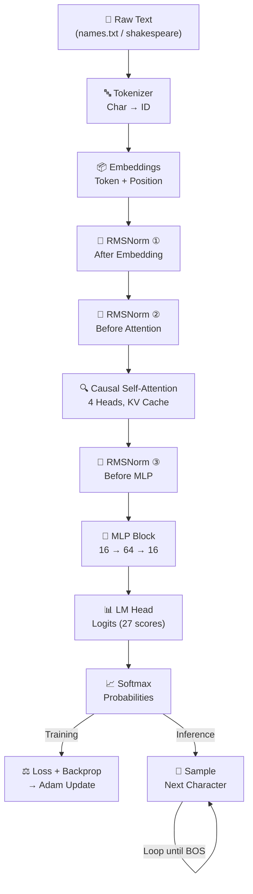

---

## 1. Data Loading and Preprocessing

The script begins by ensuring `input.txt` exists, defaulting to a dataset of names. Each line (name) is treated as an individual **document** and shuffled so the model learns character patterns — not a fixed ordering.

```python
if not os.path.exists('input.txt'):
    # downloads names.txt ...
docs = [l.strip() for l in open('input.txt').read().strip().split('\n') if l.strip()]
```

---

## 2. The Tokenizer — Text to Numbers

This is not a fancy library tokenizer. It finds every unique **character** in the text and uses that as the vocabulary.

```python
uchars = sorted(set(''.join(docs)))
BOS = len(uchars)   # Beginning of Sequence token (also acts as End-of-Sequence)
```

A special **BOS** token is added — it serves as both the start signal during generation and the stop signal when it's sampled as output.

**Example:**

```
"emma" → [BOS, e, m, m, a, BOS] → [26, 4, 12, 12, 0, 26]
```

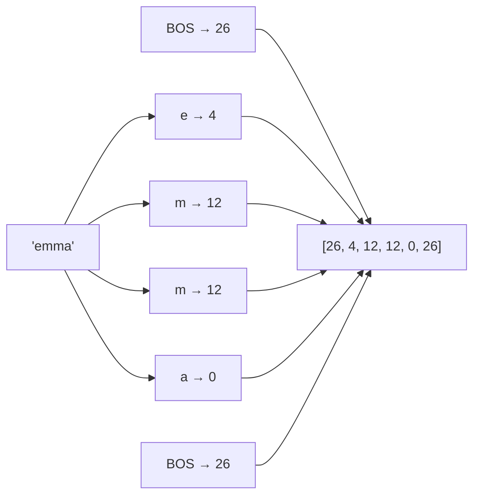

---

## 3. Embeddings — Numbers to Meaningful Vectors

Each token ID gets two 16-dimensional vectors that are **added together** to form one input vector:

| Embedding | Weight Matrix | Encodes |
|-----------|--------------|---------|
| **Token Embedding (wte)** | `state_dict['wte'][token_id]` | *What* this character is |
| **Position Embedding (wpe)** | `state_dict['wpe'][pos_id]` | *Where* this character sits in the sequence |

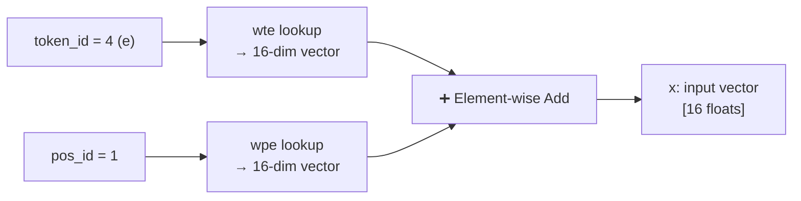

---

## 4. RMSNorm — Stabilize the Numbers

microGPT uses a **pre-norm Transformer design**: RMSNorm is applied before each sublayer (attention and MLP) inside each Transformer block, plus once at input after the combined embedding. This keeps values in a stable range and prevents exploding/vanishing gradients.

```python
x = rmsnorm(x)            # at input — after embedding, before the layer block
# inside each layer:
x = rmsnorm(x)            # before attention sublayer
x = rmsnorm(x)            # before MLP sublayer
```

**Formula:** `x / sqrt(mean(x²) + ε)`

> **Important:** This RMSNorm has **no learnable parameters** — no scale (γ) or shift (β). Unlike LayerNorm, it is purely a normalization operation with nothing added to `state_dict`.

---

## 5. The Autograd Engine — `Value` Class

Since there's no PyTorch, automatic differentiation is built from scratch. Every number (weight) in the model is a `Value` object.

```python
class Value:
    def backward(self):
        # topological sort + chain rule
```

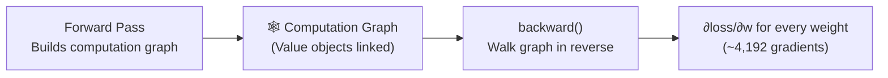

- **Forward pass**: every math operation records itself in the graph.
- **Backward pass**: walks the graph in reverse using the **chain rule** to compute how much each weight contributed to the error.

---

## 6. Model Architecture — `gpt()` Function

The `gpt` function is the Transformer. It processes **one token at a time** — there is no batching, no batch dimension, no parallel sequence processing. This single-token-at-a-time design is exactly why causality is structural: the KV cache simply hasn't seen future tokens yet when the current one is processed.

> **All linear projections (Q, K, V, attn_wo, mlp_fc1, mlp_fc2, lm_head) are bias-free** — the `linear()` function computes only `Wx`, never `Wx + b`. This matches modern GPT design.

```python
def gpt(token_id, pos_id, keys, values):
    tok_emb = state_dict['wte'][token_id]
    pos_emb = state_dict['wpe'][pos_id]
    # ... Attention and MLP blocks ...
```

### 6a. Causal Self-Attention

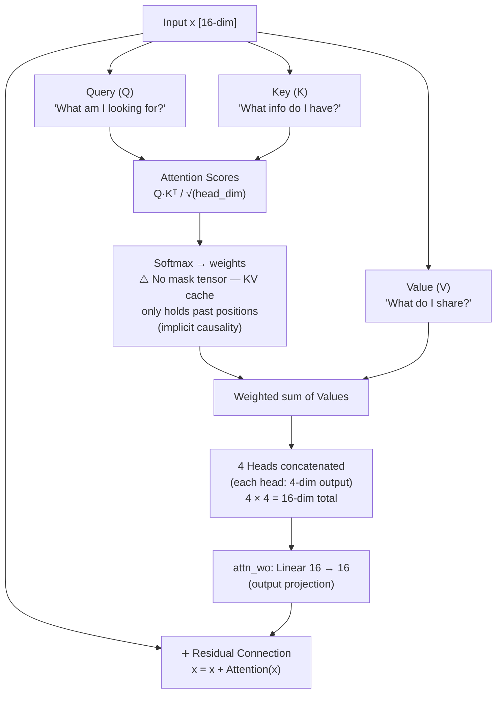

**Key insight on causality:** There is no explicit masking matrix. Causality is enforced *structurally* — at position 5, the KV cache only contains entries from positions 0–4 because they haven't been processed yet.

**Head dimension arithmetic:** `head_dim = n_embd // n_head = 16 // 4 = 4`. Each of the 4 heads independently attends over its own 4-dimensional slice of Q, K, V. Their outputs are concatenated back to 16 dims, then passed through `attn_wo` (a 16×16 linear projection) before the residual add.

**Implementation note:** There are no tensor `matmul` operations. Attention scores are computed via explicit Python loops over scalars: `sum(q_h[j] * k_h[t][j] for j in range(head_dim))`. Everything is scalar arithmetic on `Value` objects.

### 6b. MLP Block

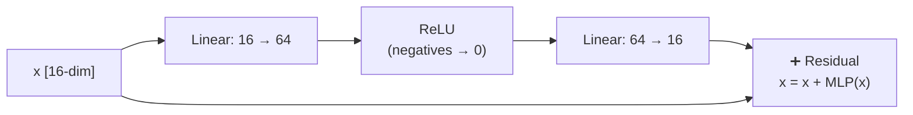

The expansion to 64 dimensions gives the model more "room to think" before compressing back.

---

## 7. LM Head + Softmax — Scores to Probabilities

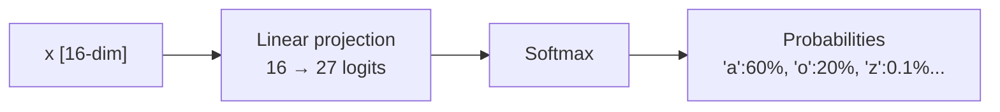

The 27 scores (one per character in the vocabulary) are converted to a probability distribution that sums to 100%.

---

## 8. Training Loop — Learning from Mistakes

**Task:** Next Token Prediction. If the model sees `"J"`, it tries to predict `"e"` for `"Jeffrey"`.

```python
losses = []
for pos_id in range(n):
    token_id, target_id = tokens[pos_id], tokens[pos_id + 1]  # current → next
    logits = gpt(token_id, pos_id, keys, values)
    probs = softmax(logits)
    loss_t = -probs[target_id].log()   # .log() is autograd-aware: defined on the Value class
    losses.append(loss_t)
loss = (1 / n) * sum(losses)           # per-token loss averaged across the document slice
```

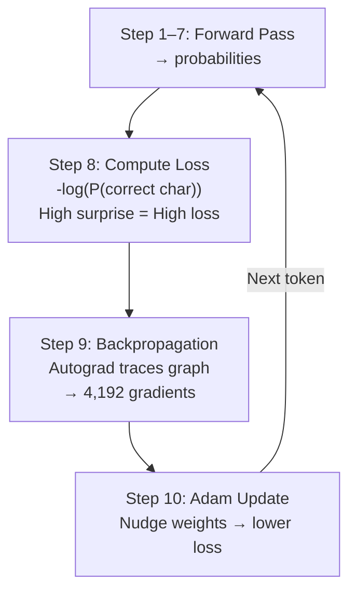

**Loss intuition:** If the model predicts the correct next character with low confidence → loss is **high**. Perfect confidence → loss approaches **0**.

---

## 9. The Adam Optimizer

```python
lr_t = learning_rate * (1 - step / num_steps)  # linear decay
for i, p in enumerate(params):
    m[i] = beta1 * m[i] + (1 - beta1) * p.grad        # 1st moment (mean)
    v[i] = beta2 * v[i] + (1 - beta2) * p.grad ** 2   # 2nd moment (variance)
    m_hat = m[i] / (1 - beta1 ** (step + 1))           # bias correction
    v_hat = v[i] / (1 - beta2 ** (step + 1))           # bias correction
    p.data -= lr_t * m_hat / (v_hat ** 0.5 + eps_adam) # weight update
    p.grad = 0                                          # zero out gradient
```

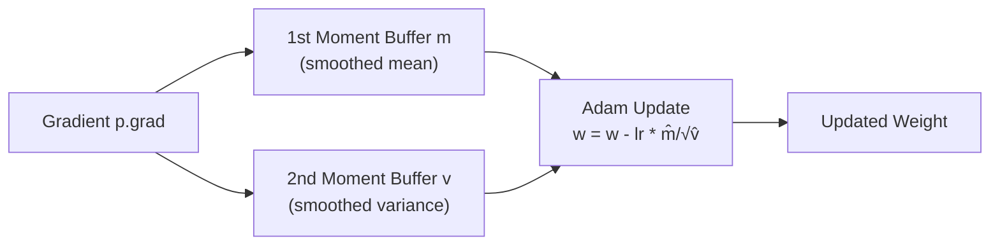

The moment buffers act as **memory** for training — they smooth out updates so learning doesn't wobble, ensuring convergence.

- **Learning rate** starts at `0.01` and follows **linear decay** to 0: `lr_t = 0.01 × (1 − step/1000)`. Gradient is zeroed after each update (`p.grad = 0`) since the `Value` engine accumulates.

---

## 10. Inference — Generating New Names

```python
temperature = 0.5  # controls randomness: low = conservative, high = creative
for pos_id in range(block_size):
    logits = gpt(token_id, pos_id, keys, values)
    probs = softmax([l / temperature for l in logits])  # temperature applied to logits BEFORE softmax
    token_id = random.choices(range(vocab_size), weights=[p.data for p in probs])[0]
```

> **Note on temperature:** dividing logits by a value < 1 *sharpens* the distribution (more confident), while > 1 *flattens* it (more random). The source uses `temperature = 0.5` by default.

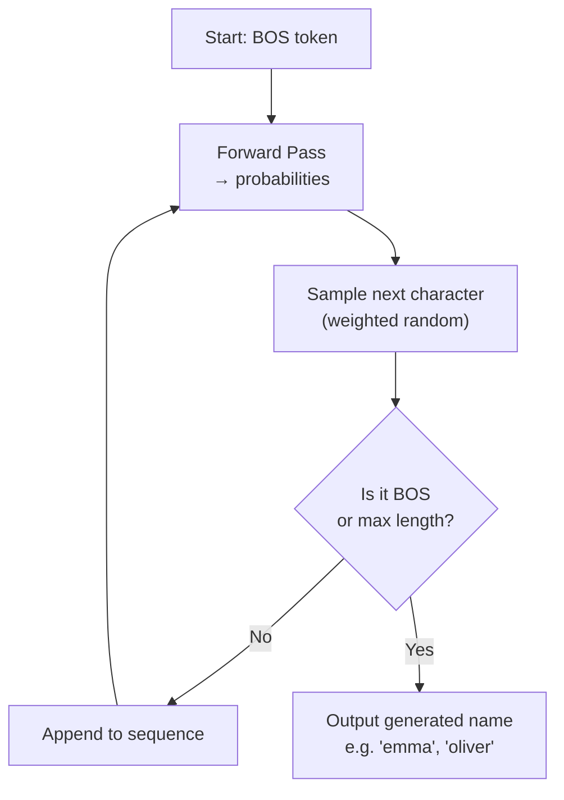

Inference is identical to the forward pass during training — but **no loss is calculated and no weights are updated**. The model "babbles" by feeding its own output back in as the next input (autoregressive generation).

---

## 11. Full Training Pipeline — End to End

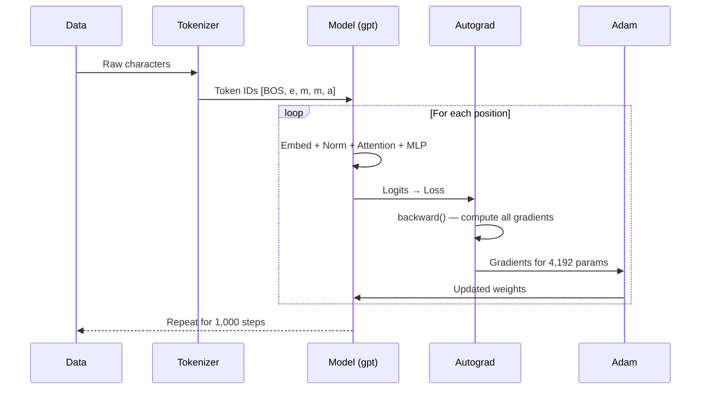

---

## 12. Model Capacity & Experiments

| Experiment | Result |
|---|---|
| **1,000 steps on names** | Learns basic name structures — common endings, typical lengths |
| **Shakespeare (small model)** | Captures basic words ("then", "me") and formatting, but lacks long-range memory |

**Why?** The model is intentionally **tiny**: 1 Transformer layer, 16-dimensional embeddings, 4 attention heads, ~**4,192 total parameters**. This keeps it readable and runnable in pure Python.

> **Scaling note:** Larger GPTs increase `n_layer`, `n_embd`, and `vocab_size` — but the core algorithm here is **identical**. Everything else is just efficiency.

---

## 13. Key Design Principle

> The entire architecture runs on **pure Python scalars**. Every number is wrapped in a custom `Value` object that tracks both its value and its gradient, building a computation graph that enables learning via the chain rule.

```
Characters get personalities (embeddings)
    → talk to each other (attention)
    → think deeply (MLP)
    → predict what comes next (LM head + softmax)
    → learn from mistakes (loss + backprop + Adam)
    → repeat
```

---

*Based on Andrej Karpathy's microGPT implementation.*
