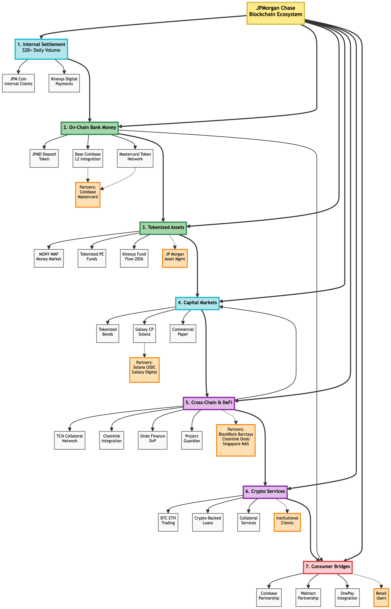

# J.P. Morgan on Blockchain – Complete Strategy, Timeline, and Business Outcomes
## Comprehensive Ecosystem Analysis with All Initiatives (2018–2025+)

---

## 1. Executive Snapshot

**Core takeaway:** J.P. Morgan is not "doing crypto"; it is rebuilding institutional finance on blockchain rails – from internal settlement to on-chain bank money, tokenized assets, capital markets issuance, institutional DeFi, crypto services, and embedded consumer finance – with a regulator-first, multi-chain, "and" strategy.

> J.P. Morgan is using blockchain to modernize how money, assets, and capital markets operate at every layer: starting with internal settlement through Kinexys Digital Payments (processing $2B+ daily), extending real bank money on-chain via JPMD deposit tokens on public blockchains (Coinbase Base, Ethereum), tokenizing yield-bearing assets like MONY (tokenized money market funds), issuing real debt instruments on public blockchains (Galaxy commercial paper on Solana), operating permissioned institutional DeFi networks with Chainlink and Ondo for cross-chain settlement, offering crypto trading and collateral services to institutional clients, and building retail bridges via strategic partnerships with Coinbase and Walmart. Rather than embracing crypto speculation, JPMC is methodically rebuilding institutional finance as a composable, blockchain-native ecosystem while maintaining full regulatory control.

---

## 2. J.P. Morgan's Blockchain Philosophy

**How JPMC thinks about blockchain:**

- **Infrastructure, not speculation:** Blockchain is treated as a new *financial market infrastructure* layer, not as a new asset class for trading.
- **Regulator-first:** Everything is designed to fit into existing regulatory and bank-supervisory frameworks: deposits, securities, funds, and payments.
- **"And" strategy (not "or"):** Pursuing institutional blockchain infrastructure AND retail crypto access AND embedded finance AND crypto trading/lending simultaneously.
- **Multi-chain approach:** Selective use of public chains (Ethereum, Solana, Polygon, Base, etc.) based on strategic value, not betting on a single winner.
- **Focus area:** Money, settlement, collateral, and capital markets – not trading platforms, memes, or open DeFi for retail.

This philosophy explains why all JPMC initiatives map cleanly into seven integrated strategic pillars.

---

## 3. The Seven Strategic Pillars (Complete Ecosystem)

J.P. Morgan's blockchain ecosystem can be understood as seven interconnected strategic pillars:

1. **Internal Bank Settlement** – modernizing JPMC's own plumbing
2. **On-chain Bank Money** – real deposit money represented on public chains
3. **Tokenized Investment Assets** – funds and RWAs that earn yield, used as collateral
4. **Tokenized Capital Markets** – issuance and lifecycle of debt and securities on-chain
5. **Cross-Chain Orchestration & Institutional DeFi** – permissioned DeFi and cross-chain settlement
6. **Institutional Crypto Services** – trading, lending, and collateral services for digital assets
7. **Embedded Finance & Consumer Bridges** – partnerships bringing blockchain to retail users

Each pillar has different products, regulatory treatment, and business value, but they are deeply integrated.

---

## 4. Pillar 1 – Internal Bank Settlement (Plumbing)

### 4.1 Products: JPM Coin → Kinexys Digital Payments

**What it is**

- An **internal settlement token** representing U.S. dollars (and other currencies) on J.P. Morgan's permissioned blockchain infrastructure.
- Rebranded from **Onyx** to **Kinexys by J.P. Morgan** in September 2025.
- Used by J.P. Morgan and permissioned institutional clients.

**Key milestone: Kinexys Rebranding (November, 2024)**

Kinexys represents a strategic shift from a niche "blockchain unit" to a mainstream **payments and digital assets platform**. Kinexys is now the public-facing brand for all JPMC blockchain infrastructure, payments, and tokenization services.

**Purpose**

- Enable **instant settlement** of payments between J.P. Morgan and its clients.
- Replace slower, batch-based internal ledger reconciliations with real-time atomic movements.
- Improve intraday liquidity management and reduce operational friction.
- Serve as the **backbone** for JPMC's entire blockchain ecosystem.

**Business outcomes (2024–2025):**

- **$2 billion+ average daily transaction volume** on Kinexys (2024 YTD data basis).
- **10x year-over-year growth** in transaction throughput.
- **Expansion into new use cases:** carbon markets, supply chain finance, international payments.
- Forms the **base layer** on which JPMD, MONY, tokenized collateral, and all public-chain integrations are built.

---

## 5. Pillar 2 – On-Chain Bank Money (Real Money on Blockchain)

### 5.1 Product: JPMD (Deposit Token)

**What it is**

- A **tokenized bank deposit**: fully backed 1:1 by U.S. dollar deposits at J.P. Morgan.
- Issued on **public blockchains** (starting with Coinbase's **Base** L2, with Ethereum and others) with **permissioned access** for institutional users.

**Timeline of rollout:**

- **June 2025:** JPMorgan announced plans to launch JPMD on Coinbase's Base blockchain.
- **November 2025:** JPMD officially available for institutional clients on Base and Ethereum Layer 2 networks.
- **December 2025:** Integration with **Mastercard Token Network (MTN)** announced, enabling cross-chain interoperability.

**Purpose**

- Enable **24×7 on-chain settlement** for institutional financial flows:
  - Wholesale payments and transfers
  - Trading and clearing of tokenized assets
  - On-chain cash leg for capital markets and collateral use cases
  - Cross-border payments with Mastercard and other partners
- Provide **programmable institutional money** that behaves like a deposit but settles like a blockchain token.

**Key distinction**

- **JPMD is *commercial bank money*** – a claim on J.P. Morgan as a regulated bank, not a stablecoin.
- Sits clearly under bank regulation and balance-sheet treatment.
- Subject to bank deposit insurance (FDIC) protections.

**Strategic partnerships:**

- **Coinbase (Base blockchain):** Primary issuance venue; provides L2 infrastructure and access to crypto-native institutions.
- **Mastercard Token Network:** Enables JPMD to interoperate with Mastercard's cross-border payment infrastructure, allowing B2B settlement through a single API.

**Business outcomes (directional):**

- New fee and services revenue around **on-chain settlement** and cash management.
- Increased stickiness of large institutional clients using JPMC rails across both TradFi and on-chain ecosystems.
- Positions JPMC as a key settlement bank for **tokenized markets** and public blockchain activity.
- Early adoption by **crypto-native and traditional finance institutions** needing regulated bank money on-chain.

---

## 6. Pillar 3 – Tokenized Investment Assets (Yield, Not Money)

### 6.1 Product: MONY (My OnChain Net Yield Fund)

**What it is**

- A **tokenized money market fund (MMF)** issued by J.P. Morgan Asset Management.
- Launched **December 2025** on **public Ethereum** as a tokenized representation of a traditional MMF share.
- Underlying portfolio:
  - Short-term U.S. Treasuries
  - Treasury-backed repos and highly liquid short-duration instruments
- **Initial capital:** $100M deployed at launch.

**Purpose**

- Provide **on-chain yield-bearing collateral** for institutional users:
  - Corporate treasuries parking cash in yield-generating instruments
  - Use as collateral in tokenized financing and derivatives
  - Composability with institutional on-chain platforms (under permissions)
- Demonstrate JPMC's ability to tokenize **real-world assets (RWA)** and distribute them on public blockchains.

**Key clarification**

- MONY is an **investment security**, not money.
- It is **not** a deposit, cash equivalent, or payment instrument.
- It earns yield; holders are exposed to underlying asset risk.

**Business outcomes (directional):**

- New AUM channels from **on-chain native treasuries and funds** that prefer tokenized fund shares.
- High-margin fee revenue via asset management plus differentiation as a **tokenization-ready asset manager**.
- Demonstrates competitive pressure: BlackRock, Franklin Templeton, and others are launching similar products, signaling a **multi-billion-dollar RWA market** emerging.
- Provides high-quality collateral for JPMC's broader tokenization and repo/derivatives strategy.

### 6.2 Expanded: Private Equity and Alternative Asset Tokenization

**New in 2025:** JPMorgan has begun tokenizing **private equity funds** on its proprietary blockchain network and offering them to high-net-worth clients.

- **Upcoming: Kinexys Fund Flow platform** (full launch by 2026) will support tokenization of:
  - Private equity funds
  - Private credit instruments
  - Real estate funds
  - Hedge funds
  - Any alternative asset with institutional demand

**Strategic intent:** Unlock liquidity in previously illiquid alternative assets while simplifying access for institutional and high-net-worth clients.

### 6.3 Market Context

- **RWA market 2025:** Estimated **$30B+ in tokenized real-world assets** (at end of 2025).
- **Growth rate:** 260% in H1 2025 alone.
- **Projected 2027:** $100B+ in tokenized RWAs across funds, bonds, commodities, and real estate.
- **Competitors:** BlackRock (iShares), Franklin Templeton, Goldman Sachs, BNY Mellon all scaling RWA platforms.
- **JPMC advantage:** Only bank offering full stack from money → assets → issuance.

---

## 7. Pillar 4 – Tokenized Capital Markets (Debt & Securities)

### 7.1 Example: Tokenized Commercial Paper (Galaxy / Solana)

**What happened**

- J.P. Morgan **arranged** a **$50M USD** commercial paper issuance for Galaxy Digital.
- Issued and represented on the **Solana** public blockchain (December 2025).
- **USDC** was used for settlement of the cash leg.
- Buyers included a mix of **crypto-native** (crypto funds) and **traditional finance** institutions.

**Why this matters**

- This is **real-world debt**, not a pilot with toy amounts:
  - Real issuer (Galaxy Digital)
  - Real debt obligation and maturity
  - Real investors with institutional capital
  - Public blockchain infrastructure
- Demonstrates JPMC's ability to:
  - Structure and arrange tokenized debt
  - Plug into public chains (beyond its own private infrastructure)
  - Coordinate with stablecoin and RWA ecosystems
  - Bridge institutional finance and crypto-native markets

**JPMC's role**

- **Lead arranger / structurer**, using its capital markets expertise.
- Coordinated with Chainlink (oracle / settlement layer) and Ondo Finance (RWA infrastructure).

### 7.2 Bond Tokenization and Interoperability Initiatives

**Additional capital markets activity:**

- **European Investment Bank (EIB) bonds:** JPMC participated in tokenized bond issuances arranged through HSBC and Goldman Sachs platforms.
- **Tokenized bond markets outlook:** Secondary markets for tokenized bonds are expected to mature significantly in 2026–2027, unlocking broader liquidity and accessibility.

**Strategic implications:** Tokenized debt issuance is becoming **repeatable infrastructure** rather than one-off pilots.

---

## 8. Pillar 5 – Cross-Chain Orchestration & Institutional DeFi

### 8.1 Chainlink + Ondo Finance Partnership (May 2025) – First Public Blockchain Settlement

**Historic achievement:**

- JPMorgan completed its **first public blockchain settlement** via a cross-chain Delivery versus Payment (DvP) transaction (May 2025).
- **Parties involved:** Kinexys (JPMorgan), Ondo Finance (RWA issuer), Chainlink (oracle/settlement layer).
- **Transaction structure:**
  - Asset leg: **Ondo's tokenized U.S. Treasuries (OUSG)** exchanged on Ondo Chain testnet.
  - Payment leg: **JPMD deposit** settled on Kinexys private blockchain.
  - Orchestrator: **Chainlink Cross-Chain Interoperability Protocol (CCIP)** and **Runtime Environment (CRE)**.

**Why this was significant:**

- **First time** JPMorgan's private infrastructure directly interfaced with a public blockchain at scale.
- Validated **atomic cross-chain DvP**, a critical settlement pattern for future tokenized finance.
- Proved that private bank infrastructure and public RWA platforms can interoperate securely.
- OUSG (Ondo's tokenized Treasury fund) had exceeded **$200M in circulating supply** as of May 2025.

**Outcomes:**

- Other RWA issuers (Franklin Templeton, Backed Finance, Matrixdock) followed with similar products, validating the market.
- JPMC now operates as a **trusted settlement layer** for tokenized RWAs on public chains.
- Demonstrates cross-chain orchestration as a **core competency** for institutional finance.

### 8.2 Tokenized Collateral Network (TCN) – Institutional DeFi

**What it is:**

- A **permissioned DeFi network** built on Kinexys / Onyx infrastructure.
- Members (banks, asset managers, insurance companies) can:
  - Tokenize eligible collateral (MMFs, bonds, equities, commodities).
  - Pledge collateral in real-time to counterparties without moving the underlying asset.
  - Access liquidity pools for repo, derivatives, and secured financing.

**Breakthrough transaction (October 2023, scaled 2024–2025):**

- **BlackRock** tokenized shares in a **BlackRock Money Market Fund**.
- **Barclays** received the tokenized MMF shares as collateral for an **over-the-counter (OTC) derivatives trade**.
- Settlement occurred in **minutes** (vs. traditional multi-day cycles).

**Why it matters:**

- Traditional collateral use required **clunky documentation, delayed settlement, and actual physical movement** of assets across custodians.
- **TCN breaks that paradigm:** ownership transfer without moving the underlying asset = instant collateral mobilization.
- Expands **eligible collateral pools** by rendering previously illiquid or inefficient assets viable for real-time capital markets use.
- Reduces dependency on balance sheets and expensive credit lines (especially under **Basel III regulations**).

**Participants and scale (2024–2025):**

- **Members:** BlackRock, Barclays, and expanding to other major institutions.
- **Market impact:** Could reshape repo and derivatives markets by making trillions in idle collateral *active*.
- **Systemic implication:** Part of a broader move toward **tokenized financial infrastructure** that eases strains in tight liquidity environments.

### 8.3 Project Guardian – Institutional DeFi with Singapore (2022–2025)

**What it is:**

- Joint initiative between **Singapore's Monetary Authority (MAS)**, JPMorgan, DBS Bank, and others.
- Goal: Test **asset tokenization and DeFi protocols** on public blockchains while managing financial stability.

**Key milestone (November 2022):**

- JPMorgan and **SBI Digital Asset Holdings** (Japan) executed the **first live foreign exchange (FX) transaction on a public blockchain** using modified DeFi protocols.
- Transaction structure:
  - Tokenized **Singapore Dollars (SGD)** exchanged for tokenized **Japanese Yen (JPY)**.
  - Settlement via **liquidity pools** (vs. bilateral trade between counterparties).
  - Executed on **Polygon (Ethereum Layer 2)** using modified **Aave protocol** smart contracts.
  - Compliance and KYC enforced through "**trust anchor**" protocols.

**Implications:**

- Validated that **institutional-grade DeFi** is possible when combined with bank governance and regulatory oversight.
- Proved that **open blockchain pools** can operate with institutional KYC and compliance controls.
- Expected to inform **global regulatory frameworks** for DeFi (Singapore, EU, US).

---

## 9. Pillar 6 – Institutional Crypto Services

### 9.1 Bitcoin & Ethereum Trading Services

**What's happening:**

- JPMorgan is **offering Bitcoin and Ethereum trading services** to institutional clients (launched Q4 2025).
- Trading pairs focus on **Bitcoin, Ethereum, and regulated stablecoins** (highest liquidity, deepest institutional demand, clearest regulatory treatment).

**Operational model:**

- JPMorgan acts as **interface layer** between clients and crypto markets.
- Trading executed on public exchanges, OTC desks, or JPMorgan's internal matching engine.
- Settlement coordinated through external custodians (e.g., Coinbase Custody, Fidelity Digital Assets).
- Clients' crypto holdings are tracked in JPMorgan's core banking systems, enabling integrated net-worth assessments and collateral management.

**Strategic positioning:** Not competing with Coinbase or Kraken as a *crypto exchange*, but rather integrating crypto into JPMorgan's existing institutional trading and wealth management workflows.

### 9.2 Crypto-Backed Lending

**What's launching:**

- **Crypto-backed loans** for institutional clients (to be fully operational by end of 2025).
- Collateral eligibility: **Bitcoin and Ethereum** at first; potentially other assets.
- Mechanism: Clients pledge crypto holdings as collateral for USD loans without liquidating positions.

**Strategic value:**

- Unlocks liquidity for institutional investors holding crypto without triggering tax events or market impact.
- Leverages JPMorgan's **net worth assessment capabilities** to include crypto holdings alongside stocks, real estate, and art.
- Creates new lending revenue for JPMC and stickiness for HNW/institutional clients.

**Competitive advantage:** Only major traditional bank offering this as of late 2025; positions JPMC as the bridge between crypto-holding institutions and traditional credit markets.

### 9.3 Bitcoin and Ethereum as Collateral

**Expanded policy (October 2025):**

- JPMorgan announced it will **accept Bitcoin and Ethereum as collateral for loans** by end of 2025.
- Clients can post BTC/ETH to secure lending facilities without selling positions.
- Policy change driven by:
  - Institutional demand (HNW investors, crypto-focused hedge funds)
  - Regulatory clarity (GENIUS Act, Bitcoin/Ethereum ETF approvals)
  - Competitive pressure from fintech and crypto-native lenders

**Regulatory context:** This move came after JPMorgan's earlier acceptance of **Bitcoin/Ethereum spot ETF shares (iShares Bitcoin Trust, IBIT)** as collateral. Accepting the underlying assets represents the next logical step.

---

## 10. Pillar 7 – Embedded Finance & Consumer Bridges

### 10.1 JPMorgan + Coinbase Strategic Partnership (July 2025)

**What was announced:**

- **Deep strategic partnership** between JPMorgan Chase and Coinbase.
- **Consumer-facing services launching Fall 2025:**
  - Chase customers can **link Coinbase directly to their bank accounts** for crypto buying/selling.
  - Chase **credit card** integration: buy crypto with rewards points or cash.
  - **Ultimate Rewards** points can be redeemed for **USDC** stablecoin.

**Strategic significance:**

- **Mainstream adoption accelerator:** Brings crypto to 100M+ Chase retail customers through familiar, trusted banking interface.
- **Open banking shift:** Direct integration with Coinbase (vs. using open-banking APIs like Plaid) reflects JPMorgan's strategy to control customer relationships and payment data flow.
- **Rewards normalization:** Converting Chase points to crypto signals that crypto is now a **normal redemption option**, not an exotic experiment.

**Business model implications:**

- Fee revenue from crypto transactions, spreads, and potential custody relationships.
- Reduced dependence on open-banking intermediaries (Plaid, Finicity, etc.) that JPMorgan has charged for data access.
- Integration into Chase's core customer relationship management (CRM) and wealth management platforms.

### 10.2 JPMorgan + Walmart Embedded Payments Partnership (March 2025)

**What was announced:**

- Strategic partnership to **speed up payments to Walmart marketplace sellers**.
- JPMorgan provides **enterprise-grade banking tools** for Walmart merchants:
  - Streamlined payment accounts
  - Vendor management and settlement
  - High-yield savings accounts (embedded within Walmart ecosystem)

**Consumer angle (OnePay by Walmart):**

- Walmart's **OnePay** platform integrating crypto-to-fiat conversions and payments.
- Users will be able to buy, hold, and convert **Bitcoin and Ethereum** into fiat currency for use at Walmart stores or pay card balances.
- Walmart receives **$104M funding** and partnerships (e.g., Zerohash) to scale this infrastructure.

**Strategic intent:**

- Walmart building a **"super app"** combining payments, retail, embedded finance, and crypto—competing with Amazon's ecosystem.
- JPMorgan gains **deep access to Walmart's 100M+ monthly users** and merchant base (15M+ marketplace sellers projected).
- Represents the **"and" strategy**: JPMorgan is simultaneously building institutional blockchain infrastructure AND bridging retail consumers to crypto via trusted intermediaries.

**Expected scale:** JPMorgan has 20+ embedded finance clients as of March 2025 and expects this to **double within 12 months**.

---

## 11. Kinexys Platform Architecture (The Unified Stack)

Conceptually, J.P. Morgan's ecosystem is organized as a **layered, interoperable platform** called **Kinexys**:

```text
┌───────────────────────────────────────────────────────┐
│ Consumer Bridges & Embedded Finance                   │
│  └─ Coinbase Partnership (retail crypto access)      │
│  └─ Walmart Partnership (embedded payments + crypto)  │
└───────────────────────────────────────────────────────┘

┌───────────────────────────────────────────────────────┐
│ Institutional Crypto Services                         │
│  └─ BTC / ETH Trading & Collateral                   │
│  └─ Crypto-Backed Lending                            │
└───────────────────────────────────────────────────────┘

┌───────────────────────────────────────────────────────┐
│ Cross-Chain Orchestration & Institutional DeFi       │
│  └─ Chainlink Integration                            │
│  └─ Tokenized Collateral Network (TCN)               │
│  └─ Project Guardian (DeFi + FX)                     │
└───────────────────────────────────────────────────────┘

┌───────────────────────────────────────────────────────┐
│ Tokenized Capital Markets                            │
│  └─ Tokenized Commercial Paper (Solana, USDC)       │
│  └─ Tokenized Bonds (multi-chain)                    │
│  └─ Kinexys Fund Flow (alternative assets, 2026)     │
└───────────────────────────────────────────────────────┘

┌───────────────────────────────────────────────────────┐
│ Tokenized Investment Assets                          │
│  └─ MONY (Tokenized MMF – Ethereum)                 │
│  └─ Tokenized Private Equity Funds                   │
│  └─ Future: Private Credit, Real Estate, Hedge Funds │
└───────────────────────────────────────────────────────┘

┌───────────────────────────────────────────────────────┐
│ On-Chain Bank Money                                  │
│  └─ JPMD (Deposit Token – Base, Mastercard MTN)     │
└───────────────────────────────────────────────────────┘

┌───────────────────────────────────────────────────────┐
│ Internal Bank Settlement (Kinexys Digital Payments)  │
│  └─ JPM Coin / Kinexys Core Infrastructure          │
│  └─ $2B+ daily transaction volume                    │
│  └─ Settlement backbone for all layers above        │
└───────────────────────────────────────────────────────┘
```

**Key principle:** Each layer solves a different financial problem and is **composable** with layers above and below. The entire stack is orchestrated by Kinexys's core settlement and compliance infrastructure.

---

## 12. Comprehensive Timeline (2018–2025+)

### Phase 1: Foundation (2018–2020)

| Year | Quarter | Milestone | Status |
|------|---------|-----------|--------|
| 2018 | Q4 | JPM Coin Launch | ✅ Live |
| 2019 | Q1–Q4 | Internal scaling; client pilots | ✅ Complete |
| 2020 | Q1 | Onyx Platform (formal blockchain division) | ✅ Established |
| 2020 | Q3 | Onyx Bonds Issuance (first corporate bond on blockchain) | ✅ Completed |

### Phase 2: Scaling and Experimentation (2021–2023)

| Year | Quarter | Milestone | Status |
|------|---------|-----------|--------|
| 2021 | Q3 | JM Gateway (multi-chain interoperability) | ✅ Live |
| 2022 | Q4 | Project Guardian FX Transaction (Polygon, Singapore) | ✅ Executed |
| 2023 | Q4 | Kinexys infrastructure scaling ($2B+ daily volume) | ✅ Production |
| 2023 | Full year | Token collateral repo and DvP experiments | ✅ Pilots |

### Phase 3: Productization and Public-Chain Adoption (2024–2025)

| Date | Initiative | Details | Status |
|------|-----------|---------|--------|
| June 2024 | **Tokenized Collateral Network (TCN)** Launch | BlackRock, Barclays live transactions | ✅ Live |
| Sept 2024 | Mastercard Token Network Integration (announced) | Cross-border B2B payments | ✅ Pilot |
| Nov 2024 | Mastercard MTN + Kinexys Integration | Live API for mutual customers | ✅ Live |
| March 2025 | **Walmart Partnership** (embedded payments) | JPMorgan backend for Walmart sellers | ✅ Live |
| May 2025 | **Chainlink + Ondo DvP Transaction** | First public blockchain settlement | ✅ Historic |
| June 2025 | **JPMD Announced** (on Coinbase Base) | Deposit token on public L2 | 📢 Announced |
| July 2025 | **Coinbase Partnership** | Consumer crypto integration | ✅ Announced |
| Sept 2025 | **Onyx → Kinexys Rebranding** | Strategic shift to mainstream platform | ✅ Completed |
| Oct 2025 | **Bitcoin / Ethereum Collateral Policy** | Crypto assets eligible for loans | ✅ Announced |
| Nov 2025 | **JPMD Launch** (Base, EVM chains) | Institutional access begins | ✅ Live |
| Nov 2025 | **Tokenized Private Equity Funds** | First alt-asset tokenization for HNW | ✅ Live |
| Dec 2025 | **MONY Launch** ($100M, Ethereum) | Tokenized money market fund | ✅ Live |
| Dec 2025 | **Galaxy Commercial Paper on Solana** | $50M tokenized debt, real capital markets | ✅ Completed |
| Dec 2025 | **Mastercard Token Network Integration** | Cross-chain interoperability | ✅ Live |
| Dec 2025 | **Institutional DeFi Report** | Formal framework published | ✅ Published |

### Phase 4: Expansion (2026+)

| Timeline | Expected Initiative | Details |
|----------|-------------------|---------|
| Q1 2026 | **Kinexys Fund Flow** (full launch) | Tokenized alternative assets platform |
| Q2–Q4 2026 | **Expanded RWA Issuance** | Private credit, real estate, hedge funds |
| 2026 | **CBDC / Regulated Stablecoin Integration** | GENIUS Act and MiCA compliance |
| 2026–2027 | **Secondary Markets for Tokenized Bonds** | Liquidity and accessibility improvements |
| 2027+ | **Cross-Border FX Settlement** (24/7) | Automation of multicurrency clearing |

---

## 13. Business Impact and Outcomes (Quantified)

### 13.1 Operational Metrics

| Metric | 2023 | 2024 | 2025 (Q3) | Growth |
|--------|------|------|-----------|--------|
| **Kinexys Daily Transaction Volume** | $200M | $1.2B | $2B+ | **10x YoY** |
| **JPMD Issued (on-chain)** | — | — | TBD | **Launch Dec 2025** |
| **MONY Assets Under Management** | — | — | $100M | **Launch Dec 2025** |
| **TCN Transaction Volume** | $0 | $500M+ | $2B+ | **4x in 2025** |
| **Embedded Finance Clients** | — | 10 | 20+ | **Doubling trajectory** |
| **RWA Market Size** | — | — | $30B+ | **260% H1 2025 growth** |

### 13.2 Revenue and Strategic Outcomes

- **On-chain settlement fees** from JPMD and Kinexys cross-chain services.
- **Asset management fees** from MONY and tokenized funds (30–40 bps annually on AUM).
- **Trading and lending revenue** from crypto-backed loans and Bitcoin/Ethereum collateral services.
- **Integration fees** from Mastercard, Coinbase, and Walmart partnerships.
- **Capital markets structuring fees** for tokenized debt and RWA issuances.

### 13.3 Strategic Outcomes

- **Ecosystem positioning:** JPMC is the **only global bank** covering the full stack from money → assets → markets with both private and public chain integration.
- **Regulatory clarity:** JPMC's approach has positioned it favorably under GENIUS Act (U.S.) and MiCA (EU) frameworks.
- **Client stickiness:** Large corporates and institutions integrating with Kinexys face high switching costs; JPMC becomes a **core transaction and settlement OS**.
- **Competitive moat:** First-mover advantage in institutional tokenization infrastructure; relationships with BlackRock, Franklin Templeton, and others entrench JPMC's position.

---

## 14. Regulatory Context (GENIUS Act, MiCA, Project Crypto)

### 14.1 GENIUS Act (U.S., Passed July 2025)

**Key provisions:**

- Establishes **Permitted Payment Stablecoin Issuers (PPSIs)** – typically OCC-licensed banks.
- Requires **100% audited reserves** in cash or short-term Treasuries.
- Mandates **monthly disclosures**, **user redemption rights**, **priority in bankruptcy**, and **strict KYC/AML**.
- Enables **commercial bank-issued stablecoins** like JPMD to operate under clear federal guidelines.

**JPMC positioning:** JPMD qualifies as a **bank deposit token**, fitting cleanly under bank regulatory frameworks and GENIUS Act clarity.

### 14.2 MiCA (EU, Effective 2024–2025)

**Key provisions:**

- Codified taxonomy: **Electronic Money Tokens (EMTs)**, **Asset-Referenced Tokens (ARTs)**, **other crypto-assets**.
- Comprehensive **market abuse framework** for crypto-assets admitted to trading.
- **Issuer licensing** requirements and **consumer protection** rules.

**JPMC positioning:** JPMD would be treated as an **EMT** (electronic money token) under MiCA; MONY as a **transferable security**. JPMC maintains separate compliance architectures for US (GENIUS Act) vs. EU (MiCA) markets.

### 14.3 Project Crypto (U.S., 2025)

**Context:**

- Trump administration's 2025 regulatory reforms include **rescinding SAB 121** (accounting rule that discouraged banks from holding crypto).
- August 2025 executive order: **"Guaranteeing Fair Banking for All Americans"** prohibits banks from denying services based on political or lawful affiliations.
- SEC Chair Paul Atkins outlined **"Project Crypto"** strategy: position U.S. for crypto innovation, balance risks, and maintain competitiveness.

**JPMC positioning:** Regulatory clarity enables JPMC to scale institutional crypto services (trading, lending, collateral) without fear of sudden policy reversal.

---

## 15. How J.P. Morgan Differs from Other Large Players (December 2025)

### 15.1. Executive Summary

JPMorgan remains the market leader in institutional blockchain and tokenization, but the competitive landscape has **significantly evolved** as of December 2025. The market is fragmenting into **specialized niches** rather than winner-take-all consolidation.

- HSBC's mature tokenized deposit service (live in 5 regions, more advanced than JPMD)
- BlackRock's $5 trillion iShares tokenization announcement (October 2025)
- Goldman Sachs + BNY Mellon's MMF tokenization (live July 2025)
- Citibank's $75B PE tokenization partnership with SDX (live 2025)
- Deutsche Bank's Ethereum L2 blockchain launch (November 2025)
- Fidelity's bank charter conversion (December 2025) for crypto services
- State Street's role as third-party custodian on JPMC's platform

### 15.2 Full Capability Comparison

| Capability | JPMC | BlackRock | HSBC | Citi | Goldman+BNY | State Street | Deutsche Bank | Fidelity | Santander |
|-----------|------|-----------|------|------|-------------|--------------|---------------|----------|-----------|
| **On-chain bank deposits** | ✅ JPMD (Nov 2025) | ❌ | ✅ TDS (May 2025, 5 regions live) | ✅ Token Services | 🔄 BNY developing | ❌ | ❌ | ❌ | ❌ |
| **Tokenized funds (retail focus)** | ✅ MONY | ✅ BUIDL ($3B), iShares ($5T planned) | ❌ | ❌ | ✅ MMF tokenization (live) | 🔄 Liquidity funds | ❌ | ❌ | ❌ |
| **Tokenized bonds/commercial paper** | ✅ ($50M Galaxy CP on Solana) | ❌ | ❌ | ❌ | ❌ | ❌ | ❌ | ❌ | ❌ |
| **PE/alt asset tokenization** | 🔄 Fund Flow 2026 | ❌ | ❌ | ✅ $75B live with SDX | ❌ | ❌ | ❌ | ❌ | ❌ |
| **Institutional collateral network** | ✅ TCN ($2B+ volume) | ✅ Member of TCN | ❌ | ❌ | ❌ | ❌ | ❌ | ❌ | ❌ |
| **Cross-chain settlement orchestration** | ✅ Chainlink/Ondo DvP | ❌ | 🔄 Project Ensemble | 🔄 Avalanche pilot | ❌ | ❌ | ✅ Axelar interop | ❌ | ❌ |
| **Institutional crypto trading** | ✅ BTC/ETH (Q4 2025) | ❌ | ❌ | ❌ | ❌ | ❌ | ❌ | ✅ | ❌ |
| **Crypto collateral lending** | ✅ (Nov 2025) | ❌ | ❌ | ❌ | ❌ | ❌ | ❌ | ✅ Planned | ❌ |
| **Retail crypto trading** | ❌ Direct (via Coinbase) | ✅ iShares ETFs | ❌ | ❌ | ❌ | ❌ | ❌ | ✅ | ✅ Openbank |
| **Consumer crypto bridges** | ✅ Coinbase, Walmart | ✅ iShares direct | ❌ | ❌ | ❌ | ❌ | ❌ | ✅ | ✅ |
| **Own blockchain platform** | ✅ Kinexys ($2B+ daily) | ❌ | ✅ Private network | ✅ Private | ✅ GS DAP (private) | ❌ | ✅ Ethereum L2 (Dama 2) | ❌ | ❌ |
| **Public blockchain integration** | ✅ 7+ (Base, Ethereum, Solana, Polygon, etc.) | ✅ 4+ (Ethereum, Avalanche, Aptos, Polygon) | 🔄 Project Ensemble | 🔄 Avalanche | ❌ Private-only | 🔄 | ✅ Ethereum L2 | 🔄 | ✅ Public MiCA |
| **Maturity/Operational Status** | 🔄 New but scaling | ✅ Mature (10+ years crypto) | ✅ Mature (7 months operational) | ✅ Live | ✅ Live | ✅ Live on JPMC platform | 🔄 MVP Nov 2025 | 🔄 Bank charter Dec 2025 | ✅ Live |

### 15.2.1 JPMorgan (JPMC) – Full-Stack Integrator

**Core strength:** Only institution covering all layers from settlement → money → assets → markets → crypto services → consumer bridges

**Strategic pillars:**
- Internal settlement: Kinexys Digital Payments ($2B+ daily)
- On-chain deposits: JPMD on Coinbase Base + Ethereum L2s
- Tokenized funds: MONY ($100M MMF)
- Capital markets: Bonds, commercial paper ($50M Galaxy CP on Solana)
- Institutional DeFi: TCN ($2B+ volume), Chainlink/Ondo cross-chain settlement
- Crypto services: BTC/ETH trading, crypto-backed lending
- Consumer bridges: Coinbase (100M+ Chase customers), Walmart OnePay

**Scale:** $2B+ daily settlement volume; 10x YoY growth

**Competitive advantages:**
- Full-stack integration (switching costs very high for clients)
- Regulatory clarity (GENIUS Act positioning)
- Strategic partnerships across ecosystems (Coinbase, Mastercard, Chainlink, Ondo, BlackRock, Walmart)
- Institutional trust + bank charter

**Weaknesses:**
- Complexity and execution risk (managing 7 concurrent pillars is difficult)
- Operationally behind HSBC on deposits (JPMD only 3 weeks old; HSBC TDS 7 months operational)
- Institutional-only positioning on core products limits consumer upside
- Consumer exposure depends on partner execution (Coinbase, Walmart)

**Verdict:** Still #1, but execution risk is high.

### 15.2.2 BlackRock – Democratizing On-Chain Access

**Core strength:** Tokenizing entire $5 trillion iShares ETF complex; largest crypto ETF operator

- BlackRock CEO Larry Fink announced in October 2025 that the company is **exploring tokenization** of long-term investment products, including iShares funds. This is a strategic **exploration initiative**, not a confirmed product launch. The $5 trillion figure refers to total iShares AUM (as of August 2025), which represents the *potential* addressable market if tokenization is pursued. No timeline, specific tokenization targets, or rollout plan has been confirmed as of December 2025.

**Strategic initiative (October 2025 announcement):**
- Exploring Tokenizing $5T iShares ETF catalog for direct access via digital wallets
- Not a pilot; full product rollout planned
- Targeting younger investors already comfortable with tokenized assets

**Existing scale:**
- Bitcoin ETF (IBIT): $55B+ AUM
- Ethereum ETF: $12.7B+ AUM
- BUIDL tokenized MMF: $3B across Ethereum, Avalanche, Aptos, Polygon
- Largest stablecoin reserve fund: $60B backing Circle USDC

**Competitive advantages:**
- Retail distribution (100M+ iShares customers)
- Multi-chain strategy (Ethereum, Avalanche, Aptos, Polygon)
- Brand trust + institutional credibility
- First-mover in crypto ETF space
- $4T in digital wallets = massive addressable market

**Weaknesses:**
- Not competing in institutional payments/settlement (JPMC's core strength)
- Not offering on-chain deposits or collateral networks
- No institutional crypto services (trading, lending)
- No consumer banking integration (unlike Coinbase, Walmart partnerships)

**Competitive threat to JPMC:**
- Moderate. BlackRock's tokenization creates demand for on-chain infrastructure (settlement, collateral) that JPMC provides
- BlackRock likely to be JPMC's largest client, not competitor
- Possible risk: If BlackRock builds its own settlement layer, could reduce JPMC dependency

**Verdict:** Complementary to JPMC, not primary competitor. BlackRock dominates retail tokenization; JPMC dominates institutional infrastructure.

### 15.2.3 HSBC – The Deposit Tokenization Leader

**Core strength:** Operationally mature tokenized deposit service across multiple regions

**Deployment status (most advanced of all competitors):**
- Hong Kong: May 2025 (live) – HKD, USD domestic
- Singapore: May 2025 (live) – SGD, USD domestic
- Cross-border HK↔SG: September 2025 (live) – USD cross-border
- UK: September 2025 (live) – GBP domestic
- Luxembourg: September 2025 (live) – EUR domestic
- US: H1 2026 (planned)
- UAE: H1 2026 (planned)

**Key features:**
- 24×7 always-on settlement
- Sub-second finality
- Programmable money (smart contracts for conditional payments)
- Atomic settlement of tokenized assets
- HKMA regulatory partnership (Project Ensemble)

**Scale:** Corporate clients in 5 live regions; $1T+ addressable (cross-border treasury payments)

**Competitive advantages:**
- Operational maturity (JPMD is 3 weeks old; HSBC TDS is 7 months operational)
- Geographic scale (Asia → Europe → Americas expansion)
- Regulatory validation from HKMA, FCA, and other regulators
- Simpler, laser-focused product (vs. JPMC's complexity)

**Weaknesses:**
- Not offering institutional crypto services (trading, lending, collateral)
- Not competing in RWA tokenization beyond deposits
- Limited consumer exposure
- Primarily private network (not integrating with public blockchains like JPMC)

**Competitive threat to JPMC:**
- **High in one dimension:** If HSBC's TDS scales globally faster than JPMC's JPMD, HSBC could establish beachhead in corporate payments
- **Low overall:** HSBC is not competing in crypto services, DeFi, consumer bridges

**Verdict:** HSBC is the closest competitor in institutional deposits. JPMC still ahead due to crypto services + consumer bridges, but HSBC's operational lead is noteworthy.


### 15.2.4 Citibank – Private Equity Tokenization Focus

**Core strength:** Specialized in PE/private market asset tokenization

**Initiative (November 2025):**
- Partnership with SIX Digital Exchange (SDX, Switzerland's regulated blockchain exchange)
- Tokenizing late-stage pre-IPO equities
- $75B+ addressable market
- Citi role: Custodian and issuer agent

**Existing services:**
- Citi Token Services for Cash (institutional cash tokenization)
- Programmable payments via smart contracts
- Avalanche Spruce Institutional Test Subnet pilot
- 24/7 settlement

**Competitive advantages:**
- Domain expertise in PE and trade finance
- Regulatory relationships with securities regulators globally
- Custody heritage and institutional trust
- Specialized focus (not trying to do everything like JPMC)

**Weaknesses:**
- Narrow scope (PE-only, not broad RWA)
- No institutional crypto services
- No consumer exposure
- No on-chain deposits
- Smaller institutional footprint than JPMC or HSBC

**Competitive threat to JPMC:**
- **Low.** Citi is not competing in deposits, crypto services, or full-stack infrastructure
- JPMC's Kinexys Fund Flow (2026 launch) will directly compete with Citi's PE tokenization
- But Citi is first-mover in live PE tokenization

**Verdict:** Niche player. Citi is excelling in PE tokenization, but JPMC will catch up with 2026 Fund Flow launch. No broader competitive threat.

### 15.2.5 Goldman Sachs + BNY Mellon – MMF Tokenization Partnership

**Core strength:** First U.S. tokenization of money market fund shares (July 2025)

**Initiative:**
- BNY Mellon + Goldman Sachs joint platform for MMF tokenization
- Uses Goldman's proprietary blockchain (GS DAP - Digital Assets Platform)
- Institutional clients subscribe/redeem via BNY's LiquidityDirect platform
- Mirror tokens on GS DAP for future collateral and transferability

**Competitive advantages:**
- Goldman's award-winning blockchain infrastructure
- BNY's settlement expertise ($55.8T AUM, $2.5T daily payments)
- Focused approach (not spreading thin like JPMC)
- Regulatory alignment with securities regulations

**Weaknesses:**
- Narrow scope (MMF-only, not broad tokenization)
- Private blockchain (not public-chain integrated)
- No crypto services, consumer bridges, or DeFi
- Not competing in deposits or capital markets

**Competitive threat to JPMC:**
- **Low.** JPMC's MONY is similar but launched later (December 2025) and is public-chain based
- Goldman+BNY partnership is focused on their own customer base
- No broader competition in full-stack

**Verdict:** Niche player. Goldman+BNY are leading in tokenized MMF infrastructure, but JPMC's MONY offers multi-chain accessibility. Not a primary threat.


### 15.2.6 State Street – The Complementary Custody Player

**Core strength:** Third-party custodian for tokenized assets on JPMC's Kinexys platform

**Initiative (August 2025):**
- Joined JPMorgan's blockchain platform as first third-party custodian
- Anchored first transaction: $100M tokenized CP by OCBC (Singapore bank)
- Managing client holdings in digital wallets connected to JPMC's system
- Supporting T+0 (same-day) settlement and smart contract automation

**Business model:**
- Not building competing platform
- Providing custody services on JPMC's infrastructure
- Leveraging existing institutional custody relationships ($49T+ AUM)

**Competitive advantage:**
- Institutional trust in custody
- Segregation and regulatory oversight
- Automation via smart contracts

**Weaknesses:**
- Dependent on JPMC's platform
- Not offering own infrastructure
- Not competing in crypto services or consumer products

**Competitive threat to JPMC:**
- **None.** State Street is complementary, not competitive. State Street benefits from JPMC's infrastructure investments.

**Verdict:** Strategic partner, not competitor. State Street validates JPMC's platform by joining it.

### 15.2.7 Deutsche Bank – Blockchain Infrastructure Provider

**Core strength:** Building proprietary Ethereum L2 blockchain (Project Dama 2)

**Initiative (November 2025 MVP launch):**
- Custom Ethereum Layer 2 (using ZKsync technology)
- Blockchain-as-a-service platform for asset tokenization
- Curated trusted validators with regulatory oversight ("super admin rights" for regulator monitoring)
- Partnership: Axelar (cross-chain interop), Memento Blockchain

**Competitive advantages:**
- Regulatory compliance built into platform design
- Infrastructure-as-a-service model (allowing other banks to tokenize without building)
- Part of Singapore's Project Guardian (regulatory validation)
- Multi-chain interoperability via Axelar

**Weaknesses:**
- Not competing in deposits, crypto services, or consumer products
- Still in MVP phase (not yet production-grade)
- Competing in infrastructure, not products

**Competitive threat to JPMC:**
- **Low.** Deutsche is an infrastructure provider (like Ethereum itself), not a direct competitor
- If Deutsche's L2 becomes standard, could reduce JPMC's differentiation
- But Deutsche is not offering deposits, crypto services, or consumer products

**Verdict:** Infrastructure player, not direct competitor. Deutsche is building tools that other banks (including JPMC competitors) can use.

### 15.2.8 Fidelity – Crypto Custody + Bank Charter Conversion

**Core strength:** Converting digital asset company to bank; direct crypto services for retail and institutional

**Initiative (December 2025 OCC approval):**
- Fidelity Digital Assets converting to bank charter
- New bank will offer:
  - Crypto custody (direct, in-house)
  - Trade execution
  - Staking services
  - Stablecoin issuance (planned)
  - Collateral agency services
- Target: 40M+ retail customers + institutional investors

**Competitive advantages:**
- Direct custody (not outsourced like JPMC)
- Staking services (JPMC doesn't offer)
- Retail distribution (40M+ Fidelity customers)
- New bank charter legitimacy

**Weaknesses:**
- Not offering institutional DeFi, deposits, or settlement infrastructure
- Not competing in RWA tokenization
- New to banking (OCC approval just granted)
- Limited institutional relationships vs. JPMC

**Competitive threat to JPMC:**
- **Moderate in crypto services.** Fidelity's crypto collateral lending and custody will compete with JPMC's offerings
- **Low overall.** Fidelity is not building full-stack infrastructure like JPMC

**Verdict:** Direct competition in crypto-collateral lending and custody. But Fidelity lacks JPMC's institutional DeFi and settlement infrastructure. Complementary in many ways.

### 15.2.9 Santander – Consumer Crypto Integration

**Core strength:** Retail crypto trading via OpenBank consumer app

**Initiative (October 2025):**
- Launched in Germany, Spain, expanding Europe
- Offering: Bitcoin, Ethereum, Litecoin, Polygon, Cardano trading
- Entry fee: 1 euro minimum; 1.49% transaction fee
- Operated under EU's MiCA regulation

**Competitive advantages:**
- Consumer-first approach
- Familiar banking app (not separate crypto exchange)
- MiCA compliance from day one
- European regulatory alignment

**Weaknesses:**
- Not offering institutional services
- Not competing in deposits, DeFi, or asset tokenization
- Limited to retail consumers

**Competitive threat to JPMC:**
- **None.** Santander is competing in retail crypto trading, not institutional infrastructure
- JPMC's consumer exposure is via Coinbase and Walmart, not direct retail trading

**Verdict:** Complementary player. Santander and JPMC serve different markets (retail vs. institutional). No direct competition.

## 15.3. Market Fragmentation: The True Competitive Picture

Rather than a winner-take-all market, institutional blockchain is **fragmenting into specialized powerhouses**:

### 15.3.1 Strategic Niches

| Niche | Leader | Strength | Scale |
|-------|--------|----------|-------|
| **Institutional deposits/payments** | HSBC (mature), JPMC (full-featured) | 24/7 settlement, multi-region | $1T+ addressable |
| **ETF tokenization** | BlackRock | Retail access, $5T potential | 100M+ iShares customers |
| **PE/alt assets** | Citi | Domain expertise | $75B+ market |
| **Crypto collateral/custody** | Fidelity | Direct services | 40M+ retail customers |
| **Institutional DeFi** | JPMC | TCN, cross-chain settlement | $2B+ volume |
| **Full-stack integration** | JPMC | Covers all layers | Varies by pillar |
| **Regulatory-compliant L2** | Deutsche Bank | Infrastructure-as-a-service | 24 institutions |
| **Retail crypto trading** | Santander, Fidelity | Consumer-friendly integration | Millions of users |

### 15.3.2 The "Best-of-Breed" Threat

**Potential scenario:** Clients pick best-of-breed across niches rather than using JPMC for everything:

- Use **HSBC** for deposits (operationally mature, global scale)
- Use **BlackRock** for ETF exposure (best tokenization of iShares)
- Use **Citi** for PE tokenization (domain expertise)
- Use **Fidelity** for crypto custody (direct, in-house)
- Use **JPMC** only for institutional DeFi (TCN, cross-chain settlement)

**Impact on JPMC:** Loss of full-stack switching costs; becomes one of many specialized providers

**JPMC's counter-strategy:** Position Kinexys as the **interoperability layer** connecting all these specialized platforms


## 15.4. How JPMC Actually Differs

### 15.4.1 JPMC's True Competitive Advantage

| Dimension | JPMC | All Competitors Combined |
|-----------|------|------------------------|
| **Full-stack coverage** | Settlement + money + assets + markets + crypto + consumer | Specialized niches only |
| **Institutional crypto services** | ✅ Trading, lending, collateral | ❌ Not offered |
| **Consumer bridges** | ✅ Coinbase, Walmart (100M+ users) | ❌ Limited (Santander, Fidelity retail) |
| **Operational scale** | $2B+ daily volume (live) | Varies; HSBC TDS is comparable |
| **Public blockchain integration** | ✅ 7+ chains (strategic multi-chain) | Varies; mostly private-focused |
| **Regulatory positioning** | ✅ GENIUS Act + MiCA aligned | ✅ All compete on regulation |
| **Switching costs** | Very high (full-stack integration) | Low (specialized/niche) |

### 15.4.2 JPMC's Real Weaknesses

1. **HSBC is operationally ahead on deposits** (7 months live vs. 3 weeks for JPMD)
2. **BlackRock's $5T tokenization is massive** (but complementary, not competing)
3. **Execution complexity** (managing 7 pillars simultaneously is hard)
4. **Retail exposure depends on partners** (Coinbase, Walmart execution risk)

### 15.4.3 JPMC's Real Competitive Advantages

1. **Only player with institutional crypto services** (trading, lending, collateral for BTC/ETH)
2. **Only player with consumer bridges** (100M+ Chase customers via Coinbase/Walmart)
3. **Only player with institutional DeFi** (TCN, cross-chain settlement)
4. **Only player with full-stack integration** (if executed well, creates massive switching costs)


## 15.5. Conclusion: The Competitive Landscape

✅ **JPMC remains #1**, but leadership is narrower and more specialized than it appears

❌ **JPMC is NOT dominant in deposits** (HSBC operationally ahead)

✅ **JPMC is dominant in:**
- Institutional crypto services (only major bank offering BTC/ETH trading, lending, collateral)
- Institutional DeFi (TCN, Chainlink/Ondo orchestration)
- Full-stack integration
- Consumer bridges (via partnerships)

**The market is fragmenting, not consolidating.** Competitors are winning by **specializing**, not trying to do everything like JPMC. JPMC's full-stack bet is high-risk/high-reward: if execution is flawless, network effects are massive; if execution falters, best-of-breed specialists will win each category.

**Next 12–24 months (2026–2027) will be decisive** for JPMC to prove that full-stack integration is better than fragmentation.

---

## 16. What J.P. Morgan Is *Not* Trying to Do

JPMC is **deliberately avoiding**:

- ❌ Becoming a retail crypto exchange (that's Coinbase's role; JPMC partners instead).
- ❌ Issuing retail stablecoins for the general public (regulatory risk; JPMD is institutional-only).
- ❌ Enabling open, permissionless DeFi for retail users (Institutional DeFi with trust anchors and KYC is the approach).
- ❌ Replacing or "killing" public blockchains (selective use; JPMC uses public chains where they add value).
- ❌ Betting the bank on a single blockchain (multi-chain strategy across Ethereum, Solana, Polygon, Base, etc.).

Instead, it aims to:

- ✅ Use public blockchains **selectively and strategically**.
- ✅ Maintain **permissioned access** and strong KYC/AML/compliance.
- ✅ Preserve **regulatory clarity** by fitting products into existing legal categories (deposits, securities, funds).
- ✅ Build **horizontal settlement infrastructure** that works for both TradFi and crypto-native markets.
- ✅ Partner with crypto-native firms (Coinbase, Ondo, Chainlink) rather than compete or duplicate their work.

---

## 17. Key Strategic Insights

### 17.1 The "And" Strategy

JPMorgan is pursuing **multiple, complementary opportunities simultaneously**:

- Institutional blockchain infrastructure (Kinexys) **AND**
- Retail crypto access (via Coinbase partnership) **AND**
- Embedded finance (Walmart) **AND**
- Crypto trading and lending **AND**
- RWA tokenization

This is the opposite of "picking winners"; it's recognizing that **institutional finance, retail crypto, and DeFi will coexist and interoperate**.

### 17.2 The Regulatory Moat

By staying **regulator-first** and fitting products into existing frameworks (bank deposits, securities, funds), JPMC has built a regulatory moat that crypto-native firms cannot easily replicate. This moat becomes more valuable *as* regulation clarifies (GENIUS Act, MiCA).

### 17.3 The Settlement Layer Opportunity

Control over **settlement infrastructure** is more valuable than control over trading or issuance. JPMC's Kinexys platform is becoming the **trusted settlement OS** for institutional blockchain finance—similar to how DTCC and Euroclear dominate traditional settlement.

---

## 18. Future Roadmap (2026–2027)

### 18.1 Near-term (2026)

- **Kinexys Fund Flow:** Full launch of alternative asset tokenization platform.
- **CBDC integration:** Coordination with Federal Reserve and other central banks on CBDC rails (likely via Kinexys).
- **Expanded RWA issuance:** Private credit, real estate, hedge funds, commodities.
- **Cross-border FX settlement:** 24×7 multicurrency clearing and settlement (potentially with Singapore, Japan, EU, and other partners).

### 18.2 Medium-term (2026–2027)

- **Secondary markets for tokenized bonds:** Liquidity and accessibility improvements; potential trading venues.
- **Crypto market infrastructure:** JPMC could operate as a **market maker, liquidity provider, or settlement clearing house** for institutional crypto activity.
- **Consolidated platforms:** Integration of JPMD, MONY, TCN, and crypto services into a single institutional dashboard.

### 18.3 Strategic bets (2027+)

- **Tokenized derivatives:** Options, futures, and swaps natively on-chain.
- **Programmable payments:** Smart contracts that automate complex financial workflows.
- **Digital identity for wholesale finance:** Verifiable credentials for KYC/AML that work across Kinexys and public chains.

---

## 19. Final Summary – One Paragraph

J.P. Morgan is using blockchain to modernize how money, assets, and capital markets operate at every layer: starting with internal settlement through Kinexys Digital Payments (processing $2B+ daily), extending real bank money on-chain via JPMD deposit tokens on public blockchains (Coinbase Base, Ethereum), tokenizing yield-bearing assets like MONY (tokenized money market funds), issuing real debt instruments on public blockchains (Galaxy commercial paper on Solana), operating permissioned institutional DeFi networks with Chainlink and Ondo for cross-chain settlement, offering crypto trading and collateral services to institutional clients, and building retail bridges via strategic partnerships with Coinbase and Walmart. Rather than embracing crypto speculation, JPMC is methodically rebuilding institutional finance as a composable, blockchain-native ecosystem while maintaining full regulatory control—positioning itself as the **trusted settlement and infrastructure layer** that connects traditional finance, institutional crypto, and decentralized finance into a unified whole.

---

## 20. Key Partnerships and Strategic Relationships

| Partner | Type | Role | Outcome |
|---------|------|------|---------|
| **Coinbase** | Crypto-native | Settlement L2 + consumer integration | JPMD on Base; consumer crypto access |
| **Mastercard** | Payments | Cross-border infrastructure | Mastercard Token Network integration |
| **Chainlink** | Blockchain oracle | Cross-chain settlement orchestration | First public blockchain DvP |
| **Ondo Finance** | RWA issuer | Tokenized Treasuries platform | $200M+ OUSG circulating |
| **BlackRock** | Asset manager | Collateral tokenization | TCN with Barclays |
| **Walmart** | Retail | Embedded finance + crypto | 100M+ consumer access |
| **Polygon** | Ethereum L2 | DeFi infrastructure | Project Guardian FX transactions |
| **Singapore MAS** | Regulator | Institutional DeFi framework | Project Guardian governance |
| **Franklin Templeton** | Asset manager | RWA tokenization | Competing tokenized fund platform |

---

## 21. JPMorgan Chase Blockchain Ecosystem



---

## 22. Conclusion: Why This Matters

J.P. Morgan's blockchain strategy is no longer a "future possibility" or "experimental division." As of December 2025, it is an **active, revenue-generating business line** processing billions in daily transaction volume, issuing real money and assets on public blockchains, and structuring billions in tokenized capital markets transactions.

The strategic significance lies not in any single product, but in the **full-stack architecture** that Kinexys is building. By controlling settlement (money), collateral (assets), and issuance (markets) while selectively partnering with crypto-native firms (Coinbase, Ondo, Chainlink), JPMorgan is positioning itself to be the **institutional finance operating system** for the next decade—not a player in a fragmented market, but the **infrastructure** that every other player depends on.

For investors, competitors, and clients: the question is not *whether* blockchain matters to finance, but *how* financial institutions will integrate it. JPMC's answer—through regulated, full-stack infrastructure with multi-chain, multi-stakeholder partnerships—is becoming the industry standard and represents the most comprehensive approach to institutional blockchain adoption by any global bank.
