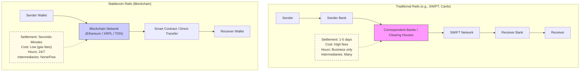

# Stablecoins: The Next Era of Payment Rails

## A Simple Whitepaper for Developers and Architects


### Executive Summary
Stablecoins are becoming the new infrastructure for global payments. They offer fast, 24/7, low-cost transfers compared to traditional systems. This whitepaper summarizes key insights from a recent industry panel with experts from Mastercard, Ripple, and TON Foundation. It includes verified data, technical comparisons, and practical guidance for developers and architects building payment systems.

Stablecoins settle instantly on blockchains, enable programmable money, and integrate with traditional finance (TradFi). Industry settlement volumes are growing rapidly, with real-world enterprise adoption underway.

### Current Landscape
- **Stablecoin Growth (Verified January 2026):**
  - Total stablecoin transactions reached ~$33 trillion in 2025.
  - Monthly on-chain transfer volumes are in the hundreds of billions USD.
  - Industry estimates for payment-related settlements: ~$100B+ per month.
  - Top stablecoins: USDT, USDC, RLUSD (~$1.4B market cap).

- **Key Players Highlighted:**
  - **Mastercard:** Partnerships with Circle (USDC), PayPal (PYUSD), Ripple (RLUSD), and providers like Thunes/Fiserv for stablecoin wallet payouts.
  - **Ripple (RLUSD):** Issued on XRP Ledger (XRPL) and Ethereum. Expanding to Layer-2 chains (Base, Optimism) via Wormhole. Regulatory approvals in ADGM/DIFC.
  - **TON Foundation:** USDT integration in Telegram wallets. Strong retail P2P and B2B use due to simple UX.

### Traditional vs. Stablecoin Payment Rails



**Key Advantages of Stablecoin Rails:**
- Instant settlement (seconds to minutes).
- Lower costs (50-90% cheaper for cross-border).
- Always-on (24/7/365).
- Programmable (automated escrow, conditional payments).
- Global reach without borders.

**Disadvantages / Challenges:**
- Regulatory uncertainty in some regions.
- Interoperability between chains (solved by bridges like Wormhole).
- Potential de-pegging risk (rare for major USD-backed coins).
- Need for AML/screening tools to block illicit flows.

### Technical Considerations for Developers & Architects
When building payment systems:

1. **Choose the Chain:**
   - **Ethereum/Layer-2:** High liquidity, DeFi integration (USDC, RLUSD). Use ERC-20 standard.
   - **XRPL:** Fast (3-5s), very low fees. Native RLUSD support.
   - **TON:** Best for consumer apps (Telegram mini-wallets). High retail volume.

2. **Integration Points:**
   - Use issuer APIs: Circle (USDC mint/burn), Ripple Payments (enterprise flows).
   - Wallets: MetaMask, Telegram Wallet, or self-custodial.
   - Cross-chain: Wormhole or LayerZero for moving assets between chains.
   - Compliance: Integrate chain analysis tools (e.g., Elliptic) for screening.

3. **Simple Architecture Pattern**
   ```mermaid
   graph LR
       A[Frontend App / Wallet] --> B[Backend Service]
       B --> C["Blockchain Node / RPC Provider\n(Infura, QuickNode, etc.)"]
       C --> D["Smart Contract\n(Transfer / Payment Channel)"]
       D --> E[On-Chain Settlement]
       B --> F["Off-Ramp Provider\n(for Fiat Conversion)"]
   ```

4. **Best Practices:**
   - Start with testnets (Ethereum Sepolia, XRPL Testnet).
   - Handle gas/fees intelligently (batch transactions).
   - Add KYC/AML layers for regulated use.
   - Monitor liquidity pools for best execution.

### Use Cases for Enterprises
- 24/7 treasury operations and payouts.
- Cross-border B2B payments (faster funding cycles).
- Retail P2P (Telegram/TON model).
- Crypto card spending (growing to $18B annualized).

### Future Outlook
- Clearer global regulation will accelerate adoption.
- Tokenization of real-world assets will merge with stablecoin rails.
- Banks will adopt blockchain standards via consortia.
- Liquidity will continue to attract more volume → better pricing.

Stablecoins are not replacing traditional rails overnight—they are complementing and upgrading them.

### References
1. Video Panel: [YouTube - The Next Era of Payment Rails](https://www.youtube.com/watch?v=EiJq_2M-4iE)
2. RLUSD Details: Ripple Official Site & CoinGecko (Market cap ~$1.4B, chains: XRPL + Ethereum)
3. Stablecoin Volumes: Economic Times (2025 total $33T), VanEck Reports
4. Mastercard Partnerships: Mastercard Newsroom (2025 announcements)
5. Advantages/Disadvantages: Stripe, McKinsey, Gemini Research

