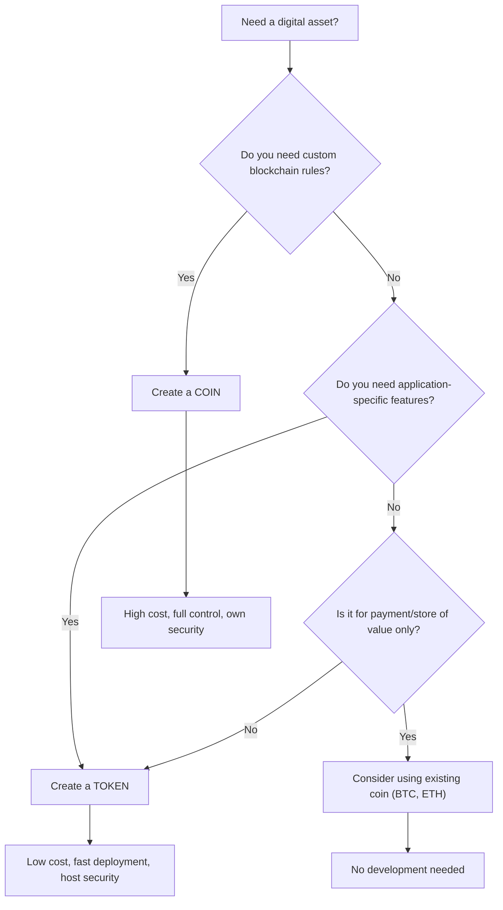
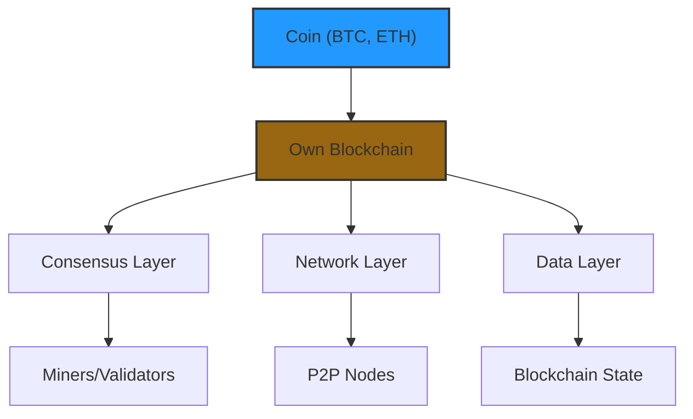
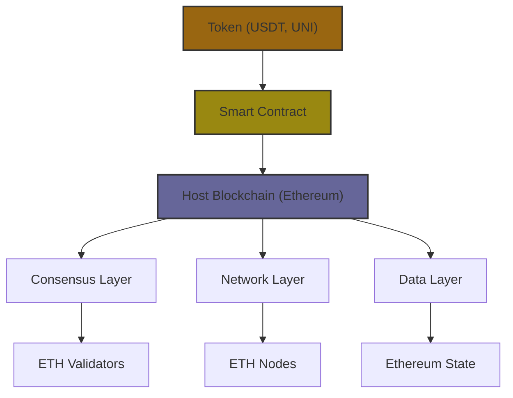

# Cryptocurrency Coins vs Tokens: A Developer & Architect Guide

## What Are Coins and Tokens?

Both coins and tokens are digital assets on blockchains, but they work differently.

**Coin**: A native digital currency of its own blockchain. It powers the network, pays fees, and secures transactions.

**Token**: A digital asset built on top of an existing blockchain using smart contracts. It represents specific uses like voting rights, access to services, or assets.

## Quick Comparison

| Feature | Coin | Token |
|---------|------|-------|
| **Blockchain** | Owns its blockchain | Uses existing blockchain |
| **Creation** | Build entire blockchain | Deploy smart contract |
| **Complexity** | High (need consensus, nodes) | Low (use standards like ERC-20) |
| **Purpose** | Money, fees, network security | Utility, governance, assets |
| **Security** | Own consensus (PoW/PoS) | Relies on host blockchain |
| **Examples** | BTC, ETH, SOL, ADA | USDT, UNI, SHIB, BAT |
| **Transaction Fees** | Paid in same coin | Need host coin (e.g., ETH for gas) |

## Understanding Coins

### What Makes a Coin

A coin is the **native asset** of a Layer 1 blockchain. It is essential for the network to function.

**Key characteristics:**
- Runs on its own independent blockchain
- Used to pay transaction fees
- Rewards miners or validators for securing network
- Acts as money: store of value and medium of exchange
- Only ONE native coin per blockchain

### How Coins Are Created

Coins are generated through blockchain consensus:

**Proof of Work (PoW)**:
- Miners solve complex math problems
- First to solve gets rewarded with new coins
- Example: Bitcoin mining

**Proof of Stake (PoS)**:
- Validators lock up (stake) existing coins
- Selected to validate blocks based on stake size
- Receive rewards for validation
- Example: Ethereum 2.0, Cardano

### Common Coins and Their Purpose

| Coin | Blockchain | Main Purpose |
|------|-----------|--------------|
| Bitcoin (BTC) | Bitcoin | Digital money, store of value |
| Ether (ETH) | Ethereum | Gas for smart contracts, DeFi |
| BNB | BNB Chain | Exchange operations, fees |
| Cardano (ADA) | Cardano | Smart contracts, staking |
| Solana (SOL) | Solana | Fast transactions, DeFi |
| XRP | Ripple | Cross-border payments |

### When to Create a Coin

Build a coin when you need:
- Complete control over consensus rules
- Custom blockchain features
- Independent network security
- New economic model

**Warning**: Creating a coin requires:
- Building blockchain from scratch or forking existing code
- Setting up node infrastructure
- Implementing consensus mechanism
- Ongoing maintenance and security audits
- Large development team and budget

## Understanding Tokens

### What Makes a Token

A token is built **on top** of an existing blockchain. It uses that blockchain's infrastructure and security.

**Key characteristics:**
- No own blockchain
- Created via smart contracts
- Multiple tokens can exist on same blockchain
- Easier and faster to create than coins
- Inherit security from host blockchain

### Token Types

**1. Utility Tokens**
- Provide access to services or features
- Examples: BAT (Brave browser rewards), FIL (Filecoin storage)

**2. Governance Tokens**
- Give voting rights in protocol decisions
- Examples: UNI (Uniswap), AAVE (Aave protocol)

**3. Security Tokens**
- Represent ownership in assets (stocks, real estate)
- Subject to securities regulations

**4. Stablecoins**
- Pegged to fiat currency (usually $1 USD)
- Examples: USDT, USDC, DAI

**5. NFTs (Non-Fungible Tokens)**
- Unique tokens representing digital assets
- Use ERC-721 or ERC-1155 standards

**6. Liquidity Tokens**
- Represent share in DeFi liquidity pools
- Examples: Uniswap LP tokens

### Token Standards

Different blockchains have token standards:

**Ethereum Standards:**
- **ERC-20**: Fungible tokens (interchangeable, like money)
- **ERC-721**: Non-fungible tokens (unique items)
- **ERC-1155**: Multi-token standard (fungible + non-fungible)
- **ERC-777**: Advanced ERC-20 with hooks

**Other Platforms:**
- **BEP-20**: Binance Smart Chain (similar to ERC-20)
- **SPL**: Solana token standard
- **TRC-20**: Tron blockchain tokens

### When to Create a Token

Create a token when you need:
- Project-specific utility
- Governance mechanism
- Represent assets or rights
- Quick deployment
- Lower development costs

## How to Create a Coin

Creating a coin is complex. Here's the process:

### Step 1: Design Blockchain Architecture

```
1. Choose consensus mechanism:
   - Proof of Work (PoW)
   - Proof of Stake (PoS)
   - Delegated Proof of Stake (DPoS)
   - Other variants

2. Define parameters:
   - Block time (e.g., 10 min for Bitcoin)
   - Block size
   - Total supply (fixed or inflationary)
   - Initial distribution
```

### Step 2: Develop or Fork

**Option A: Build from Scratch**
- Write blockchain protocol code
- Implement consensus algorithm
- Create peer-to-peer network layer
- Build wallet and node software

**Option B: Fork Existing Blockchain**
- Copy open-source blockchain code (e.g., Bitcoin, Ethereum)
- Modify parameters and features
- Examples: Litecoin forked Bitcoin, BNB Chain forked Ethereum

### Step 3: Deploy Network

```
1. Set up genesis block (first block)
2. Launch mainnet
3. Distribute initial coins
4. Recruit validators/miners
5. Ensure decentralization
```

### Step 4: Maintain and Secure

- Regular security audits
- Protocol upgrades
- Community governance
- Infrastructure support

**Cost**: High (hundreds of thousands to millions)
**Time**: Months to years
**Team**: Large (10+ experienced developers)

## How to Create a Token

Creating tokens is much easier. Most popular: Ethereum ERC-20.

### ERC-20 Token Standard

ERC-20 defines six mandatory functions:

```solidity
// Get total token supply
function totalSupply() public view returns (uint256)

// Get balance of an address
function balanceOf(address _owner) public view returns (uint256 balance)

// Transfer tokens to another address
function transfer(address _to, uint256 _value) public returns (bool success)

// Transfer tokens on behalf of another address
function transferFrom(address _from, address _to, uint256 _value) public returns (bool success)

// Approve another address to spend tokens
function approve(address _spender, uint256 _value) public returns (bool success)

// Check approved amount for spender
function allowance(address _owner, address _spender) public view returns (uint256 remaining)
```

Optional but recommended:
```solidity
string public name = "Token Name";
string public symbol = "TKN";
uint8 public decimals = 18;  // Standard is 18
```

### Step-by-Step Token Creation

**Step 1: Write Smart Contract**

Simple ERC-20 example using OpenZeppelin:

```solidity
// SPDX-License-Identifier: MIT
pragma solidity ^0.8.20;

import "@openzeppelin/contracts/token/ERC20/ERC20.sol";

contract MyToken is ERC20 {
    constructor(uint256 initialSupply) ERC20("My Token", "MTK") {
        _mint(msg.sender, initialSupply * 10 ** decimals());
    }
}
```

**Step 2: Test Contract**

Use tools like:
- Remix IDE (browser-based)
- Hardhat (local development)
- Truffle (testing framework)

**Step 3: Deploy to Blockchain**

```javascript
// Using Hardhat deployment script
async function main() {
  const MyToken = await ethers.getContractFactory("MyToken");
  const token = await MyToken.deploy(1000000); // 1 million tokens
  await token.deployed();
  console.log("Token deployed to:", token.address);
}
```

**Step 4: Verify and Publish**

- Verify contract on Etherscan
- Add token to wallets
- List on exchanges if needed

**Cost**: Low (gas fees only: $50-$500 depending on network)
**Time**: Hours to days
**Team**: 1-2 developers

### Token Deployment Tools

**No-Code Platforms:**
- OpenZeppelin Wizard
- Token Mint
- CoinTool

**Developer Tools:**
- Remix IDE (Ethereum)
- Hardhat
- Truffle Suite
- Web3.js / Ethers.js

## Technical Deep Dive: ERC-20

### Understanding Decimals

Solidity doesn't support decimals. Solution: use integers.

```
If decimals = 18:
1 token = 1 * (10 ** 18) = 1000000000000000000

To send 1.5 tokens:
transfer(1.5 * 10^18 = 1500000000000000000)
```

Standard is 18 decimals (like Ether).

### Events in ERC-20

Tokens emit events for tracking:

```solidity
event Transfer(address indexed from, address indexed to, uint256 value);
event Approval(address indexed owner, address indexed spender, uint256 value);
```

These events are logged on blockchain for wallets and explorers.

### Security Considerations

**For Coins:**
- 51% attack risk (if low hash rate)
- Consensus vulnerabilities
- Network attacks
- Smart contract bugs (if programmable)

**For Tokens:**
- Smart contract vulnerabilities
- Reentrancy attacks
- Integer overflow/underflow
- Approval issues

**Best Practice**: Use audited libraries like OpenZeppelin.

## Use Cases

### Coin Use Cases

1. **Digital Currency**: Bitcoin as peer-to-peer money
2. **Smart Contract Platform**: Ethereum for DeFi
3. **Payment Networks**: XRP for bank transfers
4. **Store of Value**: Bitcoin as "digital gold"
5. **Network Security**: Staking coins to validate

### Token Use Cases

1. **DeFi Protocols**: 
   - AAVE for lending
   - UNI for DEX governance
   - COMP for borrowing

2. **Stablecoins**:
   - USDT, USDC for stable payments
   - DAI for decentralized stability

3. **Gaming**:
   - AXS for Axie Infinity
   - SAND for Metaverse land
   - ENJ for gaming items

4. **Governance**:
   - MKR for MakerDAO decisions
   - UNI for Uniswap proposals

5. **Real-World Assets**:
   - Real estate tokens
   - Gold-backed tokens
   - Security tokens

## Decision Framework

Use this to decide between coin and token:



### Decision Matrix

Ask these questions:

| Question | Coin | Token |
|----------|------|-------|
| Need custom consensus? | ✅ | ❌ |
| Budget under $100k? | ❌ | ✅ |
| Launch in 1-2 months? | ❌ | ✅ |
| Need full control? | ✅ | ❌ |
| Building DApp/service? | ❌ | ✅ |
| Want to use existing infrastructure? | ❌ | ✅ |
| Have large dev team? | ✅ | Optional |
| Need interoperability? | ❌ | ✅ |

## Architecture Comparison

### Coin Architecture



### Token Architecture



## Cost Analysis

### Coin Development Costs

**Initial Development:**
- Core developers: $500k - $2M
- Security audits: $50k - $200k
- Infrastructure: $50k - $200k
- Legal compliance: $50k - $500k

**Ongoing Costs:**
- Node maintenance: $10k - $50k/month
- Development updates: $100k - $500k/year
- Community management: $50k - $200k/year

**Total Year 1**: $1M - $5M+

### Token Development Costs

**Initial Development:**
- Smart contract development: $5k - $50k
- Audit: $5k - $30k
- Deployment gas fees: $100 - $5000
- Legal: $10k - $100k

**Ongoing Costs:**
- Minimal (host blockchain handles infrastructure)
- Updates if needed: $5k - $20k

**Total Year 1**: $20k - $200k

## Real-World Examples

### Bitcoin (Coin)
- **Blockchain**: Bitcoin
- **Consensus**: Proof of Work
- **Purpose**: Digital money, store of value
- **Supply**: 21 million (capped)
- **Block time**: 10 minutes

### Ethereum (Coin)
- **Blockchain**: Ethereum
- **Consensus**: Proof of Stake (after merge)
- **Purpose**: Smart contract platform, gas for DApps
- **Supply**: Unlimited (but deflationary)
- **Block time**: 12 seconds

### USDT (Token)
- **Type**: ERC-20 token (also on other chains)
- **Host**: Ethereum, Tron, BSC, others
- **Purpose**: Stablecoin pegged to USD
- **Supply**: Managed by Tether company
- **Use**: Trading, payments, DeFi

### Uniswap UNI (Token)
- **Type**: ERC-20 token
- **Host**: Ethereum
- **Purpose**: Governance of Uniswap DEX
- **Supply**: 1 billion tokens
- **Use**: Vote on protocol changes

## Key Takeaways for Developers

### Coins
1. ✅ Full control over network
2. ✅ Custom economic models
3. ✅ Independent security
4. ❌ High development cost
5. ❌ Long development time
6. ❌ Complex maintenance
7. ❌ Need large team

### Tokens
1. ✅ Fast development
2. ✅ Low cost
3. ✅ Proven security (from host)
4. ✅ Easy interoperability
5. ✅ Standard tools available
6. ❌ Depend on host blockchain
7. ❌ Subject to host fees
8. ❌ Limited by host capabilities

## Best Practices

### For Coin Development
- Start with a fork if possible
- Conduct thorough security audits
- Build strong community first
- Plan for long-term maintenance
- Consider regulatory compliance
- Have clear differentiation from existing coins

### For Token Development
- Use audited libraries (OpenZeppelin)
- Test extensively on testnets
- Follow token standards (ERC-20, etc.)
- Plan tokenomics carefully
- Consider gas optimization
- Verify contract on explorers
- Plan for multi-chain if needed

## Common Mistakes to Avoid

### Coin Mistakes
1. Underestimating development costs
2. Poor consensus design
3. Inadequate security
4. No clear use case
5. Ignoring regulatory requirements

### Token Mistakes
1. Not auditing smart contracts
2. Poor tokenomics design
3. Ignoring gas costs
4. Security vulnerabilities in code
5. Not following standards properly
6. Over-complicated token logic

## Regulatory Considerations

### Coins
- May be considered commodities (like Bitcoin)
- Subject to money transmission laws
- Exchange regulations apply
- Mining may have energy regulations

### Tokens
- May be securities if they represent investment
- Utility tokens have different rules
- Stablecoins face strict regulations
- ICOs heavily regulated in most countries

**Important**: Consult legal experts before launching.

## Resources for Learning

### Development Tools
- **Remix IDE**: Browser-based Solidity editor
- **Hardhat**: Ethereum development environment
- **OpenZeppelin**: Secure smart contract libraries
- **Etherscan**: Blockchain explorer and verifier

### Educational Resources
- Ethereum.org: Official Ethereum documentation
- OpenZeppelin Docs: Token development guides
- CryptoZombies: Interactive Solidity tutorial
- Buildspace: Web3 development courses

### Testing Networks
- Ethereum Sepolia: Ethereum testnet
- Polygon Mumbai: Polygon testnet
- BSC Testnet: Binance Smart Chain testnet

## Conclusion

**Choose a Coin when:**
- You need a new blockchain with custom rules
- You have significant resources (time, money, team)
- Your use case requires full control
- You're building infrastructure, not applications

**Choose a Token when:**
- You're building on existing blockchain infrastructure
- You need fast deployment and lower costs
- Your use case is application or service-specific
- You want to leverage existing security and tooling

Most projects today choose tokens because they're faster, cheaper, and leverage proven infrastructure. Only build a coin if you truly need custom blockchain rules that can't be achieved with existing chains.

Remember: Both coins and tokens work together. Coins provide the foundation, tokens enable innovation. Ethereum (coin) enables USDT, UNI, and thousands of other tokens to exist and thrive.

**Related:**- [Quantum-Threat-to-Bitcoin](../../QuantumComputing/Quantum-Threat-to-Bitcoin.md) — BTC is cited as the canonical PoW coin and is directly exposed to Shor's algorithm breaking its ECDSA signatures.- [GraphDB-massive-scale-analysis](../../Engineering/Databases/GraphDB-massive-scale-analysis.md) — Token ledgers and account-state trees are append-only databases whose query and indexing concerns mirror graph-scale engineering.- [AI-and-the-Barbell-Economy](../../AI-ML/LLMs/economy/AI-and-the-Barbell-Economy.md) — Token-vs-coin primitives shape the barbell of programmable money and AI-driven on-chain agents.
