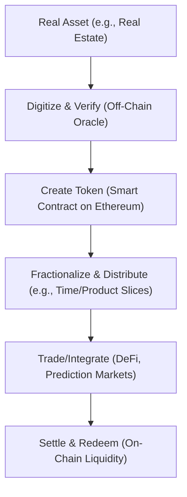
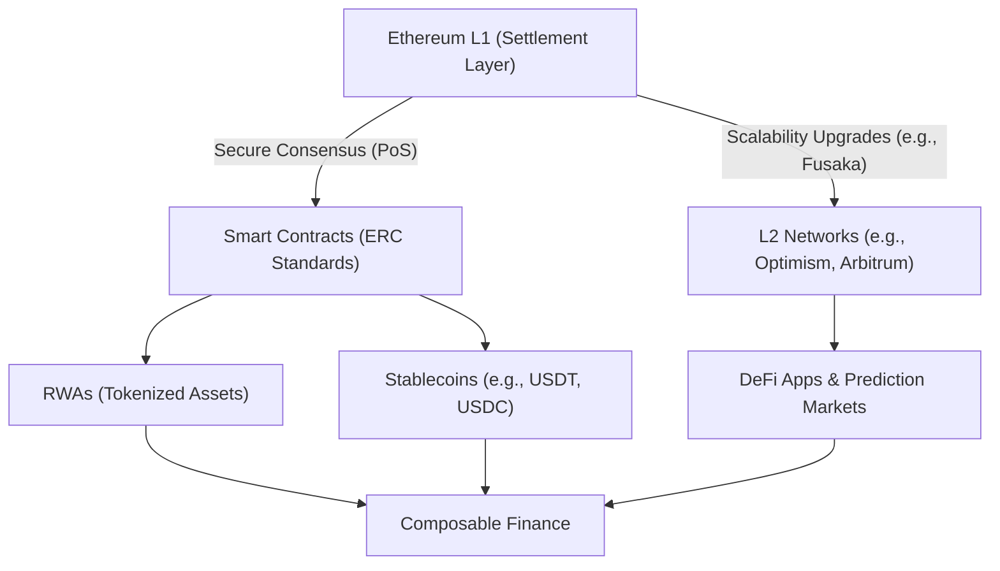
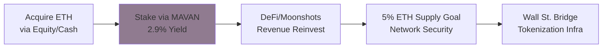
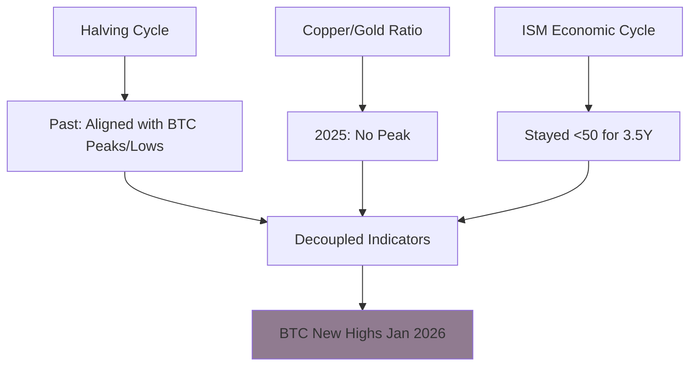

# The Crypto Supercycle and Ethereum's Leadership in Tokenization

## Abstract
This whitepaper explores the ongoing crypto supercycle, focusing on tokenization as a transformative force in 2025-2026. Based on insights from Tom Lee's keynote at Binance Blockchain Week 2025, we examine Ethereum's role as the primary settlement layer for real-world assets (RWAs) and stablecoins. For developers and architects, it highlights technical opportunities in smart contracts, scalability, and DeFi integration. Data is verified from multiple sources, including market analyses and institutional trends, with comparisons to skeptical views. 

## Introduction
The crypto market is shifting from cyclical booms to a "supercycle"—a prolonged growth phase driven by institutional adoption, regulatory clarity, and real-world utility. Tom Lee, a Wall Street analyst, argues this supercycle remains intact despite 2025 volatility. Key drivers include tokenization of assets worth quadrillions and Ethereum's infrastructure dominance. This document simplifies these concepts for blockchain developers and architects, emphasizing buildable systems like smart contracts for RWAs.

Sources include Lee's presentation, market reports from BlackRock and Grayscale, and analyses from CZ (Binance founder) and Raoul Pal. We verify predictions against data: RWAs hit $30B in 2025, with Ethereum holding 65% share.

## The Crypto Supercycle: Alive and Evolving
A supercycle extends beyond Bitcoin's traditional 4-year halving cycles, fueled by macro factors like rate cuts, quantitative easing, and fiscal stimulus. Lee predicts Bitcoin at $250K-$300K and Ethereum at $12K-$62K by 2026, based on ETH/BTC ratios and adoption.

### Verification and Trends
- **Bullish Views**: CZ forecasts a 2026 supercycle from U.S. policies and ETFs. Pal sees liquidity surges breaking old cycles, with Bitcoin as a fiat hedge.
- **Data Points**: Crypto market cap at $3.27T in early 2026. Institutional inflows via ETFs exceed $115B in 2025. Adoption runway: Only 4.4M Bitcoin wallets hold >$10K, vs. 900M global retirement accounts (200x potential).
- **Comparisons**: Skeptics note risks like regulatory overreach or no liquidity boom, but on-chain data shows falling exchange reserves (long-term holding). 67% of fund managers have zero crypto allocation—room for growth.
- **Opposing Views**: Some analysts warn of a 2026 bear market if Fed easing stalls, but most sources (e.g., AMBCrypto, CryptoQuant) see institutional demand overriding this.

This isn't hype: Structural changes like stablecoin growth (57-62% on Ethereum) support sustained expansion.

## Tokenization: Revolutionizing Assets
Tokenization converts real-world assets (e.g., real estate, stocks, bonds) into blockchain tokens, enabling fractional ownership, liquidity, and automation via smart contracts.

### What is Tokenization?
- **Basic**: Digitize assets for on-chain trading.
- **Advanced (Tokenization 2.0)**: Slice by time (e.g., Tesla's 2026 earnings), product (e.g., EV revenue), geography, or factors. Integrate with prediction markets like Polymarket.
- **Scale**: Larry Fink (BlackRock) calls it the biggest finance innovation since bookkeeping. Market potential: Quadrillion-dollar assets, vs. current $30B RWAs.

### 2025-2026 Trends
- **Growth**: RWAs surged to $30B in 2025; expect acceleration in 2026 via industries like real estate, stablecoins, and AI-linked assets.
- **Institutional Push**: Banks (JPMorgan, Wells Fargo) tokenize via Ethereum. Stablecoins unlock payments; DeFi apps grow with regulatory tailwinds (e.g., EU MiCA, U.S. GENIUS Act).
- **Comparisons**: Provenance Blockchain leads in value ($12B), but Ethereum dominates programmability (65% share). Trends shift to permissioned chains for compliance, but public Ethereum wins for composability.
- **Challenges**: Scalability needs; fees may rise without upgrades.

For devs: Build ERC-20/721 tokens for RWAs, focusing on compliance (e.g., KYC in smart contracts).

## Ethereum: The Core Settlement Layer
Ethereum is the default for RWAs and stablecoins due to its security, upgrades, and ecosystem.

### Why Ethereum?
- **Dominance**: Hosts $12.5B in RWAs (65% market). Used by BlackRock, JPMorgan for tokenization.
- **Features**: Proof-of-Stake (PoS) for efficiency; upgrades like Fusaka boost scalability. L2s (e.g., Optimism) handle volume for verifiable settlement.
- **Stablecoins & RWAs**: 57-62% of stablecoins settle here. Enables composable finance (e.g., tokenized cash in DeFi).
- **Verification**: BlackRock reports Ethereum as the 2026 standard. Grayscale notes DeFi momentum from RWAs.
- **Comparisons**: Solana faster for retail, but Ethereum's maturity suits institutions. Risks: High fees if activity spikes; mitigated by L2s.

For architects: Design layered systems—L1 for settlement, L2 for apps.

## Digital Asset Treasuries: BitMine Case Study
BitMine Immersion Technologies (BMNR) exemplifies treasuries: Holds ~1.71M ETH ($7.5B), stakes for 2.9% yield (~$400M/year). Pivoted from Bitcoin mining; uses immersion cooling for efficiency.

- **Model**: Bridge TradFi-DeFi via validators (e.g., Maven network). Outperforms crypto via liquidity and macro strategies.
- **Trends**: Like MicroStrategy (Bitcoin), but Ethereum-focused. Roadmap: DeFi investments, U.S. validators.
- **Implications**: Devs can build staking tools; architects design hybrid systems for yield generation.

Comparisons: Treasuries may beat pure crypto (Lee's view), but volatility risks persist.

## Bitmine Treasury Model

Bitmine (NYSE: BMNR), largest ETH holder (~4.11M ETH, $13.2B total assets Jan 2026), stakes via MAVAN ("Made in America Validator Network") launching Q1 2026. Generates ~$374M annual staking yield at scale (2.81% CESR), $1M+/day; clean balance sheet, no debt.[9][10][1]

- Strategy: Accumulate 5% ETH supply; moonshots (e.g., Akash "Whirlcoin"); DeFi investments; Wall Street bridge.[7][1]
- Trading: 39th most-traded US stock, >GE volume despite 1/30th cap; 92% crypto treasury volume with MSTR.[1]
- Roadmap: Maven staking full rollout, Bitmine Labs, validator network targeting 5% ETH.[11][1]

BMNR at ~$30/share (Jan 2026), up 1.8K% yearly; earnings Jan 14. Outperforms ETH via yield + liquidity.[12][13][10]

# Crypto Supercycle : Ethereum and Tokenization

Tom Lee's keynote at Binance Blockchain Week 2025 outlines a persistent crypto supercycle driven by tokenization, with Ethereum as the core settlement layer. Prices have bottomed post-deleveraging, breaking the traditional four-year cycle, while Bitmine exemplifies digital asset treasuries outperforming raw crypto.[1][2][3][4]

## Supercycle Drivers

Tokenization defines 2025-2026, evolving from stablecoins—Ethereum's "ChatGPT moment"—to trillions in real-world assets (RWAs). RWAs grew 229% to $18.1B in 2025 (excluding stablecoins), with Ethereum hosting over $4.9B in tokenized U.S. Treasurys; total on-chain RWAs hit $36B by early 2026.[5][6][1]

- US policy shifts: Pro-crypto stance, state Bitcoin reserves, BlackRock IBIT as top fee generator.[1]
- Institutional rails: JPM Coin on Ethereum, Polymarket prediction markets, Tether as top-10 profitable "bank".[7][1]
- Adoption runway: 4.4M BTC wallets >$10K vs. 900M global retirement accounts; 67% fund managers at 0% BTC allocation.[1]

Gold up 61% YTD 2025 while BTC/ETH negative signals mispricing, not winter.[2][1]

## Cycle Break Analysis

Bitcoin's four-year halving cycle aligned with copper/gold ratios and ISM historically but decoupled in 2025—copper/gold peaked early, ISM below 50 for 3.5 years. Tom Lee predicts BTC to $250K soon, confirming supercycle; ETH/BTC ratio breakout targets $12K-$62K ETH at BTC $250K.[3][8][1]

Bitmine consulted Tom DeMark, halving ETH buys from 100K to 50K/week post-Oct 2025 liquidation, resuming aggressively as bottom confirmed.[4][1]

## Ethereum's Central Role

Ethereum powers RWAs, stablecoins, and Wall Street infrastructure via upgrades like Fusaka; Eric Voorhees declared it winner of smart contract wars. Institutions build on ETH: 90%+ RWA share, enabling smart contracts for tokenized assets/DeFi.[7][5][1]

Tom Lee's paths (ETH/BTC ratio):
| Scenario | ETH/BTC Ratio | ETH Price (BTC@250K) |
|----------|---------------|----------------------|
| 8-Year Avg | ~0.05 | $12,000 [1][8] |
| 2021 High | ~0.09 | $22,000 [1] |
| Future Finance (0.25) | 0.25 | $62,000 [1] |

ETH rangebound 5 years but breaking out; undervalued at $3K.[1]

## Tokenization Unlocks

Beyond fractionalization, Tokenization 2.0 factorizes cash flows: time-sliced (e.g., Tesla 2036 earnings NPV), product-based (EVs vs. Optimus), geographic, or factorized. Pairs with prediction markets for granular pricing, solving stock values better (Tesla = sum of tokenized earnings streams).[1]

Larry Fink: Biggest invention since double-entry bookkeeping. Potential: Quadrillion-dollar financial products on-chain.[1]

## Implications for Developers and Architects

Developers/architects: Build on Ethereum for RWA tokenization using ERC-20/721 standards, integrate prediction markets (e.g., Polymarket APIs), stake via MAVAN for secure validators. Monitor ETH/BTC ratio for utility growth; target DeFi protocols for Bitmine partnerships. Verify via RWA.xyz for chain dominance.[5][11][7]

- **Developers**: Focus on smart contracts for tokenization (e.g., time-based tokens). Use libraries like OpenZeppelin for security. Integrate oracles for off-chain data.
- **Architects**: Build scalable apps on L2s, ensuring interoperability. Prioritize compliance for RWAs. Opportunities in DeFi-traditional bridges.
- **Risks**: Verify code for audits; monitor macro shifts.

## Conclusion
The supercycle is driven by tokenization and Ethereum's infrastructure, verified by institutional data and trends. While skeptics exist, evidence points to growth. Developers and architects: This is your era to build the tokenized future—secure, scalable, and integrated.

[1](https://www.youtube.com/watch?v=PtCcS9c-GP4)
[2](https://news.bitcoin.com/fundstrats-tom-lee-sees-bitcoin-breaking-the-4-year-cycle-doubles-down-on-250k-target/)
[3](https://finance.yahoo.com/news/tom-lee-dusts-off-failed-130110540.html)
[4](https://finance.yahoo.com/news/tom-lees-bitmine-doubles-down-084315649.html)
[5](https://en.coinotag.com/coinshares-predicts-ethereum-led-tokenized-rwas-to-grow-into-2026-on-us-treasury-demand)
[6](https://www.linkedin.com/posts/elise-baratte_state-of-rwa-tokenization-2026pdf-activity-7415289207780458496-c1yU)
[7](https://www.stocktitan.net/news/BMNR/bit-mine-immersion-technologies-closes-250-million-private-placement-k8r3y8r4q74v.html)
[8](https://www.binance.com/en-IN/square/post/34101740026538)
[9](https://www.tradingview.com/news/cointelegraph:d2a710f00094b:0-ethereum-treasury-company-bitmine-crosses-1-million-staked-eth-milestone/)
[10](https://www.prnewswire.com/in/news-releases/bitmine-immersion-technologies-bmnr-announces-eth-holdings-reach-4-168-million-tokens-and-total-crypto-and-total-cash-holdings-of-14-0-billion-302658230.html)
[11](https://cryptorobotics.ai/news/news-report/bitmine-mavan-ethereum-staking-network/)
[12](https://meyka.com/blog/earnings-due-jan-14-bmnr-bitmine-immersion-amex-pre-market-focus-on-revenue-1201/)
[13](https://in.tradingview.com/symbols/AMEX-BMNR/)
[14](https://www.markets.com/news/crypto-supercycle-tom-lee-predictions-3279-en)
[15](https://investinglive.com/Cryptocurrency/fundstrats-tom-lee-says-bitcoin-new-highs-soon-sees-sp-500-to-7700-by-end-2026-too-20260105/)
[16](https://blockzeit.com/bitmine-proposes-raising-shares-to-double-down-on-ethereum/)
[17](https://www.investing.com/news/cryptocurrency-news/stanchart-says-2026-will-be-the-year-of-ethereum-sets-new-2030-price-target-4441812)
[18](https://finance.yahoo.com/quote/BMNR/)
[19](https://in.investing.com/equities/bitmine-immersion-tech)

**Related:**
- [Jan-2025-Updates](../reference/Jan-2025-Updates.md) — Anchors the supercycle claims against the January 2026 BNY tokenized deposits and CLARITY Act milestones.
- [Blockchain-by-2035](../reference/Blockchain-by-2035.md) — Extends the 2025-2026 supercycle into the 2035 bank-free, fully tokenized economy forecast.
- [BlockchainLayers](../reference/BlockchainLayers.md) — Explains why Ethereum's L1 settlement plus L2 rollups make it the default RWA programmability layer.
