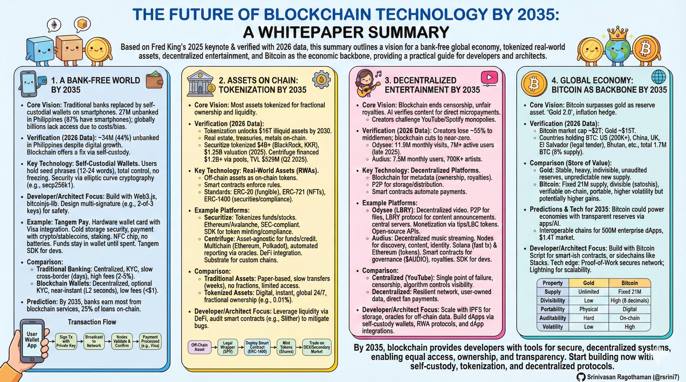
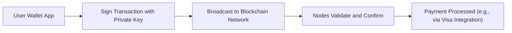
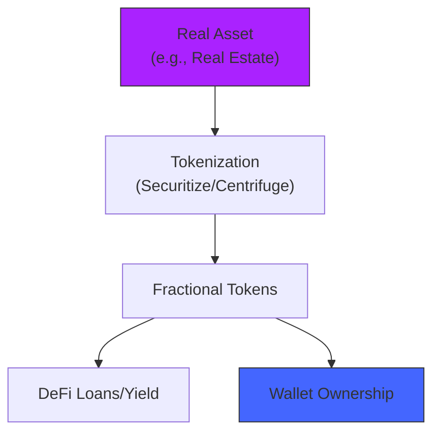
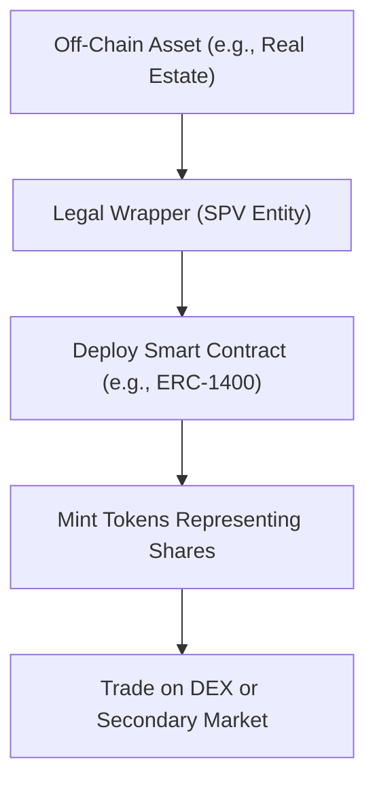

# The Future of Blockchain Technology by 2035: A Whitepaper for Developers and Architects

## Introduction

This whitepaper is based on **Fred King’s keynote at Philippine Blockchain Week 2025**, where he presented a forward-looking vision of a **bank-free global economy**, **tokenized real-world assets (RWAs)**, **decentralized entertainment ecosystems**, and **Bitcoin as the economic backbone by 2035**.

Building on that vision, this paper goes further by **verifying the claims using 2026 data**, **comparing underlying technologies**, and **diving into technical architecture and design considerations** relevant for **developers, architects, and builders**. The objective is not speculation, but to provide a **practical, simplified guide** for designing and building systems aligned with this emerging blockchain-native world.

The keynote’s predictions are grounded in real-world progress, supported by active platforms such as **Tangem Pay**, **Securitize**, **Centrifuge**, **Odysee**, and **Audius**, whose recent developments validate the feasibility of self-custody, asset tokenization, and decentralized content distribution. Together, these systems reflect a broader shift toward **user ownership, transparency, and permissionless access** enabled by blockchain infrastructure.

### Core Vision

By **2035**, blockchain is expected to enable:

* Equal access to financial services without traditional banks
* Tokenized ownership of real-world assets
* Decentralized creation and distribution of digital content
* Transparent, programmable, and globally interoperable economies

Market data supports this trajectory. The global blockchain market is projected to grow from **$15 billion in 2024 to $776 billion by 2035**, representing a **43% compound annual growth rate (CAGR)**. This growth is driven primarily by **DeFi**, **asset tokenization**, and **cross-chain interoperability**, signaling a structural transformation rather than a short-term trend.

All concepts in this paper are intentionally explained in **simple, clear language**, while preserving the **technical depth** needed for real-world system design and implementation.

## 1. A Bank-Free World by 2035

Traditional banks will vanish, replaced by self-custodial wallets accessible via smartphones, eliminating unbanked populations (27 million adults in Philippines alone). Tangem Pay leads with a Visa card embedding a cold wallet chip for stablecoin/crypto payments, staking, and full user control—no intermediaries needed. By 2035, global adoption enables instant, bias-free financial tools worldwide.

### Background and Verification
King noted 27 million unbanked adults in the Philippines, with 87% having smartphones. Verified data from 2025 shows about 34 million (44% of adults) unbanked, despite digital growth. Globally, billions lack bank access due to paperwork, biases, and costs. Blockchain fixes this with self-custodial wallets: users control private keys, no middlemen.

### Key Technology: Self-Custodial Wallets
These are apps or hardware where you hold your seed phrase (12-24 words) to access funds. No bank can freeze accounts. Security uses elliptic curve cryptography (e.g., secp256k1). For devs: Build with libraries like Web3.js for Ethereum or bitcoinjs-lib for Bitcoin. Architects: Design multi-signature for safety (e.g., 2-of-3 keys).

### Example: Tangem Pay
Tangem Pay is a hardware wallet card integrated with Visa for payments. It's self-custodial: you control keys anonymously. Features include paying with crypto/stablecoins, staking, and cold storage security. Tech: NFC chip for contactless, no batteries. Unlike traditional cards, funds stay in your wallet until spent—no custody by Visa. Devs can integrate via Tangem SDK for custom apps.

### Comparison: Traditional Banking vs. Blockchain Wallets
- **Traditional**: Centralized servers, KYC required, slow cross-border (days), high fees (2-5%).
- **Blockchain**: Decentralized nodes, optional KYC, near-instant (seconds for layer-2), low fees (under $1).
- By 2035, predictions say banks earn most from blockchain services, with 25% of loans on-chain.

### Architecture Diagram
For a simple payment flow in a self-custodial wallet:

## 2. Assets on Chain: Tokenization by 2035

### Background and Verification
King predicted most assets tokenized by 2035 for fractional ownership and liquidity. Verified: Tokenization unlocks $16T in illiquid assets by 2030, growing to trillions more. Examples: Real estate, treasuries, metals on blockchain.

### Key Technology: Real-World Assets (RWAs)
RWAs are off-chain assets represented as on-chain tokens. Use smart contracts to enforce rules (e.g., ownership transfer). Standards: ERC-20 for fungible, ERC-721 for NFTs, ERC-1400 for securities (adds compliance like transfer restrictions).

RWAs like real estate, treasuries, and metals will tokenize, allowing fractional ownership, DeFi collateral, and yield farming. Securitize tokenized over $4B in assets for BlackRock and KKR, going public at $1.25B valuation in 2025. Centrifuge financed $1.2B+ across asset classes via pools, with TVL at $529M in Q2 2025. Market forecasts predict $16T by 2030, driven by institutions.

### Decentralized Entertainment
Blockchain ends censorship and unfair royalties; AI verifies plays/views for direct micropayments to creators. Odysee, a censorship-resistant video platform, hit 11.9M monthly visits and 7M+ active users in late 2025. Audius grew to 7.5M monthly users post-2025 acquisition, connecting 700K+ artists directly with fans. By 2035, these challenge YouTube/Spotify monopolies.

### Bitcoin Global Backbone
Bitcoin surpasses gold as reserve asset: fixed 21M supply, verifiable, divisible vs. gold's opaque vaults and infinite mining. US strategic reserve and nation-state adoption (e.g., El Salvador) accelerate shift; economies gain transparency via reserves on-chain. Despite 2025-2026 gold outperformance, Bitcoin's properties position it for 2035 dominance.

### Example Platforms
- **Securitize**: Tokenizes funds and stocks. Tech: Built on Ethereum/Avalanche, SEC-compliant. Services include fund admin and APIs for issuance. Examples: BlackRock BUIDL ($5M min, on-chain treasuries), over $4B tokenized. For devs: Use their SDK for token minting and compliance checks.
- **Centrifuge**: Asset-agnostic platform for tokenizing funds, credit. Tech: Multichain (Ethereum, Polkadot), automated reporting via oracles. Features: DeFi integration for yield, real-time data. Tokenized $1B+. Architects: Design with Substrate for custom chains.

### Comparison: Tokenized vs. Traditional Assets
- **Traditional**: Paper-based, slow transfers (weeks), no fractions, limited access.
- **Tokenized**: Digital, instant, fractional (e.g., 0.01% of a building), global 24/7.
- Pros of tokenization: Liquidity via DeFi, but risks like smart contract bugs (audit with tools like Slither).

### Tokenization Process Diagram
Simple flow for creating a tokenized asset:

## 3. Decentralized Entertainment by 2035

### Background and Verification
Centralized platforms like YouTube control 70% of content, with censorship and low royalties. King highlighted blockchain for fair pay and free speech. Verified: Creators lose 55% to middlemen; blockchain cuts this to near-zero. By 2035, AI + blockchain will detect fraud and enable micropayments.

### Key Technology: Decentralized Platforms
Use blockchain for metadata (ownership, royalties) and P2P for storage/distribution. Smart contracts automate payments (e.g., split royalties).

### Example Platforms
- **Odysee (Built on LBRY)**: Decentralized video sharing. Tech: LBRY protocol uses blockchain for content announcements (like Bitcoin ledger), P2P (BitTorrent-like) for files. No central servers—peers host data. Monetization: Tips/payments in LBC tokens. For devs: Open-source APIs, GitHub repos for building apps. 17M users.
- **Audius**: Decentralized music streaming. Architecture: Nodes for discovery (index metadata), content (store audio), identity (user data on blockchain). Blockchain: Solana for fast tx, Ethereum for tokens. Smart contracts handle governance ($AUDIO token) and royalties. Dev tools: SDK for uploading tracks, querying API. 7M listeners, 700K artists.

#### Key Projects Comparison

| Project      | Focus                  | Key Stats (2025)              | Blockchain Benefits          |
|--------------|------------------------|-------------------------------|------------------------------|
| Tangem Pay  | Self-custodial payments| Visa integration, USDC spend [5] | No KYC, stake in-wallet     |
| Securitize  | RWA tokenization      | $4B+ tokenized [6]      | Regulated, BlackRock partner|
| Centrifuge  | Asset financing       | $1.2B financed [7]      | Any asset, DeFi pools       |
| Odysee      | Decentralized video   | 11.9M visits/mo [9]     | No censorship, direct monetize |
| Audius      | Decentralized music   | 7.5M users [11]          | Fair royalties, 700K artists[1] |

Blockchain principles of freedom drive this 2035 future: equal access, ownership, and transparency. Developers/architects can build on these via self-custody wallets, RWA protocols, and dApp integrations.

### Comparison: Centralized vs. Decentralized
- **Centralized (YouTube)**: Single point of failure, censorship easy, algo controls visibility.
- **Decentralized**: Resilient network, user-owned data, direct fan payments.
- For architects: Scale with IPFS for storage, oracles for off-chain data.

## 4. Global Economy: Bitcoin as Backbone by 2035

### Background and Verification
King compared Bitcoin to "Gold 2.0" as an inflation hedge. Verified: Bitcoin market cap ~$2T (2026), gold ~$15T. Countries holding BTC: US (200K+ BTC), China, UK, El Salvador (legal tender), Bhutan, others total 1.7M BTC (8% supply).

### Gold vs. Bitcoin as Store of Value
- **Gold**: Stable but heavy, indivisible, unaudited reserves, new supply unpredictable. Market cap higher, low volatility.
- **Bitcoin**: Fixed 21M supply, divisible (satoshis), verifiable on-chain, portable. Higher volatility (50% drops possible), but 300%+ yearly gains possible. Bitcoin could surpass gold by 2035 if adoption grows.
- Tech edge: Bitcoin's proof-of-work secures network; layers like Lightning for scalability.

### Predictions and Tech for 2035
Bitcoin could power economies with transparent reserves via apps/AI. Predictions: Interoperable chains for 500M enterprise dApps, $1.4T market. For devs: Build with Bitcoin Script for smart-ish contracts, or sidechains like Stacks.

### Comparison Diagram
Simple graph of properties:

| Property | Gold | Bitcoin |
|----------|------|---------|
| Supply | Unlimited (mining) | Fixed 21M |
| Divisibility | Low | High (8 decimals) |
| Portability | Physical | Digital |
| Auditability | Hard | On-chain |
| Volatility | Low | High |

## Conclusion
By 2035, blockchain offers developers tools for secure, decentralized systems. Start with self-custodial wallets for finance, tokenization for assets, protocols like LBRY/Audius for content, and Bitcoin for value storage. Challenges: Scalability (use layer-2), regulation (compliance tools). This is early—build now for equal opportunities and freedom.

## Reference

[1](https://www.youtube.com/watch?v=PEZ_3DsNY0k)
[2](https://www.binance.com/en/square/post/23580928563481)
[3](https://trajectoryventures.vc/blockchain-innovation/ark-invest-and-blackrock-backed-tokenization-platform-securitize-to-go-public-via-spac-at-1-25-billion-valuation/)
[4](https://www.diadata.org/rwa-real-world-asset-map/centrifuge/)
[5](https://www.mexc.co/en-IN/news/155657)
[6](https://tembusupartners.com/securitize-to-go-public-at-1-25b-valuation-pioneering-the-future-of-tokenized-finance/)
[7](https://centrifuge.io/blog/centrifuge-q2-2025-recap)
[8](https://finance.yahoo.com/news/rwa-tokenization-market-reach-16t-000429613.html)
[9](https://www.semrush.com/website/odysee.com/overview/)
[10](https://www.linkedin.com/posts/arweave_odysee-is-demonstrating-what-the-decentralized-activity-7388900687755255808-3w72)
[11](https://routenote.com/blog/audius-tops-7-5-million-users-after-acquiring-soundstage-fm/)
[12](https://www.fxempire.com/forecasts/article/gold-vs-bitcoin-bearish-bitcoin-breakdown-confirms-bullish-gold-forecast-into-2026-1568108)
[13](https://www.thestreet.com/crypto/innovation/tangem-pushes-self-custody-into-payments-with-new-usdc-visa-account)
[14](https://www.banking-gateway.com/news/tangem-and-visa-partner-on-self-custodial-payment-solution-for-hardware-wallets/)
[15](https://focusonbusiness.eu/en/news/odysee-s-mau-of-5-3-million-makes-it-the-most-popular-decentralized-social-media-platform-in-2023/5576)
[16](https://www.recordoftheday.com/news-and-press/audius-surpasses-5-million-monthly-active-users)
[17](https://www.markets.com/news/tangem-pay-visa-stablecoin-payments-1739-en)
[18](https://www.similarweb.com/website/odysee.com/)

**Related:**- [Crypto-Supercycle-and-Ethereum](../ethereum/Crypto-Supercycle-and-Ethereum.md) — Treats the 2025-2026 supercycle as the leading edge of the 2035 bank-free, tokenized-economy forecast.- [AI-Blockchain-and-the-Hidden-Frictions-of-Real-World-Asset-Tokenization](../enterprise/AI-Blockchain-and-the-Hidden-Frictions-of-Real-World-Asset-Tokenization.md) — Highlights today's legal, attribution, and infrastructure frictions that any 2035 tokenized world must resolve.- [Quantum-Threat-to-Bitcoin](../../QuantumComputing/Quantum-Threat-to-Bitcoin.md) — Surfaces the post-quantum risk to Bitcoin-as-economic-backbone assumed by the 2035 vision.
