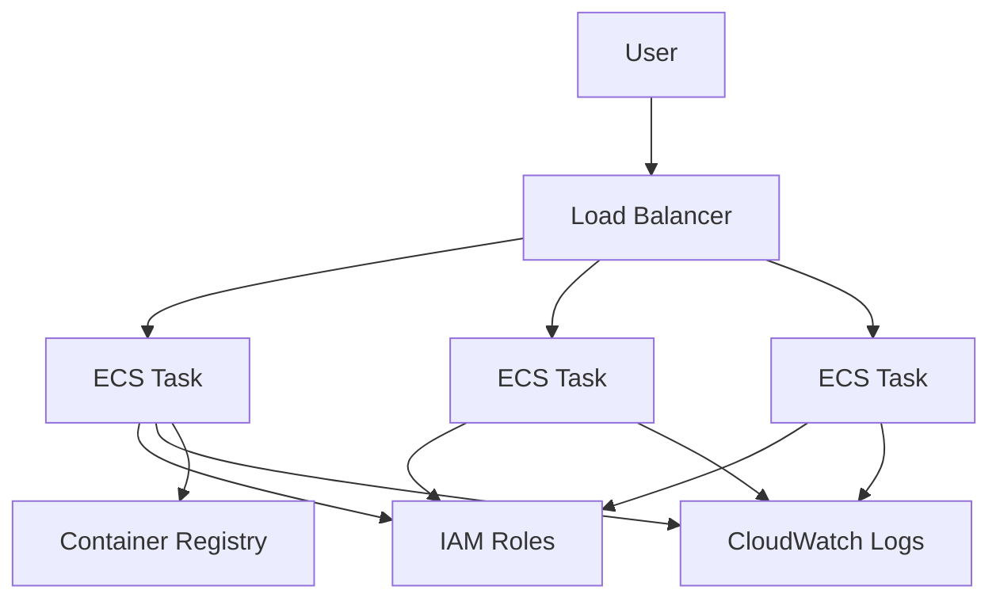
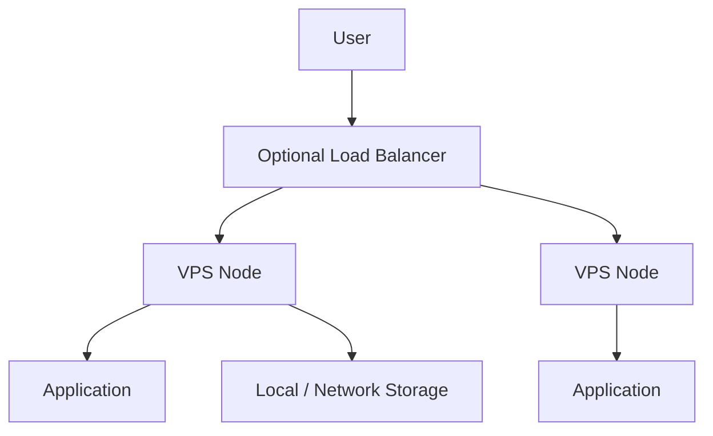
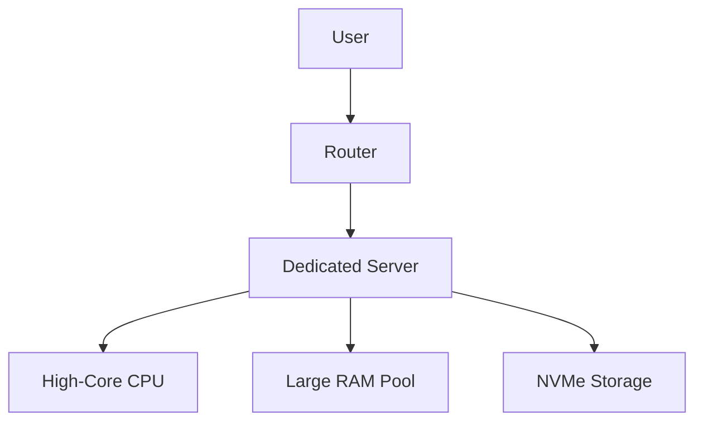

## A Comparative Analysis of AWS and VPS/Dedicated Hosting

---

## Executive Summary

This whitepaper summarizes a comparative evaluation conducted by Tom Delalande examining infrastructure performance, cost efficiency, and operational complexity across cloud-based services from Amazon Web Services (AWS EC2 and ECS Fargate) and virtual private server (VPS) infrastructure from Hetzner.

The analysis focuses on raw compute, memory, and file I/O performance using standardized benchmarks, alongside qualitative observations on pricing models, scaling strategies, and operational complexity. The results highlight clear trade-offs between abstraction and flexibility, performance density and elasticity, and cost predictability versus managed convenience.

---

## Scope and Objectives

This paper evaluates infrastructure choices with respect to:

* Raw CPU, memory, and file I/O performance
* Cost efficiency at small-to-medium scale
* Performance consistency and variance
* Operational complexity and scaling models

The evaluation does **not** assess:

* Managed service depth (databases, queues, analytics)
* Security posture beyond infrastructure controls
* Long-term operational risk or vendor lock-in

---

## Methodology

Benchmarking was performed using Sysbench.

**Test Configuration**

* 1 vCPU
* 2 GB RAM
* Identical benchmark parameters across platforms

**Metrics Evaluated**

* CPU performance (events per second)
* Memory throughput (MB/s)
* File I/O (read, write, fsync)

---

## Benchmark Results

### VPS (Hetzner)

* **CPU:** ~4,352 events/sec
* **Memory:** ~6,230 MB/s
* **File I/O:** Strong and consistent across all tests

Performance showed minimal variability across benchmark runs.

---

### AWS EC2

* **CPU:** ~895 events/sec (~20% of VPS)
* **Memory:** ~7.74% of VPS throughput
* **File I/O:** ~77% of VPS performance

Despite comparatively stronger I/O, EC2 incurred approximately **3× higher cost** than the VPS configuration.

---

### AWS ECS Fargate

* **CPU:** ~23% of VPS performance
* **Memory:** ~80% of VPS performance
* **File I/O:** ~84% of VPS performance

Observed variability:

* CPU: up to 18%
* Memory: up to 12%
* File I/O: up to 6%

Fargate improved memory and I/O performance but at **significantly higher cost**.

---

## Cost Comparison

| Platform         | Approximate Monthly Cost |
| ---------------- | ------------------------ |
| Hetzner VPS      | ~$49                     |
| AWS (Comparable) | ~$144                    |

The evaluation suggests a notable difference in performance-per-dollar for small, single-node workloads.

---

## Architectural Models

### 1. AWS ECS / EC2 Architecture (Horizontal Scaling)

**Characteristics**

* Horizontal-first scaling
* Strong abstraction and isolation
* Managed networking, IAM, and logging
* Higher per-unit cost and variability

---

### 2. VPS-Based Architecture

**Characteristics**

* Vertical and horizontal scaling
* Direct hardware access
* Lower abstraction overhead
* Manual HA and scaling logic

---

### 3. Dedicated Server Architecture

**Characteristics**

* Maximum performance density
* Predictable latency
* Minimal abstraction
* Highest operational responsibility

---

## Scaling Models Compared

| Model              | AWS      | VPS    | Dedicated |
| ------------------ | -------- | ------ | --------- |
| Vertical Scaling   | Limited  | Strong | Strong    |
| Horizontal Scaling | Native   | Manual | Manual    |
| Auto-Scaling       | Built-in | Custom | Custom    |
| Cost Elasticity    | Low      | High   | High      |

---

## Operational Complexity

**AWS**

* Requires configuration of ECS clusters, task definitions, IAM roles, registries, and networking
* Abstracted infrastructure reduces maintenance but increases conceptual overhead
* Billing and logs may be difficult to interpret

**VPS / Dedicated**

* Fewer moving parts
* Faster initial setup
* Full responsibility for security, backups, HA, and monitoring

---

## Counterbalance: When AWS Makes Sense

AWS remains a strong fit for workloads requiring:

* Highly variable or spiky traffic
* Managed databases, queues, and storage
* Built-in high availability and fault tolerance
* Compliance certifications and enterprise IAM
* Global, multi-region deployments

Infrastructure benchmarks alone do not capture these advantages.

---

## Decision Matrix: AWS vs VPS vs Dedicated

| Dimension             | AWS                      | VPS              | Dedicated                |
| --------------------- | ------------------------ | ---------------- | ------------------------ |
| Performance / Dollar  | Low–Medium               | High             | Very High                |
| Performance Stability | Medium                   | High             | Very High                |
| Setup Complexity      | High                     | Low              | Medium                   |
| Managed Services      | Extensive                | Minimal          | None                     |
| Cost Predictability   | Medium–Low               | High             | High                     |
| Global Reach          | Excellent                | Limited          | Limited                  |
| Best For              | Elastic, managed systems | Stable workloads | High-performance systems |

---

## Startup vs Enterprise Recommendations

### Startups

**Recommended Approach**

* Early stage: VPS or small AWS footprint
* Scale-critical components later

**Rationale**

* Cost sensitivity
* Small team size
* Predictable early traffic
* Faster learning curve

**Typical Pattern**

> VPS + Managed SaaS (DB, auth) → Selective cloud adoption

---

### Enterprises

**Recommended Approach**

* Cloud-first or hybrid architecture

**Rationale**

* Compliance requirements
* Global availability
* Internal platform teams
* Risk mitigation

**Typical Pattern**

> AWS core + Dedicated/VPS for performance-critical subsystems

---

## Conclusion

The evaluation indicates that for small-to-medium, compute-bound workloads, VPS or dedicated infrastructure can deliver substantially higher performance-per-dollar and simpler scaling models. AWS infrastructure trades raw performance density for abstraction, elasticity, and ecosystem integration.

Infrastructure selection should be driven by **workload shape, organizational maturity, and operational priorities**, rather than benchmark metrics alone.

---

## Source

AWS vs Hetzner VPS Performance Comparison
[https://www.youtube.com/watch?v=Ps3AI1kTIR4](https://www.youtube.com/watch?v=Ps3AI1kTIR4)
