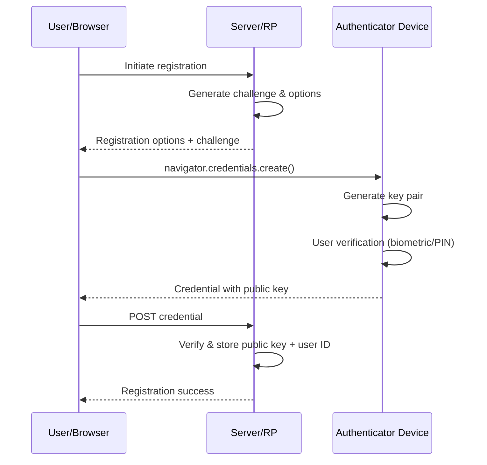
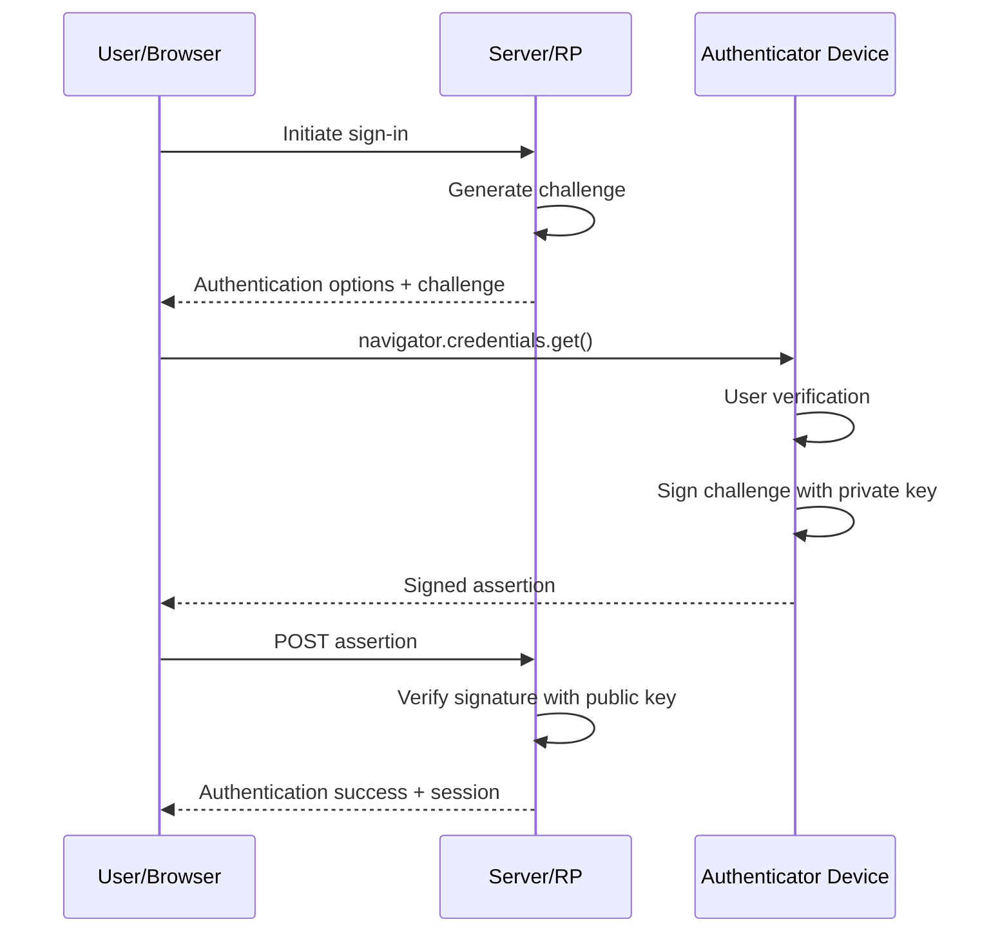
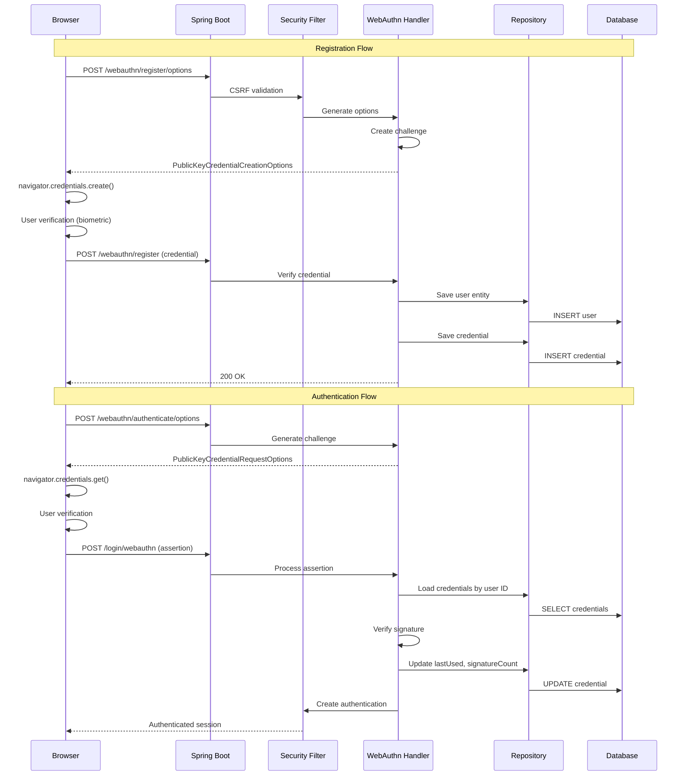

# Passkeys: Comprehensive Technical Whitepaper for Developers and Architects

## Executive Summary

Passkeys represent a fundamental shift in authentication, replacing passwords with cryptographic key pairs for phishing-resistant, passwordless authentication. Built on FIDO2/WebAuthn standards, passkeys eliminate the vulnerabilities that cause over 90% of security compromises while delivering a superior user experience. This whitepaper provides developers and architects with the technical knowledge needed to understand, evaluate, and implement passkey authentication in production systems.

## Introduction

Traditional password-based authentication has become the weakest link in modern security. Users struggle with password fatigue, reuse credentials across sites, and fall victim to phishing attacks. Meanwhile, organizations face billions in breach costs and support overhead from password resets.

Passkeys solve these problems by eliminating shared secrets entirely. Instead of transmitting knowledge that can be stolen, passkeys prove identity through cryptographic challenges that cannot be phished or breached. This document covers the technical fundamentals, implementation strategies, and best practices for adopting passkeys in real-world applications.

## Core Concepts

### What Are Passkeys?

Passkeys are digital credentials tied to user accounts and specific websites or applications. They enable authentication through device-based verification (biometrics, PIN, or pattern) without requiring users to remember or type passwords.

**Key Characteristics:**
- Based on FIDO2 standards (WebAuthn for web, CTAP for cross-device communication)
- Two variants: device-bound (single device) or synced (across devices via iCloud Keychain, Google Password Manager)
- No shared secrets transmitted or stored on servers
- Domain-bound to prevent phishing

### Cryptographic Foundation

Passkeys rely on public-key cryptography. During registration, an authenticator generates an asymmetric key pair where the private key never leaves the user's device and the public key registers with the relying party (RP) server.

**Authentication uses challenge-response:**
1. Server generates and sends a random challenge
2. Device signs the challenge with the private key
3. Server verifies the signature using the stored public key
4. Access is granted if verification succeeds

This design means that even if a server is breached, attackers only obtain public keys, which are useless without the corresponding private keys.

### Registration Flow



**Technical Steps:**
1. `POST /webauthn/register/options` - Request registration parameters
2. `navigator.credentials.create()` - Browser API triggers authenticator
3. Private key stored in secure hardware (TPM, Secure Enclave)
4. `POST /webauthn/register` - Public key sent to server
5. Server validates and persists credential

### Authentication Flow



**Technical Steps:**
1. `POST /webauthn/authenticate/options` - Request authentication challenge
2. `navigator.credentials.get()` - Browser retrieves credential
3. Device signs challenge with private key
4. `POST /login/webauthn` - Assertion sent to server
5. Server verifies signature and grants access

### Relying Party Parameters

Critical configuration parameters for the RP (your application):

- **rpId**: Your domain (e.g., "example.com")
- **origin**: Full URL (e.g., "https://example.com")
- **user entity**: Contains user ID (must be <64 bytes), name, and display name
- **challenge**: Random bytes (minimum 16 bytes recommended)
- **pubKeyCredParams**: Supported algorithms (e.g., ES256, RS256)

### Multi-Device Synchronization

Synced passkeys encrypt credentials end-to-end and share across devices within an ecosystem (Apple, Google, Microsoft). Cross-device authentication uses QR codes or Bluetooth for proximity verification, allowing users to sign in on one device using a passkey from another.

## Comparison: Passwords vs Passkeys

| Aspect | Traditional Passwords | Passkeys |
|--------|----------------------|----------|
| **Security Model** | Something you know | Something you have + verification |
| **Phishing Resistance** | Vulnerable to social engineering and fake sites | Immune - domain-bound cryptographic verification |
| **Data Breach Impact** | Hashed passwords exposed; vulnerable to cracking | Only public keys exposed; completely useless to attackers |
| **User Experience** | Manual typing, memorization, frequent resets | Fast biometric/PIN; no memorization required |
| **Reuse Risk** | High - users reuse across sites | Zero - unique keys per site automatically |
| **Attack Vectors** | Credential stuffing, brute force, keyloggers, phishing | Device loss (mitigated by backups) |
| **Multi-Factor Authentication** | Often added separately (SMS, TOTP) | Built-in (possession + verification) |
| **Account Recovery** | Email/phone based; vulnerable to social engineering | Recovery codes + multi-device registration |
| **Support Costs** | High - constant password resets | Low - minimal recovery requests |
| **Success Rate** | Lower due to forgotten passwords | 20% higher sign-in success |

**Key Security Advantage:** Passkeys reduce credential-based attacks by shifting risk from constant theft attempts to rare device loss scenarios, which are manageable through backup strategies.

## Benefits and Value Proposition

### Security Benefits

- **Phishing Immunity**: Domain binding prevents credentials from working on fake sites
- **Breach Resistance**: Server stores only public keys; breaches yield no exploitable data
- **No Password Reuse**: Each site gets unique cryptographic keys automatically
- **Reduced Attack Surface**: Eliminates credential stuffing, brute force, and password spraying
- **Zero-Day Resilience**: No reported zero-days breaking passkey cryptography to date

### User Experience Benefits

- **Faster Authentication**: Biometric verification takes seconds vs typing passwords
- **20% Higher Success Rate**: Users don't forget or mistype credentials
- **Cross-Device Convenience**: Synced passkeys work seamlessly across ecosystem devices
- **No Password Fatigue**: Eliminates the cognitive burden of managing dozens of passwords
- **Consistent Experience**: Same authentication flow across web and mobile apps

### Business Benefits

- **Cost Reduction**: Eliminates password reset support overhead (potentially millions annually for large platforms)
- **Higher Retention**: Better UX reduces abandonment during sign-in/sign-up
- **Fraud Prevention**: Cuts account takeover incidents and associated costs
- **Compliance Advantage**: Meets multi-factor authentication requirements natively
- **Competitive Edge**: 53% of users show willingness to adopt when offered

### Adoption Statistics

- Major platform support: Google, Apple, Microsoft, 1Password
- Growing developer ecosystem: WebAuthn libraries for all major languages
- Industry backing: FIDO Alliance, W3C standards
- Real-world deployments: PayPal, eBay, Best Buy, GitHub, and others

## Risks, Challenges, and Mitigations

### Device Loss and Lockout

**Risk:** If a user loses all devices with passkeys, they cannot access their account.

**Mitigations:**
- Register passkeys on multiple devices during setup
- Generate and securely store recovery codes offline
- Add hardware security keys (YubiKey) as backup authenticators
- Implement account recovery flows with strong verification
- Prompt users to add backup methods before removing last passkey

### Synchronization Vulnerabilities

**Risk:** Synced passkeys stored in cloud providers could be targeted in sophisticated attacks.

**Mitigations:**
- Providers use end-to-end encryption (keys encrypted before cloud storage)
- Choose reputable sync providers (Apple, Google, Microsoft)
- Use device-bound passkeys for highly sensitive applications (banking, healthcare)
- Implement additional security layers for privileged operations
- Monitor provider security advisories

### Abuse in Shared Device Scenarios

**Risk:** Abusers with physical access could add their biometrics to shared devices.

**Mitigations:**
- Design clear UI showing all registered credentials
- Send notifications when new passkeys are added
- Provide easy removal of credentials from account settings
- Implement session timeouts and re-authentication for sensitive changes
- Educate users about credential hygiene

### Implementation Errors

**Risk:** Developers might misconfigure WebAuthn, weakening security guarantees.

**Common Mistakes:**
- Not requiring user verification (UV flag)
- Incorrect origin/RP ID validation
- Weak challenge generation
- Improper signature verification
- Missing attestation validation for device-bound keys

**Mitigations:**
- Follow official WebAuthn specifications precisely
- Use well-tested libraries (SimpleWebAuthn, webauthn4j)
- Verify all flags in authenticator responses (UV, UP, AT, ED)
- Implement comprehensive integration tests
- Security audit before production deployment

### Adoption Barriers

**Risk:** Not all users have compatible devices; education gap exists.

**Mitigations:**
- Offer passkeys alongside passwords initially; phase out over time
- Progressive rollout to tech-savvy users first
- Clear onboarding with benefits explanation
- Support fallback authentication temporarily
- Provide PIN/pattern options where biometrics aren't available

### Vendor Lock-in Concerns

**Risk:** Users might perceive passkeys as tied to specific platforms.

**Reality:** Passkeys are based on open standards (FIDO2/WebAuthn). While sync happens within ecosystems, users can register passkeys from multiple providers on the same account, preventing true lock-in.

## Spring Boot Implementation Guide

Spring Security 6.2+ provides native passkey support through WebAuthn integration with the webauthn4j library.

### Dependencies

Add to `pom.xml`:

```xml
<dependency>
    <groupId>org.springframework.boot</groupId>
    <artifactId>spring-boot-starter-security</artifactId>
</dependency>
<dependency>
    <groupId>com.webauthn4j</groupId>
    <artifactId>webauthn4j-core</artifactId>
    <version>0.29.7.RELEASE</version>
</dependency>
```

### Basic Security Configuration

```java
@Configuration
@EnableWebSecurity
public class SecurityConfig {
    
    @Bean
    SecurityFilterChain filterChain(HttpSecurity http) throws Exception {
        http
            .authorizeHttpRequests(auth -> auth
                .requestMatchers("/", "/login", "/webauthn/**").permitAll()
                .anyRequest().authenticated()
            )
            .formLogin(withDefaults())
            .webAuthn(webAuthn -> webAuthn
                .rpId("example.com")  // Your domain
                .rpName("Your Application")
                .allowedOrigins("https://example.com")
            );
        return http.build();
    }
}
```

This configuration automatically enables:
- `/webauthn/register/options` - Registration initialization
- `/webauthn/register` - Registration completion
- `/webauthn/authenticate/options` - Authentication initialization  
- `/login/webauthn` - Authentication completion

### Persistence Layer

**Critical:** In-memory defaults are unsuitable for production. Implement database-backed repositories.

**Required Interfaces:**

1. **PublicKeyCredentialUserEntityRepository**: Maps WebAuthn user IDs (byte arrays) to your User entities
2. **UserCredentialRepository**: Stores CredentialRecord objects containing passkey metadata

**JDBC Implementation:**

```java
@Configuration
public class WebAuthnConfig {
    
    @Bean
    JdbcPublicKeyCredentialUserEntityRepository userEntityRepository(
            JdbcOperations jdbcOperations) {
        return new JdbcPublicKeyCredentialUserEntityRepository(jdbcOperations);
    }
    
    @Bean
    JdbcUserCredentialRepository credentialRepository(
            JdbcOperations jdbcOperations) {
        return new JdbcUserCredentialRepository(jdbcOperations);
    }
}
```

**Database Schema** (auto-created by JDBC repositories):

```sql
-- User entities table
CREATE TABLE webauthn_users (
    id BINARY(64) PRIMARY KEY,
    username VARCHAR(255) NOT NULL,
    display_name VARCHAR(255)
);

-- Credentials table
CREATE TABLE user_credentials (
    id VARCHAR(255) PRIMARY KEY,
    user_id BINARY(64) NOT NULL,
    credential_id BLOB NOT NULL,
    public_key BLOB NOT NULL,
    signature_count BIGINT,
    created_at TIMESTAMP,
    last_used TIMESTAMP,
    FOREIGN KEY (user_id) REFERENCES webauthn_users(id)
);
```

**JPA Custom Implementation:**

For more control, create custom entities:

```java
@Entity
public class User {
    @Id
    @GeneratedValue
    private Long id;
    
    @Column(unique = true, nullable = false, length = 64)
    private byte[] webauthnId;  // WebAuthn user ID
    
    private String username;
    private String displayName;
    
    @OneToMany(mappedBy = "user", cascade = CascadeType.ALL)
    private Set<PasskeyCredential> credentials;
}

@Entity
public class PasskeyCredential {
    @Id
    private String credentialId;
    
    @ManyToOne
    private User user;
    
    @Lob
    private String credentialRecordJson;  // Serialize CredentialRecord
    
    private LocalDateTime lastUsed;
    private Long signatureCount;
}
```

### Complete Architecture Flow



### Frontend Integration

**Registration Example:**

```javascript
async function registerPasskey() {
    // Get options from server
    const optionsResponse = await fetch('/webauthn/register/options', {
        method: 'POST',
        headers: {
            'Content-Type': 'application/json',
            'X-CSRF-TOKEN': csrfToken
        }
    });
    const options = await optionsResponse.json();
    
    // Convert base64 to ArrayBuffer
    options.challenge = base64ToArrayBuffer(options.challenge);
    options.user.id = base64ToArrayBuffer(options.user.id);
    
    // Create credential
    const credential = await navigator.credentials.create({
        publicKey: options
    });
    
    // Send to server
    const registerResponse = await fetch('/webauthn/register', {
        method: 'POST',
        headers: { 'Content-Type': 'application/json' },
        body: JSON.stringify({
            id: credential.id,
            rawId: arrayBufferToBase64(credential.rawId),
            response: {
                attestationObject: arrayBufferToBase64(credential.response.attestationObject),
                clientDataJSON: arrayBufferToBase64(credential.response.clientDataJSON)
            },
            type: credential.type
        })
    });
    
    if (registerResponse.ok) {
        console.log('Passkey registered successfully');
    }
}
```

**Authentication Example:**

```javascript
async function authenticateWithPasskey() {
    // Get challenge
    const optionsResponse = await fetch('/webauthn/authenticate/options', {
        method: 'POST'
    });
    const options = await optionsResponse.json();
    
    options.challenge = base64ToArrayBuffer(options.challenge);
    
    // Get credential
    const credential = await navigator.credentials.get({
        publicKey: options
    });
    
    // Send assertion
    const authResponse = await fetch('/login/webauthn', {
        method: 'POST',
        headers: { 'Content-Type': 'application/json' },
        body: JSON.stringify({
            id: credential.id,
            rawId: arrayBufferToBase64(credential.rawId),
            response: {
                authenticatorData: arrayBufferToBase64(credential.response.authenticatorData),
                clientDataJSON: arrayBufferToBase64(credential.response.clientDataJSON),
                signature: arrayBufferToBase64(credential.response.signature),
                userHandle: arrayBufferToBase64(credential.response.userHandle)
            },
            type: credential.type
        })
    });
    
    if (authResponse.ok) {
        window.location.href = '/dashboard';
    }
}
```

## General Implementation Best Practices

### Development Guidelines

**Security Requirements:**
- HTTPS is mandatory in production (localhost exception for development)
- Always require user verification (UV flag) for sensitive operations
- Validate RP ID and origin strictly
- Use cryptographically secure random challenges (minimum 16 bytes)
- Verify signature count to detect cloned authenticators
- Implement CSRF protection on all WebAuthn endpoints

**Testing Strategy:**
- Test with multiple device types (phone, tablet, laptop, security key)
- Verify cross-platform authentication flows
- Test recovery scenarios (device loss, credential removal)
- Validate fallback authentication paths
- Performance test challenge generation and signature verification
- Security audit credential storage and transmission

**User Experience:**
- Provide clear onboarding explaining passkey benefits
- Show visual feedback during biometric verification
- Allow users to name their passkeys ("iPhone 13", "Work Laptop")
- Display all registered credentials with last-used timestamps
- Implement easy credential removal
- Offer to add backup passkey during setup

### Migration Strategy

**Phase 1: Parallel Operation**
- Offer passkeys alongside existing passwords
- Make passkeys optional but encourage adoption
- Collect metrics on adoption rate and success rate

**Phase 2: Incentivized Adoption**
- Provide benefits for passkey users (e.g., skip additional verification)
- Show security indicators for passkey vs password users
- Send educational emails about passkey advantages

**Phase 3: Deprecation**
- Set timeline for password removal (6-12 months notice)
- Require backup passkey or recovery method before password removal
- Provide support channels for migration assistance

**Phase 4: Passwordless**
- Remove password authentication entirely
- Maintain recovery flows with strong verification
- Monitor for edge cases requiring support

### Production Deployment

**Infrastructure:**
- Multi-homed servers need sticky sessions for in-memory options storage (or use Redis)
- Database replication for credential storage high availability
- CDN for WebAuthn JavaScript libraries
- Monitoring for authentication success/failure rates

**Scalability:**
- Connection pooling for credential repository
- Caching for public key lookups
- Rate limiting on registration/authentication endpoints
- Async processing for audit logging

**Backup and Recovery:**
- Mandate at least one backup authentication method
- Generate recovery codes during setup; user must save offline
- Implement account recovery with identity verification (KBA, video call, etc.)
- Log all credential additions/removals for audit

**Compliance:**
- Passkeys satisfy multi-factor requirements (possession + verification)
- GDPR: Treat passkeys as authentication data; provide export/deletion
- PCI DSS: Passkeys reduce scope by eliminating password storage
- SOC 2: Document passkey implementation in security policies

## Advanced Topics

### Attestation

Attestation proves a credential came from a genuine authenticator. Use cases:
- Enterprise scenarios requiring specific hardware (e.g., FIPS-certified keys)
- High-security applications needing device authentication

**Implementation:**
```java
webAuthn.rpId("example.com")
    .attestation(AttestationConveyancePreference.DIRECT)
```

Validate attestation certificate chains against FIDO Metadata Service.

### Resident Keys (Discoverable Credentials)

Allow authentication without username entry - browser suggests available passkeys.

**Configuration:**
```javascript
publicKey: {
    authenticatorSelection: {
        residentKey: "required",
        requireResidentKey: true
    }
}
```

**Trade-off:** Requires more storage on authenticator; improves UX significantly.

### Conditional UI

Show passkey autofill in username fields:

```javascript
navigator.credentials.get({
    publicKey: options,
    mediation: 'conditional'
});
```

Browser displays passkeys inline with password autofill.

### Enterprise Deployment

**Considerations:**
- Centralized policy management for allowed authenticators
- Integration with identity providers (SSO, Active Directory)
- Audit logging for compliance
- Device attestation requirements
- Fallback for legacy systems

## Troubleshooting Common Issues

| Issue | Cause | Solution |
|-------|-------|----------|
| "NotAllowedError" | User canceled or timeout | Increase timeout; improve UI clarity |
| Origin mismatch | RP ID doesn't match domain | Verify RP ID = domain (no protocol/port) |
| CSRF failure | Missing/invalid token | Ensure CSRF token in registration requests |
| Signature verification fails | Wrong public key or corrupted data | Check credential ID lookup; validate base64 encoding |
| Passkey not suggested | Not a resident key | Set `residentKey: "required"` |
| Works localhost, fails production | Missing HTTPS | Deploy with valid TLS certificate |

## Future Roadmap

**Emerging Standards:**
- Passkey export/import across ecosystems (in development)
- Enhanced recovery mechanisms
- Biometric-level signals for risk assessment

**Industry Trends:**
- Payment authentication with passkeys (SCA compliance)
- Government ID integration
- Decentralized identity with verifiable credentials

## Conclusion

Passkeys represent a paradigm shift from knowledge-based to cryptographic authentication. They deliver measurable security improvements while enhancing user experience - a rare combination. For developers and architects, the implementation path is well-defined through standard APIs and mature libraries.

**Key Takeaways:**
- Passkeys eliminate password vulnerabilities at the root cause
- WebAuthn provides production-ready implementation standards
- Spring Security and other frameworks offer native support
- Thoughtful deployment with backups mitigates adoption risks
- Industry momentum makes passkeys the future of authentication

**Next Steps:**
1. Prototype passkey registration/authentication in development environment
2. Evaluate persistence strategy for your architecture
3. Design migration plan for existing users
4. Implement comprehensive testing across device types
5. Plan phased rollout with metrics collection

**Resources:**
- FIDO Alliance: https://fidoalliance.org/
- WebAuthn Specification: https://www.w3.org/TR/webauthn/
- Spring Security WebAuthn Docs: https://docs.spring.io/spring-security/reference/servlet/authentication/passkeys.html
- SimpleWebAuthn Library: https://simplewebauthn.dev/
- Passkeys.dev Developer Resources: https://passkeys.dev/

The password era is ending. Passkeys offer a secure, user-friendly path forward. Adopt them thoughtfully, and you'll build authentication that protects users while simplifying their lives.
