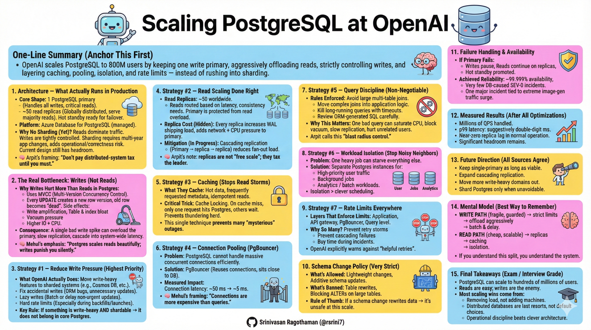

# 📘 **Scaling PostgreSQL at OpenAI Notes**

OpenAI runs **PostgreSQL (often called Postgres)** as a core database powering **ChatGPT and the API** — serving **~800 million users and millions of database queries per second (QPS)**.

---

## 🧠 **1. Core Architecture (What It Is Right Now)**

### 🏗️ **Primary & Replica Setup**

* **One primary PostgreSQL instance** for *all writes* (on Azure Database for PostgreSQL).
* **~50 read-only replicas** distributed globally to handle most *read queries*.
* Replicas allow low-latency reads all over the world.

### 🌍 **High Availability**

* The primary runs in **High Availability (HA) mode** with a **hot standby** ready to take over on failure.
* During outages, reads on replicas can continue even if writes stop.

### 🚫 **No Sharding Yet**

* OpenAI *has not sharded PostgreSQL itself* yet — the current setup stays on one primary because:

  * Sharding would require huge application changes across many services.
  * Their workload remains **mostly read-heavy**, so a single primary still scales well.

---

## ⚠️ **2. Main Challenges They Faced**

### 📈 **Huge Load Growth**

* Database traffic grew **10× over one year** — pushing the system to its limits.

### 🧾 **Write Pressure**

* PostgreSQL’s **MVCC (multiversion concurrency control)** creates new row versions on updates, which:

  * Amplifies writes.
  * Causes *table and index bloat*.
  * Requires careful vacuum tuning.

### ⚙️ **Primary Bottleneck**

* All writes go to one machine → *write spikes* (e.g., feature launches, cache failure) can overload the primary.

### 💻 **Expensive Queries & CPU Usage**

* Complex queries (e.g., multi-table joins) can saturate CPU, slowing everything down.

### 🔌 **Connection Limits**

* Too many open connections slow the database; Postgres has a finite limit per instance.

### 📊 **Replica Load & Lag**

* More replicas means more replication traffic from the primary and potential lag challenges.

---

## ⚙️ **3. Key Optimizations & How They Work**

The goal is **reduce load on the primary** while still delivering reliable, low-latency service.

---

### 🔥 A. **Reduce Write Load**

* Offload *write-heavy, shardable data* to external systems (e.g., Azure CosmosDB).
* Fix application bugs that trigger unnecessary writes.
* Use techniques like “lazy writes” to smooth spike patterns.

> *Meaning*: Postgres doesn’t have to process every update — reducing bottlenecks.

---

### 📊 B. **Read Offloading & Replica Use**

* Most reads go to replicas, freeing the primary to focus mostly on writes.
* Even some queries involved in write transactions are carefully routed to replicas where safe.

> *Meaning*: Reads are cheap and fast, writes are heavy — treat them differently.

---

### 🧠 C. **Query Optimization**

* Avoid costly multi-table joins where unnecessary.
* Move heavy logic into application code when possible.
* Use timeouts to prevent long queries from holding resources.

---

### 🔌 D. **Connection Pooling (PgBouncer)**

* PgBouncer drastically reduces connection overhead.
* Result: **connection timing dropped from ~50 ms to ~5 ms**.

> *Meaning*: The database spends less time setting up connections and more time handling queries.

---

### 🗃️ E. **Caching + Cache Locking**

* A separate cache layer *fronts* reads; database only hit when the cache misses.
* “Cache locking” prevents everyone from hitting the DB at once on a miss.

> *Meaning*: Reduces sudden spikes and “thundering herd” problems.

---

### 📊 F. **Workload Isolation**

* Separate high-priority traffic from lower-priority workloads.
* Heavy jobs are run on *separate Postgres instances* where possible.

---

### 🔁 G. **Read Replication Enhancements**

* Nearly 50 replicas globally — gives low latency for end users.
* OpenAI is exploring *cascading replica replication* — where replicas feed other replicas — to reduce load on the primary.

---

### 🚦 H. **Rate Limiting & Safety Layers**

* Rate limits at multiple levels (app, pooler, proxy, queries) help dampen load spikes.
* Avoid supply/demand loops where retries worsen overload.

---

### 🧱 I. **Schema & Change Controls**

* Avoid major schema rewrites on live systems, because they lock tables.
* New tables and write-heavy things go to sharded systems by default.

---

## 🚀 **4. Results (What This Achieved)**

✅ **Millions of QPS handleable on Postgres** (combined read + writes).

✅ **Low latency** — typical p99 ~ double-digit milliseconds for clients.

✅ **Five-nines availability** (99.999%) most of the time.

✅ Few serious Postgres-related incidents — better stability after optimization.

✅ Plenty of headroom before sharding becomes necessary.

---

## 🛠️ **5. Future Directions**

🔹 Keep optimizing current Postgres setup (better headroom).

🔹 Roll out cascading replication safely.

🔹 Migrate more write-heavy workloads to shardable systems.

🔹 Consider adding real Postgres sharding if write pressure eventually demands it.

---

## 💡 **Key Takeaways (Simplified)**

✔ **Postgres can scale very far if most traffic is reads.**

✔ **Offload writes and aggressive caching save tons of load.**

✔ **Connection pooling and rate limits prevent overload.**

✔ **One primary + many replicas works when engineered right.**

---

## References:

[Scaling PostgreSQL to power 800 million ChatGPT users](https://openai.com/index/scaling-postgresql/?utm_source=chatgpt.com)

[OpenAI Scales PostgreSQL to 800M Users](https://www.adwaitx.com/openai-postgresql-800-million-chatgpt-users-scaling/?utm_source=chatgpt.com)

[How OpenAI scaled with Azure Database for PostgreSQL](https://www.microsoft.com/en-us/startups/blog/openai-and-postgresql-scaling-with-microsoft-azure/?utm_source=chatgpt.com)

[Scaling PostgreSQL to power 800M ChatGPT users](https://news.ycombinator.com/item?id=46725300&utm_source=chatgpt.com)

[Scaling PostgreSQL to power 800 million ChatGPT users](https://www.linkedin.com/posts/srinivasnarayanan_scaling-postgresql-to-power-800-million-chatgpt-activity-7420728382046412800-yr05?utm_source=chatgpt.com)

### Youtube Videos:

- https://www.youtube.com/watch?v=ubpUjovBMAM
- https://www.youtube.com/watch?v=dApJ8X9XW9M

**Related:**
- [SpringBoot-4-Migration-Copilot-VSCode](../../AI-ML/Agents/Spring-Boot-4-Migration/SpringBoot-4-Migration-Copilot-VSCode.md) — Spring Boot microservices commonly sit in front of PostgreSQL primary/replica setups like the one described here.
- [AWS-vs-Hetzner](../Cloud/AWS-vs-Hetzner.md) — OpenAI runs Postgres on Azure but the single-primary bottleneck motivates the cloud-vs-bare-metal analysis.
