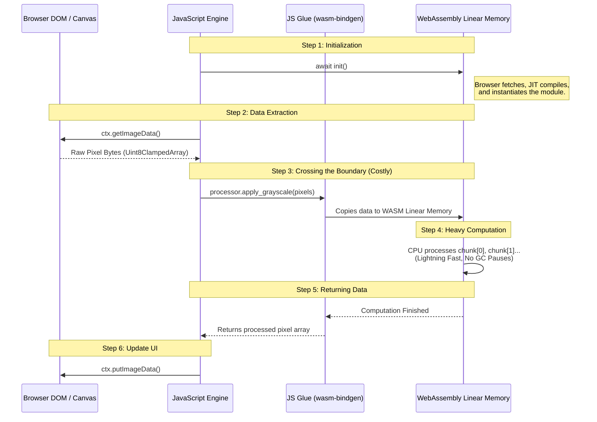

# WebAssembly in 2026: The Complete Rust Guide

For years, WebAssembly (WASM) was a heavily discussed topic but rarely saw actual production use. The tooling was rough, JavaScript interoperability was painful, and use cases felt niche. However, in 2026, the landscape has fundamentally changed. 

With the finalization of WebAssembly 3.0 in September 2025, major features were introduced:
*   **Native Garbage Collection (GC) Support**
*   **memory64:** Allowing modules to access up to 16GB of memory (up from 4GB).
*   **WASI Preview 2:** Bringing real networking and socket support.

Rust has emerged as the de facto language for writing WebAssembly, primarily due to its memory model and zero-cost abstractions, which produce the smallest and fastest WASM binaries. For CPU-bound tasks in the browser, WASM is typically 5 to 15 times faster than equivalent optimized JavaScript.

---

## 1. What WebAssembly Actually Is (The Mental Model)

There are many vague descriptions of WebAssembly. Here is the proper mental model:

*   **It is a compilation target:** You do not write WebAssembly by hand. You write code in another language (like Rust) and compile it to the `.wasm` binary format.
*   **It requires a runtime:** Once compiled, a runtime executes it. This can be a browser, a standalone runtime like `wasmtime`, or an edge/serverless platform.

### Key Properties
1.  **Sandboxed:** It runs in a completely isolated memory space. It cannot access the DOM, cookies, or the file system unless explicitly granted permission through a JavaScript bridge. This makes running untrusted code safe.
2.  **Portable:** The exact same `.wasm` binary file runs identically across Chrome, Firefox, Safari, Edge, and any standalone WASM runtime.
3.  **Fast:** The browser Just-In-Time (JIT) compiles the WASM binary to native machine code, providing near-native performance.

---

## 2. Why Rust? (Not Go, C++, or AssemblyScript)

While other languages can compile to WebAssembly, Rust holds three distinct advantages that make it the best choice:

1.  **No Garbage Collector in the Binary:** Languages like Go and C# have garbage collectors. When compiled to WASM, their GC must be bundled into the binary, leading to larger file sizes and potential performance pauses. Rust manages memory at compile time through ownership, resulting in smaller files, no pauses, and deterministic behavior.
2.  **Tiny Binary Size:** A minimal Rust WASM module is tiny. In contrast, a minimal Go module can be megabytes because the runtime is bundled in. With optimizations, complex Rust logic can compile down to hundreds of kilobytes.
3.  **`wasm-bindgen`:** This tool automatically handles the painful parts of JavaScript interoperability. It manages types, memory across the boundary, and lets you expose Rust structs as JavaScript classes seamlessly by generating all the necessary glue code.

---

## 3. Building a Real WASM Module: Image Processor

Let's build a practical example: an image processing module that applies grayscale and brightness filters. 

### Setup
First, ensure Rust is installed. Then, add the WebAssembly target and install the necessary tools:
```bash
# Add the 32-bit WebAssembly target for browsers
rustup target add wasm32-unknown-unknown

# Install the orchestrator tool
cargo install wasm-pack

# Install binary optimization tool
cargo install wasm-opt
```

### Project Configuration (`Cargo.toml`)
Create a new library project and configure `Cargo.toml`. The configuration is critical for WASM:

```toml
[lib]
crate-type = ["cdylib", "rlib"] # cdylib is required to produce a C-compatible dynamic library for WASM

[dependencies]
wasm-bindgen = "0.2" # Core tool for JS interop
js-sys = "0.3"       # Bindings to JS built-in types

[dependencies.web-sys]
version = "0.3"
features = [
  "console",
  "Window",
  "HtmlCanvasElement",
  "CanvasRenderingContext2d",
  "ImageData",
] # Specific browser APIs we need

[profile.release]
opt-level = "z"     # Optimize for size, not speed
lto = true          # Link Time Optimization (removes dead code)
codegen-units = 1   # Compile together for maximum optimization
panic = "abort"     # Remove panic unwinding infrastructure to save size
strip = true        # Strip debug symbols from the binary
```

### The Rust Implementation (`src/lib.rs`)

We use `wasm-bindgen` to expose our Rust code.

```rust
use wasm_bindgen::prelude::*;

// Expose standard JS console.log
#[wasm_bindgen]
extern "C" {
    #[wasm_bindgen(js_namespace = console)]
    fn log(s: &str);
}

macro_rules! console_log {
    ($($t:tt)*) => (log(&format_args!($($t)*).to_string()))
}

// Our main struct, exposed as a JavaScript class
#[wasm_bindgen]
pub struct ImageProcessor {
    width: u32,
    height: u32,
}

#[wasm_bindgen]
impl ImageProcessor {
    #[wasm_bindgen(constructor)]
    pub fn new(width: u32, height: u32) -> ImageProcessor {
        console_log!("WASM Image Processor initializing...");
        ImageProcessor { width, height }
    }

    // A function to apply grayscale to a mutable array of pixel bytes
    pub fn apply_grayscale(&self, pixels: &mut [u8]) {
        for chunk in pixels.chunks_mut(4) {
            let r = chunk[0] as f32;
            let g = chunk[1] as f32;
            let b = chunk[2] as f32;
            
            // Luminance formula
            let gray = (0.299 * r + 0.587 * g + 0.114 * b) as u8;
            
            chunk[0] = gray;
            chunk[1] = gray;
            chunk[2] = gray;
            // chunk[3] is alpha, leave it unchanged
        }
    }
    
    // Function to adjust brightness
    pub fn apply_brightness(&self, pixels: &mut [u8], value: i32) {
         for chunk in pixels.chunks_mut(4) {
             chunk[0] = (chunk[0] as i32 + value).clamp(0, 255) as u8;
             // ... apply to g and b ...
         }
    }
}
```

### Building and Using it in JavaScript

Build the project targeting the web:
```bash
wasm-pack build --target web
```
This generates a `pkg` directory containing the `.wasm` file, JavaScript glue code, and TypeScript definitions.

In your JavaScript (`main.js`):
```javascript
import init, { ImageProcessor } from './pkg/image_processor.js';

async function main() {
    // 1. MUST await init() to fetch and compile the .wasm file
    await init();
    console.log("WASM module loaded!");

    // Setup canvas...
    
    // 2. Instantiate the Rust struct
    const processor = new ImageProcessor(canvas.width, canvas.height);

    // 3. Get pixel data from canvas
    let imageData = ctx.getImageData(0, 0, canvas.width, canvas.height);
    let pixels = imageData.data;

    // 4. Pass data to Rust for processing
    // NOTE: Data crosses the JS -> WASM boundary here
    processor.apply_grayscale(pixels);

    // 5. Put data back on canvas
    ctx.putImageData(imageData, 0, 0);
}
main();
```

**Performance Tip:** Crossing the JavaScript-to-WASM boundary has a small overhead cost. Pass your data in once, perform all heavy operations inside Rust, and pass it back out. Do not call WASM functions repeatedly inside a tight JavaScript loop.

---


#### The Build Toolchain Flow (Browser vs. Server/Edge)
This diagram shows how your Rust source code is compiled depending on whether your target is the web browser or a WASI-compatible server/edge environment.

```mermaid
graph TD
    A[Rust Source Code src/...] --> B{Where will it run?}

    %% Web Browser Flow
    B -->|Web Browser| C[Target: wasm32-unknown-unknown]
    C --> D[Tool: wasm-pack build]
    D --> E[rustc + wasm-bindgen]
    
    E --> F[Unoptimized .wasm]
    E --> JS[JS Glue Code + TypeScript Types]
    
    F --> G[Tool: wasm-opt -Oz]
    G --> H[Optimized .wasm binary]
    
    H --> I[Bundled pkg/ Directory]
    JS --> I
    I --> J((Web Browser / Frontend))

    %% Server / Edge Flow
    B -->|Server / Edge| K[Target: wasm32-wasip1]
    K --> L[Tool: cargo build]
    L --> M[Unoptimized .wasm]
    
    M --> N[Tool: wasm-opt -Oz]
    N --> O[Optimized .wasm binary]
    
    O --> P((WASI Runtime: Wasmtime, Cloudflare, Fastly))

    classDef tools fill:#411,stroke:#333,stroke-width:2px;
    class D,G,L,N tools;
    classDef targets fill:#421,stroke:#333,stroke-width:2px;
    class C,K targets;
```



---

#### Browser Execution & Data Flow (JS Interop)
This sequence diagram illustrates the optimal pattern for using WebAssembly in the browser (like the Image Processor example). Notice how the data only crosses the boundary *once* per operation to avoid performance overhead.



---

#### WASI Sandbox Architecture (Server/Edge)
This diagram shows how WASI securely handles system-level tasks (like networking or file I/O) outside the browser without compromising the WebAssembly sandbox.

```mermaid
graph LR
    subgraph Host OS Environment
        FS[(File System)]
        NET((Network / Sockets))
        ENV[Env Variables & Clocks]
    end

    subgraph WASI Runtime Wasmtime / Cloudflare
        WASI_API[WASI API Bridge]
        
        subgraph WebAssembly Sandbox
            WASM[Rust .wasm Module]
            MEM[Isolated Linear Memory]
            WASM <--> MEM
        end
    end

    %% Interactions
    WASM -- 1. Requests Resource --> WASI_API
    WASI_API -- 2. Validates Sandbox Permissions --> FS
    WASI_API -- 2. Validates Sandbox Permissions --> NET
    WASI_API -- 2. Validates Sandbox Permissions --> ENV
    
    FS -. 3. Returns Data .-> WASI_API
    NET -. 3. Returns Data .-> WASI_API
    WASI_API -. 4. Safely writes to .-> MEM

    style WASM fill:#f96,stroke:#333,stroke-width:2px
    style WASI_API fill:#9cf,stroke:#333,stroke-width:2px,stroke-dasharray: 5 5
```

#### Summary of Tools in the Flow:
*   **`rustup target add ...`**: Prepares your Rust compiler for the specific WebAssembly environment.
*   **`wasm-pack`**: The orchestrator for browser builds. It compiles the Rust code and triggers `wasm-bindgen`.
*   **`wasm-bindgen`**: The magic glue generator. It bridges the gap between JavaScript's garbage-collected memory and Rust's linear memory.
*   **`wasm-opt`**: The final post-processing step that compresses and shrinks the output `.wasm` file for production.
*   **`wasmtime`**: The standalone runtime used to execute WASI (server-side) modules locally.

---

## 4. WASI: WebAssembly System Interface

WASI is arguably the most exciting part of the WebAssembly ecosystem. It allows WebAssembly to run *outside* the browser, providing a standardized, sandboxed interface to system resources like the file system, network connections (added in Preview 2), environment variables, and clocks.

**The promise of WASI:** Write once, run securely on any WASI-compatible platform (Cloudflare Workers, Fastly Compute, Wasmtime on Linux/Mac/Windows) without changes. A WASI module is smaller, starts in milliseconds, and is fully isolated compared to a Docker container.

### Building a WASI App
1. Add the target: `rustup target add wasm32-wasip1`
2. Create a normal Rust app (`main.rs`) using standard library IO (no special WASM crates needed).
3. Build it: `cargo build --target wasm32-wasip1 --release`
4. Run it using a runtime like Wasmtime: `wasmtime target/wasm32-wasip1/release/your_app.wasm`

---

## 5. Binary Optimization for Production

Production WASM binaries must be as small as possible to minimize download times for users.

1.  **Cargo Profile:** Ensure your `Cargo.toml` is configured for release optimization (`opt-level = "z"`, `lto = true`, `strip = true` as shown earlier).
2.  **`wasm-opt`:** Run the `wasm-opt` tool on your generated binary. It can shrink binaries by up to 40% beyond what the Rust compiler achieves.
    ```bash
    wasm-opt -Oz pkg/your_project_bg.wasm -o pkg/your_project_bg.wasm
    ```

---

## 6. The Honest Guide: When to Use Rust WASM

WebAssembly is not a replacement for JavaScript; it is a complementary tool. 

**✅ USE IT FOR:**
*   Compute-heavy browser operations (Image/Video/Audio processing).
*   Cryptographic operations.
*   File parsing and data compression.
*   Running Machine Learning (ML) inference locally in the browser.
*   Porting existing Rust/C/C++ libraries to the web.
*   Edge and Serverless functions (via WASI).
*   Plugin systems (safely running sandboxed, untrusted code).

**❌ DO NOT USE IT FOR:**
*   Simple web pages or UI rendering.
*   Data fetching (API calls).
*   DOM Manipulation.
*   Standard CRUD applications.

**The Golden Rule:** If your bottleneck is computation (CPU), Rust WASM will help dramatically. If your bottleneck is the network, database, or interacting with the DOM, WebAssembly will not help and will only add unnecessary complexity.

### 7. References
*   [Official Rust WASM Guide](https://rustwasm.github.io/wasm-bindgen/getting-started/using-wasm-bindgen.html)
*   [Official WASI Spec](https://github.com/WebAssembly/wasi-spec)
*   [Rust + WebAssembly in 2026 — Complete Guide (Browser, WASI, Edge, Optimisation)](https://www.youtube.com/watch?v=N25oMCsyaZ0)
