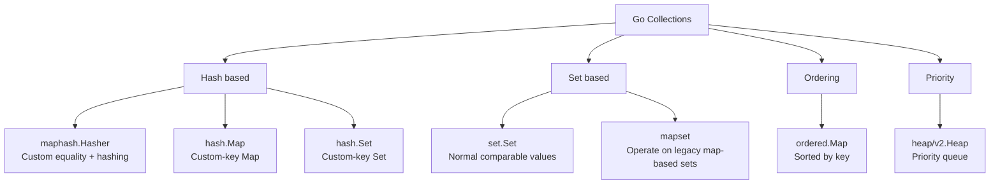
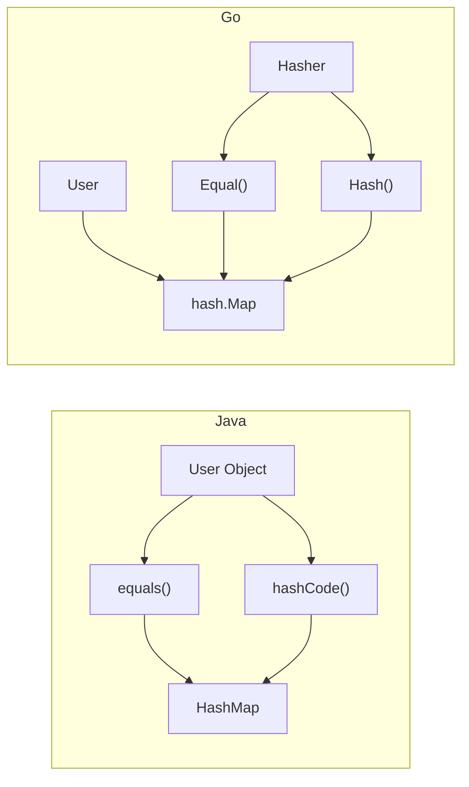
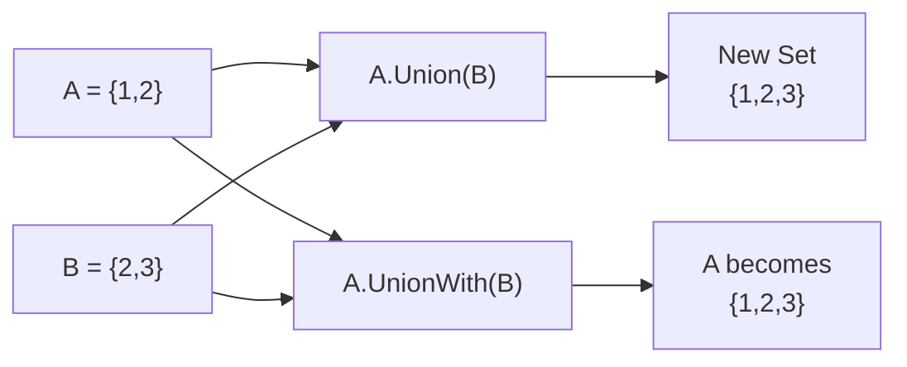
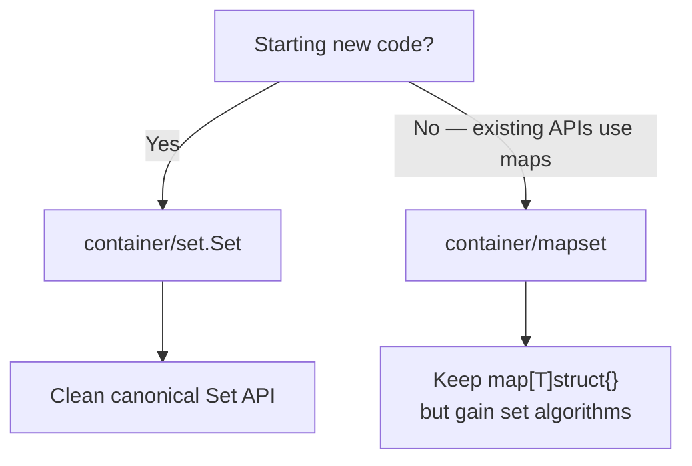
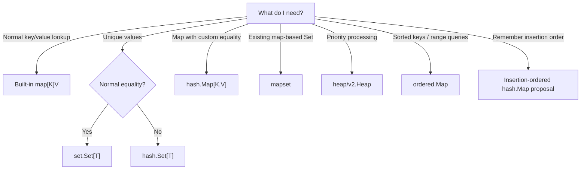
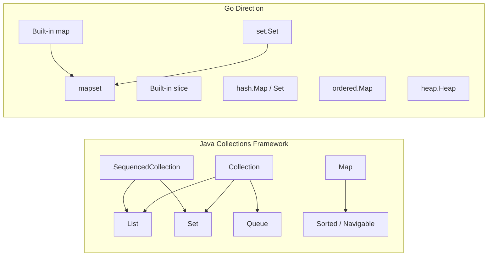
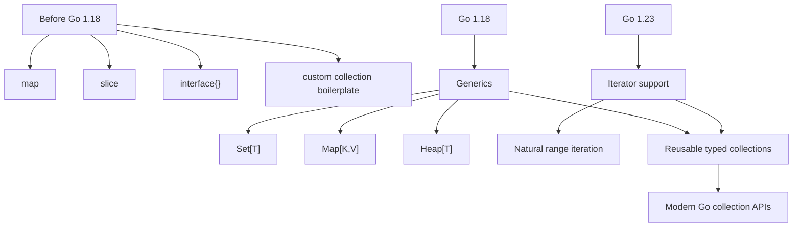

# Go Collections vs Java Collections: What’s Proposed for Go 1.28

Go 1.27 does **not** add generic methods. Go generics arrived in Go 1.18, and iterator support arrived in Go 1.23. The collection APIs discussed here are proposals being considered for Go 1.28.

At almost the same time, Go's Collections working group has published a broader set of proposals targeting **Go 1.28**, including standard sets, custom-hash maps and sets, a generic heap, map-set utilities, and an ordered map.

Luciano Ramalho recently presented these proposals in his *Sets in Go* talk, describing them as the next step in Go's collections story.

This is therefore **not a review of collections already shipped in Go 1.27**.

Instead, this article looks at:

* the language and library foundations already available,
* what is currently proposed for Go 1.28,
* why these additions matter,
* and how they compare with the mature Java Collections Framework.

> **Status note:** The APIs described in this article are proposals for Go 1.28, not stable Go 1.27 APIs. Names, signatures, and implementation details may change before acceptance. The examples below are conceptual unless a source says otherwise.

> **Reading the examples:** Go snippets describing proposed packages are pseudocode for explaining the design. Verify constructors, method names, and package paths against the current proposal before compiling them.

The overall direction is:

```text
Old Go
Built-in map + slice
        ↓
Developers build their own Set / Heap / Ordered Map
        ↓
Generics + Iterators arrive
        ↓
Standard reusable collection APIs become practical
        ↓
Go 1.18
Generics
    │
    ▼
Generic data structures become practical
    │
Go 1.21+
Generic stdlib APIs mature
    │
    ▼
slices / maps / cmp
    │
Go 1.23
Iterators
    │
    ▼
Library collections can feel native
    │
Go 1.27
Current language and library foundations
    │
    ▼
More expressive reusable APIs
    │
Go 1.28 proposals
    │
    ├── Set
    ├── Hash Set
    ├── Custom Hash Map
    ├── Heap
    ├── Ordered Map
    └── Map-set algorithms
```

As of **August 2026**, these proposals are being discussed as part of the Go collections work targeting **Go 1.28**. They should not be described as shipped Go 1.27 APIs.

---

# 1. The 7 Additions — Simplified

| # | Go API | Simple meaning | Closest Java equivalent | Typical use |
|---|---|---|---|---|
| 1 | `hash/maphash.Hasher` | Define **how something is hashed and considered equal** | `hashCode()` + `equals()` | Case-insensitive keys, slices, custom identity |
| 2 | `container/hash.Map[K,V]` | Hash map with **custom equality/hash rules** | `HashMap<K,V>` | Maps where normal `==` isn't enough |
| 3 | `container/hash.Set[T]` | Set with **custom equality/hash rules** | `HashSet<E>` | Case-insensitive sets, complex objects |
| 4 | `container/heap/v2.Heap[T]` | Simple generic priority heap | `PriorityQueue<E>` | Schedulers, top-N, shortest-path algorithms |
| 5 | `container/set.Set[T]` | Standard Go set | `HashSet<E>` / `Set<E>` | Unique users, tags, permissions |
| 6 | `container/mapset` | Set operations on existing Go maps | No direct equivalent; partly `Collections` | Add set algebra without changing existing APIs |
| 7 | `container/ordered.Map[K,V]` | Map whose **keys stay sorted** | `TreeMap<K,V>` / `NavigableMap` | Range queries, sorted traversal |

The Go collections umbrella explicitly describes `container/ordered.Map` as currently implemented using a **balanced binary tree**, particularly useful when range queries matter.

---

# 2. Big Picture



The easiest mental model is:

> **Go is not trying to reproduce the whole Java Collections Framework. It is standardizing a small set of common collection primitives while keeping Go's simpler style.**

---

# 3. `hash/maphash.Hasher`

## What problem does it solve?

Normal Go maps require:

```go
map[K]V
```

where `K` must be `comparable`.

For example:

```go
map[string]int
map[int]string
map[User]Account
```

work when the key is comparable.

But something like this cannot normally be a map key:

```go
[]byte
[]int
map[string]int
```

because slices and maps are not comparable.

`maphash.Hasher` allows a collection to define:

```text
How do I hash this value?
+
When should two values count as equal?
```

The proposal defines a `Hasher[T]` abstraction around hashing and equality. Check the proposal before relying on the name or method signatures.

---

## Java approach

Java puts these concepts directly on objects:

```java
obj.hashCode();
obj.equals(other);
```

For example:

```java
class User {
    @Override
    public int hashCode() {
        ...
    }

    @Override
    public boolean equals(Object o) {
        ...
    }
}
```

---

## Go direction

Conceptually:

```go
type MyHasher struct{}

func (MyHasher) Equal(a, b User) bool {
    return ...
}

func (MyHasher) Hash(h *maphash.Hash, value User) {
    ...
}
```

The equality strategy belongs to the **collection configuration**, rather than necessarily belonging to the object itself.

---

## Architectural difference



### Why this is interesting

Java says:

> Equality is generally a property of the **object/type**.

Go's new design allows:

> Equality can instead be a property of the **collection/use case**.

That can be very useful.

---

# 4. `container/hash.Map[K,V]`

This is **not intended to replace Go's built-in `map`**.

Use normal Go:

```go
map[string]int
```

whenever normal `==` comparison is sufficient.

The proposed `hash.Map` exists for cases requiring **custom equivalence**. The proposal itself advises using the built-in map for ordinary comparable keys.

---

## Example: case-insensitive usernames

Suppose:

```text
SRINI
Srini
srini
```

should all represent the same user.

### Normal Go map

```go
users := map[string]int{
    "Srini": 100,
    "srini": 200,
}
```

These are two different keys.

```text
"Srini" != "srini"
```

---

### Custom hash map

Conceptually:

```go
hasher.Equal("Srini", "srini")
```

returns:

```text
true
```

and they produce compatible hash values.

Therefore:

```text
Srini
SRINI
srini
   ↓
same logical key
```

---

## Java

With ordinary Java:

```java
Map<String, Integer> users = new HashMap<>();
```

Java uses:

```java
String.equals()
String.hashCode()
```

You usually need to normalize the key yourself:

```java
users.put(username.toLowerCase(), value);
```

or introduce a wrapper/custom library.

---

# 5. `container/hash.Set[T]`

Same principle as `hash.Map`, but storing only values.

Conceptually:

```text
hash.Map
Key ──────► Value

hash.Set
Element
Element
Element
```

---

## Example

Suppose tags are case-insensitive:

```text
"JAVA"
"Java"
"java"
```

You want:

```text
{"java"}
```

rather than:

```text
{"JAVA", "Java", "java"}
```

A custom hasher can define:

```text
Equal("JAVA", "java") = true
```

---

## Java equivalent

Normally:

```java
Set<String> tags = new HashSet<>();
```

which uses:

```java
String.equals()
String.hashCode()
```

Again, you would normally normalize values before inserting them.

The proposed Go `hash.Set` follows the same custom hash/equivalence model as `hash.Map`.

---

# 6. `container/heap/v2.Heap[T]`

This is probably the easiest addition for Java developers to understand.

Think:

```text
Go heap/v2.Heap
        ≈
Java PriorityQueue
```

Java's `PriorityQueue` is also implemented using a priority heap and can use either natural ordering or a supplied `Comparator`.

---

## Old Go heap

Today `container/heap` requires the developer to implement:

```go
Len()
Less()
Swap()
Push()
Pop()
```

through `heap.Interface`.

For a simple priority queue, that is a lot of ceremony.

---

## Proposed API

Conceptually:

```go
h := heap.New(comparator)

h.Insert(30)
h.Insert(10)
h.Insert(20)

minimum := h.TakeMin()
```

Result:

```text
10
```

The proposal introduces clearer operations such as `Min`, `TakeMin`, `Insert`, `Len`, `All`, and `Clear`.

---

## Java

```java
PriorityQueue<Integer> pq = new PriorityQueue<>();

pq.add(30);
pq.add(10);
pq.add(20);

System.out.println(pq.poll());
```

Result:

```text
10
```

---

## Common use cases

```text
Task Scheduler
     ↓
highest-priority task

Dijkstra Algorithm
     ↓
closest unexplored node

Top-N Query
     ↓
maintain best N values

Event Processing
     ↓
next event by timestamp
```

---

# 7. `container/set.Set[T]`

This is probably the proposal most Go developers will use regularly.

Today the idiomatic Go set is:

```go
users := map[string]struct{}{
    "alice": {},
    "bob":   {},
}
```

It works perfectly well, but the intent isn't immediately obvious.

---

## Proposed Go

Conceptually:

```go
developers := set.Of("Alice", "Bob")
architects := set.Of("Bob", "Charlie")
```

Now:

```go
developers.Union(architects)
```

produces:

```text
Alice
Bob
Charlie
```

The proposed type is transparently represented by `map[T]struct{}`, so it remains close to normal Go map semantics.

---

# 8. Set Algebra — Where Go Gets Interesting

Suppose:

```text
Developers = {Alice, Bob, Charlie}

Architects = {Bob, David}
```

---

## Union

People in either group:

```text
A ∪ B
```

Result:

```text
Alice
Bob
Charlie
David
```

Go:

```go
developers.Union(architects)
```

---

## Intersection

People in both:

```text
A ∩ B
```

Result:

```text
Bob
```

Go:

```go
developers.Intersection(architects)
```

---

## Difference

Developers who are not architects:

```text
A - B
```

Result:

```text
Alice
Charlie
```

Go:

```go
developers.Difference(architects)
```

---

## Symmetric Difference

Members belonging to exactly one group:

```text
A △ B
```

Result:

```text
Alice
Charlie
David
```

---

# 9. Pure vs Mutating Operations

This is a particularly nice aspect of the proposed Go API.

### Non-mutating

```go
c := a.Union(b)
```

Meaning:

```text
a unchanged
b unchanged

new set c created
```

---

### Mutating

```go
a.UnionWith(b)
```

Meaning:

```text
a itself is modified
```

---

## Visual



---

# 10. Comparison with Java Set

Java's classic collection operations are mainly mutation-oriented.

```java
Set<String> a = new HashSet<>(...);

a.addAll(b);
```

means:

```text
A = A ∪ B
```

Likewise:

| Mathematical operation | Java |
|---|---|
| Union | `a.addAll(b)` |
| Intersection | `a.retainAll(b)` |
| Difference | `a.removeAll(b)` |
| Subset check | `a.containsAll(b)` |

These operations mutate the receiving collection. Java 25 continues to expose these standard `Set`/`Collection` operations.

Go proposes much more explicit vocabulary:

```go
a.Union(b)
a.Intersection(b)
a.Difference(b)
```

versus:

```go
a.UnionWith(b)
a.IntersectionWith(b)
a.DifferenceWith(b)
```

That makes mathematical set operations easier to recognize when reading code.

---

# 11. `container/mapset`

This one initially looks strange.

Why have:

```text
container/set
```

and:

```text
container/mapset
```

?

Because there are millions of lines of existing Go using:

```go
map[T]struct{}
```

as sets.

They cannot all immediately change their APIs to:

```go
set.Set[T]
```

---

## Existing code

```go
permissions := map[string]struct{}{
    "READ":  {},
    "WRITE": {},
}
```

You might not want to change the public API.

Instead, `mapset` can provide algorithms directly over these map-based sets.

Conceptually:

```go
mapset.Union(a, b)
mapset.Intersection(a, b)
mapset.Difference(a, b)
```

The Go collections proposal describes `mapset` specifically as a compatibility/helper package for **legacy map-based sets**.

---

# 12. Why both `set` and `mapset`?

Think of it like this:



So:

> `set.Set` is primarily the **future-facing API**.

while:

> `mapset` provides a **migration/compatibility bridge**.

---

# 13. `container/ordered.Map[K,V]` — Important Correction

This part of the original comparison needs correction.

It was described as:

> Map maintaining insertion order.

But the current Go collections proposal says that `container/ordered.Map` is an **ordered mapping backed currently by a balanced binary tree**.

That means its closest Java equivalent is:

```java
TreeMap<K,V>
```

rather than:

```java
LinkedHashMap<K,V>
```

---

# 14. Sorted Order vs Insertion Order

These are very different concepts.

Suppose we insert:

```text
30
10
20
```

### Insertion ordered map

Iteration:

```text
30
10
20
```

because that was the insertion sequence.

Java example:

```java
LinkedHashMap
```

---

### Sorted ordered map

Iteration:

```text
10
20
30
```

because the keys are sorted.

Java example:

```java
TreeMap
```

Go's proposed:

```text
container/ordered.Map
```

is currently in this category.

---

# 15. Go vs Java Ordered Maps

| Requirement | Go | Java |
|---|---|---|
| Hash map | built-in `map` | `HashMap` |
| Custom-hash map | proposed `container/hash.Map` | no direct standard equivalent |
| Sorted map | proposed `container/ordered.Map` | `TreeMap` |
| Insertion-ordered map | separate proposal | `LinkedHashMap` |
| First/last/reversed map API | not unified yet | `SequencedMap` |

Java 25's `SequencedMap` defines a map with a well-defined encounter order, first/last operations, and reversible views. `LinkedHashMap` and `TreeMap` both participate in this hierarchy.

---

# 16. Separate Go Insertion-Ordered Proposal

There is also a separate Go proposal exploring insertion-ordered hash maps:

```text
an insertion-ordered hash map
```

Proposal #80194.

Its idea is:

```go
m := /* insertion-ordered map from the relevant proposal */
```

Iteration would preserve:

```text
oldest inserted
      ↓
newest inserted
```

and it proposes reverse iteration through `Backward()`.

So the distinction is:

```text
container/ordered.Map
        ↓
sorted by key
        ↓
TreeMap-like


hash.NewInsertionOrderedMap
        ↓
ordered by insertion
        ↓
LinkedHashMap-like
```

---

# 17. Final Go ↔ Java Mapping

Here is the comparison I would keep as the main reference.

| Go | Java 25 | Main difference |
|---|---|---|
| built-in `map[K]V` | `HashMap<K,V>` | Go map is a language primitive |
| `maphash.Hasher[T]` | `equals()` + `hashCode()` | Go can externalize equality/hash strategy |
| `hash.Map[K,V]` | `HashMap<K,V>` | Go version supports custom equality/hash per map |
| `hash.Set[T]` | `HashSet<E>` | Go version supports custom equality/hash strategy |
| `set.Set[T]` | `HashSet<E>` / `Set<E>` | Go explicitly exposes mathematical set algebra |
| `mapset` | roughly `Collections` helpers | Designed specifically for map-backed Go sets |
| `heap/v2.Heap[T]` | `PriorityQueue<E>` | Very similar developer goal |
| `ordered.Map[K,V]` | `TreeMap<K,V>` | Sorted/tree-based |
| insertion-ordered `hash.Map` proposal | `LinkedHashMap<K,V>` | Preserve insertion order |
| — | `SequencedMap<K,V>` | Java has a broader ordered-collection abstraction |

---

# 18. Choosing the Right Go Collection



---

# 19. Practical Examples

| Problem | Best collection |
|---|---|
| `userID → User` | built-in `map[string]User` |
| Unique user IDs | `set.Set[string]` |
| Unique usernames ignoring case | `hash.Set[string]` |
| `[]byte → metadata` | `hash.Map[[]byte, Metadata]` |
| Existing `map[string]struct{}` permission sets | `mapset` |
| Execute highest-priority task first | `heap/v2.Heap` |
| Find all IDs between 1000 and 2000 | `ordered.Map` |
| Preserve JSON/config insertion sequence | insertion-ordered map |

---

# 20. The Architectural Difference Between Java and Go

The biggest difference isn't any individual collection.

It is the philosophy behind the frameworks.



Java emphasizes a **large interface hierarchy**.

Go is moving toward:

```text
small concrete types
+
generic algorithms
+
iterators
+
minimal abstraction
```

rather than recreating:

```text
Collection
 ├── List
 ├── Set
 │    ├── SortedSet
 │    └── NavigableSet
 └── Queue
      └── Deque
```

---

# 21. Equality Philosophy — Probably the Most Interesting Difference

Consider a person:

```text
Person:
    employeeID
    email
    name
```

Different applications may consider people equal differently.

### Application A

```text
employeeID determines identity
```

### Application B

```text
email determines identity
```

### Application C

```text
email ignoring case determines identity
```

Java traditionally encourages the class to decide:

```java
Person.equals()
Person.hashCode()
```

But that gives essentially one canonical object equality definition.

Go's proposed custom-hasher collections allow:

```text
same Person type
       │
       ├── EmployeeIDHasher
       │
       ├── EmailHasher
       │
       └── CaseInsensitiveEmailHasher
```

That is a subtle but powerful architectural capability.

---

# 22. Where Java Is Still Much Richer

```text
Java Collections Framework
│
├── List
│   ├── ArrayList
│   ├── LinkedList
│   └── CopyOnWriteArrayList
│
├── Set
│   ├── HashSet
│   ├── LinkedHashSet
│   ├── TreeSet
│   └── EnumSet
│
├── Map
│   ├── HashMap
│   ├── LinkedHashMap
│   ├── TreeMap
│   ├── EnumMap
│   ├── WeakHashMap
│   ├── IdentityHashMap
│   ├── ConcurrentHashMap
│   └── ConcurrentSkipListMap
│
├── Queue
│   ├── PriorityQueue
│   ├── ArrayDeque
│   ├── BlockingQueue
│   │   ├── ArrayBlockingQueue
│   │   ├── LinkedBlockingQueue
│   │   ├── PriorityBlockingQueue
│   │   └── DelayQueue
│   └── ConcurrentLinkedQueue
│
└── Sequenced Collections
    ├── SequencedCollection
    ├── SequencedSet
    └── SequencedMap
```

### Simple Mental Model

```text
Java Collections
│
├── Ordered sequence
│   └── List
│
├── Unique values
│   └── Set
│
├── Key → Value
│   └── Map
│
├── Processing order / priority
│   └── Queue
│
└── Defined first ↔ last order
    └── Sequenced Collections
```

The key contrast with Go becomes clearer:

```text
Java
└── Large collection ecosystem
    ├── many interfaces
    ├── many specialized implementations
    ├── concurrent variants
    ├── ordered variants
    └── blocking / priority structures

Go
└── Smaller standard-library direction
    ├── built-in map
    ├── slice
    ├── set.Set
    ├── hash.Map / hash.Set
    ├── ordered.Map
    ├── heap
    └── mapset
```

So Java's strength is **breadth and specialization**, while Go is deliberately keeping the standard collection surface **smaller and more focused**.


---

# 23. Why Are These Collections Coming Now?

The collections work became practical only after several Go language improvements landed over multiple releases.

## The Important Timeline

```text
2019–2020
│
├── Generics design experiments
│   ├── contracts explored
│   ├── type-parameter design refined
│   └── go2go experimental playground
│
2021
│
├── Jan 2021
│   └── Formal Type Parameters proposal submitted
│
├── Go 1.17 development period
│   ├── dev.typeparams implementation work
│   ├── new type checker work
│   └── generics code being integrated experimentally
│
├── Aug 2021
│   └── Go 1.17 released
│       └── ❌ Generics NOT part of the language yet
│
├── Dec 2021
│   └── Go 1.18 Beta 1
│       └── First official preview with generics
│
2022
│
├── Mar 15, 2022
│   └── Go 1.18 released
│       └── ✅ Generics officially available
│
2023–2024
│
├── Generic standard-library APIs mature
│   ├── slices
│   ├── maps
│   └── cmp
│
├── Go 1.23
│   └── Iterators / range-over-function
│
└── Generics + Iterators
        ↓
   richer collection APIs
        ↓
   Set / Heap / Hash Map / Ordered Map
```

---

## Go 1.17 — What Actually Happened?

Go 1.17 was released in **August 2021**.

Its official language changes were relatively small:

* slice → array-pointer conversions
* `unsafe.Add`
* `unsafe.Slice`

Generics were **not** one of the Go 1.17 language features.

So this would **not compile as normal Go 1.17 code**:

```go
func Max[T int | int64](a, b T) T {
    if a > b {
        return a
    }
    return b
}
```

---

## Then Why Is Go 1.17 Sometimes Associated with Generics?

Because generics implementation work was already happening heavily during the Go 1.17 cycle.

There was a development branch called:

```text
dev.typeparams
```

and discussions about merging that implementation into the compiler while Go 1.17 was being developed.

The compiler even had internal experimental modes such as:

```text
-G=0
-G=1
-G=2
```

where one mode could enable the experimental type-parameter implementation.

But that is very different from saying:

> "Go 1.17 supports generics."

It did not as a released, supported language feature.

Think of it as:

```text
Go 1.17 era
    │
    ├── Generics implementation exists
    ├── compiler work underway
    ├── experimental branches exist
    │
    └── BUT
          ↓
      not part of Go 1.17 language
```

---

# Go 1.18 — Generics Officially Arrive

Go 1.18 was released on:

```text
March 15, 2022
```

The official release notes explicitly introduced:

> generic programming using type parameters

including:

```go
func Print[T any](value T) {
    fmt.Println(value)
}
```

and generic types:

```go
type Stack[T any] struct {
    values []T
}
```

Go 1.18 also introduced the predeclared constraints:

```go
any
comparable
```

as part of the generics work.

---

# Go 1.18 Made Generic Collections Possible

Before generics, a reusable type-safe Set was difficult to expose cleanly.

You either wrote:

```go
type StringSet map[string]struct{}
```

then another:

```go
type IntSet map[int]struct{}
```

or used:

```go
interface{}
```

and lost compile-time type safety.

With Go 1.18:

```go
type Set[T comparable] map[T]struct{}
```

one implementation can support:

```go
Set[string]
Set[int]
Set[UserID]
Set[OrderID]
```

This was the first major building block for modern Go collections.

---

# But Generics Alone Were Not Enough

Suppose a collection wants to expose iteration.

Without modern iterators, APIs often ended up returning:

```go
[]T
```

or using callbacks:

```go
func(func(T))
```

or exposing internal representation.

Go's later iterator work improved this significantly.

Conceptually:

```go
for v := range set.Values() {
    fmt.Println(v)
}
```

This makes custom collections feel much closer to native Go constructs.

---

# Generics + Iterators = Collections Become Natural



---

# The Correct Mental Model

Do **not** remember it as:

```text
Go 1.17
    ↓
Generics
```

Remember it as:

```text
Go 1.17 era
    ↓
Generics implementation + compiler work
    ↓
Go 1.18 Beta
    ↓
Generics preview
    ↓
Go 1.18
    ↓
Generics officially released
```

---

# Why This Eventually Leads to the New Collection Proposals

```text
Go 1.18
Generics
    │
    ▼
Generic data structures become possible
    │
    ▼
slices / maps / cmp APIs mature
    │
    ▼
Go 1.23
Iterators
    │
    ▼
Custom collections can integrate naturally with range
    │
    ▼
Set
Heap
Hash Map
Hash Set
Ordered Map
Map-set algorithms
```

So the important architectural evolution is:

> **Generics gave Go reusable types. Iterators gave those reusable types natural Go-style traversal. Together they made richer standard-library collections practical.**

---

## Short Version

| Version / period    | What happened                                        |
| ------------------- | ---------------------------------------------------- |
| 2019–2020           | Generics design experiments                          |
| Jan 2021            | Formal type-parameters proposal                      |
| Go 1.17 development | Experimental implementation and compiler integration |
| **Go 1.17**         | ❌ No released generics support                       |
| Go 1.18 Beta 1      | First official generics preview                      |
| **Go 1.18**         | ✅ Generics officially released                       |
| Later releases      | Generic APIs such as `slices`, `maps`, `cmp` mature  |
| **Go 1.23**         | Iterator/range-over-function support                 |
| Current direction   | Richer standard collection types become practical    |

### One-line takeaway

```text
Go 1.17 = generics were being built.
Go 1.18 = generics became part of Go.
```

---

# 24. One-Minute Summary

| Question | Answer |
|---|---|
| Is Go building something like Java Collections? | **Partly**, but much smaller |
| Why now? | Generics + iterators made ergonomic collection APIs possible |
| Will `hash.Map` replace `map`? | **No** |
| Main purpose of `hash.Map`? | Custom hashing/equality |
| Why `hash.Set` and `set.Set`? | Custom equality vs normal comparable values |
| Why `mapset`? | Existing Go already has huge amounts of `map[T]struct{}` code |
| Heap Java equivalent? | `PriorityQueue` |
| `ordered.Map` Java equivalent? | Primarily `TreeMap` |
| Is `ordered.Map` insertion ordered? | **No — important correction** |
| Go equivalent of `LinkedHashMap`? | Separate insertion-ordered hash-map proposal |
| Most interesting Go design? | Equality/hash strategy can belong to the collection instead of the type |
| Is all of this shipping already? | **No. The collection APIs discussed here remain proposals** |

---

# Final Perspective

The interesting story is not:

> **"Go is finally copying Java Collections."**

A better interpretation is:

> **Go now has enough language machinery to standardize common collection patterns without abandoning Go's minimalist design.**

Java started with a broad abstraction:

```text
Collection Framework
        ↓
many interfaces
        ↓
many implementations
```

Go evolved almost in the opposite direction:

```text
map + slice
        ↓
developers discover recurring patterns
        ↓
generics
        ↓
iterators
        ↓
standardize only the patterns that proved useful
```

So `set.Set`, `hash.Map`, `hash.Set`, `heap/v2` and `ordered.Map` are less about turning Go into Java and more about **removing repetitive collection boilerplate while preserving Go's preference for small, explicit APIs**.

And among the seven proposals, the most architecturally interesting addition may actually be `maphash.Hasher`:

```text
Java
Object defines equality
        ↓
Collection follows it

Go custom collections
Collection receives equality strategy
        ↓
Same type can have different notions of identity
```

That capability opens use cases that ordinary Go `map` cannot solve cleanly today.

---

## Sources and Further Reading

- [Go 1.18 release notes](https://go.dev/doc/go1.18) — official generics release documentation.
- [Go 1.23 release notes](https://go.dev/doc/go1.23) — official iterator and range-over-function documentation.
- [Go proposal process](https://go.dev/s/proposal) — how to check the status and current text of proposals.
- [Luciano Ramalho’s *Sets in Go* talk](https://www.youtube.com/watch?v=F1mH6E8cp0M) — presentation that motivated this comparison.
- [Java `SequencedMap` API](https://docs.oracle.com/en/java/javase/25/docs/api/java.base/java/util/SequencedMap.html) — Java’s ordered-map abstraction.

---

**Related:**
- [Java25-vs-Go1.24-Go1.25](Java25-vs-Go1.24-Go1.25.md) — broader Java and Go runtime comparison.
- [Java-Standard_Classes-vs-Records-vs-Carrier_Classes](../../JVM/Java-Standard_Classes-vs-Records-vs-Carrier_Classes.md) — Java’s type and abstraction design context.
- [Scaling-1M-RPS-Java](../../Architecture/Scaling-1M-RPS-Java.md) — Java performance and runtime trade-offs.
