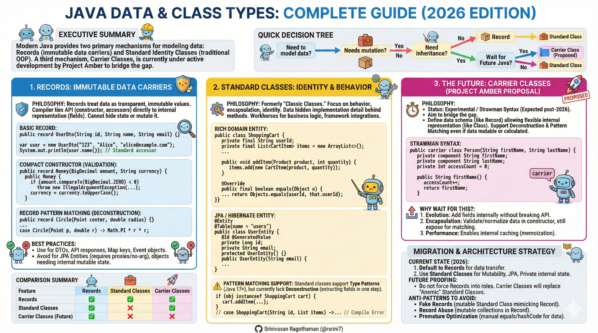
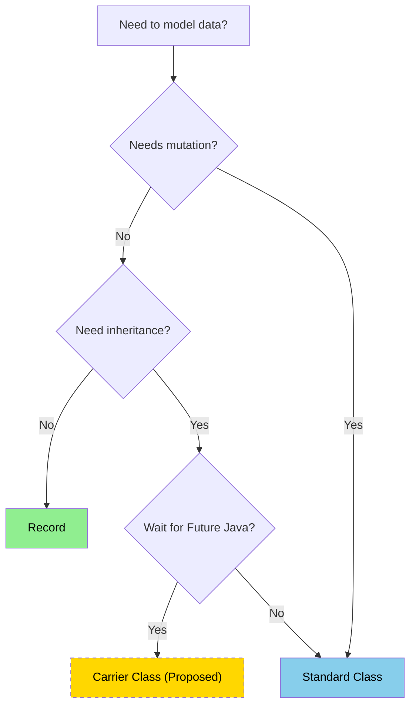

# Java Data & Class Types: Complete Guide (2026 Edition)



---

## Executive Summary

Modern Java provides two primary mechanisms for modeling data: **Records** (immutable data carriers) and **Standard Identity Classes** (traditional OOP). A third mechanism, **Carrier Classes**, is currently under active development by Project Amber to bridge the gap between them.

## Quick Decision Tree



---

## 1. Records: Immutable Data Carriers

### Philosophy

Records treat data as transparent, immutable values. The compiler ties the API (constructor, accessors) directly to the internal representation (fields). You cannot hide state or mutate it.

### Code Examples

#### Basic Record

```java
// Pure data carrier
public record UserDto(String id, String name, String email) {}

// Usage
var user = new UserDto("123", "Alice", "alice@example.com");
System.out.println(user.name()); // Standard accessor (no "get" prefix)

```

#### Compact Constructor (Validation)

```java
public record Money(BigDecimal amount, String currency) {
    // Compact constructor for validation
    public Money {
        if (amount.compareTo(BigDecimal.ZERO) < 0) {
            throw new IllegalArgumentException("Amount cannot be negative");
        }
        currency = currency.toUpperCase();
    }
}

```

#### Record Pattern Matching (Deconstruction)

```java
public record Circle(Point center, double radius) {}
public record Rectangle(Point topLeft, Point bottomRight) {}

// Java 21+ Record Patterns
double area(Object shape) {
    return switch (shape) {
        // Deconstructs the object directly into variables
        case Circle(Point p, double r) -> Math.PI * r * r;
        case Rectangle(Point p1, Point p2) -> Math.abs((p2.x() - p1.x()) * (p2.y() - p1.y()));
        default -> 0;
    };
}

```

### Best Practices

* **Use for:** DTOs, API responses, Map keys, Event objects.
* **Avoid for:** JPA Entities (Hibernate requires proxies/no-arg constructors), objects requiring internal mutable state.

---

## 2. Standard Classes: Identity & Behavior

### Philosophy

Formerly "Classic Classes." These focus on behavior, encapsulation, and identity. Data is often an implementation detail hidden behind methods. These are the workhorses for business logic and framework integrations.

### Code Examples

#### Rich Domain Entity

```java
public class ShoppingCart {
    // State is encapsulated and mutable
    private final String userId;
    private final List<CartItem> items = new ArrayList<>();
    
    public ShoppingCart(String userId) {
        this.userId = userId;
    }

    // Behavior-driven API
    public void addItem(Product product, int quantity) {
        // Logic to update state
        items.add(new CartItem(product, quantity));
    }
    
    // Identity relies on specific fields (often just ID)
    @Override
    public final boolean equals(Object o) {
        if (this == o) return true;
        if (!(o instanceof ShoppingCart that)) return false;
        return Objects.equals(userId, that.userId);
    }
}

```

#### JPA / Hibernate Entity

```java
@Entity
@Table(name = "users")
public class UserEntity {
    @Id
    @GeneratedValue
    private Long id;
    
    // Mutable fields required by frameworks
    private String email;
    
    // Protected no-arg constructor for proxying
    protected UserEntity() {}
    
    public UserEntity(String email) {
        this.email = email;
    }
}

```

### Pattern Matching Support

Standard classes support **Type Patterns** (Java 17+), but currently lack **Deconstruction** (extracting fields in one step).

```java
// Type Pattern Matching (Works)
if (obj instanceof ShoppingCart cart) {
    cart.addItem(product, 1);
}

// Deconstruction (Does NOT Work yet for classes)
// case ShoppingCart(String id, List items) -> ... // Compile Error

```

---

## 3. The Future: Carrier Classes (Project Amber Proposal)

### Philosophy

*Status: Experimental / Strawman Syntax (Expected post-2026)*

Carrier Classes aim to bridge the gap. They allow you to define a data schema (like a Record) while allowing flexible internal representation (like a Class). They support **Deconstruction** and **Pattern Matching** even if the data is mutable or calculated.

### Proposed Concepts

#### Strawman Syntax

```java
// "carrier" keyword signals a data-centric class
public carrier class Person(String firstName, String lastName) {
    
    // "component" keyword binds this field to the API contract
    private component String firstName;
    private component String lastName;
    
    // You can add arbitrary mutable state (unlike Records)
    private int accessCount = 0;

    public String firstName() {
        accessCount++;
        return firstName;
    }
}

```

#### Why wait for this?

1. **Evolution:** You can add fields internally without breaking the external constructor/deconstructor API.
2. **Encapsulation:** You can validate or normalize data inside the constructor but still expose it for pattern matching.
3. **Performance:** Enables internal caching (memoization) which is impossible in strict Records.

---

## Comparison Summary

| Feature | Records | Standard Classes | Carrier Classes (Future) |
| --- | --- | --- | --- |
| **Primary Goal** | Transparent Data | Encapsulated Behavior | Flexible Data |
| **Immutability** | Strict (Enforced) | Optional | Optional |
| **Pattern Matching** | Full (Deconstruction) | Type Check Only | Full (Deconstruction) |
| **Fields** | Final Only | Any | Any |
| **Inheritance** | None (Final) | Full | Supported |
| **JPA Support** | Poor | Excellent | Likely Good |

## Migration & Architecture Strategy

### Current State (2026)

1. **Default to Records** for all data transfer (DTOs, Config, Events).
2. **Use Standard Classes** when you need:
* Mutability (counters, accumulators).
* JPA/Database Entities.
* Private internal state that is *not* exposed in the API.


### Future Proofing

* Do not force Records into roles they don't fit (e.g., "Active Records" with database logic).
* When Carrier Classes arrive, they will replace many uses of "Anemic" Standard Classes (classes that are just getters/setters/equals/hashCode).

### Anti-Patterns to Avoid

* **Fake Records:** Making a Standard Class immutable just to mimic a Record manually. It creates boilerplate without the compiler benefits.
* **Record Abuse:** Storing arrays or mutable collections inside a Record. This breaks the guarantee of immutability.
* **Premature Optimization:** Avoid writing your own `equals()`/`hashCode()` for data classes; let Records handle it.

### References

#### **Primary Source (Carrier Classes Proposal)**

* **Video:** [Carrier Classes; Beyond Records - Inside Java Newscast #105](https://www.youtube.com/watch?v=cpGceyn7DBE)
* *Published:* January 22, 2026
* *Host:* Nicolai Parlog (Java Developer Advocate, Oracle)
* *Key Content:* Explains the "strawman" syntax for Carrier Classes, component fields, and the distinction between internal representation vs. external API commitment.


#### **Mailing List Discussions (Project Amber)**

* **"Data Oriented Programming: Beyond Records"** by Brian Goetz
* *Context:* This is the mailing list proposal discussed in the video. It outlines the philosophy of generalizing records into "Carrier Classes" to allow for mutability and evolution while maintaining data-oriented semantics.
* *Source:* [OpenJDK Amber-Spec-Experts Mailing List](https://www.google.com/search?q=https://mail.openjdk.org/pipermail/amber-spec-experts/) (Search for "Beyond Records" in the 2025-2026 archives).


#### **Standard Java Specifications (Existing Features)**

* **JEP 395: Records** (Delivered in Java 16)
* Defines the semantics of immutable data carriers.


* **JEP 440: Record Patterns** (Delivered in Java 21)
* Enables the deconstruction of records in `switch` and `instanceof`.


* **JEP 441: Pattern Matching for switch** (Delivered in Java 21)
* The foundation for type pattern matching used in Standard Classes.


#### **Related Concepts**

* **Project Valhalla (Value Classes):** Often confused with Carrier Classes. Valhalla focuses on memory layout and "flatness" (performance), whereas Carrier Classes (Amber) focus on the *programming model* (API definition and pattern matching).