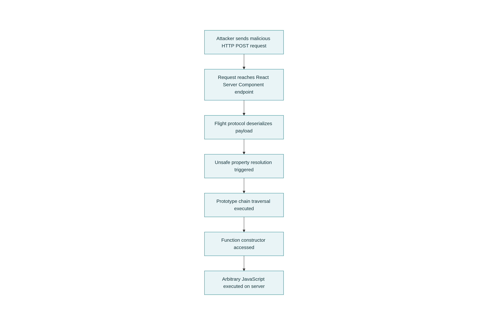
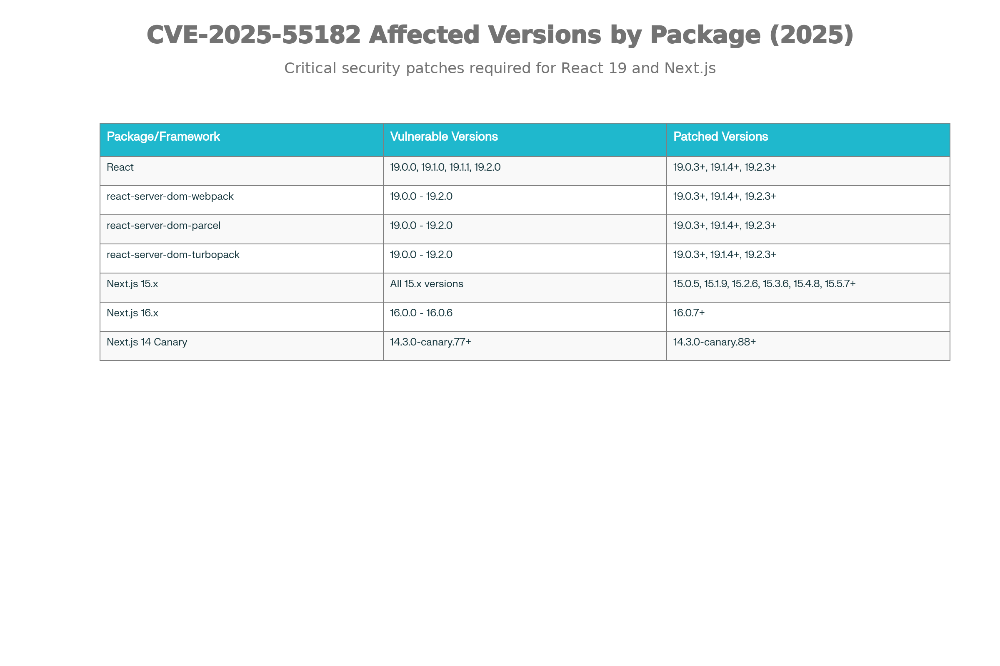
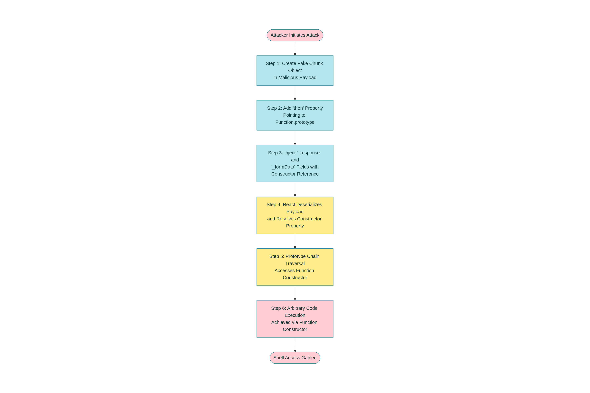
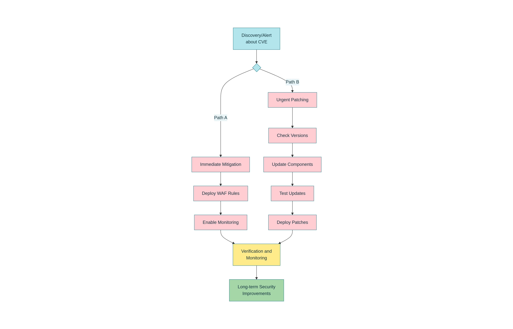

# React2Shell (CVE-2025-55182) Security Whitepaper

## Executive Summary

React2Shell is a critical remote code execution (RCE) vulnerability affecting React Server Components, the modern server-side rendering feature introduced in React 19. Assigned CVE-2025-55182 with the maximum severity rating of CVSS 10.0, this vulnerability allows unauthenticated attackers to execute arbitrary code on vulnerable servers with a single HTTP POST request. Since its disclosure on December 3, 2025, the vulnerability has been actively exploited by state-sponsored threat actors and cybercriminals, affecting an estimated 165,000+ vulnerable IP addresses globally. This whitepaper provides a complete technical breakdown, real-world exploitation examples, remediation strategies, and detection methods.

---

## 1. What is React2Shell?

### 1.1 Basic Definition

React2Shell is the colloquial name for CVE-2025-55182, a critical vulnerability in how React Server Components (RSC) handles data received from clients. The name is a reference to Log4Shell, the severe Apache Log4j vulnerability discovered in 2021. Both vulnerabilities have a CVSS score of 10.0, indicating maximum severity.

The vulnerability exploits a flaw in React's Flight protocol—the mechanism responsible for serializing and deserializing data between the client and server in React Server Components applications. Because the server does not properly validate incoming Flight protocol payloads, attackers can inject malicious data structures that trigger unsafe property resolution in JavaScript objects, ultimately leading to arbitrary code execution.

### 1.2 Why is It Called "React2Shell"?

The name follows the naming convention of Log4Shell:
- **Log4Shell**: Log4j library → Log4Shell
- **React2Shell**: React Server Components → React2Shell

The "2" represents "to" (as in "Shell"), making it a play on words indicating the vulnerability's ability to give attackers a "shell" or direct command execution capability on the server.

### 1.3 Key Statistics

| Metric | Value |
|--------|-------|
| CVE ID | CVE-2025-55182 (React), CVE-2025-66478 (Next.js - merged) |
| CVSS Score | 10.0 (Maximum Severity) |
| Attack Complexity | Low (Simple HTTP request) |
| Authentication Required | No (Unauthenticated) |
| User Interaction | No |
| Disclosure Date | December 3, 2025 |
| Discovered By | Lachlan Davidson |
| Active Exploitation | Yes (Within 30 hours of disclosure) |
| Estimated Vulnerable Systems | 165,000+ IPs, 644,000+ domains |

---

## 2. What React Server Components Are (Simple Explanation)

Before understanding the vulnerability, you need to understand React Server Components.

### 2.1 Traditional React Applications

In a normal React application:

1. **Client sends request** → Browser asks server for the webpage
2. **Server sends JavaScript** → Server sends a large JavaScript file to the browser
3. **Browser renders** → Your computer downloads and runs the JavaScript to display the page
4. **Client fetches data** → The JavaScript running in your browser makes separate API calls to get data from the database
5. **Browser updates** → The page updates with the received data

**Problem**: This approach requires sending all the JavaScript code to the browser, and then the browser must call the API separately. This can be slow and inefficient.

### 2.2 React Server Components (Better Approach)

React Server Components work differently:

1. **Client sends request** → Browser asks for the page
2. **Server does heavy work** → The server directly accesses the database and does expensive operations
3. **Server sends rendered HTML** → Instead of sending JavaScript, the server sends a pre-built, rendered component with data already included
4. **Client receives ready page** → The browser gets a page that's already built with all the data
5. **Page displays immediately** → No waiting for separate API calls

**Benefits**:
- Faster loading (no waiting for API calls)
- Better Search Engine Optimization (SEO)
- Can keep sensitive information on the server
- Smaller JavaScript files sent to browsers

### 2.3 The Problem: How Data Travels Between Client and Server

To send data between client and server in React Server Components, React uses a special format called the **Flight Protocol**. This is essentially a custom serialization format (a way to convert JavaScript objects into text that can be sent over the internet).

The Flight Protocol handles:
- Server function calls from the client
- Passing data and arguments
- References to server-side functions
- Complex JavaScript objects

When the server receives this data, it must "deserialize" it—convert the text back into JavaScript objects. This is where the vulnerability exists.

---

## 3. Understanding the Vulnerability: Technical Deep Dive

### 3.1 The Root Cause in Plain English

The vulnerability occurs because React's Flight protocol decoder **doesn't properly check if properties belong to the object before accessing them**.

**Normal scenario (how it should work)**:
```
Server receives: { name: "John", age: 30 }
Server checks: "name" belongs to this object? Yes → Access it
Server checks: "age" belongs to this object? Yes → Access it
Server checks: "toString" belongs to this object? No → Don't access it
```

**Vulnerable scenario (what React was doing)**:
```
Server receives: { name: "John", age: 30, constructor: [malicious code] }
Server checks: "constructor" belongs to this object? ...doesn't check properly
Server accesses: constructor property without verification
Result: Attacker's code runs!
```

### 3.2 JavaScript Prototypes and Prototype Chain

To understand the exploit better, you need to know about JavaScript's prototype chain.

Every JavaScript object has hidden properties it inherits from its prototype:

```javascript
// Normal object
const person = { name: "John" };
person.name                    // "John" - direct property
person.toString()              // inherited from prototype
person.constructor             // inherited from prototype
person.__proto__               // hidden reference to prototype
```

The prototype chain allows objects to share functionality. However, if you can access the `constructor` property, you can access the `Function` constructor, which allows executing arbitrary code.

### 3.3 The Attack Chain Simplified

**Step 1: Attacker crafts malicious payload**
```javascript
{
  _response: {
    resolved_model: [
      {
        then: function_prototype_then,
        constructor: Function,
        _: [malicious_code]
      }
    ]
  }
}
```

**Step 2: Attacker sends this payload to a React Server Component endpoint**
```
POST /api/server-function
Content-Type: multipart/form-data

[malicious payload from Step 1]
```

**Step 3: Server deserializes the payload**
The Flight protocol decoder processes the data and attempts to resolve the properties.

**Step 4: Vulnerable property resolution**
Instead of checking if `constructor` is a direct property of the object, React accesses it without proper validation.

**Step 5: Function constructor accessed**
The attacker's reference to the `Function` constructor allows them to create executable functions.

**Step 6: Code execution**
The attacker's code runs with the same privileges as the Node.js server process.

### 3.4 Real Exploitation Code Pattern

Based on public proofs-of-concept, here's the typical attack pattern:

```javascript
// Attacker crafts this structure
const payload = {
  // Fake chunk object
  "0": {
    $$typeof: Symbol.for('react.server.object'),
    _owner: null,
    _status: -1,
    _value: {
      then: (fn) => fn({}),
      _response: {
        resolved_model: {
          ":constructor": {
            ":console": {
              ":log": Function("return process.mainModule.require('child_process').execSync('whoami')")()
            }
          }
        }
      }
    }
  }
};

// Send via HTTP POST to /server-function endpoint
// Server deserializes this → Code executes → Attacker gets shell access
```

---

## 4. Why React Server Components Are Vulnerable

### 4.1 The Architecture Problem

React Server Components face a fundamental challenge: they must safely serialize and deserialize JavaScript objects across a network without allowing arbitrary code execution. This is exceptionally difficult because:

1. **Objects contain both data AND code** → JavaScript objects aren't just data (like `{name: "John"}`); they include methods and functions
2. **Prototype chain is complex** → Objects inherit properties through prototypes, making it hard to know what's "safe" to access
3. **Performance optimization** → React tried to optimize by trusting that Flight protocol data was valid, but this led to skipping security checks

### 4.2 Why Next.js Was Hit Harder

While the vulnerability affects React, Next.js is more severely impacted for a specific reason:

**React (default behavior)**: Server Components must be explicitly opted into. Applications must consciously use RSC features.

**Next.js (default behavior)**: Starting with the "App Router" in Next.js 13, server components are the DEFAULT. Any file in the `/app` directory is treated as a server component unless explicitly marked as a client component.

This means:
- A default Next.js installation is vulnerable without any code changes
- Many developers didn't even realize they were using server components
- Much larger attack surface

---

## 5. Real-World Impact and Exploitation

### 5.1 Timeline of Exploitation

| Date | Event |
|------|-------|
| Nov 29, 2025 | Lachlan Davidson reports vulnerability to Meta |
| Dec 3, 2025 | React and Vercel publicly disclose CVE-2025-55182 |
| Dec 3, 2025 (30 min) | First proof-of-concept (PoC) released publicly |
| Dec 3-5, 2025 | 4,100+ exploitation attempts detected |
| Dec 4, 2025 | China-nexus threat groups begin mass exploitation |
| Dec 8, 2025 | 165,000+ vulnerable IPs identified |
| Dec 11, 2025 | Additional vulnerabilities found (DoS and source code exposure) |
| Dec 12-20, 2025 | Post-exploitation activity: backdoors, cryptominers, lateral movement |

### 5.2 Post-Exploitation Activities Observed

Once attackers compromise a server through React2Shell, they typically:

1. **Reconnaissance**: Gather system information (`uname`, `id`, `hostname`)
2. **Credential theft**: Extract environment variables, API keys, database credentials
3. **Persistent access**: Install backdoors, web shells, rootkits
4. **Lateral movement**: Use compromised server to attack internal networks
5. **Resource hijacking**: Install cryptominers (XMRIG, etc.)
6. **Data exfiltration**: Steal source code, customer data, secrets

### 5.3 Malware Variants Deployed

Security researchers identified these malware variants installed via React2Shell exploitation:

| Malware | Type | Function |
|---------|------|----------|
| Cobalt Strike | Remote Access Trojan (RAT) | Attacker command execution |
| EtherRAT | RAT with blockchain C2 | Bypasses firewall restrictions |
| Noodle RAT | RAT | Command execution and file access |
| SNOWLIGHT | Malware dropper | Downloads additional payloads |
| VShell | RAT | Remote shell access |
| KSwapDoor | Linux backdoor | P2P mesh network C2 |
| XMRIG | Cryptominer | Steals CPU resources for cryptocurrency |

### 5.4 Threat Actors Involved

**State-Sponsored (Confirmed)**:
- **Earth Lamia / UNC5454**: China-nexus, rapid exploitation
- **Jackpot Panda**: China-nexus APT group
- **UNC5174 / CL-STA-1015**: China-nexus Initial Access Broker
- **UNC5342**: Suspected North Korea (DPRK) connection, uses EtherHiding technique

**Cybercriminals (Observed)**:
- Opportunistic attackers targeting easy-to-exploit systems
- Botnet operators distributing Mirai and similar malware
- Cryptocurrency theft groups

---

## 6. Affected Frameworks and Applications

### 6.1 Directly Affected Packages

The vulnerability exists in:

- `react-server-dom-webpack` (versions 19.0.0-19.2.0)
- `react-server-dom-parcel` (versions 19.0.0-19.2.0)
- `react-server-dom-turbopack` (versions 19.0.0-19.2.0)

### 6.2 Affected Frameworks

Applications vulnerable include:

- **Next.js**: Versions 15.x and 16.x (App Router), Canary builds from 14.3.0-canary.77
- **React Router**: With unstable RSC APIs
- **Waku**: Full-stack React framework
- **Redwood SDK**: Modern web framework
- **Remix** (if using RSC features)
- **Custom RSC implementations**: Any app using the vulnerable packages

### 6.3 Critical Consideration: Default Vulnerability

A standard Next.js application created with `create-next-app` and built for production is vulnerable without any developer code changes. This is because:

1. Next.js 13+ uses the App Router by default
2. App Router uses React Server Components by default
3. All default configurations include the vulnerable Flight protocol

---

## 7. How to Check If You're Vulnerable

### 7.1 Quick Check Checklist

Answer these questions to determine vulnerability:

✓ Are you using React 19.0, 19.1, or 19.2 (check `package.json`)?
✓ Are you using Next.js 15.x or 16.x?
✓ Are you using the App Router in Next.js (has `/app` directory)?
✓ Do your React dependencies include `react-server-dom-webpack`, `-parcel`, or `-turbopack`?

**If you answered YES to any of these, you are likely vulnerable.**

### 7.2 Check Your package.json

Look for these lines in your `package.json`:

```json
{
  "dependencies": {
    "react": "19.0.0 or 19.1.0 or 19.1.1 or 19.2.0",
    "react-dom": "19.0.0 or 19.1.0 or 19.1.1 or 19.2.0",
    "next": "15.x or 16.x"
  }
}
```

### 7.3 Check Your lock file

Run this command to verify exact versions installed:

```bash
# For npm
npm list react react-dom react-server-dom-webpack

# For yarn
yarn list react react-dom react-server-dom-webpack

# For pnpm
pnpm list react react-dom react-server-dom-webpack
```

### 7.4 Automated Scanning Tools

Several tools can automatically detect vulnerability:

- **Snyk**: `snyk test` detects vulnerable dependencies
- **npm audit**: `npm audit` shows security vulnerabilities
- **Dependabot**: GitHub's automated dependency checker
- **Trivy**: Container vulnerability scanner
- **WhiteSource**: Software composition analysis

---

## 8. How to Fix the Vulnerability

### 8.1 Step-by-Step Patching Guide

**Important**: The first patch (19.0.1, 19.1.2, 19.2.1) was incomplete. You must patch to the second version (19.0.3+, 19.1.4+, 19.2.3+).

#### For React Applications:

**Step 1: Check your current version**
```bash
npm list react react-dom
```

**Step 2: Update to patched version**

If using React 19.0.x:
```bash
npm install react@19.0.3 react-dom@19.0.3 react-server-dom-webpack@19.0.3
```

If using React 19.1.x:
```bash
npm install react@19.1.4 react-dom@19.1.4 react-server-dom-webpack@19.1.4
```

If using React 19.2.x:
```bash
npm install react@19.2.3 react-dom@19.2.3 react-server-dom-webpack@19.2.3
```

**Step 3: Verify lock file**
```bash
npm ci  # or yarn install (not npm install)
```

**Step 4: Clear caches**
```bash
npm cache clean --force
rm -rf node_modules
npm install
```

**Step 5: Rebuild and redeploy**
```bash
npm run build
npm run start  # or your deployment process
```

#### For Next.js Applications:

**Step 1: Check your current version**
```bash
npm list next
```

**Step 2: Find your version line and update accordingly**

For Next.js 15.0.x:
```bash
npm install next@15.0.5
```

For Next.js 15.1.x:
```bash
npm install next@15.1.9
```

For Next.js 15.2.x:
```bash
npm install next@15.2.6
```

For Next.js 15.3.x:
```bash
npm install next@15.3.6
```

For Next.js 15.4.x:
```bash
npm install next@15.4.8
```

For Next.js 15.5.x:
```bash
npm install next@15.5.7
```

For Next.js 16.x:
```bash
npm install next@16.0.7
```

**Step 3-5**: Same as React (verify, clear, rebuild)

### 8.2 Verification After Patching

**Method 1: Check package.json**
```bash
npm list | grep "react\|next"
# All versions should show 19.0.3+, 19.1.4+, 19.2.3+ (React) or 15.0.5+ (Next.js)
```

**Method 2: Run security audit**
```bash
npm audit
# Should show no vulnerabilities related to CVE-2025-55182
```

**Method 3: Check in code (Node.js)**
```javascript
const React = require('react');
console.log(React.version);  // Should be 19.0.3+ or higher
```

---

## 9. Temporary Mitigation While Patching

### 9.1 WAF (Web Application Firewall) Rules

While you patch, Web Application Firewalls can provide temporary protection. However, **WAF rules are NOT a substitute for patching**.

#### Common Detection Patterns

Block requests to React Server Component endpoints that contain:

1. `POST` requests with `next-action` or `rsc-action-id` headers
2. Request body containing: `constructor`, `__proto__`, `prototype`
3. Multipart form data with suspicious serialized objects
4. Requests with `_response`, `_formData`, `resolved_model` fields

#### Example WAF Rules

**For Cloudflare:**
```
(http.request.method eq "POST") and
(any(http.request.headers.names[*] matches "(?i)next-action|rsc-action-id")) and
(http.request.body.raw contains "constructor" or
 http.request.body.raw contains "__proto__" or
 http.request.body.raw contains ":constructor")
```

**For AWS WAF:**
```json
{
  "Name": "ReactServerComponentsRCE",
  "Priority": 0,
  "Statement": {
    "AndStatement": {
      "Statements": [
        {
          "ByteMatchStatement": {
            "SearchString": "POST",
            "FieldToMatch": {"Method": {}},
            "TextTransformations": [{"Priority": 0, "Type": "NONE"}],
            "PositionalConstraint": "EXACTLY"
          }
        },
        {
          "RegexMatchStatement": {
            "RegexString": "(?i)(?:next-action|rsc-action-id)",
            "FieldToMatch": {"Headers": {"Name": "all"}},
            "TextTransformations": [{"Priority": 0, "Type": "NONE"}]
          }
        },
        {
          "OrStatement": {
            "Statements": [
              {
                "ByteMatchStatement": {
                  "SearchString": "constructor",
                  "FieldToMatch": {"Body": {}},
                  "PositionalConstraint": "CONTAINS"
                }
              },
              {
                "ByteMatchStatement": {
                  "SearchString": "__proto__",
                  "FieldToMatch": {"Body": {}},
                  "PositionalConstraint": "CONTAINS"
                }
              }
            ]
          }
        }
      ]
    }
  },
  "Action": {"Block": {}},
  "VisibilityConfig": {
    "SampledRequestsEnabled": true,
    "CloudWatchMetricsEnabled": true,
    "MetricName": "ReactServerComponentsRCE"
  }
}
```

### 9.2 Network-Level Mitigations

1. **Rate limiting**: Limit requests to Server Component endpoints
2. **IP whitelisting**: Only allow known client IP ranges
3. **Request size limits**: Reject unusually large POST bodies
4. **Disable Server Components**: Temporarily disable if not critical (not recommended for long-term)

### 9.3 Runtime Protections

- **Enable process monitoring**: Alert on unexpected child processes spawned by Node.js
- **Use RASP (Runtime Application Self-Protection)**: Real-time blocking of malicious requests
- **Monitor outbound connections**: Detect data exfiltration attempts

---

## 10. Detection and Monitoring

### 10.1 Log Indicators

Monitor server logs for:

1. **Unusual POST requests** to RSC endpoints with large payloads
2. **Requests with `constructor`, `__proto__`, `prototype`** keywords
3. **Base64-encoded payloads** in request bodies
4. **Rapid failures** in Flight protocol decoding
5. **Errors related to**: "Cannot read property of undefined", "prototype pollution"

### 10.2 System-Level Indicators

Monitor the system running your Node.js application for:

| Indicator | Command to Check |
|-----------|-----------------|
| Unexpected child processes | `ps aux \| grep node` |
| New cron jobs | `crontab -l` |
| New users | `cat /etc/passwd` |
| Suspicious network connections | `netstat -tuln` |
| Modified files in app directory | `find /app -newer <deployment_date>` |
| Unusual CPU/memory usage | `top`, `htop` |

### 10.3 Detection Queries

**For Sysdig/Falco (Container security)**:
```yaml
- rule: Node RCE Execution
  desc: Detect shell spawned from Node.js process
  condition: >
    spawned_process and 
    container and 
    process.parent.name = "node" and
    (process.name in (bash, sh, zsh, cmd.exe, powershell))
  output: >
    Suspicious process spawned from Node.js
    (user=%user.name command=%proc.cmdline parent=%proc.pname)
```

**For Security Information and Event Management (SIEM)**:
```
index=main process.parent=node (process=bash OR process=sh OR process=cmd.exe OR process=powershell)
| stats count by host, user
| where count > 0
```

---

## 11. Understanding the Fix

### 11.1 What React Changed

The patch added a critical security check: the `hasOwnProperty` method.

**Before (vulnerable)**:
```javascript
function getOutlinedModel(response, id, model) {
  const object = {};
  for (const key in model) {
    object[key] = model[key];  // ← No check if key is safe!
  }
  return object;
}
```

**After (patched)**:
```javascript
function getOutlinedModel(response, id, model) {
  const object = {};
  for (const key in model) {
    if (Object.prototype.hasOwnProperty.call(model, key)) {
      object[key] = model[key];  // ← Only copy direct properties!
    }
  }
  return object;
}
```

The `hasOwnProperty` check ensures that only properties directly belonging to the object are accessed, preventing prototype chain traversal.

### 11.2 Why This Works

- **Before**: Any property, including inherited ones like `constructor` and `__proto__`, could be accessed
- **After**: Only properties explicitly defined on the object can be accessed
- **Result**: Prototype pollution attacks fail because `constructor` is an inherited property, not a direct property

---

## 12. Solutions and Best Practices

### 12.1 Immediate Actions (Do This Now)

1. **Upgrade immediately** to patched versions (19.0.3+, 19.1.4+, 19.2.3+)
2. **Verify deployment** of updated versions
3. **Monitor logs** for exploitation attempts
4. **Check for compromise** signs (see Section 10)

### 12.2 Short-Term Actions (This Week)

1. **Implement WAF rules** as temporary protection
2. **Conduct security audit** of your application
3. **Review recent logs** for suspicious activity (last 72 hours)
4. **Inventory all applications** using React Server Components
5. **Prioritize public-facing services** for patching first

### 12.3 Long-Term Actions (This Month)

1. **Establish dependency update process** (don't wait for crises)
2. **Implement automated scanning** (Snyk, Dependabot)
3. **Deploy runtime monitoring** (Falco, runtime WAF)
4. **Security training** for development team on RSC risks
5. **Test your incident response** with a mock exploitation scenario

### 12.4 Never Do These

- ❌ Don't rely only on WAF rules as permanent fix
- ❌ Don't disable Server Components without understanding implications
- ❌ Don't skip the second patch (19.0.3+, 19.1.4+, 19.2.3+)
- ❌ Don't assume "no one would target us"—exploitation is automated
- ❌ Don't delay patching for convenience

---

## 13 Visual Aids

**Chart 1: Attack Flow Diagram**




React2Shell Attack Flow: How CVE-2025-55182 Exploits the Flight Protocol

Shows the step-by-step progression from malicious HTTP request → deserialization → prototype chain traversal → code execution

**Chart 2: Affected Versions and Patches Table**



CVE-2025-55182 Affected Versions and Patches

Comprehensive table of all vulnerable versions with corresponding patched versions for:

- React packages (19.0.0-19.2.0 → 19.0.3+, 19.1.4+, 19.2.3+)
- react-server-dom-webpack/parcel/turbopack
- Next.js versions (15.x and 16.x)

**Chart 3: Prototype Chain Traversal Diagram**



Prototype Chain Traversal: How React2Shell Achieves Code Execution

Technical illustration showing how attackers leverage JavaScript prototypes, constructors, and the Function object to achieve arbitrary code execution

**Chart 4: Remediation Timeline**



React2Shell Remediation Timeline: Immediate Actions to Long-Term Security

Flowchart showing parallel remediation tracks: immediate mitigation (WAF) and urgent patching, converging at verification and long-term improvements

---

## 14. FAQs

**Q: Do I need to patch if I'm using Pages Router (not App Router)?**
A: No, the Pages Router is not affected. Only the App Router (introduced in Next.js 13) is vulnerable.

**Q: If I'm not using Server Functions, am I safe?**
A: No. The vulnerability affects applications that support Server Components, even if Server Functions aren't explicitly used. The vulnerability can be triggered on any endpoint using RSC.

**Q: Can WAF rules protect me permanently?**
A: No. WAF rules provide temporary protection while you patch, but attackers will develop bypasses. Patching is the only permanent solution.

**Q: How long did it take for exploits to become available?**
A: Approximately 30 minutes to 1 hour after the official disclosure. Proof-of-concepts spread very quickly.

**Q: If I patch, do I need WAF rules?**
A: No, WAF rules become unnecessary after patching. However, they don't hurt as an additional layer.

**Q: Can my development environment be affected?**
A: If you have `npm` packages with this vulnerability, yes. However, development usually isn't internet-facing, so the risk is lower. Still patch to be safe.

**Q: What if I'm on React 18 or earlier?**
A: You are not affected. The vulnerability only affects React 19 with Server Components.

---

## 15. Conclusion

React2Shell (CVE-2025-55182) represents a critical threat to the modern web development ecosystem. With a CVSS score of 10.0, active exploitation by state-sponsored and criminal threat actors, and a default vulnerable configuration in Next.js, immediate action is required.

The vulnerability is straightforward to exploit but easy to fix with proper patching. Organizations using React Server Components must prioritize upgrading to versions 19.0.3+, 19.1.4+, 19.2.3+ for React and the corresponding patched versions for Next.js and other frameworks.

Beyond patching, implementing defense-in-depth strategies including WAF rules, runtime monitoring, and regular security audits will significantly reduce your risk profile.

The key takeaway: **Patch immediately, verify the patch, and monitor for exploitation attempts**. Do not delay.

---

## 15. Resources and References

- **Official React Blog**: https://react.dev/blog/2025/12/03/critical-security-vulnerability-in-react-server-components
- **Next.js Security Advisory**: https://nextjs.org/docs/messages/cve-2025-55182
- **NVD CVE Detail**: https://nvd.nist.gov/vuln/detail/CVE-2025-55182
- **React2Shell Official Site**: https://react2shell.com
- **Palo Alto Unit 42 Report**: Comprehensive threat intelligence on post-exploitation
- **Google Cloud Threat Intelligence**: Active threat actor analysis
- **Zscaler ThreatLabz**: Detailed technical analysis
- **OffSec Analysis**: Step-by-step exploit breakdown

---

## Document Information

- **Document Version**: 1.0
- **Created**: January 6, 2026
- **Classification**: Public
- **Last Updated**: January 6, 2026
- **Recommended Review**: Monthly until vulnerability is fully mitigated across industry

---

*This whitepaper is provided for educational and defensive purposes. Organizations are urged to prioritize patching this critical vulnerability immediately.*
