# n8n Security Vulnerabilities: A Comprehensive Whitepaper for Developers and Architects

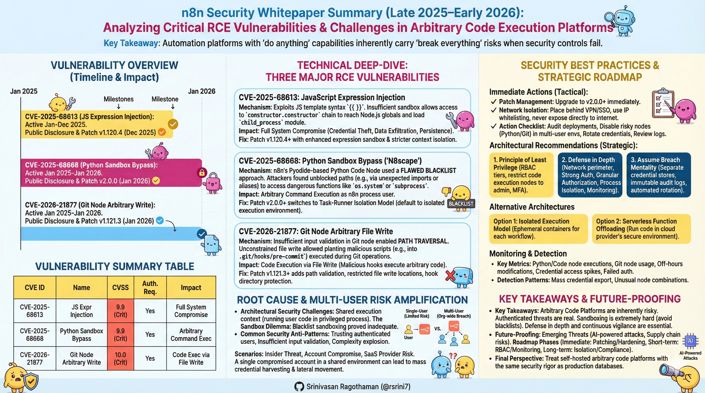

## 🎯 What You Need to Know in 120 Seconds

**𝗻𝟴𝗻'𝘀 𝟮𝟬𝟮𝟱 𝗥𝗖𝗘 𝗖𝗵𝗮𝗶𝗻: 𝗪𝗵𝘆 𝗔𝗿𝗯𝗶𝘁𝗿𝗮𝗿𝘆 𝗖𝗼𝗱𝗲 𝗔𝘂𝘁𝗼𝗺𝗮𝘁𝗶𝗼𝗻 𝗧𝗼𝗼𝗹𝘀 𝗕𝗲𝗰𝗼𝗺𝗲 𝗦𝗶𝗻𝗴𝗹𝗲 𝗣𝗼𝗶𝗻𝘁𝘀 𝗼𝗳 𝗖𝗼𝗺𝗽𝗿𝗼𝗺𝗶𝘀𝗲**

One authenticated workflow injection → Full server takeover and credential exposure across 400+ integrations?

━━━━━━━━━━━━━━━━━━━━

⚡ **𝗧𝗵𝗲 𝗣𝗿𝗼𝗯𝗹𝗲𝗺: 𝗦𝗶𝗻𝗴𝗹𝗲 𝗣𝗼𝗶𝗻𝘁 𝗼𝗳 𝗙𝗮𝗶𝗹𝘂𝗿𝗲 𝗶𝗻 𝗔𝗿𝗯𝗶𝘁𝗿𝗮𝗿𝘆 𝗘𝘅𝗲𝗰𝘂𝘁𝗶𝗼𝗻**

**𝗻𝟴𝗻** (230,000+ active users, 3,000+ enterprises) delivers powerful workflow flexibility but demands deep system access for code nodes and integrations. Recent critical vulnerabilities—including **𝗖𝗩𝗘-𝟮𝟬𝟮𝟱-𝟲𝟴𝟲𝟭𝟯** (CVSS 9.9 RCE via expression injection)—exposed **103,000+ public-facing instances** to full compromise. Consequences: Credential theft across connected services, lateral movement, and average breach costs of **$4.44M** globally.

━━━━━━━━━━━━━━━━━━━━

📈 **𝗧𝗵𝗲 𝗦𝗼𝗹𝘂𝘁𝗶𝗼𝗻: 𝗗𝗲𝗳𝗲𝗻𝘀𝗲-𝗶𝗻-𝗗𝗲𝗽𝘁𝗵 𝗠𝗶𝘁𝗶𝗴𝗮𝘁𝗶𝗼𝗻 𝗛𝗶𝗲𝗿𝗮𝗿𝗰𝗵𝘆**

Security practitioners and vendors emphasize patching first, then isolation and controlled execution—shifting from blacklists to whitelists and offloading where possible.

* **Immediate Patching** → Closes known RCE vectors
* **Feature Restriction** → Eliminates high-risk code paths
* **Isolation + Offload** → Contains and externalizes execution risk

━━━━━━━━━━━━━━━━━━━━

🔧 **𝗖𝗼𝗿𝗲 𝗔𝗿𝗰𝗵𝗶𝘁𝗲𝗰𝘁𝘂𝗿𝗲: 𝗗𝗲𝗳𝗲𝗻𝘀𝗶𝘃𝗲 𝗟𝗮𝘆𝗲𝗿𝘀**

1️⃣ **Patch Layer**: Upgrade to secure versions (`>2.0.0`, disable vulnerable nodes by default)

2️⃣ **Access Boundary**: VPN/firewall enclosure, no public exposure, least-privilege authentication

3️⃣ **Execution Controls**: Whitelist-only operations, disable Code/Python nodes in shared environments

4️⃣ **Monitoring Layer**: Workflow audits, anomaly detection, integrated threat response

━━━━━━━━━━━━━━━━━━━━

🛒 **𝗖𝗼𝗿𝗲 𝗙𝗲𝗮𝘁𝘂𝗿𝗲𝘀: 𝗣𝗿𝗮𝗰𝘁𝗶𝗰𝗮𝗹 𝗠𝗶𝘁𝗶𝗴𝗮𝘁𝗶𝗼𝗻 𝗪𝗼𝗿𝗸𝗳𝗹𝗼𝘄**

1. **Risky Node Disablement** (`Code, Python, Git nodes`) → Blocks injection and sandbox bypass paths

2. **Per-User Instance Isolation** (`Separate deployments`) → Prevents pivot across team workflows

3. **Execution Offload** (`Cloud functions, managed APIs`) → Removes local arbitrary code requirement

4. **Continuous Auditing** (`Log reviews, permission scans`) → Detects malicious workflow insertion early

━━━━━━━━━━━━━━━━━━━━

🛡️ **𝗕𝗲𝗻𝗲𝗳𝗶𝘁𝘀: 𝗥𝗲𝗱𝘂𝗰𝗲𝗱 𝗥𝗶𝘀𝗸 𝗦𝘂𝗿𝗳𝗮𝗰𝗲 & 𝗦𝘆𝘀𝘁𝗲𝗺𝗶𝗰 𝗥𝗲𝘀𝗶𝗹𝗶𝗲𝗻𝗰𝗲**

* **Contained Compromise Scope**: Isolation limits breach to single instance → Prevents enterprise-wide lateral movement across integrations

* **Sustainable Security Posture**: Whitelisting over blacklisting reduces maintenance debt → Enables small teams to maintain defenses without constant edge-case chasing

* **Regulatory Alignment**: Auditable controls and monitoring provide evidence trails → Lowers compliance costs and scrutiny in regulated workflows

* **Risk Transfer**: Offloading execution to specialized providers shifts sandbox complexity → Preserves automation velocity while avoiding self-managed vulnerability chains

━━━━━━━━━━━━━━━━━━━━

⚖️ **𝗦𝘁𝗿𝗮𝘁𝗲𝗴𝗶𝗰 𝗩𝗲𝗿𝗱𝗶𝗰𝘁: 𝗦𝗲𝗹𝗳-𝗛𝗼𝘀𝘁𝗲𝗱 𝘃𝘀. 𝗠𝗮𝗻𝗮𝗴𝗲𝗱 𝗦𝗮𝗮𝗦**

Post-2025 CVE chain, the flexibility of open-source arbitrary code platforms carries mounting execution risk.

**Self-Hosted Open-Source (n8n Community)**
- Strength: Ultimate customization, no lock-in, community nodes
- Risk: Persistent sandbox maintenance, patch application delays in complex setups
- Best for: Single-user or low-sensitivity environments with dedicated security resources

**Managed SaaS Platforms (Zapier, Make, n8n Cloud)**
- Strength: Rapid patching, isolated multi-tenant execution, enterprise-grade monitoring
- Risk: Reduced custom code depth, higher costs at extreme scale
- Best for: Team/enterprise deployments prioritizing availability and compliance

**Watch**: Self-hosted share of n8n deployments. If public-facing instances fall below 50,000 by end-2026 (from 103,000+ peak exposure), managed platforms capture enterprise consolidation.

━━━━━━━━━━━━━━━━━━━━

**𝗧𝗟;𝗗𝗥**
* **Arbitrary code = Arbitrary risk** → Flexibility trades off against compromise surface in shared environments
* **Isolate before scaling** → Per-user instances contain 90%+ of authenticated threats
* **SaaS shift accelerates with breaches** → Control cedes ground to managed security when execution risk dominates

**Will persistent sandbox challenges drive enterprise workflow automation toward managed platforms, or will open-source defenses harden fast enough to retain flexibility advantage?**

👤 **Srinivasan Ragothaman (@rsrini7)**

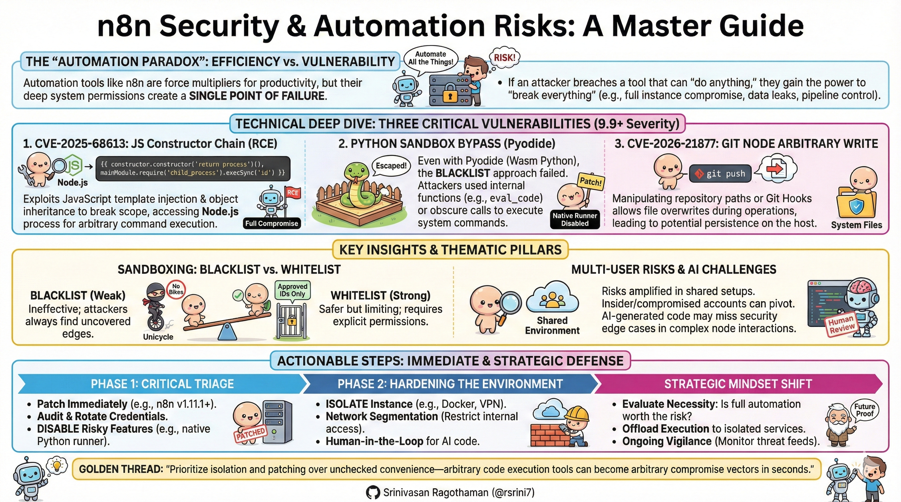

----

## Executive Summary

This whitepaper analyzes critical security vulnerabilities discovered in n8n, an open-source workflow automation platform, between late 2025 and early 2026. Three major authenticated Remote Code Execution (RCE) vulnerabilities—CVE-2025-68613, CVE-2025-68668, and CVE-2026-21877—demonstrate fundamental challenges in securing arbitrary code execution platforms. This document provides technical analysis, architectural insights, and actionable security recommendations for development teams and system architects.

**Key Takeaway**: Automation platforms that promise "do anything" capabilities inherently carry "break everything" risks when security controls fail.

---

## 1. Introduction

### 1.1 About n8n

n8n is a popular open-source workflow automation tool that enables users to create complex integrations between services through a node-based visual interface. It supports:

- 400+ pre-built integrations
- Custom JavaScript and Python code execution
- Self-hosted and cloud deployment options
- Multi-user collaboration features

### 1.2 The Security Challenge

n8n's power stems from its ability to execute arbitrary code and access system resources. This creates an inherent tension between functionality and security—the same features that make it powerful also create a massive attack surface when compromised.

---

## 2. Vulnerability Overview

### 2.1 Timeline of Discoveries

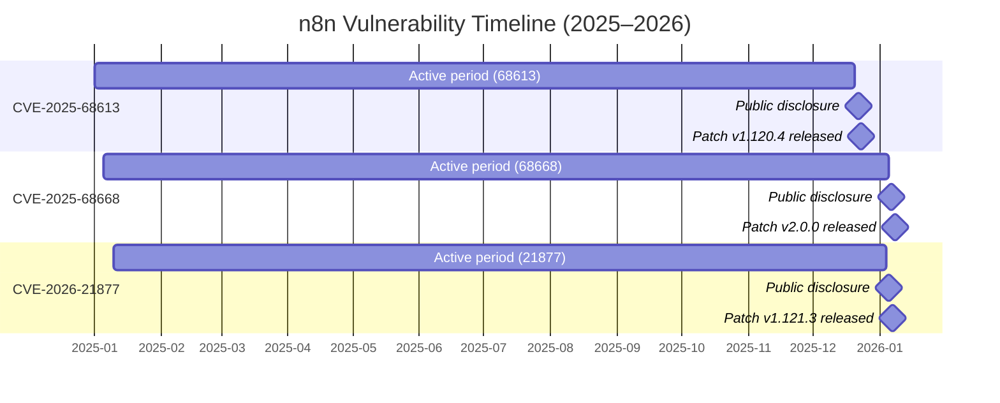

### 2.2 Vulnerability Summary Table

| CVE ID | Name | CVSS Score | Attack Vector | Authentication Required | Impact |
|--------|------|------------|---------------|------------------------|--------|
| CVE-2025-68613 | Expression Injection RCE | 9.9 (Critical) | Workflow expressions | Yes (basic user) | Full system compromise |
| CVE-2025-68668 | N8scape Python Sandbox Bypass | 9.9 (Critical) | Python Code Node | Yes (basic user) | Arbitrary command execution |
| CVE-2026-21877 | Git Node Arbitrary Write | 10.0 (Critical) | Git node file operations | Yes (basic user) | Code execution via file write |

---

## 3. Technical Deep-Dive

### 3.1 CVE-2025-68613: JavaScript Expression Injection

#### Attack Mechanism

The vulnerability exploits n8n's JavaScript expression evaluation system, which allows users to embed dynamic code in workflow nodes using template syntax like `{{ }}`.

**Core Problem**: Insufficient sandboxing of JavaScript execution context allows access to dangerous Node.js internals.

#### Exploitation Path

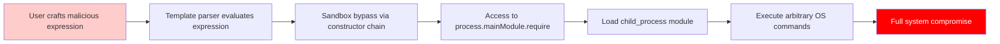

#### Example Attack Vector (Conceptual)

An attacker with workflow edit permissions could inject expressions that:

1. Use prototype pollution techniques to access `Object.constructor`
2. Chain through JavaScript's prototype chain to reach Node.js globals
3. Import dangerous modules like `child_process`
4. Execute system commands (e.g., reverse shells, data exfiltration)

#### Impact Assessment

- **Credential Theft**: Access to all stored API keys, database credentials, OAuth tokens
- **Data Exfiltration**: Read sensitive workflow data, environment variables, filesystem
- **Lateral Movement**: Use n8n as pivot point to attack connected services
- **Persistence**: Modify workflows to maintain access

#### Affected Versions & Remediation

- **Vulnerable**: v0.211.0 through v1.120.3, v1.121.0, pre-v1.122.0
- **Patched**: v1.120.4, v1.121.1, v1.122.0+
- **Fix Approach**: Enhanced expression sandbox with stricter context isolation

---

### 3.2 CVE-2025-68668: Python Sandbox Bypass ("N8scape")

#### Attack Mechanism

n8n's Python Code Node uses Pyodide (WebAssembly-based Python runtime) with a blacklist-based security model to prevent dangerous operations.

**Core Problem**: Blacklist approaches are fundamentally flawed—attackers only need to find ONE unblocked path.

#### Exploitation Path

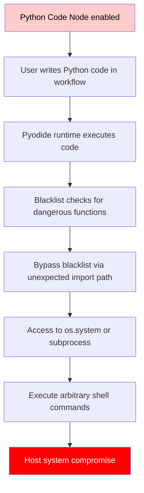

#### Why Blacklists Fail

**Blacklist Approach**: Block known dangerous functions (e.g., `os.system`, `eval`, `__import__`)

**Problem**: Attackers can:
- Use alternative import mechanisms
- Access functions through module aliases
- Exploit transitive dependencies
- Use reflection to discover unblocked paths

**Whitelist Alternative**: Only allow explicitly approved operations (more secure but limiting)

#### Impact Assessment

- **Direct Command Execution**: Run any shell command as the n8n process user
- **File System Access**: Read/write arbitrary files (config, secrets, databases)
- **Network Pivoting**: Use n8n host as attack platform
- **Container Escape**: Potentially break out of containerized deployments

#### Affected Versions & Remediation

- **Vulnerable**: v1.0.0 through v1.x.x (before v2.0.0)
- **Patched**: v2.0.0+ with task-runner isolation model
- **Fix Approach**: Default to isolated execution environment; require explicit opt-in for native Python

---

### 3.3 CVE-2026-21877: Git Node Arbitrary File Write

#### Attack Mechanism

The Git node allows users to interact with Git repositories as part of workflows. Insufficient input validation enables path traversal attacks.

**Core Problem**: Unconstrained file write operations in privileged execution context.

#### Exploitation Path

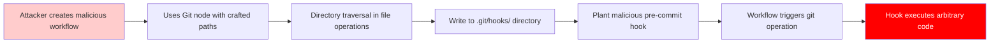

#### Attack Example (Conceptual)

1. Create workflow with Git node
2. Configure clone/pull operation with path like `../../.git/hooks/pre-commit`
3. Inject malicious shell script into hook file
4. Next git operation triggers automatic code execution

#### Impact Assessment

- **Code Execution**: Run arbitrary commands when git operations occur
- **Persistence**: Hooks survive across workflow runs
- **Stealth**: Attacks hidden in legitimate-looking git workflows
- **Privilege Escalation**: Execute code in context of n8n process owner

#### Affected Versions & Remediation

- **Vulnerable**: All versions before v1.121.3
- **Patched**: v1.121.3+
- **Fix Approach**: Path validation, restricted file write locations, hook directory protection

---

## 4. Root Cause Analysis

### 4.1 Architectural Security Challenges

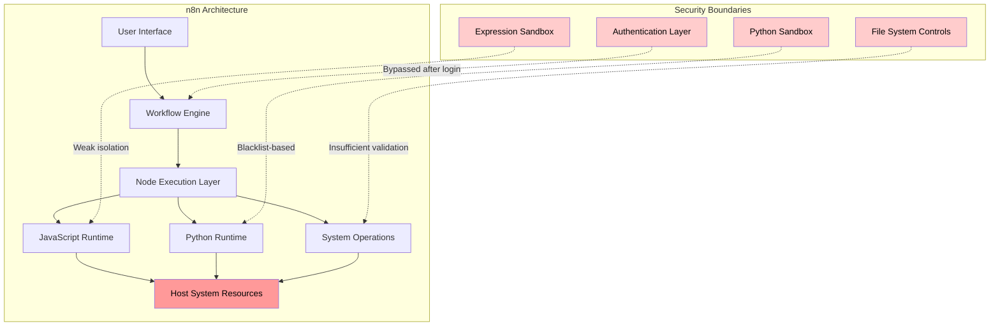

### 4.2 The Sandbox Dilemma

**Flexibility vs. Security Trade-off**:

| Approach | Security Level | Functionality | Complexity |
|----------|---------------|---------------|------------|
| **No Sandbox** | Very Low | Maximum | Low |
| **Blacklist** | Low | High | Medium |
| **Whitelist** | Medium-High | Limited | Medium |
| **Process Isolation** | High | Medium-High | High |
| **VM/Container** | Very High | Medium | Very High |

n8n initially chose blacklist sandboxing for maximum flexibility—this proved catastrophically inadequate.

### 4.3 Common Security Anti-Patterns Identified

1. **Trusting Authenticated Users**: Assuming authenticated = trustworthy
2. **Blacklist Security**: Trying to enumerate all dangerous operations
3. **Insufficient Input Validation**: Not sanitizing user-controlled paths/expressions
4. **Shared Execution Context**: Running user code in privileged process
5. **Complexity Explosion**: Too many features create too many attack surfaces

---

## 5. Multi-User Risk Amplification

### 5.1 Threat Model Comparison

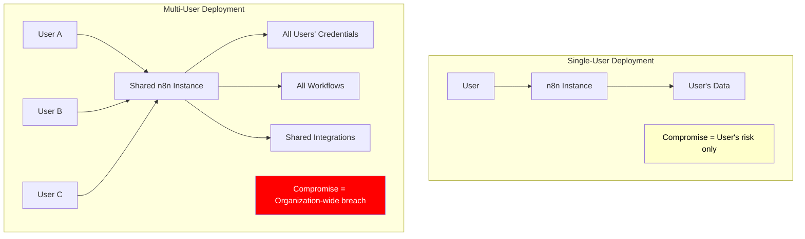

### 5.2 Attack Scenarios in Multi-User Environments

**Scenario 1: Insider Threat**
- Disgruntled employee with basic workflow access
- Exploits CVE-2025-68613 to extract all API keys
- Exfiltrates customer data from connected databases
- Impact: Complete data breach

**Scenario 2: Account Compromise**
- Phishing attack compromises one user's account
- Attacker uses CVE-2025-68668 to establish backdoor
- Lateral movement to other connected services
- Impact: Supply chain attack vector

**Scenario 3: SaaS Provider Risk**
- Cloud-hosted n8n provider gets compromised
- Attacker gains access to thousands of tenant workflows
- Mass credential harvesting across organizations
- Impact: Platform-wide breach affecting all customers

---

## 6. Security Best Practices for Developers and Architects

### 6.1 Immediate Actions (Tactical)

#### Patch Management

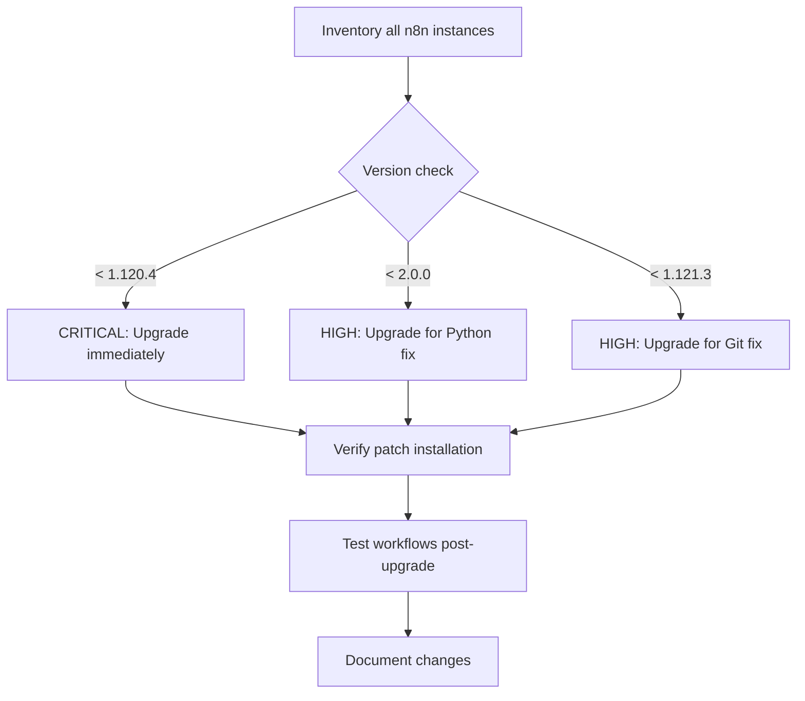

**Action Checklist**:
- [ ] Audit all n8n deployments (self-hosted, cloud, development)
- [ ] Upgrade to n8n v2.0.0+ immediately
- [ ] Disable Python Code Node if not critically needed
- [ ] Disable Git node in multi-user environments
- [ ] Review all existing workflows for suspicious activity
- [ ] Rotate all credentials stored in n8n
- [ ] Check logs for unauthorized workflow executions

#### Network Isolation

**Never expose n8n directly to the internet**:

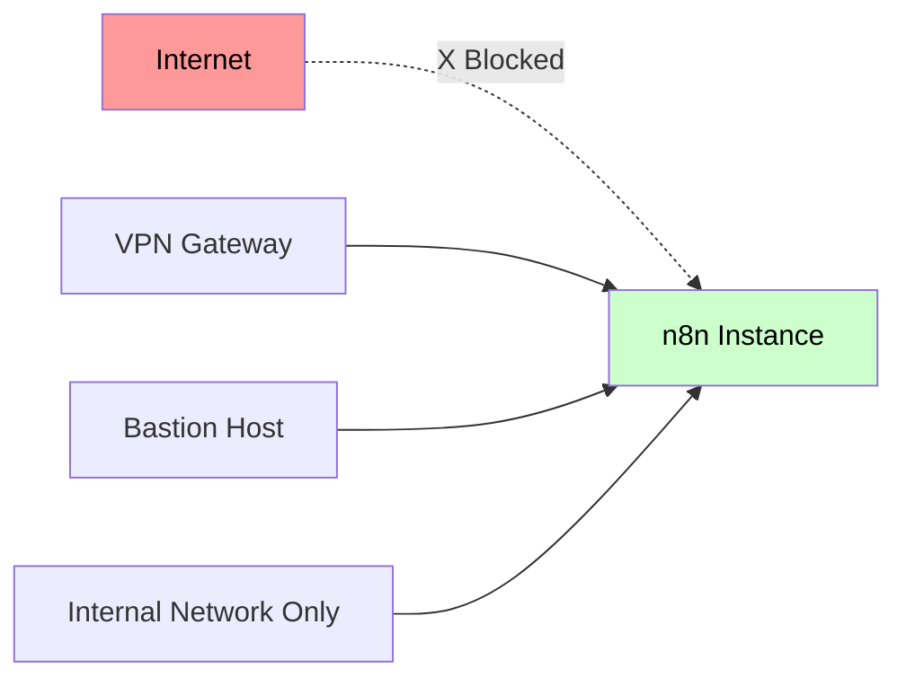

Recommended architecture:
- Place behind VPN or SSO gateway
- Use IP whitelisting
- Implement network segmentation
- Monitor all inbound connections

### 6.2 Architectural Recommendations (Strategic)

#### Design Principle 1: Principle of Least Privilege

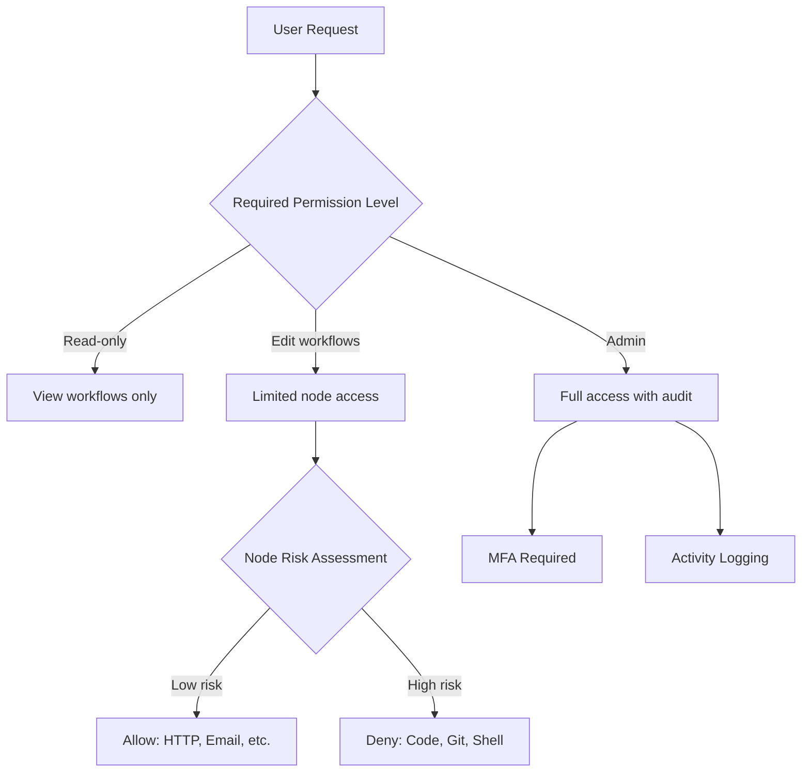

**Implementation**:
- Create role-based access control (RBAC) tiers
- Restrict code execution nodes to admin roles only
- Implement workflow approval processes for sensitive operations
- Audit trail for all privilege escalations

#### Design Principle 2: Defense in Depth

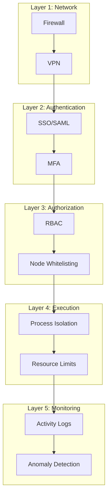

**Implementation**:
- Network perimeter controls (firewalls, IDS/IPS)
- Strong authentication (SSO, MFA, certificate-based)
- Granular authorization (per-node, per-workflow)
- Containerization and resource quotas
- Comprehensive logging and alerting

#### Design Principle 3: Assume Breach Mentality

**Key Questions**:
- If an attacker gains authenticated access, what's the blast radius?
- Can you detect unauthorized workflow modifications?
- How quickly can you revoke access and rotate credentials?
- Do you have backups isolated from the n8n instance?

**Mitigation Strategies**:
- Separate credential stores (use external secret managers)
- Immutable workflow audit logs
- Automated credential rotation
- Incident response playbooks specific to n8n

### 6.3 Alternative Architectures

#### Option 1: Isolated Execution Model

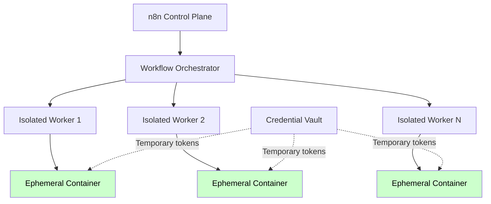

**Benefits**:
- Each workflow execution in isolated container
- No persistent access to credentials
- Automatic cleanup after execution
- Limited blast radius on compromise

**Trade-offs**:
- Higher infrastructure complexity
- Increased latency for workflow starts
- More resource consumption

#### Option 2: Serverless Function Offloading

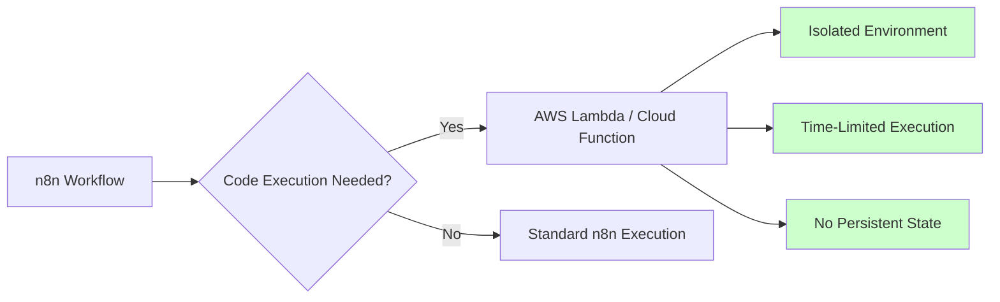

**Benefits**:
- Code runs in cloud provider's secure environment
- Automatic scaling and isolation
- Pay-per-execution model
- No local code execution risks

**Trade-offs**:
- Dependency on cloud provider
- Potential cost implications at scale
- Network latency for each call

### 6.4 Monitoring and Detection

#### Key Metrics to Monitor

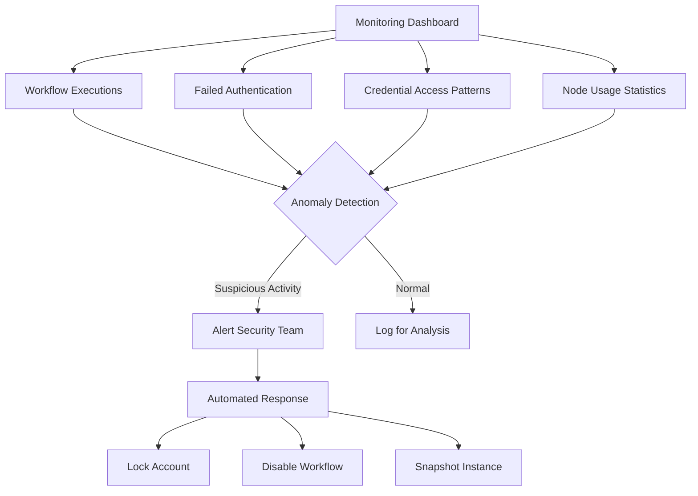

**Critical Alerts**:
- Python/Code node executions (if disabled for users)
- Git node usage in production
- Workflow modifications outside business hours
- Sudden spike in credential access
- Failed expression evaluations (potential exploit attempts)
- New user account creations
- Role/permission changes

#### Detection Patterns

| Pattern | Indicator | Severity |
|---------|-----------|----------|
| Mass credential export | Multiple API key retrievals in short time | Critical |
| Off-hours workflow edits | Modifications at 3 AM | High |
| Code node in production | Python/JS nodes enabled unexpectedly | High |
| Failed login spikes | Brute force attempt | Medium |
| Unusual node combinations | Git + Code nodes in single workflow | Medium |

---

## 7. Development Team Considerations

### 7.1 Code Review Guidelines

When building or extending n8n (or similar platforms):

**Security Checklist**:
- [ ] All user inputs validated and sanitized
- [ ] File paths validated against traversal attacks
- [ ] Expression evaluation uses strict sandboxing
- [ ] No direct access to Node.js/Python dangerous modules
- [ ] Credential storage uses encryption at rest
- [ ] Audit logging for all sensitive operations
- [ ] Rate limiting on workflow executions
- [ ] Resource quotas (CPU, memory, disk) enforced

### 7.2 AI Code Generation Risks

The document notes that small teams may use AI-assisted development, which introduces unique risks:

**Concerns**:
- AI models trained on vulnerable code patterns
- Lack of security-focused reasoning in generated code
- Edge cases not considered by generative models
- Copy-paste security flaws from training data

**Mitigations**:
- Always human review for security implications
- Use static analysis security testing (SAST) tools
- Implement comprehensive integration testing
- Security training for developers on common pitfalls

### 7.3 Dependency Management

n8n's complexity comes partly from its extensive dependency tree:

**Best Practices**:
- Regular dependency audits (npm audit, Snyk, etc.)
- Automated vulnerability scanning in CI/CD
- Pin dependency versions (avoid wildcards)
- Review transitive dependencies for hidden risks
- Subscribe to security advisories for key dependencies

---

## 8. Organizational Decision Framework

### 8.1 Risk Assessment Matrix

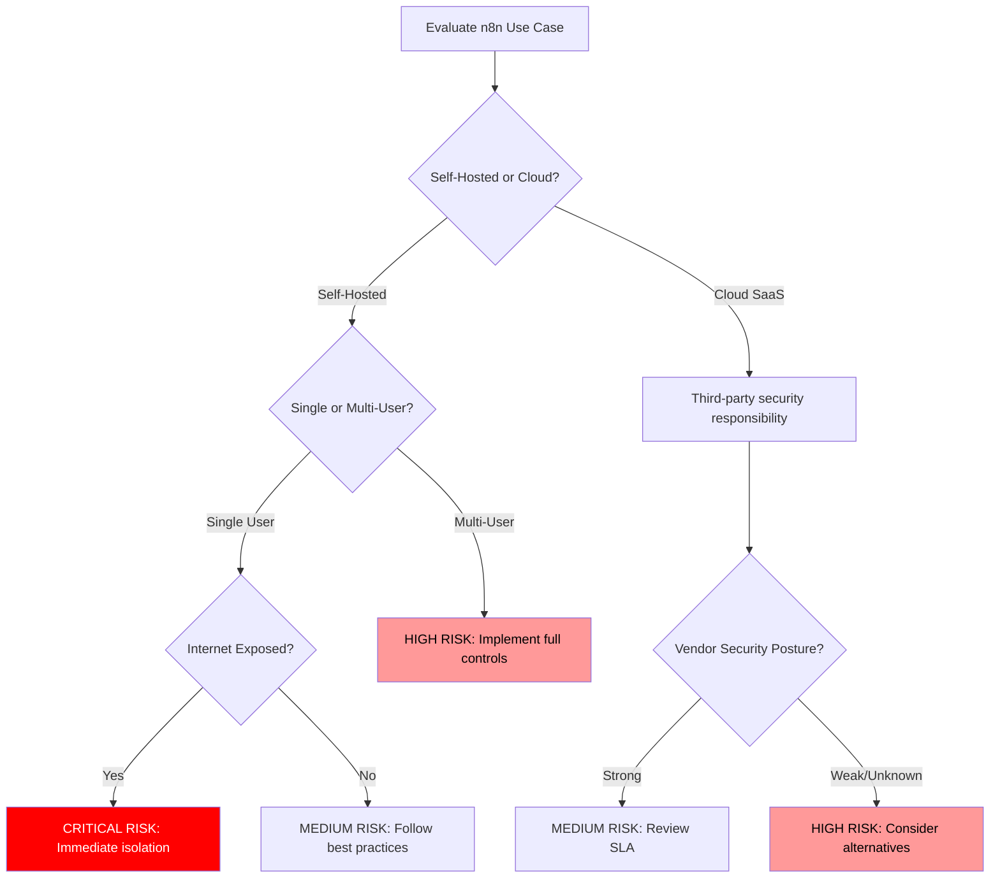

### 8.2 Decision Criteria

**When n8n May Be Appropriate**:
- Single-user personal automation
- Internal network only, no internet exposure
- Non-sensitive data processing
- Development/testing environments
- Strong security team oversight

**When to Consider Alternatives**:
- Processing regulated data (HIPAA, PCI-DSS, etc.)
- Multi-tenant SaaS requirements
- High-value target for attackers
- Limited security resources
- Compliance requirements prohibit self-hosted arbitrary code

### 8.3 Alternative Solutions

| Tool | Security Model | Use Case | Trade-offs |
|------|----------------|----------|------------|
| **Zapier** | Fully managed SaaS | Simple integrations | Limited customization, cost |
| **Make (Integromat)** | Managed with advanced features | Complex workflows | Learning curve |
| **Temporal.io** | Workflow orchestration | Microservices coordination | Developer-focused |
| **Apache Airflow** | Data pipeline orchestration | Data engineering | Requires infrastructure |
| **AWS Step Functions** | Cloud-native serverless | AWS-centric workflows | Vendor lock-in |

---

## 9. Incident Response Playbook

### 9.1 Detection Phase

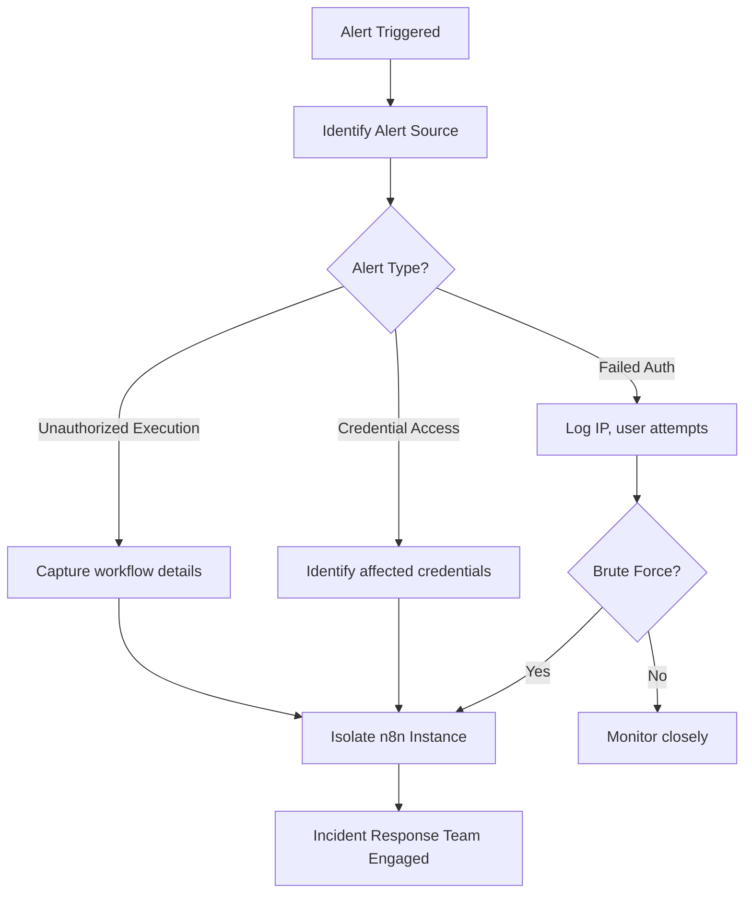

### 9.2 Containment Actions

**Immediate (0-15 minutes)**:
1. Disable network access to n8n instance
2. Snapshot current state for forensics
3. Disable all user accounts except admin
4. Stop all running workflows

**Short-term (15-60 minutes)**:
1. Review audit logs for compromise indicators
2. Identify all potentially affected workflows
3. List all credentials stored in system
4. Check connected services for lateral movement

**Medium-term (1-4 hours)**:
1. Rotate all credentials stored in n8n
2. Notify affected service providers
3. Review backup integrity
4. Prepare fresh instance from clean image

### 9.3 Recovery and Lessons Learned

**Recovery Steps**:
1. Deploy patched n8n version in isolated environment
2. Import workflows from backup (after security review)
3. Implement enhanced monitoring before re-enabling
4. Phased rollout with strict access controls
5. User re-authentication and security awareness

**Post-Incident Review**:
- Document attack timeline
- Identify security control gaps
- Update detection rules
- Improve security posture
- Share learnings with team

---

## 10. Future-Proofing Security

### 10.1 Emerging Threats

**AI-Powered Attacks**:
- Automated vulnerability discovery in workflows
- AI-generated exploit chains
- Social engineering via AI-crafted workflows

**Supply Chain Risks**:
- Compromised node packages in community extensions
- Malicious workflow templates
- Backdoored integrations

### 10.2 Recommended Security Roadmap

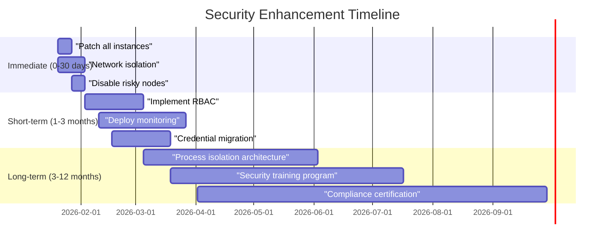

**Phase 1: Immediate (0-30 days)**
- Emergency patching and hardening
- Risk assessment and network controls
- Critical workflow review

**Phase 2: Short-term (1-3 months)**
- Implement comprehensive access controls
- Deploy monitoring and alerting
- Migrate to secure credential management

**Phase 3: Long-term (3-12 months)**
- Architectural redesign for isolation
- Security culture development
- Compliance and audit readiness

---

## 11. Conclusion

### 11.1 Key Takeaways

1. **Arbitrary Code Platforms Are Inherently Risky**: n8n's vulnerabilities are not unique—any platform allowing user-controlled code execution faces similar challenges.

2. **Authenticated Threats Are Real**: Don't assume authenticated users are trustworthy. Insider threats and account compromises are significant attack vectors.

3. **Sandboxing Is Extremely Hard**: Blacklist approaches fail. Effective isolation requires process separation, containerization, or serverless architectures.

4. **Defense in Depth Is Essential**: No single control is sufficient. Layer multiple security measures to reduce blast radius.

5. **Continuous Vigilance Required**: Security is not a one-time fix. Regular audits, patching, and monitoring are mandatory.

### 11.2 Strategic Recommendations

**For Individual Developers**:
- Use n8n for personal projects only
- Never expose instances to the internet
- Keep updated with latest patches
- Minimize use of code execution nodes

**For Small Teams**:
- Carefully evaluate if automation benefits outweigh risks
- Consider managed alternatives (Zapier, Make) for sensitive use cases
- Implement strict network isolation
- Regular security reviews

**For Enterprise Architects**:
- Conduct thorough threat modeling before deployment
- Design for compromise (assume breach mentality)
- Implement comprehensive monitoring
- Maintain incident response capabilities
- Consider alternatives for regulated workloads

### 11.3 Final Perspective

The n8n vulnerabilities demonstrate a fundamental truth: **convenience and security often conflict in automation platforms**. The same features that make n8n powerful—flexible code execution, extensive integrations, rapid workflow development—create a massive attack surface when security controls fail.

Organizations must make informed decisions about where this trade-off is acceptable. For personal automation in non-sensitive contexts, n8n (properly secured) can be valuable. For multi-user environments handling critical data, the risk may outweigh the benefits.

**The bottom line**: Treat self-hosted arbitrary code execution platforms with the same security rigor as production databases or authentication systems. They deserve nothing less.

---

## 12. Additional Resources

### 12.1 Official Sources

- **n8n Security Advisories**: https://github.com/n8n-io/n8n/security/advisories
- **n8n Documentation**: https://docs.n8n.io/
- **n8n Community Forum**: https://community.n8n.io/

### 12.2 Security References

- **CVE Database**: https://cve.mitre.org/
- **OWASP Top 10**: https://owasp.org/www-project-top-ten/
- **CWE Sandbox Evasion**: https://cwe.mitre.org/data/definitions/693.html

### 12.3 Monitoring and Tools

- **Shodan**: For identifying exposed instances
- **Rapid7**: Vulnerability intelligence
- **Material Security**: Workspace protection (mentioned in source)

### 12.4 Security Awareness

- **Video Source**: https://www.youtube.com/watch?v=UlZjPsTWg-U
- **BleepingComputer**: Security news and advisories
- **The Hacker News**: Vulnerability disclosures

---

## Appendix A: Glossary

| Term | Definition |
|------|------------|
| **RCE** | Remote Code Execution—ability to run arbitrary code on a target system |
| **Sandbox** | Isolated execution environment to limit code capabilities |
| **CVE** | Common Vulnerabilities and Exposures—standardized vulnerability identifier |
| **CVSS** | Common Vulnerability Scoring System—standardized severity rating |
| **Blacklist** | Security approach blocking known dangerous operations |
| **Whitelist** | Security approach allowing only explicitly approved operations |
| **Pyodide** | WebAssembly-based Python runtime for browsers |
| **Path Traversal** | Attack technique accessing files outside intended directory |
| **Git Hooks** | Scripts automatically executed during git operations |
| **RBAC** | Role-Based Access Control—permission system based on user roles |

---

*This whitepaper is provided for educational and security awareness purposes. Always refer to official n8n documentation and security advisories for the most current information.*