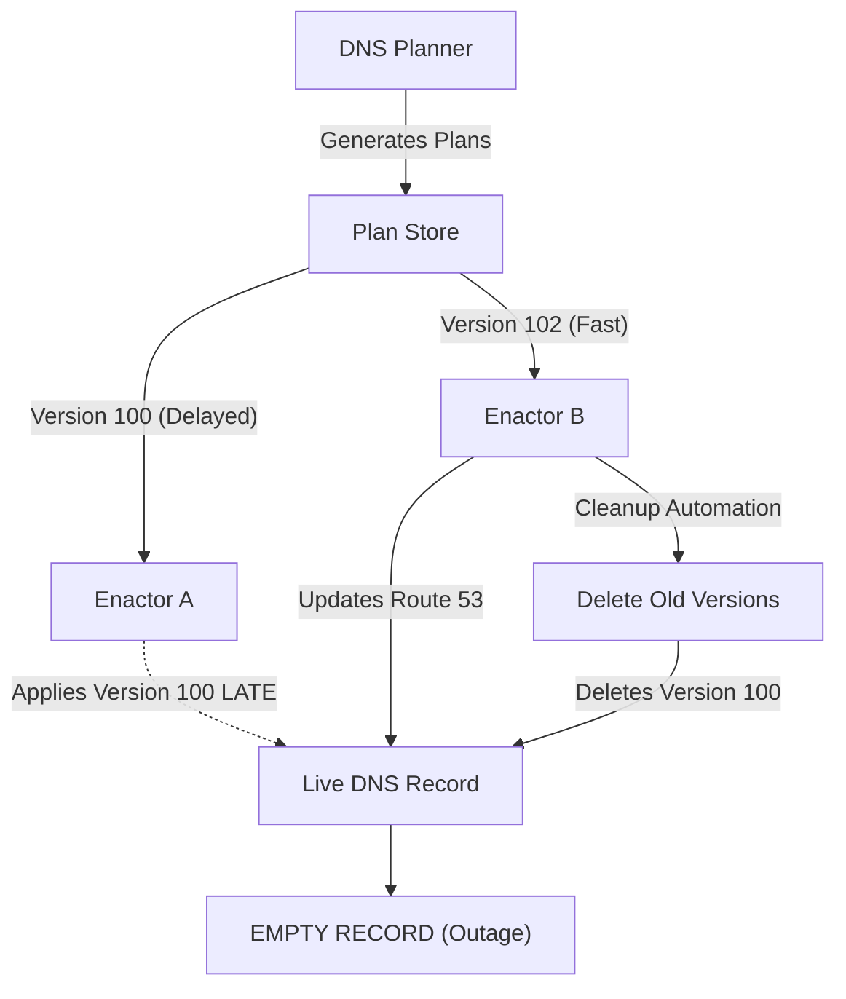
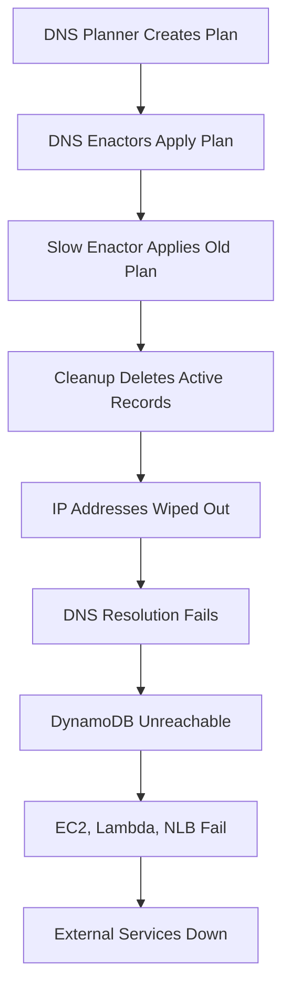
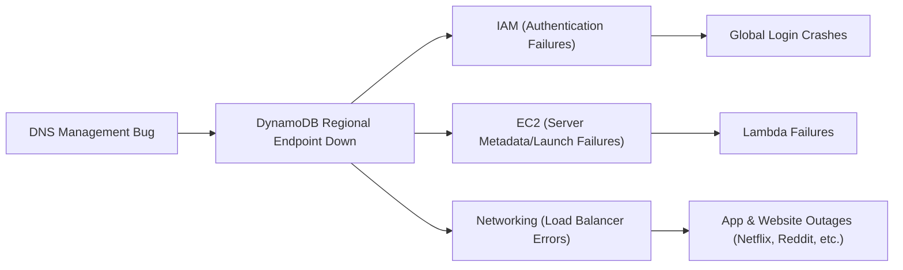

# AWS US-East-1 Outage: October 19-20, 2025

## Executive Summary

On **October 19-20, 2025**, Amazon Web Services experienced one of its most severe outages in history, lasting approximately **15 hours** and affecting thousands of services worldwide. The disruption originated from a DNS race condition in DynamoDB's internal management system, triggering cascading failures across AWS's largest and most critical infrastructure hub—US-EAST-1 (Northern Virginia).

**Key Facts:**
- **Duration**: ~15 hours (11:48 PM PDT Oct 19 - 2:20 PM PDT Oct 20, 2025)
- **Root Cause**: DNS race condition in DynamoDB's automated management system
- **Services Affected**: 113+ AWS services, 2,500+ major companies
- **Economic Impact**: Estimated $581 million for AWS, billions for affected businesses
- **Reports Filed**: Over 11 million connectivity issue reports worldwide

---

## Timeline of Events

- **11:48 PM PDT, October 19 (6:48 AM UTC, October 20)**: Error rates spiked in DynamoDB APIs. AWS monitoring detected packet loss at edge nodes in Ashburn, Virginia
- **11:49 PM PDT, October 19**: Customers unable to connect to DynamoDB due to DNS failures
- **12:26 AM PDT, October 20**: AWS identified the trigger as DNS resolution issues for regional DynamoDB service endpoints
- **11:48 PM PDT Oct 19 - 2:40 AM PDT Oct 20**: Main DynamoDB disruption period. No new connections possible
- **2:25 AM PDT, October 20**: DNS issues resolved; services began recovering
- **2:25 AM - 1:50 PM PDT, October 20**: EC2 experienced issues launching new instances
- **5:30 AM - 2:09 PM PDT, October 20**: Network Load Balancers (NLB) had persistent connection errors
- **2:20 PM PDT, October 20**: Most services restored
- **October 21**: Final services (including Redshift) fully recovered

**Recovery Challenges**: Despite fixing the root cause by 2:25 AM, full system recovery took over 14 additional hours due to massive retry queues from failed instance launches, cascading effects across dependent services, and systems being overwhelmed by backlogs.

---

## Technical Root Cause Analysis

### Understanding the DNS Race Condition

AWS uses automated systems to manage DNS records for services like DynamoDB, which handles hundreds of thousands of DNS records that are constantly updated for availability and failover. The outage was caused by a subtle but devastating race condition bug in this automation.

### The Distributed Workflow Manager (DWFM)

Two cooperating worker types within AWS's DWFM experienced a synchronization failure:

**1. The DNS Planner**
- Creates configuration plans with IP addresses for DynamoDB endpoints
- Generates versioned plans (e.g., Version 100, Version 102)
- Acts as the "manager" that decides where database servers should be located

**2. The DNS Enactor**
- Applies these plans to Route 53 across three availability zones
- Acts as the "worker" that updates the actual "phone book" (Route 53)
- Three Enactors work together for redundancy and safety

### What Went Wrong: The Race Condition

**Normal Flow:**
1. DNS Planner creates a configuration plan
2. DNS Enactor applies the plan to Route 53
3. Old plans are cleaned up after new ones are successfully applied

**The Fatal Sequence:**
1. **Enactor A (Slow)**: Picked up an old plan (Version 100) but got delayed by network slowness and retries
2. **Enactor B (Fast)**: Picked up a new plan (Version 102), applied it successfully, and triggered cleanup automation
3. **The Critical Error**: Enactor A finally finished and applied the outdated Version 100 *after* Version 102 was already live
4. **The Cleanup Catastrophe**: The cleanup process, seeing Version 100 as outdated, deleted these records—but they were now the *active* records
5. **Result**: DynamoDB's regional endpoint was left with completely empty DNS records

### Visualization: The Race Condition

### Why This Was So Devastating

DNS acts like a phone book for the Internet—when an application wants to connect to DynamoDB, it first looks up the DNS name to find the actual IP addresses. With empty DNS records:
- Application servers were technically healthy
- Database servers were still running
- **But they had no way of finding each other**

This was a **latent bug**—hidden under normal conditions and only triggered under unusual load patterns that caused timing misalignment between the Enactors.

The **DNS Automation** workflow used by AWS, specifically explaining how a routine update turned into a massive outage. Here are the steps of the automation process:

### **The DNS Automation Workflow**

1. **Planning Phase (DNS Planner):**
* The process begins in the **DNS Planner**, a system that designs the configuration changes.
* The update is first created in **Draft Mode**. This is where metadata and domain name information (e.g., for DynamoDB or EC2) are prepared.

2. **Transition to Active Mode:**
* Once the plan is ready, it is moved from "Draft" to **Active Mode**. This signifies that the changes are ready to be pushed to the live environment.

3. **The Syncing Phase (DNS Enactor):**
* A separate component called the **DNS Enactor** is responsible for executing the plan.
* The Enactor "reads" the active plan from the Planner and pushes those updates to **Route 53** (the actual DNS service).

4. **Record Propagation:**
* Route 53 updates its "phonebook" records so that when a user requests a service (like `dynamodb.us-east-1.amazonaws.com`), it returns the correct IP address.

### **Where the Automation Broke (The "Sync Gap")**

During the October outage, a critical error occurred between these steps:

* **The Sync Gap:** There was a delay or "gap" between the Planner and the Enactor.
* **Empty Records:** The DNS Enactor synchronized a plan that it *thought* was active, but the underlying data was still empty or in a draft state.
* **Result:** The automation successfully pushed "nothing" to Route 53, causing the system to return "table not found" or empty responses to millions of service requests.

---

## The Cascading Failure: How One Service Took Down the Cloud

Foundational services like **DynamoDB** are the "electricity" of AWS. When the database couldn't be found via DNS, other services that depend on it began to fail in a domino effect.

### Critical Service Dependencies

As DynamoDB is a foundational service used internally by many AWS services, this DNS failure immediately became a catastrophic issue:

**IAM (Identity and Access Management)**
- Uses DynamoDB to store user keys and session tokens
- When DynamoDB became unreachable, authentication completely failed
- Users couldn't log in to AWS Console, CLI, or any services
- **Impact**: Global login crashes across all AWS regions

**EC2 (Elastic Compute Cloud)**
- Uses DynamoDB to store instance metadata and track server health
- New EC2 instance creation immediately failed
- AWS couldn't launch new servers or move traffic
- **Impact**: Server metadata and launch failures, inability to scale

**Lambda (Serverless Functions)**
- Relies on EC2 and internal metadata stored in DynamoDB
- Invocation failures spiked significantly
- Function calls failed and backed up into a massive "retry storm"
- **Impact**: Millions of serverless functions became unavailable

**Network Load Balancers (NLB)**
- Health check failures caused widespread connectivity issues
- Unable to route traffic properly
- **Impact**: Network-wide routing and connectivity problems

**Other Core Services**
- **ECS, EKS, Fargate**: Container orchestration disrupted
- **Redshift**: Data warehouse queries failed
- **Amazon Connect**: Customer service platforms went offline

### Global Services and the US-EAST-1 Factor

Many AWS "global" services actually have hard dependencies on US-EAST-1:
- Redshift's IAM API relies on US-EAST-1 infrastructure
- When US-EAST-1 failed, these dependencies triggered worldwide effects
- Even applications running in other regions experienced failures

### Timeline: How the Failure Cascaded

### Dependency Flow Diagram

---

## Global Impact

### The US-EAST-1 Factor

**Why This Region Matters:**
- US-EAST-1 (Northern Virginia) is AWS's oldest and largest region
- Handles approximately 35-40% of global AWS traffic
- Many legacy systems and global services are anchored here
- Despite implementing multi-AZ architectures, many organizations run production workloads in a single AWS region
- When US-EAST-1 fails, the impact radiates globally

**Multi-AZ Wasn't Enough:**
Workloads in US-EAST-1 were effectively stranded. Even deployments across all six availability zones within the region went down together, proving that AZ-level redundancy doesn't protect against region-level failures.

### Affected Services and Platforms

**Major Consumer Platforms:**
- **Social Media**: Snapchat (complete blackout), Reddit
- **Gaming**: Fortnite, Roblox, Pokémon GO
- **Financial Services**: Banking apps, Robinhood, Venmo, Coinbase
- **Communication**: Slack, Atlassian, Zoom, Signal
- **Smart Home**: Ring doorbells, various IoT devices
- **Streaming**: Netflix, Disney+
- **AI Services**: ChatGPT and other ML platforms
- **Enterprise SaaS**: Canva, Duolingo, and countless business applications

**AWS Services Impacted:**
- **DynamoDB**: Could not handle new requests; data replication severely lagged
- **EC2**: Could not launch new virtual machines (existing instances continued running)
- **Lambda**: Functions failed or experienced severe delays
- **Network Load Balancers**: Health checks failed, causing widespread traffic routing issues
- **IAM**: Login failures across AWS Console and API access
- **Additional Services**: Redshift, Amazon Connect, ECS, EKS, Fargate, and 100+ other services

### **Specific Financial Losses:** The impact on major platforms during the 15-hour window:
* **Snapchat:** ~$600,000 loss.
* **Zoom:** ~$532,000 loss.
* **Reddit:** ~$148,000 loss.

### Economic and Social Toll

**Financial Impact:**
- **AWS Direct Costs**: Estimated $581 million in lost revenue and SLA credits
- **Business Impact**: Hundreds of billions of dollars in economic losses
- **Timing**: The outage coincided with peak working hours in Europe and early hours in the United States, amplifying the economic hit
- **Worker Productivity**: Millions of workers worldwide could not perform their jobs

**User Experience:**
- Over 11 million reports of connectivity issues worldwide filed with outage trackers
- Users unable to stream content, make payments, or access smart home devices
- Critical business operations halted for 15 hours
- Customer trust in cloud reliability significantly impacted

---

## Why Recovery Took So Long

Even after AWS engineers manually fixed the DNS records (which took approximately 2.5 hours), full recovery took an additional 12+ hours due to several compounding factors:

### 1. Retry Storms
- Millions of applications were attempting to reconnect every second
- Each failed connection triggered automatic retries
- The recovering system was immediately overwhelmed—like a traffic jam after a road reopens
- AWS had to implement throttling to prevent the retry storm from causing a second outage

### 2. DNS Caching
- Many systems cached the empty DNS records with TTL (Time To Live) values
- Even after the fix, some applications "remembered" the broken state for hours
- Required manual cache clearing and service restarts across the ecosystem

### 3. Cascading Recovery Dependencies
- Services had to recover in a specific order
- DynamoDB had to stabilize before IAM could recover
- IAM had to recover before EC2 could launch new instances
- Each layer added hours to the recovery timeline

### 4. Massive Backlogs
- Failed EC2 instance launches created enormous retry queues
- Lambda function invocations backed up into millions of pending requests
- Systems had to process these backlogs before returning to normal operation

---

## Lessons Learned and Recommendations

This event proved that even the most "redundant" systems have hidden single points of failure. Cloud outages aren't anomalies—they're operational realities that will only increase as digital infrastructure becomes more complex.

### Key Lessons Learned

**1. Single Points of Failure Exist Everywhere**
- Too many services depend on foundational services like DynamoDB
- One failure spreads rapidly through the entire ecosystem
- "Shared fate" architectures create systemic risk

**2. Regional Dependencies Are Critical Risks**
- US-EAST-1 is critical but fragile, anchoring many global services
- A failure in one region can trigger worldwide effects
- Multi-AZ strategies don't protect against region-level failures

**3. Even World-Class Engineering Has Blind Spots**
- AWS has world-class engineering and battle-hardened systems
- Subtle race conditions and edge cases can still cause catastrophic failures
- Latent bugs hide under normal conditions and emerge under stress

**4. SLA Guarantees Have Limits**
- This 15-hour outage obliterated AWS's annual SLA budget by a factor of 17
- "Five nines" (99.999%) reliability is aspirational, not guaranteed
- Organizations must plan for the reality of cloud failures

**5. Other findings**
- **Internal Workflow Details:** The "Draft vs. Active" mode within the AWS automation pipeline, where the update remained stuck in a draft state but was treated as active by the Enactor, leading to the inconsistent metadata sync.
- **Hidden Dependency 'Secrets':** Virginia (US-EAST-1) is the "oldest server" for AWS and acts as a global anchor; if it goes down, "multi-region" setups often fail because they still need to 'check in' with Virginia for global metadata.

### Architecture Recommendations

#### Multi-Region Strategy

**The Success Stories:**
Organizations with multi-region architectures experienced a minor incident instead of a crisis:
- Their monitoring detected US-EAST-1 issues immediately
- Traffic failed over automatically to secondary regions
- End customers never noticed the outage

**Implementation Requirements:**
- Run applications simultaneously in two or more regions (e.g., US-WEST-2, EU regions)
- Implement automated failover mechanisms
- Use DynamoDB Global Tables for cross-region data replication
- This is expensive but provides true "geographic redundancy"

**Key Decision:**
If your business cannot afford a 15-hour outage, multi-region architecture is mandatory, not optional.

#### Multi-Cloud Approach

**Provider Independence:**
- Run workloads across AWS, Google Cloud, and Azure
- When AWS has a bad day, services continue running elsewhere
- Eliminates vendor lock-in and single provider risk

**Trade-offs:**
- Significantly increases complexity and operational overhead
- Higher costs due to redundant infrastructure
- Requires expertise across multiple cloud platforms

#### Resilience Patterns

**Graceful Degradation**
- Design applications to show "read-only" mode when databases fail
- Display helpful error messages instead of crashing completely
- Maintain core functionality even when supporting services are down
- Example: Show cached data with a banner indicating limited functionality

**Circuit Breakers**
- Implement code that stops sending requests to failing services
- Prevents "retry storms" from making outages worse
- Automatically "open" when failure thresholds are reached
- Gradually "close" during recovery to prevent overwhelming systems

**Intelligent Retries**
- Use exponential backoff (increasing delays between retries)
- Add jitter (random variation) to prevent thundering herd problems
- Implement maximum retry limits to prevent infinite loops
- Monitor retry queues to detect cascading failures early

#### Defense in Depth

**Layered Protection:**
- **Availability Zones (AZs)**: Use for everyday safety and redundancy within a region
- **Multiple Regions**: Use for protection against catastrophic regional failures
- **Multiple Clouds**: Use for ultimate protection against provider-wide issues

**Monitoring and Alerting:**
- Implement comprehensive monitoring for detecting rare edge cases
- Set up alerts for unusual patterns (e.g., DNS resolution failures)
- Monitor dependency health across all layers
- Test disaster recovery scenarios regularly

### What AWS Did Right

AWS published a detailed, transparent post-mortem shortly after the incident, providing:
- Clear technical explanation of the root cause
- Honest assessment of what went wrong
- Specific remediation steps being implemented
- Timeline of events and recovery efforts

**Why This Matters:**
- This transparency helps build trust with customers
- Advances distributed systems engineering as a discipline
- Allows the entire industry to learn from the incident
- Sets a standard for incident communication

### Specific Recommendations

#### For AWS Customers

**Immediate Actions:**
1. Audit your AWS architecture for US-EAST-1 dependencies
2. Identify services that don't have regional alternatives
3. Document all third-party dependencies on AWS services
4. Test your disaster recovery plans with realistic scenarios

**Architecture Improvements:**
1. Implement DynamoDB Global Tables for cross-region data replication
2. Set up automatic failover mechanisms with health checks
3. Deploy applications in at least two regions simultaneously
4. Use Route 53 health checks and failover routing policies
5. Implement proper circuit breakers and retry logic
6. Configure monitoring for regional health status

**Operational Excellence:**
1. Test disaster recovery plans regularly (quarterly minimum)
2. Conduct chaos engineering exercises to find weaknesses
3. Document runbooks for regional failover procedures
4. Train teams on manual failover processes
5. Review and update SLAs with customers based on realistic availability

#### For AWS

**Short-term Fixes:**
1. Fix the DNS automation race condition in DWFM
2. Implement rate limits and safeguards on automated cleanup processes
3. Add validation checks before deleting active DNS records
4. Improve monitoring for DNS record changes and anomalies

**Long-term Improvements:**
1. Enhance testing for edge cases in distributed systems
2. Implement formal verification for critical automation
3. Add "break glass" procedures for manual DNS override
4. Improve regional isolation to prevent cascading failures
5. Reduce global service dependencies on US-EAST-1
6. Provide better tools for customers to test multi-region architectures

#### Cost vs. Risk Trade-offs

**Reality Check:**
- Multi-region setups can cost 2-3x more than single-region deployments
- Multi-cloud architectures add even more complexity and cost
- Organizations must decide what level of availability they truly need

**Decision Framework:**
1. Calculate your actual downtime costs (revenue loss + brand damage)
2. Compare against multi-region infrastructure costs
3. Consider your industry's availability requirements
4. Factor in regulatory and compliance needs
5. Budget accordingly based on true business impact

---

## The Bigger Picture

The October 2025 AWS outage served as a wake-up call for regulators, businesses, and citizens who had come to regard the cloud as an invisible, infallible utility.

**Key Takeaways:**
- Core service failures expose architectural vulnerabilities that traditional resilience strategies don't address
- The cloud is powerful infrastructure, but infrastructure nonetheless—it can and will fail
- Over-centralization creates systemic risk (US-EAST-1 handles too much critical infrastructure)
- Organizations must balance cost, complexity, and resilience based on their true needs
- Transparency and shared learning are essential for advancing cloud reliability

**Looking Forward:**
This incident will likely drive:
- Increased regulatory scrutiny of cloud concentration risk
- More aggressive multi-region and multi-cloud adoption
- Enhanced focus on chaos engineering and resilience testing
- Industry-wide improvements in distributed systems design
- Greater investment in automated failover and recovery systems

---

### **Simplified Summary**

* **The Root Cause:** A routine automated update to DynamoDB’s DNS configuration failed due to a "sync gap" between two internal systems: the **DNS Planner** (which designs the update) and the **DNS Enactor** (which executes it).
* **The Critical Failure:** This gap caused the **Route 53** service to receive and serve "empty" records. Instead of pointing to a database, the "phonebook" for the internet returned nothing.
* **The Domino Effect:** Because DynamoDB is a core dependency for almost every other service, its "disappearance" caused a cascading failure across **EC2 (servers)**, **Lambda (functions)**, and **Network Load Balancers**.
* **The Multi-Region Myth:** Many users thought they were safe by using multiple regions, but because global management services (like IAM and certain DNS routing) are secretly hardcoded to the **US-EAST-1 (Virginia)** region, the failure there broke services globally.

---
## Summary Table: Quick Reference

| **Category** | **Details** |
|---|---|
| **Primary Region** | US-EAST-1 (Northern Virginia) |
| **Start Time** | 11:48 PM PDT, October 19, 2025 (6:48 AM UTC, October 20) |
| **Root Cause Identified** | 12:26 AM PDT, October 20, 2025 |
| **DNS Fixed** | 2:25 AM PDT, October 20, 2025 |
| **Full Recovery** | 2:20 PM PDT, October 20, 2025 |
| **Total Duration** | Approximately 15 hours |
| **Root Cause** | DNS race condition in DynamoDB's DWFM automation |
| **Trigger** | Slow DNS Enactor applied old plan; cleanup deleted active records |
| **AWS Services Affected** | 113+ services including DynamoDB, EC2, Lambda, IAM, NLB |
| **Companies Affected** | 2,500+ including Netflix, Reddit, Snapchat, Fortnite, Robinhood |
| **Reports Filed** | 11+ million connectivity issue reports worldwide |
| **Economic Impact** | $581M+ for AWS; hundreds of billions for affected businesses |
| **SLA Impact** | 15-hour outage exceeded annual SLA budget by 17x |

---

## Conclusion

The 2025 AWS US-EAST-1 outage demonstrates how a single subtle bug—a race condition in DNS automation—can cascade into one of the largest cloud infrastructure failures in history. Despite AWS's world-class engineering, sophisticated redundancy systems, and decades of operational experience, a latent timing issue under specific load conditions brought down services for billions of users worldwide.

**The Core Lesson:**
There is no such thing as perfect reliability in distributed systems. Every architecture has hidden single points of failure waiting to be discovered under the right (or wrong) conditions.

**The Path Forward:**
Organizations must move beyond checkbox compliance with cloud best practices and build genuine resilience through multi-region architectures, intelligent failover systems, and realistic disaster recovery planning. The cost and complexity of these solutions must be weighed against the true business impact of extended outages.

**Industry Impact:**
This incident will drive significant changes in how organizations approach cloud architecture, vendor relationships, and availability planning. The transparency AWS showed in its post-mortem sets a positive example for the industry and accelerates collective learning.

The cloud remains an incredibly powerful platform for innovation and scale, but this outage serves as a crucial reminder: treat it as the complex, fallible infrastructure it is, not as magic that "just works."

---

## References

**Official Sources:**
- AWS Service Health Dashboard - US-EAST-1 Incident Summary
- AWS Official Post-Mortem Report (October 2025)

**Technical Analysis:**
- ThousandEyes Network Analysis
- Forbes Technology Coverage
- Ookla Internet Performance Reports
- INE (Infrastructure & Network Engineering) Analysis
- DeployFlow Technical Breakdown
- CRN Enterprise Impact Assessment

**Video Explanations:**
- Abhishek.Veeramalla - AWS Outage Technical Deep Dive
- ByteMonk - Understanding the DNS Race Condition
- Modern Software Engineering - Cascading Failures Explained
- Saurabh Bhargav - AWS Outage Analysis
- Fireship - AWS Went Down
- Chris Greer - Network Analysis of the Outage

**Community Discussions:**
- Medium Technical Blog Posts
- X (Twitter) User Reports and Analysis
- Reddit r/aws Community Discussion

**Note:** This document synthesizes information from multiple sources to provide a comprehensive analysis of the October 2025 AWS outage. Technical details are based on AWS's official incident report and verified third-party analysis.

