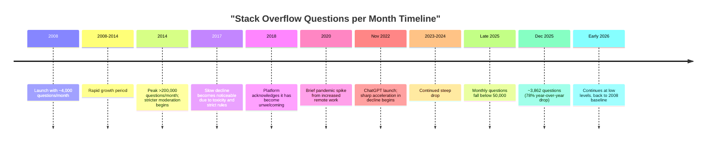

# The Decline of Stack Overflow: Comprehensive Analysis

## Introduction

Stack Overflow, launched in 2008, is a Q&A platform for programmers that became the go-to site for coding help. It grew rapidly throughout the 2010s, becoming the dominant resource for developers worldwide. By the mid-2010s, the site saw over 200,000 new questions per month at its peak. However, recent data reveals a dramatic decline, with monthly questions dropping to levels similar to 2008-2009—approximately 4,000 questions per month. This whitepaper examines the reasons behind this collapse, backed by recent reports, data, and community discussions as of January 2026.

## History and Growth

### Founding and Early Success

Stack Overflow was created by Jeff Atwood and Joel Spolsky in 2008 as a platform to share coding knowledge, combining elements of Wikipedia's knowledge base with the interactive nature of forums. The site's success was built on several innovative features:

- **Community voting system**: Users could upvote helpful answers and downvote unhelpful ones
- **Accepted answers**: Question askers could mark the best answer with a green checkmark
- **Reputation system**: Contributors earned points for helping others, creating gamification and incentives
- **Quality content**: The voting mechanism naturally surfaced the best solutions

### Peak Years

- **2008-2014**: Rapid growth period, becoming the definitive resource for programming questions
- **2014**: Reached peak activity with over 200,000 questions per month
- **Mid-2010s**: Solidified position as the top destination for coding help worldwide
- **June 2021**: Sold to Prosus (a Netherlands-based investment firm) for $1.8 billion, demonstrating its perceived value at the time

## Key Reasons for Decline

The decline of Stack Overflow is attributable to both internal cultural issues and external technological shifts. Importantly, the drop began before the AI revolution, around 2014-2017, due to stricter moderation policies. However, it accelerated dramatically after ChatGPT's launch in November 2022.

### Internal Issues

#### Toxicity and Unwelcoming Culture

- **Hostile environment**: New users frequently encounter rude comments, harsh downvotes, and dismissive responses
- **Discouraging feedback**: Common replies include "Read the manual," "This is a duplicate," or "RTFM," which intimidate beginners
- **Fear of asking**: The unwelcoming atmosphere deters people from posting questions, especially newcomers to programming
- **2018 acknowledgment**: Stack Overflow officially admitted the platform had become unwelcoming, but subsequent changes failed to adequately address the problem

#### Strict Moderation Policies

- **Over-zealous closing**: Questions are frequently closed as duplicates, "off-topic," or "low-quality" too quickly
- **Difficult for beginners**: The strict rules make it challenging for new programmers to formulate "acceptable" questions
- **2014 turning point**: Moderation became significantly stricter around 2014, correlating with the beginning of the decline
- **Reduced participation**: Fewer people willing to risk asking questions that might be immediately closed or downvoted

#### Outdated Content

- **Aging answers**: Solutions from years ago may no longer work with current technologies, frameworks, or best practices
- **Lack of updates**: Without fresh questions and answers, the knowledge base becomes increasingly stale
- **Technology evolution**: Rapid changes in programming languages, libraries, and tools make older content obsolete

### External Factors

#### Rise of AI Tools

- **ChatGPT and similar tools**: Provide instant, polite, judgment-free answers without waiting for human responses
- **Launch impact**: After ChatGPT's November 2022 launch, Stack Overflow questions dropped 70-78%
- **Training on Stack Overflow data**: Ironically, AI tools were often trained on Stack Overflow's own data, making the platform less necessary
- **Other AI assistants**: GitHub Copilot, Grok, Gemini, and integrated IDE AI helpers offer alternative solutions
- **Privacy and speed**: AI tools provide immediate help without requiring public posts or exposing gaps in knowledge

#### Alternative Communities

- **Reddit**: Subreddits like r/learnprogramming offer friendlier, more conversational help
- **Discord servers**: Real-time chat communities for developers provide interactive, supportive environments
- **GitHub Discussions**: Project-specific forums integrated with code repositories
- **Specialized forums**: Sites like Dev.to and other niche communities
- **Back-and-forth interaction**: Unlike Stack Overflow's one-shot Q&A format, these platforms allow ongoing dialogue

#### Improved Resources

- **Better search engines**: Google and other search tools more effectively surface relevant documentation and solutions
- **Enhanced official documentation**: Companies like Google, Microsoft, and framework maintainers have significantly improved their docs
- **Integrated IDE help**: Modern code editors include built-in AI assistance and contextual documentation
- **Video tutorials**: YouTube and other platforms offer visual learning alternatives

### Recent Data (2025-2026)

The most recent statistics paint a stark picture:

- **December 2025**: Only 3,862 questions posted—a 78% year-over-year drop from December 2024
- **Late 2025**: Monthly questions fell below 50,000, returning to 2008 launch-era levels
- **Early 2026**: Some reports show even lower numbers (near 300-4,000 per month, depending on partial data and measurement methods)
- **Traffic decline**: Organic visits dropped significantly, with 15-24% month-over-month decreases in late 2025
- **Back to baseline**: Current question volume mirrors 2008-2009 levels, effectively erasing over a decade of growth

## 2025 Developer Survey Insights

Stack Overflow's own 2025 Developer Survey (49,000+ respondents from 177 countries) provides crucial insights into the changing landscape:

### AI Adoption and Attitudes

- **84% adoption**: Of developers use or plan to use AI tools (up from 76% in 2024)
- **Low trust in accuracy**: Only 33% trust AI accuracy, while 46% actively distrust it (up from 31% distrust in 2024)
- **Declining positive sentiment**: Positive sentiment toward AI dropped to 60% (down from over 70% previously)
- **Security concerns**: Many developers worry about AI-related security and privacy issues

### Stack Overflow's Continued Relevance

- **84% still use community resources**: Stack Overflow remains popular for community-driven knowledge
- **Backup resource**: Many developers visit Stack Overflow after AI tools fail to provide adequate solutions
- **Human-verified knowledge**: Developers still value answers that have been reviewed and validated by other humans

### Interpretation

The survey reveals a paradox: AI adoption is surging, but trust remains limited. This highlights AI's limitations and suggests developers still value human-verified knowledge. However, the convenience of AI outweighs the need to actively post new questions on Stack Overflow.

## Timeline of Decline

## Business and Revenue Impact

Despite the dramatic decline in public activity, Stack Overflow's business operations tell a different story:

### Financial Performance

- **12% revenue growth in 2025**: Despite public site decline, overall revenue increased
- **Enterprise products**: Stack Overflow for Teams and other B2B offerings continue to generate income
- **AI data licensing**: Lucrative deals with companies like OpenAI and Google to license the historical Q&A data for AI training
- **$1.8 billion sale (2021)**: Sold to Prosus just before the major decline, representing peak valuation

### Long-term Concerns

- **Content freshness problem**: Without new human-generated content, the value of the data archive may diminish
- **AI quality degradation**: If AI is trained primarily on aging Stack Overflow data without new human input, answer quality could suffer over time
- **Sustainability question**: The business model of licensing old data may not be sustainable indefinitely

## Public Perception and Social Media

On platforms like X (Twitter), discussions about Stack Overflow's decline have gone viral:

- **"Dead" or "dying"**: Common descriptions in developer communities
- **Viral charts**: Visualizations showing the dramatic collapse in questions shared widely
- **Nostalgia mixed with relief**: Some developers mourn the loss of community while others don't miss the toxic culture
- **AI preference**: Many openly state they prefer using ChatGPT or other AI tools over posting on Stack Overflow

## Alternatives Developers Are Using

Modern developers have embraced a diverse ecosystem of resources:

### AI Tools
- ChatGPT, Grok, Gemini, Claude
- GitHub Copilot
- IDE-integrated AI assistants

### Community Platforms
- Reddit (r/learnprogramming, r/programming, language-specific subreddits)
- Discord servers for specific languages, frameworks, and technologies
- GitHub Discussions
- Dev.to and Hashnode

### Official Resources
- Improved documentation from Google, Microsoft, Mozilla, etc.
- Framework and library documentation sites
- Interactive tutorials and sandboxes

### Educational Content
- YouTube tutorials
- Online courses (Udemy, Coursera, etc.)
- Technical blogs and newsletters

## Future Implications

### For Stack Overflow

- **Archive role**: May transition to primarily serving as a historical knowledge archive rather than an active community
- **Niche resource**: Could become a specialized tool for complex or unusual problems not easily solved by AI
- **Enterprise focus**: May increasingly focus on paid enterprise products rather than the public platform
- **Reduced relevance**: Unlikely to regain its former position as the primary developer resource

### For the Developer Community

- **Loss of centralized knowledge**: The decline fragments where programming knowledge resides
- **Human interaction decrease**: Fewer opportunities for developers to engage with and learn from each other directly
- **AI dependency**: Growing reliance on AI tools, with potential concerns about accuracy and understanding
- **Quality concerns**: Without human curation and verification, misinformation in AI responses may propagate

### For AI Development

- **Training data stagnation**: AI models may suffer from lack of fresh, human-generated programming solutions
- **Feedback loop problem**: If AI generates answers that aren't verified by humans, quality may degrade over time
- **Need for new sources**: AI companies may need to develop new methods for gathering current programming knowledge

## Conclusion

Stack Overflow built a massive, valuable knowledge base over more than a decade, helping millions of developers learn and solve problems. However, it now faces existential challenges from a combination of internal cultural issues (toxicity, strict rules, unwelcoming atmosphere) and external technological disruption (AI tools, better alternatives, improved documentation).

The platform's question volume has returned to 2008 launch-era levels, effectively erasing over a decade of growth. While Stack Overflow may survive as a niche archive, enterprise tool, or historical reference, its role as the primary developer community forum has clearly diminished.

This dramatic shift illustrates how quickly technology landscapes can change. Human communities built Stack Overflow's knowledge base, but AI and changing developer preferences are fundamentally reshaping how people access and share programming knowledge. The story serves as a case study in both the power of community-driven platforms and their vulnerability to disruption.

Whether this decline is ultimately positive (escaping toxic culture, faster AI help) or negative (losing human curation, community interaction) remains a subject of debate among developers. What's clear is that an era has ended, and the programming community is adapting to a new paradigm.

## References

### Primary Sources

- **DEVCLASS**: "Dramatic drop in Stack Overflow questions as devs look elsewhere for help" (January 2026) — https://devclass.com/2026/01/05/dramatic-drop-in-stack-overflow-questions-as-devs-look-elsewhere-for-help/

- **Techzine Global**: "Stack Overflow in freefall: 78 percent drop in number of questions" (January 2026) — https://www.techzine.eu/news/devops/137686/stack-overflow-in-freefall-78-percent-drop-in-number-of-questions/

- **The Pragmatic Engineer**: "Stack Overflow is almost dead" (May 2025) — https://blog.pragmaticengineer.com/stack-overflow-is-almost-dead/

- **PPC Land**: "Stack Overflow traffic collapses as AI tools reshape how developers code" (January 2026) — https://ppc.land/stack-overflow-traffic-collapses-as-ai-tools-reshape-how-developers-code/

### Official Stack Overflow Resources

- **Stack Overflow 2025 Developer Survey**: https://survey.stackoverflow.co/2025/
- **Stack Overflow 2025 AI Survey Results**: https://survey.stackoverflow.co/2025/ai
- **Stack Overflow Data Explorer (SEDE)**: Historical question data and visualizations
- **Meta Stack Overflow**: Community discussions on platform decline (2025-2026 threads)

### Background Information

- **Wikipedia**: Stack Overflow article including history and $1.8B Prosus acquisition — https://en.wikipedia.org/wiki/Stack_Overflow
- **Various data visualizations**: Monthly question data from SEDE via GitHub Gists and community analysis
- **News coverage**: Multiple tech news outlets reporting on the 2025-2026 decline

