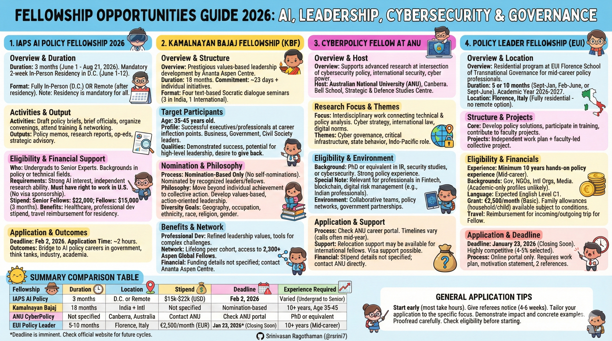

# Fellowship Opportunities Guide 2026

This guide covers four fellowship programs for professionals interested in AI policy, leadership development, cybersecurity policy, and transnational governance.

WIPO and Internnational Fellowship 
- Refer this:  [WIPO-International-Fellowship.md](WIPO-International-Fellowship.md)

---

---

## 1. IAPS AI Policy Fellowship 2026

### Overview
The Institute for AI Policy and Strategy (IAPS) AI Policy Fellowship is a fully funded three-month program for professionals who want to build practical skills in AI governance and policy. This fellowship bridges the gap between AI knowledge and policy implementation. [^1]

### Program Duration & Format
- **Duration:** 3 months (June 1 - August 21, 2026)
- **Mandatory In-Person Residency:** June 1-12, 2026 in Washington, D.C.
- **Format Options:**
  - Fully in-person in Washington, D.C. for the entire 3 months
  - Remote from eligible countries (after the mandatory 2-week residency) [^1]
  
**Note:** All fellows must attend the two-week kickoff residency in Washington, D.C. regardless of which format they choose. [^1]

### What You'll Do
Fellows work independently on high-impact AI policy projects under the mentorship of senior AI policy experts. Activities include: [^1]

- Drafting policy briefs and reports
- Briefing government officials
- Organizing policy convenings and roundtables
- Attending training sessions on AI systems and policy challenges
- Presenting fellowship outputs in the final week
- Participating in networking events with AI policy experts

### Thematic Focus Areas
Projects cover diverse AI policy topics: [^1]
- AI and national security
- Government AI procurement and acquisition
- Chemical, Biological, Radiological, and Nuclear (CBRN) risks from AI models
- Export controls
- AI evaluations and risk assessment
- Geopolitics of AI
- Hardware-enabled governance mechanisms
- Jurisdiction-specific policy (U.S., U.K., EU, and other countries)

### Project Outputs
Fellows can produce various deliverables: [^1]
- Policy briefs and memos
- Government briefings
- Research reports
- Conference presentations
- Op-eds and publications
- Strategic advisory work for institutions

### Eligibility Criteria

**Who Can Apply:** [^1]
- Undergraduates (middle of studies onwards)
- Postgraduates
- Early and mid-career professionals
- Senior experts
- Backgrounds in policy or technical fields (industry, government, think tanks)

**Requirements:** [^1]
- Strong subject-matter knowledge or interest in AI governance, safety, or strategic risk
- Demonstrated ability to do independent research
- Motivation to influence high-impact policy outcomes
- No technical AI expertise required (the fellowship trains people from varied backgrounds)
- **Work Authorization:** Candidates must have the right to work in the U.S. between June 1 and August 21, 2026 (IAPS cannot sponsor visas)

**For Remote Fellows:** [^1]
IAPS can legally hire fellows in many countries due to its remote-first structure, though some administrative or legal constraints may apply. Contact fellowship@iaps.ai for specific country questions.

### Financial Support

**Stipend:** [^1]
- **Senior Fellows:** USD 22,000 for the 3-month program
- **Fellows:** USD 15,000 for the 3-month program
- Part-time options available for exceptional candidates

**Additional Benefits:** [^1]
- Healthcare benefits during the fellowship
- Professional development stipend
- For D.C.-based fellows: Office space and regular in-person events
- For remote fellows: Support budget for approved in-person engagements (conferences, expert meetings)
- Travel reimbursement for the mandatory D.C. residency
- Limited financial assistance for post-fellowship career transitions (in select cases)

### Program Structure

**Week 1-2 (June 1-12): In-Person Residency in Washington, D.C.**
- Meet IAPS team and partner experts
- Connect with fellow cohort members
- Meet with assigned mentor
- Participate in AI policy trainings
- Workshop fellowship projects
- Attend roundtables, policy briefings, and networking events

**Weeks 3-12 (June 13 - August 21): Project Execution**
- Work independently on fellowship project
- Weekly meetings with mentor
- Weekly meetings with IAPS Fellowship Coordinator
- Weekly work-in-progress feedback sessions
- Ongoing career development coaching
- Access to professional AI policy network

### Application Process

**Application Timeline:** [^1]
- **Deadline:** February 2, 2026 at 23:59 Pacific Time
- **Estimated Application Time:** 2 hours
- Applications are automatically saved (can work across multiple sessions)

**How to Apply:** [^1]
1. Visit the official IAPS website
2. Complete the online application form
3. If eligible for both D.C. and remote options, you can select both in the application

**Selection Criteria:** [^1]
Applications are evaluated based on:
- Good judgment and aptitude for understanding AI implications
- Demonstrated interest in AI topics IAPS focuses on
- Professional and educational experience
- Potential to contribute meaningfully to AI policy

**Decision Timeline:** [^1]
Applicants can expect to hear back within approximately 4 months of the deadline.

### Career Outcomes
The fellowship serves as a bridge into AI policy careers. Past fellows have moved into: [^1]
- Government positions
- Think tanks (RAND, Institute for Progress, Center for Health Security)
- Industry policy teams
- Academia
- Civil society organizations
- IAPS and similar organizations
- Founded new initiatives or pursued advanced research degrees

### Support & Networking
Fellows receive:
- Weekly one-on-one career development coaching
- Continuous feedback from IAPS researchers and policy staff
- Access to extensive professional AI policy network
- Networking opportunities during the D.C. kickoff
- Connections with government officials, policymakers, and AI experts

### Contact Information
For questions about eligibility or the program: fellowship@iaps.ai

---

## 2. Kamalnayan Bajaj Fellowship (KBF)

### Overview
The Kamalnayan Bajaj Fellowship is a prestigious leadership development program offered by Ananta Aspen Centre in partnership with the Aspen Institute. Named after industrialist Kamalnayan Bajaj, this fellowship develops values-based leadership among Indian professionals through the time-tested Aspen method of text-based Socratic dialogue. [^2]

### Program Duration & Structure
- **Duration:** 18 months [^2]
- **Total Time Commitment:** Approximately 23 days plus ongoing individual initiatives [^2]
- **Format:** Four seminars using text-based dialogue methods [^2]
  - Three seminars in India
  - One international seminar

### Program Curriculum
The fellowship uses the Aspen method, which involves: [^2]
- Socratic, text-based dialogues
- Deep exploration of leadership values
- Peer learning and discussion
- Personal leadership projects
- Integration into the Aspen Global Leadership Network (2,300+ global fellows) [^4]

### Target Participants
**Age Range:** 35-45 years old [^2]

**Professional Background:** [^2]
- Business leaders
- Government officials
- Civil society leaders

**Profile:** Young, entrepreneurial leaders who have achieved significant success and are at career inflection points. [^3]

### Eligibility Criteria

**Professional Requirements:** [^3]
- Executives and professionals between 35-45 years
- Demonstrated significant success in their field
- Potential for high-level leadership in business, government, or civic responsibility
- Career maturity enabling effective contribution to the fellowship experience

**Personal Qualities:** [^3]
- Desire to give back to society in a broader, substantive manner
- At a career inflection point
- Interest in deeper societal engagement
- Values-based action orientation

**Diversity Goals:**
The program aims for diversity in:
- Geography
- Occupation
- Ethnicity
- Race
- Religion
- Gender

### Application Process

**Important Note:** You cannot directly apply for this fellowship.

**Nomination-Based Selection:**
- Fellows must be nominated by:
  - Recognized business leaders in their region
  - Community leaders
  - Board members of the Fellowship initiatives
  - Other Fellows from the Aspen initiatives
- Self-nominations are not accepted
- Nominators must submit a letter stating their reasons for recommending the candidate
- Family members cannot nominate candidates

### Benefits

**Professional Development:** [^4]
- Refined leadership values
- Tools to address India's complex challenges
- Shift from personal success to collective action thinking
- Enhanced ability to work collaboratively across sectors

**Networking:** [^4]
- Lifelong peer network from the cohort
- Access to 2,300+ global fellows in the Aspen Global Leadership Network
- Cross-border collaboration opportunities
- Connections across business, government, and civil society

**Personal Growth:** [^4]
- Deeper understanding of personal leadership values
- Perspective on peers' leadership approaches
- Opportunity for values-based reflection
- Framework for giving back to Indian society

### Program Philosophy
The fellowship focuses on helping leaders:
- Move beyond individual achievement to societal contribution
- Engage vigorously with challenges facing their communities and country
- Explore new ways to work together to improve Indian society and the world
- Develop values-based, action-oriented leadership

### Historical Context
- Formerly known as the India Leadership Initiative (ILI)
- Running successfully since 2006
- Offered by Ananta Aspen Centre (sister organization of Ananta Centre)
- Part of the broader Aspen Institute global fellowship network

### Financial Support
**Note:** The provided documents do not specify fellowship funding details. Contact Ananta Aspen Centre directly for information about costs or financial support.

### Contact Information
For more information, visit the Ananta Aspen Centre website or contact them directly regarding nomination procedures and program details.

---

## 3. CyberPolicy Fellow at Australian National University (ANU)

### Overview
The CyberPolicy Fellow position at Australian National University in Canberra supports advanced research at the intersection of cybersecurity policy, international security, and cyber power dynamics. This fellowship is part of ANU's strategic studies programs. [^5]

### Host Institution
**Location:** Canberra, Australia [^5]

**Academic Units:** [^5]
- Bell School of Asia Pacific Regional Studies
- Strategic and Defence Studies Centre
- Related programs in international relations and security

### Research Focus Areas
The fellowship emphasizes interdisciplinary work connecting: [^5]
- Technical cybersecurity with policy analysis
- Cyber strategy and statecraft
- International law in digital domains
- Cyber diplomacy
- Global cyber norms
- Australia's role in Indo-Pacific cybersecurity
- Cyber power dynamics in international security

### Research Themes
Fellows may work on projects involving: [^5]
- Cybersecurity policy development
- International security in the cyber domain
- Cyber governance frameworks
- Digital policy and risk management
- Strategic implications of cyber capabilities
- Cyber warfare and deterrence
- Critical infrastructure protection
- State behavior in cyberspace

### Eligibility Criteria

**Educational Background:** [^5]
- Strong background in international relations, security studies, or cybersecurity
- PhD or equivalent professional experience typically required
- Academic qualifications in related fields considered

**Professional Experience:** [^5]
- Experience in digital policy, cybersecurity, or international security
- Background in fintech, blockchain, or related digital sectors may be relevant
- Understanding of digital risk management

**Special Note for Indian Professionals:** [^5]
Professionals with experience in:
- Fintech or blockchain (e.g., JPMorgan)
- Digital policy and risk management
- Cybersecurity in financial services

These backgrounds align well due to overlaps in digital policy, cyber governance, and risk management frameworks.

### Application Process

**How Positions Are Advertised:** [^5]
- ANU career portal
- Related research hubs and academic networks
- Professional security and cybersecurity networks

**Typical Timeline:** [^5]
- Calls typically open mid-year
- For the following academic cycle
- Check ANU's official website regularly for announcements

**Strengthening Your Application:** [^5]
Consider networking through:
- CyberConnect Canberra events
- ANU's national security workshops
- Academic conferences on cybersecurity and international security
- Connections with the Strategic and Defence Studies Centre

### Support for International Fellows

**Relocation Support:** [^5]
- May be available for international fellows from India
- Contact ANU directly for specific details

**Work Authorization:**
- International candidates need appropriate visa and work authorization
- ANU may provide support for visa applications

### Research Environment
Fellows typically work within:
- Collaborative research teams
- Academic and policy networks
- Government and defense sector partnerships
- Regional security institutions

### Financial Support
**Note:** The provided documents do not include specific information about fellowship stipends or funding. Contact ANU directly for:
- Stipend details
- Research funding
- Travel allowances
- Relocation support

### Application Materials (Typical Requirements)
While specific requirements weren't detailed, typical fellowship applications include:
- CV/Resume
- Research proposal
- Academic transcripts
- Letters of recommendation
- Writing samples or publications
- Statement of research interests

### Contact Information
- Check ANU's official career portal
- Contact the Bell School or Strategic and Defence Studies Centre
- Reach out to faculty members working in your area of interest

### Important Notes
This position is competitive and requires:
- Strong research credentials
- Clear alignment with ANU's strategic priorities
- Demonstrated expertise in cybersecurity policy or related fields
- Ability to contribute to ANU's research programs

---

## 4. Policy Leader Fellowship (PLF) - European University Institute

### Overview
The Policy Leader Fellowship is a residential program at the European University Institute's Florence School of Transnational Governance (STG). This prestigious fellowship targets mid-career policy professionals from diverse backgrounds who want to develop policy solutions for transnational challenges. [^6]

### Program Duration & Location
- **Duration:** 5 or 10 months (your choice) [^6]
- **Location:** Florence, Italy (fully residential - no remote option) [^6]
- **Academic Year:** 2026-2027

**Duration Options:**
- 5 months: September 2026 - January 2027
- 5 months: February 2027 - June 2027  
- 10 months: September 2026 - June 2027

### Program Structure

**Core Activities:** [^6]
- Develop policy recommendations and practical solutions for transnational issues
- Participate in professional skills training
- Contribute to faculty-led thematic projects
- Freely participate in EUI academic activities
- Enrich the STG community through teaching and networking

**Fellowship Projects:** [^6]
Each fellow:
- Develops an independent policy-focused work plan
- Contributes to one faculty-led collective thematic project
- Works on practical solutions inspired by their professional experience
- Engages in interdisciplinary teamwork

### Eligibility Criteria

**Professional Experience:** [^6] [^7]
- Minimum 10 years of hands-on policy experience
- Mid-career professionals demonstrating solid experience
- Potential for future excellence in a given policy area

**Professional Backgrounds:** [^6]
- Government and civil service
- Politics and diplomacy
- Non-governmental organizations (NGOs)
- Media
- International organizations
- Policy advocacy
- **Note:** Candidates with strictly academic profiles typically will not be considered

**Personal Qualities:** [^7]
- Self-motivated and driven
- Able to autonomously accomplish activities in the fellowship work plan
- Open-minded and curious
- Willing to engage in peer discussions beyond their area of expertise
- Flexible with cooperative group mindset
- Capable of working with people from different backgrounds

**Language Requirements:** [^6]
- Expected English level: C1 of the Common European Framework of Reference (CEFR)
- English certificate not required initially
- Successful candidates may be invited for an English interview

**Residency Requirement:** [^6]
- Fellows must reside in the Florence area for the entire fellowship duration
- Cannot be carried out remotely or online
- Short visits outside Florence and Italy may be possible

### Financial Support

**Monthly Grant:** [^8]
- **Basic grant:** €2,500 per month
- Adjustments if receiving other income:
  - Minimum grant: €1,750 per month
  - Amount adjusted based on additional income (must be disclosed with supporting documents)

**Family Allowances (if applicable):**
- **Household allowance:** Up to €310 per month
  - For fellows with a partner living with them in Florence
  - Partner's income must be less than €2,000 per month
  - Combined income and allowance cannot exceed €2,000 per month
- **Child allowance:** €210 per month per dependent child
- Must declare not receiving similar allowances from other sources
- Supporting documents required

**Travel Reimbursement:**
- Fellows (but not families) receive reimbursement for:
  - Incoming trip from place of origin to Florence
  - Outgoing trip to destination at the end of fellowship

### Application Process

**Application Deadline:** [^8]
- **Deadline:** January 23, 2026 at 14:00 CET (CLOSED)
- **Note:** This deadline has passed. Check the EUI website for future cycles.

**Application Requirements:**
1. Submit through the online application portal only
2. Paper or email applications not considered
3. Choose two preferred collective projects from faculty-led options
4. Provide interest statements for each project
5. Present a feasible policy-focused work plan

**Application Components:**
- Professional profile
- Proposed work plan
- Motivation statement (articulate what the fellowship will do for your career and what you can offer STG)
- Reference letters (register early to give referees time)
- Supporting documents

**Important Notes:**
- Applications can be edited until the deadline
- Once submitted, cannot be updated or modified
- AI-generated content is strictly regulated - must comply with EUI guidelines
- Register application as soon as possible to give referees time

### Selection Process

**Selection is highly competitive:**
- Only 4-5% of applicants selected annually
- Approximately 20-25 fellowships offered

**Two-Step Process:**

**Step 1: Eligibility Check**
- Basic check for complete applications
- Incomplete or late applications automatically rejected
- Eligible applications forwarded to Selection Committee

**Step 2: Committee Review**
Applications evaluated based on:
- Professional profile and experience
- Quality of proposed work plan
- Alignment of candidate needs with program opportunities
- Motivation and potential contribution to STG
- Reciprocal contribution to STG community
- Synergies and diversity among future fellows
- Geographic and thematic diversity
- Gender balance

**Final Decision:**
- Shortlist and reserve list reviewed by EUI Executive Committee
- Results communicated within four months of deadline
- Decision is final with no appeals
- No feedback provided to unsuccessful candidates

### Selection Priorities

**Motivation:**
- Clear articulation of fellowship impact on professional journey
- What applicant can offer to STG
- Preference for applicants who can both benefit from and contribute to STG

**Diversity:**
- Thematic diversity across policy areas
- Geographic diversity (all nationalities welcome - EU citizenship not required)
- Gender balance
- Range of professional backgrounds

### Benefits & Opportunities

**Academic Access:**
- Full access to EUI and STG academic ecosystem
- Participation in EUI academic activities
- Access to world-class faculty and researchers
- Research resources and facilities

**Professional Development:**
- Professional skills training
- Policy analysis and research tools
- Networking with policymakers and experts
- Teaching and knowledge-sharing opportunities

**Networking:**
- Lasting professional and personal connections with fellow cohort
- Access to STG and EUI community
- Connections with EU policymakers
- Global policy network

**Career Impact:**
- Build track record in transnational policy
- Insider view of EU policymaking processes
- Enhanced credibility in policy field
- Platform for future policy work

### Contact & Resources
For more information:
- Visit the official EUI website
- Contact the Florence School of Transnational Governance
- Review faculty-led thematic projects on the EUI portal
- Check for future application cycles

---

## Summary Comparison Table

| Fellowship | Duration | Location | Stipend | Deadline | Experience Required |
|-----------|----------|----------|---------|----------|-------------------|
| **IAPS AI Policy** | 3 months | D.C. or Remote | $15,000-$22,000 | Feb 2, 2026 | Varied (undergrad to senior) |
| **Kamalnayan Bajaj** | 18 months | India + International | Not specified | Nomination-based | 10+ years, Age 35-45 |
| **ANU CyberPolicy** | Not specified | Canberra, Australia | Contact ANU | Check ANU portal | PhD or equivalent |
| **EUI Policy Leader** | 5-10 months | Florence, Italy | €2,500/month | Jan 23, 2026* | 10+ years |

*Note: The EUI deadline has passed. Check for future cycles.

---

## General Application Tips

1. **Start Early:** Most fellowships require substantial time for applications (1-2 hours minimum)
2. **Reference Letters:** Give referees plenty of advance notice (4-6 weeks recommended)
3. **Tailor Your Application:** Customize your proposal/statement to each fellowship's specific focus
4. **Demonstrate Impact:** Show how the fellowship aligns with your career goals and how you'll contribute
5. **Be Specific:** Provide concrete examples from your professional experience
6. **Follow Instructions:** Adhere to word limits, format requirements, and submission guidelines
7. **Proofread:** Have others review your application before submission
8. **Check Eligibility:** Ensure you meet all requirements before investing time in the application

---

*This guide is based on information available as of January 2026. Always verify details on official fellowship websites as requirements and deadlines may change.*

---

## References

[^1]: Global South Opportunities. (2026). "Fellowship 84 - IAPS AI Policy Fellowship 2026." Retrieved from https://www.globalsouthopportunities.com/2026/01/15/fellowship-84/

[^2]: Ananta Aspen Centre. "Kamalnayan Bajaj Fellowship." Retrieved from https://anantaaspencentre.in/kamalnayan-bajaj-fellowship/

[^3]: Ananta Centre. "KBF Selection Criteria." Retrieved from https://anantaaspencentre.in/kbf-selection/

[^4]: Ananta Centre & YouTube. "KBF Programme Overview." Retrieved from https://anantacentre.in/kbf-programme/ and https://www.youtube.com/watch?v=tDq6kd1JszI

[^5]: Source documents provided - CyberPolicy Fellow at Australian National University information

[^6]: European University Institute. "Policy Leader Fellowship Application." Retrieved from https://www.eui.eu/apply?id=policy-leader-fellowship

[^7]: Global Federation on Media Development (GFMD). "Policy Leader Fellowship Program." Retrieved from https://gfmd.info/careers/policy-leader-fellowship-program/

[^8]: Opportunities for Youth & Funds for Individuals. "Policy Leader Fellowship at EUI Florence." Retrieved from https://opportunitiesforyouth.org/2025/11/22/policy-leader-fellowship-at-the-european-university-institute-eui-florence-school-of-transnational-governancefully-funded/ and https://fundsforindividuals.fundsforngos.org/fellowships/call-for-applications-policy-leader-fellowship-program/