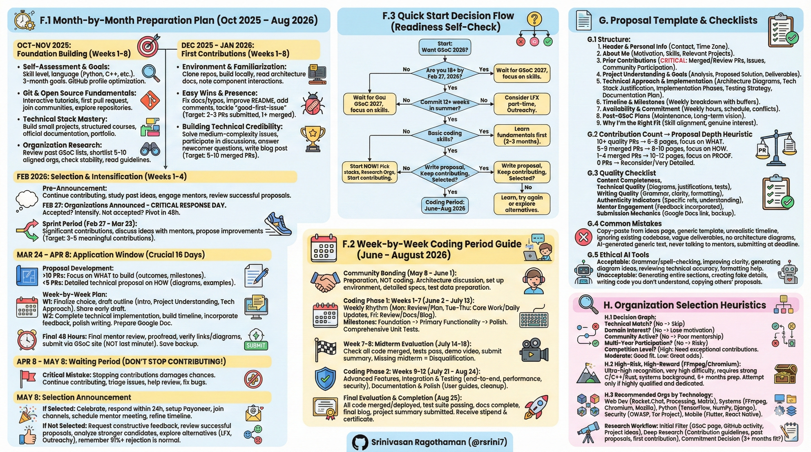
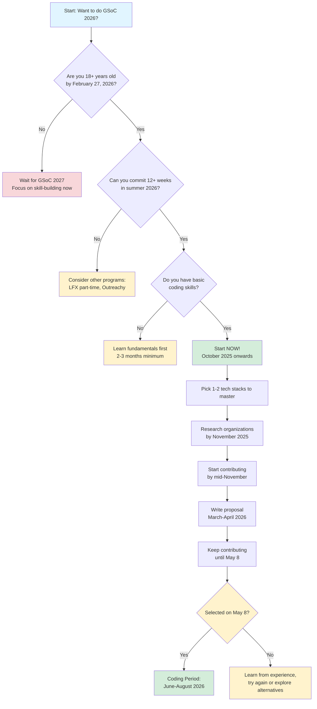
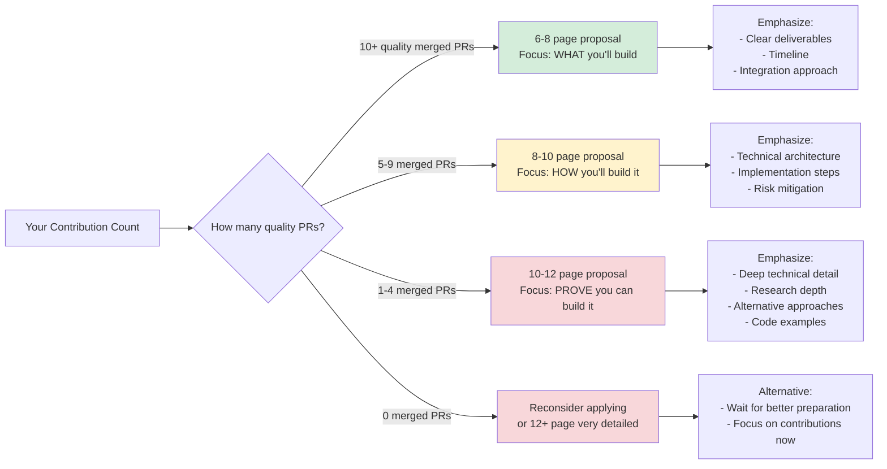
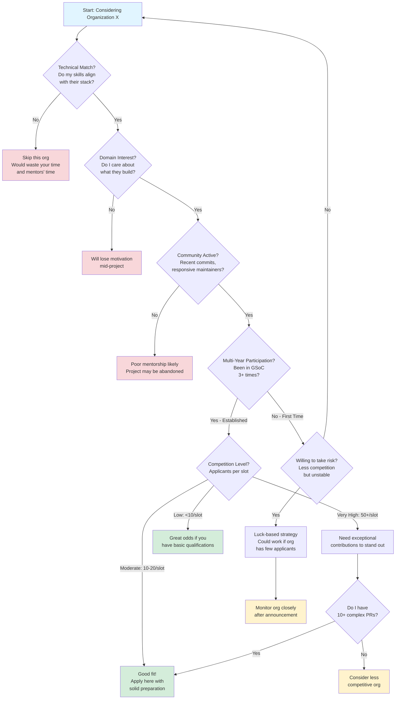

# New Appendices for India-GSoC-2026-Trends-Challenges-Solutions.md

Source Document to refer : [India-GSoc-2026-Trends-Challenges-Solutions.md](India-GSoc-2026-Trends-Challenges-Solutions.md)



## Appendix F: Operational Playbook for Contributors

### F.1 Month-by-Month Preparation Plan (October 2025 – August 2026)

**Note:** Dates below are illustrative based on typical GSoC cycles. Always verify against the official 2026 timeline in Appendix A and adapt as needed.

#### **October - November 2025: Foundation Building**

**Weeks 1-2: Self-Assessment & Goal Setting**
```
☐ Assess current skill level (beginner/intermediate/advanced)
☐ Choose primary programming language (Python, JavaScript, C++, Rust, Java)
☐ Choose secondary framework or domain (web, ML, systems, mobile)
☐ Set concrete 3-month learning goals
☐ Create/optimize GitHub profile
```

**Weeks 3-4: Git & Open Source Fundamentals**
```
☐ Complete interactive Git tutorial (learngitbranching.js.org)
☐ Make first pull request to any project (use firstcontributions.github.io)
☐ Read "How to Contribute to Open Source" guide
☐ Join 2-3 open source communities on Discord/Slack
☐ Star and explore 10+ repositories matching your interests
```

**Weeks 5-6: Technical Stack Mastery**
```
☐ Build 1-2 small complete projects in chosen stack
☐ Complete structured online course or tutorial series
☐ Read official documentation for target frameworks
☐ Create portfolio website or enhanced GitHub profile README
```

**Weeks 7-8: Organization Research**
```
☐ Review GSoC 2024 and 2025 organization lists
☐ Shortlist 5-10 organizations aligned with your skills/interests
☐ Identify which returned multiple years (stability indicator)
☐ Read their "Getting Started" and "Contributing" documentation
☐ Join their official communication channels (Slack/Discord/Zulip)
```

#### **December 2025 - January 2026: First Contributions**

**Weeks 1-2: Environment Setup & Codebase Familiarization**
```
☐ Clone repositories of 2-3 target organizations
☐ Successfully build/run projects locally
☐ Read architecture documentation and code structure
☐ Create notes on how major components interact
☐ Identify areas matching your skills
```

**Weeks 3-4: Easy Wins & Community Presence**
```
☐ Fix documentation typos, broken links, outdated examples
☐ Improve README files with clearer explanations
☐ Add missing code comments following project style
☐ Tackle issues labeled "good-first-issue" or "beginner-friendly"
☐ Target: Submit 2-3 pull requests, get at least 1 merged
```

**Weeks 5-8: Building Technical Credibility**
```
☐ Solve "help-wanted" or medium-complexity issues
☐ Participate actively in issue discussions and code reviews
☐ Answer questions from other newcomers (demonstrates understanding)
☐ Consider writing blog post about contribution journey
☐ Target: 5-10 merged pull requests by end of January
```

#### **February 2026: Organization Selection & Intensification**

**February 1-26: Pre-Announcement Preparation**
```
☐ Continue contributing to top 3 target organizations
☐ Study previous year's project ideas pages carefully
☐ Engage with potential mentors in community channels
☐ Attend community meetings if publicly available
☐ Review 3-5 successful proposals from past years
```

**February 27: Organizations Announced - CRITICAL RESPONSE DAY**

Decision tree:
- **Target org accepted?** → Immediately intensify contributions
- **Target org NOT accepted?** → Pivot within 48 hours to backup organization
- **Both scenarios:** Contact mentors about project ideas, start proposal outline

**February 27 - March 23: Sprint Period (4 weeks before applications)**
```
☐ Make significant, non-trivial technical contributions
☐ Demonstrate deep understanding of codebase architecture
☐ Discuss specific project ideas with mentors (ask intelligent questions)
☐ Propose improvements showing initiative and domain knowledge
☐ Target: 3-5 meaningful contributions during this critical window
```

#### **March 24 - April 8: Application Window (Crucial 16 Days)**

**Proposal Development Strategy:**

**If you have 10+ quality contributions:**
- Focus proposal on **what you'll build** (outcomes, deliverables)
- 6-8 pages sufficient
- Emphasize timeline, milestones, and integration points
- Reference existing contributions as proof of capability

**If you have <5 contributions:**
- Create detailed technical proposal (10-12 pages) showing **how you'll build it**
- Include architecture diagrams, technology justifications, code examples
- Demonstrate research depth and problem understanding
- Must convince evaluators you can execute despite limited history

**Week-by-Week Application Period Plan:**

**Week 1 (March 24-30):**
```
☐ Finalize project choice based on mentor discussions
☐ Create detailed proposal outline (see Appendix G.1)
☐ Draft Introduction, Project Understanding, About Me sections
☐ Begin technical approach diagrams
☐ Share early draft with mentor for initial feedback
```

**Week 2 (March 31 - April 6):**
```
☐ Complete technical implementation section with code examples
☐ Build realistic timeline with weekly breakdown and buffers
☐ Incorporate mentor feedback from first review
☐ Polish writing, check grammar/clarity
☐ Prepare submission via Google Docs (view/comment access)
```

**Final 48 Hours (April 7-8):**
```
☐ Final mentor review and last-minute adjustments
☐ Proofread entire proposal 2-3 times
☐ Verify all links, diagrams, and formatting
☐ Submit through official GSoC website (NOT last-minute!)
☐ Save backup copy locally
```

#### **April 8 - May 8: Waiting Period (DON'T STOP CONTRIBUTING!)**

**Critical mistake:** Many applicants stop contributing after submission. This damages selection chances for borderline candidates.

```
☐ Continue making contributions (shows genuine interest vs credential-seeking)
☐ Remain active in community discussions and issue triage
☐ Help review other contributors' work when appropriate
☐ Fix bugs reported by users
☐ If mentors ask clarifying questions, respond promptly
☐ Prepare emotionally for both acceptance and rejection scenarios
```

#### **May 8: Selection Announcement**

**If Selected:**
```
☐ Celebrate appropriately (you earned it!)
☐ Respond to acceptance email within 24 hours
☐ Wait for Payoneer setup instructions (official email)
☐ Join contributor-specific communication channels
☐ Schedule first planning meeting with mentor
☐ Begin refining project timeline and milestone definitions
☐ Set up project tracking system (GitHub Projects, Jira, etc.)
```

**If Not Selected:**
```
☐ Request constructive feedback from mentors (politely)
☐ Review selected proposals if organization publishes them
☐ Analyze what stronger candidates demonstrated
☐ Continue contributing—many successful contributors were rejected initially
☐ Explore alternative programs (LFX Mentorship, Outreachy—see Section 11)
☐ Document lessons learned for potential re-application
☐ Remember: 91%+ rejection rate is normal; this doesn't define your worth
```

---

### F.2 Week-by-Week Coding Period Guide (June - August 2026)

**Note:** Align these activities with official evaluation windows from Appendix A.

#### **Community Bonding Period (May 8 - June 1, ~3 weeks)**

**Purpose:** Preparation, NOT coding. Resist urge to start implementation.

**Week 1 (May 8-14):**
```
☐ Detailed architecture discussion with mentor
☐ Clarify any ambiguous requirements from proposal
☐ Agree on communication rhythm (daily check-ins? weekly calls?)
☐ Set up complete development environment
☐ Verify all tooling works (build, test, deploy pipelines)
```

**Week 2 (May 15-21):**
```
☐ Deep-dive into codebase sections you'll modify
☐ Create detailed technical specification document
☐ Finalize weekly milestone breakdown with mentor approval
☐ Set up project board with tasks (GitHub Projects recommended)
☐ Identify potential risks and mitigation strategies
```

**Week 3 (May 22 - June 1):**
```
☐ Write design document (if organization requires)
☐ Get mentor sign-off on approach before coding begins
☐ Prepare test data, mock environments, or fixtures
☐ Submit community bonding blog post (many orgs require)
☐ Final preparation: ensure you're ready to hit ground running June 2
```

#### **Coding Phase 1: Weeks 1-7 (June 2 - July 13)**

**Weekly Rhythm Template:**

**Monday:**
- Review last week's progress with mentor
- Define this week's specific deliverables
- Update project board with new tasks

**Tuesday-Thursday:**
- Core implementation work
- Daily micro-updates to mentor (async via Slack/Discord)
- Write tests alongside code (not after!)

**Friday:**
- Code review and refinement
- Update documentation for new features
- Weekly progress blog post or report
- Preview next week's plan

**Phase 1 Milestone Breakdown Example:**

**Weeks 1-2 (June 2-15):** Core infrastructure
```
☐ Implement foundational component A
☐ Write comprehensive unit tests (80%+ coverage target)
☐ Submit PR #1 for review
☐ Address review feedback and iterate
```

**Weeks 3-4 (June 16-29):** Primary functionality
```
☐ Build main feature B with integration to component A
☐ Integration tests for component interaction
☐ Submit PR #2
☐ Begin user-facing documentation
```

**Weeks 5-6 (June 30 - July 13):** Polish & prepare for midterm
```
☐ Complete remaining Phase 1 features
☐ Performance testing and optimization
☐ Comprehensive code review with mentor
☐ Finalize midterm deliverables checklist
```

#### **Week 7-8: Midterm Evaluation (July 14-18, 2026)**

**Preparation Checklist:**
```
☐ Ensure all Phase 1 code is merged to main branch
☐ Verify all tests pass in CI/CD pipeline
☐ Create working demo video or live demonstration
☐ Write midterm evaluation summary (achievements, challenges, plan)
☐ Submit evaluation through official GSoC portal
☐ Await mentor evaluation (must pass to continue)
```

**Critical:** Missing midterm = immediate disqualification and zero payment. Plan to submit 24-48 hours early.

**Post-Midterm (assuming pass):**
```
☐ Receive 45% stipend payment (~July 18-22)
☐ Review Phase 2 plan with mentor
☐ Adjust timeline if Phase 1 revealed unexpected complexity
☐ Brief rest period (1-2 days), then resume coding
```

#### **Coding Phase 2: Weeks 9-12 (July 21 - August 24)**

**Weeks 9-10 (July 21 - August 3):** Advanced features
```
☐ Implement Phase 2 features building on Phase 1 foundation
☐ Continue test-driven development approach
☐ Regular mentor check-ins to prevent scope drift
```

**Week 11 (August 4-10):** Integration & testing
```
☐ Comprehensive end-to-end testing
☐ Performance benchmarking (if applicable)
☐ Security review and hardening
☐ Cross-browser/platform testing (if relevant)
```

**Week 12 (August 11-17):** Documentation & polish
```
☐ Complete all user documentation with examples
☐ Update developer documentation for future contributors
☐ Code cleanup and refactoring for maintainability
☐ Ensure all inline comments follow project standards
```

**Final Week (August 18-24):** Delivery preparation
```
☐ Merge all final code to main branch
☐ Create comprehensive project summary document
☐ Record final demo video showcasing all features
☐ Write detailed final blog post (technical + personal reflection)
☐ Prepare final evaluation submission
```

#### **Final Evaluation & Project Completion (August 25, 2026)**

**Submission Checklist:**
```
☐ All code merged and deployed (if applicable)
☐ Test suite comprehensive and all tests passing
☐ Documentation complete (user guides, API docs, developer notes)
☐ Final blog post published on personal blog + organization blog
☐ Project summary with links to all deliverables
☐ Mentor evaluation submitted through GSoC portal
☐ Final self-evaluation submitted
```

**Post-Submission:**
```
☐ Await mentor's final evaluation (usually within 1 week)
☐ Receive 55% stipend payment (~September 9-15)
☐ Obtain completion certificate from Google
☐ Request testimonial from mentor (for LinkedIn/portfolio)
```

---

### F.3 Quick Start Decision Flow (Readiness Self-Check)



**Ethical Participation Alignment:**

This flowchart supports the program integrity principles from Sections 5 and 10:

- **Time investment requirement** (start October, not March) discourages last-minute spam contributions
- **Skill prerequisite** ensures meaningful participation rather than credential-chasing
- **12-week commitment** filters applicants unable to complete projects (reducing dropout rates)
- **Alternative pathways** for those not ready prevents desperation-driven unethical behavior

**Using This Flow:**

1. **Self-assess honestly** at each decision point
2. **"No" answers aren't failures**—they indicate timing or preparation issues
3. **Follow the recommended path** even if impatient; shortcuts damage both individual prospects and collective reputation
4. **Recycle through the flow** annually; readiness changes with experience

---

## Appendix G: Proposal Template and Checklists

### G.1 Recommended Proposal Structure

**Purpose:** This template synthesizes best practices from successful proposals while maintaining flexibility for organization-specific requirements. **Always prioritize organization-provided templates when available.**

**Optional Reference Resources:**
- YouTube explanation: [GSoC Proposal Writing](https://www.youtube.com/watch?v=kZa8lGTwDhA)
- Large project sample: [Drive link](https://drive.google.com/file/d/1f7oQLQs3JsEKT9FqIilS77eIWKqBN-KK/view)
- Medium project sample: [Drive link](https://drive.google.com/file/d/191BYnVgIqAbCKRmD7AkQU2oDUY0GEFdC/view)

**Note:** These are illustrative examples, not authoritative templates. Your proposal should be original and customized.

---

#### **Section 1: Header & Personal Information (0.5 page)**

```markdown
# [Clear, Specific Project Title]
## Proposal for [Organization Name] - GSoC 2026

**Contributor Information:**
- Full Name: [Your name]
- Email: [Primary contact]
- GitHub: github.com/[username]
- LinkedIn: linkedin.com/in/[profile] (optional)
- Location: [City, Country]
- Time Zone: [e.g., IST (UTC+5:30)]
- University/Employment: [Current status]

**Contact Preferences:**
- Preferred Communication: [Slack/Discord/Email]
- Typical Availability: [Your working hours in UTC]
- Response Time Commitment: <24 hours on weekdays
```

---

#### **Section 2: About Me / Self-Introduction (1 page)**

**Subsection 2.1: Background & Motivation**

Write 2-3 authentic paragraphs covering:
- Academic or professional background relevant to project
- Programming experience (languages, years, contexts)
- **Why THIS specific organization interests you** (genuine reasons, not generic)
- **Why THIS specific project** (problem you care about solving)
- Connection to open-source values (learning, collaboration, impact)

**Subsection 2.2: Technical Skills & Experience**

Create a realistic skill inventory:

```markdown
**Programming Languages:**
- Expert: [Language A] - [X years, context]
- Proficient: [Language B] - [Y years, projects]
- Learning: [Language C] - [current stage]

**Frameworks & Tools:**
- [Framework 1]: [Proficiency level, relevant projects]
- [Framework 2]: [Experience details]

**Development Practices:**
- Version Control: Git/GitHub (X years)
- Testing: [Unit testing frameworks, coverage experience]
- CI/CD: [Familiarity with pipelines]
- Documentation: [Experience with tools]
```

**Subsection 2.3: Relevant Projects**

List 2-3 most relevant personal/professional projects:

```markdown
1. **[Project Name]** ([github.com/link])
   - Description: [What it does, 1-2 sentences]
   - Technologies: [Tech stack]
   - Impact/Results: [Users, stars, or learning outcomes]
   - Relevance: [How it relates to GSoC project]
```

---

#### **Section 3: Prior Contributions to This Organization (1 page)**

**CRITICAL:** This section directly addresses credential-focused participation concerns from Section 5.3. Authentic contributions demonstrate genuine engagement.

```markdown
## My Contributions

**Pull Requests (Merged):**
1. **PR #[number]**: [Title] - [Brief description of impact]
   - Link: [URL]
   - Complexity: [Easy/Medium/Hard]
   - What I learned: [Technical insight gained]

2. **PR #[number]**: [Title]
   - [Similar format]

[List ALL merged PRs]

**Pull Requests (Under Review):**
- PR #[number]: [Title and status]

**Issues Opened/Discussed:**
- Issue #[number]: [What you identified/contributed]

**Community Participation:**
- [Describe involvement in discussions, helping others, etc.]

**Cumulative Impact:**
This contribution history helped me understand:
- [Specific architectural component]
- [Integration patterns with related systems]
- [Project coding standards and review process]
- [Community communication norms]
```

---

#### **Section 4: Project Understanding & Goals (1-2 pages)**

**Subsection 4.1: Current State Analysis**

Demonstrate deep understanding:

```markdown
**Existing Implementation:**
- Current approach: [How feature/system works today]
- Architecture: [Relevant components and their interactions]
- Limitations: [Specific problems users face]
- Technical debt: [Areas identified for improvement]

**Problem Statement:**
[Articulate the core problem your project solves - be specific]

**Why This Matters:**
- User impact: [How many users affected, what friction exists]
- Developer impact: [Contribution barriers, maintenance burden]
- Strategic value: [Alignment with organization's roadmap]
```

**Subsection 4.2: Proposed Solution**

Provide clear vision in 2-3 paragraphs:
- High-level approach
- Key innovations or improvements
- Expected user experience changes
- Integration with existing systems

**Subsection 4.3: Goals & Deliverables**

Use specific, measurable outcomes:

```markdown
**Primary Goals:**
1. [Concrete deliverable #1 with success metric]
   - Success criteria: [How we measure completion]
2. [Concrete deliverable #2]
   - Success criteria: [Measurable outcome]
3. [Concrete deliverable #3]

**Stretch Goals (if time permits):**
1. [Nice-to-have feature #1]
2. [Nice-to-have feature #2]

[Note: Clearly distinguish must-have vs nice-to-have]
```

---

#### **Section 5: Technical Approach & Implementation (3-4 pages)**

**Subsection 5.1: Architecture Overview**

Include visual diagram:

```
┌─────────────────────────────────────────┐
│       User Interface Layer              │
│  [Components: X, Y, Z]                  │
│  [Technologies: React, TypeScript]      │
└──────────────┬──────────────────────────┘
               │
┌──────────────▼──────────────────────────┐
│      Application Logic Layer            │
│  [Core Services: A, B, C]               │
│  [Business Logic: Authentication, etc.] │
└──────────────┬──────────────────────────┘
               │
┌──────────────▼──────────────────────────┐
│       Data/Storage Layer                │
│  [Database: PostgreSQL]                 │
│  [Caching: Redis]                       │
└─────────────────────────────────────────┘
```

**Subsection 5.2: Technology Stack Justification**

```markdown
**Languages:**
- [Language]: [Why chosen, version, specific use]

**Frameworks:**
- [Framework]: [Justification based on project needs]

**Libraries/Dependencies:**
- [Library 1]: [Purpose and rationale]
- [Library 2]: [Why this over alternatives]

**Tools:**
- Testing: [Framework choice, coverage targets]
- CI/CD: [Integration approach]
- Documentation: [Tool selection]
```

**Subsection 5.3: Implementation Details by Phase**

Break down work into logical components:

```markdown
#### Phase 1: [Component/Feature Name]

**Objective:** [What this phase achieves]

**Implementation Steps:**
1. [Specific task with file/module references]
2. [Another task with technical detail]
3. [...]

**New Classes/Modules:**
- `ClassName`: [Purpose and key methods]
- `AnotherClass`: [Responsibilities]

**Integration Points:**
- Connects to existing [module X] via [interface]
- Modifies [current component Y] to add [functionality]

**Pseudocode Example:**
```python
class ProposedFeature:
    """
    Purpose: [Clear explanation]
    """
    def __init__(self, config):
        self.config = config
        # Initialize resources
    
    def core_method(self, input_data):
        """
        Algorithm: [High-level approach]
        Complexity: O(n) time, O(1) space
        """
        # Implementation outline
        pass
```
```

[Repeat for Phase 2, Phase 3, etc.]

**Subsection 5.4: Testing Strategy**

```markdown
**Unit Tests:**
- Target coverage: 85%+
- Components: [Which modules get unit tests]
- Framework: [pytest, Jest, etc.]

**Integration Tests:**
- Workflows: [Which user journeys tested end-to-end]
- Test data: [How you'll generate realistic scenarios]

**Performance Testing (if applicable):**
- Benchmarks: [Specific metrics to measure]
- Targets: [Expected performance thresholds]

**Manual Testing:**
- User acceptance criteria
- Edge case validation
```

**Subsection 5.5: Documentation Plan**

```markdown
- **API Documentation:** [Tool: Swagger/OpenAPI, scope]
- **User Guide:** [Tutorial format, example-driven]
- **Developer Documentation:** [Architecture guide for future contributors]
- **Inline Code Comments:** [Following project style guide]
- **Blog Posts:** [Mid-project and final technical write-ups]
```

---

#### **Section 6: Timeline & Milestones (1-2 pages)**

**Format:** Weekly breakdown with realistic buffer time.

```markdown
### Community Bonding Period (May 8 - June 1, 2026)

**Week 1 (May 8-14):**
- Finalize technical specification with mentor
- Clarify ambiguous requirements
- Set up complete development environment

**Week 2 (May 15-21):**
- Deep dive into codebase sections I'll modify
- Create detailed design document
- Get mentor approval on approach

**Week 3 (May 22 - June 1):**
- Prepare test fixtures and mock data
- Final pre-coding checklist review
- Submit community bonding blog post

### Coding Phase 1 (June 2 - July 13, 2026)

**Week 1 (June 2-8): Foundation**
- [ ] Implement [specific component A]
- [ ] Write unit tests for component A (target: 90% coverage)
- [ ] Submit PR #1 for review
- **Deliverable:** [Concrete, testable outcome]

**Week 2 (June 9-15): Core Functionality**
- [ ] Build [feature B]
- [ ] Integration with existing [module X]
- [ ] Submit PR #2
- **Deliverable:** [...]

[Continue for each week through Week 7]

**Midterm Evaluation Deliverable (July 14):**
- ✅ [Specific feature 1] fully functional and tested
- ✅ [Specific feature 2] with integration tests
- ✅ Demo video showing [key functionality]
- ✅ Test coverage report: 85%+ on new code

### Coding Phase 2 (July 21 - August 24, 2026)

[Similar weekly breakdown for Phase 2]

**Final Deliverable (August 25):**
- ✅ All features from proposal completed
- ✅ Comprehensive test suite (unit + integration)
- ✅ Complete documentation (user + developer)
- ✅ Code merged to main branch and deployed (if applicable)
- ✅ Final blog post and project summary

### Buffer & Risk Mitigation

**Built-in Buffers:**
- 1 day per week for unexpected debugging
- 1 week mid-project for addressing review feedback
- Final week for polish and documentation

**Risk Mitigation:**
- If Phase 1 overruns: Reduce stretch goals, focus on core deliverables
- If blocking dependency: Parallel work on documentation while waiting
- Communication plan: Weekly progress reports to mentor, immediate escalation of blockers
```

---

#### **Section 7: Availability & Commitment (0.5 page)**

```markdown
## Time Commitment

**Weekly Hours:**
- [Project size] project: Committed to [X-Y] hours/week
- Primary coding: June-August 2026
- No overlapping internships or major commitments during this period

**Schedule:**
- Academic calendar: [Break period: June 1 - August 15, no classes]
- Available for sync meetings: [Your flexible hours in mentor's timezone]
- Typical working schedule: [e.g., 9 AM - 6 PM IST, Monday-Saturday]

**Potential Conflicts:**
[Be transparent]
- [Any planned vacation: dates, 3-day break]
- [Exam period if applicable: dates, reduced hours that week]

**Communication Commitment:**
- Response time: <24 hours on weekdays
- Weekly progress reports: Every Friday by 5 PM IST
- Emergency availability: Reachable via [Slack/phone] for critical issues
```

---

#### **Section 8: Post-GSoC Plans & Long-Term Engagement (0.5 page)**

```markdown
## Commitment Beyond Summer

**Immediate Post-GSoC (September-December 2026):**
- Maintain the component I build
- Fix bugs reported by users
- Help onboard future contributors to my code

**Long-Term Vision:**
- Become regular contributor to [Organization]
- Attend [relevant conference] and present this project (if accepted)
- Mentor new contributors in [specific area]
- Contribute to related roadmap items: [future features of interest]

**Knowledge Sharing:**
- Technical blog series (3-4 posts) documenting implementation journey
- Video walkthrough of architecture for developer documentation
- Potential conference talk submission to [name of conference]
```

---

#### **Section 9: Why I'm the Right Fit (0.5 page)**

Write 2-3 authentic paragraphs addressing:

1. **Skill alignment:** How your technical background matches project needs
2. **Genuine interest:** Why this problem personally resonates with you (not just resume building)
3. **Demonstrated commitment:** What your contribution history proves about work ethic
4. **Learning trajectory:** What you'll learn and how it aligns with your growth goals
5. **Community values:** Understanding of open-source ethos and collaboration

**Avoid generic statements.** Reference specific aspects of the organization's mission or codebase.

---

### G.2 Contribution Count → Proposal Depth Heuristic

**Context:** Analysis of 30+ successful and rejected proposals reveals correlation between contribution history and required proposal detail. This is a community-observed pattern, NOT official GSoC policy.



**Real Success Formula (from Section 11 case studies):**

| Contribution Profile | Proposal Length | Selection Rate | Why |
|---------------------|-----------------|----------------|-----|
| 10+ quality PRs + 6-8 page proposal | Short, outcome-focused | ~90% | Work speaks for itself; proposal shows planning ability |
| 5-9 PRs + 8-10 page proposal | Medium, process-focused | ~60% | Must demonstrate deeper understanding to compensate |
| 1-4 PRs + 10-12 page proposal | Long, proof-focused | ~30% | Must convince through research and technical depth |
| 0 PRs + any proposal | Any length | ~5% | Rarely selected; exceptional cases only |

**Interpretation Guidelines:**

- **"Quality" PRs** = Non-trivial contributions that solve real problems, not typo fixes
- **Page counts** include diagrams, code examples, and proper formatting (not dense text walls)
- These are **heuristics**, not guarantees; exceptional technical proposals can overcome limited contribution history
- **Organization-specific factors** matter: new orgs with fewer applicants may have different patterns

**Connection to Program Integrity Issues:**

This heuristic addresses challenges from Section 5:
- **Discourages spam contributions** (quantity without quality doesn't reduce proposal burden)
- **Rewards sustained engagement** (10+ meaningful PRs requires months of genuine work)
- **Surfaces authentic interest** (detailed proposals without contributions are easily identified as credential-seeking)

---

### G.3 Proposal Quality Checklist

**Use this before final submission to ensure your proposal meets baseline standards.**

#### **Content Completeness**

```
☐ All required sections from organization's template included
☐ Personal information accurate and complete
☐ Prior contributions listed with links (ALL merged PRs)
☐ Project goals clearly stated and measurable
☐ Technical approach explained in sufficient detail
☐ Timeline includes weekly breakdown with buffers
☐ Testing and documentation plans specified
☐ Post-GSoC commitment articulated
```

#### **Technical Quality**

```
☐ Architecture diagrams included and clearly labeled
☐ Technology choices justified (not just listed)
☐ Code examples or pseudocode demonstrate understanding
☐ Integration points with existing codebase identified
☐ Risk mitigation strategies outlined
☐ Performance/scalability considerations addressed (if relevant)
☐ Security implications discussed (if applicable)
☐ Alternative approaches considered and compared
```

#### **Writing Quality**

```
☐ Grammar and spelling checked (use Grammarly or similar)
☐ Technical terminology used correctly
☐ Clear, concise sentences (avoid unnecessary jargon)
☐ Consistent formatting throughout
☐ Headings and sections properly structured
☐ Visual hierarchy makes document scannable
☐ All links functional and pointing to correct resources
☐ PDF/document exports cleanly without formatting issues
```

#### **Authenticity Indicators**

**These demonstrate genuine engagement vs. credential-seeking:**

```
☐ Proposal shows deep understanding of specific codebase areas
☐ References actual issues, PRs, or discussions from the project
☐ Mentions specific maintainers or mentors by name (appropriately)
☐ Includes personal motivation beyond "learning" or "resume"
☐ Timeline reflects realistic complexity estimates
☐ Writing voice is authentic, not AI-generated generic text
☐ Demonstrates awareness of project roadmap and priorities
☐ Shows understanding of user pain points (not just technical specs)
```

#### **Mentor Engagement**

```
☐ Proposal shared with mentor(s) at least 1 week before deadline
☐ Mentor feedback incorporated with acknowledgment
☐ Second round of feedback requested after major revisions
☐ Mentor explicitly supportive or has approved approach
☐ All mentor questions/concerns addressed in final version
```

#### **Submission Mechanics**

```
☐ Submitted through official GSoC website (not just emailed)
☐ Google Docs link set to "Anyone with link can comment"
☐ Backup copy saved locally (PDF + source)
☐ Submitted at least 24 hours before deadline (not last minute!)
☐ Confirmation email received from GSoC system
☐ Link tested in incognito mode to verify accessibility
```

---

### G.4 Common Proposal Mistakes (Anti-Patterns)

**Learn from these frequent errors that lead to rejection:**

#### **Content Anti-Patterns**

❌ **Copy-paste from project ideas page**
- Evaluators instantly recognize their own text
- Shows zero original thought or research
- **Fix:** Rewrite in your own words; add unique insights

❌ **Generic template language**
- "I am passionate about open source" (without specifics)
- "This will be a great learning experience" (vague)
- **Fix:** Be specific about what excites you and why

❌ **Unrealistic timeline**
- "Week 1: Build entire frontend and backend"
- No buffer time for debugging or reviews
- **Fix:** Conservative estimates; add 25% buffer

❌ **Ignoring existing codebase**
- Proposing approach that contradicts project architecture
- Not mentioning which files/modules you'll modify
- **Fix:** Reference specific code locations; align with existing patterns

❌ **Vague deliverables**
- "Improve the documentation"
- "Make the UI better"
- **Fix:** "Add 15 code examples to API docs" or "Implement Material Design components for settings page"

#### **Technical Anti-Patterns**

❌ **Technology choices without justification**
- Listing tools without explaining why they fit
- Proposing stack mentor hasn't approved
- **Fix:** Justify each choice; ask mentor about preferences early

❌ **Missing architecture diagrams**
- Wall of text describing complex system
- Reviewers can't visualize your approach
- **Fix:** Include at least 2-3 clear diagrams

❌ **No testing or documentation plan**
- Focusing only on feature implementation
- Ignoring maintainability
- **Fix:** Dedicate 20-30% of timeline to tests and docs

❌ **Over-engineering or under-scoping**
- Proposing to "rewrite entire system in Rust"
- OR "Fix 3 small bugs" (insufficient for 12 weeks)
- **Fix:** Scope appropriate to project size and your experience

#### **Writing Anti-Patterns**

❌ **AI-generated generic text**
- Overly formal, repetitive phrasing
- Lacks personal voice or specific details
- Evaluators can detect GPT-style writing
- **Fix:** Write authentically; use AI only for grammar checks

❌ **Excessive buzzwords**
- "Leverage synergies in the cloud-native paradigm"
- Jargon without substance
- **Fix:** Clear, direct language; technical terms only when necessary

❌ **No proofreading**
- Typos, grammar errors, broken links
- Signals lack of attention to detail
- **Fix:** Proofread 3+ times; ask someone else to review

#### **Engagement Anti-Patterns**

❌ **Never talking to mentors**
- Submitting proposal without any prior discussion
- Ignoring mentor feedback requests
- **Fix:** Engage early; iterate based on feedback

❌ **Submitting at deadline**
- System crashes or last-minute issues
- No time to incorporate feedback
- **Fix:** Submit 24-48 hours early; allow time for iterations

❌ **Applying to 10+ organizations**
- Spread too thin; weak proposals everywhere
- Shows lack of genuine interest
- **Fix:** Focus deeply on 1-3 orgs where you've contributed

❌ **No contributions before applying**
- Proposal demonstrates no familiarity with codebase
- Impossible to prove you can execute
- **Fix:** Start contributing 3-6 months before applications

---

### G.5 Using AI Tools Ethically in Proposals

**Context:** AI tools like ChatGPT, Claude, and GitHub Copilot are widely available. Ethical use enhances your work; unethical use guarantees rejection.

#### **Acceptable AI Usage**

✅ **Grammar and spell-checking**
```
Your text → AI tool → Corrected grammar/spelling → Your review → Final text
```
- Tools: Grammarly, LanguageTool, ChatGPT for proofreading
- You maintain full authorship; AI just polishes

✅ **Improving sentence clarity**
```
Your technical explanation → AI suggestion for clarity → You evaluate and revise
```
- Use AI to make complex ideas more readable
- Always verify technical accuracy after AI edits

✅ **Generating diagram ideas**
```
Your requirements → AI suggests diagram structure → You create actual diagram
```
- AI can suggest how to organize information visually
- You build the actual diagram with accurate technical details

✅ **Reviewing technical accuracy**
```
Your code example → AI checks for errors → You fix identified issues
```
- Use AI as a second pair of eyes for bugs
- Don't blindly accept AI corrections

✅ **Formatting and structure help**
```
Your content → AI suggests better organization → You reorganize
```
- AI can recommend section order or formatting improvements
- You maintain control over content and flow

#### **Unacceptable AI Usage**

❌ **Generating entire sections**
```
"Write technical approach for a Flutter mobile app" → Copy AI output → Submit
```
- **Why wrong:** Not your work; lacks project-specific understanding
- **Consequence:** Evaluators recognize generic AI text; immediate rejection

❌ **Creating fake technical details**
```
"Explain how to implement OAuth2" → Copy without understanding → Submit
```
- **Why wrong:** You can't execute what you don't understand
- **Consequence:** Mentor questions will expose gaps; failed project if selected

❌ **Writing code you don't understand**
```
"Generate Python code for API endpoint" → Copy to proposal → No comprehension
```
- **Why wrong:** During project, you'll be unable to debug or extend it
- **Consequence:** Project failure; wasted mentor time

❌ **Copying others' proposals**
```
Find successful proposal → AI paraphrases → Submit as yours
```
- **Why wrong:** Plagiarism; violates academic integrity
- **Consequence:** Permanent ban from GSoC if detected

#### **The Authenticity Test**

**Before submitting, ask yourself:**

```
Can I explain every sentence in my proposal during a live video call with my mentor?
- If YES → Proposal is authentic ✅
- If NO → Rewrite in your own words ❌
```

**Red flags that indicate over-reliance on AI:**
- You can't remember writing certain sections
- Technical explanations you couldn't reproduce verbally
- Code examples you couldn't modify without AI help
- Architecture decisions you can't justify

#### **Ethical AI Workflow Example**

**Task:** Explain your testing strategy

**❌ Wrong approach:**
```
1. Prompt: "Write testing strategy for GSoC proposal about web app"
2. Copy AI output verbatim
3. Submit without review
```

**✅ Right approach:**
```
1. Write draft based on your understanding:
   "I'll use pytest for unit tests and Selenium for integration tests"
   
2. Ask AI for improvement suggestions:
   "How can I make this testing section more comprehensive?"
   
3. AI suggests adding: coverage metrics, CI/CD integration, edge case handling
   
4. You research each suggestion independently
   
5. You write expanded section in your own words:
   "I'll use pytest for unit tests targeting 85% code coverage, measured via 
   pytest-cov. Integration tests will use Selenium to verify user workflows. 
   Tests will run in GitHub Actions on every PR..."
   
6. AI proofreads for grammar
   
7. You submit authentic work that you fully understand
```

#### **Why Authenticity Matters**

From Section 5 (credential-focused participation):
- **Ghostwritten proposals** are a documented problem in the coaching/cheating ecosystem
- **AI-generated applications** undermine program integrity similar to human ghostwriting
- **Mentors invest time** in contributors they believe are genuine; discovering inauthenticity destroys trust
- **Failed projects** result when contributors can't execute proposals they didn't truly write

**Connection to harassment incident (Section 5.2):**
- Credential-focused mentality views mentors as obstacles to desired outcome
- When contributors haven't genuinely earned selection, rejection feels like injustice
- Authentic engagement fosters respect for mentors' volunteer time and expertise

#### **Practical Guidelines**

**Green-light situations (AI okay):**
- "Check this paragraph for grammar errors"
- "Suggest a better way to phrase this technical concept"
- "Is this timeline realistic for the described work?"
- "Generate a Mermaid diagram template I can customize"

**Red-light situations (no AI):**
- "Write my technical approach section"
- "Explain how I'll implement feature X"
- "Generate code examples for my proposal"
- "Create my project timeline"

**Yellow-light situations (proceed with extreme caution):**
- "Help me brainstorm approaches to problem Y"
  - ✅ Use AI ideas as starting point for your own research
  - ❌ Copy AI's approach without understanding alternatives

- "Review my code example for errors"
  - ✅ Fix bugs AI identifies if you understand the fix
  - ❌ Apply changes you don't comprehend

---

## Appendix H: Organization Selection Heuristics

### H.1 Organization Selection Decision Graph

**Purpose:** Systematically evaluate potential organizations to maximize both selection probability and learning value while supporting program integrity.



#### **Decision Node Details**

**B: Technical Match Assessment**
```
Evaluate skill alignment:
☐ Primary language matches my expertise (3+ years experience)
☐ Framework/tools are ones I've used in projects
☐ Can understand existing codebase with <2 weeks study
☐ Domain knowledge sufficient (e.g., networking, ML, security)

If <2 criteria met → Skip (learning curve too steep for 12 weeks)
If 2-3 criteria met → Possible (requires extra preparation)
If all 4 criteria met → Strong match
```

**D: Domain Interest Verification**
```
Ask yourself:
1. Have I used this software or similar tools?
2. Would I work on this even without GSoC stipend?
3. Do I read about this technology domain regularly?
4. Can I articulate why this problem matters?

Authentic interest sustains motivation through:
- Difficult debugging sessions
- Tedious documentation work
- Post-GSoC maintenance commitment
```

**F: Community Activity Check**
```
Research checklist:
☐ Check GitHub commit graph: Active in last 3 months?
☐ Review issue response time: <1 week average?
☐ Test community channels: Are they responsive to newcomers?
☐ Read recent release notes: Regular releases?
☐ Check mentor availability: Who will mentor? Are they active?

Red flags:
❌ Last commit >3 months ago
❌ Issues open for >6 months without response
❌ Community channels inactive or hostile
❌ No clear mentors identified
```

**H: Multi-Year Participation Analysis**
```
Why established orgs are safer:
✅ Proven mentorship structure
✅ Known selection criteria
✅ Past proposals available for study
✅ Likely to return next year (if rejected, can retry)
✅ Mentors experienced with GSoC process

Why new orgs are risky:
⚠️ First-time mentor mistakes
⚠️ May not return if experience is poor
⚠️ No historical data on expectations
⚠️ Acceptance criteria unclear

Check history:
- Visit summerofcode.withgoogle.com/archive
- Look for org in 2022, 2023, 2024, 2025
- Consistent participation → Stability
```

**J: Competition Level Estimation**
```
How to estimate applicants per slot:

1. Check last year's statistics (if published):
   - Organization page often lists # of projects
   - Community channels may discuss applicant volume

2. Indicators of HIGH competition (50+ per slot):
   - Famous projects: Chromium, Mozilla, Linux, TensorFlow
   - Trendy technologies: AI/ML, blockchain, cloud-native
   - Large user base: Millions of users
   - Strong employer brand: Resume value perceived as very high

3. Indicators of MODERATE competition (10-20 per slot):
   - Specialized domains: Scientific computing, accessibility tools
   - Established but not mainstream: Smaller ecosystems
   - Technical barrier: Requires specific expertise

4. Indicators of LOW competition (<10 per slot):
   - Niche tools: Very specific use cases
   - New to GSoC: First or second year
   - Less popular languages: Not JavaScript/Python mainstream
   - Smaller communities: <1000 stars on GitHub
```

#### **Mapping to Program Integrity**

This decision graph addresses issues from Sections 5 and 6:

**Node D (Domain Interest)** → Filters credential-seekers
- Those motivated only by stipend struggle here
- Genuine interest visible in contribution history
- Reduces post-selection dropout rates

**Node F (Community Activity)** → Protects contributors from burnout
- Inactive communities can't provide proper mentorship
- Reduces contributor frustration and abandoned projects
- Aligns with maintainer sustainability (Section 5.5)

**Node H (Multi-Year Participation)** → Rewards sustainable orgs
- Organizations that treat contributors well return
- Those with spam/harassment issues tend to drop out
- Encourages long-term community building

---

### H.2 High-Risk, High-Reward Strategy: FFmpeg/Chromium Path

**Context:** Some organizations offer exceptional resume value but require extraordinary preparation. This strategy is NOT for most applicants.

#### **Why These Are Special**

**Organizations in this category:**
- **FFmpeg** (multimedia processing)
- **Chromium** (web browser engine)
- **Linux Kernel** (operating system)
- **GCC/LLVM** (compiler infrastructure)
- **Mozilla Core** (browser engine)

**Unique characteristics:**
```
✅ Ultra-high industry recognition
✅ Impressive technical depth
✅ FAANG recruiters notice these
✅ Genuine systems programming experience
✅ Global impact (millions/billions of users)

❌ Extremely steep learning curve
❌ Months just to understand codebase
❌ Very low acceptance rate (2-5%)
❌ Requires strong C/C++/Rust skills
❌ Minimal hand-holding from mentors
```

#### **Requirements for This Path**

**Skill Prerequisites:**
```
Must-have:
☐ 2+ years of C/C++ or Rust (not just academic coursework)
☐ Strong computer science fundamentals (OS, networks, algorithms)
☐ Experience debugging complex systems
☐ Comfortable reading large codebases (100k+ LOC)
☐ Understanding of build systems (Make, CMake, Bazel)

Highly recommended:
☐ Contributed to other systems projects before
☐ Low-level debugging experience (gdb, lldb, valgrind)
☐ Performance optimization knowledge
☐ Assembly language familiarity (for debugging)
```

**Time Investment Required:**
```
Month 1-2 (Oct-Nov):
- Study C/C++ deeply if not already expert
- Read foundational books (K&R C, Effective C++)
- Build 2-3 complex systems projects

Month 3 (Dec):
- Clone target repository
- Spend 2 hours daily just reading code
- Understand build process completely
- Map out architecture

Month 4 (Jan):
- Find compilation warnings or simple bugs
- Make first trivial contribution
- Get familiar with review process
- Join mailing lists/IRC

Month 5 (Feb):
- Tackle "good first issue" (still hard!)
- Expect weeks on single bug
- Build relationship with maintainers
- Demonstrate persistence

Month 6 (Mar):
- Solve medium-difficulty issue
- Prove technical capability
- Draft ambitious but realistic proposal
- Get mentor buy-in
```

#### **Realistic Success Odds**

**Comparison with standard path:**

| Metric | Standard Org (e.g., Django) | High-Difficulty Org (e.g., FFmpeg) |
|--------|------------------------------|-------------------------------------|
| Applicants per slot | 15-25 | 40-60 |
| Required contributions | 5-10 merged PRs | 3-5 merged PRs (but complex) |
| Preparation time | 3-4 months | 6-8 months |
| Selection rate (with contributions) | 15-25% | 5-10% |
| Career impact (3 years later) | Positive | Extremely high |
| Median salary boost | +20-30% | +40-60% |

**Why success rate is lower despite fewer PRs:**
- Competition includes PhD students and experienced developers
- Maintainers have very high standards
- One mistake in proposal reveals lack of depth
- Must demonstrate not just coding but systems thinking

**Why career impact is higher:**
- FFmpeg/Chromium on resume opens FAANG doors immediately
- Demonstrates rare combination: initiative + technical depth
- Network includes world-class engineers
- Skills directly transferable to high-paying roles

#### **Decision Framework: Should You Attempt This?**

**Attempt this path if:**
```
✅ You have 6+ months to prepare (starting now)
✅ Strong CS fundamentals and systems background
✅ Genuinely interested in low-level programming
✅ Willing to invest 20+ hours/week in preparation
✅ Can handle high probability of rejection
✅ Long-term career trajectory values depth over breadth
✅ Already comfortable with C/C++ (3+ years)
```

**Choose standard path instead if:**
```
❌ Application timeline is <4 months
❌ No prior systems programming experience
❌ Need higher selection probability for validation
❌ Prefer web development or application layer
❌ Cannot dedicate extensive preparation time
❌ First attempt at GSoC (try easier org, then level up)
```

#### **Alignment with Effort-Based Success**

From Section 10.1 and case studies (Section 11):

**Effort-based path characteristics:**
- Target established, well-known organizations ✅ (FFmpeg/Chromium are established)
- Solve difficult technical issues ✅ (These orgs only have difficult issues)
- Build deep expertise in one codebase ✅ (6 months focused study)
- Higher chance through demonstrated competence ✅ (Quality over quantity)
- Better long-term career value ✅ (Maximum resume impact)

**This IS effort-based, just at extreme end of difficulty spectrum.**

**Contrast with luck-based path:**
- Luck-based: Target new orgs with few applicants
- Effort-based (standard): Target established orgs with moderate preparation
- Effort-based (extreme): Target prestigious orgs with extensive preparation

---

### H.3 Recommended Organizations by Technology Area

**IMPORTANT DISCLAIMER:** These recommendations are based on 2024-2025 historical data. Organizations change year to year. Always verify:
- Current acceptance in GSoC 2026
- Active development via GitHub commit graphs
- Community responsiveness via their communication channels
- Project ideas alignment with your interests

**Do NOT blindly apply based on these tables. Use them as starting points for research.**

#### **For Web Development (JavaScript/TypeScript)**

| Organization | Domain | Difficulty | 2024-2025 Pattern | Why Consider |
|--------------|--------|------------|-------------------|--------------|
| **Rocket.Chat** | Real-time messaging | Medium | 10-15 slots, ~150 applicants | Active community, modern stack (React/Node), good for full-stack developers |
| **Processing Foundation** | Creative coding tools | Medium | 8-12 slots, returns annually | Fair selection process, artistic + technical blend, supportive mentors |
| **Matrix** | Decentralized messaging | Medium-High | 6-10 slots, growing | Modern protocols, P2P architecture, real-world impact on privacy |
| **Jitsi** | Video conferencing | Medium | 8-12 slots, established | Lots of JavaScript/TypeScript work, clear technical challenges, responsive community |

**Best for:** Students with 1-2 years web development experience, comfortable with React/Vue/Angular and Node.js.

#### **For Systems Programming (C/C++/Rust)**

| Organization | Domain | Difficulty | 2024-2025 Pattern | Why Consider |
|--------------|--------|------------|-------------------|--------------|
| **FFmpeg** | Multimedia processing | Very High | 4-6 slots, ~200+ applicants | Ultimate resume value, extremely competitive, requires deep C knowledge |
| **Chromium** | Web browser engine | Very High | 6-10 slots, ~300+ applicants | FAANG-level recognition, only for experienced systems programmers |
| **Mozilla** | Browser & tools | High | 10-15 slots across projects | Great mentorship, high impact, multiple project types available |
| **Rust Project** | Programming language | High | 5-8 slots, growing | Future-focused, excellent community, compiler/tooling work |

**Best for:** Students with strong CS fundamentals, 2+ years C/C++/Rust, comfortable with low-level debugging.

#### **For Python Developers**

| Organization | Domain | Difficulty | 2024-2025 Pattern | Why Consider |
|--------------|--------|------------|-------------------|--------------|
| **TensorFlow** | Machine learning | Medium-High | 12-20 slots, very popular | AI/ML focus, industry-relevant, Google backing |
| **NumPy/SciPy** | Scientific computing | High | 6-10 slots, academic angle | Research credibility, well-maintained, math-heavy |
| **Django** | Web framework | Medium | 8-12 slots, returns regularly | Practical skills, large community, clear contribution path |
| **Scrapy** | Web scraping | Medium | 4-6 slots, specialized | Clear projects, active maintenance, niche but useful |

**Best for:** Python developers interested in ML, scientific computing, or web development; 1-2 years Python experience.

#### **For Security & Privacy Enthusiasts**

| Organization | Domain | Difficulty | 2024-2025 Pattern | Why Consider |
|--------------|--------|------------|-------------------|--------------|
| **OWASP** | Web security | Medium | 15-25 slots across projects | Multiple subprojects, security career path, broad scope |
| **Tor Project** | Privacy & anonymity | High | 4-8 slots, selective | Meaningful impact, strong community values, challenging work |
| **OpenCRE** | Security knowledge graph | Medium | New/returning varies | Intersects AI + security + legal, unique combination |
| **Metasploit** | Penetration testing | High | 4-6 slots, specialized | InfoSec resume boost, requires security background |

**Best for:** Students interested in cybersecurity careers, understanding of web technologies and security principles.

#### **For Mobile Development**

| Organization | Domain | Difficulty | 2024-2025 Pattern | Why Consider |
|--------------|--------|------------|-------------------|--------------|
| **Flutter** | Cross-platform UI | Medium | 10-15 slots, Google project | Growing demand, modern framework, good learning experience |
| **React Native** | Cross-platform apps | Medium | Varies (community-driven) | Industry standard, active development, practical skills |
| **Matrix (Mobile)** | Messaging apps | Medium | Part of larger Matrix org | Real apps with real users, both Android and iOS |

**Best for:** Mobile developers (Android/iOS) or those wanting to learn cross-platform development.

### **Organization Research Workflow**

**Step 1: Initial Filter (30 minutes per org)**
```
1. Visit organization's GSoC page (when published)
2. Check GitHub repository:
   - Commit activity last 3 months?
   - Issues being actively triaged?
   - PR review turnaround time?
3. Read project ideas list:
   - Do any align with your skills?
   - Are they specific or vague?
4. Join community chat:
   - Introduce yourself
   - Gauge responsiveness
```

**Step 2: Deep Research (2-3 hours for top 3 choices)**
```
1. Read contribution guidelines thoroughly
2. Set up development environment locally
3. Find and read 3-5 past successful proposals
4. Identify 2-3 potential project ideas you'd enjoy
5. Make first trivial contribution (typo fix, doc improvement)
```

**Step 3: Commitment Decision (before investing weeks)**
```
Ask yourself:
- Can I see myself working on this for 3+ months?
- Do the mentors seem supportive in community discussions?
- Is the codebase quality good (readable, tested, documented)?
- Would I continue contributing even if not selected?

If 3+/4 are YES → Proceed with serious contributions
If <3 are YES → Reconsider; may not be good fit
```

---

