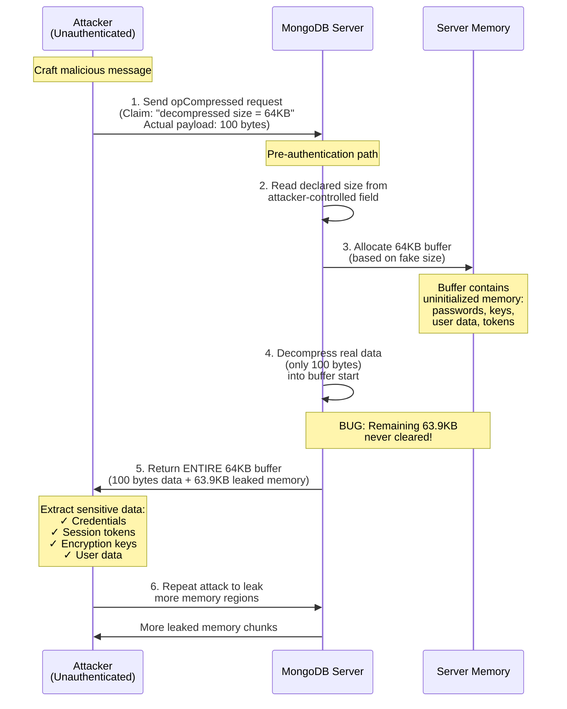

## What is MongoBleed?

**MongoBleed (CVE-2025-14847)** is a critical pre-authentication memory disclosure vulnerability in MongoDB's network compression handling. The flaw allows unauthenticated attackers to read arbitrary server memory by sending malformed compressed messages, potentially exposing sensitive data like credentials, encryption keys, and internal configurations.

**Key Details:**

- **Severity:** CVSS 8.7 (High)
- **Attack Surface:** Any network-accessible MongoDB instance—no authentication required
- **Affected Versions:** MongoDB 3.6+ (since 2017), patched in late 2025
- **Exposure:** Over 87,000 internet-facing MongoDB instances identified as vulnerable
- **Impact:** Memory leaks can reveal passwords, session tokens, user data, and system internals

## **How MongoBleed Works**

**Simple Explanation:**

Imagine ordering a small pizza, but the restaurant ships you an entire delivery truck with your pizza plus leftover food from previous orders still sitting in the back. MongoBleed works similarly: attackers send a tiny compressed message but trick MongoDB into sending back a huge chunk of server memory—including leftover data from other operations like passwords, keys, and confidential information.

---

**Technical Details:**

MongoDB supports compressing network messages using zlib to reduce bandwidth. Messages are wrapped in an "**opCompressed**" frame that can be used **even before authentication**—this is where the vulnerability lies.

Here's the attack sequence:

1. **Attacker sends a malicious compressed message** where the declared decompressed size is **much larger** than the actual payload
2. **MongoDB allocates a buffer** based on the attacker-controlled size field (e.g., claiming "this will decompress to 64KB")
3. **zlib decompresses the real data**, which might only be a few bytes, into the start of the buffer
4. **The remaining buffer space contains uninitialized memory**—leftover data from MongoDB's process that was never cleared
5. **MongoDB sends the entire buffer back** to the attacker, leaking arbitrary memory contents

**The Key Problem:** MongoDB trusts the attacker's declared size without validating it matches the actual decompressed output. The remaining uninitialized bytes can contain anything from the server's memory space: credentials, session tokens, encryption keys, user data, or internal configurations.

---

**Why This Matters:**

- **Pre-authentication exploit**: No password or login required
- **Conceptually similar to Heartbleed**: Both involve tricking a server into returning more memory than intended by manipulating a length field
- **Repeatable**: Attackers can send multiple requests to extract different memory regions

This is a classic **uninitialized memory disclosure** bug, and it's particularly dangerous because the compressed message path was designed for performance optimization but lacked proper bounds checking on the decompression buffer.

### Exploit Process Diagram

## Why It’s Dangerous

- The leaked bytes come from live MongoDB process memory, so responses can contain fragments of queries, credentials, keys, environment variables, and other sensitive data from unrelated clients.****
- Because the bug is pre-auth, firewalls and database authentication do not help if an attacker can reach the MongoDB port; this makes it attractive to chain with other bugs (e.g., stealing DB creds, pivoting to internal Git, and escalating inside a network, as reported for Ubisoft infrastructure).****

## Affected Versions

Most MongoDB versions from the last 10 years are at risk. Here's a simple list:

- Affected: 3.6.x and up, including 4.0.x, 4.2.x, 4.4.x, 5.0.0–5.0.31, 6.0.0–6.0.26, 7.0.0–7.0.27, 8.0.0–8.0.16, 8.2.0–8.2.2.
- Fixed: Upgrade to 5.0.32, 6.0.27, 7.0.28, 8.0.17, 8.2.3, or later. Older ones like 4.4 need 4.4.30.

MongoDB's cloud service (Atlas) was patched early, so it's safe if you use that.

## Affected and Fixed Deployments

- Public analysis notes that on-prem/self-managed MongoDB instances running specific vulnerable versions with network compression enabled are affected, whereas MongoDB’s managed Atlas service was patched before public disclosure.****
- Security researchers and news outlets describe MongoBleed as “critical severity,” with guidance that any exposed, non-updated MongoDB instance on the internet should be treated as at high risk of compromise.****

## Real-World Impact

The flaw is already exploited in attacks. For example:

- **Ubisoft Breach (December 2025)**: Hackers used MongoBleed on an exposed MongoDB server for Rainbow Six Siege. They stole source code, messed with in-game money, and caused server outages. This affected player accounts and game features.
- **Wider Risks**: Over 200,000 MongoDB servers are exposed online. Groups are scanning for them. The U.S. government (CISA) added it to their "must-fix" list because of active attacks.
- **From Videos**: One video shows a demo of the exploit leaking memory. Another talks about how it ruined Christmas for engineers fixing it urgently. Research verifies this with reports from security firms like eSentire and BleepingComputer. [Ref]

No big breaches in places like India yet, but attacks are rising.

## **MongoBleed Mitigation Steps**

**Take immediate action to protect your MongoDB deployments:**

---

### **1. Immediate Actions (Do This Now)**

**Patch Your Systems**
- **Upgrade to the latest MongoDB version** with the security fix (released in late 2025)
- Apply all security patches recommended in MongoDB's official advisory (CVE-2025-14847)
- Prioritize internet-facing instances first, then internal deployments

**Verify Your Exposure**
- Use detection tools like the **MongoBleed Detector** (available on GitHub) to scan your infrastructure
- Check if your MongoDB ports (default: 27017) are exposed to the internet
- Run the `mongobleed.py` testing script in a controlled environment to verify if instances are vulnerable

---

### **2. Network Hardening (Essential Security)**

**Isolate MongoDB from Public Access**
- **Never expose MongoDB directly to the internet**—this should be a fundamental rule
- Place MongoDB behind private networks, VPNs, or application backends only
- Use firewall rules and security groups to whitelist only trusted IP addresses

**Implement Network Controls**
- Configure strict firewall rules to block unauthorized access
- Limit connections to specific application servers and admin hosts
- Use network segmentation to isolate database traffic

---

### **3. Configuration Hardening**

**Disable Compression if Not Required**
- Turn off zlib compression in MongoDB unless it's strictly necessary for your workload
- Check your `mongod.conf` file and disable the `networkCompression` option
- Test performance impact before deploying to production

**Enable Authentication & Encryption**
- Enforce authentication on all MongoDB instances (never run with `--noauth`)
- Enable TLS/SSL for all client connections
- Use role-based access control (RBAC) to limit privileges

---

### **4. Monitoring & Detection**

**Set Up Alerts**
- Monitor for abnormal connection patterns from unexpected IP addresses
- Watch for unusually large response sizes that could indicate memory leaks
- Track authentication failures and suspicious query patterns

**Log Analysis**
- Enable detailed logging for compressed message handling
- Set up SIEM rules to detect potential MongoBleed exploitation attempts
- Review logs regularly for anomalies

---

### **5. Long-Term Security Practices**

- **Regular patching schedule**: Subscribe to MongoDB security advisories and apply updates promptly
- **Security audits**: Conduct periodic reviews of database exposure and access controls
- **Incident response plan**: Prepare procedures for potential data breaches
- **Credential rotation**: If you suspect exploitation, immediately rotate all credentials, API keys, and secrets

---

### **Official Resources**

- **MongoDB Security Advisory**: Check the official MongoDB security page for the latest CVE-2025-14847 details
- **GitHub Fix**: Review the code changes in MongoDB's official GitHub repository
- **Detection Tools**: Use community tools like `mongobleed.py` for testing (ethical use only)

---

**⚠️ Critical Reminder**: Over 87,000 MongoDB instances were found exposed on the internet. If your database is publicly accessible, you're at immediate risk. **Patch and isolate now.**

## Conclusion

MongoBleed shows how a small code mistake can cause big problems. It leaked data without logins and hit real companies like Ubisoft. By understanding it from videos and verified sources, we see the need for fast patches and secure setups.

Stay updated on security news. If you run MongoDB, check your version today. This flaw is fixed, but new ones can appear—always patch!

## References[Ref]

[Ref1] (https://www.youtube.com/watch?v=aHTCawFKkkw)

[Ref2] (https://www.youtube.com/watch?v=EXntMGxqfKI)

[Ref3] (https://www.youtube.com/watch?v=9Wg6tiaar9M)