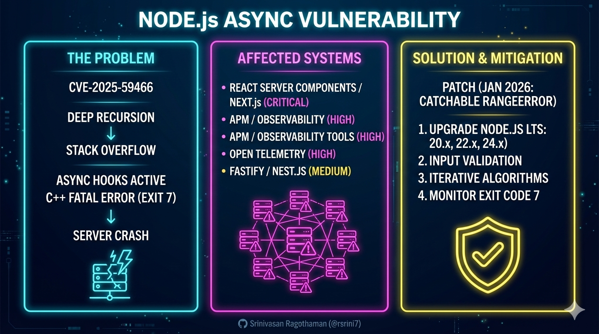
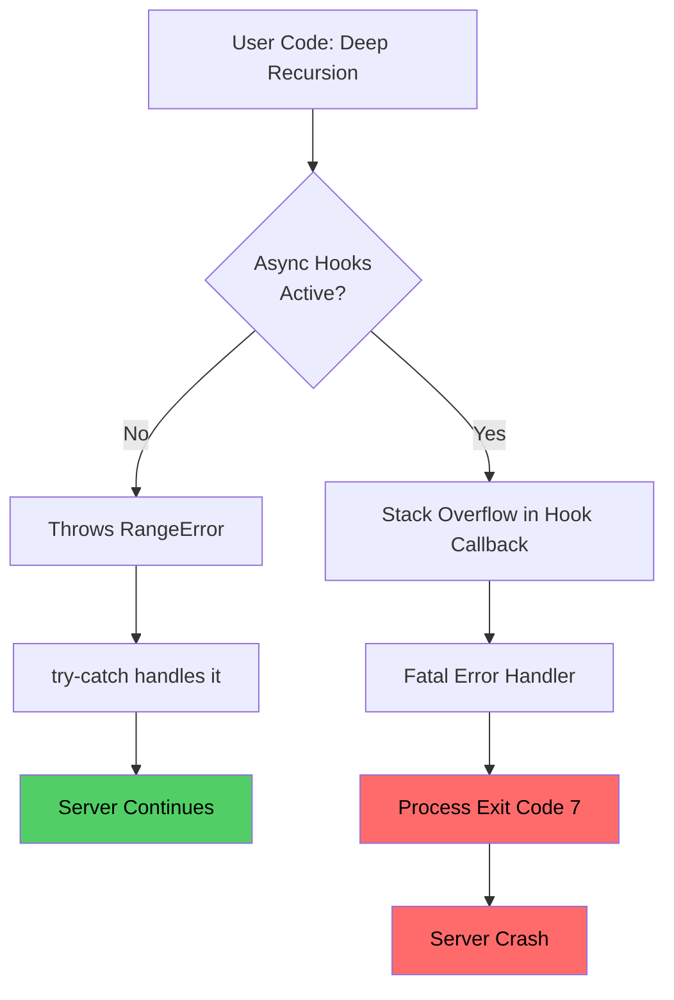
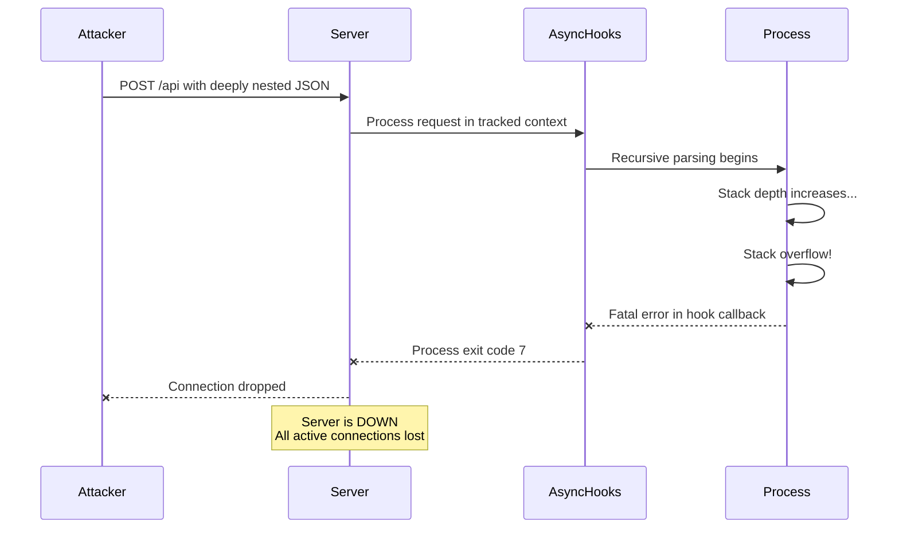

# Node.js Async Hooks DoS Vulnerability (CVE-2025-59466)



---

## Complete Technical Guide for Developers and Architects

## 1. Executive Summary

A critical denial-of-service (DoS) vulnerability has been identified in Node.js that affects applications utilizing `async_hooks` or `AsyncLocalStorage`. When deep recursion causes a stack overflow while these features are active, Node.js triggers an internal C++ failure that terminates the entire process (Exit Code 7) instead of throwing a catchable `RangeError`.

**Real-World Spotlight:**
This is particularly dangerous for server-side rendering (SSR) frameworks like **Next.js** and **React Server Components (RSC)**, where recursive processing of untrusted, deeply nested JSON (e.g., API payloads) is common. Observability tools (**Datadog, New Relic, OpenTelemetry**) that enable `async_hooks` for tracing act as "silent enablers" of this crash in production.

**Key Facts:**

* **CVE ID:** CVE-2025-59466
* **CVSS Score:** 7.5 (High)
* **Impact:** Immediate server crash (exit code 7) bypassing all `try-catch` and global error handlers.
* **Affected:** Node.js 8.x through 25.x (before patches).
* **Mitigation Released:** January 13, 2026.

---

## 2. What are Async Hooks and AsyncLocalStorage?

**Async hooks** is a Node.js API that tracks the lifecycle of asynchronous operations, maintaining context across HTTP requests, database queries, and timers.

**AsyncLocalStorage (ALS)** is a higher-level API built on async hooks that provides "thread-local storage" for Node.js. It is widely used for:

* Request ID tracking across async chains.
* Distributed tracing and performance monitoring (APM tools).
* React Server Components (RSC) rendering context.

---

## 3. The Problem: Why Does the Vulnerability Exist?

### Normal vs. Broken Behavior

Normally, V8 throws a catchable `RangeError` on stack overflow. However, when async hooks wrap callbacks, they use an internal C++ `TryCatchScope` with `CatchMode::kFatal`. This causes the process to abort immediately because Node.js assumes the environment is corrupted beyond recovery.



### The V8 Context & The "JavaScript Irony"

* **Browser-Centric Design:** V8’s primary threat model is the browser, where a tab crashing is a safe "fail-soft." In a server environment, this leads to a total DoS.
* **Lack of TCO:** Despite the ECMAScript spec, V8 does not implement **Tail Call Optimization (TCO)**, meaning recursive calls cannot be optimized into loops, making stack limits a hard boundary.
* **OS Enforcement:** Stack limits are enforced by the Operating System, not JavaScript.

---

## 4. Who is Affected?

| Technology | Why Affected | Risk Level |
| --- | --- | --- |
| **Next.js / RSC** | Uses ALS for request context; recursive rendering is a primary attack vector. | **Critical** |
| **APM Tools** | Datadog, New Relic, etc., enable `async_hooks` automatically for tracing. | **High** |
| **OpenTelemetry** | Uses `async_hooks` for context propagation. | **High** |
| **Fastify / NestJS** | Often use ALS for request-scoped providers or logging. | **Medium** |

---

## 5. Attack Scenario: The Next.js / RSC Vector

An attacker sends deeply nested JSON to trigger recursive processing. Even with a `try/catch` block, the process will crash with **Exit Code 7** on unpatched versions.

```javascript
// Vulnerable Next.js API route (app/api/process/route.js)
import { NextResponse } from 'next/server';

export async function POST(req) {
  const data = await req.json(); // Malicious payload: { "a": { "a": { ... 50k levels ... } } }

  function recursiveProcess(obj) {
    return Object.keys(obj).map(key => ({ [key]: recursiveProcess(obj[key]) }));
  }

  try {
    const result = recursiveProcess(data);
    return NextResponse.json(result);
  } catch (e) {
    // This catch block is BYPASSED on unpatched Node.js versions
    return NextResponse.json({ error: 'Invalid data' }, { status: 400 });
  }
}

```



---

## 6. The Mitigation (The Patch)

The January 13, 2026, releases are a **mitigation**, not a complete fix for recursion-based DoS.

**What the Patch Does:**
The patch modifies the internal `TryCatchScope` to detect stack overflow exceptions specifically and **re-throw** them as normal `RangeErrors`. This allows `try/catch` or `process.on('uncaughtException')` to work as developers expect.

**Patched Versions:**
| Node.js Line | Minimum Patched Version |
| :--- | :--- |
| **20.x LTS** | **20.20.0** |
| **22.x LTS** | **22.22.0** |
| **24.x LTS** | **24.13.0** |
| **25.x Current** | **25.3.0** |

**Note:** Node 18.x and older are **End-of-Life** and will **not** receive a patch.

---

## 7. Action Plan & Remediation

### 1. Upgrade Node.js (Critical)

Update to the latest LTS immediately. If you are on an EOL version (18.x or below), you are permanently vulnerable and must migrate.

### 2. Implement Input Validation (The "Real" Fix)

Do not rely on the patch to protect your server. Always implement explicit depth limits for recursive data processing.

```javascript
function safeProcess(data, maxDepth = 50, currentDepth = 0) {
  if (currentDepth >= maxDepth) throw new Error('Maximum nesting depth exceeded');
  // ... process logic ...
}

```

### 3. Replace Recursion with Iteration

Convert recursive algorithms to iterative loops using an explicit stack or queue to avoid call stack limits entirely.

### 4. Monitor Process Exits

Set up alerts for **Exit Code 7**. This is the "smoking gun" for this specific vulnerability.

---

## 8. Frequently Asked Questions

**Q: Do I need to upgrade if I don't use React or Next.js?**
**A:** Yes. If you use any APM tool (Datadog, New Relic, etc.) or any package using `async_hooks`, you are vulnerable.

**Q: Can I just disable async hooks?**
**A:** No. Many modern frameworks and monitoring tools enable them automatically. Disabling them would break your observability and request context management.

**Q: Does this affect Deno or Bun?**
**A:** No. This is specific to Node.js's internal C++ implementation of `async_hooks`.

---

## 9. References & Further Reading

* **Official Node.js Advisory:** [CVE-2025-59466 Mitigations](https://nodejs.org/en/blog/vulnerability/january-2026-dos-mitigation-async-hooks)
* **Technical Deep Dive:** ["javascript can't stop winning"](https://www.youtube.com/watch?v=y2ujgpIZ5O8) by *Low Level Learning* (Jan 2026).
* **Source Code Patch:** [Commit ddadc31f09](https://github.com/nodejs/node/commit/ddadc31f09)
* **Framework Impact:** [Vercel Security Blog](https://vercel.com/blog/security)

---

### Conclusion

CVE-2025-59466 represents a significant fragility in the Node.js ecosystem. While the 2026 patches restore the ability to **catch** errors, the fundamental risk of stack exhaustion remains a developer's responsibility. **Defense-in-depth—combining immediate patching with strict input validation—is the only complete solution.**