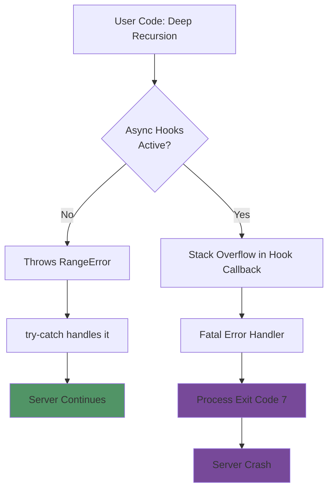
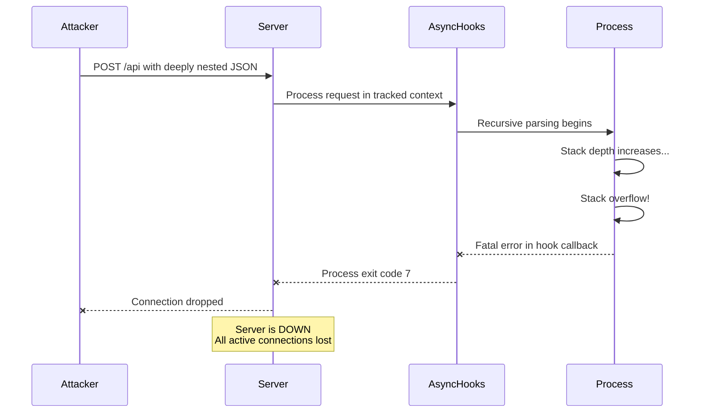
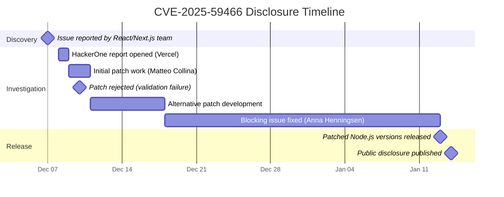

# Node.js Async Hooks DoS Vulnerability (CVE-2025-59466)
## Technical Whitepaper for Developers and Architects

---

## Executive Summary

A critical denial-of-service vulnerability has been discovered in Node.js that affects applications using async hooks or AsyncLocalStorage. When deep recursion causes a stack overflow while these features are active, Node.js terminates the entire process instead of throwing a catchable error. This impacts millions of applications using React Server Components, Next.js, and APM monitoring tools.

**Key Facts:**
- **CVE ID:** CVE-2025-59466
- **Impact:** Server crash without warning (exit code 7)
- **Affected:** Node.js 8.x through 25.x (before patches)
- **Fixed:** January 13, 2026 security releases
- **Attack Complexity:** Low (easily exploitable)

---

## What is Async Hooks?

Async hooks is a Node.js API that tracks the lifecycle of asynchronous operations. It helps developers maintain context across async operations like HTTP requests, database queries, and timers.

### What is AsyncLocalStorage?

AsyncLocalStorage is a higher-level API built on async hooks that allows storing data throughout the lifetime of async operations. Think of it as "thread-local storage" for Node.js.

**Common Use Cases:**
- Request ID tracking across async calls
- User session management
- Distributed tracing
- Performance monitoring (APM tools)
- React Server Components rendering context

### How AsyncLocalStorage Works

```javascript
import { AsyncLocalStorage } from 'async_hooks';
const storage = new AsyncLocalStorage();

// Store request context
app.use((req, res, next) => {
  storage.run({ requestId: generateId() }, () => {
    next(); // All async operations have access to requestId
  });
});

// Access context anywhere in async chain
function logMessage(msg) {
  const context = storage.getStore();
  console.log(`[${context.requestId}] ${msg}`);
}
```

---

## The Problem: Why Does the Vulnerability Exist?

### Normal Stack Overflow Behavior

Normally, when recursion exhausts the call stack, Node.js throws a catchable error:

```javascript
function recurse() {
  return recurse();
}

try {
  recurse();
} catch (err) {
  console.log('Caught:', err.message);
  // Server continues running ✓
}
```

**Output:** `Caught: Maximum call stack size exceeded`

### Broken Behavior with Async Hooks

When async hooks are active, the same code causes an **uncatchable crash**:

```javascript
// With async_hooks enabled (APM tool, React, Next.js)
function recurse() {
  return recurse();
}

try {
  recurse();
} catch (err) {
  // This never executes!
}

// Process exits immediately with code 7 ✗
```

### Technical Root Cause

When async hooks wrap callbacks, they use a `TryCatchScope` with `CatchMode::kFatal`. If a stack overflow occurs during these wrapped callbacks:

1. Node.js treats it as a "fatal hook failure"
2. Bypasses normal error handling (`try-catch`, `process.on('uncaughtException')`)
3. Immediately terminates the process with exit code 7



---

## Who is Affected?

### Frameworks and Libraries

Any application using these technologies is potentially vulnerable:

| Technology | Why Affected | Risk Level |
|------------|-------------|------------|
| **React Server Components** | Uses AsyncLocalStorage for rendering context | High |
| **Next.js** | Uses AsyncLocalStorage for request/response handling | High |
| **Express + APM** | APM tools enable async hooks for tracing | High |
| **Datadog APM** | Uses AsyncLocalStorage for request tracing | High |
| **New Relic** | Uses async hooks for performance monitoring | High |
| **Dynatrace** | Uses async hooks for distributed tracing | High |
| **Elastic APM** | Uses async hooks for span tracking | High |
| **OpenTelemetry** | Uses async hooks for context propagation | High |

### Node.js Version Impact

| Version | Status | AsyncLocalStorage Implementation |
|---------|--------|----------------------------------|
| 8.x - 18.x | **Unpatched** (End-of-Life) | Built on async_hooks (vulnerable) |
| 20.x | Patched in 20.20.0+ | Built on async_hooks (was vulnerable) |
| 22.x | Patched in 22.22.0+ | Built on async_hooks (was vulnerable) |
| 24.x | Patched in 24.13.0+ | V8 AsyncContextFrame (less affected) |
| 25.x | Patched in 25.3.0+ | V8 AsyncContextFrame (less affected) |

**Note:** Node.js 24+ reimplemented AsyncLocalStorage using V8's AsyncContextFrame, reducing dependency on async_hooks and making these versions less vulnerable unless async_hooks.createHook() is used directly.

---

## Attack Scenario

### Simple Exploit Example

An attacker sends deeply nested JSON to trigger recursive processing:

```javascript
// Vulnerable API endpoint
app.post('/api/process', (req, res) => {
  function processData(data) {
    if (typeof data === 'object') {
      Object.values(data).forEach(processData); // Recursive!
    }
    return data;
  }
  
  const result = processData(req.body);
  res.json({ success: true });
});
```

**Malicious Payload:**
```json
{
  "a": {
    "b": {
      "c": {
        // ... nested 50,000 levels deep
      }
    }
  }
}
```

**Result:** Server crashes immediately if async hooks are enabled (React, Next.js, APM tools).

### Real-World Impact Flow



---

## The Fix

### What Changed in Patched Versions

The fix modifies the `TryCatchScope` destructor to detect stack overflow errors and re-throw them to user code:

```cpp
TryCatchScope::~TryCatchScope() {
  if (HasCaught() && mode_ == CatchMode::kFatal) {
    Local<Value> exception = Exception();
    
    // NEW: Check if it's a stack overflow
    if (IsStackOverflowError(env_->isolate(), exception)) {
      ReThrow();  // Allow user code to catch it
      Reset();
      return;
    }
    
    // Still fatal for other errors
    FatalException(/* ... */);
  }
}
```

### Patched Versions (Released January 13, 2026)

| Node.js Line | Minimum Patched Version |
|--------------|-------------------------|
| 20.x LTS | **20.20.0** |
| 22.x LTS | **22.22.0** |
| 24.x LTS | **24.13.0** |
| 25.x Current | **25.3.0** |

---

## Mitigation Steps

### 1. Immediate Action: Upgrade Node.js

**Priority: CRITICAL**

Update all production servers to patched versions:

```bash
# Check current version
node --version

# Upgrade using nvm (recommended)
nvm install 22.22.0
nvm use 22.22.0

# Or using official installer
# Download from: https://nodejs.org/
```

### 2. Add Input Validation

Protect against deeply nested data structures:

```javascript
// Example: Depth-limited JSON processor
function processWithDepthLimit(data, maxDepth = 100, currentDepth = 0) {
  if (currentDepth >= maxDepth) {
    throw new Error('Maximum nesting depth exceeded');
  }
  
  if (Array.isArray(data)) {
    return data.map(item => 
      processWithDepthLimit(item, maxDepth, currentDepth + 1)
    );
  }
  
  if (typeof data === 'object' && data !== null) {
    const result = {};
    for (const [key, value] of Object.entries(data)) {
      result[key] = processWithDepthLimit(value, maxDepth, currentDepth + 1);
    }
    return result;
  }
  
  return data;
}

// In Next.js API route
export default async function handler(req, res) {
  try {
    const safeData = processWithDepthLimit(req.body, 50);
    // Process safeData...
    res.json({ success: true });
  } catch (err) {
    console.error('Validation failed:', err);
    res.status(400).json({ error: 'Invalid input structure' });
  }
}
```

### 3. Replace Recursion with Iteration

Where possible, use iterative algorithms instead of recursive ones:

```javascript
// ❌ Recursive (vulnerable to stack overflow)
function flattenRecursive(arr) {
  return arr.reduce((flat, item) => {
    return flat.concat(Array.isArray(item) ? flattenRecursive(item) : item);
  }, []);
}

// ✓ Iterative (safe)
function flattenIterative(arr) {
  const stack = [...arr];
  const result = [];
  
  while (stack.length) {
    const item = stack.pop();
    if (Array.isArray(item)) {
      stack.push(...item);
    } else {
      result.push(item);
    }
  }
  
  return result.reverse();
}
```

### 4. Add Request Size Limits

Prevent oversized payloads:

```javascript
// Express example
import express from 'express';
const app = express();

app.use(express.json({ 
  limit: '100kb',  // Reject payloads over 100KB
  strict: true     // Only accept arrays/objects
}));

// Next.js config (next.config.js)
module.exports = {
  api: {
    bodyParser: {
      sizeLimit: '100kb',
    },
  },
};
```

### 5. Monitor Process Exits

Set up alerting for unexpected crashes:

```javascript
// Add to your application startup
process.on('exit', (code) => {
  if (code === 7) {
    console.error('ALERT: Process exiting with code 7 (stack overflow)');
    // Send alert to monitoring system
  }
});

// Log unexpected terminations
process.on('uncaughtException', (err) => {
  console.error('Uncaught exception:', err);
  // Don't use this to keep server running!
});
```

---

## Best Practices for Developers

### Defense-in-Depth Approach

1. **Never rely on stack overflow as error handling**
   - ECMAScript doesn't specify stack overflow behavior
   - Different engines handle it differently
   - Always set explicit recursion limits

2. **Validate all user input**
   - Check data structure depth
   - Limit array/object sizes
   - Reject malformed data early

3. **Use framework-provided protections**
   - Body parser size limits
   - Rate limiting middleware
   - Request validation schemas

4. **Test for edge cases**
   - Simulate deep nesting in staging
   - Load test with various payload structures
   - Monitor memory and CPU usage patterns

### Code Review Checklist

When reviewing code, check for:

- [ ] Recursive functions without depth limits
- [ ] User-controlled data used in recursive operations
- [ ] Missing input validation on API endpoints
- [ ] Unbounded loops or tree traversals
- [ ] JSON parsing without depth checks

---

## Testing for Vulnerability

### Check if Your App is Vulnerable

```javascript
// Simple vulnerability test
import { AsyncLocalStorage } from 'async_hooks';

const storage = new AsyncLocalStorage();

function testVulnerability() {
  console.log('Testing vulnerability...');
  
  storage.run({}, () => {
    try {
      function recurse(depth = 0) {
        if (depth > 50000) return;
        recurse(depth + 1);
      }
      
      recurse();
      console.log('✓ Vulnerability fixed - error was caught');
    } catch (err) {
      console.log('✓ Vulnerability fixed - caught:', err.message);
    }
  });
}

// If this crashes your process, you're vulnerable
testVulnerability();
```

**Expected Results:**
- **Vulnerable:** Process exits with code 7
- **Patched:** Prints "Vulnerability fixed" message

---

## Timeline



**Key Dates:**
- **December 7, 2025:** Vulnerability reported by React/Next.js team
- **December 8, 2025:** HackerOne report #3456295 opened by Vercel Security
- **December 9-17, 2025:** Multiple patch attempts and fixes
- **January 13, 2026:** Security patches released and disclosed publicly

---

## Frequently Asked Questions

### Q: Do I need to upgrade if I don't use React or Next.js?

**A:** If you use ANY of these, you should upgrade:
- APM tools (Datadog, New Relic, Dynatrace, Elastic APM, OpenTelemetry)
- AsyncLocalStorage anywhere in your code
- Any npm package that uses async_hooks

### Q: Can I just disable async hooks?

**A:** Not easily. Many frameworks and tools enable it automatically:
- APM agents activate it when imported
- Next.js uses it for request context
- React Server Components depend on it

Disabling it would break these features.

### Q: Is this exploitable without user input?

**A:** The vulnerability requires deep recursion to trigger. While theoretically possible through logic bugs, most practical attacks involve malicious user input (deep JSON nesting, recursive data structures).

### Q: What about Node.js 18 and older?

**A:** These versions are End-of-Life and will NOT receive patches. You must upgrade to a supported version (20.x, 22.x, 24.x, or 25.x) or seek commercial support.

### Q: Does this affect Deno or Bun?

**A:** No. This is specific to Node.js' implementation of async_hooks. Deno and Bun have different runtime architectures.

---

## Additional Security Considerations

### Related Vulnerabilities in January 2026 Release

The same security release patched 7 other vulnerabilities:

- **CVE-2025-55131:** Memory exposure in vm module (High)
- **CVE-2025-55130:** Permission model bypass via symlinks (High)
- **CVE-2025-59465:** HTTP/2 race condition DoS (High)
- **CVE-2025-59464:** TLS memory leak DoS (Medium)
- **CVE-2026-21636:** Permission bypass via Unix sockets (Medium)
- **CVE-2026-21637:** TLS PSK/ALPN callback exception DoS (Medium)
- **CVE-2025-55132:** fs.futimes() permission bypass (Low)

### Why This is Treated as Security Issue

While stack overflow isn't specified by ECMAScript and V8 doesn't consider it a security issue, Node.js classified this as security-related because:

1. **Widespread ecosystem impact** (React, Next.js, all major APM tools)
2. **Easy exploitation** (send nested JSON)
3. **Severe consequences** (immediate server crash)
4. **Bypass of error handling** (unexpected behavior)

---

## Resources

### Official Documentation
- Node.js Security Advisory: https://nodejs.org/en/blog/vulnerability/january-2026-dos-mitigation-async-hooks
- Node.js Async Hooks API: https://nodejs.org/api/async_hooks.html
- AsyncLocalStorage Documentation: https://nodejs.org/api/async_context.html

### Vendor Advisories
- Datadog Advisory: https://www.datadoghq.com/blog/nodejs-vulnerability-apm/
- The Hacker News Coverage: https://thehackernews.com/2026/01/critical-nodejs-vulnerability-can-cause.html

### Downloads
- Node.js Official Releases: https://nodejs.org/en/download/

---

## Conclusion

CVE-2025-59466 represents a significant security issue affecting the entire Node.js ecosystem. While the technical root cause is a subtle interaction between async_hooks and error handling, its impact is severe and widespread.

**Action Items:**
1. ✓ Upgrade to patched Node.js versions immediately
2. ✓ Add input validation with depth limits
3. ✓ Replace recursive algorithms where practical
4. ✓ Monitor for exit code 7 in production
5. ✓ Test staging environments after upgrade

The combination of immediate patching and defensive coding practices will protect your applications from this and similar vulnerabilities.
