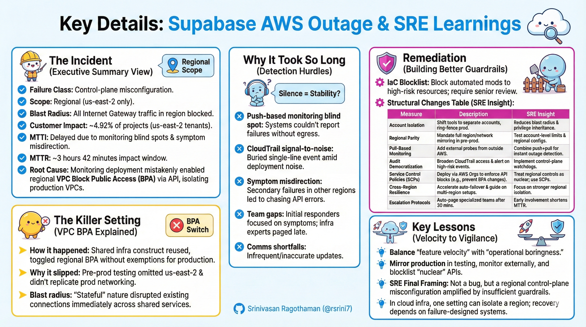

# How One AWS Setting Killed Supabase

In the early hours of February 13, 2026, Supabase—a popular open-source alternative to Firebase—suffered a major outage that exposed the fragility of rapid infrastructure changes in cloud environments. What started as a routine deployment turned into a 4-hour nightmare for thousands of developers, all because of a single, often-overlooked AWS security feature: VPC Block Public Access (BPA). This incident not only disrupted services but also ignited debates about operational reliability in the "serverless" database space, highlighting the tension between innovation speed and production stability.

Below, we break down the event, its causes, impacts, and lessons, drawing from Supabase's official post-mortem and community discussions. We've added an SRE (Site Reliability Engineering) perspective throughout, reframing the outage in terms of failure mechanics, detection gaps, blast radius dynamics, control-plane risk modeling, and preventive architecture patterns. This isn't about blame—it's about building disciplined, resilient systems.

## Executive Summary (SRE View)
- **Failure Class**: Control-plane misconfiguration.
- **Scope**: Regional (single AWS region: us-east-2).
- **Blast Radius**: All Internet Gateway–dependent VPC traffic in the region.
- **Customer Impact**: ~4.92% of projects (us-east-2 tenants).
- **MTTI (Mean Time to Identify)**: Delayed due to monitoring blind spots and symptom misdirection.
- **MTTR (Mean Time to Resolve)**: ~3 hours 42 minutes impact window (post-mortem measure).
- **Root Cause**: A monitoring deployment enabled regional VPC Block Public Access via the `ModifyVpcBlockPublicAccessOptions` API, unintentionally isolating production VPCs from internet gateway egress.

From an SRE standpoint, this was a step-function failure: a high-severity, control-plane enforced network partition that bypassed application-level redundancy and rendered in-region monitoring ineffective. It underscores the need for "nuclear-tier" guardrails on regional controls.

## The Incident: A Timeline of Chaos
The outage unfolded in UTC on February 12–13, 2026, primarily affecting the us-east-2 (Ohio) region. While the public status page logged a 4-hour 21-minute window (from acknowledgment to resolution), the actual impact—measured from trigger to service restoration—was closer to 3 hours 42 minutes. Here's the verified sequence, with SRE observations on failure propagation (note: granular timestamps like 21:12–21:26 are from Supabase's internal post-mortem; public status updates reflect external communications):

- **21:12 (Feb 12)**: Deployment of a new monitoring stack inadvertently enabled regional VPC Block Public Access (BPA), instantly blocking internet gateway traffic for non-exempt VPCs in us-east-2. Application Load Balancer (ALB) request counts plummeted to zero. *SRE Note*: This was an immediate, step-function drop—no gradual escalation—highlighting control-plane changes' potential for instantaneous regional isolation.
- **21:13 (Feb 12)**: Full regional outage hits. Over 20 production subnets lose connectivity, as BPA exemptions were limited to the monitoring service itself.
- **21:17 (Feb 12)**: Cascading failures begin. Internal workloads dependent on AWS APIs (e.g., for authentication and storage) start failing. *SRE Note*: Dependencies on public AWS endpoints amplified the blast radius, turning a networking issue into service-wide failures.
- **21:26 (Feb 12)**: Internal alerts trigger, but initial detection is delayed.
- **21:32 (Feb 12)**: Public incident declared on the status page, citing elevated 500 errors across US regions.
- **22:37–23:58 (Feb 12)**: Misdiagnosis phase. Updates attribute issues to US-West/US-East reads; AWS support is engaged (no faults on their side); investigation shifts to CloudTrail logs and IaC history. *SRE Note*: Symptom misdirection from cascading effects prolonged MTTI—classic in distributed systems where secondary failures obscure root partitions.
- **00:25 (Feb 13)**: Timestamps correlated to the monitoring deployment.
- **00:39 (Feb 13)**: Root cause identified: Regional BPA enablement via the `ModifyVpcBlockPublicAccessOptions` API (internal engineering identification; public "Identified" status update at 01:04 UTC).
- **00:50 (Feb 13)**: Mitigation begins—destroy monitoring stack and revert BPA.
- **00:57 (Feb 13)**: Core services restored; API error rates normalize.
- **01:53 (Feb 13)**: Full resolution declared. Background jobs requeued.

Affected: Postgres, Auth, APIs, Edge Functions, Storage, and Realtime in us-east-2. Services using private networking (VPC Peering, Transit Gateway, PrivateLink, Direct Connect, VPN) remained operational, as they bypass internet gateways. *SRE Note*: The outage didn't escalate gradually; it affected all services simultaneously, emphasizing why regional control-plane events are inherently high-severity.

## The Killer Setting: VPC Block Public Access Explained
At the heart of the outage was AWS's VPC Block Public Access (BPA), a security control designed to prevent accidental exposure of VPC resources to the public internet. When enabled at the *regional* level in "block-bidirectional" mode, it acts like a master kill switch: blocking all ingress/egress traffic through internet gateways for every VPC in the AWS account and region—unless specific exemptions are applied.

- **How it happened**: The monitoring deployment reused a shared infrastructure construct that toggled BPA regionally. Exemptions were only set for the new monitoring VPC, leaving production VPCs isolated. This cut off external connectivity, including to AWS's own APIs, causing widespread failures.
- **Why it slipped through**: Pre-production testing ran for a week but omitted us-east-2 and didn't replicate production networking. No red flags appeared.
- **Blast radius**: The "stateful" nature of BPA meant it disrupted existing connections immediately, amplifying the impact across shared services. *SRE Note*: Risk amplifiers included shared infrastructure constructs, regional-scope security defaults, account-level enforcement, and co-located production/internal tooling—modeling these explicitly in change reviews is key.

This wasn't an AWS bug or external attack—it was a classic misconfiguration in Supabase's Infrastructure as Code (IaC) pipeline, underscoring the dangers of automated "nuclear-tier" changes.

## Why It Took So Long to Fix: Detection Hurdles
Resolution came after ~3 hours of triage, delayed by several factors outlined in the post-mortem. From an SRE perspective, this section highlights critical observability and escalation gaps:

- **Push-based monitoring blind spot**: Reliance on services pushing metrics outward meant systems couldn't report failures without egress—silence was misinterpreted as stability. *SRE Principle*: Never rely solely on push; add external synthetic probes, multi-cloud health checks, and internet-originated tests.
- **CloudTrail signal-to-noise problem**: The BPA toggle was a buried single-line event amid deployment noise. *SRE Principle*: Tag high-blast-radius events as "nuclear-tier" for dedicated alerts and immediate infra paging.
- **Symptom misdirection**: Secondary failures in other regions (from shared services and control-plane coupling) led to chasing API errors instead of networking state.
- **Team gaps**: Initial responders focused on API symptoms; infrastructure experts were paged later. *SRE Note*: Introduce auto-escalation at 30 minutes and parallel investigation tracks to shorten MTTR.
- **Comms shortfalls**: Infrequent and sometimes inaccurate status updates; dashboard notifications didn't trigger properly.

## Competitive Ripples: PlanetScale's Opportunity
The outage became a point of discussion for rivals like PlanetScale. CEO Sam Lambert posted on X about his engineering team rolling their entire Postgres fleet as a precautionary measure during the outage, emphasizing their platform's resilience in light of a concurrent Postgres security release. Community threads buzzed with alternatives (e.g., Neon, Convex, self-hosted Postgres via Hetzner), and some users reported PlanetScale offering migration assistance amid the disruption.

- **The "10x" claim**: Social discourse, including posts from creators like Theo (t3.gg), speculated on a 10x signup spike for PlanetScale during the 4-hour window. While Lambert alluded to operational stability in interviews, this specific metric remains unconfirmed in official reports—treat it as anecdotal hype from X and Reddit.
- **Reputation shift**: Discussions framed Supabase as "feature-rich but volatile" versus PlanetScale's "boring reliability." This echoed broader industry tensions in serverless databases. *SRE Note*: Outages propagate reputation shockwaves; reliability is a market differentiator, shifting perceptions faster than fixes.

## The "Vibe Coding" Backlash
In the lead-up to the outage, "vibe coding"—a term coined by Andrej Karpathy in February 2025 for AI-assisted, rapid prototyping—had gained traction. Tools like Lovable and Mocha often paired with Supabase backends for quick app builds, promoting a "prompt-to-deploy" ethos. Critics in post-outage threads viewed the BPA misconfig as emblematic of broader risks in "vibe coding": over-reliance on automated, AI-driven changes without rigorous networking checks. Reports highlighted exposures like leaked credentials in scanned indie projects using Supabase, including the Moltbook incident where missing Row Level Security (RLS) exposed 1.5 million API keys, 35,000 emails, and private messages, fueling sharp community fallout questioning if speed was trumping security in production environments.

*SRE Clarification*: There's no evidence AI-generated code directly caused the incident. The failure stemmed from shared IaC module reuse, insufficient regional guardrails, and human-approved automation—an automation maturity issue, not an AI failure.

## Remediation: Building Better Guardrails
Supabase responded with a comprehensive overhaul, emphasizing isolation and manual oversight for high-risk changes. This marks a reliability maturity inflection point: shifting from velocity-first infrastructure to guardrailed, cell-isolated designs.

### IaC Blocklist
- Block automated mods to resources like `AWS::EC2::VPCBlockPublicAccessOptions` and `ModifyVpcBlockPublicAccessOptions`.
- Require senior engineer review to prevent accidental global toggles. *SRE Note*: Maintain a "Nuclear API" registry for regional/account-affecting calls, enforcing manual reviews and separate change windows.

### Structural Changes
| Measure | Description | SRE Insight |
|---------|-------------|-------------|
| **Account Isolation** | Shift internal tools (monitoring, CI/CD) to separate AWS accounts, ring-fencing production. | Reduces control-plane blast radius, privilege inheritance, and deployment coupling—never share IAM boundaries. |
| **Regional Parity** | Mandate full region/network mirroring in pre-prod to catch us-east-2-like gaps. | SRE rule: If it can happen in prod, it must be testable in staging; model blast radius explicitly for every change. |
| **Pull-Based Monitoring** | Add external probes from outside AWS for instant outage detection. | Combine push + pull, internal + external; deploy multi-geography probes to alert on internet gateway failures in seconds. |
| **Audit Democratization** | Broaden CloudTrail access for on-call teams; alert on high-risk events. | Implement control-plane watchdogs to diff settings (e.g., VPC toggles) and alert on drift immediately. |
| **Service Control Policies (SCPs)** | Deploy via AWS Organizations to enforce API blocks (e.g., preventing BPA changes), an industry-standard for limiting even privileged users. | Treat regional controls as nuclear; use SCPs, IaC deny lists, and automated rollback for high-scope changes. |
| **Cross-Region Resilience** | Accelerate "Multigres" for auto-failover; guide users on multi-region setups. | Focus on stronger regional isolation to minimize shared configs and global risks. |
| **Escalation Protocols** | Auto-page specialized teams after 30 minutes of unresolved issues. | Harden with infra-specialist paging and parallel tracks—early involvement shortens MTTR dramatically. |

- **Blast Radius Control**: Default risky features to "Off" in IaC; require explicit overrides. Move toward stronger regional isolation to minimize shared configs. *SRE Note*: For every infra change, assess maximum theoretical scope (zonal/regional/global) and ensure rollback is automated.

## Key Lessons: From Velocity to Vigilance
This outage was a wake-up call for the serverless era, where one AWS setting can cascade into millions in lost productivity. Supabase's transparency in the post-mortem—detailing every misstep—earned praise, but it underscored the need to balance "feature velocity" with "operational boringness." For devs and SREs: Mirror prod in testing, monitor externally, and blocklist the nukes. For the industry: Incidents like this pivot providers toward maturity, but at what cost to trust?

*SRE Final Framing*: This wasn't a database failure, AWS outage, DDoS, or code bug—it was a regional control-plane misconfiguration amplified by insufficient guardrails and observability asymmetry. The takeaway isn't fear of automation; it's disciplined automation. In cloud infrastructure, one setting can isolate a region in milliseconds, and recovery depends on whether your systems were designed for failure.

If you're building on Supabase or similar, review your IaC for regional scopes today—because one setting really can kill your stack.

**Related:**- [AWS-Downtime-Caused-By-AI-Mistake](../../Engineering/Cloud/AWS/AWS-Downtime-Caused-By-AI-Mistake.md) — Both attribute AWS regional outages to automated control-plane/configuration changes gone wrong.- [AWS-Outage-October-19&20-2025](AWS-Outage-October-19&20-2025.md) — Earlier AWS us-east outage set the pattern that Supabase's Feb 2026 BPA incident echoed.- [cloudflare-down-nov-2025](cloudflare-down-nov-2025.md) — Sibling vendor outage where a single config-generation change cascaded into a global flap.
