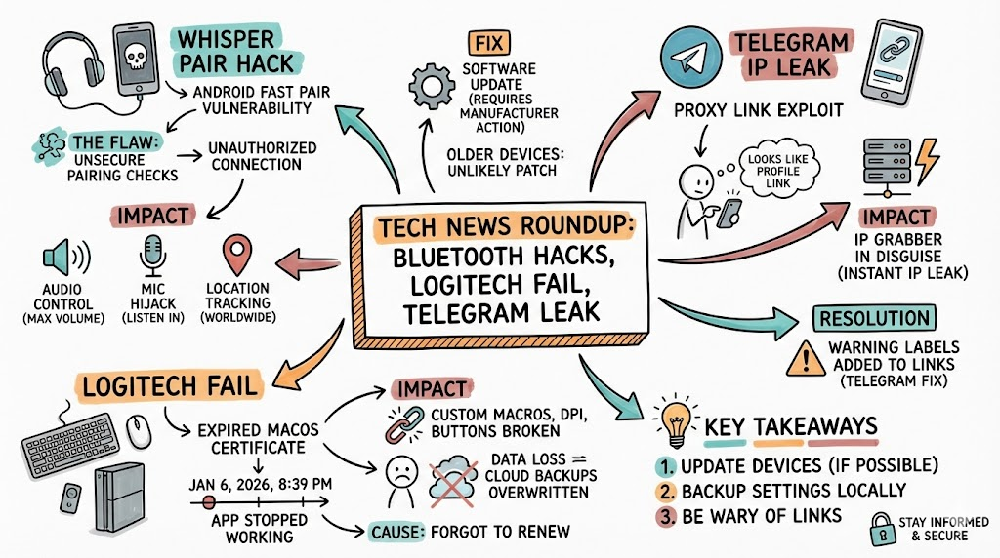
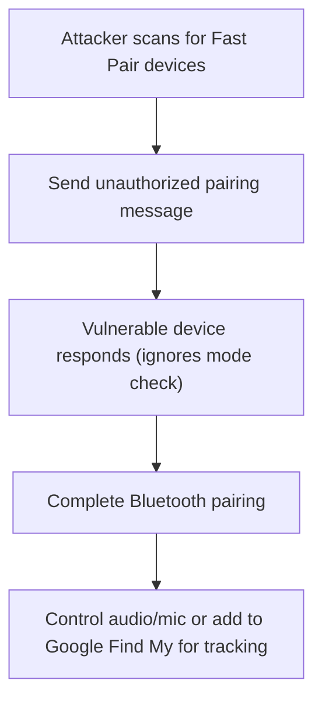
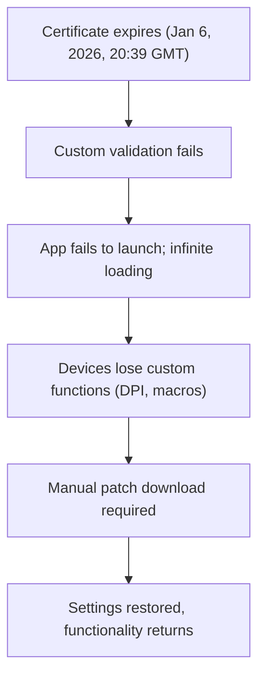
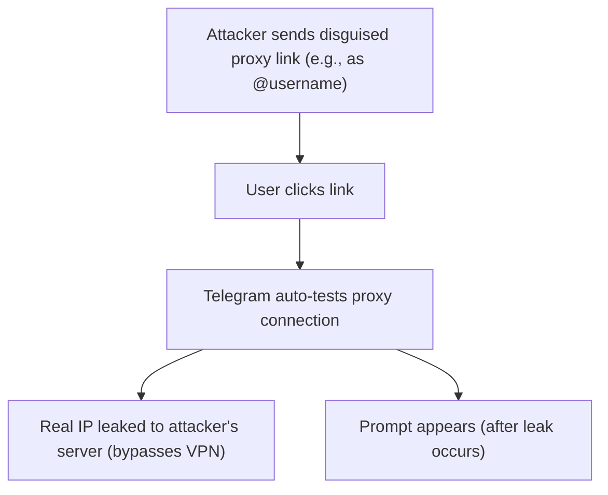

# Security Vulnerabilities in Wireless Devices and Apps: A Guide for Developers and Architects

## Introduction

This whitepaper covers three recent security issues: a Bluetooth pairing flaw, a software certificate expiration, and a messaging app IP leak. It is based on verified research from multiple sources including academic papers, vendor disclosures, and security news outlets. We explain each issue simply, with technical details, impacts, fixes, and lessons. The goal is to help developers and architects build safer systems.

## 1. Bluetooth Fast Pair Vulnerability (WhisperPair)

### Overview
WhisperPair is a set of attacks on Google's Fast Pair feature. Fast Pair lets Bluetooth devices (like headphones) connect quickly to Android phones. Many manufacturers did not implement it correctly, letting attackers hijack devices without permission. The vulnerability is tracked as CVE-2025-36911.

### How It Works
- Devices should ignore pairing requests if not in "pairing mode."
- Vulnerable devices skip this check.
- Attacker scans nearby devices, sends a fake pairing message, and takes control.
- This happens in seconds, up to 14-15 meters away, using basic hardware.
- Attacker can control volume, use the mic, or add the device to their Google account for tracking via Find My Device network.
- **iPhone users face unique risk**: If the attacker is the first to pair the device with an Android account, they become the "owner" via their Owner Account Key and can track the device globally through Google's Find Hub network.

### Affected Devices
- Hundreds of millions of Bluetooth audio devices with Fast Pair support.
- Brands: Sony, Jabra, JBL, Google, Logitech, Marshall, Xiaomi, Nothing, OnePlus, Soundcore.
- The research team tested 25 commercial devices from 16 manufacturers using 17 different Bluetooth chipsets.
- Chipsets from various makers; flaw is in software implementation.

### Disclosure and Response
- Reported to Google in August 2025 with a 150-day disclosure window.
- Google classified it as critical and awarded researchers $15,000, the maximum bug bounty.
- Many manufacturers have released firmware patches during the disclosure period.
- Google rolled out security updates for Pixel devices.

### Implications for Devs/Architects
- Usability features like auto-pairing can create significant security risks if not validated properly.
- Privacy loss: Location tracking without user knowledge or consent.
- Real-world harm: Loud noise attacks, eavesdropping, or surveillance.
- Compliance failures occurred at three levels: implementation, validation, and certification.

### Fixes and Best Practices
- **Manufacturers**: Issue firmware updates to enforce pairing mode checks.
- **Users**: Update device firmware immediately; check whisperpair.eu for your model status.
- **Developers**: Always validate specifications fully. Use secure defaults. Test for unauthorized access scenarios.
- **Architects**: Design with "least privilege" – limit what unpaired devices can do. Implement defense-in-depth strategies.

### Diagram: Attack Flow

### Comparisons
Similar to KNOB Bluetooth attack (2019), which weakened encryption during pairing. Both show Bluetooth's pairing process is a weak spot. Unlike KNOB, WhisperPair needs no ongoing connection – just one message. Also comparable to BlueBorne and BLUFFS vulnerabilities that affected Bluetooth implementations.

## 2. Logitech Certificate Expiration Issue

### Overview
Logitech's macOS apps (Logi Options+ and G HUB) stopped working worldwide due to an expired code-signing certificate. This disrupted functionality for mice, keyboards, and other devices by blocking custom features.

### How It Works
- macOS requires apps to have valid certificates for certain functionality.
- **Critical detail**: Logitech implemented custom validation that relied on their Developer ID certificate being current.
- Certificate expired January 6, 2026, at 20:39:41 GMT (8:39 PM GMT).
- The expired certificate broke Logitech's inter-process communication security checks.
- Apps froze in loading loop; devices lost DPI settings, macros, custom buttons, etc.
- **Important**: This was Logitech's implementation error, not a macOS limitation. Expired Developer ID certificates don't normally prevent apps from running on macOS.

### Affected Products
- All Logitech peripherals using Options+ or G HUB on macOS.
- Supported versions: macOS Ventura (13), Sonoma (14), Sequoia (15), and Tahoe (26).
- Millions affected; no Windows impact.

### Implications for Devs/Architects
- Simple oversight caused global outage affecting millions.
- User frustration: Lost access to productivity-enhancing customizations.
- Highlights dependency on proper certificate management.
- Demonstrates how custom security implementations can backfire.

### Fixes and Best Practices
- **Logitech**: Issued patch installers to renew certificate. Settings and customizations were preserved, not lost.
- **Users**: Download patch from support site; do not uninstall existing app. Restart app after installation.
- **Developers**: 
  - Set calendar reminders for cert renewals with 90-day advance notice.
  - Automate certificate monitoring and renewal processes.
  - Avoid custom security checks that depend on certificate validity dates.
  - Implement graceful degradation when certificates expire.
- **Architects**: 
  - Use short-lived certs with auto-renew infrastructure.
  - Have failover plans for certificate failures.
  - Document certificate dependencies clearly.
  - Use standard certificate validation, not custom implementations.

### Diagram: Issue Flow

### Comparisons
Like the 2021 Let's Encrypt root cert expiration, which broke many sites. Or Equifax's 2017 breach, partially caused by expired cert scans missing updates. All show certificate lifecycle management is critical but often forgotten until failure.

## 3. Telegram IP Leak via Proxy Links

### Overview
A flaw in Telegram's proxy feature lets attackers obtain a user's real IP with one click, even if using VPN/proxy. It bypasses protections silently through automatic proxy testing.

### How It Works
- Telegram allows sharing proxy settings via links (t.me/proxy or tg://proxy).
- Links can be disguised as usernames (e.g., @username hiding proxy link).
- On click (Android/iOS), app auto-tests proxy by connecting to attacker's server.
- This connection leaks real IP before any prompt appears.
- Bypasses user's VPN or existing proxy configuration.
- No warning; looks like normal internal link.
- Comparable to NTLM hash leaks on Windows with automatic authentication.

### Affected Devices
- Telegram mobile apps on Android and iOS.
- All users potentially affected.
- Researcher @0x6rss demonstrated the vulnerability publicly.

### Vendor Response
Telegram does not consider this a security vulnerability, stating that any website or proxy owner can see IP addresses of visitors. However, they committed to adding warnings when users click proxy links to increase awareness of disguised links. This addresses user expectations about privacy while maintaining their technical position.

### Implications for Devs/Architects
- Privacy breach: Reveals location for tracking or targeted attacks.
- In high-risk areas (censorship zones, activism), could lead to surveillance or physical harm.
- Shows how helpful features (easy proxy sharing) can be weaponized.
- User expectations about privacy don't always match technical implementation.

### Fixes and Best Practices
- **Telegram**: Adding warnings on proxy links (announced but not yet deployed at time of writing).
- **Users**: 
  - Update app when warnings are implemented.
  - Avoid clicking unknown links, especially disguised usernames.
  - Use device-level VPN (outside Telegram) for additional protection.
  - Use firewall tools to block automatic proxy tests.
- **Developers**: 
  - Never auto-connect without explicit user confirmation.
  - Show clear, prominent warnings before initiating network requests.
  - Respect existing proxy/VPN settings; don't bypass them.
- **Architects**: 
  - Design features requiring explicit user consent for network connections.
  - Test for disguise/abuse vectors in seemingly benign features.
  - Consider privacy implications of "helpful" automation.
  - Implement user-controllable settings for automatic testing behaviors.

### Diagram: Attack Flow

### Comparisons
Similar to 2018 Telegram desktop bug leaking IPs in calls (fixed by disabling P2P by default). Or WhatsApp's 2019 spyware delivery via calls. All involve hidden network connections in messaging apps, emphasizing need for opt-in privacy and explicit user consent for network activity.

## Overall Lessons and Recommendations

### For Developers
1. **Verify Implementations Strictly**: Follow specifications exactly; test edge cases and failure modes.
2. **Balance Usability and Security**: Features like auto-pair or auto-test add risks – require explicit user confirmation.
3. **Certificate Management**: Automate tracking and renewal; set alerts 90+ days before expiration.
4. **Avoid Custom Security**: Use standard implementations; custom checks often fail unexpectedly.
5. **Test Bypass Scenarios**: Always test if security features can be circumvented.

### For Architects
1. **Threat Modeling**: Use systematic threat modeling to identify similar flaws early in design.
2. **Least Privilege**: Limit what devices/features can do without explicit authorization.
3. **Defense in Depth**: Layer security controls; don't rely on single points of validation.
4. **Privacy by Design**: Consider privacy implications of automation and "helpful" features.
5. **Graceful Degradation**: Plan for certificate expiration, network failures, and other predictable issues.
6. **Cross-Platform Testing**: Issues often manifest differently across OS/ecosystems.

### For Organizations
1. **Responsible Disclosure**: Implement bug bounty programs; reward researchers appropriately.
2. **Compliance at All Levels**: Security must be verified at implementation, validation, and certification stages.
3. **Documentation**: Maintain clear documentation of dependencies, especially certificates and credentials.
4. **Incident Response**: Have plans for rapid response when issues are discovered.
5. **User Communication**: Communicate clearly and promptly when security issues affect users.

## Key Takeaways
- **WhisperPair**: $15,000 bounty, affects hundreds of millions of devices, systemic compliance failures.
- **Logitech**: Custom validation caused unnecessary global outage; standard approaches are more reliable.
- **Telegram**: User expectations about privacy don't always match implementation; transparency is crucial.

All three cases demonstrate that security issues often arise from implementation details, not fundamental design flaws. Rigorous testing, standard implementations, and consideration of abuse scenarios are essential for security.

## References
- WhisperPair research: COSIC, KU Leuven (whisperpair.eu)
- CVE-2025-36911: Google Fast Pair vulnerability
- Logitech support: Official certificate issue resolution
- Telegram proxy leak: Security researcher @0x6rss demonstration
- Multiple security news sources and technical analyses
- Youtube Link: https://www.youtube.com/watch?v=Ux07J-wS2VA

**Related:**- [Largest-WhatsApp-Data-Leak-in-History](Largest-WhatsApp-Data-Leak-in-History.md) — Both cover mass-impact consumer privacy flaws in messaging/contact-discovery surfaces.- [Notepad++-Targetted-Attach](Notepad++-Targetted-Attach.md) — Companion client-software security write-ups cataloguing vendor-update and pairing weaknesses.- [MongoBleed-Dec2025](MongoBleed-Dec2025.md) — Sister late-2025 CVE write-up documenting an unauthenticated, large-scale exposure flaw.
