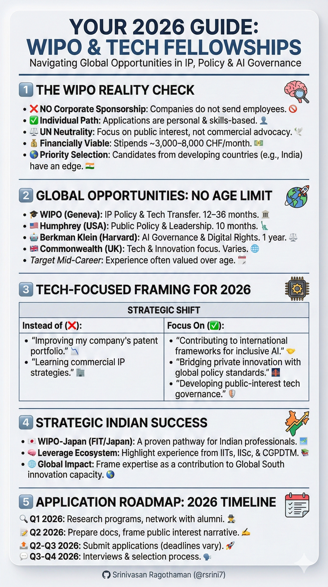
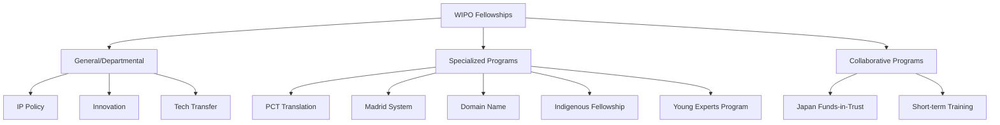
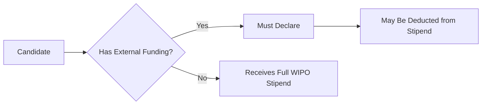
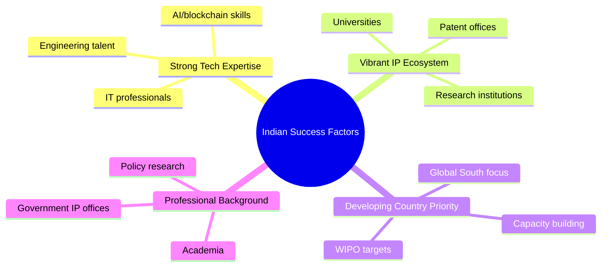
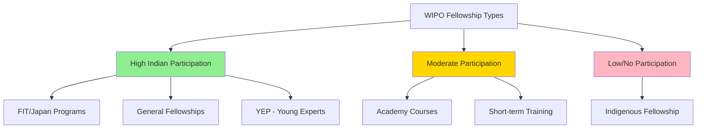
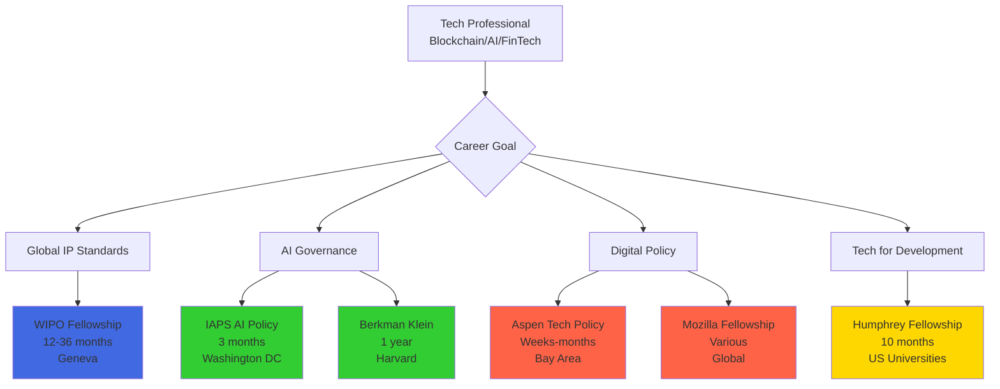
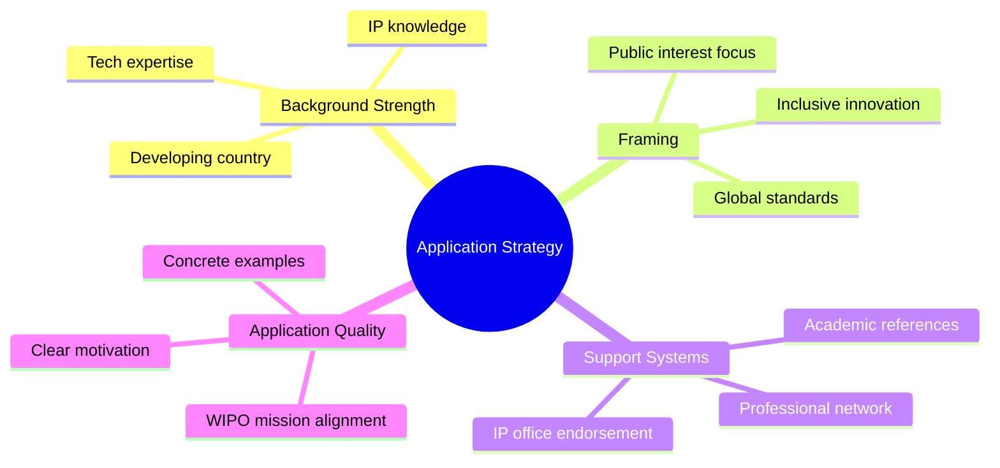
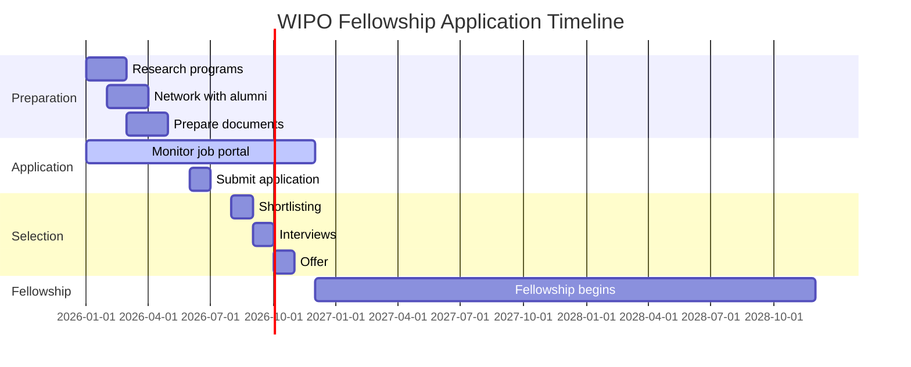
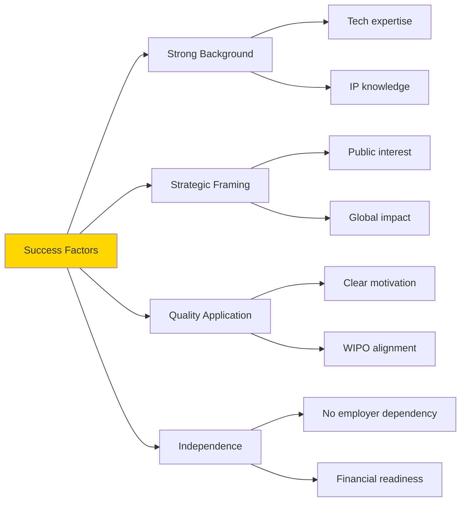

# Complete Guide to WIPO & International Tech Fellowships

---

## Table of Contents
1. [WIPO Fellowship Programs Overview](#wipo-overview)
2. [Corporate Sponsorship Reality Check](#corporate-sponsorship)
3. [Indian Participation Examples](#indian-participation)
4. [International Fellowships Without Age Limits](#no-age-limit)
5. [Tech-Focused Fellowship Opportunities](#tech-focused)
6. [Application Strategies](#application-strategies)

---

## WIPO Fellowship Programs Overview

### What are WIPO Fellowships?

WIPO (World Intellectual Property Organization) fellowships are UN-funded training programs providing hands-on experience in intellectual property policy, translation, law, economics, and innovation.

### Key Features

**Duration & Compensation**
- **Length**: 12–36 months (varies by program type)
- **Stipend**: 3,000–8,000 CHF per month (based on qualifications and experience)
- **Benefits**: Professional development in global IP frameworks

**Eligibility Requirements**
- Minimum bachelor's degree (advanced degrees or IP/tech/policy experience preferred)
- No age limit (skills-based selection)
- Priority given to candidates from developing countries (including India)

### Fellowship Types

### Application Process Flow

**Required Documents**
1. CV/Resume
2. Motivation letter explaining fit with WIPO's mission
3. Copies of degrees and certificates
4. References
5. Declaration of any external funding

**Important Notes**
- Applications are strictly individual (no nominations for general fellowships)
- Positions advertised on wipo.int/jobs and LinkedIn
- No guaranteed WIPO employment after fellowship completion
- Fellows treated as external candidates for future positions

---

## Corporate Sponsorship Reality Check

### The Bottom Line: No Private Company Sponsorship

After extensive research across official WIPO sources, evaluation reports, LinkedIn profiles, and targeted queries for major companies, **there is NO evidence of formal private company sponsorship or secondment for WIPO fellowships**.

### What Was Searched

Companies investigated included:
- JPMorgan Chase
- IBM
- Microsoft
- Google
- Siemens
- Tata Consultancy Services
- Infosys

**Result**: Zero documented cases of employees from these companies participating in WIPO fellowships.

### External Funding Rules

**Key Point**: While you must declare external remuneration (employer salary, government funding, scholarships), this is a disclosure requirement, not an encouraged pathway. The purpose is to avoid double-funding, not to facilitate corporate sponsorship.

### Actual Fellowship Pathways Comparison

| Pathway | Frequency | Examples | Process |
|---------|-----------|----------|---------|
| **Government/Public Sector** | Very Common | National IP offices, ministries, innovation agencies | Employer grants paid/unpaid leave; individual applies |
| **Academic/Research** | Common | Universities (IITs, IISc), WIPO-affiliated IP chairs | Institution may nominate or hold position open |
| **Private Sector** | Rare/Undocumented | No verified cases from major firms | Purely individual applications |

### Why Private Sector Involvement is Minimal

1. **WIPO's Mission**: UN agency focused on global public-interest IP standards (neutrality is key)
2. **Design Philosophy**: Individual professional development, not corporate training
3. **No Infrastructure**: No formal nomination channels, quotas, or secondment programs for companies

### Informal Employer Support (Theoretical)

While theoretically possible, this scenario is **rare and undocumented**:
- Employee gets approval for unpaid/sabbatical leave
- Company provides supplementary pay (must be declared)
- Pay could offset WIPO stipend

**Reality**: No public evidence of this happening with major tech/finance firms.

---

## Indian Participation Examples

### Why Indians Succeed in WIPO Fellowships

### Documented Indian Fellows

#### 1. Dr. Dara Ajay
- **Program**: WIPO-Japan Funds-in-Trust (FIT/Japan) Short-term Fellowship
- **Year**: 2018 (two weeks)
- **Focus**: Training at SHIGA International Patent Office in Japan
- **Topics**: Japanese patent law, claim drafting, PCT prosecution, litigation
- **Background**: WIPO-supported IP LL.M. graduate
- **Contribution**: Presented on Indian IP trends (Traditional Knowledge Digital Library, Natco v. Bayer compulsory licensing)

#### 2. Unnamed Indian Fellow
- **Program**: WIPO-Japan Collaborative Fellowship
- **Year**: 2012
- **Details**: Specific fellowship slot allocated to Indian participant (alongside Cambodia and Thailand candidates)
- **Typical Profile**: Indian Patent Office staff or IP professionals

#### 3. Other Indian Participants

**Shifali Chatrath**
- Selected for WIPO fellowship component in Advanced International Certificate Course (AICC) on IP
- Included face-to-face session in Seoul, South Korea
- Part of 17 global participants

**Nabanita Mukherjee**
- Completed WIPO Fellowship in Advanced IPR courses
- Focused on professional development in IP management

### Indian Representation Across Programs

**Note on Indigenous Fellowship**: No Indian fellows listed since 2009. Past fellows from Uganda, Ecuador, Russia, Sweden, New Zealand, Samoa, Bolivia, Philippines, Ukraine, Australia, and Tanzania.

### Common Career Paths for Indian Fellows

**Before Fellowship**
- Government IP offices (CGPDTM - Controller General of Patents, Designs & Trade Marks)
- Academia (IITs, IISc)
- Public research institutions
- NGOs in IP space

**After Fellowship**
- Return to enhanced roles in government
- Academic positions with global IP expertise
- Industry roles in IP strategy
- Policy advisory positions

---

## International Fellowships Without Age Limits

### Overview

Many prestigious international fellowships focus on professional experience and skills rather than age. These are ideal for mid-career professionals with expertise in IP, policy, innovation, or global development.

### Complete List with Details

#### 1. WIPO Fellowship Program

**Quick Facts**
- **Duration**: 12–36 months
- **Stipend**: 3,000–8,000 CHF/month
- **Location**: Geneva, Switzerland
- **Age Policy**: No restrictions (explicitly stated)

**Application Steps**
1. Monitor https://www.wipo.int/jobs/en/ for fellowship positions
2. Create account on WIPO e-recruitment system
3. Submit CV, motivation letter, degrees, references
4. Virtual/in-person interview if shortlisted
5. Declare external funding if applicable

**Best For**: IP policy, law, translation, tech transfer, innovation professionals

---

#### 2. Hubert H. Humphrey Fellowship Program (USA)

**Quick Facts**
- **Duration**: 10 months
- **Funding**: Fully funded (travel, stipend, tuition)
- **Location**: Various U.S. universities
- **Age Policy**: No fixed limit (mid-career focus)

**Application Steps**
1. Visit https://www.humphreyfellowship.org/ or USIEF India portal
2. Apply through U.S. Embassy (India deadline: April–June)
3. Submit application, personal statement, resume, 3 recommendations
4. National screening → U.S. nomination
5. Visa and orientation if selected

**Best For**: Public policy, innovation, education, leadership roles

---

#### 3. Reagan-Fascell Democracy Fellowship (USA)

**Quick Facts**
- **Duration**: 5 months
- **Funding**: Fully funded
- **Location**: Washington D.C.
- **Age Policy**: No limits (mid-career typical)

**Application Steps**
1. Visit https://www.ned.org/fellowships/
2. Apply online (annual deadline ~October)
3. Submit form, project proposal, CV, 3–4 recommendations
4. Interviews for shortlisted candidates
5. Selection announced months later

**Best For**: Democracy activists, policy researchers, IP governance

---

#### 4. Maurice R. Greenberg World Fellows Program (Yale)

**Quick Facts**
- **Duration**: 4 months
- **Funding**: Fully funded
- **Location**: Yale University
- **Age Policy**: No minimum/maximum (average ~39)

**Application Steps**
1. Visit https://worldfellows.yale.edu/
2. Apply online (deadline December/January)
3. Submit essays, CV, video statement, 3–5 recommendations
4. Shortlisting and interviews
5. Fall cohort selection

**Best For**: Emerging global leaders from non-U.S. countries

---

#### 5. British Academy International Fellowships (UK)

**Quick Facts**
- **Duration**: 2 years
- **Funding**: Research funding
- **Location**: UK institutions
- **Age Policy**: No limit (early to mid-career)

**Application Steps**
1. Check https://www.thebritishacademy.ac.uk/funding/
2. Apply via Flexi-Grant system
3. Submit proposal, CV, host institution letter, references
4. Two-stage review process

**Best For**: Humanities/social sciences researchers (includes IP policy)

---

#### 6. Commonwealth Professional Fellowships (UK)

**Quick Facts**
- **Duration**: Varies
- **Funding**: Fully funded
- **Location**: UK organizations
- **Age Policy**: No limit (mid-career focus)

**Application Steps**
1. Visit Commonwealth Scholarship Commission (cscuk.fcdo.gov.uk)
2. Host organization nominates/applies
3. Submit via Electronic Application System
4. Deadlines vary (often mid-year)

**Best For**: Tech/innovation professionals from Commonwealth countries (including India)

---

### Comparison Matrix

| Fellowship | Duration | Location | Funding | Application Difficulty | Best For Indians |
|-----------|----------|----------|---------|----------------------|------------------|
| **WIPO** | 12-36 mo | Geneva | High stipend | Moderate-High | ⭐⭐⭐⭐⭐ |
| **Humphrey** | 10 mo | US universities | Full | High | ⭐⭐⭐⭐ |
| **Reagan-Fascell** | 5 mo | Washington DC | Full | High | ⭐⭐⭐ |
| **Yale World Fellows** | 4 mo | Yale | Full | Very High | ⭐⭐⭐⭐ |
| **British Academy** | 2 years | UK | Research | High | ⭐⭐⭐ |
| **Commonwealth** | Varies | UK | Full | Moderate | ⭐⭐⭐⭐ |

---

## Tech-Focused Fellowship Opportunities

### Why Tech Fellowships Matter

For professionals in blockchain, fintech, AI, or emerging technologies, these fellowships offer pathways to influence global tech governance and policy.

### Tech Fellowship Options

#### 1. WIPO Fellowship (Tech Focus)

**Relevant Areas**
- AI governance and IP policy
- Digital infrastructure standards
- Blockchain and innovation ecosystems
- Tech transfer to developing economies

**Strategic Advantage**: Frame expertise around public-interest technology and global standards, not commercial advocacy.

---

#### 2. Berkman Klein Center Fellowship (Harvard)

**Quick Facts**
- **Duration**: 1 year (resident or non-resident)
- **Funding**: Fully funded stipend + resources
- **Focus**: Internet & society, tech policy, digital governance, AI ethics

**Application Steps**
1. Visit https://cyber.harvard.edu/
2. Submit project proposal, CV, writing samples, 2–3 recommendations
3. Interviews for shortlist
4. Decisions by spring 2026

**Best For**: Tech policy researchers/practitioners

---

#### 3. Institute for AI Policy and Strategy (IAPS) Fellowship

**Quick Facts**
- **Duration**: 3 months
- **Stipend**: USD 15,000–22,000
- **Location**: Washington D.C. or remote
- **Age Policy**: No limits (career pivot friendly)

**Application Steps**
1. Visit https://www.iaps.ai/fellowship
2. Apply for 2026 cohort (June–Aug 2026)
3. Submit form, resume, personal statement on AI policy
4. Screening and interviews

**Best For**: Career transitions into AI governance

---

#### 4. Aspen Tech Policy Hub Fellowship

**Quick Facts**
- **Duration**: Weeks to months
- **Funding**: Paid program
- **Location**: Bay Area (residential)
- **Age Policy**: Minimum 21, no upper limit

**Application Steps**
1. Visit https://www.aspentechpolicyhub.org/apply
2. Submit CV, policy interest statement
3. Review and interviews
4. Full-time bootcamp + projects

**Best For**: STEM experts entering policymaking

---

#### 5. Mozilla Tech + Society Fellowship

**Quick Facts**
- **Focus**: Open internet, digital policy
- **Tracks**: Senior tracks for experienced technologists
- **Age Policy**: No strict limit

**Application Steps**
1. Check https://www.mozillafoundation.org/ for 2026 nominations
2. Submit via open calls

**Best For**: Digital rights and open internet advocates

---

### Tech Fellowship Ecosystem Map

---

## Application Strategies

### For Indian Candidates Targeting WIPO

#### Leverage Your Strengths

#### Strategic Framing Examples

**❌ Weak Framing** (Commercial/Firm-Specific)
- "I want to help my company develop better IP strategies for blockchain patents"
- "I aim to leverage WIPO experience to advance fintech solutions for my employer"

**✅ Strong Framing** (Public Interest/Global Standards)
- "I aim to contribute to international IP frameworks for inclusive AI innovation in developing economies"
- "I seek to advance global standards for digital infrastructure that balance innovation with access"
- "I want to support tech transfer mechanisms that enable emerging markets to participate in the digital economy"

### Highlighting Relevant Experience

#### For Private Sector Candidates

**Experience to Emphasize**
- Open-source contributions
- Standards body participation (IEEE, IETF, W3C)
- Policy research or white papers
- Pro bono IP work
- Tech for social good projects
- Academic collaborations

**Experience to Contextualize**
- Commercial product development → "developed innovative solutions for underserved markets"
- Corporate IP strategy → "analyzed IP frameworks for technology transfer"
- Financial services tech → "evaluated regulatory approaches to digital innovation"

### Application Timeline

### Addressing the Private Sector Background

**Challenge**: WIPO fellows predominantly come from government, academia, or NGOs.

**Solution**: Position yourself as a bridge-builder.

**Example Statement**:
> "My background in fintech has given me unique insights into how private sector innovation can be channeled toward public benefit. I've seen firsthand the gaps in IP frameworks for emerging technologies, and I'm committed to contributing to international standards that serve global stakeholders, not just commercial interests. My goal is to bring a practitioner's perspective to policy development while maintaining WIPO's mission of inclusive innovation."

### Getting Support (Even Without Employer Sponsorship)

1. **Professional Endorsements**
   - IP office officials you've worked with
   - Academic collaborators
   - Standards organization contacts

2. **Financial Independence**
   - Demonstrate ability to take leave
   - Show WIPO stipend is sufficient
   - No employer funding needed (simplifies application)

3. **Network Engagement**
   - Connect with WIPO alumni on LinkedIn
   - Attend WIPO Academy webinars
   - Participate in IP conferences

### Red Flags to Avoid

❌ Don't say:
- "My company is sending me"
- "I want to bring skills back to my employer"
- "This will help my commercial career"
- "I need this for promotion"

✅ Instead say:
- "I'm pursuing this independently to serve global IP development"
- "I want to contribute to frameworks that benefit all stakeholders"
- "This aligns with my commitment to public-interest technology"
- "I aim to support developing countries' participation in innovation ecosystems"

### Final Application Checklist

**Document Quality**
- [ ] CV tailored to public service and IP focus
- [ ] Motivation letter explains WIPO mission alignment
- [ ] References from diverse sectors (not just employer)
- [ ] Examples of public-interest work highlighted
- [ ] Clear statement of independence from employer

**Strategic Positioning**
- [ ] Emphasis on neutral, global standards
- [ ] Examples of work benefiting developing countries
- [ ] Demonstration of policy interest (not just technical)
- [ ] Acknowledgment of WIPO's UN mission
- [ ] Commitment to knowledge sharing post-fellowship

**Practical Preparation**
- [ ] Ability to relocate to Geneva for 12-36 months
- [ ] Financial planning (WIPO stipend vs. current salary)
- [ ] Professional leave arrangements (if applicable)
- [ ] Family/personal considerations addressed
- [ ] Long-term career vision articulated

---

## Key Takeaways

### On WIPO Corporate Sponsorship

1. **No private company formally sponsors or seconds employees** into WIPO fellowships
2. **Zero documented cases** from major tech/finance firms (JPMorgan, IBM, Microsoft, Google, etc.)
3. Applications are **strictly individual** with skills-based selection
4. **Government/academic pathways** are the norm, not private sector

### On Indian Success

1. **Strong track record** due to tech expertise and developing-country priority
2. **FIT/Japan programs** show notable Indian participation
3. **Common backgrounds**: IP offices, universities, research institutions
4. **Post-fellowship careers**: Enhanced roles in government, academia, industry

### On Age-Free Opportunities

1. **Multiple prestigious programs** have no age limits
2. **Mid-career professionals** explicitly welcomed in many fellowships
3. **Experience valued over age** across WIPO and international programs
4. **Tech-focused options** available for AI, digital policy, innovation

### Strategic Success Factors

### Final Advice

**For Private Sector Candidates**:
- Your background is NOT a disadvantage if framed correctly
- Emphasize public-interest work and policy commitment
- Apply independently, highlighting neutrality
- Strong applications succeed regardless of sector

**For Indian Applicants**:
- Leverage your tech ecosystem strength
- Developing-country priority works in your favor
- Network with IP offices for endorsements (optional but helpful)
- Frame expertise around inclusive innovation

**General Timeline**:
- Monitor WIPO jobs portal throughout 2026
- Prepare documents 3-6 months before applying
- Most competitive candidates apply early when calls open
- Fellowship start dates vary (often 3-6 months after selection)

---

## Additional Resources

### Official Links

- **WIPO Jobs Portal**: https://www.wipo.int/jobs/en/
- **WIPO Fellowship Info**: https://wipo.int/working-at-wipo/fellowship-program
- **Humphrey Fellowship**: https://www.humphreyfellowship.org/
- **USIEF India**: https://usief.org.in
- **Berkman Klein Center**: https://cyber.harvard.edu/
- **IAPS AI Fellowship**: https://www.iaps.ai/fellowship

### Best Practices

1. **Research thoroughly** before applying (read program evaluations, alumni profiles)
2. **Tailor each application** to specific program mission
3. **Start early** (documentation takes time)
4. **Network actively** (LinkedIn, conferences, webinars)
5. **Be genuine** about public service commitment

### Success Metrics

Remember: The goal isn't just to get accepted, but to:
- Contribute meaningfully to global IP frameworks
- Build international professional networks
- Enhance expertise in emerging technology governance
- Support developing countries' innovation capacity
- Return with knowledge that serves broader communities

---
