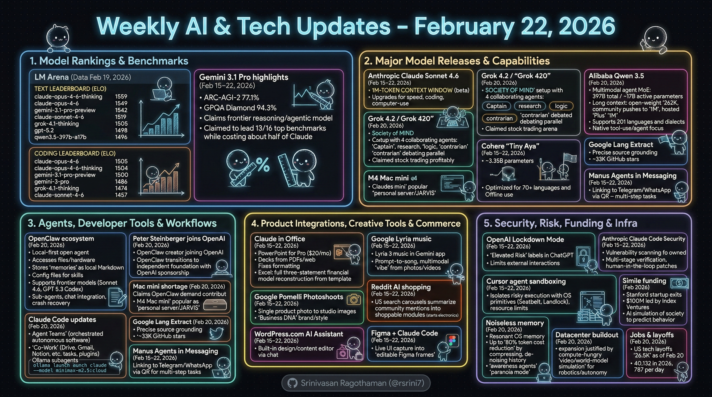

# Weekly AI & Tech Updates - February 22, 2026



## 🏆 Model Rankings & Benchmarks
### LM Arena (Data for Feb 19, 2026)
- Notable **Text** leaderboard ELOs included: claude-opus-4-6-thinking **1559**, claude-opus-4-6 **1549**, gemini-3.1-pro-preview **1542**, claude-sonnet-4-6 **1519**, grok-4.1-thinking **1505**, gpt-5.2 **1498**, qwen3.5-397b-a17b **1496**.
- Notable **Coding** leaderboard ELOs included: claude-opus-4-6 **1505**, claude-opus-4-6-thinking **1504**, gemini-3.1-pro-preview **1500**, gemini-3-pro **1486**, grok-4.1-thinking **1474**, claude-sonnet-4-6 **1457**.

### Gemini 3.1 Pro benchmark highlights (Feb 15–22, 2026)
- Google reported **ARC-AGI-2 77.1%** and **GPQA Diamond 94.3%** for Gemini 3.1 Pro, positioning it as a frontier reasoning/agentic model.
- The update also claimed Gemini 3.1 Pro “leads 13/16 top benchmarks” while costing about **half of Claude** (as stated in the source carousel).

***

## 🚀 Major Model Releases & Capabilities
### Anthropic Claude Sonnet 4.6 (Feb 15–22, 2026)
- Anthropic released **Claude Sonnet 4.6** with a **1M-token context window (beta)** and upgrades aimed at “everyday” speed + coding + computer-use.
- Reported improvements include stronger “computer use” (UI clicking/typing/navigation) and user-preference wins over prior Sonnet/Opus comparisons (as stated in the carousel).

### xAI Grok 4.2 / “Grok 420” (Feb 20, 2026)
- xAI’s Grok 4.2 was described as using a “**Society of Mind**” inference setup with **4 collaborating agents** (Captain/research/logic/contrarian roles) debating in parallel.
- The same source claims early indicators were strong, including profitability in a “live stock trading arena” (as characterized in the slide).

### Alibaba Qwen 3.5 (Feb 20, 2026)
- Alibaba’s **Qwen3.5-397B-A17B** was presented as a multimodal, agent-oriented MoE model with **397B total / ~17B active** parameters and very long context (open-weight context cited as **262K**, with “community setups” pushing toward 1M; hosted “Plus” cited at **1M**).
- The update also states Qwen 3.5 supports **201 languages and dialects** and emphasizes native tool-use/agent behavior improvements.

### Cohere “Tiny Aya” (Feb 15–22, 2026)
- Cohere Labs introduced **Tiny Aya**: ~**3.35B parameters**, optimized for **70+ languages** and offline use on phones/laptops (as described in the carousel).

***

## 🤖 Agents, Developer Tools & Workflows
### OpenClaw + ecosystem momentum (Feb 20, 2026)
- OpenClaw was described as a **local-first** open-source agent that can access your files/hardware, store “memories” as local Markdown, and rely on simple skills/config files (e.g., identity/soul concepts).
- The slides report OpenClaw added/advertised support for multiple frontier models (e.g., Sonnet 4.6, “GPT 5.3 Codex”) and agent features like sub-agents, better chat integrations, crash recovery, and many security/bug fixes.

### Peter Steinberger joins OpenAI (Feb 20, 2026)
- The update says OpenClaw’s creator **Peter Steinberger** is joining **OpenAI**, while OpenClaw transitions toward an independent foundation with OpenAI sponsorship (per the slide summary).

### “Mac mini shortage” attributed to OpenClaw usage (Feb 20, 2026)
- The slides cite coverage claiming OpenClaw-driven demand contributed to **Apple Mac supply shortages**, and that the **M4 Mac mini** became popular as an always-on “personal server/JARVIS”-style box.

### Claude Code “Agent Teams” + Co-Work (Feb 20, 2026)
- Claude Code “**Agent Teams**” was presented as an experimental mode where multiple agents share context and coordinate under an orchestrator for more autonomous software work.
- Claude “**Co-Work**” was positioned as a plugin-enabled workspace (Google Drive/Gmail/Calendar/Notion, etc.) that can run background tasks and provide “skills” via plugins/slash commands.

### Ollama subagents + built-in web search (Feb 20, 2026)
- Ollama was described as supporting **parallel subagents** and **web search** inside a Claude Code workflow without MCP servers or API keys.
- Example command shown in the slides:
  ```bash
  ollama launch claude --model minimax-m2.5:cloud
  ```

### Google “Lang Extract” (Feb 20, 2026)
- Google’s open-source Python library **LangExtract** was highlighted for “precise source grounding,” tracing extracted info back to exact source origins (and shown at ~**33K GitHub stars** in the slide).

### Manus Agents in Telegram/WhatsApp (Feb 15–22, 2026)
- Manus introduced linking agents into chat apps via QR-based setup, enabling multi-step tasks (research, PDF work, reports) directly from messaging.

***

## 🧩 Product Integrations, Creative Tools & Commerce
### Claude in PowerPoint + Excel (Feb 15–22, 2026)
- Anthropic expanded Claude to **PowerPoint for Pro users ($20/month)**, focused on generating/expanding decks from PDFs/web info and fixing formatting.
- Separately, an example workflow showed Claude reconstructing a full **three-statement financial model** in Excel from a template with missing formulas (as a capability demonstration).

### Google Lyria music generation in Gemini app (Feb 15–22, 2026)
- Google began rolling out **Lyria 3** music generation in the Gemini app, including prompt-to-song creation and multimodal “vibe” conditioning from photos/videos (as described in the carousel).

### Google “Pomelli Photoshoots” (Feb 15–22, 2026)
- “Pomelli Photoshoots” was described as turning a single product photo into studio-style images with brand/style matching (“Business DNA”) and templates.

### Reddit AI shopping in search (Feb 15–22, 2026)
- Reddit tested AI-powered shopping carousels in U.S. search that summarize community product mentions into shoppable modules (starting with electronics queries).

### WordPress.com AI Assistant (Feb 15–22, 2026)
- WordPress.com launched a built-in AI Assistant to edit site design and content via chat (layouts/fonts/headers; rewriting/translating/headlines/grammar).

### Figma + Claude Code editable frames (Feb 15–22, 2026)
- Figma was described as enabling capture of live UI (localhost/staging/production) into **editable Figma frames** rather than screenshots, to compare flows and iterate variants faster.

***

## 🛡️ Security, Risk, Funding & Infra
### OpenAI “Lockdown Mode” + Elevated Risk labels (Feb 15–22, 2026)
- OpenAI introduced **Lockdown Mode** and “Elevated Risk” labels in ChatGPT to reduce prompt-injection/data-leak risk by limiting external interactions like web/tool access (as described in the carousel).

### Anthropic “Claude Code Security” (Feb 15–22, 2026)
- Anthropic opened a waitlist for **Claude Code Security**, described as scanning owned codebases for vulnerabilities, reducing false positives via multi-stage verification, and keeping a human-in-the-loop for patch approval.

### Cursor agent sandboxing (Feb 15–22, 2026)
- Cursor shipped agent sandboxing for local agents, described as isolating risky code execution with OS primitives (e.g., macOS Seatbelt/Linux Landlock) plus resource limits.

### “Noiseless memory” cutting token costs (Feb 20, 2026)
- Resonant OS was presented with a memory approach claiming up to **80% token cost reduction** by compressing and de-noising conversational history, plus “awareness agents” and a “paranoia mode” security posture.

### Simile emerges with funding (Feb 2026)
- “Simile,” described as a Stanford-originated startup, was reported to emerge from stealth with **$100M funding led by Index Ventures** and aims to build an “AI simulation of society” for predicting human behavior at scale.

### Datacenter buildout rationale (Feb 20, 2026)
- The slides argued that massive AI datacenter expansion could be justified less by text LLMs and more by compute-hungry **video/world-model simulation** for robotics/autonomy (e.g., training via simulated environments).

### Jobs & layoffs snapshot (as of Feb 20, 2026)
- The slides cited trackers showing **26.5K** U.S. tech layoffs in 2026 “as of Feb 20,” and also referenced a separate figure of **40,132** layoffs in 2026 with a “787 per day” rate (as reported in the slide).

---

## References
- Anthropic — “Introducing Claude Sonnet 4.6” https://www.anthropic.com/news/claude-sonnet-4-6 [anthropic](https://www.anthropic.com/news/claude-sonnet-4-6)
- Anthropic (Claude API Docs) — “What’s new in Claude 4.6” https://platform.claude.com/docs/en/about-claude/models/whats-new-claude-4-6 [platform.claude](https://platform.claude.com/docs/en/about-claude/models/whats-new-claude-4-6)
- OpenAI — “Introducing Lockdown Mode and Elevated Risk labels in ChatGPT” https://openai.com/index/introducing-lockdown-mode-and-elevated-risk-labels-in-chatgpt/ [openai](https://openai.com/index/introducing-lockdown-mode-and-elevated-risk-labels-in-chatgpt/)
- Reuters — “OpenClaw founder Steinberger joins OpenAI, open-source bot becomes foundation” https://www.reuters.com/business/openclaw-founder-steinberger-joins-openai-open-source-bot-becomes-foundation-2026-02-15/ [reuters](https://www.reuters.com/business/openclaw-founder-steinberger-joins-openai-open-source-bot-becomes-foundation-2026-02-15/)
- CNBC — “OpenClaw creator Peter Steinberger joining OpenAI, Altman says” https://www.cnbc.com/2026/02/15/openclaw-creator-peter-steinberger-joining-openai-altman-says.html [cnbc](https://www.cnbc.com/2026/02/15/openclaw-creator-peter-steinberger-joining-openai-altman-says.html)

### LM Arena Leaderboard (Feb 2026 context)
- Arena AI — “Leaderboard Overview” https://arena.ai/leaderboard [arena](https://arena.ai/leaderboard)
- Hugging Face — “Arena Leaderboard” https://huggingface.co/spaces/lmarena-ai/arena-leaderboard [huggingface](https://huggingface.co/spaces/lmarena-ai/arena-leaderboard)

### xAI Grok 4.2 / “Grok 420”
- Atal Upadhyay — “Grok 4.2.0: The Four-Agent Revolution Deep Dive” https://atalupadhyay.wordpress.com/2026/02/18/grok-4-2-0-the-four-agent-revolution-deep-dive/ [atalupadhyay.wordpress](https://atalupadhyay.wordpress.com/2026/02/18/grok-4-2-0-the-four-agent-revolution-deep-dive/)
- YouTube / BitBiased — “Grok 4.2 Official Release Explained” https://www.youtube.com/watch?v=w4uU-taZhZo [youtube](https://www.youtube.com/watch?v=w4uU-taZhZo)
- Times of India — “Elon Musk says Grok 4.20 public beta is now available” https://timesofindia.indiatimes.com/technology/social/elon-musk-says-grok-4-20-public-beta-is-now-available [timesofindia.indiatimes](https://timesofindia.indiatimes.com/technology/social/elon-musk-says-grok-4-20-public-beta-is-now-available-capabilities-of-ai-chatbot-offered-by-xai/articleshow/128499381.cms)

### Alibaba Qwen 3.5
- Benzene.ai — “Alibaba Releases Qwen 3.5 with 397B MoE Architecture” https://benzene.ai/articles/alibaba-releases-qwen-3-5/ [benzene](https://benzene.ai/articles/alibaba-releases-qwen-3-5/)
- MarkTechPost — “Alibaba Qwen Team Releases Qwen3.5-397B MoE Model with 17B Active Parameters” https://www.marktechpost.com/2026/02/16/alibaba-qwen-team-releases-qwen3-5-397b-moe-model-with-17b-active-parameters-and-1m-toke [marktechpost](https://www.marktechpost.com/2026/02/16/alibaba-qwen-team-releases-qwen3-5-397b-moe-model-with-17b-active-parameters-and-1m-token-context-for-ai-agents/)
- AIToolly — “Alibaba's Qwen 3.5: Faster, Cheaper AI Beats Trillion-Parameter Predecessor” https://aitoolly.com/ai-news/article/2026-02-19-alibabas-new-qwen-35-397b-a17-model-outperforms-trillion-parameter-predecessor-a [aitoolly](https://aitoolly.com/ai-news/article/2026-02-19-alibabas-new-qwen-35-397b-a17-model-outperforms-trillion-parameter-predecessor-at-significantly-lowe)

### Simile AI Startup
- GMA Council — “Stanford AI Startup Simile Raises $100 Million Led by Index Ventures” https://gmacouncil.org/news/stanford-ai-startup-simile-raises-100-million-led-by-index-ventures-for-behavioral-prediction-models [gmacouncil](https://gmacouncil.org/news/stanford-ai-startup-simile-raises-100-million-led-by-index-ventures-for-behavioral-prediction-models-simulating-consumer-choices-and-corporate-strategies-at-scale)
- LinkedIn — “Introducing Simile: AI Simulations for Informed Decision Making” https://www.linkedin.com/posts/mibernstein_today-were-launching-simile-the-simulation-share-7427785481813168129-L6O-/ [linkedin](https://www.linkedin.com/posts/mibernstein_today-were-launching-simile-the-simulation-share-7427785481813168129-L6O-/?rcm=ACoAAACAIksBHO7xstdhaM3QUfATembAqjA0OwE)