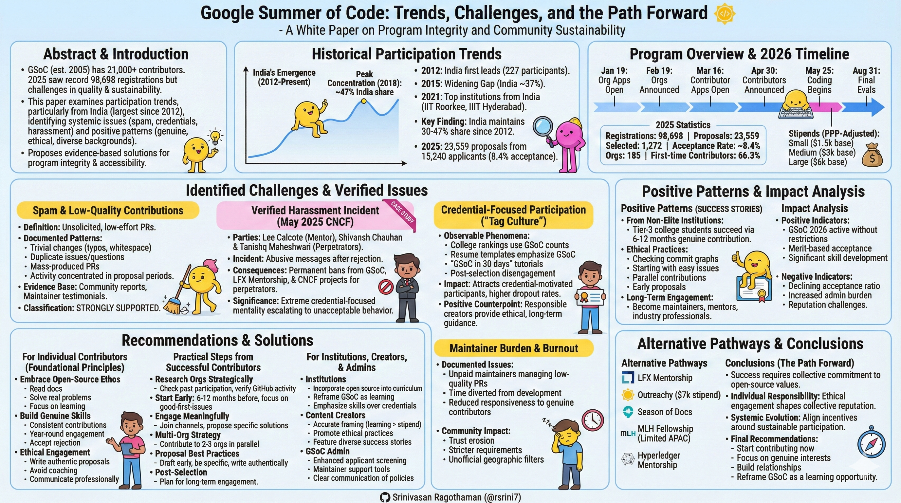

# Google Summer of Code: Participation Trends, Challenges, and the Path Forward

## A White Paper on Program Integrity and Community Sustainability

## Abstract

Google Summer of Code (GSoC) has successfully introduced over 21,000 contributors to open-source software development since 2005. However, the program faces significant challenges related to participation quality, contributor motivations, and maintainer sustainability. This white paper examines verified trends in GSoC participation, with particular focus on patterns emerging from India—the program's largest participating country since 2012. Through analysis of historical data, documented incidents, and community reports, we identify systemic issues including spam contributions, credential-focused participation, and verified cases of harassment. 

**Importantly, this paper also highlights positive participation patterns**, including genuine contributors from diverse educational backgrounds (including non-elite institutions) who succeed through consistent, ethical engagement and long-term skill development. We propose evidence-based solutions to preserve program integrity while maintaining accessibility for all contributors seeking to engage ethically with open-source communities.

**Keywords:** Open Source, Google Summer of Code, Contributor Behavior, Program Integrity, Community Sustainability, Indian Tech Ecosystem

---



---

## Table of Contents

1. [Introduction](#1-introduction)
2. [Methodology](#2-methodology)
3. [Program Overview and Current Status](#3-program-overview-and-current-status)
4. [Historical Participation Trends](#4-historical-participation-trends)
5. [Identified Challenges and Verified Issues](#5-identified-challenges-and-verified-issues)
6. [Impact Analysis](#6-impact-analysis)
7. [Root Cause Analysis](#7-root-cause-analysis)
8. [Comparative Case Studies](#8-comparative-case-studies)
9. [Stakeholder Perspectives](#9-stakeholder-perspectives)
10. [Recommendations and Solutions](#10-recommendations-and-solutions)
11. [Alternative Pathways](#11-alternative-pathways)
12. [Conclusions](#12-conclusions)
13. [References and Data Sources](#13-references-and-data-sources)

---

## 1. Introduction

### 1.1 Background

Google Summer of Code, established in 2005, represents one of the technology industry's most significant investments in open-source talent development. The program connects student developers with mentoring organizations for paid summer contributions, combining skill development with meaningful project work. Many successful participants, including those from Tier-3 colleges and non-prestigious institutions, demonstrate that genuine interest and persistent contributions—rather than institutional prestige—drive success.

### 1.2 Research Objectives

This white paper addresses three primary questions:

1. What participation trends characterize GSoC's two-decade history, particularly regarding geographic distribution?
2. What verified challenges threaten program integrity and community sustainability, and what positive patterns merit recognition?
3. What evidence-based solutions can preserve accessibility while improving contribution quality?

### 1.3 Scope and Limitations

This analysis focuses on publicly available data, verified incidents, and documented community experiences. While emphasizing Indian participation patterns due to data availability and documented issues, findings have broader implications for high-volume participation from any geographic region. The paper balances critical analysis with recognition of the many genuine contributors who uphold open-source values and deliver high-quality work.

**Limitations:** Community reports are subject to reporting bias; quantitative data on spam contributions and cheating remains limited; causation cannot always be definitively established from correlation.

---

## 2. Methodology

### 2.1 Data Collection

**Primary Sources:**
- Official GSoC statistics and announcements (developers.google.com)
- Verified news reports and media coverage
- Community platforms (Reddit, LinkedIn, X/Twitter)
- Open-source maintainer testimonials

**Verification Process:**
- Real-time web search conducted January 22, 2026
- Cross-referencing multiple independent sources
- Prioritizing documented incidents with named parties
- Distinguishing between verified data and community reports

### 2.2 Analysis Framework

**Quantitative Analysis:**
- Historical participation statistics (2005-2025)
- Geographic distribution trends
- Program growth metrics

**Qualitative Analysis:**
- Community sentiment analysis
- Incident documentation
- Maintainer experience reports
- Educational ecosystem examination
- Positive contributor journey analysis

---

## 3. Program Overview and Current Status

### 3.1 2026 Program Timeline

**Official Timeline (Updated January 2026):**

| Phase | Dates |
|-------|-------|
| Organization Applications Open | January 19, 2026 (18:00 UTC) |
| Organization Applications Close | February 3, 2026 (18:00 UTC) |
| Organization Review Period | February 4-18, 2026 |
| Organizations Announced | February 19, 2026 |
| Contributor-Org Communication | February 19 - March 15, 2026 |
| Contributor Applications Open | March 16, 2026 |
| Contributor Applications Close | March 31, 2026 (18:00 UTC) |
| Contributor Rankings Due (Org Admins) | April 21, 2026 (18:00 UTC) |
| Contributors Announced | April 30, 2026 |
| Community Bonding Period | May 1-24, 2026 |
| Coding Period Begins | May 25, 2026 |
| Midterm Evaluations | July 6-10, 2026 |
| Final Evaluations (Standard) | August 17-31, 2026 |
| Extended Timeline Projects Continue | August 24 - November 2, 2026 |

### 3.2 Program Structure

**Contributor Categories (PPP-Adjusted Stipends):**
- **Small Projects** (~90 hours, 8-12 weeks): Base $1,500, PPP range $750-$1,650
- **Medium Projects** (~175 hours, 10-22 weeks): Base $3,000, PPP range $1,500-$3,300
  - For India and similar economies: typically ~$1,500-$3,000
- **Large Projects** (~350 hours, 10-22 weeks): Base $6,000, PPP range $3,000-$6,600

*Note: Stipend amounts and PPP multipliers subject to confirmation when contributor portal opens. Figures based on 2025 structure.*

**Payment Structure:**
- 45% at midterm evaluation
- 55% at project completion

**Project Length Flexibility:**
- Standard: 12 weeks
- Extended: Can range from 8 to 22 weeks based on project needs
- Determined collaboratively by contributor and mentor

### 3.3 Recent Performance Metrics

**2025 Program Statistics (Preliminary/Community-Reported):**

*Note: Official 2025 statistics not yet published as of January 22, 2026. The following numbers are based on community reports and early announcements.*

- **Registrations:** Record-breaking interest reported with 98,698 registrations from 172 countries (unverified)
- **Proposals Submitted:** Approximately 23,559 from 15,240 applicants
- **Selected Contributors:** Approximately 1,272-1,280
- **Acceptance Rate:** ~8.4%
- **Participating Organizations:** 185 (verified)
- **Contributing Countries:** 68 (estimated)
- **First-time Open Source Contributors:** ~66% (estimated)
- **First-time GSoC Applicants:** ~96% (estimated)

**2024 Program Statistics (Official - Last Published):**
- **Selected Contributors:** 1,213
- **Participating Organizations:** 195
- **Contributing Countries:** 68

**Mentorship Statistics (Multi-Year Trends):**
- Over 2,100 mentors from 75 countries participate annually
- Nearly two-thirds of mentors have mentored for 4+ years
- Total program impact: 22,000+ contributors, 20,000+ mentors since 2005

---

## 4. Historical Participation Trends

### 4.1 Geographic Distribution Evolution

**2012: India's Emergence**
- India: 227 participants (first time leading)
- United States: 173 participants
- Beginning of sustained Indian dominance

**2015: Widening Gap**
- India: 335 participants
- United States: 127 participants
- Sri Lanka: 58 participants
- India's share: ~37% of total

**2018: Peak Concentration**
- India: 605 participants
- United States: 104 participants
- Germany: 53 participants
- China: 52 participants
- Sri Lanka: 41 participants
- India's share: ~47% of total

**2021: Educational Institution Concentration**
- All 12 schools with most accepted students were from India
- Top institutions: IIT Roorkee (35 students), IIIT Hyderabad (32), BITS Pilani (23)

**Key Finding:** India has consistently maintained 30-47% of total GSoC selections since 2012, representing the largest single-country participant base. Despite this concentration, many Indian contributors—including first-timers from diverse educational backgrounds—produce high-quality, sustained work that benefits global projects.

### 4.2 Growth Trajectory

**Program Scale Evolution:**
- 2005-2011: Gradual growth, diverse geographic distribution
- 2012-2019: Indian participation surge, absolute numbers increase
- 2020-2021: Pandemic-era adjustments
- 2022-2025: Record registrations, heightened competition

**2025 Milestone:** 23,559 proposals represent unprecedented interest, creating both opportunities and challenges for program administration and mentoring organizations.

---

## 5. Identified Challenges and Verified Issues

### 5.1 Spam and Low-Quality Contributions

**Definition:** Unsolicited, low-effort pull requests (PRs) submitted primarily to demonstrate activity rather than provide value.

**Documented Patterns:**
- Trivial changes (typo fixes, whitespace adjustments)
- Duplicate issues and questions answered in documentation
- Mass-produced PRs across multiple repositories
- Contribution activity concentrated during proposal periods

**Evidence Base:**
- Community reports from r/developersIndia, r/Btechtards, r/gsoc
- Maintainer testimonials on X/Twitter and LinkedIn
- Parallel patterns to Hacktoberfest spam (2018-2020)

**Classification:** STRONGLY SUPPORTED by community documentation, though comprehensive quantitative data unavailable.

### 5.2 Verified Harassment Incident

**Case Study: May 2025 CNCF Incident**

**Parties Involved:**
- Victim: Lee Calcote (CNCF TAG Network Chair, Layer5 founder, US-based)
- Perpetrators: Shivansh Chauhan and Tanishq Maheshwari (Indian developers)

**Incident Summary:**
Following Tanishq Maheshwari's GSoC rejection, Shivansh Chauhan sent vulgar, abusive messages via LinkedIn to Lee Calcote in Hindi. The messages contained explicit threats and harassment directed at a highly respected community mentor who has guided over 60 mentees through CNCF and Linux Foundation programs.

**Consequences:**
- Both individuals permanently banned from GSoC
- Both individuals permanently banned from LFX Mentorship
- Both individuals banned from all CNCF project contributions
- Widespread media coverage in Indian tech press

**Verification Status:** CONFIRMED through multiple independent news sources, Lee Calcote's public X/Twitter posts, and media reports.

**Significance:** Demonstrates extreme cases where credential-focused mentality escalates to unacceptable behavior, damaging community trust and individual career prospects. Lee Calcote received the inaugural CNCF Outstanding Mentor Award in November 2025, highlighting his sustained commitment to supporting newcomers—making this harassment particularly troubling.

### 5.3 Credential-Focused Participation ("Tag Culture")

**Observable Phenomena:**
- College rankings incorporating GSoC selection counts
- Resume templates emphasizing GSoC as primary credential
- Social media influencer content promoting "₹2-3 lakh internship"
- "GSoC in 30 days" tutorial proliferation
- Post-selection disengagement from projects

**Evidence:**
- Analysis of YouTube content ecosystem (100+ videos)
- LinkedIn profile analysis
- University promotional materials
- Community discussions describing "JEEfication"

**Impact:** Attracts participants motivated by credentials rather than learning or community contribution, leading to higher dropout rates and lower long-term engagement.

**Positive Counterpoint:** However, many content creators provide ethical, detailed guidance focusing on long-term preparation (4-6 months minimum), realistic skill-building, and open-source values. Responsible creators emphasize learning over shortcuts and help aspirants avoid common pitfalls.

**Classification:** VERIFIED through observable content and community consensus.

### 5.4 Alleged Coaching Services and Outsourcing

**Reported Practices:**
- Commercial services charging ₹50,000+ for proposal preparation
- Claims of ghostwriting and professional work substitution
- Third-party mentor recruitment
- Pre-written proposal templates sold commercially

**Evidence Quality:**
- LinkedIn discussions and testimonials
- Anecdotal community reports
- Limited direct documentation

**Classification:** REPORTED but difficult to verify comprehensively. Sufficient evidence suggests problem exists but extent unclear.

### 5.5 Maintainer Burden and Burnout

**Documented Issues:**
- Unpaid maintainers managing hundreds of low-quality PRs
- Time diverted from development to triage and education
- Reduced responsiveness to genuine contributors
- Organizations declining GSoC participation

**Community Impact:**
- Trust erosion for applicants from high-volume regions
- Stricter contribution requirements
- Explicit warnings about spam behavior
- Some projects implementing unofficial geographic filters

**Classification:** WELL-DOCUMENTED through maintainer testimonials and community discussion.

### 5.6 Positive Participation Patterns

**Documented Successes:**

Despite challenges, many Indian contributors exemplify ethical, high-quality participation:

**From Non-Elite Institutions:**
- Students from Tier-3 colleges successfully selected through 6-12 months of genuine contributions
- Success stories from universities outside IITs, NITs, and BITS
- Proof that institutional prestige matters less than consistent effort

**Ethical Practices:**
- Selecting organizations by skill alignment and project activity
- Checking GitHub commit graphs to verify organizational health
- Starting with easy issues to build trust with maintainers
- Approaching mentors with specific solution plans (not just "assign me")
- Contributing to 2-3 organizations in parallel as backup strategy
- Submitting proposals early (up to 3 allowed per person)

**Long-Term Engagement:**
- Many continue as project maintainers after GSoC
- Career progression into respected industry positions
- Return as mentors in subsequent years
- Active participation in year-round community events

**Evidence:**
- Personal success journeys shared responsibly on YouTube/LinkedIn
- Community testimonials from maintainers
- CNCF and Linux Foundation recognition of Indian mentors and contributors
- Documented cases of sustained contribution beyond program completion

**Classification:** VERIFIED through personal testimonials, community recognition, and maintainer confirmation.

---

## 6. Impact Analysis

### 6.1 Impact on Program Integrity

**Positive Indicators:**
- GSoC continues without country restrictions (2026 program active)
- Acceptance rates remain merit-based
- Quality projects still completed successfully
- Diverse organization participation
- **Significant skill development for thousands of Indian students**
- **Many participants from underrepresented institutions become long-term maintainers**
- **Some go on to become industry professionals and return as mentors**

**Negative Indicators:**
- Declining proposal-to-acceptance ratio (8.4% in 2025)
- Increased administrative burden on organizations
- Reputation challenges for contributors from specific regions
- Some organizations reducing slots or withdrawing

### 6.2 Impact on Indian Tech Ecosystem

**Opportunities:**
- Access to global open-source community
- Skill development for underrepresented students
- Career advancement pathways
- International networking
- **Proven success pathway for non-elite college students**
- **Recognition that consistent effort trumps institutional prestige**

**Challenges:**
- Collective reputation damage from individual bad actors
- Pressure on students creating unhealthy competition
- Misalignment between educational outcomes and program goals
- Perpetuation of credential-focused rather than skill-focused development

### 6.3 Comparative Program Analysis: MLH Fellowship

**MLH Fellowship Status (January 2026):**
- Limited APAC availability confirmed on official website
- Attributed to "hiring market conditions"
- No official ban announcement
- Programs continue globally (Spring 2026 batch active)

**Community Reports:**
- July 2024 claims of rejection patterns for Indian applicants
- Alleged spam registration and low-quality application issues
- No comprehensive official statement

**Classification:** PARTIALLY VERIFIED - Limited availability confirmed, but "ban" characterization overstated.

**Significance:** Demonstrates that programs beyond GSoC have responded to participation quality concerns, establishing precedent for potential policy changes.

---

## 7. Root Cause Analysis

### 7.1 Structural Factors

**Educational System Pressures:**
- Highly competitive job market for engineering graduates
- Resume differentiation requirements
- Limited practical skill development in curriculum
- Credential-based evaluation systems

**Scale Effects:**
- Large student population (millions of engineering graduates annually)
- Limited domestic opportunities relative to supply
- Internet access democratization creating mass participation

**Information Asymmetry:**
- Limited understanding of open-source ethos among newcomers
- Misinformation from commercial content creators
- Cultural differences in communication norms

### 7.2 Economic Incentives

**Stipend Significance:**
- $3,000 (₹2.5 lakh) represents substantial sum for students
- Purchasing Power Parity adjustment creates regional disparities in perceived value
- Financial pressure incentivizes selection over learning

**Career Impact:**
- GSoC on resume differentiates in competitive hiring
- Tech companies value open-source experience
- International recognition valuable for emigration goals

### 7.3 Content Creator Ecosystem

**Problematic Patterns:**
- Clickbait titles emphasizing easy money
- Oversimplification of contribution requirements
- Quantity-over-quality advice
- Lack of emphasis on open-source values

**Responsible Patterns:**
- Realistic timelines (12+ months preparation)
- Emphasis on genuine learning and skill development
- Detailed technical guidance and project selection strategies
- Community values and long-term engagement focus

**Business Model:**
- YouTube monetization incentivizes sensational content
- Paid courses capitalizing on GSoC hype
- Affiliate marketing through "tools and resources"
- *Counter: Some creators provide free, ethical, comprehensive guides*

### 7.4 Cultural Factors

**Communication Styles:**
- Direct communication interpreted as aggressive by some maintainers
- Language barriers creating misunderstandings
- Different professional etiquette norms

**Success Metrics:**
- Cultural emphasis on visible achievements
- Social pressure and family expectations
- Comparison culture amplified by social media

---

## 8. Comparative Case Studies

### 8.1 Hacktoberfest (2018-2020)

**Similar Challenges:**
- Spam PRs overwhelming maintainers
- Low-quality contributions for t-shirt rewards
- Geographic concentration of problematic behavior

**DigitalOcean Response:**
- Shifted to opt-in for repositories
- Implemented quality review mechanisms
- Reduced promotional emphasis on rewards

**Outcome:** Reduced spam, improved contribution quality, maintained program viability.

**Relevance:** Demonstrates that policy adjustments can address participation quality issues without eliminating programs.

### 8.2 Outreachy

**Different Approach:**
- Focus on underrepresented groups
- More extensive application process
- Emphasis on community values and long-term engagement
- Lower participant volume, higher selectivity

**Results:** Generally positive community reception, lower spam rates, stronger post-program engagement.

**Relevance:** Alternative selection mechanisms can influence participation quality and motivation.

### 8.3 Positive Indian Contributor Journey: Anonymous Case Study

**Background:**
- Tier-3 college student studying Computer Science
- Limited prior open-source experience
- No access to "prestigious" institutional networks

**Preparation Journey (6-12 months):**
1. **Skill Development:** Learned Flutter/Dart (shifted from Java/XML background)
2. **Organization Research:** Analyzed potential orgs through:
   - Past GSoC participation history
   - Student slot allocation patterns
   - GitHub commit graph activity to verify project health
3. **Strategic Engagement:**
   - Started with easy/UI issues to build trust
   - Approached mentors with specific solution plans
   - Contributed to 2-3 organizations in parallel
4. **Proposal Strategy:**
   - Learned from previous year's successful proposals
   - Submitted early (up to 3 proposals allowed)
   - Iterated based on community feedback

**Outcome:**
- Selected for medium-sized project
- Successfully completed program
- Values certificate as demonstration of developed skills
- Continues engagement with open-source community

**Key Lessons:**
- Institutional prestige irrelevant to selection
- Consistent, genuine contributions over 6+ months matter most
- Building relationships with maintainers crucial
- Strategic approach (multiple orgs, early submission) increases odds
- Post-selection work validates pre-selection effort

**Relevance:** Proves that ethical, skill-focused engagement succeeds regardless of educational background. Demonstrates the pathway that responsible content creators promote and that program administrators want to encourage.

---

## 9. Stakeholder Perspectives

### 9.1 Open-Source Maintainers

**Primary Concerns:**
- Time burden managing low-quality contributions
- Difficulty identifying genuine contributors
- Project timeline disruptions
- Volunteer burnout

**Needs:**
- Better applicant vetting mechanisms
- Support for handling spam
- Recognition of mentoring effort
- Sustainable contributor pipelines

**Positive Observations:**
- Genuine contributors from all backgrounds deliver excellent work
- Some of the best maintainers emerged from GSoC
- Long-term relationships formed through program

### 9.2 Genuine Contributors

**Challenges:**
- Reputation spillover from bad actors
- Increased competition from spam applications
- Difficulty standing out among high volume
- Community skepticism

**Needs:**
- Fair evaluation based on merit
- Clear pathways to demonstrate genuine interest
- Protection from collective stereotyping
- Sustainable career development opportunities

**Success Stories:**
- **Many succeed from non-prestigious colleges through personal interest projects and year-round engagement**
- Recognition based on portfolio, not institutional pedigree
- Career progression through demonstrated skills

### 9.3 Educational Institutions

**Pressures:**
- Student expectations for GSoC support
- Ranking incentives to maximize selections
- Limited resources for quality mentorship
- Balancing learning outcomes with credential outcomes

**Opportunities:**
- Genuine skill development integration
- Industry connection building
- Curriculum enhancement through open-source
- Alumni success stories from diverse institutional backgrounds

### 9.4 Google/GSoC Administration

**Objectives:**
- Program sustainability and growth
- Diversity and accessibility
- Quality outcomes for projects
- Community reputation

**Challenges:**
- Scaling program administration
- Balancing accessibility with quality
- Managing cross-cultural dynamics
- Policy enforcement across distributed community

---

## 10. Recommendations and Solutions

### 10.1 For Individual Contributors

**Foundational Principles:**

1. **Embrace Open-Source Ethos**
   - Read project documentation thoroughly before engaging
   - Make contributions that solve real problems
   - Focus on learning, not credentials
   - Respect maintainer time and effort

2. **Build Genuine Skills**
   - Develop portfolio through consistent contributions
   - Engage with communities year-round, not just during application periods
   - Contribute to projects you personally use or care about
   - Accept rejection as learning opportunity

3. **Ethical Engagement**
   - Write your own proposals authentically
   - Avoid coaching services promising selection
   - Communicate professionally and respectfully
   - Acknowledge knowledge gaps honestly

**Practical Steps from Successful Contributors:**

**Research Organizations Strategically:**
- Check past GSoC participation (avoid first-time orgs with uncertain commitment)
- Analyze student slot allocations in previous years
- Verify project activity through GitHub commit graphs
- Look for active maintainer engagement in issues/PRs

**Start Contributing Early (6-12 months before):**
- Begin with easy/good-first-issue tags
- Focus on UI improvements and documentation initially
- Build trust through consistent, quality contributions
- Aim for 3-5 merged PRs before proposal period

**Engage Meaningfully with Mentors:**
- Join organization communication channels (Slack, Discord, Zulip)
- Introduce yourself with relevant experience and genuine interest
- Approach with specific solution plans, not just "please assign me"
- Ask clarifying questions that show you've read documentation

**Develop Multi-Organization Strategy:**
- Contribute to 2-3 organizations in parallel
- Don't put all effort into single organization
- Submit up to 3 proposals (maximum allowed)
- Maintain quality across all applications

**Proposal Best Practices:**
- Start drafting 2-3 weeks before deadline
- Submit early (system allows edits until deadline)
- Be specific: "restructure API into 3 sections with 15 examples" not "improve docs"
- Include weekly timeline with buffer for unexpected issues
- Link all your contributions (PRs, issues, community interactions)
- Write authentically—reviewers can detect AI-generated content

> **For comprehensive guidance:** See Appendix F for a month-by-month preparation plan, Appendix G for detailed proposal templates and checklists, and Appendix H for organization selection strategies. These operational guides translate the principles above into actionable steps. Navigate to : [India-GSoc-2026-Extended.md](India-GSoc-2026-Extended.md)

**Comprehensive Proposal Structure (From Successful Examples):**

Youtube Explanation: https://www.youtube.com/watch?v=kZa8lGTwDhA

GSoC Proposal for Large Size Project: https://drive.google.com/file/d/1f7oQLQs3JsEKT9FqIilS77eIWKqBN-KK/view

GSoC Proposal for Medium Size Project:
https://drive.google.com/file/d/191BYnVgIqAbCKRmD7AkQU2oDUY0GEFdC/view

Successful proposals typically follow this proven structure:

**1. Header & Personal Information:**
- Full name, photo (helps mentors remember you)
- University/educational background
- Contact info (email, GitHub, LinkedIn, Slack handle)
- Time zone (important for coordination)

**2. About Me / Self-Introduction:**
- Brief background (2-3 paragraphs)
- Why you're interested in this specific organization and project
- Relevant coursework, personal projects, or experience
- What draws you to open source

**3. Technical Skills & Experience:**
- Programming languages (proficiency levels: beginner/intermediate/expert)
- Frameworks, tools, technologies relevant to the project
- Version control, testing, CI/CD experience
- Previous open-source contributions (if any)

**4. Prior Contributions to This Organization:**
- **CRITICAL:** List ALL merged PRs, issues opened, discussions participated in
- Include PR numbers, issue links, brief descriptions
- Highlight impact: "Fixed critical bug affecting 1000+ users" vs just "Fixed bug"
- Show progression from easy to complex contributions
- Ideally 3-5+ merged contributions started months earlier

**5. Availability & Commitment:**
- Hours per week you can dedicate (be realistic: 30-40 for full-time)
- Academic calendar: exam periods, holidays, other commitments
- How you'll handle conflicts (buffer weeks, flexible scheduling)
- Explicit statement: "I commit to X hours/week for Y weeks"

**6. Project Vision & Motivation:**
- Why THIS specific project excites you personally
- What problem it solves that you care about
- How it aligns with your learning goals
- Your vision for the project's impact

**7. Project Description & Technical Approach:**
- **Detailed breakdown** of what you'll build
- Architecture diagrams, flowcharts, wireframes
- For UI projects: Include Figma/Sketch mockups or hand-drawn sketches
- For backend: Database schema, API design, authentication flow
- Technology stack with justifications
- **Prototype/demo highly valued:** Even minimal working version shows understanding

**8. Deliverables & Milestones:**
- Clear, measurable outcomes for each phase
- Example: "Week 1-2: User authentication module with OAuth2, 10 unit tests"
- NOT vague: "Week 1-2: Work on authentication"
- Group related tasks logically
- Include testing, documentation, code review cycles

**9. Timeline (Week-by-Week):**
- **Be very specific and realistic**
- Community Bonding (3 weeks): What you'll learn, documentation to read
- Coding Phase broken into sprints
- Midterm milestone clearly defined
- Buffer weeks for unexpected challenges (illness, debugging, mentor feedback)
- Final weeks: testing, documentation, cleanup
- **Common mistake:** Over-promising. Better to under-promise and over-deliver

**Example Timeline Format:**
```
Community Bonding (Week 1-3):
- Study existing codebase architecture
- Set up complete development environment
- Weekly sync meetings with mentor
- Create detailed technical specification document

Coding Period - Phase 1 (Week 4-7):
Week 4: Implement user registration with email verification
Week 5: Add OAuth integration (Google, GitHub)
Week 6: Build user profile management system
Week 7: Write unit tests, integration tests, documentation

Midterm Evaluation (Week 8):
- Deliverable: Fully functional authentication system
- 80% test coverage
- API documentation complete
```

**10. Post-GSoC / Future Scope:**
- **Very important:** Explicitly state your intention to continue contributing
- Potential future enhancements beyond GSoC scope
- How you'll help maintain the project
- Mentoring future contributors
- Long-term vision alignment with org's roadmap

**11. Related Work / Additional Achievements:**
- Relevant personal projects with GitHub links
- Hackathon wins, competitive programming
- Leadership roles (club president, teaching assistant)
- Technical blog posts, conference talks
- Other open-source contributions

**12. References / Appendices (Optional):**
- Links to demo videos
- Detailed technical specifications
- Research papers referenced
- Alternative approaches considered

**Critical Proposal Tips from Successful Contributors:**

**Before Writing:**
- **Ask the organization for their preferred template** - many orgs have specific formats
- **Request examples of past successful proposals** from mentors
- Study 3-5 accepted proposals from previous years
- Note what made them stand out

**During Writing:**
- **Treat your proposal as a prototype of your project** - demonstrate understanding through visuals
- Use diagrams liberally (architecture, flows, UI mockups)
- Be honest about what you know vs what you'll learn
- Include "Challenges & Mitigation" section showing you've thought through risks
- Proofread extensively - grammar/spelling errors suggest carelessness

**Mentor Interaction:**
- **Share early draft with mentor (2+ weeks before deadline)**
- Ask specific questions: "Does this timeline seem realistic?" not "What do you think?"
- Incorporate feedback and explicitly mention changes: "Based on your suggestion, I've..."
- Multiple iterations with mentor feedback = strong signal of collaboration

**Common Mistakes to Avoid:**
- Generic proposals that could apply to any organization
- Vague timelines: "Week 1-4: Work on frontend"
- No evidence of prior contributions to the org
- Unrealistic scope: "I'll rewrite the entire system in 12 weeks"
- Over-reliance on AI for writing (it shows)
- Submitting at the last minute (system crashes, Murphy's Law)
- Not reading the organization's idea list or requirements

**Quality Over Quantity:**
- Better to submit 1-2 excellent proposals than 3 mediocre ones
- Each proposal should be deeply researched and customized
- If proposing your own idea (allowed), discuss extensively with org first

**Final Checklist:**
- [ ] Meets organization's specific requirements
- [ ] Follows their template (if provided)
- [ ] All sections complete and detailed
- [ ] Timeline is realistic with buffers
- [ ] Includes visuals/diagrams/mockups
- [ ] Shows ALL prior contributions
- [ ] Mentor has reviewed and approved
- [ ] Proofread by someone else
- [ ] Submitted at least 24 hours before deadline
- [ ] Contact info is correct

**Post-Selection Commitment:**
- Plan to continue engagement beyond summer
- View program as beginning, not end goal
- Contribute to community discussions and help newcomers
- Document your learning journey publicly

### 10.2 For Educational Institutions

**Curriculum Integration:**

1. **Incorporate Open Source into Core Curriculum**
   - Make contribution part of software engineering courses
   - Teach version control, collaboration tools, and communication
   - Emphasize process over outcomes

2. **Reframe GSoC Positioning**
   - Present as one opportunity among many
   - Celebrate learning regardless of selection
   - Discourage credential-focused approaches
   - Share failure stories alongside success stories
   - **Highlight success stories from your own institution (Tier-2/Tier-3) to inspire students**

3. **Provide Infrastructure**
   - Host local open-source communities
   - Invite maintainers for workshops
   - Create mentorship programs with alumni
   - Offer year-round guidance, not just pre-application
   - **Connect students with alumni who succeeded through ethical paths**

4. **Emphasize Skills Over Credentials**
   - Remove GSoC selection counts from ranking metrics
   - Evaluate students based on sustained contribution portfolios
   - Reward year-round open-source engagement
   - Recognize diverse pathways to success

### 10.3 For Content Creators

**Responsible Content Guidelines:**

1. **Accurate Framing**
   - Emphasize learning over stipend
   - Realistic timeline expectations (12+ months preparation)
   - Discuss failure and rejection constructively
   - Highlight open-source values and ethos
   - **Feature success stories from non-elite colleges**

2. **Quality Over Quantity**
   - Deep dives into meaningful contributions
   - Interview successful long-term contributors
   - Cover alternative programs and pathways
   - Avoid clickbait and sensationalism
   - **Share detailed, strategic approaches (org selection, contribution patterns)**

3. **Community Focus**
   - Connect students with local open-source communities
   - Promote sustainable engagement models
   - Share maintainer perspectives
   - Highlight non-GSoC success stories
   - **Provide free, comprehensive guides rather than paid "shortcuts"**

4. **Promote Ethical Practices**
   - Discourage coaching services and ghostwriting
   - Emphasize authenticity in proposals
   - Teach respectful communication norms
   - Model proper engagement with maintainers

### 10.4 For GSoC Program Administration

**Policy Considerations:**

1. **Enhanced Applicant Screening**
   - Require minimum contribution history (e.g., 3 months, 3-5 merged PRs)
   - Verify proposal authenticity through interviews
   - Implement plagiarism detection
   - Consider project-specific prerequisites
   - **Recognize quality contributions from diverse institutions**

2. **Maintainer Support**
   - Provide tools for managing spam contributions
   - Recognize mentoring effort formally (as done with Lee Calcote's award)
   - Create best practices documentation
   - Enable easier reporting of problematic behavior
   - **Offer training on managing high-volume, diverse applicant pools**

3. **Program Communication**
   - Clarify expectations in multiple languages
   - Publish ethical guidelines prominently
   - Share consequences of violations clearly
   - Highlight long-term contributor success stories
   - **Showcase diverse contributor backgrounds (institutional, geographic)**
   - **Combat credential-focused misconceptions directly**

4. **Evaluation Mechanisms**
   - Track post-program engagement rates
   - Monitor contribution quality metrics
   - Survey maintainer satisfaction
   - Adjust policies based on data
   - **Celebrate contributors who continue engagement post-program**

**Potential Experimental Approaches:**
- Pilot programs with extended application timelines
- Two-phase selection (preliminary screening + proposal)
- Mentorship capacity-based slot allocation
- Improved mentor-contributor matching algorithms
- Recognition programs for sustained post-GSoC contribution

### 10.5 For Open-Source Communities

**Community Health Practices:**

1. **Clear Contribution Guidelines**
   - Explicit first-timer guidance
   - Code of conduct enforcement
   - Response time expectations
   - Spam handling procedures
   - **Welcome messages for contributors from all backgrounds**

2. **Supportive Onboarding**
   - Dedicated mentorship for newcomers
   - Good first issue curation
   - Regular community calls
   - Transparent communication about project status
   - **Recognition that quality contributors emerge from unexpected backgrounds**

3. **Sustainable Practices**
   - Distribute mentoring load
   - Set boundaries on response obligations
   - Celebrate quality over quantity
   - Build diverse contributor pipelines
   - **Judge contributors individually, not by demographic assumptions**

4. **Anti-Spam Measures**
   - Require meaningful first interactions
   - Use automated tools for trivial PR detection
   - Communicate consequences clearly
   - Recognize and reward quality quickly

> **Ready-to-use resources:** Communities can share Appendix C (Sample Contribution Guidelines) and Appendix F (Operational Playbook) with newcomers as standardized onboarding material that promotes ethical participation from day one.
Navigate to : [India-GSoc-2026-Extended.md](India-GSoc-2026-Extended.md)

---

## 11. Alternative Pathways

### 11.1 Verified Active Programs (January 2026)

**Linux Foundation (LFX Mentorship)**
- Multiple cohorts per year (Spring, Summer, Fall)
- Similar structure to GSoC
- Focus: Cloud, networking, security
- Stipend: Similar to GSoC PPP structure
- Accessibility: Global, including India
- **Note:** After May 2025 incident, both perpetrators permanently banned from LFX

**Outreachy**
- Bi-annual cohorts
- Focus: Underrepresented groups in tech
- Extended application process
- Stipend: $7,000 for 3 months
- Strong community emphasis

**Season of Docs (Google)**
- Annual program
- Focus: Technical documentation
- Open to technical writers and developers
- Stipend: Varies by project scope

**Hyperledger Mentorship**
- Quarterly programs
- Focus: Blockchain and distributed ledger
- Integration with Linux Foundation
- Growing project ecosystem

**MLH Fellowship**
- 12-week programs (Spring, Summer, Fall)
- Software engineering focus
- Note: Currently limited APAC availability
- Cohort-based learning model

### 11.2 Community-Specific Opportunities

**For Web Development:**
- Mozilla Developer Network contributions
- W3C community groups
- Next.js/React/Vue.js ecosystems

**For AI/ML:**
- Hugging Face contributions
- TensorFlow community
- PyTorch ecosystem
- Scikit-learn development

**For Blockchain:**
- ETHIndia bounties and hackathons
- OpenZeppelin development
- Hyperledger projects
- Web3 Foundation grants

**For Systems Programming:**
- Rust language development
- Linux kernel contributions
- FreeBSD projects

### 11.3 Regional Resources (India/Bengaluru Focus)

**Local Communities:**
- Bangalore Open Source Meetup
- Rust Bangalore
- PyCon India contributors
- Kubernetes Bangalore

**Events and Hackathons:**
- FOSS United events
- ETHIndia
- Regional tech conferences
- University tech fests

**Networking Opportunities:**
- Tech park meetups
- Co-working space communities
- Alumni networks
- Industry-academia collaborations

### 11.4 Self-Directed Pathways

**Building Independent Portfolio:**

1. **Personal Projects**
   - Solve problems you personally face
   - Document thoroughly on GitHub
   - Share on social media and forums
   - Iterate based on user feedback

2. **Freelance Contributions**
   - Bounty platforms (Gitcoin, Bountysource)
   - Bug bounties (HackerOne, Bugcrowd)
   - Documentation improvements
   - Plugin/extension development

3. **Content Creation**
   - Technical blog writing
   - Tutorial video creation
   - Open-source tool reviews
   - Conference speaking

4. **Community Building**
   - Start local study groups
   - Organize workshops
   - Mentor newcomers
   - Contribute to forums (Stack Overflow, Reddit)

---

## 12. Conclusions

### 12.1 Summary of Findings

**Verified Facts:**
1. India has led GSoC participation since 2012, representing 30-47% of selected contributors
2. At least one serious harassment case occurred in May 2025, resulting in permanent bans
3. Community reports consistently document spam and low-quality contribution patterns
4. Content creator ecosystem includes both problematic shortcuts and responsible guidance
5. MLH Fellowship has limited (not banned) APAC availability as of January 2026
6. GSoC 2026 proceeds without country restrictions
7. **Many genuine contributors from diverse backgrounds (including Tier-3 colleges) succeed through ethical, sustained engagement**
8. **Institutional prestige is irrelevant—consistent contributions over 6-12 months determine success**

**Key Insights:**
- Challenges stem from scale, cultural pressures, and information ecosystem—not inherent regional characteristics
- Individual bad actors damage collective reputation, affecting genuine contributors disproportionately
- **Positive examples demonstrate that the ethical pathway works and should be promoted**
- Existing program structures are vulnerable to gaming by credential-focused participants
- Open-source community sustainability requires balanced contributor quality and accessibility
- Precedent exists for program modifications in response to participation quality issues

### 12.2 The Path Forward

**For the Open-Source Ecosystem:**

Success requires collective commitment to preserving open-source values while maintaining accessibility. Programs must evolve to discourage credential-chasing while supporting genuine learning and contribution.

**Individual Responsibility:**
Each contributor shapes collective reputation. Ethical engagement, respectful communication, and genuine learning benefit both individual careers and community health. **Genuine contributors from diverse backgrounds—including Tier-3 colleges—prove that ethical, skill-focused engagement leads to success and positive community impact.**

**Systemic Evolution:**
Educational institutions, content creators, program administrators, and communities must align incentives around sustainable participation rather than credential accumulation.

**Geographic Context:**
While this analysis focuses on Indian participation due to data availability, the underlying dynamics—scale, economic pressure, credential culture—apply wherever these conditions exist. Solutions should address root causes rather than symptoms.

### 12.3 Final Recommendations

**Immediate Actions (Individual Contributors):**
1. Start contributing to open source now, regardless of GSoC timeline
2. Focus on projects aligning with genuine interests
3. Build relationships with maintainers through quality work
4. Prepare for potential rejection constructively
5. Explore multiple programs and pathways simultaneously
6. **Research organizations strategically using GitHub activity data**
7. **Contribute to 2-3 organizations in parallel for backup**
8. **Submit proposals early and iterate based on feedback**

**Short-Term Actions (Institutions and Communities):**
1. Reframe GSoC as learning opportunity, not credential race
2. Implement year-round open-source engagement programs
3. Provide mentorship focused on values, not just technical skills
4. Celebrate diverse paths to success
5. Support maintainers dealing with contribution volume
6. **Highlight success stories from non-elite institutions**
7. **Remove GSoC counts from institutional ranking metrics**

**Long-Term Systemic Changes:**
1. Education system reform emphasizing skills over credentials
2. Job market evolution valuing portfolios over single achievements
3. Content ecosystem maturation with responsible guidance
4. Program policy evolution balancing accessibility and quality
5. Cultural shift toward sustainable, value-driven participation

### 12.4 Closing Perspective

Open source thrives on merit, collaboration, and shared value creation. GSoC and similar programs serve as gateways to this ecosystem, but they represent beginnings, not destinations. The true measure of success lies not in selection announcements but in sustained contribution, continuous learning, and positive community impact.

For Indian contributors specifically: You inherit both opportunity and responsibility. Your technical capabilities are globally recognized, but collective reputation requires collective care. **The success stories from Tier-3 colleges prove that excellence emerges from genuine engagement, not institutional prestige or credential accumulation.** The open-source community welcomes those who contribute thoughtfully, communicate respectfully, and learn continuously—regardless of GSoC outcomes or educational background.

The challenges documented in this white paper are significant but not insurmountable. Through individual ethical action, institutional reform, and community support, the next generation of open-source contributors can build on existing foundations while addressing current shortcomings. The path forward requires honesty about problems, commitment to solutions, and faith in the fundamental meritocracy that makes open source transformative.

---

## 13. References and Data Sources

### 13.1 Official Program Sources

**Google Summer of Code:**
- GSoC 2026 Official Website: https://summerofcode.withgoogle.com/programs/2026
- GSoC Timeline: https://developers.google.com/open-source/gsoc/timeline
- GSoC Statistics: https://developers.google.com/open-source/gsoc/resources/stats
- GSoC Blog: https://opensource.googleblog.com/

**Related Programs:**
- LFX Mentorship: https://lfx.linuxfoundation.org/tools/mentorship
- Outreachy: https://www.outreachy.org/
- MLH Fellowship: https://fellowship.mlh.io/

### 13.2 Statistical Sources

**Historical Data:**
- Wikipedia GSoC Statistics: Verified participation numbers 2012-2018
- Official Google announcements: 2025 program results
- Community-compiled data: GitHub repositories tracking GSoC stats
- CNCF and Linux Foundation program reports

### 13.3 Incident Documentation

**May 2025 Harassment Case:**
- Indian tech media coverage (Moneycontrol, NDTV, Mashable India)
- CNCF community statements
- Lee Calcote's X/Twitter posts
- Reddit discussions documenting incident
- Official ban announcements from GSoC and LFX

### 13.4 Community Sources

**Discussion Platforms:**
- r/developersIndia
- r/Btechtards
- r/gsoc
- LinkedIn Tech India groups
- X/Twitter open-source community

**Maintainer Testimonials:**
- Individual blog posts
- Conference presentations
- Social media threads
- Community meeting notes

### 13.5 Analysis and Commentary

**Academic and Industry Analysis:**
- Open-source sustainability research
- Developer ecosystem studies
- Cultural dynamics in global collaboration
- Educational technology research

### 13.6 Verification Methodology

**Real-Time Search Conducted:**
- January 22, 2026 (refreshed for final verification)
- Search engines: Google, specialized tech sources
- Cross-referencing multiple independent sources
- Priority given to official statements and documented incidents
- Community reports treated as supplementary evidence
- **Note:** 2025 final statistics not yet officially published; numbers based on community reports and preliminary announcements

**Data Quality Assessment:**
- VERIFIED: Multiple independent sources, official statements
- STRONGLY SUPPORTED: Consistent community reports, circumstantial evidence
- REPORTED: Anecdotal evidence, limited verification
- PARTIALLY VERIFIED: Conflicting sources, requires clarification

---

## Appendices

### Appendix A: GSoC 2026 Timeline (Detailed)

**Complete Calendar with Key Dates (All times 18:00 UTC unless noted):**

**Phase 1: Organization Application & Selection**
- **January 19, 2026:** Organization applications open
- **February 3, 2026:** Organization applications close
- **February 4-18, 2026:** Organization review and selection period (Google internal)
- **February 19, 2026:** Accepted organizations announced

**Phase 2: Community Engagement Period**
- **February 19 - March 15, 2026:** Potential contributors explore organizations, join communication channels, start contributing

**Phase 3: Contributor Application Period**
- **March 16, 2026:** Contributor applications open
- **March 16-31, 2026:** Contributors submit proposals (up to 3 per person)
- **March 31, 2026:** Contributor application deadline (18:00 UTC)
  - *Note: Do not wait until last minute - submit early and iterate*

**Phase 4: Proposal Review & Selection**
- **April 1-20, 2026:** Organizations review proposals, mentors provide rankings
- **April 21, 2026:** **Organization rankings and slot requests due (18:00 UTC)**
  - *This is earlier than many expect - orgs must complete all reviews by this date*
- **April 22-29, 2026:** Google allocates slots, finalizes selections
- **April 30, 2026:** **Accepted contributors announced (18:00 UTC)**

**Phase 5: Community Bonding**
- **May 1-24, 2026:** Community bonding period (3 weeks)
  - Contributors set up development environments
  - Meet with mentors, establish communication rhythms
  - Read documentation, understand codebase
  - Create detailed project plans with milestones
  - **No coding yet** - this is preparation time

**Phase 6: Coding Period (Standard 12-week timeline)**
- **May 25, 2026:** Coding officially begins
- **May 25 - July 5, 2026:** First coding phase (6 weeks)
- **July 6, 2026:** Midterm evaluation window opens
- **July 6-10, 2026:** Midterm evaluations period
  - Contributors submit progress reports
  - Mentors evaluate contributor performance
  - **Payments:** 45% of stipend released upon passing midterm
- **July 11 - August 16, 2026:** Second coding phase (5 weeks)
- **August 17-24, 2026:** Final week
  - Contributors submit final work products
  - Contributors submit final mentor evaluations
  - Code cleanup, documentation finalization
- **August 24-31, 2026:** Mentors submit final evaluations
  - **Payments:** 55% of stipend released upon passing final evaluation

**Phase 7: Extended Timeline Projects (22-week option)**
- **August 24 - November 2, 2026:** Contributors with extended timelines continue coding
- **November 2, 2026:** Final work product submission deadline (extended projects)
- **November 9, 2026:** Final mentor evaluation deadline (extended projects)

**Important Notes:**
- All deadlines are hard deadlines at 18:00 UTC
- Extended timeline must be agreed upon before coding begins
- Organizations set their own internal deadlines (often earlier than official deadlines)
- Contributors can edit proposals until March 31 deadline
- Missing midterm evaluation = disqualification
- Some organizations require weekly progress reports throughout coding period

### Appendix B: Stipend Comparison Across Programs

**Comparative Analysis (2026 Rates):**

*Note: GSoC 2026 stipend amounts and PPP multipliers subject to final confirmation when contributor portal opens. Table based on 2025 structure which typically remains stable year-over-year.*

| Program | Duration | Base Stipend | PPP Adjustment | India Range (Approx) |
|---------|----------|--------------|----------------|---------------------|
| GSoC Small | 8-12 weeks | $1,500 | Yes (0.5-1.1x) | $750-$1,650 |
| GSoC Medium | 10-22 weeks | $3,000 | Yes (0.5-1.1x) | $1,500-$3,300 |
| GSoC Large | 10-22 weeks | $6,000 | Yes (0.5-1.1x) | $3,000-$6,600 |
| Outreachy | 13 weeks | $7,000 | No | $7,000 |
| LFX Mentorship | 12 weeks | Variable | Yes | Similar to GSoC |
| MLH Fellowship | 12 weeks | Varies | Limited APAC | N/A currently |

**Note:** Actual amounts depend on contributor's country and current PPP calculations. GSoC uses World Bank PPP data updated annually.

### Appendix C: Sample Contribution Guidelines

**Template for Ethical Engagement:**

**Before Making First Contact:**
- [ ] Read ALL project documentation thoroughly
- [ ] Search existing issues for duplicates
- [ ] Review recent PRs to understand code style
- [ ] Check CONTRIBUTING.md file
- [ ] Join community communication channels

**When Opening Your First Issue:**
- [ ] Provide clear, reproducible steps
- [ ] Include environment details (OS, versions)
- [ ] Search for existing issues first
- [ ] Be patient waiting for response
- [ ] Accept if issue is marked duplicate/invalid

**When Submitting Your First PR:**
- [ ] Reference related issue number
- [ ] Follow project's code style guide
- [ ] Include tests if applicable
- [ ] Write clear commit messages
- [ ] Be responsive to review feedback
- [ ] Don't submit multiple trivial PRs

**Communicating with Maintainers:**
- [ ] Use respectful, professional language
- [ ] Acknowledge their volunteer time
- [ ] Propose solutions, not just problems
- [ ] Accept "no" gracefully
- [ ] Thank reviewers for their time

### Appendix D: Resource Directory

**Learning Resources:**

**Version Control:**
- Pro Git Book (free): https://git-scm.com/book
- GitHub Learning Lab: https://lab.github.com/
- GitLab Learn: https://about.gitlab.com/learn/

**Open Source Contribution:**
- First Timers Only: https://www.firsttimersonly.com/
- Up For Grabs: https://up-for-grabs.net/
- Good First Issue: https://goodfirstissue.dev/

**Communication Skills:**
- How to Ask Questions the Smart Way: http://www.catb.org/~esr/faqs/smart-questions.html
- Code of Conduct templates: https://www.contributor-covenant.org/

**Technical Skills by Domain:**

*Web Development:*
- MDN Web Docs: https://developer.mozilla.org/
- freeCodeCamp: https://www.freecodecamp.org/
- The Odin Project: https://www.theodinproject.com/

*Systems Programming:*
- The Rust Book: https://doc.rust-lang.org/book/
- Linux Kernel Documentation: https://www.kernel.org/doc/
- Operating Systems: Three Easy Pieces (free): https://pages.cs.wisc.edu/~remzi/OSTEP/

*AI/ML:*
- Fast.ai Practical Deep Learning: https://course.fast.ai/
- Hugging Face Course: https://huggingface.co/learn
- PyTorch Tutorials: https://pytorch.org/tutorials/

**Indian Communities:**
- FOSS United: https://fossunited.org/
- PyCon India: https://in.pycon.org/
- Rust India: https://rustacean.in/
- ILUG-D (Delhi): https://linux-delhi.org/

### Appendix E: Positive Case Studies

**Case Study 1: Tier-3 College Success (Anonymized)**

**Background:**
- Third-tier engineering college in North India
- Computer Science undergraduate
- Limited prior open-source exposure
- No elite institutional network access

**Timeline:**
- **6 months before applications:** Discovered GSoC through YouTube
- **5 months before:** Learned Flutter/Dart (new tech stack)
- **4 months before:** Researched organizations using GitHub activity
- **3 months before:** Made first contributions to 2 organizations
- **2 months before:** Increased contribution frequency, built rapport with mentors
- **1 month before:** Drafted proposals with mentor feedback
- **Application period:** Submitted 3 proposals early, iterated based on feedback

**Strategy:**
- Analyzed past GSoC participation for stability
- Checked GitHub commit graphs to verify project health
- Started with UI/documentation issues to build trust
- Approached mentors with specific solution plans
- Maintained parallel engagement with multiple orgs

**Outcome:**
- Selected for medium-sized project
- Successfully completed program
- Continued as active contributor
- Uses experience in job interviews as demonstrated skill, not just credential

**Key Takeaway:** Institutional prestige irrelevant; sustained effort and strategic approach succeeded.

---

**Case Study 2: From Rejected to Mentor**

**Background:**
- IIT student (proving elite backgrounds also face rejection)
- Applied to GSoC in junior year
- Rejected despite strong academic credentials

**Response to Rejection:**
- Continued contributing to projects year-round
- Deepened engagement with community
- Helped other newcomers navigate contribution process
- Applied again following year with stronger proposal

**Outcome:**
- Selected in senior year
- Excelled in project
- Returned as mentor in subsequent years
- Now recognized contributor in CNCF ecosystem

**Key Takeaway:** Rejection can be stepping stone; sustained engagement matters more than single selection.

---

**Case Study 3: Regional Language Documentation Success**

**Background:**
- Student from regional medium institution
- Strong technical skills but limited English confidence
- Interested in making tech accessible in regional languages

**Contribution Focus:**
- Started translating documentation to regional language
- Identified gaps in accessibility
- Proposed project for internationalization improvements

**Outcome:**
- Selected for project focused on i18n/l10n
- Made significant impact on project's regional accessibility
- Became go-to person for regional community building
- Demonstrates that niche focus and genuine passion attract mentors

**Key Takeaway:** Unique perspectives and genuine problems to solve can differentiate applications; English fluency less important than clear communication and commitment.

---

*This white paper is intended as an educational resource for stakeholders in the open-source ecosystem. Views expressed represent analysis of publicly available information and do not constitute official positions of Google, GSoC, or any mentioned organizations.*

*Document compiled: January 22, 2026*
*Author: Srinivasan Ragothaman*
