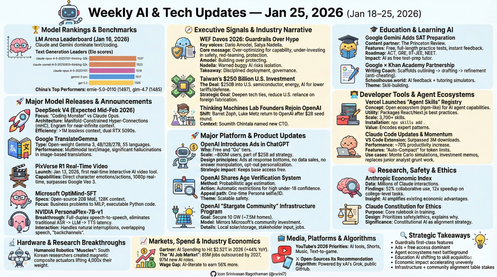
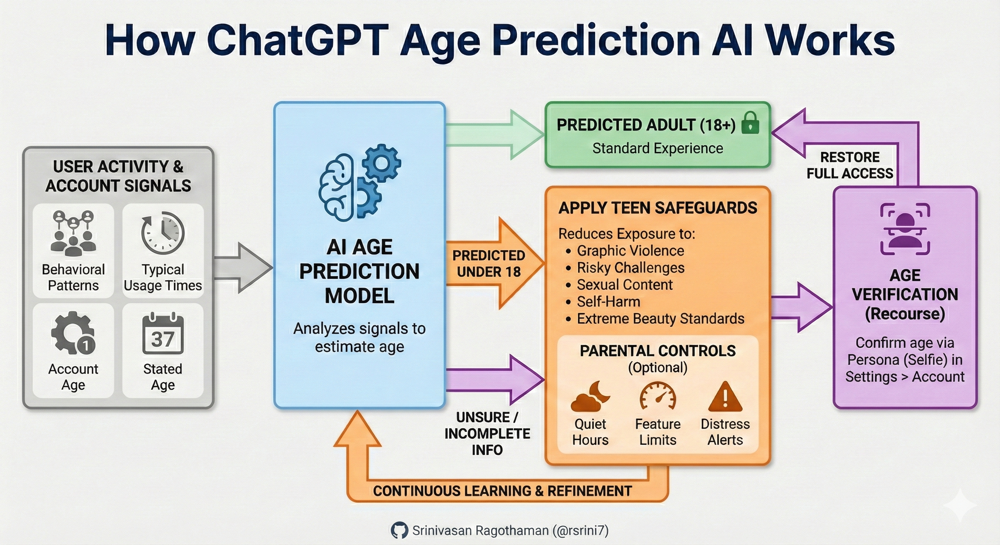

# Weekly AI & Tech Updates — **Jan 25, 2026** 
*(Jan 18–25, 2026)*



---
## 🏆 Model Rankings & Benchmarks
### LM Arena Leaderboard (Jan 16, 2026)
**Claude** and **Gemini** dominate the top of the crowd-sourced rankings for text and coding tasks.
* **Text Generation Leaders** (Elo scores):
  * **claude-opus-4-5-20251101-thinking-32k**: 1537
  * **claude-sonnet-4-5-20250929-thinking-32k**: 1523
  * **claude-opus-4-5-20251101**: 1519
  * **gemini-3-pro**: 1517
  * **gpt-5.2**: 1505
* **China's Top Performers**: **ernie-5.0-0110** (1497) and **glm-4.7** (1485) are currently the highest-ranking models from the region.

---
## 🚀 Major Model Releases & Announcements
### DeepSeek V4 (Expected Mid-Feb 2026)
* **Focus**: A specialized "Coding Monster" designed to reclaim the top spot from Claude Opus.
* **Architecture**: Expected to feature **Manifold-Constrained Hyper-Connections (mHC)** and the **Engram** conditional memory system for near-infinite context retrieval.
* **Efficiency**: Rumored to exceed 1 million lossless context tokens while being runnable on consumer-grade hardware like dual RTX 5090s.

### Google TranslateGemma
* **Type**: Open-weight LLM built on Gemma 3 architecture.
* **Specs**: Available in 4B, 12B, and 27B parameter versions supporting 55 languages.
* **Performance**: Features multimodal text and image translation, though initial reports note significant hallucinations in image-based translations.

### PixVerse R1 Real-Time Video
* **Launch**: Released Jan 13, 2026, as the first real-time interactive AI video tool.
* **Capabilities**: Allows users to direct character emotions and actions in 1080p resolution in real-time, currently surpassing Google’s Veo 3 in image-to-video benchmarks.

### Microsoft OptiMind-SFT
* **Specs**: Open-source 20B parameter MoE model with a 128K context window.
* **Focus**: Specialized in converting complex business problems into formal **Mixed Integer Linear Programs (MILP)** and executable Python code.

### NVIDIA PersonaPlex-7B-v1
* **Breakthrough**: A full-duplex speech-to-speech model that eliminates the latency of traditional ASR → LLM → TTS cascades.
* **Interaction**: Handles natural interruptions, overlapping speech, and "backchannels" like a human conversationalist.

---
## 🧭 Executive Signals & Industry Narrative
### WEF Davos 2026: Guardrails Over Hype
**Key voices**: Dario Amodei (Anthropic CEO), Satya Nadella (Microsoft CEO)
* **Core message**: The industry is over-optimizing for capability and under-investing in **safety, red-teaming, protection, and distribution controls**.
* **Amodei**: Most companies prioritize *building* AI over *protecting* it.
* **Nadella**: Challenged the industry to move past hype and ensure tools do not remain "locked" within tech giants; warned that buggy AI risks becoming isolated inside big tech.
* **Takeaway**: Shift toward disciplined deployment, governance, and real-world safeguards.

### Taiwan’s $250 Billion U.S. Investment
* **The Deal**: Taiwan will invest $250 billion into U.S. semiconductor, energy, and AI production in exchange for lower tariffs and increased defense tech cooperation.
* **Strategic Goal**: Deepen tech ties and reduce U.S. reliance on foreign chip fabrication amid ongoing tensions.

### Thinking Machines Lab Founders Rejoin OpenAI
* **Shift**: Barret Zoph and Luke Metz have left Mira Murati's $12B startup to return to OpenAI.
* **Context**: The departures come shortly after a $2B seed round; Soumith Chintala has been named as the new CTO.

---
## 🚀 Major Platform & Product Updates
### OpenAI Introduces Ads in ChatGPT
* **Who**: Free and $8/mo "Go" tiers (US adult users)
* **Scale**: Targets ~800M users; part of a projected **$25B ad strategy**
* **Design principles**:
  * Ads only at response bottoms
  * No data sales, no answer manipulation
  * Opt-out personalization
  * No ads for minors, politics, or health topics
* **Strategic impact**: Keeps base access free while funding compute expansion.

### OpenAI Shares Age Verification System
* **Method**: Probabilistic age estimation using account age, login times, and chat patterns
* **Action**: High under-18 confidence → automatic safety restrictions
* **Appeal path**: One-time Persona selfie/ID verification to restore access
* **Theme**: Scalable safety enforcement without mandatory ID for all users.



### OpenAI “Stargate Community” Infrastructure Program
* **Goal**: Secure 10 GW of data-center power (~7.5M homes equivalent)
* **Model**: Mirrors Microsoft’s community investment approach
* **Details**:
  * Local solar & storage funding (e.g., Texas rollout)
  * Local stakeholder input
  * Thousands of high-tech jobs + startup funding
* **Why it matters**: AI infrastructure combined with political and community alignment.

---
## 🎓 Education & Learning AI
### Google Gemini Adds SAT Preparation
* **Content partner**: The Princeton Review
* **Features**:
  * Free, full-length SAT practice tests (2h 14m timed mode)
  * Instant feedback on every question
  * Available directly in the Gemini app
* **Roadmap**: ACT, GRE, IIT-JEE, NEET hinted
* **Impact**: AI as a free, scalable test-prep tutor.

### Google × Khan Academy Partnership
* **Writing Coach**: Gemini scaffolds outlining → drafting → refinement (anti-cheating focus)
* **Schoolhouse.world**: AI feedback + tutoring simulators
* **Teachers**: Automated comprehension checks & feedback
* **Theme**: Skill-building over shortcutting.

---
## 👩‍💻 Developer Tools & Agent Ecosystems
### Vercel Launches “Agent Skills” / “Skills” Registry
* **Concept**: Open ecosystem (npm-like registry) for AI agent capabilities
* **Utility**: Packages 10+ years of React and Next.js best practices into installable modules
* **Scale**: 3,700+ skills with leaderboard by installs
* **Installation**:
  ```bash
  npx skills add <skill-name>
  # Example: npx skills add vercel-labs/agent-skills
  ```
* **Value**: Encodes expert patterns for agents; emerging as the next developer battleground.

### Claude Code Updates & Momentum
* **VS Code Extension**: Released Jan 20th; already surpassed 3 million downloads
* **Performance**: Internal Anthropic data shows ~70% engineer productivity increase
* **Features**: Includes "Auto-Compact" to manage token limits in long sessions
* **Wall Street view**: “ChatGPT moment” for coding
* **Use cases**:
  * Monte Carlo simulations
  * Investment memos & due diligence
  * Replaces junior analyst grunt work
* **Impact**: Non-technical users rapidly adopting advanced workflows.

---
## 🧠 Research, Safety & Ethics
### Anthropic Economic Index
* **Data**: Millions of real Claude interactions (late 2025)
* **Findings**:
  * **52%** shift to collaborative “thinking partner” usage
  * **12× speedup** on college-level tasks
  * +1% GDP per capita → **+0.7% Claude adoption**
* **Insight**: AI amplifies existing economic advantages.

### Claude Constitution for Ethics
* **Purpose**: Core rulebook embedded during training
* **Design**:
  * Prioritizes safety & ethics over task compliance
  * Explains *why* rules exist (reasoning > rigid policy)
* **Significance**: Constitutional AI as a durable alignment strategy.

### Claude Health App Integrations
* **User-controlled** health data access (labs, fitness, etc.)
* **Capabilities**:
  * Plain-English summaries of medical data
  * Appointment question generation
* **Theme**: Personal AI as an interpreter, not a doctor.

---
## 🔬 Hardware & Research Breakthroughs
### Humanoid Robotics "Muscles"
* **Innovation**: South Korean researchers created magnetic composite actuators capable of lifting **4,000 times** their own weight.
* **Comparison**: Achieve 86.4% strain, over double the performance of human biological muscle.

---
## 📈 Markets, Spend & Industry Economics
### Gartner: AI Spending to Hit $2.52T in 2026
* **Growth**: +44% YoY
* **Breakdown**:
  * AI-optimized servers: +49% (17% of total spend)
  * $401B into physical AI infrastructure
* **Narrative**: Shift from pilots → ROI-driven scaling
* **Caution**: Entering the “trough of disillusionment.”

### The "AI Job Market"
* **Microsoft Research Predictions**: 85 million jobs outsourced to AI globally by 2027, but **97 million** new AI-related roles will emerge.
* **Wage Gap**: By 2027, workers with AI literacy expected to earn **56% more** than those without.
* **Current Reality**: Tech layoffs continue, with 6,702 individuals impacted in the first three weeks of 2026.

---
## 📺 Media, Platforms & Algorithms
### YouTube’s 2026 Priorities
* **Vision**: CEO Neal Mohan highlighted AI tools like **Veo 3** and creator "likeness" cloning
* **Focus areas**:
  * Shorts (200B daily views)
  * Music, live, podcasts
  * Text-to-game generation
* **Safety**: Enhanced "age-proof" feeds and stronger parental controls
* **Monetization**: Expanding beyond ads into creator-economy tools.

### X Open-Sources Its Recommendation Algorithm (Jan 20, 2026)
* **Powered by**: xAI’s Grok
* **What’s new**:
  * Public GitHub repo with 4-week update cadence
  * Rust/Python ML stack
* **Why it matters**: Increased transparency, auditability, and trust in ranking systems.

---
## 🔎 Strategic Takeaways
* **Guardrails are now first-class features**, not afterthoughts.
* **Ads + free access** is emerging as the dominant consumer AI model.
* **Agent ecosystems** (skills registries, MCP) are the next developer battleground.
* **Education AI** is shifting from quick answers → structured skill acquisition.
* **Economic impact** is accelerating unevenly, favoring AI-literate regions and workers.
* **Infrastructure + community alignment** is becoming table stakes for large-scale AI deployment.