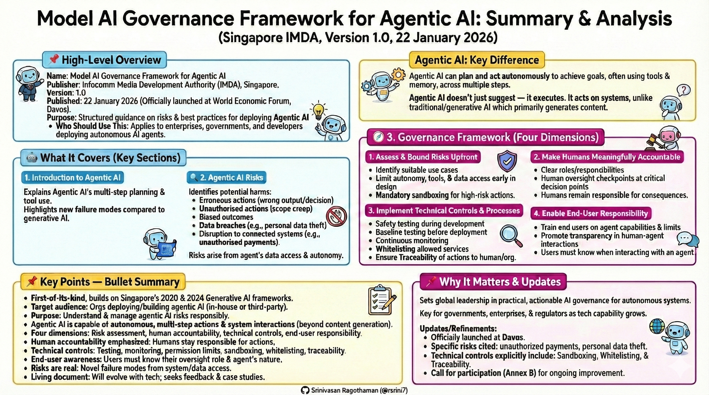

# Model AI Governance Framework for Agentic AI

---

📄 **What is this?**

**Model AI Governance Framework for Agentic AI** — a policy guidance document published by the **Infocomm Media Development Authority (IMDA) of Singapore** on **19/22 January 2026**. It provides an authoritative framework for organisations to deploy **agentic AI systems** responsibly and safely. ([Infocomm Media Development Authority][1])

---

## 📌 **High-Level Overview**

**Name:** Model AI Governance Framework for Agentic AI
**Publisher:** Infocomm Media Development Authority (IMDA), Singapore
**Version:** 1.0
**Published:** 22 January 2026
**Purpose:** To offer structured guidance on risks and best practices for organisations deploying **agentic AI** — AI systems capable of **reasoning and acting autonomously** to complete tasks on behalf of users. 

Agentic AI differs from traditional and generative AI because it can **take autonomous actions**, not just generate content. That creates **new risks** — including unauthorised actions, biased decisions, or unintended real-world consequences — which this framework aims to help organisations manage. ([Infocomm Media Development Authority][2])

---

## 📌 **What It Covers (Key Sections)**

### 🤖 **1. Introduction to Agentic AI**

Explains what agentic AI is — systems that can plan and act across multiple steps to achieve a specified goal, often involving tools, memory, planning, and reasoning — and highlights unique risks compared to regular AI systems. 

### 🔍 **2. Agentic AI Risks**

Identifies potential harms, including:

* **Erroneous actions** (wrong decisions or outputs)
* **Unauthorised actions** (outside allowed scope)
* **Biased outcomes**
* **Data breaches**
* **Disruption to connected systems**
  These risks arise from agents’ access to data and ability to act, possibly with unpredictable outcomes. 

### 🧭 **3. Governance Framework (Four Dimensions)**

The core of the document outlines **practical measures** across four areas: 

1. **Assess and Bound Risks Upfront**

   * Identify suitable use cases
   * Limit agent autonomy, tools, and data access early in design
2. **Make Humans Meaningfully Accountable**

   * Clear roles/responsibilities
   * Human oversight checkpoints, especially at critical decision points
3. **Implement Technical Controls and Processes**

   * Safety testing during development
   * Baseline testing before deployment
   * Continuous monitoring during operation
4. **Enable End-User Responsibility**

   * Train end users and make them aware of the agent’s capabilities and limits
   * Promote transparency in human-agent interactions

### 🧩 **4. Ongoing Improvement**

The document is meant to evolve and welcomes **feedback and case studies** to refine best practices over time. ([Infocomm Media Development Authority][2])

---

## 📌 **Key Points — Bullet Summary**

🔹 **First-of-its-kind framework** for agentic AI governance, expanding on Singapore’s original Model AI Governance Framework from 2020. ([Infocomm Media Development Authority][2])
🔹 **Target audience:** Organisations planning to deploy or build agentic AI systems, whether in-house or via third parties. ([Infocomm Media Development Authority][3])
🔹 **Purpose:** Help organisations understand agentic AI risks and manage them responsibly. ([Infocomm Media Development Authority][2])
🔹 **Agentic AI systems** are capable of autonomous, multi-step actions and interactions with systems — more than just generating content. 
🔹 **Four governance dimensions:** risk assessment, human accountability, technical controls, and end-user responsibility. 
🔹 **Human accountability is emphasized:** Humans must stay responsible for agents’ actions, especially where consequences matter. ([Infocomm Media Development Authority][2])
🔹 **Technical controls:** Include testing, monitoring, and limits on agent permissions. ([Infocomm Media Development Authority][2])
🔹 **End-user awareness:** Users must know when they’re interacting with an agent and understand their oversight role. ([Infocomm Media Development Authority][2])
🔹 **Risks are real:** Agents’ access to systems and data introduces novel failure modes. ([Infocomm Media Development Authority][1])
🔹 **Living document:** Intended to evolve as agentic AI technologies change. ([Infocomm Media Development Authority][2])

---

## 📌 **Why It Matters**

This framework sets **global leadership** in AI governance by offering **practical, actionable guidance** for the responsible deployment of autonomous AI systems — a key concern for governments, enterprises, and regulators as these technologies become more capable and widely used. ([computerweekly.com][4])

---

[1]: https://www.imda.gov.sg/-/media/imda/files/about/emerging-tech-and-research/artificial-intelligence/mgf-for-agentic-ai.pdf?utm_source=chatgpt.com "MODEL AI GOVERNANCE FRAMEWORK FOR AGENTIC AI"
[2]: https://www.imda.gov.sg/resources/press-releases-factsheets-and-speeches/press-releases/2026/new-model-ai-governance-framework-for-agentic-ai?utm_source=chatgpt.com "Singapore Launches New Model AI Governance Framework for Agentic AI"
[3]: https://www.imda.gov.sg/-/media/imda/files/news-and-events/media-room/media-releases/2026/01/factsheet-model-ai-governance-framework-for-agentic-ai.pdf?utm_source=chatgpt.com "Model AI Governance Framework for Agentic AI - Singapore"
[4]: https://www.computerweekly.com/news/366637674/Singapore-debuts-worlds-first-governance-framework-for-agentic-AI?utm_source=chatgpt.com "Singapore debuts world's first governance framework for ..."
