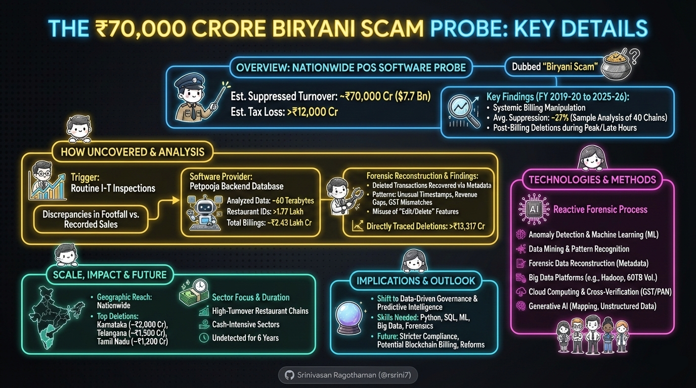

# Overview of the ₹70,000 Crore Suppressed Turnover Probe in Restaurant Billing

The investigation, colloquially known as the "Biryani Scam," involves a nationwide probe into the manipulation of Point-of-Sale (POS) software by restaurants across India. It centers on suppressed sales turnover estimated at approximately ₹70,000 crore (about $7.7 billion) over six financial years from 2019-20 to 2025-26, leading to an estimated tax loss of over ₹12,000 crore. The scam primarily entailed generating bills, collecting payments (often in cash), and then deleting or altering records in billing software to under-report revenue and evade taxes. Sample analysis of about 40 restaurants, including chains like Pista House, Shah Ghouse, and Mehfil, revealed an average suppression of 27% of actual sales, with deletions frequently occurring during peak hours or late at night.

Experts view this investigation as a landmark shift toward data-driven governance and the potential for future predictive intelligence in tax enforcement. As of February 23, 2026, the probe has expanded beyond Hyderabad to multiple states, with authorities examining whether similar patterns exist in other billing ecosystems. The investigation is now being led by the Central Board of Direct Taxes (CBDT) on a national scale, following the success of the Hyderabad unit's digital forensic lab at Ayakar Bhavan.

## How the Probe Was Uncovered

The probe originated from routine Income Tax (I-T) inspections at popular biryani outlets in Hyderabad and Visakhapatnam, where discrepancies between observed footfall and recorded sales were noted. This led to scrutiny of a common billing software, identified as Petpooja, prompting access to the provider's backend database.

Authorities analyzed around 60 terabytes of data from over 1.77 lakh restaurant IDs, covering total billings of about ₹2.43 lakh crore. Forensic tools reconstructed deleted transactions via metadata, revealing patterns like unusual deletion times, revenue gaps during busy periods, and mismatches with GST filings and digital payments.

The probe centers on the misuse of features within a popular billing software platform that allowed for post-billing deletions, controlling about 10% of the market. Directly traced deletions exceeded ₹13,317 crore, contributing to the overall suppressed turnover estimate.

## Technologies and Methods Used in the Investigation

Artificial Intelligence (AI) and Big Data analytics played key roles in the reactive forensic process. Key technologies included:

- **Anomaly Detection and Machine Learning (ML)**: Algorithms flagged irregular patterns, such as billing gaps and deletion behaviors.
- **Data Mining and Pattern Recognition**: Sifted through datasets to identify cross-state trends.
- **Forensic Data Reconstruction**: Recovered deleted records using metadata analysis.
- **Big Data Platforms**: Tools like Hadoop handled the 60 TB volume.
- **Cloud Computing and Cross-Verification**: Integrated with GST and PAN databases for validation.
- **Generative AI**: Used to map GST/PAN data and process unstructured billing metadata.

A multi-disciplinary team, including I-T officials, GST intelligence, cyber experts, engineers, and data scientists, collaborated using high-performance data processing systems and ETL pipelines.

## Scale and Impact of the Probe

- **Financial Scope**: Suppressed turnover of ₹70,000 crore, with tax losses (GST + income tax) estimated at ₹12,000-15,000 crore.
- **Geographic Reach**: Started in Hyderabad but covers multiple states, involving 1.77 lakh restaurants. Karnataka has the highest volume of deletions (approx. ₹2,000 crore), followed by Telangana (₹1,500 crore) and Tamil Nadu (₹1,200 crore).
- **Sector Focus**: Primarily high-turnover restaurant chains, but methods could apply to other cash-intensive sectors.
- **Duration**: Undetected for six years, exposing limitations in traditional audits.

Public discourse on X highlights demands for AI in governance, concerns over small business impacts, and suggestions for blockchain billing.

## Implications and Future Outlook

This case demonstrates AI's role in forensic fraud detection, addressing human oversight with data insights. It calls for skills in Python, SQL, ML, Big Data (e.g., Spark, Hadoop), cloud platforms, and forensics. For businesses, it urges stricter compliance, potentially with blockchain to curb tampering.

The probe continues, with possible raids and penalties ahead. It may drive reforms in tax enforcement, enhancing transparency in India's large and rapidly growing restaurant sector.

## Sources and References

This revised consolidation incorporates the latest reports as of February 23, 2026, from news articles and X discussions. Key sources include:

- News Outlets: Times of India, NDTV, India Today, Hindustan Times, WION, Gulf News, and others.
- X Posts: Recent discussions on the probe's details and implications.