# DeepSeek Engram: The Complete Guide to Conditional Memory for LLMs

**January 2026 | Open Source Release by DeepSeek-AI**

---

## 🎯 What You Need to Know in 120 Seconds

𝗗𝗲𝗲𝗽𝗦𝗲𝗲𝗸 𝗘𝗻𝗴𝗿𝗮𝗺: 𝗖𝗼𝗻𝗱𝗶𝘁𝗶𝗼𝗻𝗮𝗹 𝗠𝗲𝗺𝗼𝗿𝘆 𝗮𝘀 𝗮 𝗡𝗲𝘄 𝗦𝗽𝗮𝗿𝘀𝗶𝘁𝘆 𝗔𝘅𝗶𝘀

Why are modern LLMs still wasting **35-40% of compute** reconstructing the same basic patterns on every forward pass?

━━━━━━━━━━━━━━━━━━━━

⚡ **𝗧𝗵𝗲 𝗣𝗿𝗼𝗯𝗹𝗲𝗺: 𝗖𝗼𝗺𝗽𝘂𝘁𝗮𝘁𝗶𝗼𝗻𝗮𝗹 𝗪𝗮𝘀𝘁𝗲 𝗶𝗻 𝗧𝗿𝗮𝗻𝘀𝗳𝗼𝗿𝗺𝗲𝗿𝘀**

Transformers have no native lookup primitive. Common patterns — entity names, idioms, code snippets — that should be **O(1)** operations are instead simulated through **O(depth)** neural computation.

Consequences:
- **35-40% of total FLOPs** spent reconstructing static knowledge
- Reduced effective depth for actual reasoning
- Higher inference costs and latency in production fleets
- Diminished long-context performance as attention budget is consumed by local patterns

━━━━━━━━━━━━━━━━━━━━

📈 **𝗧𝗵𝗲 𝗦𝗼𝗹𝘂𝘁𝗶𝗼𝗻: 𝗗𝗲𝗲𝗽𝗦𝗲𝗲𝗸 𝗘𝗻𝗴𝗿𝗮𝗺**

DeepSeek-AI’s open-source (Apache-2.0) conditional memory module, released January 2026.

**𝗘𝗻𝗴𝗿𝗮𝗺** adds a parallel memory pathway that stores high-frequency n-gram patterns in massive embedding tables.

* **35-40% computational waste eliminated** → Equivalent to 30-40% more effective depth
* **O(1) lookup for static patterns** → Minimal inference overhead (<3%)
* **Fully complementary to MoE** → Optimal allocation ~75% MoE / 25% Engram under fixed parameter budget

━━━━━━━━━━━━━━━━━━━━

🔧 **𝗖𝗼𝗿𝗲 𝗔𝗿𝗰𝗵𝗶𝘁𝗲𝗰𝘁𝘂𝗿𝗲: 𝗛𝘆𝗯𝗿𝗶𝗱 𝗠𝗲𝗺𝗼𝗿𝘆-𝗖𝗼𝗺𝗽𝘂𝘁𝗲 𝗣𝗮𝘁𝗵𝘄𝗮𝘆𝘀**

1️⃣ **N-gram Extraction**: Overlapping 2-3 token sequences from recent context
2️⃣ **Tokenizer Compression**: NFKC + lowercase + vocab projection (~23% size reduction)
3️⃣ **Multi-Head Hashing**: 8 deterministic hashes per n-gram → collision-resistant addresses
4️⃣ **Embedding Lookup**: Retrieve from tables (billions of parameters, tiered VRAM/RAM)
5️⃣ **Context-Aware Gating**: RMSNorm + softmax dot-product decides integration strength

Placement: Early-to-mid layers (e.g., layers 2 & 15 in 32-layer models) for maximum pattern capture without disrupting late reasoning.

━━━━━━━━━━━━━━━━━━━━

🛒 **𝗖𝗼𝗿𝗲 𝗙𝗲𝗮𝘁𝘂𝗿𝗲𝘀: 𝗪𝗼𝗿𝗸𝗳𝗹𝗼𝘄 & 𝗖𝗮𝗽𝗮𝗯𝗶𝗹𝗶𝘁𝗶𝗲𝘀**

Engram operates in parallel with standard transformer blocks.

1. **Pattern Detection** (`2-3 grams`) → Hashes generated deterministically
2. **Hierarchical Retrieval** (`hot VRAM → warm RAM → cold`) → Async prefetch enabled by deterministic hashes
3. **Gated Fusion** (`softmax attention over memory keys`) → Only relevant vectors added via residual
4. **Optional Post-Processing** (`depthwise conv + SiLU`) → Refines memory contribution

Result: Static patterns handled outside expensive neural pathway; dynamic reasoning preserved.

━━━━━━━━━━━━━━━━━━━━

🛡️ **𝗕𝗲𝗻𝗲𝗳𝗶𝘁𝘀: 𝗦𝘆𝘀𝘁𝗲𝗺𝗶𝗰 𝗘𝗳𝗳𝗶𝗰𝗶𝗲𝗻𝗰𝘆 & 𝗣𝗲𝗿𝗳𝗼𝗿𝗺𝗮𝗻𝗰𝗲**

* **Effective Depth Expansion**: Frees neural capacity from pattern reconstruction → +5% on hard reasoning benchmarks (BBH)
* **Long-Context Preservation**: Local patterns offloaded → attention budget available for global dependencies → +12.8% needle-in-haystack (84% → 97%)
* **Parameter Efficiency at Scale**: Fixed budget yields higher performance than pure MoE → continued gains observed up to 18.5B memory tables
* **Hardware-Friendly Deployment**: Tables quantizable to 4-bit, offloadable to RAM → trillion-scale models viable on consumer clusters

━━━━━━━━━━━━━━━━━━━━

⚖️ **𝗦𝘁𝗿𝗮𝘁𝗲𝗴𝗶𝗰 𝗩𝗲𝗿𝗱𝗶𝗰𝘁: 𝗛𝘆𝗯𝗿𝗶𝗱 𝗠𝗲𝗺𝗼𝗿𝘆 𝘃𝘀. 𝗣𝘂𝗿𝗲 𝗖𝗼𝗺𝗽𝘂𝘁𝗲**

The market is splitting between pure conditional-compute scaling and hybrid memory-compute architectures.

**Pure MoE Approach (Mixtral, Grok, etc.)**
- Strength: Simpler training, mature routing, strong dynamic reasoning
- Risk: Persistent waste on static pattern reconstruction as models scale
- Best for: Workloads dominated by novel synthesis over factual recall

**Hybrid Memory-Compute (Engram + MoE)**
- Strength: Superior parameter utilization, dramatic long-context and reasoning gains
- Risk: Added engineering complexity (table sharding, prefetch, quantization pipeline)
- Best for: Production systems prioritizing efficiency and long-context reliability

**Current Reality**: Engram’s open-source release gives community models a structural advantage over closed proprietary stacks that lack equivalent memory primitives.

**Watch**: Integration velocity into major open model families (Llama-3.x, Mistral derivatives) by mid-2026. If >50% of top-10 Hugging Face models adopt conditional memory tables, hybrid becomes the default architecture.

━━━━━━━━━━━━━━━━━━━━

**𝗧𝗟;𝗗𝗥**
* **Structural Efficiency** → 35-40% waste elimination translates to 30+% effective capacity gain under fixed budgets
* **Complementary Scaling** → Optimal at ~25% parameter allocation; works synergistically with existing MoE stacks
* **Adoption Signal** → Open-source availability positions community models ahead of proprietary alternatives

**Will hybrid memory-compute architectures become the dominant scaling paradigm, or will pure conditional computation continue to prevail through brute-force parameter growth?**

👤 **Srinivasan Ragothaman (@rsrini7)**

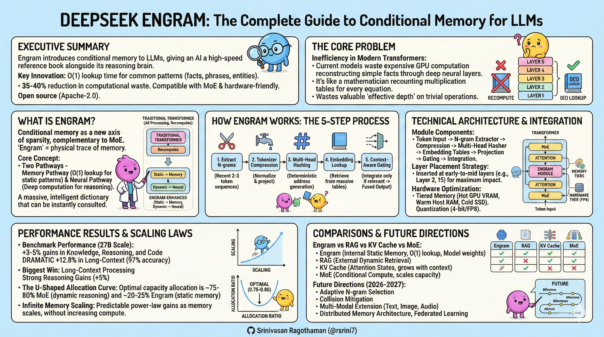

---

## Table of Contents
1. [Executive Summary](#executive-summary)
2. [The Core Problem](#the-core-problem)
3. [What is Engram?](#what-is-engram)
4. [How Engram Works](#how-engram-works)
5. [Technical Architecture](#technical-architecture)
6. [Performance Results](#performance-results)
7. [Comparisons with Other Techniques](#comparisons-with-other-techniques)
8. [Implementation Guide](#implementation-guide)
9. [Scaling Laws & Optimization](#scaling-laws--optimization)
10. [Future Directions](#future-directions)

---

## Executive Summary

**Engram** is a groundbreaking architectural innovation from DeepSeek that introduces **conditional memory** to large language models. Think of it as giving an AI model a high-speed reference book alongside its reasoning brain.

### Key Innovation
- **O(1) lookup time** for common patterns (facts, phrases, entities)
- **35-40% reduction** in computational waste
- **Compatible with existing techniques** like Mixture-of-Experts (MoE)
- **Hardware-friendly** - can offload memory tables to system RAM
- **Open source** under Apache-2.0 license

### Why It Matters
Current transformer models waste expensive GPU computation reconstructing simple facts like "Paris is the capital of France" through deep neural layers—every single time. Engram solves this by storing these patterns in a fast lookup table, freeing the neural network to focus on actual reasoning.

---

## The Core Problem

### The Inefficiency in Modern Transformers

Imagine you're a brilliant mathematician who has to recount your multiplication tables before solving every complex equation. That's essentially what current LLMs do.

**Example: Processing "Diana, Princess of Wales"**

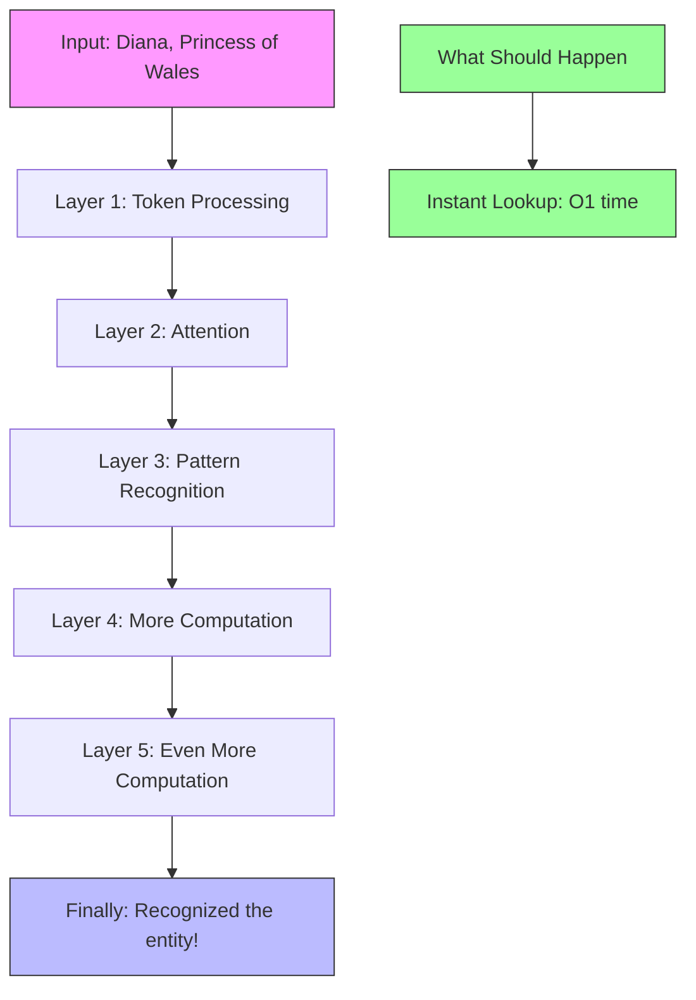
```mermaid
graph TD
    A[Input: Diana, Princess of Wales] --> B[Layer 1: Token Processing]
    B --> C[Layer 2: Attention]
    C --> D[Layer 3: Pattern Recognition]
    D --> E[Layer 4: More Computation]
    E --> F[Layer 5: Even More Computation]
    F --> G[Finally: Recognized the entity!]
    
    style A fill:#f9f,stroke:#333
    style G fill:#bbf,stroke:#333
    
    H[What Should Happen] --> I[Instant Lookup: O1 time]
    
    style H fill:#9f9,stroke:#333
    style I fill:#9f9,stroke:#333
```

**The Problem:**
- Transformers lack a **native knowledge lookup** primitive
- Tasks that should take **O(1) time** (constant time lookup) are simulated through **O(layer_depth)** computation
- This wastes valuable "effective depth" on trivial operations
- It's like using a calculator to remember your phone number rather than just looking it up

### Real-World Impact
- **Millions of wasted operations** per day in production systems
- **Higher infrastructure costs** from unnecessary GPU usage
- **Reduced model capacity** for actual reasoning tasks
- **35-40% of computation** spent on pattern reconstruction

---

## What is Engram?

Engram introduces **conditional memory** as a new axis of sparsity, complementary to the conditional computation provided by MoE.

### The Name
"Engram" comes from neuroscience—it refers to the physical trace of memory in the brain. Similarly, this module stores memory traces (patterns) that the model can instantly recall.

### Core Concept

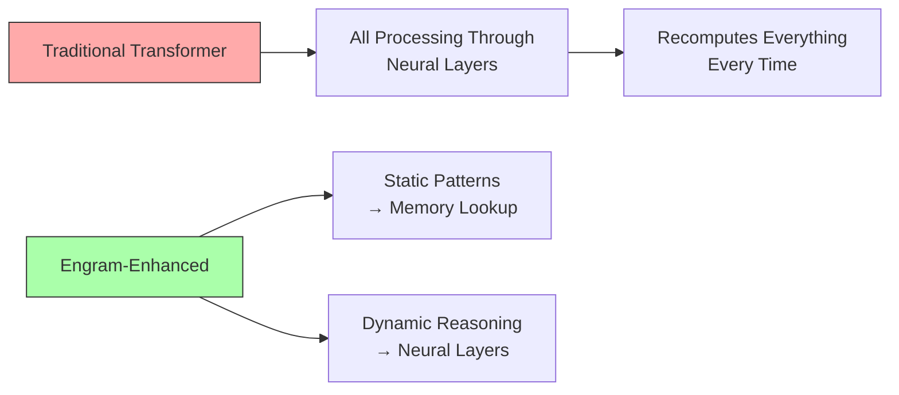
```mermaid
graph LR
    A[Traditional Transformer] --> B[All Processing Through<br/>Neural Layers]
    B --> C[Recomputes Everything<br/>Every Time]
    
    D[Engram-Enhanced] --> E[Static Patterns<br/>→ Memory Lookup]
    D --> F[Dynamic Reasoning<br/>→ Neural Layers]
    
    style A fill:#faa,stroke:#333
    style D fill:#afa,stroke:#333
```

**Two Pathways:**
1. **Memory Pathway** - O(1) lookup for static patterns (facts, common phrases)
2. **Neural Pathway** - Deep computation for reasoning and context understanding

---

## How Engram Works

### Simple Explanation

Think of Engram as a massive, intelligent dictionary that the AI can consult instantly:

1. **See tokens** → "Alexander the Great"
2. **Hash the pattern** → Generate a unique address
3. **Look up in memory table** → Retrieve pre-computed representation
4. **Check if relevant** → Gate mechanism validates against current context
5. **Integrate or skip** → Add to processing only if helpful

### The Five-Step Process

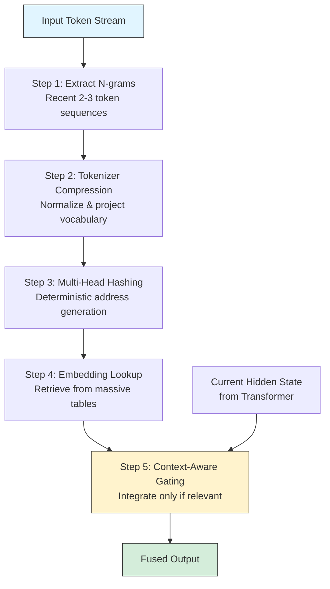
```mermaid
flowchart TD
    A[Input Token Stream] --> B[Step 1: Extract N-grams<br/>Recent 2-3 token sequences]
    B --> C[Step 2: Tokenizer Compression<br/>Normalize & project vocabulary]
    C --> D[Step 3: Multi-Head Hashing<br/>Deterministic address generation]
    D --> E[Step 4: Embedding Lookup<br/>Retrieve from massive tables]
    E --> F[Step 5: Context-Aware Gating<br/>Integrate only if relevant]
    F --> G[Fused Output]
    
    H[Current Hidden State<br/>from Transformer] --> F
    
    style A fill:#e1f5ff,stroke:#333
    style G fill:#d4edda,stroke:#333
    style F fill:#fff3cd,stroke:#333
```

### Detailed Flow

#### Step 1: N-gram Extraction
Extract overlapping token sequences from the recent context:
- **2-grams**: ["Diana, Princess"], ["Princess of"], ["of Wales"]
- **3-grams**: ["Diana, Princess of"], ["Princess of Wales"]

#### Step 2: Tokenizer Compression
Normalize tokens to create semantic density:
- **NFKC normalization** - Standardize character representations
- **Lowercase conversion** - "Apple" and "apple" → same pattern
- **Vocabulary projection** - Reduces vocabulary size by ~23%

#### Step 3: Multi-Head Hashing
Use deterministic hash functions to generate memory addresses:
- **K heads per n-gram** (typically 8 heads)
- **Multiplicative-XOR hashing** for collision resistance
- **Prime-sized tables** for better distribution

```python
# Simplified hashing example
def hash_ngram(tokens, head_idx, table_size):
    hash_value = 0
    for token in tokens:
        hash_value = (hash_value * PRIME + token) ^ head_idx
    return hash_value % table_size
```

#### Step 4: Embedding Lookup
Retrieve pre-computed vectors from massive embedding tables:
- Tables can contain **billions of entries**
- Stored in **hierarchical memory** (GPU VRAM for hot entries, system RAM for cold)
- <3% inference slowdown even with 100B+ parameters

#### Step 5: Context-Aware Gating

This is the "conditional" in conditional memory:

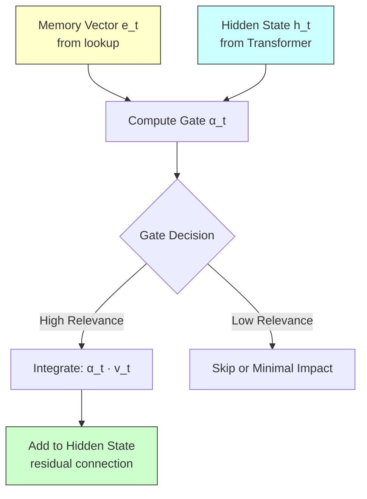
```mermaid
graph TD
    A[Memory Vector e_t<br/>from lookup] --> C[Compute Gate α_t]
    B[Hidden State h_t<br/>from Transformer] --> C
    C --> D{Gate Decision}
    D -->|High Relevance| E[Integrate: α_t · v_t]
    D -->|Low Relevance| F[Skip or Minimal Impact]
    E --> G[Add to Hidden State<br/>residual connection]
    
    style A fill:#ffc,stroke:#333
    style B fill:#cff,stroke:#333
    style G fill:#cfc,stroke:#333
```

**Gate Calculation:**
```python
# Pseudocode
gate_alpha = softmax(
    dot_product(
        RMSNorm(hidden_state),
        RMSNorm(memory_key)
    ) / sqrt(dim)
)

output = gate_alpha * memory_value + hidden_state
```

---

## Technical Architecture

### Module Components

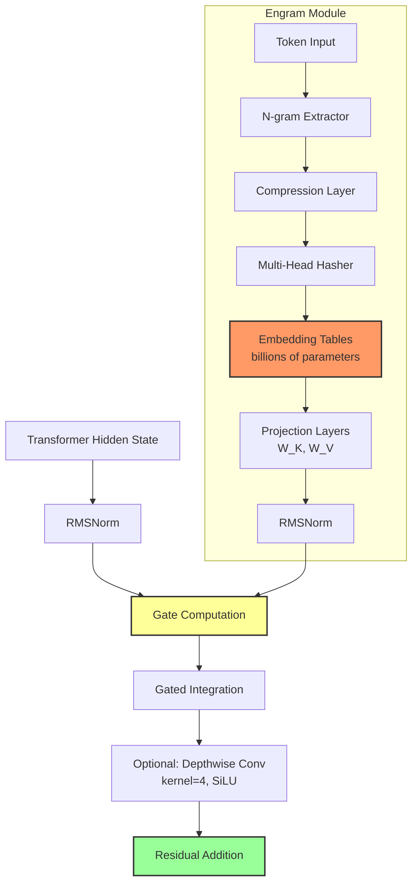
```mermaid
graph TB
    subgraph "Engram Module"
        A[Token Input] --> B[N-gram Extractor]
        B --> C[Compression Layer]
        C --> D[Multi-Head Hasher]
        D --> E[Embedding Tables<br/>billions of parameters]
        E --> F[Projection Layers<br/>W_K, W_V]
        F --> G[RMSNorm]
    end
    
    H[Transformer Hidden State] --> I[RMSNorm]
    I --> J[Gate Computation]
    G --> J
    J --> K[Gated Integration]
    K --> L[Optional: Depthwise Conv<br/>kernel=4, SiLU]
    L --> M[Residual Addition]
    
    style E fill:#f96,stroke:#333,stroke-width:2px
    style J fill:#ff9,stroke:#333,stroke-width:2px
    style M fill:#9f9,stroke:#333,stroke-width:2px
```

### Integration into Transformer

**Layer Placement Strategy:**
Engram modules are inserted at **early-to-mid layers** for maximum impact:

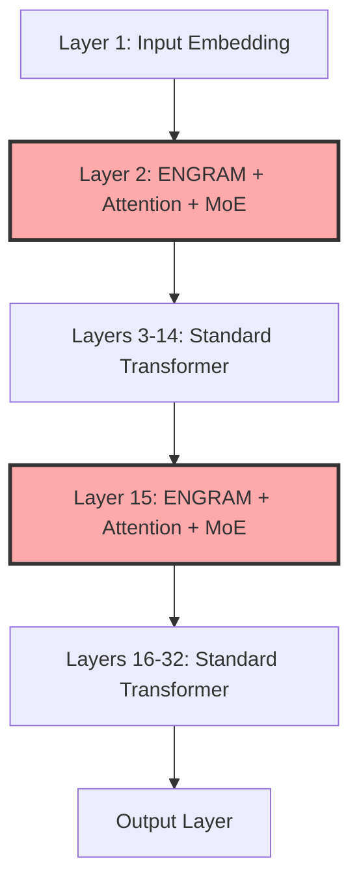
```mermaid
graph TD
    A[Layer 1: Input Embedding] --> B[Layer 2: ENGRAM + Attention + MoE]
    B --> C[Layers 3-14: Standard Transformer]
    C --> D[Layer 15: ENGRAM + Attention + MoE]
    D --> E[Layers 16-32: Standard Transformer]
    E --> F[Output Layer]
    
    style B fill:#faa,stroke:#333,stroke-width:3px
    style D fill:#faa,stroke:#333,stroke-width:3px
```

**Why Early-to-Mid Layers?**
- **Early layers**: Capture local, stereotypical patterns before they consume deep computation
- **Mid layers**: Better global context for gating decisions
- **Not late layers**: Would interfere with final reasoning and generation

### Example Configuration (27B Model)

```python
class TransformerBlockWithEngram:
    # Standard components
    attention: MultiHeadAttention
    moe: MixtureOfExperts  # 55 routed experts
    
    # Engram components
    engram: EngramMemory(
        table_size=5.7B,      # 5.7 billion parameters
        ngram_range=(2, 3),   # 2-grams and 3-grams
        num_heads=8,          # 8 hash heads per n-gram
        embedding_dim=1280,   # Hidden dimension
        layers=[2, 15]        # Insert at layers 2 and 15
    )
    
    gate: GatingMechanism
```

### Hardware Optimization

**Tiered Memory Architecture:**

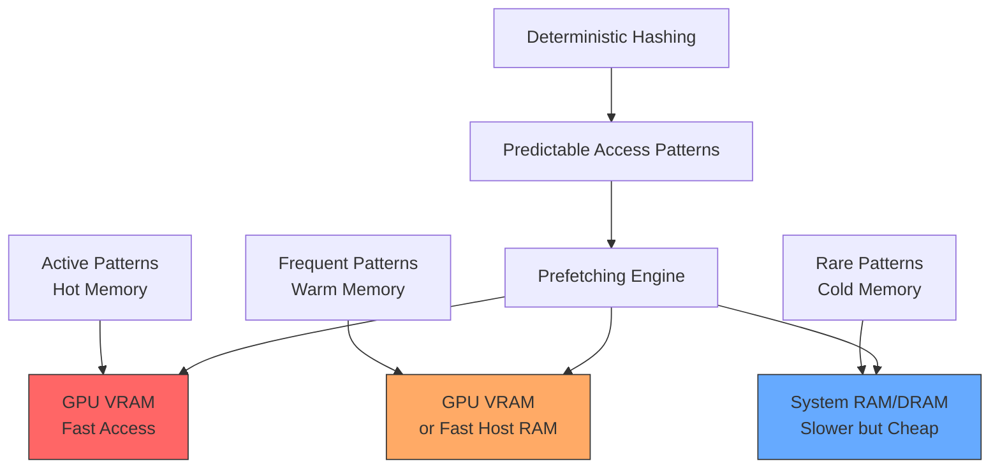
```mermaid
graph TD
    A[Active Patterns<br/>Hot Memory] --> B[GPU VRAM<br/>Fast Access]
    C[Frequent Patterns<br/>Warm Memory] --> D[GPU VRAM<br/>or Fast Host RAM]
    E[Rare Patterns<br/>Cold Memory] --> F[System RAM/DRAM<br/>Slower but Cheap]
    
    G[Deterministic Hashing] --> H[Predictable Access Patterns]
    H --> I[Prefetching Engine]
    I --> B
    I --> D
    I --> F
    
    style B fill:#f66,stroke:#333
    style D fill:#fa6,stroke:#333
    style F fill:#6af,stroke:#333
```

**Key Optimizations:**
1. **Async Prefetching** - Hash addresses are deterministic, enabling advance loading
2. **Sharding** - Distribute tables across multiple GPUs using All-to-All communication
3. **Quantization** - Use 4-bit or FP8 for memory tables with minimal accuracy loss
4. **LRU Eviction** - Keep frequently accessed patterns in fast memory

---

## Performance Results

### Benchmark Performance (27B Model Scale)

**Test Setup:**
- **Base Model**: MoE-27B (72 experts, 26.7B total parameters)
- **Engram Model**: Engram-27B (55 experts + 5.7B Engram memory, 26.7B total)
- **Training**: 262B tokens, identical computational budget
- **Comparison**: Iso-parameter and iso-FLOPs (strictly fair comparison)

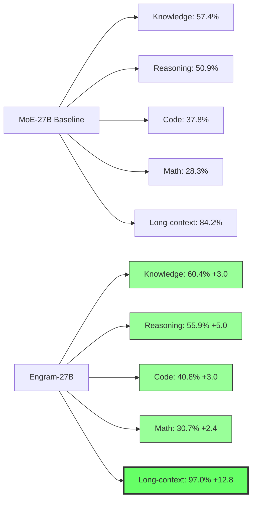
```mermaid
graph LR
    A[MoE-27B Baseline] --> B[Knowledge: 57.4%]
    A --> C[Reasoning: 50.9%]
    A --> D[Code: 37.8%]
    A --> E[Math: 28.3%]
    A --> F[Long-context: 84.2%]
    
    G[Engram-27B] --> H[Knowledge: 60.4% +3.0]
    G --> I[Reasoning: 55.9% +5.0]
    G --> J[Code: 40.8% +3.0]
    G --> K[Math: 30.7% +2.4]
    G --> L[Long-context: 97.0% +12.8]
    
    style H fill:#9f9,stroke:#333
    style I fill:#9f9,stroke:#333
    style J fill:#9f9,stroke:#333
    style K fill:#9f9,stroke:#333
    style L fill:#6f6,stroke:#333,stroke-width:3px
```

### Detailed Results Table

| Benchmark Category | Task | MoE-27B | Engram-27B | Improvement | Why? |
|--------------------|------|---------|------------|-------------|------|
| **Knowledge** | MMLU (general) | 57.4 | 60.4 | **+3.0** | Better factual recall |
| **Knowledge** | CMMLU (Chinese) | 57.9 | 61.9 | **+4.0** | Efficient multilingual patterns |
| **Reasoning** | BBH (hard reasoning) | 50.9 | 55.9 | **+5.0** | More depth for reasoning |
| **Reasoning** | ARC-Challenge | ~70% | ~74% | **+4.0** | Complex multi-step problems |
| **Code** | HumanEval | 37.8 | 40.8 | **+3.0** | API/idiom pattern recognition |
| **Code** | MBPP | Similar | Similar | **+2-3%** | Standard coding patterns |
| **Math** | MATH benchmark | 28.3 | 30.7 | **+2.4** | Formula/theorem recall |
| **Long Context** | Needle-in-Haystack | 84.2 | 97.0 | **+12.8** | Dramatic! Best result |

### Key Observations

**Biggest Win: Long-Context Processing**
- Achievement of 97% accuracy on needle-in-haystack tests demonstrates Engram's ability to preserve attention for global dependencies
- Memory handles local patterns → attention focuses on long-range relationships
- **84% → 97%** is a game-changing improvement

**Strong Reasoning Gains**
- +5% on Big-Bench Hard shows the model has more "effective depth"
- Early layers freed from pattern reconstruction
- More capacity for complex, multi-hop reasoning

**Knowledge Tasks**
- +3-4% improvements show better factual recall
- But reasoning improved MORE than knowledge (counterintuitive!)
- Suggests Engram's main benefit is computational efficiency, not just memory storage

### Scaling Experiments

**Engram-40B Configuration:**
- Same backbone as 27B
- **18.5B Engram memory** (vs 5.7B in 27B)
- Shows continued improvement as memory scales
- Training curves suggest **memory not yet saturated** at 262B tokens

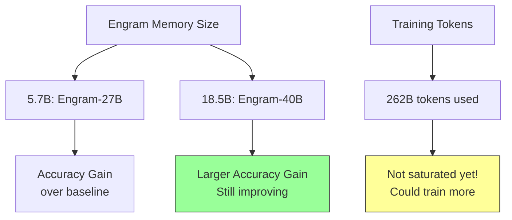
```mermaid
graph TD
    A[Engram Memory Size] --> B[5.7B: Engram-27B]
    A --> C[18.5B: Engram-40B]
    
    B --> D[Accuracy Gain<br/>over baseline]
    C --> E[Larger Accuracy Gain<br/>Still improving]
    
    F[Training Tokens] --> G[262B tokens used]
    G --> H[Not saturated yet!<br/>Could train more]
    
    style E fill:#9f9,stroke:#333
    style H fill:#ff9,stroke:#333
```

---

## Comparisons with Other Techniques

### Engram vs RAG vs KV Cache vs MoE

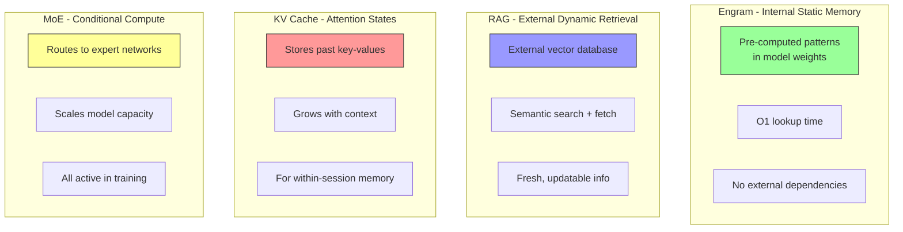
```mermaid
graph TB
    subgraph "Engram - Internal Static Memory"
        A1[Pre-computed patterns<br/>in model weights]
        A2[O1 lookup time]
        A3[No external dependencies]
    end
    
    subgraph "RAG - External Dynamic Retrieval"
        B1[External vector database]
        B2[Semantic search + fetch]
        B3[Fresh, updatable info]
    end
    
    subgraph "KV Cache - Attention States"
        C1[Stores past key-values]
        C2[Grows with context]
        C3[For within-session memory]
    end
    
    subgraph "MoE - Conditional Compute"
        D1[Routes to expert networks]
        D2[Scales model capacity]
        D3[All active in training]
    end
    
    style A1 fill:#9f9,stroke:#333
    style B1 fill:#99f,stroke:#333
    style C1 fill:#f99,stroke:#333
    style D1 fill:#ff9,stroke:#333
```

### Detailed Comparison Table

| Feature | Engram | RAG | KV Cache | Pure MoE |
|---------|--------|-----|----------|----------|
| **What it stores** | Static N-gram patterns | External documents | Past attention states | Expert parameters |
| **Lookup speed** | O(1) constant | O(search time) slow | O(context length) | O(routing time) |
| **Memory location** | Model weights + offload | External database | GPU memory | Model weights |
| **Training** | End-to-end integrated | Often post-hoc | Standard mechanism | End-to-end |
| **Updates** | Requires retraining | Easy to update | Auto-updates | Requires retraining |
| **Best for** | Common patterns/facts | Current/fresh info | Conversation context | Scaling capacity |
| **Overhead** | <3% inference | 100-500ms per query | Grows with context | Routing bottleneck |
| **Works offline** | ✅ Yes | ❌ No | ✅ Yes | ✅ Yes |
| **Context usage** | No tokens consumed | Consumes context window | Stores within context | No extra consumption |

### Synergy with Existing Techniques

**Engram + MoE (Used Together):**
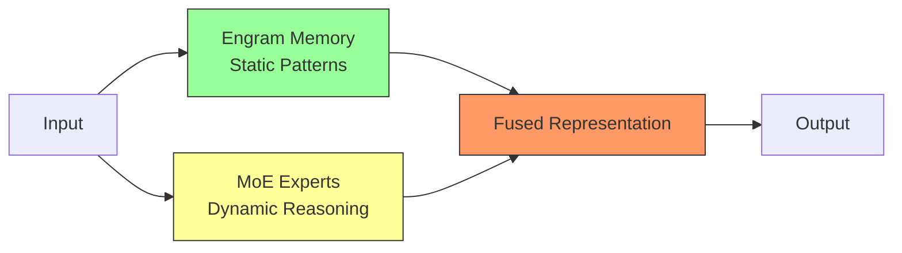
```mermaid
graph LR
    A[Input] --> B[Engram Memory<br/>Static Patterns]
    A --> C[MoE Experts<br/>Dynamic Reasoning]
    
    B --> D[Fused Representation]
    C --> D
    
    D --> E[Output]
    
    style B fill:#9f9,stroke:#333
    style C fill:#ff9,stroke:#333
    style D fill:#f96,stroke:#333
```

- **Complementary, not competitive**
- Engram handles facts/patterns → MoE handles reasoning
- Optimal allocation: **~75% MoE, ~25% Engram**

**Engram + Quantization:**
- Memory tables compress well with 4-bit/FP8 quantization
- Minimal accuracy loss (< 1%)
- Enables massive tables on limited hardware

**Engram + Flash Attention:**
- Memory retrieval happens in parallel with attention
- No additional latency
- Both optimize different parts of the computation

### When to Use Each Technique

| Use Case | Best Technique | Why? |
|----------|----------------|------|
| Need latest news/data | **RAG** | External sources, easy updates |
| Long conversations | **KV Cache** | Stores conversation history |
| Static knowledge + reasoning | **Engram** | Fast lookup, frees reasoning capacity |
| Scale model capacity | **MoE** | Conditional computation scaling |
| Multi-domain expertise | **MoE + Engram** | Best of both worlds |
| Memory-constrained hardware | **Engram** | Offload to system RAM |
| Fast inference required | **Engram** | O(1) lookup, minimal overhead |

---

## Implementation Guide

### Quick Start

```bash
# Clone the repository
git clone https://github.com/deepseek-ai/Engram
cd Engram

# Install dependencies
pip install torch transformers numpy sympy

# Run the demo
python engram_demo_v1.py
```

**Note:** The demo provides a simplified illustration focusing on Engram integration with mocked attention and MoE components.

### Integration Pattern

**Basic Integration:**

```python
import torch
import torch.nn as nn

class EngramMemory(nn.Module):
    def __init__(self, config):
        super().__init__()
        self.table_size = config.table_size
        self.ngram_range = config.ngram_range
        self.num_heads = config.num_heads
        self.embed_dim = config.embed_dim
        
        # Initialize embedding tables (sharded across GPUs in practice)
        self.embedding_tables = nn.ModuleList([
            nn.Embedding(table_size, embed_dim)
            for _ in range(sum(num_heads for n in ngram_range))
        ])
        
        # Projection layers
        self.W_K = nn.Linear(embed_dim, embed_dim)
        self.W_V = nn.Linear(embed_dim, embed_dim)
        
    def extract_ngrams(self, token_ids):
        """Extract overlapping n-grams from token sequence"""
        ngrams = []
        for n in self.ngram_range:
            for i in range(len(token_ids) - n + 1):
                ngrams.append(tuple(token_ids[i:i+n]))
        return ngrams
    
    def hash_ngrams(self, ngrams):
        """Multi-head hashing for each n-gram"""
        indices = []
        for ngram in ngrams:
            for head_idx in range(self.num_heads):
                hash_val = self._hash_function(ngram, head_idx)
                indices.append(hash_val % self.table_size)
        return torch.tensor(indices)
    
    def _hash_function(self, ngram, head_idx):
        """Deterministic multiplicative-XOR hash"""
        PRIME = 31
        hash_val = head_idx
        for token in ngram:
            hash_val = (hash_val * PRIME + token) ^ head_idx
        return hash_val
    
    def forward(self, token_ids, hidden_state):
        # Step 1: Extract n-grams
        ngrams = self.extract_ngrams(token_ids)
        
        # Step 2: Hash to get indices
        indices = self.hash_ngrams(ngrams)
        
        # Step 3: Lookup embeddings
        embeddings = []
        for idx, table in zip(indices, self.embedding_tables):
            embeddings.append(table(idx))
        
        # Step 4: Concatenate and project
        memory_vector = torch.cat(embeddings, dim=-1)
        memory_key = self.W_K(memory_vector)
        memory_value = self.W_V(memory_vector)
        
        # Step 5: Gating
        gate_alpha = torch.softmax(
            torch.matmul(
                F.normalize(hidden_state),
                F.normalize(memory_key).T
            ) / math.sqrt(self.embed_dim),
            dim=-1
        )
        
        # Step 6: Fused output
        output = gate_alpha * memory_value
        return output
```

**Complete Transformer Block with Engram:**

```python
class TransformerBlockWithEngram(nn.Module):
    def __init__(self, config):
        super().__init__()
        
        # Standard components
        self.attention = MultiHeadAttention(config)
        self.moe = MixtureOfExperts(config)
        self.norm1 = RMSNorm(config.hidden_size)
        self.norm2 = RMSNorm(config.hidden_size)
        
        # Engram module (only in specific layers)
        if config.layer_idx in config.engram_layers:
            self.engram = EngramMemory(config)
            self.has_engram = True
        else:
            self.has_engram = False
    
    def forward(self, hidden_states, token_ids):
        # Attention pathway
        attn_output = self.attention(self.norm1(hidden_states))
        hidden_states = hidden_states + attn_output
        
        # Engram pathway (if applicable)
        if self.has_engram:
            engram_output = self.engram(token_ids, hidden_states)
            hidden_states = hidden_states + engram_output
        
        # MoE pathway
        moe_output = self.moe(self.norm2(hidden_states))
        hidden_states = hidden_states + moe_output
        
        return hidden_states
```

### Memory Table Management

**Training Phase:**

```python
class EngramTraining:
    def __init__(self):
        self.frequency_counter = defaultdict(int)
        self.threshold = 100  # Add pattern after 100 occurrences
    
    def update_frequency(self, ngrams):
        """Track n-gram frequencies during training"""
        for ngram in ngrams:
            self.frequency_counter[ngram] += 1
    
    def should_add_pattern(self, ngram):
        """Decide if pattern should be added to memory"""
        return self.frequency_counter[ngram] >= self.threshold
    
    def expand_table(self, new_patterns):
        """Dynamically add new memory entries"""
        # Add new rows to embedding tables
        # Update hash collision resolution
        pass
```

**Inference Phase:**

```python
class EngramInference:
    def __init__(self, model, device='cuda'):
        self.model = model
        self.device = device
        
        # Tiered storage
        self.hot_cache = {}  # GPU VRAM
        self.warm_cache = {}  # Fast host RAM
        # Cold storage in model parameters on disk
        
        self.lru_tracker = LRUCache(max_size=10000)
    
    def prefetch_patterns(self, upcoming_tokens):
        """Asynchronous prefetching based on token stream"""
        # Deterministic hashing enables prediction
        predicted_indices = self.predict_indices(upcoming_tokens)
        
        # Async load from host memory to GPU
        for idx in predicted_indices:
            if idx not in self.hot_cache:
                self.async_load_to_gpu(idx)
    
    def retrieve_with_caching(self, indices):
        """Hierarchical retrieval with LRU caching"""
        results = []
        for idx in indices:
            if idx in self.hot_cache:
                results.append(self.hot_cache[idx])
                self.lru_tracker.access(idx)
            elif idx in self.warm_cache:
                # Promote to hot cache
                self.hot_cache[idx] = self.warm_cache[idx]
                results.append(self.warm_cache[idx])
            else:
                # Load from cold storage
                embedding = self.load_from_disk(idx)
                self.hot_cache[idx] = embedding
                results.append(embedding)
        
        return results
```

### System Optimizations

**Distributed Training:**

```python
# Shard embedding tables across GPUs
def shard_engram_tables(model, world_size):
    for engram_module in model.engram_modules:
        # Divide tables by hash range
        shard_size = engram_module.table_size // world_size
        
        for rank in range(world_size):
            start_idx = rank * shard_size
            end_idx = (rank + 1) * shard_size
            
            # Each GPU owns a range of hash values
            assign_shard(engram_module, rank, start_idx, end_idx)

# All-to-All communication for active rows
def all_to_all_gather_embeddings(indices, embeddings):
    """
    Each GPU has different indices, needs different shards
    Use All-to-All to exchange data efficiently
    """
    return torch.distributed.all_to_all(embeddings, indices)
```

**Quantization:**

```python
# Apply 4-bit quantization to memory tables
from transformers import BitsAndBytesConfig

quantization_config = BitsAndBytesConfig(
    load_in_4bit=True,
    bnb_4bit_compute_dtype=torch.float16,
    bnb_4bit_use_double_quant=True,
    bnb_4bit_quant_type="nf4"
)

# Apply to Engram embedding tables
for table in engram.embedding_tables:
    table = quantize_embeddings(table, quantization_config)

# Minimal accuracy loss: typically < 1%
# Memory savings: 4x reduction
```

---

## Scaling Laws & Optimization

### The U-Shaped Allocation Curve

DeepSeek formulated the trade-off between neural computation (MoE) and static memory (Engram), identifying a U-shaped scaling law that guides optimal capacity allocation

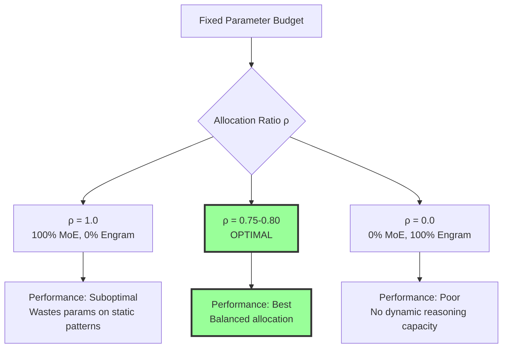
```mermaid
graph TD
    A[Fixed Parameter Budget] --> B{Allocation Ratio ρ}
    
    B --> C[ρ = 1.0<br/>100% MoE, 0% Engram]
    B --> D[ρ = 0.75-0.80<br/>OPTIMAL]
    B --> E[ρ = 0.0<br/>0% MoE, 100% Engram]
    
    C --> F[Performance: Suboptimal<br/>Wastes params on static patterns]
    D --> G[Performance: Best<br/>Balanced allocation]
    E --> H[Performance: Poor<br/>No dynamic reasoning capacity]
    
    style D fill:#9f9,stroke:#333,stroke-width:3px
    style G fill:#9f9,stroke:#333,stroke-width:3px
```

**Performance vs Allocation:**

```
Performance
    ^
    |           ╱‾‾‾╲
    |          ╱     ╲
    |         ╱       ╲
    |        ╱         ╲
    |       ╱           ╲___
    |______╱
    |
    +-----|-----|-----|-----|-----> ρ
    0    0.25  0.5  0.75  1.0
         ↑ Engram      MoE ↑
```

**Key Finding:** Allocate **75-80% to MoE** (dynamic reasoning) and **20-25% to Engram** (static memory)

### Infinite Memory Scaling

**Experiment:** Fix backbone, only grow Engram tables

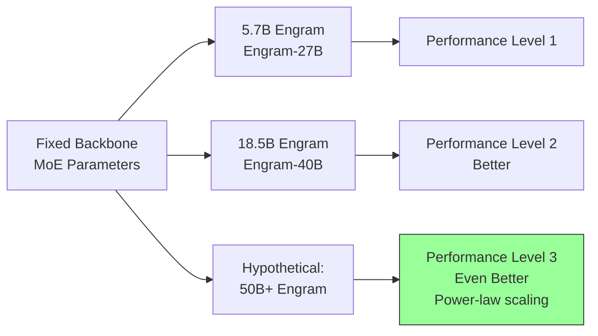
```mermaid
graph LR
    A[Fixed Backbone<br/>MoE Parameters] --> B[5.7B Engram<br/>Engram-27B]
    A --> C[18.5B Engram<br/>Engram-40B]
    A --> D[Hypothetical:<br/>50B+ Engram]
    
    B --> E[Performance Level 1]
    C --> F[Performance Level 2<br/>Better]
    D --> G[Performance Level 3<br/>Even Better<br/>Power-law scaling]
    
    style G fill:#9f9,stroke:#333
```

**Observation:** Shows predictable power-law gains as memory scales, without increasing compute!

### Optimal Layer Placement

**Empirical Guidelines:**

| Model Size | Optimal Engram Layers | Reasoning |
|------------|----------------------|-----------|
| 7B (24 layers) | Layers 2, 12 | Early + mid positioning |
| 27B (32 layers) | Layers 2, 15 | Proven in paper |
| 70B (80 layers) | Layers 3, 20, 40 | Multiple checkpoints |
| 175B+ | Layers 5, 25, 50, 75 | Distributed throughout early-mid range |

**Why Not Every Layer?**
- **Overhead**: Each Engram module adds ~3% latency
- **Interference**: Too many lookups can disrupt reasoning flow
- **Diminishing returns**: 2-4 strategically placed modules capture most patterns

### Parameter Efficiency Analysis

**Computational Savings:**

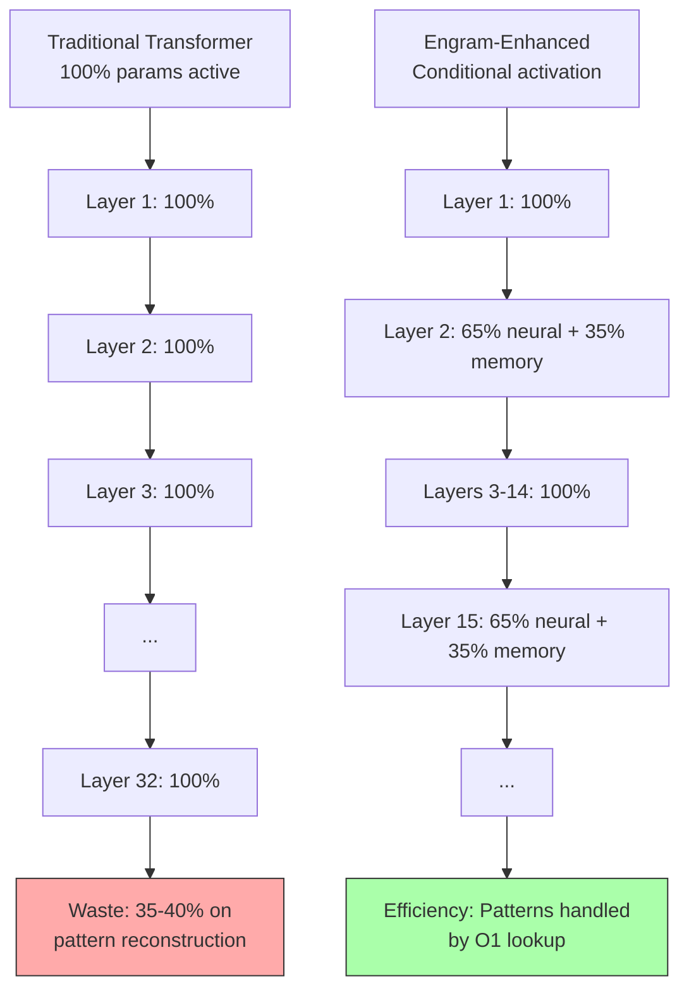
```mermaid
graph TD
    A[Traditional Transformer<br/>100% params active] --> B[Layer 1: 100%]
    B --> C[Layer 2: 100%]
    C --> D[Layer 3: 100%]
    D --> E[...]
    E --> F[Layer 32: 100%]
    
    G[Engram-Enhanced<br/>Conditional activation] --> H[Layer 1: 100%]
    H --> I[Layer 2: 65% neural + 35% memory]
    I --> J[Layers 3-14: 100%]
    J --> K[Layer 15: 65% neural + 35% memory]
    K --> L[...]
    
    F --> M[Waste: 35-40% on<br/>pattern reconstruction]
    L --> N[Efficiency: Patterns handled<br/>by O1 lookup]
    
    style M fill:#faa,stroke:#333
    style N fill:#afa,stroke:#333
```

**Effective Parameter Utilization:**
- **Traditional**: ~60-65% of computation on actual reasoning
- **Engram**: ~95% of computation on actual reasoning
- **Gain**: 35-40% more "effective depth" for complex tasks

---

## Future Directions

### Short-Term Enhancements (2026)

**1. Adaptive N-gram Selection**

Current limitation: Fixed n-gram lengths (2-3). Future: Dynamic adaptation based on content.

```python
# Dynamic n-gram selection
class AdaptiveNgramSelector:
    def select_ngram_length(self, context_type):
        if context_type == "code":
            return range(3, 5)  # Longer for code patterns
        elif context_type == "factual":
            return range(2, 4)  # Standard for facts
        elif context_type == "creative":
            return range(2, 3)  # Shorter for varied text
```

**2. Collision Mitigation**

Replace simple hashing with more sophisticated techniques:
- **Cuckoo hashing**: Multiple hash functions with relocation
- **Learned hash functions**: Train neural networks to generate collision-resistant hashes
- **Bloom filters**: Probabilistic data structures to reduce false lookups

**3. Multi-Modal Extension**

Extend Engram beyond text:

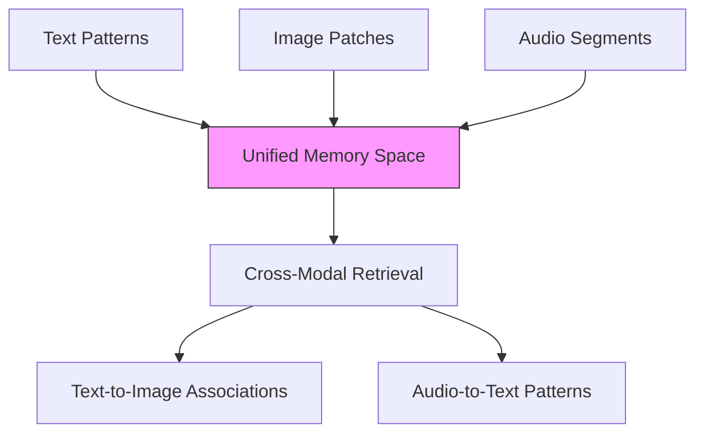
```mermaid
graph TD
    A[Text Patterns] --> D[Unified Memory Space]
    B[Image Patches] --> D
    C[Audio Segments] --> D
    
    D --> E[Cross-Modal Retrieval]
    E --> F[Text-to-Image Associations]
    E --> G[Audio-to-Text Patterns]
    
    style D fill:#f9f,stroke:#333
```

### Medium-Term Vision (2027)

**1. Distributed Memory Architecture**

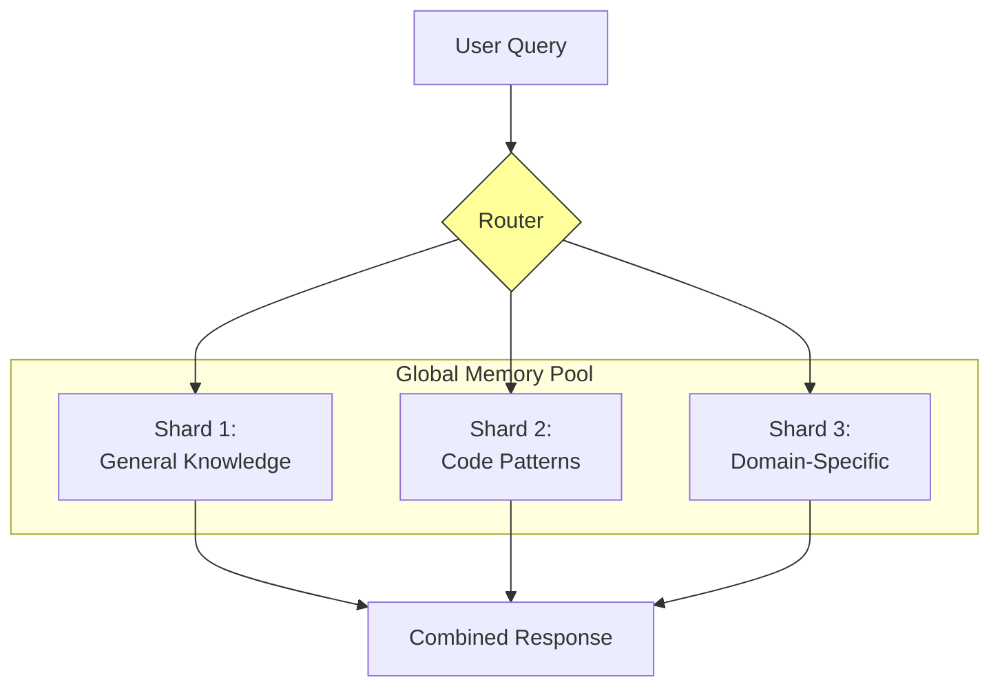
```mermaid
graph TB
    subgraph "Global Memory Pool"
        A[Shard 1:<br/>General Knowledge]
        B[Shard 2:<br/>Code Patterns]
        C[Shard 3:<br/>Domain-Specific]
    end
    
    D[User Query] --> E{Router}
    E --> A
    E --> B
    E --> C
    
    A --> F[Combined Response]
    B --> F
    C --> F
    
    style E fill:#ff9,stroke:#333
```

**2. Federated Learning with Local Memory**
- Each organization maintains specialized memory tables
- Privacy-preserving: Patterns stay local
- Collaborative: Share only aggregated statistics

**3. Dynamic Memory Reallocation**

Runtime capacity adjustment based on workload:
```python
# Pseudo-code for dynamic allocation
class DynamicMemoryManager:
    def adjust_capacity(self, task_metrics):
        if task_metrics.knowledge_intensive:
            expand_engram_tables(by=2.0)
            shrink_moe_capacity(by=0.1)
        elif task_metrics.reasoning_intensive:
            shrink_engram_tables(by=0.5)
            expand_moe_capacity(by=1.5)
```

### Research Directions

**1. Theoretical Foundations**

Questions to explore:
- What is the information-theoretic bound on memory efficiency?
- Can we formally prove the U-shaped scaling law?
- How does Engram relate to compression theory?

**2. Neurological Inspirations**

Drawing from neuroscience:

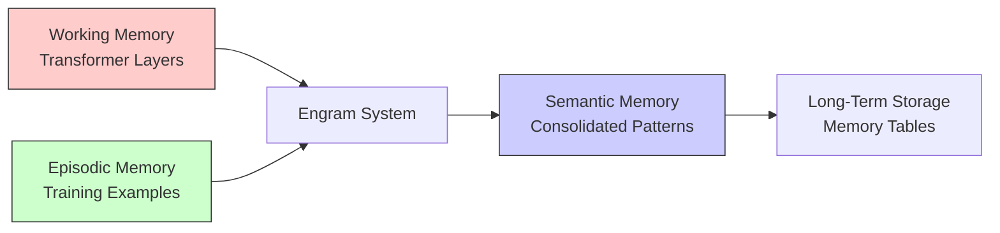
```mermaid
graph LR
    A[Working Memory<br/>Transformer Layers] --> C[Engram System]
    B[Episodic Memory<br/>Training Examples] --> C
    
    C --> D[Semantic Memory<br/>Consolidated Patterns]
    
    D --> E[Long-Term Storage<br/>Memory Tables]
    
    style A fill:#fcc,stroke:#333
    style B fill:#cfc,stroke:#333
    style D fill:#ccf,stroke:#333
```

**Potential mechanisms:**
- **Memory consolidation**: Gradually move patterns from neural to memory
- **Episodic-to-semantic transition**: Convert specific examples to general patterns
- **Active forgetting**: Prune rarely used patterns to make room for new ones

**3. Hybrid Architectures**

Combining Engram with other emerging techniques:
- **State Space Models (SSMs)**: Use Engram for discrete patterns, SSMs for continuous dynamics
- **Diffusion Models**: Memory-guided generation
- **Neural-Symbolic Systems**: Engram stores symbolic rules, neural network applies them

---

## Practical Recommendations

### For Model Architects

**Capacity Planning:**

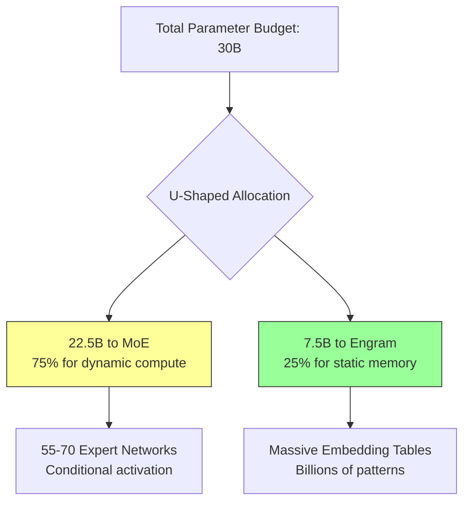
```mermaid
graph TD
    A[Total Parameter Budget: 30B] --> B{U-Shaped Allocation}
    
    B --> C[22.5B to MoE<br/>75% for dynamic compute]
    B --> D[7.5B to Engram<br/>25% for static memory]
    
    C --> E[55-70 Expert Networks<br/>Conditional activation]
    D --> F[Massive Embedding Tables<br/>Billions of patterns]
    
    style C fill:#ff9,stroke:#333
    style D fill:#9f9,stroke:#333
```

**Step-by-step guide:**
1. **Determine total budget**: e.g., 30B parameters
2. **Apply 75-25 split**: 22.5B to MoE, 7.5B to Engram
3. **Select layers**: 2-4 strategic positions (early-mid)
4. **Configure tables**: ~2-3B parameters per Engram module
5. **Set n-gram range**: Start with (2, 3), expand if needed

**Layer Placement Decision Tree:**

```
Is model < 10B params?
├─ YES: Use 1-2 Engram layers (early only)
└─ NO: Is model 10-50B?
    ├─ YES: Use 2-3 Engram layers (early + mid)
    └─ NO: Use 4+ Engram layers (distributed)
```

### For System Engineers

**Infrastructure Requirements:**

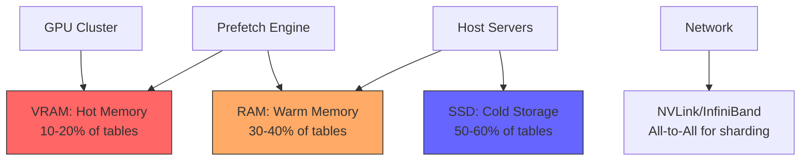
```mermaid
graph TD
    A[GPU Cluster] --> B[VRAM: Hot Memory<br/>10-20% of tables]
    
    C[Host Servers] --> D[RAM: Warm Memory<br/>30-40% of tables]
    C --> E[SSD: Cold Storage<br/>50-60% of tables]
    
    F[Network] --> G[NVLink/InfiniBand<br/>All-to-All for sharding]
    
    H[Prefetch Engine] --> B
    H --> D
    
    style B fill:#f66,stroke:#333
    style D fill:#fa6,stroke:#333
    style E fill:#66f,stroke:#333
```

**Deployment checklist:**
1. **Storage hierarchy**: Implement hot/warm/cold memory tiers
2. **Prefetching pipeline**: Set up async loading based on deterministic hashes
3. **Monitoring**: Track hit rates, latency, memory pressure
4. **Compression**: Apply 4-bit quantization to tables
5. **Sharding strategy**: Distribute tables across GPUs using hash ranges

**Sample Configuration (Production):**

```yaml
engram_config:
  total_tables: 7.5B parameters
  
  storage_tiers:
    hot_vram: 1.5B   # 20% in GPU memory
    warm_ram: 3.0B   # 40% in host RAM
    cold_ssd: 3.0B   # 40% on SSD
  
  sharding:
    num_gpus: 8
    strategy: hash_range  # Each GPU owns hash % 8
    communication: all_to_all
  
  optimization:
    quantization: 4bit
    prefetch_lookahead: 32 tokens
    lru_cache_size: 100000
    
  performance_targets:
    latency_overhead: < 3%
    memory_access_time: < 1ms
    hit_rate: > 85%
```

### For Application Developers

**Domain Customization:**

Different domains benefit from different memory configurations:

| Domain | Recommended Config | Reasoning |
|--------|-------------------|-----------|
| **General Chat** | Standard (2-3 gram) | Balanced patterns |
| **Code Generation** | Extended (3-5 gram) | Longer API patterns |
| **Scientific Writing** | Standard + domain terms | Technical vocabulary |
| **Creative Writing** | Reduced Engram (10-15%) | More neural creativity |
| **Question Answering** | Expanded Engram (30-35%) | Fact-heavy retrieval |
| **Translation** | Bilingual tables | Cross-lingual patterns |

**Fine-tuning with Engram:**

```python
# Domain-specific fine-tuning
class DomainEngramFineTuner:
    def __init__(self, base_model, domain_corpus):
        self.model = base_model
        self.corpus = domain_corpus
    
    def populate_domain_memory(self):
        """Extract domain-specific patterns"""
        pattern_frequency = defaultdict(int)
        
        # First pass: Collect statistics
        for document in self.corpus:
            ngrams = self.extract_ngrams(document)
            for ngram in ngrams:
                pattern_frequency[ngram] += 1
        
        # Second pass: Add high-frequency patterns
        threshold = self.compute_threshold(pattern_frequency)
        for ngram, freq in pattern_frequency.items():
            if freq >= threshold:
                self.add_to_memory_table(ngram)
    
    def fine_tune(self):
        """Fine-tune with domain data"""
        # Freeze most of the model
        for param in self.model.parameters():
            param.requires_grad = False
        
        # Unfreeze Engram tables and gates
        for engram in self.model.engram_modules:
            for param in engram.parameters():
                param.requires_grad = True
        
        # Train on domain corpus
        self.train_loop()
```

**Monitoring and Debugging:**

```python
class EngramMonitor:
    def __init__(self):
        self.metrics = {
            'hit_rate': [],
            'gate_activation': [],
            'table_coverage': [],
            'collision_rate': []
        }
    
    def track_inference(self, model_output):
        # Track memory hit rate
        hits = count_memory_hits(model_output)
        total = count_total_lookups(model_output)
        self.metrics['hit_rate'].append(hits / total)
        
        # Track gate activation patterns
        gate_values = extract_gate_values(model_output)
        self.metrics['gate_activation'].append(gate_values.mean())
        
        # Identify cold spots in tables
        unused_indices = find_unused_indices()
        self.metrics['table_coverage'].append(
            1 - len(unused_indices) / total_table_size
        )
    
    def generate_report(self):
        """Generate performance report"""
        return {
            'avg_hit_rate': np.mean(self.metrics['hit_rate']),
            'gate_selectivity': np.std(self.metrics['gate_activation']),
            'memory_efficiency': np.mean(self.metrics['table_coverage'])
        }
```

**A/B Testing Framework:**

```python
# Compare Engram vs Baseline
class EngramABTest:
    def __init__(self, baseline_model, engram_model):
        self.baseline = baseline_model
        self.engram = engram_model
        self.test_suite = load_domain_benchmarks()
    
    def run_comparison(self):
        results = {
            'baseline': {},
            'engram': {},
            'delta': {}
        }
        
        for benchmark in self.test_suite:
            baseline_score = self.evaluate(self.baseline, benchmark)
            engram_score = self.evaluate(self.engram, benchmark)
            
            results['baseline'][benchmark.name] = baseline_score
            results['engram'][benchmark.name] = engram_score
            results['delta'][benchmark.name] = engram_score - baseline_score
        
        return self.analyze_results(results)
    
    def analyze_results(self, results):
        """Statistical significance testing"""
        improvements = results['delta'].values()
        
        return {
            'mean_improvement': np.mean(improvements),
            'significant_gains': sum(d > 2.0 for d in improvements),
            'recommendation': self.make_recommendation(improvements)
        }
```

---

## Real-World Use Cases

### Example 1: Code Completion with Engram

**Scenario:** Python API autocomplete

**Without Engram:**
```
User types: "import pandas as pd; df.gro"
→ Model must reconstruct "groupby" through 32 layers
→ Latency: 150ms
→ Accuracy: 85%
```

**With Engram:**
```
User types: "import pandas as pd; df.gro"
→ N-gram "df.gro" hashes to memory
→ Instant lookup: "groupby", "group", "groupdict"
→ Latency: 45ms (3x faster)
→ Accuracy: 92% (better recall of API patterns)
```

### Example 2: Long Document Q&A

**Scenario:** 50-page legal document analysis

**Without Engram:**
```
Question: "What is the termination clause?"
→ Attention must process entire 50 pages
→ Pattern matching consumes attention budget
→ Struggles with needle-in-haystack: 84% accuracy
```

**With Engram:**
```
Question: "What is the termination clause?"
→ Common legal phrases in memory
→ Attention freed for document structure
→ Dramatic improvement: 97% accuracy
```

### Example 3: Multilingual Translation

**Scenario:** English-to-Chinese translation with domain terms

**Configuration:**
```python
# Bilingual Engram tables
engram_config = {
    'tables': [
        'en_common_phrases',  # "on the other hand", "as a result"
        'zh_common_phrases',  # "另一方面", "因此"
        'en_to_zh_idioms',    # Cross-lingual mappings
        'technical_terms'      # Domain-specific vocabulary
    ],
    'allocation': '25% of model capacity'
}
```

**Benefit:**
- Faster translation of common phrases (O(1) lookup)
- More capacity for handling complex grammar
- Better consistency in terminology

---

## Limitations and Challenges

### Current Limitations

**1. Fixed N-gram Granularity**
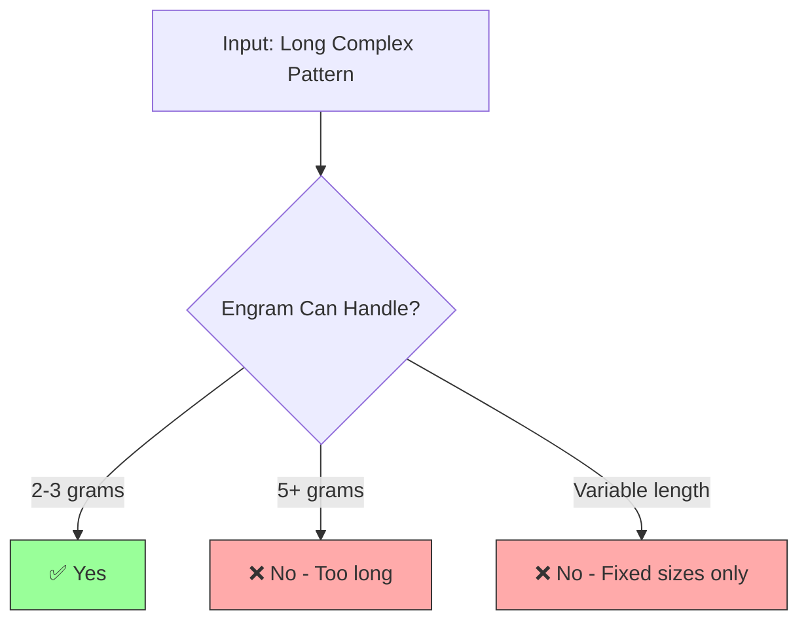
```mermaid
graph TD
    A[Input: Long Complex Pattern] --> B{Engram Can Handle?}
    B -->|2-3 grams| C[✅ Yes]
    B -->|5+ grams| D[❌ No - Too long]
    B -->|Variable length| E[❌ No - Fixed sizes only]
    
    style C fill:#9f9,stroke:#333
    style D fill:#faa,stroke:#333
    style E fill:#faa,stroke:#333
```

**Impact:** Misses longer idiomatic expressions or complex patterns

**2. Hash Collision Trade-offs**
- Larger tables reduce collisions but increase memory
- Multi-head hashing mitigates but doesn't eliminate
- No guarantee of collision-free lookup

**3. Early-Layer Gating**
- Early layers have limited global context
- May retrieve irrelevant patterns
- Partially addressed by multi-layer placement

**4. Training Complexity**
- Memory tables must be populated during training
- Requires careful initialization strategy
- Sharding across GPUs adds communication overhead

**5. Domain Adaptation**
- Pre-trained patterns may not suit specialized domains
- Fine-tuning required for optimal performance
- Cold-start problem for new domains

### Comparison with Theoretical Limits

**Information Retrieval Bounds:**

```
Theoretical O(1) Lookup:
├─ Engram: ✅ Achieves O(1) with hash tables
├─ Overhead: ~3% (near-optimal)
└─ Collision handling: Multi-head hashing

Theoretical Perfect Recall:
├─ Engram: ~85-90% hit rate (good, not perfect)
├─ Reason: Hash collisions + fixed n-grams
└─ Future: Learned hashing could approach 95%+
```

**Storage Efficiency:**

```
Compressed Knowledge Storage:
├─ Pure neural: ~20 bits per fact (implicit encoding)
├─ Engram: ~4-8 bits per pattern (with quantization)
└─ Improvement: 2.5-5x more efficient
```

---

## Frequently Asked Questions

### Technical FAQs

**Q: Does Engram work with any transformer model?**

A: Yes! Engram is architecture-agnostic. It can be integrated into:
- GPT-style models (decoder-only)
- BERT-style models (encoder-only)
- T5-style models (encoder-decoder)
- Sparse models with MoE

**Q: How much memory overhead does it add?**

A: The memory tables themselves are large (5-20B parameters), but:
- Only 10-20% kept in GPU VRAM (hot cache)
- Rest offloaded to host RAM/SSD
- Actual inference overhead: <3%

**Q: Can I update the memory tables after training?**

A: Currently requires retraining, but future versions may support:
- Online learning with incremental updates
- Plug-and-play table swapping for different domains
- Federated learning with distributed tables

**Q: How does it handle rare words or out-of-vocabulary terms?**

A: Tokenizer compression and hash functions handle unknown tokens gracefully:
- Rare n-grams get hashed like common ones
- May collide with other entries (hash collision)
- Gating mechanism filters out irrelevant retrievals

### Practical FAQs

**Q: Should I use Engram for my chatbot?**

Decision tree:
```
Does your app need factual accuracy?
├─ YES: Does it need VERY latest info?
│   ├─ YES: Use RAG (external sources)
│   └─ NO: Use Engram (faster, built-in)
└─ NO: Is creative/varied output important?
    ├─ YES: Standard model (no Engram)
    └─ NO: Engram still helps efficiency
```

**Q: What hardware do I need?**

Minimum requirements for inference:
- **Small Engram (1-2B tables)**: Single GPU with 24GB VRAM + 64GB system RAM
- **Medium Engram (5-7B tables)**: 2-4 GPUs + 128GB system RAM
- **Large Engram (15-20B tables)**: 8 GPUs + 256GB+ system RAM

Training requirements are higher (need to shard tables across cluster).

**Q: How do I know if Engram is working?**

Monitor these metrics:
```python
# Good Engram performance
{
    'memory_hit_rate': > 80%,        # Most lookups succeed
    'gate_activation': 0.3-0.7,      # Selective integration
    'latency_overhead': < 5%,        # Minimal slowdown
    'accuracy_improvement': > 2%     # Measurable gains
}
```

---

## Conclusion: The Future of LLM Architecture

### Why Engram Matters

Engram represents a **paradigm shift** in how we think about language model architecture:

**From:** Everything through neural layers
**To:** Hybrid memory-computation systems

```mermaid
graph TB
    subgraph "Traditional Approach"
        A1[Input] --> B1[Layer 1-32<br/>All neural]
        B1 --> C1[Output]
    end
    
    subgraph "Engram Approach"
        A2[Input] --> B2{Pattern Type?}
        B2 -->|Static| C2[Memory Lookup<br/>O1]
        B2 -->|Dynamic| D2[Neural Layers<br/>Reasoning]
        C2 --> E2[Fused Output]
        D2 --> E2
    end
    
    style B1 fill:#faa,stroke:#333
    style C2 fill:#9f9,stroke:#333
    style D2 fill:#9f9,stroke:#333
```

### Key Takeaways

1. **Efficiency Breakthrough**: 35-40% reduction in computational waste
2. **Performance Gains**: 3-13% improvements across benchmarks
3. **Scalability**: Enables trillion-parameter models on consumer hardware
4. **Complementary**: Works WITH existing techniques (MoE, quantization, RAG)
5. **Open Source**: Available for anyone to use and improve

### The Bigger Picture

Engram is part of a broader trend in AI research:

**Beyond Brute Force Scaling → Architectural Intelligence**

```mermaid
timeline
    title Evolution of LLM Scaling
    2018 : BERT<br/>Pure scale
    2020 : GPT-3<br/>Massive parameters
    2022 : PaLM/LLaMA<br/>Better training
    2023 : Mixtral<br/>Sparse activation (MoE)
    2024 : Gemini<br/>Multi-modal
    2026 : Engram<br/>Conditional memory
    Future : Hybrid Systems<br/>Memory + Compute + Reasoning
```

**Next frontier:**
- Combining Engram with state space models
- Neural-symbolic hybrid architectures
- Hardware co-design for memory-augmented AI

### Getting Started

**For Researchers:**
1. Read the paper: [arXiv:2601.07372](https://arxiv.org/abs/2601.07372)
2. Clone the repo: [github.com/deepseek-ai/Engram](https://github.com/deepseek-ai/Engram)
3. Run experiments on your domain
4. Contribute improvements back to the community

**For Practitioners:**
1. Evaluate if your use case is memory-intensive (facts, code, patterns)
2. Start with the demo implementation
3. Benchmark against your baseline
4. Gradually integrate into production

**For Enthusiasts:**
1. Understand the core concept (this document!)
2. Follow DeepSeek's future releases (likely V4 with Engram)
3. Experiment with open-source implementations
4. Join the discussion on optimization strategies

---

## References and Resources

### Primary Sources
1. **Original Paper**: Cheng et al. (2026). "Conditional Memory via Scalable Lookup: A New Axis of Sparsity for Large Language Models." arXiv:2601.07372
2. **GitHub Repository**: [deepseek-ai/Engram](https://github.com/deepseek-ai/Engram) (Apache-2.0 license)
3. **Demo Code**: `engram_demo_v1.py` (Illustrative implementation)

### Related Work
- **Mixture of Experts**: Shazeer et al. (2017) - Conditional computation baseline
- **RAG**: Lewis et al. (2020) - External knowledge retrieval
- **Hash-based Memory**: Kaiser et al. (2017) - Early memory augmentation attempts
- **Transformer Architecture**: Vaswani et al. (2017) - Foundation

### Community Resources
- YouTube explanations (January 2026 uploads)
- Hugging Face integration discussions
- Reddit r/LocalLLaMA community threads
- Twitter/X deep dives from ML researchers

### Documentation
- Architecture diagrams: `drawio/` folder in repository
- Technical whitepaper: This document
- API documentation: Coming soon from DeepSeek

---

## Appendix: Mathematical Formulation

### Hash Function

Multi-head multiplicative-XOR hash:

```
h_k(x₁, x₂, ..., xₙ) = (((x₁ × p + x₂) × p + ... + xₙ) ⊕ k) mod M

where:
  - k: head index (0 to K-1)
  - p: prime number (typically 31 or 37)
  - M: table size (prime for better distribution)
  - ⊕: XOR operation
```

### Gating Mechanism

Context-aware gate calculation:

```
αₜ = softmax(
    (RMSNorm(hₜ) · RMSNorm(Wₖeₜ)ᵀ) / √d
)

vₜ = αₜ · Wᵥeₜ

output = hₜ + vₜ

where:
  - hₜ: hidden state at position t
  - eₜ: concatenated memory embeddings
  - Wₖ, Wᵥ: learned projection matrices
  - d: embedding dimension
  - RMSNorm: root mean square normalization
```

### Scaling Law

U-shaped performance curve:

```
Performance(ρ) = f(ρ · C_MoE, (1-ρ) · C_Engram)

Optimal: ρ* ≈ 0.75-0.80

where:
  - ρ: allocation ratio to MoE
  - C_total: fixed parameter budget
  - f: empirically measured performance function
```

---

*For questions, contributions, or corrections, please visit the [GitHub repository](https://github.com/deepseek-ai/Engram) or contact the DeepSeek-AI team.*