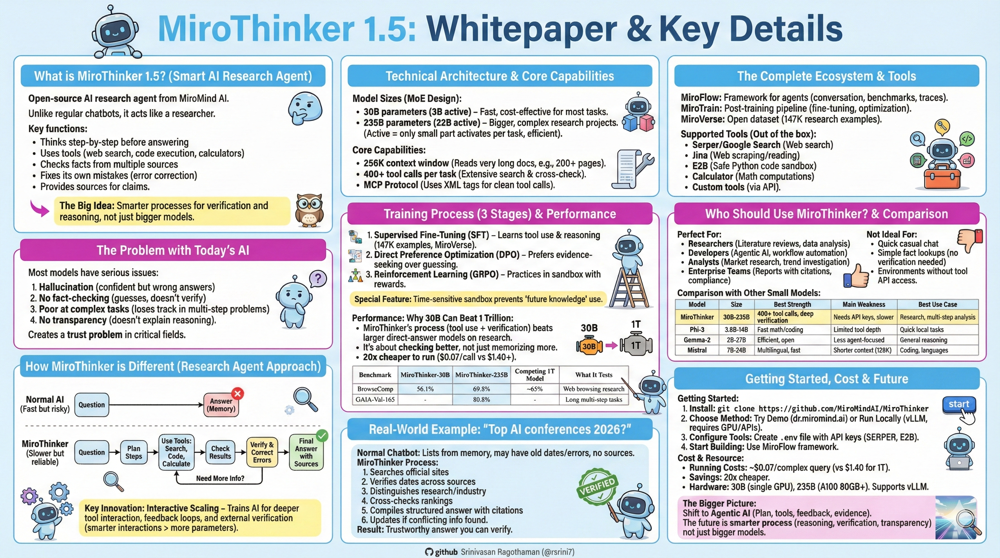
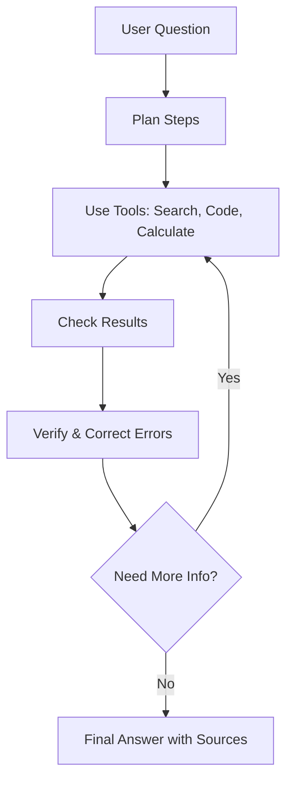

# MiroThinker 1.5: Whitepaper



## What is MiroThinker 1.5?

MiroThinker 1.5 is an open-source AI research agent from MiroMind AI. Unlike regular chatbots that answer immediately, it works like a smart researcher that:

- **Thinks step-by-step** before answering
- **Uses tools** like web search, code execution, and calculators
- **Checks facts** from multiple sources
- **Fixes its own mistakes** when it finds errors
- **Provides sources** for everything it says

**The Big Idea:** Instead of just being bigger, MiroThinker proves that AI can be smarter by having better processes for verification and reasoning.

---

## The Problem with Today's AI

Most AI models have serious issues:

1. **Hallucination** - They make up confident-sounding answers that are wrong
2. **No fact-checking** - They guess instead of verifying
3. **Poor at complex tasks** - They lose track during long, multi-step problems
4. **No transparency** - They don't explain how they reached conclusions

This creates a **trust problem**, especially in critical fields like healthcare, finance, and education.

---

## How MiroThinker is Different

### The Research Agent Approach

**Normal AI:** Question → Answer (fast but risky)

**MiroThinker:** Question → Plan → Search → Verify → Refine → Answer (slower but reliable)



### Key Innovation: Interactive Scaling

Instead of just making the model bigger, MiroThinker trains the AI to:
- Interact more deeply with tools
- Use feedback loops for error correction
- Build better reasoning through external verification

This is called **Interactive Scaling** - focusing on smarter interactions rather than just more parameters.

---

## Technical Architecture

### Model Sizes

MiroThinker 1.5 comes in two versions using Mixture-of-Experts (MoE) design:

- **30B parameters (3B active)** - Fast and cost-effective for most tasks
- **235B parameters (22B active)** - For bigger, more complex research projects

**What "active" means:** Only a small part of the model activates for each task, making it efficient.

### Core Capabilities

- **256K context window** - Can handle very long documents and conversations (like reading 200+ page documents)
- **400+ tool calls per task** - Can search, verify, and cross-check extensively
- **MCP Protocol** - Uses XML tags to call tools cleanly and systematically

### Training Process (3 Stages)

1. **Supervised Fine-Tuning (SFT)** - Learns basic tool use and reasoning on 147K example tasks (MiroVerse dataset)
2. **Direct Preference Optimization (DPO)** - Learns to prefer evidence-seeking and verification over guessing
3. **Reinforcement Learning (GRPO)** - Practices in a sandbox with verifiable rewards to improve

**Special Training Feature:** Time-sensitive sandbox that simulates real-world conditions, preventing the AI from using "future knowledge" it shouldn't have.

---

## Performance: Why 30B Can Beat 1 Trillion

### What the Headlines Mean

When you see "30B beats 1T models," it means:

- For research tasks, MiroThinker's **process** (tool use + verification) beats larger models that answer directly
- It's not about memorizing more - it's about **checking better**
- The smaller model is 20x cheaper to run ($0.07 per call vs $1.40+)

### Benchmark Results

| Benchmark | MiroThinker-30B | MiroThinker-235B | Competing 1T Model | What It Tests |
|-----------|-----------------|-------------------|-------------------|---------------|
| BrowseComp | 56.1% | 69.8% | ~65% | Web browsing research tasks |
| BrowseComp-ZH | - | 71.5% | Lower | Chinese web research |
| GAIA-Val-165 | - | 80.8% | - | Long multi-step tasks |
| HLE-Text | 39.2% | - | - | Text-only research |

**Key Takeaway:** Leading open-source performance on research benchmarks while using far less computing power.

---

## Real-World Example

**Question:** "What are the top AI conferences in 2026 and which are best for research?"

### Normal Chatbot:
- Lists some conferences from memory
- Might include old dates
- Confidently states wrong information
- No sources provided

### MiroThinker Process:
1. Searches for official conference websites
2. Verifies dates across multiple sources
3. Distinguishes research conferences from industry expos
4. Cross-checks rankings and reviews
5. Compiles structured answer with citations
6. Updates if it finds conflicting information

**Result:** Trustworthy answer you can verify yourself.

---

## The Complete Ecosystem

### MiroFlow
Framework for building and running AI agents with:
- Multi-turn conversation management
- Benchmark testing tools
- Trace collection for debugging

### MiroTrain
Post-training pipeline for customization:
- Fine-tuning on your own data
- Advanced optimization techniques
- Supports large-scale training

### MiroVerse
Open dataset with 147K research task examples for training your own models.

### Supported Tools

Out of the box, MiroThinker works with:
- **Serper/Google Search** - Web searching
- **Jina** - Web page scraping and reading
- **E2B** - Safe Python code execution in sandbox
- **Calculator** - Mathematical computations
- **Custom tools** - Add your own via API

---

## Who Should Use MiroThinker?

### Perfect For:

**Researchers**
- Literature reviews
- Data analysis with sources
- Hypothesis testing

**Developers/Architects**
- Building research assistants
- Creating agentic AI systems
- Workflow automation that needs verification

**Analysts**
- Market research
- Competitive analysis
- Trend investigation

**Enterprise Teams**
- Report generation with citations
- Compliance and audit trails
- Decision support systems

### Not Ideal For:

- Quick casual chat (it's slower by design)
- Simple tasks that don't need verification
- Environments without tool API access

---

## Comparison with Other Small Models

| Model | Size | Best Strength | Main Weakness | Best Use Case |
|-------|------|---------------|---------------|---------------|
| **MiroThinker** | 30B-235B | 400+ tool calls, deep verification | Needs API keys, slower | Research, multi-step analysis |
| **Phi-3** | 3.8B-14B | Fast math/coding | Limited tool depth | Quick local tasks |
| **Gemma-2** | 2B-27B | Efficient, open | Less agent-focused | General reasoning |
| **Mistral** | 7B-24B | Multilingual, fast | Shorter context (128K) | Coding, languages |

**MiroThinker's Edge:** Most specialized for verification-heavy research tasks with extensive tool orchestration.

---

## Getting Started

### Step 1: Install
```bash
# Clone the repository
git clone https://github.com/MiroMindAI/MiroThinker
```

### Step 2: Choose Your Method

**Option A - Try the Demo**
- Visit: https://dr.miromind.ai
- Test with prompts like: "Analyze [topic] with sources"
- Free tier has 100-tool limit per task

**Option B - Run Locally**
```bash
# Using vLLM (recommended)
vllm serve miromind-ai/MiroThinker-v1.5-30B \
  --tensor-parallel-size 2 \
  --max-model-len 262144 \
  --enable-reasoning
```

**Requirements:**
- GPU: A100 80GB for 235B model, smaller GPU for 30B
- API keys: Serper (search), E2B (code execution)
- Alternative: Use quantized versions for lower GPU needs

### Step 3: Configure Tools
Create `.env` file:
```
SERPER_API_KEY=your_key_here
E2B_API_KEY=your_key_here
```

### Step 4: Start Building
Use MiroFlow framework to create custom agents for your specific needs.

---

## Cost & Resource Comparison

### Running Costs
- **MiroThinker 30B:** ~$0.07 per complex query
- **1T parameter models:** ~$1.40 per query
- **Savings:** 20x cheaper for comparable research quality

### Hardware Needs
- **30B model:** Can run on single GPU (24GB+ VRAM with quantization)
- **235B model:** Needs A100 80GB or multiple smaller GPUs
- **Deployment:** Compatible with vLLM, SGLang, standard serving frameworks

---

## Use Cases in Action

### 1. Market Research Agent
"Analyze the electric vehicle market in India for 2025"
- Searches latest reports
- Compares multiple sources
- Verifies statistics
- Provides sourced summary with trends

### 2. Code Generation with Verification
"Build a roguelike game in C"
- Plans architecture
- Writes code incrementally
- Tests each component
- Debugs and refines
- Documents with comments

### 3. Academic Research Assistant
"Summarize recent breakthroughs in quantum computing"
- Searches academic databases
- Reads multiple papers
- Cross-references findings
- Synthesizes with citations

### 4. Business Intelligence
"Compare our Q3 performance against industry benchmarks"
- Searches industry data
- Retrieves internal metrics
- Performs calculations
- Generates report with sources

---

## The Bigger Picture: Why This Matters

### Challenging Old AI Assumptions

**Old Belief:** Bigger model = Better AI

**New Understanding:** Smarter process = Better AI

MiroThinker shows that future AI breakthroughs might come from:
- **Better reasoning** instead of more parameters
- **External verification** instead of pure memorization
- **Transparency** instead of black-box answers
- **Self-correction** instead of confident errors

### The Shift to Agentic AI

MiroThinker represents a new category: **agentic AI systems** that:
- Plan before acting
- Use tools strategically
- Learn from feedback
- Admit uncertainty
- Provide evidence

This is closer to how humans solve complex problems.

---

## Limitations and Considerations

### What to Know

1. **Slower than chat models** - Verification takes time
2. **Requires tool APIs** - Not fully self-contained
3. **Still being refined** - Active development, technical report pending
4. **Best for English** - Chinese support expanding but limited
5. **Need technical setup** - Not as plug-and-play as hosted services

### When Not to Use

- Real-time chat applications
- Simple fact lookups that don't need verification
- Cost-sensitive applications where speed matters more than accuracy
- Environments where external API calls are restricted

---

## Resources and Community

### Official Links
- **GitHub:** https://github.com/MiroMindAI/MiroThinker
- **Models:** Hugging Face collections/miromind-ai/mirothinker-v15
- **Research Paper:** arXiv 2511.11793
- **Demo:** https://dr.miromind.ai
- **Community:** Discord.gg/F7EQFnYscV

### License
MIT License - Free for commercial and personal use

---

## Conclusion: The Future of AI Intelligence

MiroThinker 1.5 challenges us to rethink what makes AI "intelligent."

**It's not just about:**
- Having more parameters
- Training on more data
- Having more computing power

**It's about:**
- Thinking before speaking
- Checking before claiming
- Correcting when wrong
- Providing evidence
- Building trust

For developers and architects, MiroThinker offers a practical path to building AI systems that people can actually rely on for important decisions. It's open, efficient, and designed for real work.

**The message is clear:** The next generation of AI will win not by being biggest, but by being smartest about how it thinks and verifies information.

---

## Quick Start Checklist

- [ ] Decide on use case (research, analysis, coding, etc.)
- [ ] Choose model size (30B for most, 235B for heavy tasks)
- [ ] Set up hardware (GPU or cloud instance)
- [ ] Get API keys (Serper, E2B)
- [ ] Clone GitHub repository
- [ ] Install dependencies
- [ ] Configure tools in .env file
- [ ] Run demo to test
- [ ] Integrate into your workflow
- [ ] Join community for support

**Start exploring today and build the next generation of trustworthy AI systems.**