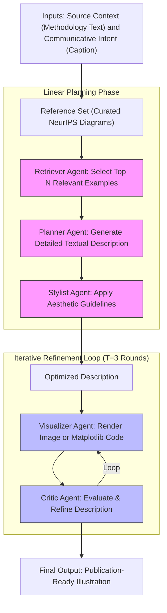

# PaperBanana: Automating Academic Illustration for AI Scientists

## A White Paper for Developers and Architects

### Executive Summary
PaperBanana is an innovative multi-agent AI framework developed by researchers at Peking University and Google Cloud AI Research. It automates the generation of publication-ready academic illustrations, such as methodology diagrams and statistical plots, from textual descriptions. Leveraging vision-language models (VLMs) like Gemini-3-Pro and image generation models like Nano-Banana-Pro, the system orchestrates five specialized agents to ensure outputs are faithful to the source content, concise, readable, and aesthetically aligned with academic standards (e.g., NeurIPS-style guidelines).

This white paper provides a simplified yet detailed overview for developers and architects, covering the system's architecture, use cases, examples, comparisons to related tools, and practical implementation guidance. Based on verified sources from the original research paper, open-source repositories, and community discussions, PaperBanana represents a significant advancement in AI-driven research workflows, reducing manual effort in visual communication.

### Introduction
In the era of autonomous AI scientists, large language models (LLMs) have revolutionized tasks like literature review, hypothesis generation, and code execution. However, creating high-quality academic illustrations remains a labor-intensive bottleneck. Researchers often spend hours using tools like PowerPoint, TikZ, or Matplotlib to craft diagrams that are both technically accurate and visually professional.

PaperBanana addresses this gap by transforming raw methodology text and captions into polished visuals. It employs an agentic workflow that mimics human design processes: retrieving references, planning structure, styling for aesthetics, visualizing content, and iteratively critiquing for refinement. Evaluated on PaperBananaBench—a dataset of 292 methodology sections from NeurIPS 2025 papers—the framework outperforms baselines by up to 37.2% in conciseness and achieves a 72.7% human preference rate in blind evaluations.

The name "PaperBanana" extends from "NanoBanana," a lightweight AI model series. Originating from developer Naina Raisinghani's nickname "Naina Banana," it evolved into "NanoBanana" for mobile-optimized models and was embraced by Google, even incorporating banana emojis in Gemini interfaces.

### Architecture Overview
PaperBanana's architecture is divided into two phases: a linear planning phase and an iterative refinement loop. This design ensures collaborative agent interaction while maintaining efficiency.



- **Linear Planning Phase**: Focuses on content and style preparation using reference-driven in-context learning.
- **Iterative Refinement Loop**: Runs for three iterations, where visualization and critique alternate to polish the output.
- **Dual-Mode Rendering**: For conceptual diagrams, it generates raster images; for statistical plots, it produces executable Python code (e.g., Matplotlib) to prevent numerical hallucinations.

The system is powered by proprietary models but has open-source implementations using accessible APIs like Gemini.

### Detailed Agent Roles
Each agent is a specialized component, typically implemented via VLM prompts or API calls:

1. **Retriever Agent**: Searches a reference database (e.g., 13-292 curated NeurIPS diagrams) for structurally similar examples. Uses generative retrieval to match domains like "Agent & Reasoning" or "Vision & Perception." Output: Top-N examples for in-context guidance.

2. **Planner Agent**: Translates unstructured methodology text into a detailed visual plan (e.g., "boxes for modules, arrows for data flow"). Employs in-context learning from retrieved examples to ensure logical structure.

3. **Stylist Agent**: Synthesizes aesthetic guidelines from references (e.g., color palettes, typography, spacing). Refines the plan to comply with academic norms, boosting conciseness and readability.

4. **Visualizer Agent**: Renders the final visual. For diagrams, uses image models like Nano-Banana-Pro; for plots, generates code to ensure precision (e.g., bar charts with exact data values).

5. **Critic Agent**: Acts as a VLM-as-a-Judge, evaluating outputs against the source for faithfulness (e.g., no missing connections) and suggesting refinements. Triggers iterations to fix issues like visual glitches.

This modular design allows for easy extension—e.g., integrating new models or domains.

### Use Cases
PaperBanana is versatile for AI researchers, developers, and architects in academia and industry:

- **Research Paper Authoring**: Generate methodology diagrams for conference submissions (e.g., NeurIPS, ICML). Use case: A PhD student inputs a transformer architecture description; the system outputs a color-coded flowchart with residual connections.

- **Technical Documentation**: Create system architecture visuals for software projects. Use case: Architects document a multi-agent AI pipeline, producing editable plots for performance metrics.

- **Data Visualization in Reports**: Automate statistical plots from CSV data. Use case: Business analysts generate bar charts comparing model accuracies, ensuring journal-ready styling.

- **Polishing Existing Assets**: Enhance hand-drawn sketches. Use case: Refine a rough UML diagram to match professional standards, winning 56.2% in aesthetics evaluations.

- **Collaborative Workflows**: Integrate with IDEs via MCP servers for real-time diagram generation during code reviews.

In viral academic discussions, users highlight its time savings (e.g., "five minutes vs. two hours" for complex figures) and consistency across team outputs.

### Examples
To illustrate PaperBanana's capabilities, consider a simple methodology description: "A transformer model with encoder-decoder layers, multi-head attention, and residual connections."

- **Generated Diagram**: The system produces a structured flowchart with color-coded blocks (blue for encoders, orange for decoders), directional arrows, and dashed lines for residuals.


- **Statistical Plot Example**: For data like voter satisfaction across states, it generates Matplotlib code for a bar chart:
  ```python
  import matplotlib.pyplot as plt
  states = ['California', 'Texas', 'Florida', 'New York', 'Pennsylvania']
  satisfaction = [60, 40, 55, 70, 45]  # Example percentages
  plt.bar(states, satisfaction, color=['blue', 'red', 'orange', 'green', 'purple'])
  plt.xlabel('States')
  plt.ylabel('Satisfaction (%)')
  plt.title('Voter Satisfaction Across States')
  plt.show()
  ```


- **Refinement Iteration**: Initial output might have cluttered labels; after critique, labels are repositioned for better readability.

Community demos (e.g., from GitHub) show generating ADK system diagrams with tools like Google Search and Firestore integration.

### Comparisons with Related Tools
PaperBanana differentiates itself through its agentic, iterative approach. Here's a comparison:

| Tool                  | Key Features                          | Strengths                          | Limitations                        | Suitability for Developers |
|-----------------------|---------------------------------------|------------------------------------|------------------------------------|----------------------------|
| **PaperBanana**      | Multi-agent (5 agents), iterative refinement, dual-mode (image/code), reference-driven. | High faithfulness (45.8%), aesthetics; outperforms baselines by 17% overall. | Raster outputs (non-editable); domain-specific to AI/NeurIPS styles. | Ideal for API integration; open-source GitHub repo with MCP server for IDEs. |
| **Matplotlib/Seaborn**| Code-based plotting libraries.       | Precise numerical control; customizable. | Requires coding; no auto-styling or diagram support. | Good for devs needing exact data viz; slower for non-coders (hours vs. minutes). |
| **BioRender**        | Pre-designed icons for biology diagrams. | Domain-specific templates; easy drag-and-drop. | Manual; limited to life sciences; no AI automation. | Better for bio-focused architects; lacks general AI integration. |
| **DALL-E/Midjourney**| General text-to-image generation.     | Versatile for any visuals.         | Prone to hallucinations; no academic styling or critique loop. | Useful for quick prototypes; inferior in faithfulness (e.g., 43.2% score vs. PaperBanana's 60.2%). |
| **TikZ/LaTeX**       | Vector-based diagramming.             | Editable, high-quality outputs.    | Steep learning curve; fully manual. | For precise control in LaTeX workflows; not automated. |
| **Paper2Any**        | Agentic framework for general paper tasks. | Broad applicability.              | Lower performance (8.5% score); no specialized illustration focus. | Alternative for broader research automation; less optimized for visuals. |

PaperBanana excels in automation and quality for academic contexts, but for vector edits, pair it with tools like Inkscape. Community benchmarks show it surpassing humans in conciseness and readability.

### Implementation and Integration
For developers:

- **Setup**: Clone the GitHub repo (`git clone https://github.com/llmsresearch/paperbanana`). Install via `pip install paperbanana`. Configure Gemini API key in `.env`.

- **Usage**:
  - CLI: `paperbanana generate --input method.txt --caption "Overview"`.
  - Python API: Use `PaperBananaPipeline` for custom workflows.
  - MCP Server: Enables IDE integration (e.g., Claude Code) with commands like `/generate-diagram`.

- **Customization**: Modify YAML configs for agents or add domains. Use your own VLM backends.

- **Limitations and Future Work**: Outputs are raster (non-vector); potential for GUI agents to enable editability. Extend to biology or UI design.

### References
This white paper draws from the original research and open-source implementation. Additional insights from community discussions and articles. Video analyses confirm real-world applicability.