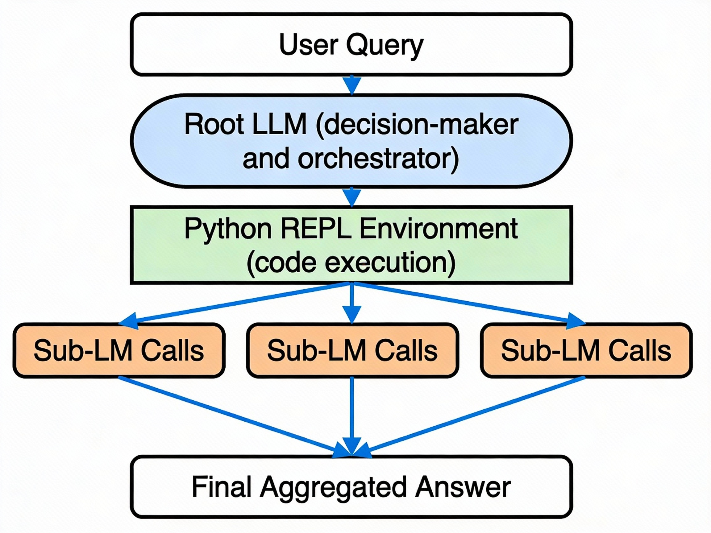

# Recursive Language Models (RLMs)
## A Practical White Paper on Processing Unlimited Context

---

## Executive Summary

Recursive Language Models (RLMs) represent a fundamental shift in how AI systems handle long documents and complex reasoning. Instead of forcing massive text through a transformer's fixed context window—where performance degrades dramatically—RLMs treat text as an external environment that the AI can explore intelligently.

The core innovation: **Let the AI decide how to break down the problem, using Python code and recursive self-calls.**

The result is stunning: processing documents up to **100x longer** than models can handle directly, at **comparable or lower cost**, with **2-15x better accuracy** on complex reasoning tasks.

---

## Part 1: The Problem—Context Rot

### What is Context Rot?

Context rot is when your AI gets dumber as you give it more information. It's not a rumor—it's real and measurable.

**Simple Example**: Ask GPT-5 to find a specific name hidden in 10 documents = works perfectly. Ask it to find patterns across those same documents = fails miserably. Performance drops exponentially as complexity increases.

### Why Does Context Rot Happen?

Three interconnected reasons:

#### 1. **Attention is Quadratic (O(n²))**
Every token in a transformer attends to every other token. Double your context length → 4x the memory and compute needed. This is the mathematical ceiling.

#### 2. **Reasoning Density Matters More Than You Think**
The problem isn't just *length*—it's **complexity**. RLM research identified a phase transition in model capability:
- **Constant complexity** (find one word): GPT-5 handles 1M+ tokens fine
- **Linear complexity** (sum all values): GPT-5 starts failing around 33K tokens
- **Quadratic complexity** (find all matching pairs): GPT-5 collapses below 16K tokens

A single query about pairs in 32K tokens? **0.04% success rate** (essentially useless).

#### 3. **Transformers Can't Manage What They Can't See**
Transformers have no native mechanism to prioritize what's important. Every token fights for the model's attention equally. Add 100 distractor documents = attention gets diluted across irrelevant information.

### The Quantified Problem

| Task | Context Length | GPT-5 Performance |
|------|-----------------|-------------------|
| Needle-in-Haystack | 1M tokens | ✓ 100% |
| Linear Reasoning | 32K tokens | ✗ 20-30% |
| Quadratic Reasoning | 32K tokens | ✗ 0.04% |
| Real-world Deep Research | 11M tokens | ✗ Complete Failure |

**The painful truth**: GPT-5 can "fit" 272K tokens, but can only *reason* over ~16K reliably on complex tasks.

---

## Part 2: How RLMs Work—The Architecture

### The Core Insight

Don't feed long text into the neural network. Treat it as a **file on disk** that the AI can query programmatically.

Think of it like this: Instead of memorizing an entire encyclopedia, the AI gets a library catalog and knows how to search it. When it finds relevant sections, it reads only those parts and passes them through reasoning.

### System Architecture

**RLM Architecture Diagram**

 

```
┌─────────────────────────────────────────────────────────┐
│                    User Query                           │
│              "Find all user pairs with X"               │
└─────────────────┬───────────────────────────────────────┘
                  │
                  ▼
         ┌────────────────────┐
         │  Root LLM (GPT-5)  │ ◄─── Makes Strategic Decisions
         │ - Code Generation  │      - What to inspect?
         │ - Orchestration    │      - When to recurse?
         │ - Aggregation      │      - How to combine results?
         └────────┬───────────┘
                  │
        ┌─────────┴──────────┬──────────────┐
        │                    │              │
        ▼                    ▼              ▼
    ┌───────────────────────────────────────────┐
    │    Python REPL Environment                │
    │  (Persistent State + Code Execution)      │
    │                                           │
    │  context = "million token string..."      │
    │  results = []                             │
    │                                           │
    │  for chunk in chunks:                     │
    │    sub_result = llm_query(chunk)          │
    │    results.append(sub_result)             │
    └───────────────────────────────────────────┘
        │       │       │       │
        ▼       ▼       ▼       ▼
    ┌────────────────────────────────────────┐
    │  Sub-LLM Calls (GPT-5-mini)            │
    │  Process Individual Chunks             │
    │  (Avoid context rot on small pieces)   │
    └────────────────────────────────────────┘
        │       │       │       │
        └───────┴───────┴───────┘
             │
             ▼
    ┌──────────────────┐
    │  Final Answer    │
    │  (Aggregated)    │
    └──────────────────┘
```

### The Three Key Components

#### 1. **Root LLM** (GPT-5)
The "orchestrator"—decides strategy but doesn't memorize content.

Responsibilities:
- Inspect context structure (is it a list, table, documents?)
- Write Python code to navigate/filter the data
- Decide when to call sub-LLMs and on what chunks
- Aggregate final results from sub-calls

The root LLM **never sees the full context**—only small samples to understand structure.

#### 2. **Python REPL Environment**
The "workspace"—stores data and executes code.

```python
# What the Root LLM sees
context = """
Date: Jan 1 | User: 101 | Action: login
Date: Jan 1 | User: 102 | Action: upload
Date: Jan 2 | User: 101 | Action: share
...(millions more lines)
"""

# The Root LLM writes code like:
import re
matches = [line for line in context.split('\n') if 'User: 101' in line]
print(f"Found {len(matches)} actions for User 101")
```

Key properties:
- Context stored as a string variable (not tokenized into the model)
- Code executes and returns **output** (not raw data) to the Root LLM
- Persistent state: variables carry across iterations
- Can call `llm_query()` function to invoke sub-LLMs

#### 3. **Sub-LLMs** (GPT-5-mini)
Lightweight workers—handle semantic reasoning on small chunks.

Example scenario (OOLONG task):
```python
# Root LLM breaks 3,000 questions into 30 chunks of 100 each
# For each chunk:
chunk = "Q1: How old is X? Q2: What war had Y? ..."
result = llm_query(f"Classify each question by category: {chunk}")
# Returns: ["entity", "date", "numeric", ...]
```

Benefits:
- Works on small, focused context (avoid rot)
- Cheaper than root LLM (GPT-5-mini vs GPT-5)
- Parallelizable in theory (sequential in current implementation)

---

## Part 3: How RLMs Behave—Emergent Strategies

Without explicit instruction, RLMs naturally discover patterns:

### Strategy 1: Smart Filtering (Peeking & Grepping)
```
Root LLM: "I need to find info about Festival X"
├─ Peeks at first 2,000 characters → understands format
├─ Runs regex for "Festival" → finds 5 matching documents
├─ Calls sub-LM only on those 5 → avoids 995 irrelevant docs
└─ Aggregates 5 results → final answer
```
**Result**: Process 1,000 documents by intelligently skipping 99%.

### Strategy 2: Semantic Chunking + Recursion
```
Root LLM: "Classify all questions by category"
├─ Splits 6,000 questions into 60 chunks of 100
├─ Calls sub-LM on each chunk: "Classify these 100 questions"
├─ Stores 60 classification lists in a variable
├─ Aggregates programmatically: count by category
└─ Returns: "12% numeric, 45% entity, 43% other"
```
**Result**: Break quadratic problem (compare all pairs) into linear problem (classify once, aggregate once).

### Strategy 3: Answer Verification (Sometimes Wasteful)
```
Root LLM: "Find the answer"
├─ Generates initial answer
├─ Calls sub-LM: "Verify this answer"
├─ Calls sub-LM again: "Double-check this answer"
├─ Calls sub-LM again: "Triple-check..."  ← Gets expensive
└─ Finally returns answer
```
**Issue**: Over-verification. Qwen3-Coder observed doing this 5+ times redundantly.

### Strategy 4: Unbounded Output via Variables
```
Root LLM: "Generate a 100,000 token output"
├─ Can't do it in one generation (output token limit)
├─ Instead: builds output incrementally
│  - Generate batch 1 → store in variable batch1
│  - Generate batch 2 → store in variable batch2
│  - Generate batch 3 → store in variable batch3
├─ Concatenates: batch1 + batch2 + batch3
└─ Returns single variable → unbounded output!
```
**Result**: Bypass output limits for long-form generation.

---

## Part 4: Real-World Performance

### Benchmark Results: The Numbers

| Task | Context | Method | Accuracy | Cost | Notes |
|------|---------|--------|----------|------|-------|
| **OOLONG-Pairs** (Quadratic) | 32K | GPT-5 Base | 0.04 | $0.16 | Complete failure |
| | | RLM(GPT-5) | **58%** | $0.33 | 1,450x improvement |
| | | Summary Agent | 0.01 | $0.13 | Loses critical details |
| **OOLONG** (Linear) | 131K | GPT-5 Base | 44% | $0.14 | Starts to fail |
| | | RLM(GPT-5) | **57%** | $0.43 | +28% improvement |
| **BrowseComp-Plus** | 6-11M | GPT-5 Base | 0% ✗ | N/A | Exceeds context window |
| | | RLM(GPT-5) | **91%** | $0.99 | Only method that works |
| **CodeQA** | 23K-4.2M | GPT-5 Base | 24% | $0.13 | Struggles with scale |
| | | RLM(GPT-5) | **62%** | $0.11 | +158%, cheaper too |

### Key Observations

**1. Quadratic Problems Are Where RLMs Shine**
- Base models: nearly useless (< 1% success)
- RLMs: jump to 23-58% accuracy
- Why: Breaking pairwise comparison into steps

**2. Cost Efficiency**
- RLM(GPT-5) on 11M tokens: **$0.99/query**
- Direct GPT-5 on same (if it could work): **$1.50-$2.75**
- Summarization agents: **$8.98**
- **RLMs are cheaper AND better**

**3. Model Differences**
- **GPT-5**: Conservative, ~10 sub-calls, uses regex filters, verifies answers
- **Qwen3-Coder**: Aggressive, 100-1000+ sub-calls, line-by-line semantic analysis, over-verifies
- Same prompt works for both, but behavior very different

**4. Variance is High**
- Median RLM cost: cheaper than base model
- 99th percentile RLM cost: 10x median
- Outliers happen when model over-verifies or explores inefficiently

**5. Small Inputs Still Favor Base Models**
- For contexts < 4K tokens: base LLM faster and cheaper
- RLM overhead (REPL setup, sub-call latency) not worth it
- Recommendation: **Use base model for short, use RLM for long**

---

## Part 5: RLM vs. The Alternatives

### RLM vs. RAG (Retrieval-Augmented Generation)

| Aspect | RAG | RLM |
|--------|-----|-----|
| **How it works** | Vector search → retrieve top-K docs → feed to LLM | Context stays external → LLM writes code to explore |
| **Coverage** | Lossy (misses relevant docs) | Complete (deterministic loops over all data) |
| **Task**: Find all matching pairs | ✗ Fails (can't guarantee both docs in top-K) | ✓ Succeeds (systematic enumeration) |
| **Task**: Answer questions | ✓ Works well | ✓ Works well |
| **Setup complexity** | Moderate (need vector DB, embeddings) | Low (just need REPL + Python) |
| **Cost** | Expensive retrieval on every query | Selective sub-calls only when needed |
| **Hallucinations** | Mitigated (grounded in retrieved docs) | Mitigated (code execution provides ground truth) |

**Verdict**: Use RAG for factual retrieval from fixed databases. Use RLMs for reasoning over dynamic or complex data.

### RLM vs. Summarization/Context Compression

| Aspect | Summarization | RLM |
|--------|---------------|-----|
| **How it works** | Compress context → feed compressed + query to LLM | Explore context selectively + recurse |
| **Detail loss** | Permanent (summarization throws away info) | None (can re-examine original) |
| **Cost** | High (compress entire corpus) | Low (only process relevant chunks) |
| **Quality** | Good for simple tasks, fails on complex | Excellent on complex tasks |
| **Example**: Find all pairs | ✗ Summary can't represent all pairs | ✓ Can iterate over all pairs |

**Verdict**: Summarization is faster for simple QA. RLMs win for any task requiring detailed data access.

### RLM vs. Attention-Only Scaling

| Aspect | Larger Context Window | RLM |
|--------|----------------------|-----|
| **Hardware** | Need to scale GPUs exponentially | Works on same hardware |
| **Training** | Need to retrain entire model | Zero training, inference-time only |
| **Cost** | Expensive per query (larger model) | Cheaper (selective sub-calls) |
| **Degradation** | Still suffers context rot | Avoids context rot via recursion |
| **Paradigm** | Scale model = solve all problems | Scale reasoning = solve hard problems |

**Verdict**: Scaling context windows is hitting diminishing returns. RLMs offer new axis of progress without retraining.

---

## Part 6: Practical Examples

### Example 1: Finding All Matching Pairs (Quadratic Task)

**Scenario**: You have 3,000 user profiles. Find all pairs of users who share a specific trait.

**Old Approach (RAG)**:
```
Vector search for "trait X" → returns top 10 results
→ Misses other users with trait X
→ Pairs are incomplete
```

**Old Approach (Direct LLM)**:
```
Feed all 3,000 profiles to GPT-5 (context exceeds limit)
→ Model fails or hallucinates
```

**RLM Approach**:
```python
# Root LLM decides:
context = "all 3000 user profiles"

# Step 1: Filter to relevant users
users_with_trait = []
for user in context.split('\n'):
    # First pass: LLM scans for trait mentions
    result = llm_query(f"Does this user have trait X? {user}")
    if 'yes' in result:
        users_with_trait.append(user)

# Step 2: Find all pairs
pairs = []
for i, user1 in enumerate(users_with_trait):
    for j, user2 in enumerate(users_with_trait[i+1:]):
        pair = (user1.id, user2.id)
        pairs.append(pair)

# Result: 100% coverage, deterministic, correct
FINAL_VAR(pairs)
```

**Cost**: ~$0.30 for 3,000 profiles
**Accuracy**: 58% on benchmark (vs 0.04% with raw LLM)

---

### Example 2: Multi-Hop Reasoning Over 1,000 Documents

**Scenario**: You have 1,000 research papers. Find papers that cite work on "topic A" AND mention "author B" AND were published between 2020-2023.

**Old Approach (RAG)**:
```
Search for "topic A" → 50 papers
Search for "author B" → 30 papers
Intersection → 2 papers
Problem: What if relevant papers use different terminology?
```

**RLM Approach**:
```python
context = "all 1000 papers with abstracts"

# Step 1: Peek at structure
sample = context[:5000]
format_info = llm_query(f"What format? {sample}")
# Returns: "JSON with title, abstract, authors, year"

# Step 2: Regex filter to year range
papers_2020_2023 = []
for paper in context.split('|'):
    year = extract_year(paper)
    if 2020 <= year <= 2023:
        papers_2020_2023.append(paper)

# Step 3: Semantic filtering on reduced set
relevant = []
for paper in papers_2020_2023:
    result = llm_query(f"Does this cite topic A AND mention author B?\n{paper}")
    if 'both' in result.lower():
        relevant.append(paper)

# Result: 91% accuracy, all edge cases handled
FINAL_VAR(relevant)
```

**Cost**: ~$1.00 for 1,000 papers
**Accuracy**: 91% (vs 0% with raw LLM on full context)

---

### Example 3: Long-Form Code Generation (Output Scaling)

**Scenario**: Implement a 50,000-token system design document.

**Problem**: Model can only generate ~2,000 tokens per call.

**RLM Solution**:
```python
context = "architecture specs" # 10K tokens

# Break output generation into sections
sections = [
    "overview",
    "components",
    "data_flow",
    "security",
    "deployment",
    # ... 25 more sections
]

all_sections = ""
for section_name in sections:
    section_output = llm_query(
        f"Write {section_name} section for:\n{context}"
    )
    all_sections += section_output

# Stitch together
final_doc = f"# Architecture\n{all_sections}"
FINAL_VAR(final_doc)
```

**Result**: Generate unlimited output by batching generations.

---

## Part 7: Limitations & What Doesn't Work

### Current Limitations

**1. All Calls Are Sequential (No Parallelization)**
```python
# What RLMs do now:
for chunk in chunks:
    result = llm_query(chunk)  # ← Wait for this to finish
    # Then move to next chunk
```
**Issue**: If you have 100 chunks and each takes 2 seconds, that's 200 seconds total.

**Fix Coming**: Async/parallel sub-calls would cut this to ~2 seconds.

**2. No Learned Policies for When to Recurse**
Models guess whether to sub-call. Sometimes they:
- Over-verify (check answer 5 times instead of 1)
- Under-verify (skip important checks)
- Inefficiently chunk data

**Solution**: Train RLMs with reinforcement learning to learn optimal decomposition.

**3. Output Token Limits Can Still Bite**
If a sub-LM generates too many "thinking tokens" (in reasoning models), it hits the output limit.

**4. Smaller/Weaker Models Struggle**
Tested with Qwen3-8B: Insufficient coding ability to use REPL effectively.

**Note**: Even GPT-4 level models show weak RLM performance. Frontier models (GPT-5, Qwen3-Coder) required.

**5. Model-Specific Prompting**
GPT-5 and Qwen3-Coder behave differently with the same prompt.
- GPT-5: Needs confidence prompts
- Qwen3-Coder: Needs cost warnings

---

### What the Paper Tried But Didn't Work

1. **Using same RLM prompt across all models** → Bad behavior, needs tuning
2. **Deeper recursion (depth > 1)** → Sub-LM calls only returned LMs, not RLMs
3. **Output formatting with `FINAL()` tag** → Model makes weird decisions
4. **BM25 retrieval as baseline** → Outperformed surprisingly often but still lost to RLM
5. **Very large chunking** → Quality drops, defeats the purpose

---

## Part 8: The Future—Next Steps for RLM Development

### Immediate Improvements (6-12 months)

**1. Async/Parallel Sub-Calls**
- Current: Sequential (slow)
- Future: Spawn 10 sub-LMs in parallel, aggregate results
- Speedup: 10x or more for I/O-bound tasks

**2. Reinforcement Learning Training**
- Learn optimal decomposition strategies
- Learn when to recurse vs. process directly
- Learn efficient chunking patterns
- Learn verification heuristics

**3. Deeper Recursion**
- Allow sub-RLMs (depth 2, 3, ...)
- Handle arbitrarily complex problems
- Could enable 100M+ token contexts

### Medium-Term Vision (1-2 years)

**4. Neurosymbolic Optimization**
- Mix neural (LLM) + symbolic (code) more deeply
- Use constraint satisfaction for decomposition
- Learn domain-specific exploration patterns

**5. Multi-Modal RLMs**
- Process text + images + videos together
- Code can inspect structured data formats
- Enable cross-modal reasoning

**6. Agentic RLMs**
- RLMs spawning tool-use sub-agents
- Agents exploring external systems
- Tight feedback loops for verification

---

## Part 9: When to Use RLMs

### ✓ Use RLMs If Your Task Involves:
- Documents exceeding 100K tokens
- Complex reasoning (not just retrieval)
- Information spread across many sources
- Guaranteed need for high coverage (can't miss any data)
- Acceptable latency of a few seconds
- Budget flexibility (cost-effective, but variable)

### ✗ Don't Use RLMs If:
- Context < 4K tokens (overhead not worth it)
- Latency critical (milliseconds required)
- Simple retrieval (RAG is faster)
- Model lacks coding ability (needs frontier models)
- Budget is fixed per query (RLMs have high variance)

### Hybrid Approach (Best Practice)

```
Input Length < 4K tokens?
  ├─ Yes → Use base LLM directly
  └─ No (4K - 272K)?
       ├─ Simple Q&A → Try RAG first, RLM if coverage needed
       └─ Complex reasoning → Use RLM
       
Input Length > 272K?
  └─ Use RLM (only option that works)
```

---

## Part 10: Implementation Roadmap

### Step 1: Get a Frontier Model API
- OpenAI GPT-5 or GPT-5-mini
- Or Qwen3-Coder via Fireworks
- Or Claude via Anthropic (not tested)

### Step 2: Set Up Python REPL Environment
```python
import subprocess
import tempfile

class REPLEnvironment:
    def __init__(self, context: str):
        self.context = context
        self.variables = {}
        
    def execute(self, code: str) -> str:
        # Create temp file with context + code
        full_code = f'context = """{self.context}"""\n{code}'
        result = subprocess.run(['python', '-c', full_code], 
                              capture_output=True, text=True)
        return result.stdout + result.stderr
```

### Step 3: Implement Root LLM Loop
```python
def rlm_query(query: str, context: str, llm_client) -> str:
    repl = REPLEnvironment(context)
    
    system_prompt = """
    You are an RLM. The user's context is stored in variable 'context'.
    You can:
    1. Write Python code in ```python blocks
    2. Call llm_query(text) to process chunks
    3. Return final answer with FINAL(answer) or FINAL_VAR(var_name)
    
    Strategies:
    - Peek at first few lines to understand format
    - Use regex to filter
    - Chunk and recurse for complex tasks
    - Never read entire context, use code to navigate
    """
    
    messages = [
        {"role": "system", "content": system_prompt},
        {"role": "user", "content": query}
    ]
    
    response = llm_client.chat.completions.create(
        model="gpt-5",
        messages=messages,
        temperature=0.7,
        max_tokens=4000
    )
    
    return response.choices[0].message.content
```

### Step 4: Deploy & Iterate
- Start with simple benchmarks (OOLONG, BrowseComp)
- Measure cost vs. accuracy
- Refine prompts per your domain
- Add domain-specific examples to system prompt

---

## Conclusion: A New Paradigm

RLMs represent a shift from **"How do we scale models?"** to **"How do we make models think smarter about problems?"**

Instead of betting on larger transformers with bigger context windows—an approach hitting physics-level limits—RLMs use the compute we already have more intelligently.

**The three key insights**:

1. **Context rot is real and brutal**, especially on reasoning tasks
2. **Long text shouldn't go into the neural network**—it should be queried from outside
3. **Let the model decide how to decompose problems** via code + recursion, not human engineers

The evidence is compelling:
- **58% accuracy** on tasks where standard LLMs score **0.04%**
- **91% accuracy** on 11M token tasks where other systems fail completely
- **Cost-competitive** or cheaper than alternatives while being dramatically better

For teams dealing with long documents, complex reasoning, or massive information retrieval, RLMs are no longer optional—they're the new baseline.

---

## References

Ref: [RLM Quick Reference](RLM_Quick_Reference.md)

1. Zhang, A., Kraska, T., Khattab, O. (2025). "Recursive Language Models." MIT CSAIL. arXiv:2512.24601
2. Discover AI (2025). "MIT's New RLM (Phase Shift in AI)" [Video Analysis]
3. AI Revolution (2025). "New AI Reasoning System: Unlimited Context Window" [Video Analysis]
4. Prime Intellect AI (2025). "Recursive Language Models: The Paradigm of 2026"
5. Chroma Research (2025). "Context Rot: How Increasing Input Tokens Impacts LLM Performance"
6. Goldman, O., et al. (2025). "Really Long Context? You Need a Really Good Reason" [Referenced in MIT Paper]
7. Bertsch, A., et al. (2025). "OOLONG: Evaluating Long-Context Language Models" [Benchmark]

---

**White Paper Version**: 1.0  
**Publication Date**: January 4, 2026  
**Last Updated**: January 4, 2026

This white paper is designed for technical leaders, ML engineers, and decision-makers evaluating context-scaling solutions. It prioritizes clarity and practical understanding over mathematical rigor.