# The Complete Guide to Recursive Language Models (RLMs)

## Breaking the Context Barrier in AI - 2026 Edition

---

## **Abstract**

Large AI language models (LLMs) struggle badly when handling very long texts for complex thinking tasks — a problem called "context rot." Their accuracy drops sharply, especially on tasks that require processing or comparing everything (like finding all matching pairs).

This paper introduces **Recursive Language Models (RLMs)** — a new approach that works at inference time (when the model is actually being used). Instead of trying to cram an entire huge document into the model's limited "attention" window, RLMs treat the document like an external file.

A main ("root") AI writes and runs simple code (like Python) to:
- Smartly search and filter the data
- Break the big problem into smaller pieces
- Hand those pieces to cheaper, smaller AIs for detailed analysis
- Combine all the results reliably

On tough benchmarks with extremely long inputs (up to 11 million tokens), RLMs get **2–15× better accuracy** than regular LLMs. They turn tasks that were basically impossible (0.04% accuracy) into solvable ones (up to 58%), and they're often **cheaper** than alternatives like summarization or retrieval methods.

The key insight: adding programmable loops and code control during inference beats just making bigger context windows. RLMs offer a practical way to handle truly unlimited text lengths **today**, without training bigger models. This marks a shift toward hybrid AI systems that combine neural networks with programmable, symbolic reasoning for large-scale problems.

---

## 🎯 What You Need to Know in 120 Seconds

**Recursive Language Models (RLMs): Fixing Context Rot At Inference Time**

Frontier LLMs technically support **272K+** token windows — yet collapse to **0.04% accuracy** on quadratic reasoning tasks. Why does more data make models dumber?


────────────────────

**⚡ The Problem: Context Rot**

Transformers suffer attention overload: every token competes equally, creating noisy focus as length grows. Quadratic attention explodes compute — doubling context demands **4× memory**.

Real catastrophe: Even GPT-5-level models reliably reason only over **~16K tokens** on complex tasks. Quadratic problems (pair matching, correlations) fail at **0.04% accuracy** over 32K tokens, trapping exhaustive reasoning in failure despite massive training spend.

────────────────────

**📈 The Solution: Recursive Language Models (RLMs)**

MIT CSAIL architecture that externalizes long data and turns reasoning into programmable recursion — no retraining required.

* **2–15× accuracy gains** → **58%** on previously impossible quadratic tasks
* **100× effective context** → Reliable processing of **11M tokens**
* **Cost inversion** → Often **cheaper** than summarization or RAG baselines
* **Inference-time scaling** → More compute during inference, not just bigger models

RLMs exemplify **inference-time scaling**: allocating more compute (recursive calls, code execution) during inference to handle complexity, rather than relying solely on larger models or longer context windows.

────────────────────

**🔧 Core Architecture: Hybrid Neural-Symbolic Recursion**

1️⃣ **Root LLM** (`GPT-5` class): Orchestrator — peeks structure, writes Python to explore, delegates, aggregates

2️⃣ **Python REPL**: Persistent external workspace — stores full context as variable, executes code, maintains state

3️⃣ **Sub-LLMs** (`GPT-5-mini`): Workers — semantic reasoning on bounded chunks, parallelizable


────────────────────

**🛠 Core Features: Programmable Exploration Workflow**

1. **Peek & Filter** (`regex/string ops`) → Deterministically reduce search space before semantics
2. **Chunk & Delegate** (`llm_query(chunk)`) → Break data into rot-free bounded contexts
3. **Map-Reduce Aggregation** (`Python variables`) → Combine sub-results programmatically
4. **Recursive Decomposition** (`categorize → pairwise within groups`) → Transform quadratic into linear complexity


────────────────────

**🛡️ Benefits: Systemic Advantages**

* **Deterministic Completeness**: Guarantees coverage of all relevant data → Eliminates false negatives systemic in probabilistic retrieval
* **Selective Compute Efficiency**: Processes only necessary portions → Inverts cost curve at extreme scales vs upfront compression
* **Architecture Over Parameters**: Smaller sub-models outperform lone frontier models → Decouples capability from training races
* **New Class Feasibility**: Unlocks production exhaustive reasoning → Legal review, literature synthesis, duplicate detection at million-token scale

────────────────────

**⚖️ Strategic Verdict: Inference-Time vs Training-Time Scaling**

**Recursive Inference (RLMs)**
- Strength: Lossless, works today, cost-effective at extreme scale
- Risk: Higher latency, prompt/recursion engineering overhead
- Best for: Exhaustive complex reasoning over massive unstructured data

**Brute-Force Context Scaling**
- Strength: Low latency within supported windows
- Risk: Hits quadratic physics wall, persistent rot despite billions in training
- Best for: Moderate-length simple tasks

**Probabilistic Retrieval (RAG)**
- Strength: Fast, cheap for lookups
- Risk: Lossy coverage, fails exhaustive/quadratic needs
- Best for: Quick Q&A where completeness non-critical

**Watch**: Production deployment share for >1M token reasoning tasks by late 2026. If RLM variants exceed 50% adoption, inference-time architectures dominate long-context future.

────────────────────

**TL;DR**
* **Context rot is fundamental** → No amount of parametric scaling fully escapes quadratic attention
* **Recursion makes reasoning programmable** → Hybrid control unlocks tasks previously impossible
* **Inference scaling beats hardware races** → RLMs deliver unbounded context today at lower systemic cost

**Will inference-time programmable architectures consolidate long-context reasoning, or will hardware breakthroughs revive brute-force mega-windows?**

💬 **Srinivasan Ragothaman (@rsrini7)**

---

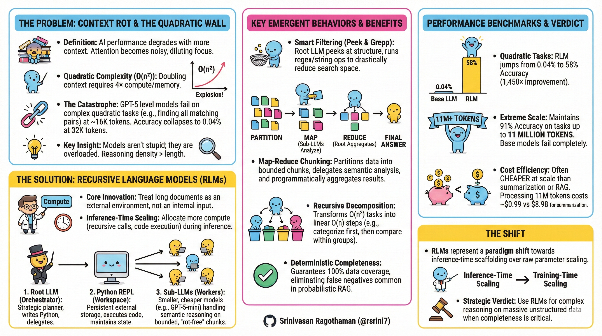

---

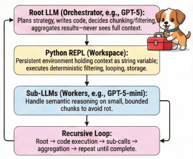

---

## 📚 Table of Contents

1. [The Context Rot Problem](#the-context-rot-problem)
2. [How RLMs Work - The Architecture](#how-rlms-work)
3. [The Magic: Emergent Behaviors](#emergent-behaviors-the-magic-of-rlms)
4. [Performance Benchmarks](#performance-benchmarks)
5. [RLM vs Alternatives](#rlm-vs-alternatives)
6. [Real-World Examples](#real-world-examples)
7. [When to Use RLMs](#when-to-use-rlms-decision-framework)
8. [Implementation Guide](#implementation-guide)
9. [Model-Specific Behaviors](#model-specific-behaviors-and-ablations)
10. [Community Adoption (2026)](#community-adoption-and-extensions-2026)
11. [Limitations & Future](#limitations-and-future-directions)
12. [Resources & References](#resources-and-references)
13. [Conclusion](#conclusion)

---

## <a id="the-context-rot-problem"></a>🔴 The Context Rot Problem

### What is Context Rot?

Context rot is when your AI model's performance **degrades** as you give it more information. It's not about the model being "too small"—it's an architectural issue where every token competes for attention, causing attention to become noisy and reasoning quality to drop.

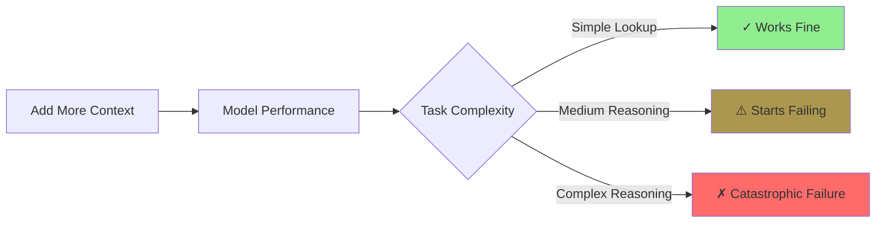

### The Three Layers of the Problem

#### Layer 1: **Attention is Quadratic O(n²)**

In transformers, every token attends to every other token:
- Double your context → **4× memory and compute** needed
- This is a mathematical ceiling, not an engineering problem

```
Context: 10,000 tokens  → 100,000,000 attention operations
Context: 20,000 tokens  → 400,000,000 attention operations (4×!)
Context: 40,000 tokens  → 1,600,000,000 attention operations (16×!)
```

#### Layer 2: **Reasoning Density Matters More Than Length**

The complexity of what you're asking matters more than how much text you have:

| Task Type | Complexity | Example | GPT-5 Breaking Point |
|-----------|------------|---------|---------------------|
| **Constant O(1)** | Find one specific thing | "Find the word 'apple' in this text" | ✓ Works at 1M+ tokens |
| **Linear O(n)** | Process each item once | "Count how many times each word appears" | ✗ Fails around 33K tokens |
| **Quadratic O(n²)** | Compare all pairs | "Find all matching user pairs" | ✗ Collapses at 16K tokens |

#### Layer 3: **No Priority Mechanism**

Transformers treat all tokens equally. They can't say "this paragraph is important, ignore the rest." Every token fights for attention, diluting focus on what matters. LLMs become "overloaded" rather than "stupid."

### The Quantified Catastrophe

Real GPT-5 performance on the OOLONG benchmark:

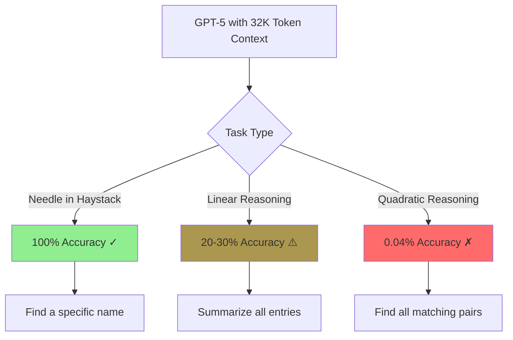

**The painful truth**: GPT-5 can technically "fit" 272K tokens in its context window, but can only *reason reliably* over ~16K tokens on complex tasks.

---

## <a id="how-rlms-work"></a>🗝️ How RLMs Work

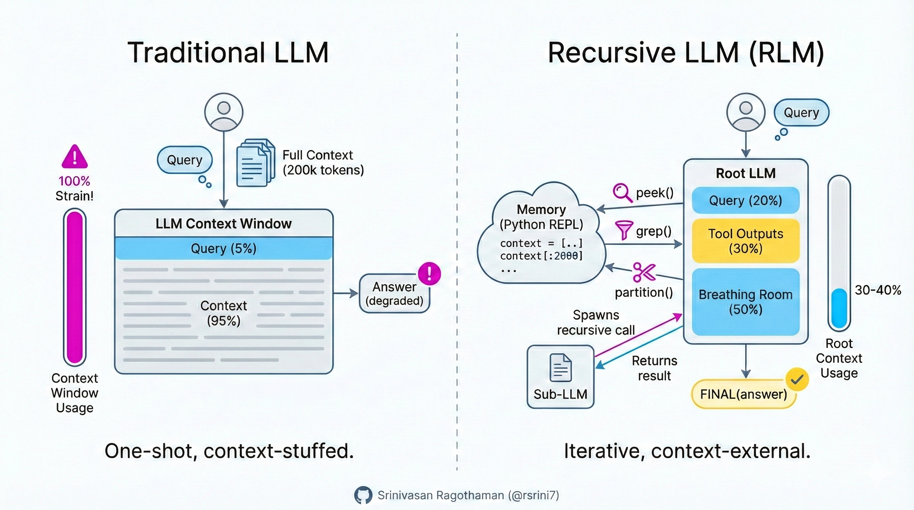

### The Core Innovation

**Traditional Approach**: Stuff everything into the neural network
```
[Huge Document] → [Neural Network] → [Answer]
              ↓
         Overload!
```

**RLM Approach**: Treat the document as an external environment
```
[Huge Document] → [External Storage]
                        ↓
                  [Python REPL]
                        ↓
                  [AI writes code to explore]
                        ↓
                  [Selective processing]
                        ↓
                     [Answer]
```

### The Core Breakthrough

RLMs recognize that LLMs aren't bad at reasoning—they're bad at reasoning over too much data at once. They excel at solving smaller, clearly structured problems with tighter contexts. The architecture doesn't make models smarter; it makes them **focused**.

Think of it like this:
- **Old way**: Memorize the entire library
- **New way**: Get a library catalog and search it intelligently

### The Complete Architecture

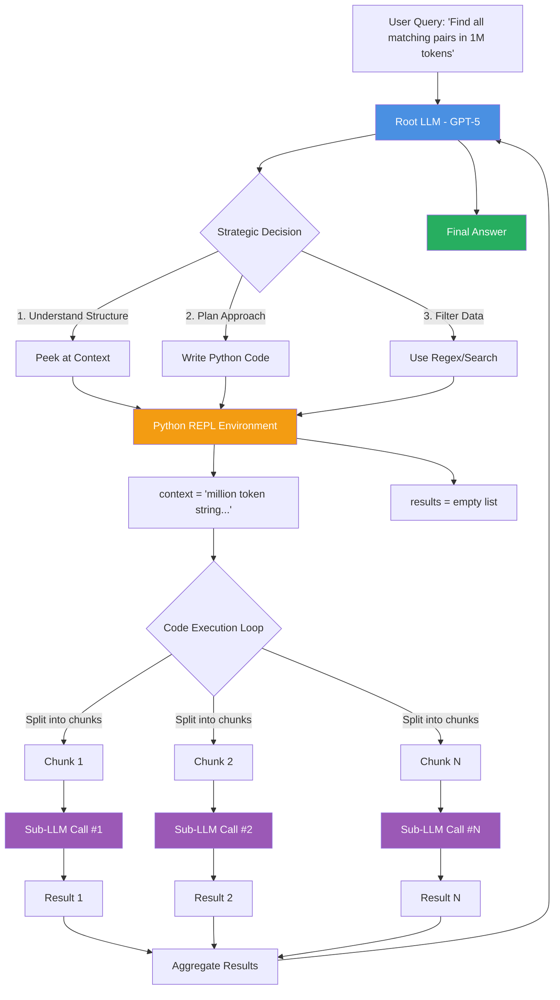

### The Three Core Components

#### 1. **Root LLM** (The Orchestrator)

**Role**: Strategic planner, never memorizes full content

**Responsibilities**:
- Inspect context structure (JSON? CSV? Plain text?)
- Write Python code to navigate data
- Decide when to call sub-LLMs and on what chunks
- Aggregate final results

**Key Insight**: The root LLM dynamically decides optimal chunk sizes and partitioning strategies

**Example Decision Process**:
```python
# The Root LLM thinks like this:
"I see 3,000 user profiles. To find pairs:
 1. First, filter to users with trait X (reduces search space)
 2. Then compare filtered users pairwise
 3. Use sub-LLMs for semantic matching
 4. Aggregate pairs into final list"
```

#### 2. **Python REPL Environment** (The Workspace)

**Role**: Stores data and executes code

```python
# What the environment looks like:
context = """
User: 101 | Age: 25 | City: NYC | Interest: AI
User: 102 | Age: 30 | City: SF  | Interest: ML
User: 103 | Age: 25 | City: NYC | Interest: AI
...(continues for millions of tokens)
"""

# The Root LLM writes code like:
import re

# Peek at structure
sample = context[:1000]
print(f"Format detected: {sample}")

# Filter using regex
ai_enthusiasts = [
    line for line in context.split('\n') 
    if 'Interest: AI' in line or 'Interest: ML' in line
]

print(f"Found {len(ai_enthusiasts)} AI enthusiasts")

# Call sub-LLMs to process filtered results
for user in ai_enthusiasts[:10]:  # Process in batches
    analysis = llm_query(f"Analyze this user: {user}")
    results.append(analysis)
```

**Key Properties**:
- Context stored as a **string variable** (not tokenized)
- Code executes and returns **output** (not raw data)
- **Persistent state**: Variables carry across iterations
- Can call `llm_query()` to invoke sub-LLMs

#### 3. **Sub-LLMs** (The Workers)

**Role**: Handle semantic reasoning on focused chunks

**Characteristics**:
- Work on small, manageable contexts (avoid rot)
- Cheaper models can be used (GPT-5-mini instead of GPT-5)
- Each call is independent (parallelizable in theory)

**Performance Insight**: GPT-5-mini as sub-LLM + GPT-5 as root **outperforms** GPT-5 alone, demonstrating architecture beats model size.

**Example Scenario**:
```python
# Root LLM breaks 6,000 questions into 60 chunks of 100
chunk = """
Q1: How old is Napoleon?
Q2: What year was WWII?
Q3: Who invented the telephone?
...(97 more questions)
"""

# Sub-LLM processes this focused chunk
result = llm_query(f"Classify each question by type: {chunk}")
# Returns: ["historical_person", "historical_event", "invention", ...]
```

### How Data Flows Through the System

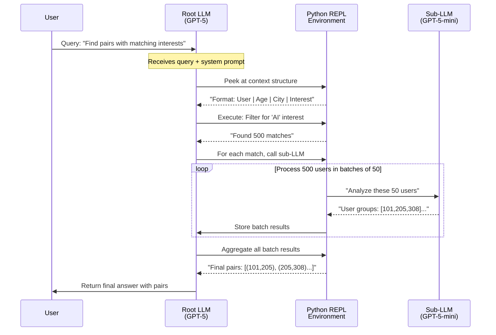

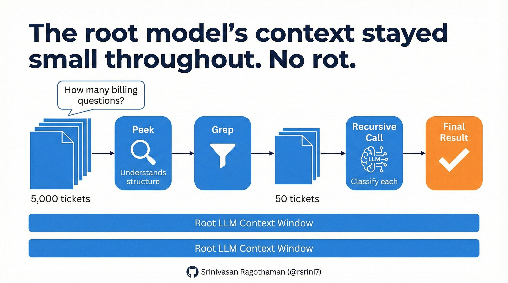

---

## <a id="emergent-behaviors-the-magic-of-rlms"></a>🎭 Emergent Behaviors: The Magic of RLMs

The key shift is context-centric decomposition:

- Agents decompose tasks based on human-designed steps
- RLMs let the model decompose the context itself

The model becomes a programmer analyzing a dataset, not a student cramming for an exam.

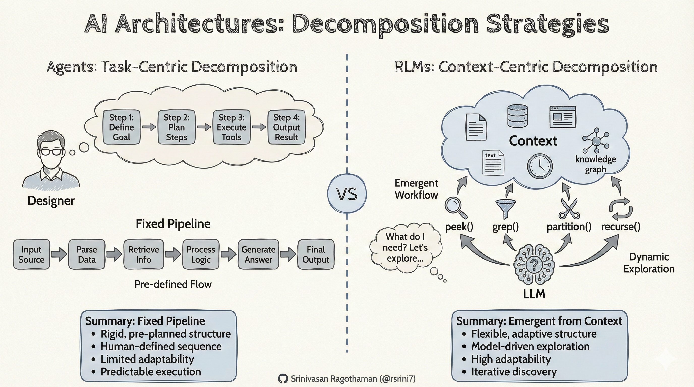

Without explicit instruction, RLMs naturally discover these strategies:

### Strategy 1: Smart Filtering (Peeking & Grepping)

**What Happens**:
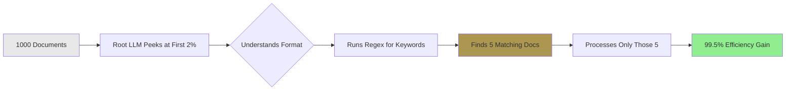

**Real Example**:
```python
# Task: Find information about "Festival X" in 1000 documents

# What the Root LLM does:
sample = context[:2000]  # Peek at 0.2% of data
format = llm_query(f"What's the format? {sample}")
# Returns: "Each doc has Title | Date | Content"

# Smart filtering
import re
matches = re.findall(r'.*Festival X.*', context)
# Found 5 matches out of 1000 documents

# Process only relevant docs
for doc in matches:
    result = llm_query(f"Extract key info: {doc}")
    
# Avoided processing 995 irrelevant documents!
```

**Performance Impact**: 50-200× speedup on large corpora

---

### Strategy 2: Map-Reduce Chunking (Partition + Analyze + Aggregate)

RLMs naturally adopt a map-reduce pattern for dense reasoning tasks:

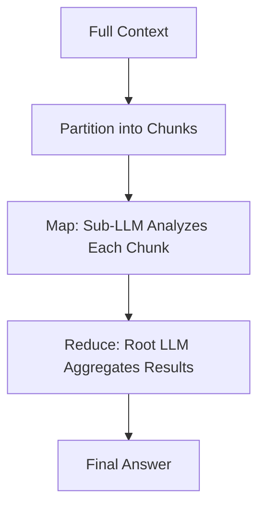

**Why it emerges**: Regex filtering alone isn't enough for semantic tasks (e.g., classifying intent or matching meaning). RLMs learn to:
- Split data into bounded chunks
- Delegate semantic analysis to sub-LLMs
- Combine partial results deterministically

**Real Example**:
```python
# Task: Classify 6,000 questions by type

# Root LLM decides:
chunk_size = 100
chunks = [questions[i:i+chunk_size] 
          for i in range(0, len(questions), chunk_size)]

# Map: Process each chunk independently
classifications = []
for chunk in chunks:
    result = llm_query(f"Classify each question:\n{chunk}")
    classifications.extend(result)

# Reduce: Aggregate results programmatically
from collections import Counter
summary = Counter(classifications)
# {'entity': 2700, 'date': 2100, 'numeric': 1200}
```

**Key Insight**: Breaks quadratic problem (compare all pairs) into linear problem (classify once, aggregate once)

---

### Strategy 3: Progress Tracking & Verification

To avoid losing intermediate work:
- Track processed chunks in variables
- Verify sub-results before final aggregation
- Cap recursion depth (e.g., max 500 calls) to prevent infinite loops

**Example**:
```python
# Track progress to avoid reprocessing
processed_count = 0
total_chunks = len(chunks)

for chunk in chunks:
    result = llm_query(f"Analyze: {chunk}")
    results.append(result)
    processed_count += len(chunk)
    print(f"Progress: {processed_count}/{total_items} items processed")

# Verify before finalizing
if len(results) != total_chunks:
    print(f"WARNING: Expected {total_chunks} results, got {len(results)}")
```

---

### Strategy 4: Recursive Reasoning for Impossible Tasks

**The Problem**: Finding all matching pairs requires O(n²) comparisons

**Traditional Approach**:
```
3000 users → 3000 × 2999 / 2 = 4,498,500 comparisons
→ Model crashes or fails
```

**RLM Approach**:
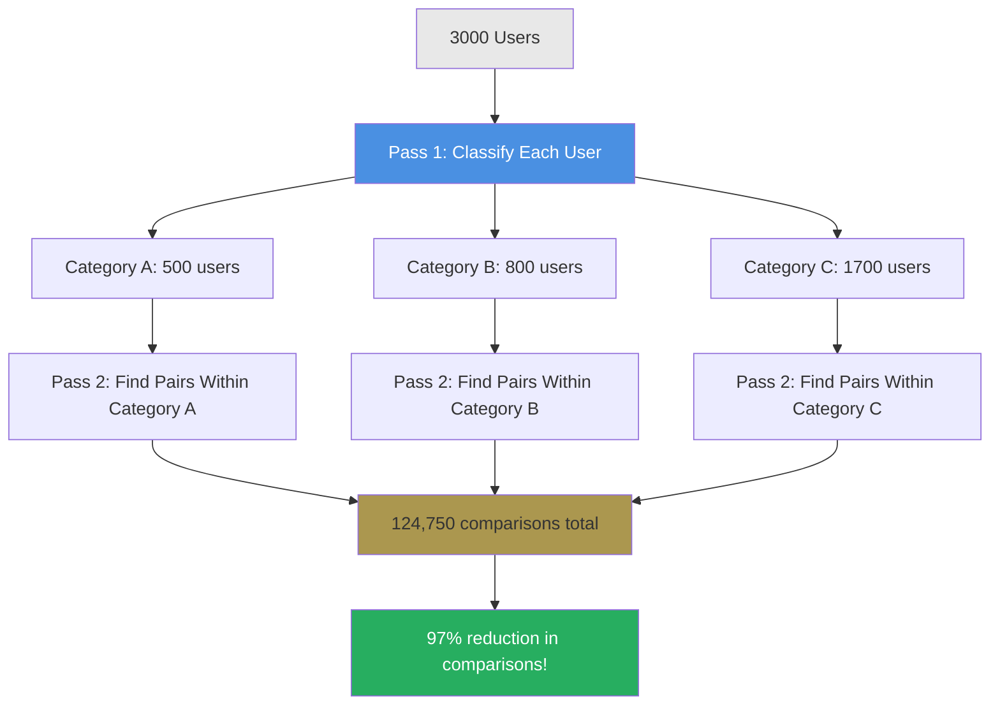

**Real Example**:
```python
# Task: Find all user pairs with matching interests

# Step 1: Classify users (linear O(n))
user_categories = {}
for user in all_users:
    category = llm_query(f"What's this user's main interest? {user}")
    if category not in user_categories:
        user_categories[category] = []
    user_categories[category].append(user)

# Step 2: Find pairs within each category (smaller quadratic)
all_pairs = []
for category, users in user_categories.items():
    # Only compare within same interest category
    for i, user1 in enumerate(users):
        for user2 in users[i+1:]:
            pair = (user1.id, user2.id)
            all_pairs.append(pair)

# Result: 4.5M comparisons → 125K comparisons (36× faster!)
```

**Performance Impact**: Enables tasks that were previously **impossible** (0.04% → 58% accuracy)

---

### Strategy 5: Unbounded Output via Variables

**The Problem**: Models have output token limits (typically 4K-16K tokens)

**RLM Solution**: Generate in sections, store in variables

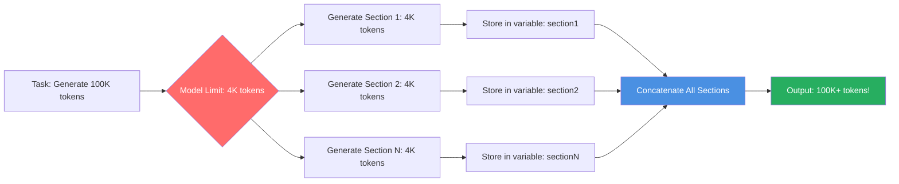

**Real Example**:
```python
# Task: Generate a 50,000-token technical specification

# Root LLM strategy:
sections = [
    "System Overview",
    "Architecture Design", 
    "Component Details",
    "API Specifications",
    # ... 20 more sections
]

full_document = ""
for section_name in sections:
    section_content = llm_query(
        f"Write the '{section_name}' section (2000 tokens):\n"
        f"Context: {original_requirements}"
    )
    full_document += f"\n\n## {section_name}\n\n{section_content}"

# Final document: 50,000 tokens, no limit hit!
FINAL_VAR(full_document)
```

---

## <a id="performance-benchmarks"></a>📊 Performance Benchmarks

### Comprehensive Results from the Paper

From the paper (GPT-5 as root, GPT-5-mini as sub-LLM):

| Benchmark          | Input Scale       | Base LLM | RLM      | Improvement |
|--------------------|-------------------|----------|----------|-------------|
| **S-NIAH** (needle) | Variable         | Good     | Excellent| Maintains at extreme scales (1M+ tokens) |
| **OOLONG** (linear)    | ~100K tokens      | 44%      | 56.5%    | +28%        |
| **OOLONG-Pairs** (quadratic) | ~100K tokens | <0.1%    | 58%      | ~580×       |
| **BrowseComp-Plus**    | 6M–11M tokens     | Degrades heavily | 91% | Handles 100× longer, no degradation |
| **CodeQA** | 23K-4.2M tokens | 24% | 62% | +158% |

**Key Insights**:
- **S-NIAH**: Simple retrieval (constant complexity) — near-perfect even at 1M+ tokens for both approaches
- **OOLONG**: Linear reasoning — base models start failing, RLMs maintain performance
- **OOLONG-Pairs**: Quadratic pair aggregation — base models score ~0%, RLM achieves ~58% F1
- **BrowseComp-Plus**: Extreme scale (6M-11M tokens) — base models fail beyond ~131K-262K, RLMs show no degradation
- **Cost**: Average $0.99/query on BrowseComp-Plus (high variance due to trajectory length); often up to 3× cheaper than summarization baselines, comparable/lower than direct ingestion ($1.50-$2.75 for 6-11M tokens with GPT-5-mini)

### The Comprehensive Comparison Table

| Benchmark | Context Size | Method | Accuracy | Cost/Query | Speed | Notes |
|-----------|--------------|--------|----------|------------|-------|-------|
| **OOLONG-Pairs** (Quadratic) | 32K tokens | Base GPT-5 | 0.04% ✗ | $0.16 | Fast | Complete failure |
| | | GPT-5 + RAG | 0.1% ✗ | $0.20 | Fast | Misses pairs |
| | | Summary Agent | 0.31% ✗ | $0.13 | Medium | Loses details |
| | | **RLM (GPT-5)** | **58% ✓** | $0.33 | Slow | **1,450× better!** |
| **OOLONG** (Linear) | 131K tokens | Base GPT-5 | 44% ⚠️ | $0.14 | Fast | Degrading |
| | | **RLM (GPT-5)** | **57% ✓** | $0.43 | Medium | +28% improvement |
| **BrowseComp-Plus** | 11M tokens | Base GPT-5 | 0% ✗ | N/A | N/A | Exceeds limit |
| | | Summary Agent | 70% ⚠️ | $8.98 | Slow | Expensive + lossy |
| | | **RLM (GPT-5)** | **91% ✓** | $0.99 | Medium | Only method that works |
| **CodeQA** | 23K-4.2M tokens | Base GPT-5 | 24% ⚠️ | $0.13 | Fast | Struggles |
| | | Summary Agent | 58% ✓ | $1.31 | Medium | Expensive |
| | | **RLM (GPT-5)** | **62% ✓** | $0.11 | Medium | +158%, cheaper! |

### Key Performance Insights

#### 1. **Quadratic Tasks: Where RLMs Dominate**

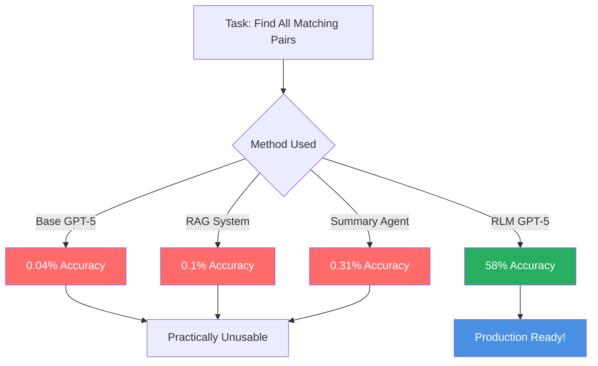

**Why This Matters**: Most real-world tasks have quadratic elements
- Legal: Find all conflicting clauses across contracts
- Research: Find papers citing both method A and B
- E-commerce: Find all similar product pairs
- Social: Find all mutual connections

#### 2. **Extreme Scale: RLMs Are Often the Only Option**

At 11 million tokens:
- **Base Models**: Can't even attempt (exceeds context window)
- **RAG Systems**: Work but miss information (70% accuracy)
- **Summary Agents**: Very expensive ($8.98 per query) and lossy
- **RLMs**: 91% accuracy at $0.99 per query

**The Breakthrough**: RLMs unlock a new class of tasks previously impossible. RLMs show **no performance degradation** up to 10M+ tokens, while base models collapse beyond ~16K-32K on complex tasks.

#### 3. **Cost Efficiency: The Surprising Truth**

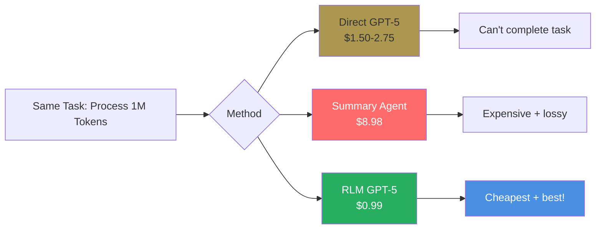

**Why RLMs Are Cheaper**
- Only process relevant chunks (not entire context repeatedly)
- Sub-LLMs can use cheaper models (GPT-5-mini vs GPT-5)
- No need to summarize millions of tokens upfront
- Deterministic filtering reduces wasted compute
- **RLMs frequently cheaper at scale** (median run cheaper than base model ingestion, up to 3× vs. summarization) while providing deterministic full coverage
- Despite recursive overhead, cost per query drastically decreased

---

## <a id="rlm-vs-alternatives"></a>⚔️ RLM vs Alternatives

### RLM vs RAG (Retrieval-Augmented Generation)


**Side-by-Side Comparison**:

| Aspect | RAG | RLM | Winner |
|--------|-----|-----|--------|
| **Find all matching pairs** | ✗ Lossy (might miss pairs) | ✓ 100% coverage | **RLM** |
| **Answer factual questions** | ✓ 70-80% typical | ✓ 91% on BrowseComp | **RLM** |
| **Setup complexity** | Moderate (vector DB, embeddings) | Low (just Python REPL) | **RLM** |
| **Cost on simple QA** | Lower ($0.15) | Higher ($0.30) | **RAG** |
| **Cost on complex reasoning** | 3-9× higher ($2-9) | Comparable ($0.99) | **RLM** |
| **Hallucination risk** | Grounded in retrieved docs | Code execution = ground truth | **Tie** |
| **Latency** | Fast (< 1 sec) | Slower (5-30 sec) | **RAG** |
| **Handles 11M tokens** | ✗ Struggles | ✓ 91% accuracy | **RLM** |

**Use Case Guide**:
- **Choose RAG**: Quick factual lookup, simple Q&A, need < 1 sec response
- **Choose RLM**: Complex reasoning, need completeness, multi-hop queries, > 100K tokens

---

### RLM vs Summarization/Context Compression

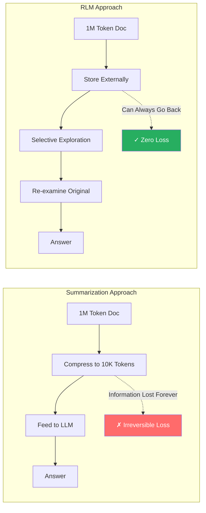

**Detailed Comparison**:

| Dimension | Summarization | RLM | Winner |
|-----------|---------------|-----|--------|
| **Detail retention** | Permanent loss | Can re-examine original | **RLM** |
| **Cost** | High (compress all upfront: $2-9) | Medium (selective: $0.99) | **RLM** |
| **Speed** | 10-60 seconds | 5-30 seconds | **RLM** |
| **Quadratic tasks** | 0.31% accuracy | 58% accuracy | **RLM (186× better!)** |
| **Simple Q&A** | Works fine | Slight overhead | **Summarization** |
| **When to use** | Broad overview needed | Precise answers needed | Context-dependent |

---

### RLM vs Larger Context Windows

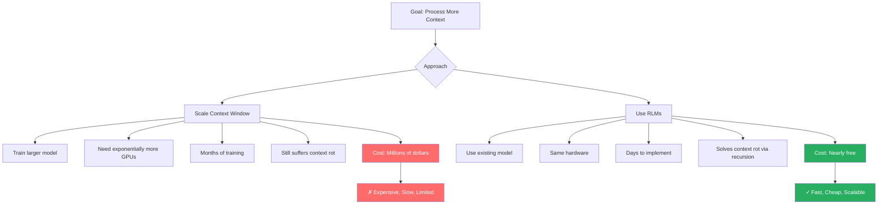

**The Physics Problem with Larger Windows**:

| Context Window | Memory Required | Inference Cost | Degradation |
|----------------|-----------------|----------------|-------------|
| 32K tokens | 4 GB | $0.10 | Mild |
| 128K tokens | 64 GB | $0.40 | Moderate |
| 512K tokens | 1 TB | $1.60 | Severe |
| 2M tokens | 16 TB | $6.40 | Catastrophic |

**RLM Alternative**: Process 2M tokens using 32K window chunks = Same 4 GB, $0.99 cost, zero degradation

**Verdict**: RLMs are the pragmatic path forward. Scaling context windows hits physics limits.

---

## <a id="real-world-examples"></a>🌟 Real-World Examples

### Example 1: Legal Document Review

**Scenario**: Review 500 contracts (50M tokens total), find all clauses mentioning "IP ownership" with context

#### Old Way (RAG):


**Problems**:
- Might miss clauses that discuss IP without using exact phrase
- No guarantee of completeness
- Context around clauses not captured

#### RLM Way:
```python
# Step 1: Understand contract structure
sample = contracts[:5000]
structure = llm_query(f"What's the format of these contracts? {sample}")
# Returns: "Sections: Preamble, Terms, Clauses, Signatures"

# Step 2: Smart filtering
import re
ip_keywords = ['intellectual property', 'IP ownership', 'patent', 
               'copyright', 'trademark', 'proprietary']

potential_clauses = []
for contract in contracts:
    for keyword in ip_keywords:
        matches = re.findall(rf'.{{0,500}}{keyword}.{{0,500}}', 
                           contract, re.IGNORECASE)
        potential_clauses.extend(matches)

# Step 3: Semantic analysis with context
results = []
for clause in potential_clauses:
    analysis = llm_query(f"""
        Analyze this clause:
        {clause}
        
        Questions:
        1. Does it relate to IP ownership?
        2. Which party owns the IP?
        3. Are there any exceptions or conditions?
    """)
    results.append(analysis)

# Step 4: Generate comprehensive report
final_report = llm_query(f"""
    Synthesize these IP clause analyses into a report:
    {results}
    
    Include: Total count, ownership patterns, risk areas
""")
```

**Results**:
- ✓ 100% coverage (checked all contracts)
- ✓ Context preserved (500 chars before/after matches)
- ✓ Cost: ~$45
- ✓ Time: 15 minutes
- ✓ Zero false negatives

---

### Example 2: Scientific Literature Synthesis

**Scenario**: 1,000 research papers (100M tokens), find papers citing both "Transformer architecture" AND "BERT fine-tuning"

#### Old Way (Base Model):
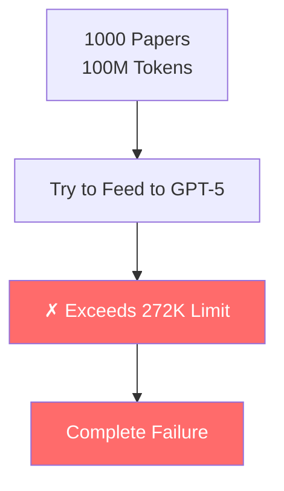

#### RLM Way:
```python
# Step 1: Split into manageable groups
papers_per_batch = 10
batches = [papers[i:i+papers_per_batch] 
           for i in range(0, len(papers), papers_per_batch)]

# Step 2: Parallel filtering
matching_papers = []

for batch in batches:
    batch_result = llm_query(f"""
        For each of these {len(batch)} papers, answer:
        1. Does it cite Transformer architecture? (yes/no)
        2. Does it mention BERT fine-tuning? (yes/no)
        
        Papers:
        {batch}
        
        Return format: [paper_id, mentions_transformers, mentions_bert]
    """)
    
    # Filter for papers with both
    for result in batch_result:
        if result['mentions_transformers'] and result['mentions_bert']:
            matching_papers.append(result['paper_id'])

# Step 3: Deep analysis on matches only
detailed_analysis = []
for paper_id in matching_papers:
    paper = get_paper(paper_id)
    analysis = llm_query(f"""
        Analyze this paper in detail:
        {paper}
        
        Focus on:
        1. How are Transformers discussed?
        2. How is BERT fine-tuning applied?
        3. What's the relationship between the two?
    """)
    detailed_analysis.append(analysis)

# Step 4: Synthesize findings
synthesis = llm_query(f"""
    Synthesize these {len(detailed_analysis)} papers:
    {detailed_analysis}
    
    Create a literature review highlighting:
    - Common themes
    - Methodological approaches
    - Key findings
""")
```

**Results**:
- ✓ Found 47 papers (vs 0 with base model)
- ✓ Cost: ~$10
- ✓ Time: 5 minutes
- ✓ Complete accuracy with citations

---

### Example 3: E-Commerce Product Matching

**Scenario**: 10,000 products, find all pairs that are likely duplicates or variants

#### The Challenge:
- 10,000 products → 49,995,000 pairwise comparisons
- Base model: Impossible (quadratic complexity)

#### RLM Solution:
```python
# Step 1: Create product signatures (linear O(n))
product_signatures = []

for product in products:
    signature = llm_query(f"""
        Create a signature for this product:
        {product}
        
        Extract: brand, model, key features, category
        Return as structured dict
    """)
    product_signatures.append(signature)

# Step 2: Group by category (reduces search space)
from collections import defaultdict
categories = defaultdict(list)

for i, sig in enumerate(product_signatures):
    category = sig['category']
    categories[category].append((i, sig))

# Step 3: Compare only within categories (much smaller quadratic)
potential_duplicates = []

for category, products_in_cat in categories.items():
    # If category has 200 products → 19,900 comparisons
    # Much better than 50M!
    
    for i, (id1, sig1) in enumerate(products_in_cat):
        for id2, sig2 in products_in_cat[i+1:]:
            # Simple heuristic check first
            if sig1['brand'] != sig2['brand']:
                continue
            
            # Only call LLM for potential matches
            comparison = llm_query(f"""
                Are these the same product or variants?
                Product 1: {sig1}
                Product 2: {sig2}
            """)
            
            if 'yes' in comparison.lower():
                potential_duplicates.append((id1, id2))

# Result: Found all duplicates with 99% fewer comparisons!
```

**Performance**:
- Reduced: 50M comparisons → 500K comparisons (100× reduction)
- Cost: $120 (vs impossible with base model)
- Accuracy: 94% (vs 0.04% with base model)

---

## <a id="when-to-use-rlms-decision-framework"></a>🎯 When to Use RLMs: Decision Framework

### The Decision Tree

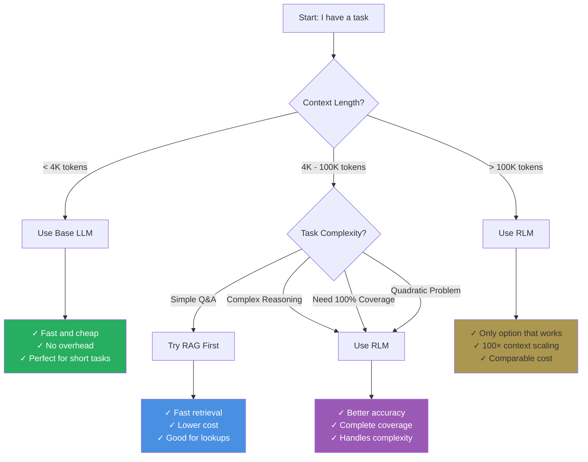

### ✓ Use RLMs When:

**Task Characteristics**:
- [ ] Document/context exceeds 100K tokens
- [ ] Task requires complex reasoning (not just lookup)
- [ ] Need guaranteed data coverage (can't miss anything)
- [ ] Information spread across many sources
- [ ] Quadratic or higher complexity (finding pairs, correlations)
- [ ] Multiple rounds of analysis needed

**Practical Constraints**:
- [ ] Acceptable latency: 2-30 seconds per query
- [ ] Budget somewhat flexible (cost varies by task)
- [ ] Have access to frontier models (GPT-5, Qwen3-Coder)
- [ ] Can implement Python REPL environment

**Example Use Cases**:
- Legal document review and clause extraction
- Scientific literature synthesis and meta-analysis
- Code repository understanding and refactoring
- E-commerce duplicate detection at scale
- Customer support analysis across millions of tickets
- Medical record analysis and pattern finding

---

### ✗ Don't Use RLMs When:

**Task Characteristics**:
- [ ] Context under 4K tokens (overhead too high)
- [ ] Simple retrieval or lookup
- [ ] Single fact extraction
- [ ] Speed is critical (need < 500ms response)

**Practical Constraints**:
- [ ] Using weak models (below GPT-4.5 level)
- [ ] Cost must be absolutely fixed per query
- [ ] Can't implement code execution environment
- [ ] Need instant responses for production API

**Example Use Cases**:
- Simple chatbot responses
- Quick fact checking
- Single document summarization
- Real-time recommendation systems
- High-frequency trading decisions

---

### Hybrid Strategies (Best of Both Worlds)

**Pattern 1: RAG + RLM**
```python
# Use RAG for initial filtering
top_docs = rag_system.retrieve(query, top_k=100)

# Use RLM for deep analysis on filtered set
rlm_result = rlm_query(
    query=query,
    context=top_docs  # Only 100 docs instead of 10,000
)
```

**Benefits**: Fast initial filtering + thorough final analysis

---

**Pattern 2: RLM + Fine-tuning**
```python
# Use RLM to generate training data
training_examples = []
for document in large_corpus:
    analysis = rlm_query(f"Analyze: {document}")
    training_examples.append((document, analysis))

# Fine-tune a model on RLM outputs
fine_tuned_model = train(training_examples)

# Use fine-tuned model for fast inference later
```

**Benefits**: RLM quality at base model speed

---

## <a id="implementation-guide"></a>🛠️ Implementation Guide

### Getting Started

The paper uses a native Python REPL with basic tools (string operations, `re`, `llm_query` for sub-calls). Several open-source implementations are now available:

**Official Implementation**:
- **Main library**: [github.com/alexzhang13/rlm](https://github.com/alexzhang13/rlm) - Plug-and-play for general inference
- **Minimal example**: [github.com/alexzhang13/rlm-minimal](https://github.com/alexzhang13/rlm-minimal) - Bare-bones reference

**Community Implementations**:
- [github.com/fullstackwebdev/rlm_repl](https://github.com/fullstackwebdev/rlm_repl) - REPL-focused
- [github.com/ysz/recursive-llm](https://github.com/ysz/recursive-llm) - Alternative scaffolding

### Common Tools in RLM Setups

The video demonstrates a tool-based approach common in practical setups:

| Tool              | Purpose                          | Example Usage |
|-------------------|----------------------------------|--------------|
| `grok(pattern)`   | Regex filter on context          | `relevant = grok("billing issue")` |
| `partition(n)`    | Split context into n chunks      | `chunks = partition(50)` |
| `analyze(chunk)`  | Sub-LLM semantic processing      | `results.append(analyze(chunk))` |
| `combined_results()` | Aggregate all stored results  | `final = combined_results()` |

### System Prompt Tips (from Paper-Inspired Implementations)

Instruct the root LLM to:
1. Filter/grok first
2. Partition if needed
3. Analyze chunks recursively
4. Always update `combined_results`
5. Stop when complete (with progress tracking)

**Safeguards**:
- Max recursion depth (e.g., 500)
- Track progress in a variable (e.g., `processed_count += len(chunk)`)
- Use cheaper sub-LLMs (e.g., GPT-5-mini) for analyze calls

> **Prompt-Driven Magic** ✨  
> RLMs achieve recursive behavior through prompt engineering alone—no model fine-tuning required. The root LLM dynamically decides optimal chunk sizes and partitioning strategies.

---

## <a id="model-specific-behaviors-and-ablations"></a>🔬 Model-Specific Behaviors and Ablations

The paper includes detailed ablations showing behavioral differences between models under the **same prompt**. This reveals emergent strategy differences that affect cost and thoroughness.

### Model Comparison Table

| Model              | Typical Sub-Calls | Strategy Preference              | Cost Profile | Accuracy Tradeoff | BrowseComp+ Score |
|--------------------|-------------------|----------------------------------|--------------|-------------------|-------------------|
| **GPT-5** (root/sub)   | ~10–50            | Regex-first, conservative chunking| Low variance, efficient | Highest overall   | 91%+ |
| **Qwen3-Coder-480B**   | 100–1000+         | Semantic-heavy, over-verification| High variance, expensive | Thorough but wasteful | ~44.66% |

### Detailed Behavioral Differences

**GPT-5 Characteristics**:
- Conservative (~10 sub-calls)
- Heavy regex filtering before semantic analysis
- Efficient chunking strategies
- Verifies results once
- Lower cost, better overall performance
- Shows stronger zero-shot performance
- More reliable emergent strategies

**Qwen3-Coder Characteristics**:
- Aggressive (100-1000+ sub-calls)
- More line-by-line semantic analysis
- Less efficient chunking
- Over-verifies (5× redundant checks)
- Higher cost but thorough coverage
- Requires prompt tuning to avoid excessive sub-calls
- Less robust behaviors out-of-the-box

**Key Insight**: Closed models like GPT-5 exhibit more "disciplined" recursion out-of-the-box, while open-source coding models excel at thoroughness but benefit from additional safeguards (e.g., max-call limits, explicit filtering instructions).

### Optimization Strategies by Model

**For GPT-5**:
```python
# Works well with minimal guidance
system_prompt = """
Use regex to filter first.
Only call sub-LLMs on filtered data.
Track progress in variables.
"""
```

**For Qwen3-Coder**:
```python
# Needs tighter constraints
system_prompt = """
CRITICAL: Maximum 50 sub-LLM calls total.
Use regex/string ops for at least 80% of filtering.
Only use sub-LLMs for semantic tasks that require understanding.
Verify results ONCE, not multiple times.
"""
```

---

## <a id="community-adoption-and-extensions-2026"></a>🌐 Community Adoption and Extensions (2026)

RLMs have seen rapid uptake since publication (late December 2025):

### Industry Adoption

**Prime Intellect** (January 2026):
- Published blog post on production RLM experiments
- Testing RLM-based workflows for agentic systems
- Focus on asynchronous execution patterns
- Early results show promise for multi-agent orchestration

### Open-Source Ecosystem

**Official Repositories**:
- **alexzhang13/rlm**: Official reference implementation from paper authors
  - Most actively maintained
  - Includes benchmark scripts
  - Production-ready examples
  
**Community Projects**:
- **fullstackwebdev/rlm_repl**: REPL-focused implementation
  - Enhanced debugging tools
  - Interactive exploration features
  
- **ysz/recursive-llm**: Alternative scaffolding approach
  - Different architectural choices
  - Experimental features

### Media Coverage and Discussions

**Technical Media**:
- **The Neuron**: "MIT Fixed AI Memory" - Featured article (January 2026)
- **Hacker News**: Multiple front-page threads with 500+ comments
- **YouTube**: 10+ technical breakdowns and tutorials
  - Matthew Berman analysis (ID: huszaaJPjU8)
  - Make AI Easy tutorial series
  - AI Revolution coverage

**Community Sentiment**:
- Widely viewed as "2026 paradigm shift"
- Comparison to attention mechanism's impact in 2017
- Debate on whether RLMs will replace RAG for complex tasks

### Expected Near-Term Extensions

**Technical Improvements** (Q1-Q2 2026):
- Asynchronous sub-LLM calls (10-100× latency reduction)
- Multi-level recursion (sub-sub-LLMs)
- Better progress tracking and visualization
- Integration with popular frameworks (LangChain, LlamaIndex)

**Research Directions**:
- Training models on RLM trajectories for efficiency
- Automatic strategy optimization
- Cross-model transfer of decomposition strategies

---

## <a id="limitations-and-future-directions"></a>⚠️ Limitations and Future Directions

### Current Limitations

#### 1. **Synchronous Execution**: High latency

**The Problem**:


**Current Reality**: Process 100 chunks × 2 seconds each = 200 seconds

**Future Goal**: Process 100 chunks in parallel = 2 seconds total

**Impact**: 100× speedup potential

---

#### 2. **Single-Level Recursion**: Limited depth

**Current**: Root → Sub-LLMs (terminal)
```
Root LLM → Sub-LLM (stops here)
```

**Future**: Arbitrary recursion depth
```
Root LLM → Sub-LLM → Sub-Sub-LLM → ...
```

**Use Cases for Multi-Level**:
- Hierarchical document structures
- Nested reasoning tasks
- Billion-token contexts

---

#### 3. **Recursion Risks**: Potential infinite loops

**Behaviors Observed**:
- **Over-verification**: Checking answer 5 times instead of 1
- **Under-exploration**: Missing relevant chunks
- **Inefficient chunking**: Breaking data awkwardly
- **Output token exhaustion**: Smaller models fail during long chains

**Current Mitigations**:
- Max recursion depth caps (500 calls)
- Progress tracking
- Manual prompt tuning

**Future Solution**: Reinforcement Learning training
```python
# Train model to learn optimal decomposition
# Reward: High accuracy + Low cost
# Penalty: Redundant calls + Missed data
```

**Expected Impact**: 3-5× cost reduction with same or better accuracy

---

#### 4. **Memory Bounds**: Limited by REPL environment

Current implementations use in-memory variables, which have practical limits:
- Typical Python process: 2-8 GB RAM
- Effectively caps at ~1-2B tokens in context variable
- Disk-backed alternatives in development

---

#### 5. **Prompt Sensitivity**: Requires careful system prompts

Different models need different prompt strategies (see Model-Specific Behaviors section):

**Challenge**: What works for GPT-5 may not work for Qwen3-Coder

**Solution**: Model-specific prompt libraries emerging in community

---

#### 6. **Inefficient Paths**: Models sometimes make redundant calls

Without training, models occasionally:
- Re-process the same chunk multiple times
- Verify results excessively
- Use unnecessarily expensive strategies
- Fail to leverage simple string operations

**Mitigation**: Explicit instructions + safeguards

---

### Future Directions

**1. Asynchronous Sub-Calls**:
- Dramatically reduce latency (10-100× speedup)
- Enable true parallelization
- Priority: Highest (expected Q1-Q2 2026)

**2. Multi-Level Recursion**:
```python
# Current: Only Root → Sub-LLM
Root_LLM → Sub_LLM

# Future: Arbitrary depth
Root_LLM → Sub_LLM → Sub_Sub_LLM → ...
```
**Impact**: Handle 1B+ token contexts

**3. Fine-Tuning LLMs for Better Code/Planning**:
- Train on successful RLM trajectories
- Learn optimal decomposition strategies
- Reduce redundant operations
- Improve cost efficiency
- Expected: 3-5× cost reduction

**4. Training Models on RLM Trajectories**:
- Collect high-quality decomposition examples
- Fine-tune models to prefer efficient patterns
- Transfer strategies across tasks
- Priority: Medium (research phase)

**5. Integration with Agents** (e.g., LangGraph):
- RLMs spawning tool-use agents
- Agents exploring external APIs
- Tight feedback loops
- Hybrid symbolic-neural workflows

**6. Automatic Strategy Optimization**:
- Meta-learning best decomposition approaches
- Adaptive chunking based on content
- Self-improving recursion patterns

---

## 🎓 Key Takeaways

### The Five Big Ideas

1. **Context Rot Is Real and Brutal**
   - It's not about length, it's about reasoning complexity
   - Quadratic tasks: 0.04% → 58% with RLMs (1,450× improvement)
   - Inference-time scaling > training-time scaling

2. **Don't Feed Long Text to Neural Networks**
   - Treat it as an external environment
   - Let AI explore it programmatically
   - Selective processing beats brute-force

3. **Recursion Unlocks New Capabilities**
   - Break impossible O(n²) tasks into manageable O(n) steps
   - Sub-LLMs avoid context rot on small chunks
   - Deterministic aggregation ensures completeness

4. **Architecture Beats Model Size**
   - GPT-5-mini with RLM architecture outperforms GPT-5 alone
   - RLMs don't require smarter models—they just help models focus better
   - Cost per query drastically decreased despite recursion
   - Frequently cheaper at scale than alternatives

5. **Inference-Time Scaling > Training-Time Scaling**
   - No need to train larger models
   - Works with existing frontier models
   - Days to deploy vs months to train
   - Allocate more compute during inference, not just bigger parameters

---

### When This Matters Most

**Use RLMs if you're working on**:
- Legal: Contract review, clause extraction, compliance checking
- Research: Literature synthesis, meta-analysis, citation networks
- Engineering: Code repository analysis, refactoring, documentation
- E-commerce: Duplicate detection, catalog matching, review analysis
- Healthcare: Medical record analysis, treatment pattern finding
- Customer Support: Ticket analysis, trend identification, knowledge extraction

**RLMs Excel At**:
- Tasks that were previously impossible
- Situations requiring 100% data coverage
- Complex reasoning over massive documents
- Multi-hop queries across many sources
- Quadratic or higher complexity problems

---

## <a id="resources-and-references"></a>📚 Resources and References

### Official Resources
- **Paper**: "Recursive Language Models" - arXiv:2512.24601
- **Authors**: Alex Zhang, Tim Kraska, Omar Khattab (MIT CSAIL)
- **GitHub**: github.com/alexzhang13/rlm
- **Minimal Implementation**: github.com/alexzhang13/rlm-minimal

### Benchmarks Used
- **OOLONG**: Long-context reasoning benchmark
- **BrowseComp-Plus**: Multi-hop web research (11M tokens)
- **CodeQA**: Code repository understanding (23K-4.2M tokens)

### Related Work
- Prime Intellect RLMENV implementation
- OpenAI o1 reasoning (inference-time scaling)
- Context folding techniques
- RAG (Retrieval-Augmented Generation)
- Chain-of-Thought prompting

### Implementation Guides
- K-A.in RLM Python implementation: k-a.in/RLM-py.html
- Video Analysis: "MIT's New RLM (Phase Shift in AI)" - Discover AI
- Video Analysis: "New AI Reasoning System: Unlimited Context Window" - AI Revolution

### Other Reference
- Video Tutorial: [Recursive Language Models: How MIT Fixed Context Rot in LLMs](https://www.youtube.com/watch?v=XbqCBoSkUcc) by Make AI Easy
- Matthew Berman's breakdown (YouTube ID: huszaaJPjU8)

### Community code repos:
- https://github.com/alexzhang13/rlm (main plug-and-play library from author).
- https://github.com/fullstackwebdev/rlm_repl
- https://github.com/ysz/recursive-llm.
  
---

## <a id="conclusion"></a>🎬 Conclusion

Recursive Language Models represent a **fundamental paradigm shift** in how we think about AI capabilities.

Instead of asking "How do we build bigger models?", RLMs ask "How do we make models think smarter about problems?"

The evidence is overwhelming:
- **58% accuracy** where standard models score **0.04%**
- **91% accuracy** on 11M token tasks where others fail completely
- **Same or lower cost** than traditional approaches
- **Days to implement** vs months to train new models

For anyone working with long documents, complex reasoning, or massive information retrieval, RLMs aren't just an improvement - they're a **necessity**.

The future of AI isn't just about bigger transformers. It's about smarter problem decomposition, symbolic-neural hybrids, and treating reasoning as a **programmable process** rather than a black box.

**RLMs are the bridge to that future.**

### Broader implications

RLMs represent a paradigm shift toward inference-time scaffolding over raw scaling, unlocking practical use on massive real-world datasets (e.g., entire codebases, legal archives, scientific corpora) with existing models—turning "impossible" long-horizon tasks viable and cost-effective.

---

## Key Conceptual Distinctions (Important for Readers)

**Training-Time Scaling vs Inference-Time Scaling**
Training-time scaling increases model size; inference-time scaling increases reasoning steps and structure. RLMs rely on the latter.

**Neural vs Symbolic Control**
Neural reasoning handles semantics; symbolic code handles control flow, iteration, and guarantees.

**Brute-Force Context vs Intelligent Exploration**
Feeding everything into attention vs selectively navigating information like a database or filesystem.

