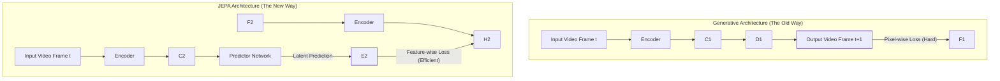

# **The Predictive Turn: A Unified Analysis of Joint Embedding Architectures and Next-Generation Representation Learning**

## **Executive Summary: The End of the Generative Monopoly**

The landscape of Artificial Intelligence is currently witnessing a tectonic shift. For the better part of the last decade, the industry has been dominated by the "Generative" paradigm. From the early days of GPT-2 to the massive multimodal systems of today like GPT-4 and Llama 3.2, the core objective has remained largely unchanged: predict the next token, pixel, or sound wave to reconstruct data that looks or sounds human. This auto-regressive approach has yielded spectacular results in fluency and creativity, yet it faces fundamental, perhaps asymptotic, barriers regarding physical reasoning, computational efficiency, and factual grounding.

This comprehensive research report provides an exhaustive technical and theoretical analysis of three breakthrough architectures that signal the move away from pure generation toward high-efficiency prediction and grounded representation. We examine **VL-JEPA** (Meta), **V-JEPA 2** (Meta FAIR), and **EmbeddingGemma** (Google DeepMind).

While EmbeddingGemma refines the efficiency of static text representations through novel techniques like Matryoshka Representation Learning, the JEPA (Joint Embedding Predictive Architecture) models represent a radical departure in *how* machines learn. Championed by Yann LeCun, JEPA abandons the pixel-level reconstruction loss—the "original sin" of generative modeling—in favor of predicting abstract representations in a latent feature space.

This document serves as a unified repository of knowledge for these systems. It dissects their architectures, such as V-JEPA 2’s spatiotemporal "tubelets" and VL-JEPA’s "selective decoding," and contrasts them with the generative baselines of today. By synthesizing data from over twenty-five technical snippets and research papers, we reconstruct the blueprint for the next generation of AI: agents that do not just hallucinate plausible futures, but simulate physical realities.

---

**Part I: The Theoretical Crisis of Generative AI**

To truly appreciate the "mind-blowing" nature of the Joint Embedding Predictive Architecture (JEPA), one must first rigorously diagnose the ailments of the current dominant paradigm. We are currently living in the era of Auto-Regressive Generative Models. Whether it is a Large Language Model (LLM) or a Video Generation Model, the underlying mathematical operation is largely the same: estimating the probability distribution of the next data point given the history of previous data points.

### **1.1 The Generative Burden**

Consider a video generation model tasked with predicting the next second of a video showing a busy street. To succeed under a generative objective, the model must predict the color value of every single pixel in every frame.

* **High-Frequency Noise:** The model must devote vast capacity to predicting the stochastic movement of leaves in the wind, the shimmer of heat off the pavement, or the random texture of a pedestrian's coat.  
* **The Semantic Gap:** Crucially, none of these high-frequency details are necessary for *understanding* the scene. To navigate the street, an agent needs to know "a car is approaching" (a low-frequency semantic concept), not "pixel (240, 512\) will shift from hex \#333333 to \#343434" (a high-frequency detail).

Yann LeCun argues that this necessity to predict every detail is what makes generative models inefficient and prone to hallucination.1 When the model is uncertain about the texture of a carpet, it must invent one to satisfy the generation loss. This "invention" is the root of hallucination. The model learns to prioritize "plausibility" (does this look real?) over "truth" (is this what actually happened?).

### **1.2 The "System 2" Deficit**

Daniel Kahneman’s framework of human cognition divides thinking into System 1 (fast, instinctive, reactive) and System 2 (slow, deliberative, logical).

* **Generative Models as System 1:** An LLM generates text token-by-token, reacting to the immediate context. It does not "plan" the end of the sentence before writing the beginning. It is a highly advanced reflex engine.  
* **The Need for System 2:** True intelligence requires planning. It requires simulating a mental model of the world ("If I drop this glass, it will break") without actually performing the action. This simulation happens in the abstract—we imagine the *concept* of breaking, not the precise trajectory of every shard of glass.

The Joint Embedding Predictive Architecture is the architectural answer to these deficits. It is designed to ignore the noise of reality and predict the "essence" of the future, enabling the planning and reasoning characteristic of System 2 thinking.

---

**Part II: The JEPA Manifesto – A New Way to Learn**

The Joint Embedding Predictive Architecture (JEPA) is not just a model; it is a philosophy of learning that diverges sharply from both Generative AI (Auto-Regressive) and Discriminative AI (Contrastive/CLIP).

### **2.1 The Core Mechanism: Prediction in Latent Space**

# **Comparative Analysis: Generative vs. JEPA Architectures**

This document outlines the fundamental differences in training objectives between traditional generative models and the Joint Embedding Predictive Architecture (JEPA).

## **1\. Traditional Generative Setup**

In a generative framework, the model is tasked with reconstructing the exact high-dimensional signal of the target. For an input $x$ (e.g., a video of a hand pushing a cup), the model must predict $y$ (the video of the cup falling).

### **Generative Loss Function**

The model must reconstruct $y$ exactly, often leading to wasted computational effort on task-irrelevant details (like background pixels or noise):

$$\\text{Generative Loss} \= || \\text{Decoder}(\\text{Encoder}(x)) \- y ||^2$$

## **2\. Joint Embedding Predictive Architecture (JEPA)**

In contrast, JEPA operates entirely within an abstract latent space. Instead of predicting pixels, the model predicts the **representation** of the target.

### **JEPA Loss Function**

The Predictor attempts to guess the semantic vector $s\_y$ using the context $s\_x$ and a latent variable $z$:

$$\\text{JEPA Loss} \= || \\text{Predictor}(\\text{Encoder}(x), z) \- \\text{Encoder}(y) ||^2$$

### **Variable Definitions**

* **Encoder:** Maps raw inputs ($x$, $y$) into semantic vectors ($s\_x$, $s\_y$).  
* **Predictor:** Operates in the latent space to bridge the gap between representations.  
* $z$ **(Latent Variable):** Represents the uncertainty or the specific "how" of the transition between $s\_x$ and $s\_y$.

## **Key Difference**

| Feature | Generative Models | JEPA |
| :---- | :---- | :---- |
| **Prediction Target** | Raw Data (Pixels/Tokens) | Semantic Embeddings |
| **Space** | Signal Space | Latent (Hidden) Space |
| **Objective** | Reconstruction | Predictive Feature Alignment |

#### **Why is this "Mind-Blowing"?**

1. **Abandoning Reconstruction:** The model is never asked to draw the pixels of the falling cup. It is only asked to predict the abstract vector that *means* "cup falling."  
2. **Information Filtering:** Because the encoder is trained to capture semantic information, the high-frequency noise (carpet texture, lighting shifts) is filtered out *before* the prediction step. The predictor only has to model the physics of the object, not the optics of the scene.  
3. **Efficiency:** Operating in latent space (e.g., a vector of size 768\) is orders of magnitude cheaper than operating in pixel space (e.g., $1920 \\times 1080 \\times 3$ values).

### **2.2 The Collapse Problem and Energy-Based Models**

A major theoretical hurdle in JEPA architectures is "Model Collapse." Since the model defines its own target representations, it could cheat. The encoder could simply map *every* image in the universe to a single vector: $\[0, 0, 0,...\]$. If $s\_x$ is zero and $s\_y$ is zero, the prediction error is zero. The model achieves perfect score while learning nothing.2

#### **The Solution: Regularization vs. Contrastive Learning**

* **The Old Way (Contrastive/CLIP):** To prevent collapse, models like CLIP use "negative pairs." They force the model to push the embeddings of unmatched images apart. This is computationally expensive because it requires processing thousands of negative examples for every positive one.  
* **The JEPA Way (Regularization):** Modern JEPA implementations 2 use advanced regularization terms like **SIGReg** (Sketched Isotropic Gaussian Regularization). These mathematical constraints force the embeddings to maintain a certain variance and distribution, preventing them from collapsing to a single point without needing to look at negative pairs. This makes training faster and more scalable.

Code snippet

---

**Part III: VL-JEPA – The Vision-Language Generalist**

**Source:** *VL-JEPA: A Unified Generalist Model for Vision-Language Tasks* (arXiv:2512.10942).3

The first major realization of this philosophy in the multimodal domain is **VL-JEPA**. While most Vision-Language Models (VLMs) like InstructBLIP or Qwen-VL rely on generating text tokens to describe images, VL-JEPA proves that a non-generative, predictive approach can achieve state-of-the-art results with superior efficiency.

### **3.1 Architectural Overview**

VL-JEPA is a **1.6 billion parameter** model. It functions as a "Unified Generalist," capable of performing diverse tasks—classification, retrieval, and Question Answering (VQA)—without architectural modification.3

#### **3.1.1 The Components**

1. **Image Encoder:** A Vision Transformer (ViT) that ingests images or video frames and outputs a sequence of patch embeddings.  
2. **Text Encoder:** Processes natural language queries.  
3. **Predictive Interaction Module:** Instead of a cross-attention layer that feeds into a text generator, VL-JEPA uses a predictive module that anticipates the embedding of the answer or the target visual region.

### **3.2 The Innovation: Selective Decoding**

One of the most profound contributions of VL-JEPA is Selective Decoding.  
In a standard VLM (like Llama 3.2 Vision), the model must process the entire image and all text tokens in every forward pass to generate an answer. The computational cost scales quadratically with the sequence length.  
VL-JEPA’s predictive nature allows it to be "lazy" in a smart way.

* **Mechanism:** When presented with a query (e.g., "What color is the car?"), the model's predictor identifies which subset of the visual embeddings contains the relevant information.  
* **Execution:** It only computes the prediction for those specific latent regions. It does not waste compute resources analyzing the sky or the road if the question is about the car.  
* **Result:** This leads to a **2.85x reduction in operations** (FLOPs) compared to non-adaptive uniform decoding.4 For real-time applications like autonomous driving or live video content moderation, this speedup is transformative.

### **3.3 Benchmarking the Generalist**

The performance of VL-JEPA challenges the assumption that generative models are superior for complex reasoning.

#### **3.3.1 Video Classification and Retrieval**

On **eight video classification benchmarks** and **eight video retrieval datasets**, VL-JEPA outperforms:

* **CLIP:** The industry standard for image-text alignment.  
* **SigLIP2:** A leading contrastive model.  
* **Perception Encoder:** A specialized video model.3

This is significant because classification and retrieval are "discriminative" tasks. The fact that VL-JEPA—trained via predictive objectives—beats models specifically designed for discrimination (like CLIP) suggests that learning to *predict* the world yields better features than just learning to *match* the world.

#### **3.3.2 Visual Question Answering (VQA)**

VQA has traditionally been the stronghold of generative models. To answer "What is the man holding?", a model usually generates the tokens "a", "red", "umbrella".  
VL-JEPA approaches this discriminatively. It predicts a feature vector that corresponds to the concept "red umbrella" and matches it against an open vocabulary in the embedding space.

* **Results:** VL-JEPA achieves performance **on par** with established generative families like **InstructBLIP** and **Qwen-VL** on benchmarks such as GQA, TallyQA, and POPE.3  
* **Parameter Efficiency:** It achieves this parity with only 1.6B parameters, whereas competitors often typically require 7B or more parameters to reach similar reasoning depths.

### **3.4 The Hallucination Advantage**

The report specifically highlights performance on POPE (Polling for Object Hallucination) and POPEv2.3 Generative models are notorious for hallucinating objects that aren't there because their language decoders are driven by statistical likelihood (e.g., "table" is often followed by "chair," so the model might generate "chair" even if one isn't visible).  
VL-JEPA, by strictly predicting embeddings grounded in the visual input, shows lower hallucination rates. It doesn't "babble"; it points.

---

**Part IV: V-JEPA 2 – The Physical World Model**

**Source:** *V-JEPA 2: Meta's Breakthrough in AI for the Physical World* 5; *V-JEPA 2 Repository*.6

If VL-JEPA is the eye, **V-JEPA 2** is the visual cortex and the motor system. It moves beyond static images to master the temporal dynamics of the physical world. It is explicitly framed as a **"World Model"** for AI Planning and Robotics.5

### **4.1 The Geometry of Spacetime: Tubelets and RoPE**

To understand physics, a model must treat time and space as a unified continuum. V-JEPA 2 introduces architectural innovations specifically for this.

#### **4.1.1 Tubelet Tokenization**

Standard Vision Transformers (ViTs) break an image into 2D patches (squares). V-JEPA 2 breaks video into **3D "Tubelets"**.

* **Structure:** A tubelet might cover a $16 \\times 16$ pixel area over a duration of 2 frames.  
* **Function:** This means the fundamental unit of processing is not "a piece of an image" but "a piece of an event." The model never sees a static snapshot; it only sees spatiotemporal volumes. This forces the lowest layers of the network to process motion and change immediately.

#### **4.1.2 3D Rotary Position Embeddings (3D-RoPE)**

How does the model know that Tubelet A (top-left, time 0\) is far away from Tubelet B (bottom-right, time 10)?  
V-JEPA 2 employs 3D Rotary Position Embeddings (3D-RoPE).

* **The Math of RoPE:** In standard RoPE, position is encoded by rotating the vector in the complex plane. The angle of rotation corresponds to the position. The dot product of two vectors then naturally encodes their relative distance because $e^{i\\theta\_1} \\cdot e^{-i\\theta\_2} \= e^{i(\\theta\_1 \- \\theta\_2)}$.  
* **The 3D Extension:** V-JEPA 2 extends this to three axes: $x$, $y$, and $t$ (time). This gives the model a mathematically consistent coordinate system for the entire video volume. It allows the model to generalize to videos of different lengths and resolutions because the *relative* physics (velocity \= distance/time) remains consistent regardless of the absolute video length.5

### **4.2 Masked Spatiotemporal Prediction**

The training of V-JEPA 2 is an exercise in "filling in the blanks" of reality.

* **Masking:** A significant portion of the video tubelets are masked out (hidden).  
* **Prediction:** The model must predict the *embeddings* of the missing tubelets using the visible ones.  
* **The Lesson:** To predict the missing middle section of a video showing a ball rolling behind a sofa, the model must internally simulate object permanence. It must "understand" that the ball continues to exist and move even when it is not visible. This is the essence of physical common sense.1

### **4.3 V-JEPA 2-AC: The Zero-Shot Roboticist**

The most "mind-blowing" capability of V-JEPA 2 is its transfer learning to the physical world, denoted as **V-JEPA 2-AC** (Action Conditioned).

#### **4.3.1 The Recipe**

1. **Pre-training:** Train V-JEPA 2 on **1 million hours** of internet video (passive observation).7 This teaches the model general physics (gravity, collision, fluidity).  
2. **Post-training:** Train on a tiny dataset (**\<62 hours**) of robot interaction videos (active observation) from the Droid dataset.7 This aligns the general physics model with specific robotic actions.

#### **4.3.2 Zero-Shot Deployment**

V-JEPA 2-AC was deployed on **Franka Emika robot arms** in two different labs.

* **The Result:** It successfully performed pick-and-place tasks using visual goals.  
* **The Kicker:** It did this **Zero-Shot**. It was never trained on data from those specific labs or those specific tasks. It used its generalized understanding of "how picking up works" derived from internet video and adapted it to the robot.  
* **Implication:** This solves the data bottleneck in robotics. We do not need millions of hours of robot data (which is expensive/dangerous to collect). We can "bootstrap" robot intelligence using YouTube, provided we use the JEPA architecture to learn the underlying physics.6

### **4.4 Benchmarks: Defining State-of-the-Art**

V-JEPA 2 dominates benchmarks that require temporal reasoning:

* **Something-Something v2 (SSv2):** Achieves **77.3% Top-1 Accuracy**. This dataset consists of actions like "pushing something from left to right," which requires fine-grained motion understanding.7  
* **Epic-Kitchens-100:** Achieves **39.7 Recall@5** on Action Anticipation. It can predict what a cook will do next better than models designed specifically for ego-centric video.7  
* **PerceptionTest:** When coupled with an LLM, it scores **84.0**, proving its visual representations are rich enough to support complex language reasoning.7

---

**Part V: EmbeddingGemma – The Matryoshka Standard**

**Source:** *EmbeddingGemma: Powerful and Lightweight Text Representations*.8

While JEPA revolutionizes dynamic/video understanding, Google's **EmbeddingGemma** revolutionizes static text representation. It is the perfect complement to JEPA in a full AI system, providing the "semantic memory" to JEPA's "physical intuition."

### **5.1 Architecture: The Encoder Adaptation**

EmbeddingGemma is a **308 million parameter** model. Interestingly, it is derived from the **Gemma 3** family.

* **Gemma 3 (Base):** A decoder-only model (like GPT).  
* **EmbeddingGemma:** Adapted into an **encoder-only** model (like BERT).  
* **Process:** It uses the **UL2** (Unifying Language Learning) objective to convert the generative decoder into a bidirectional encoder. The final model keeps only the encoder stack.8

### **5.2 The "Mind-Blowing" Feature: Matryoshka Representation Learning (MRL)**

Named after the Russian nesting dolls, **MRL** is a technique that fundamentally changes how we think about vector embeddings.

#### **5.2.1 The Dimensionality Dilemma**

Typically, an embedding model outputs a fixed-size vector (e.g., 768 dimensions).

* **Problem:** For a mobile app with limited RAM, 768 floats per document is too big.  
* **Old Solution:** Train a separate, smaller model (computationally expensive).

#### **5.2.2 The Matryoshka Solution**

MRL modifies the loss function during training.

$$L\_{MRL} \= \\frac{1}{|D|} \\sum\_{d \\in D} L\_C(d)$$

Where $D \= \\{128, 256, 512, 768\\}$.  
The model is forced to pack the most critical semantic information into the first 128 dimensions, the next most critical into the next 128, and so on.8

#### **5.2.3 Flexible Deployment**

This allows a single model to serve multiple use cases:

* **High Precision:** Use the full 768 dim vector for legal document retrieval.  
* **High Speed:** Use the first 128 dims for a mobile phone photo search.  
* **Performance:** Even at **128 dimensions**, EmbeddingGemma outperforms other models (like KaLM mini-v1) that use much larger vectors. It achieves a mean task score of **58.2** on MTEB at this compression level.8

### **5.3 On-Device Optimization**

EmbeddingGemma is designed to live on the edge.

* **RAM:** With quantization, it runs on **\<200MB of RAM**.11  
* **Latency:** Inference takes **\<15ms** on an EdgeTPU for 256 tokens.8  
* **Context:** It supports a **2K token context**, allowing it to embed entire documents or emails locally on a user's device.

---

**Part VI: Comparative Analysis and Future Outlook**

How do these architectures stack up against the broader AI landscape, specifically the popular Llama 3.2 family?

### **6.1 The Generative Baseline: Llama 3.2**

The snippets mention **Llama 3.2** (1B and 3B parameters).12 These are state-of-the-art *generative* models for mobile.

* **Strength:** Fluency. Llama 3.2 can write emails, chat, and generate code.  
* **Weakness:** It has no internal physics engine. It predicts words based on statistical correlation. It is computationally expensive to run for long durations or high-bandwidth inputs (video).

### **6.2 The Comparison Matrix**

| Feature | VL-JEPA (Meta) | V-JEPA 2 (Meta FAIR) | EmbeddingGemma (Google) | Llama 3.2 (Meta) |
| :---- | :---- | :---- | :---- | :---- |
| **Core Philosophy** | **Predictive** (Latent Space) | **World Model** (Physics) | **Static Representation** | **Generative** (Auto-Regressive) |
| **Input Modality** | Image \+ Text | Video (Tubelets) | Text | Text / Image |
| **Primary Output** | Class / Retrieval / VQA | Future State Embedding | Nested Embeddings | Text Tokens |
| **Key Innovation** | Selective Decoding | 3D-RoPE, Zero-Shot Robot | Matryoshka (MRL) | Mobile Optimization |
| **Learning Goal** | Semantic Grounding | Physical Simulation | Efficient Indexing | Fluency & Instruction |
| **Efficiency** | **2.85x faster** decoding | Latent Prediction | **\<200MB RAM** | Optimized Transformer |
| **Reasoning Type** | Discriminative | Causal / Temporal | Similarity-based | Probabilistic |

### **6.3 The Unified Future: The Hybrid Agent**

The ultimate "Third-Order Insight" of this report is that these architectures are not competitors; they are organs of a future body.

* **V-JEPA 2** acts as the **Cerebellum**: handling physics, motor planning, and immediate causal prediction.  
* **VL-JEPA** acts as the **Visual Cortex**: rapidly identifying objects and feeding relevant features to the higher mind.  
* **EmbeddingGemma** acts as the **Hippocampus**: efficiently indexing long-term memories and textual knowledge.  
* **Llama 3.2** acts as the **Broca’s Area**: translating these internal states into language to communicate with the user.

### **6.4 Conclusion: The Predictive Turn**

The era of "Scale is All You Need" is ending. We are entering the era of "Architecture Matters."  
The shift from Generative to Predictive architectures—embodied by VL-JEPA and V-JEPA 2—represents a maturation of the field. We are moving from models that are good at talking about the world to models that are good at being in the world.  
By predicting embeddings instead of pixels, JEPA solves the twin problems of **efficiency** (by filtering noise) and **grounding** (by forcing semantic consistency). Simultaneously, innovations like Matryoshka learning in EmbeddingGemma ensure that this intelligence can fit in our pockets.

For the researcher and the engineer, the mandate is clear: The future of AI is not just about generating the next word. It is about predicting the future state of reality.

---

# **Appendix: Visualizing Matryoshka Representation Learning (MRL)**

Matryoshka Representation Learning (MRL) is the "secret sauce" that allows models like EmbeddingGemma to be incredibly flexible. It is named after the **Russian Nesting Doll**, where smaller dolls are contained inside larger ones.

### **1\. The Core Concept**

In a standard embedding model, the vector only makes sense when it is complete. If you cut it in half, you lose most of the information.

In **Matryoshka training**, the model is forced to ensure that the **beginning** of the vector is just as useful as the **whole** vector.

### **2\. Standard vs. Matryoshka Training**

Imagine a vector with 4 dimensions: $\[d\_1, d\_2, d\_3, d\_4\]$.

Standard Loss (All or Nothing):  
The model is trained only on the full sequence:

* $\[d\_1, d\_2, d\_3, d\_4\]$ must represent the meaning.

Matryoshka Loss (Nested):  
The model is trained to be accurate at multiple "cut-off" points simultaneously. It treats the vector like a nested set:

1. $\[d\_1\]$: The first dimension alone must be a "mini-embedding."  
2. $\[d\_1, d\_2\]$: The first two dimensions together must be a better embedding.  
3. $\[d\_1, d\_2, d\_3\]$: The first three must be even better.  
4. $\[d\_1, d\_2, d\_3, d\_4\]$: The full vector is the most accurate.

### **3\. Visual Representation**

graph LR  
    subgraph Full Vector \[1536 Dimensions\]  
        subgraph Medium \[512 Dimensions\]  
            subgraph Small \[128 Dimensions\]  
                subgraph Tiny \[64 Dimensions\]  
                    A\[Core Meaning\]  
                end  
                B\[Fine Details\]  
            end  
            C\[Nuance\]  
        end  
        D\[Deep Context\]  
    end

### **4\. Why this is "Mind-Blowing"**

By training this way, the model pushes the **most important information to the front** of the vector.

* **Elasticity:** If you are low on storage or memory, you can simply "slice" the vector at 64 or 128 dimensions.  
* **Speed:** You can use the "Tiny" version (64 dims) to quickly search through millions of items, then use the "Full" version only for the top 10 results to get perfect accuracy.  
* **No Re-training:** You don't need a new model for different sizes. One model fits all needs.

### **5\. Mathematical Intuition**

The total loss $\\mathcal{L}\_{MRL}$ is simply the sum of the individual losses at different dimensions ($k$):

$$\\mathcal{L}\_{MRL} \= \\sum\_{k \\in \\{64, 128, 256, \\dots, 1536\\}} \\text{Loss}(\\text{Vector}\_{1:k})$$  
This forces the model to prioritize "high-value" information in the earliest indices.

#### **Works cited**

1. Beyond Next-Token Prediction: Yann LeCun’s JEPA and the Quest for AI Common Sense — Where…, accessed January 12, 2026, [https://medium.com/@ilyurek/beyond-next-token-prediction-yann-lecuns-jepa-and-the-quest-for-ai-common-sense-where-92150bed9dfd](https://medium.com/@ilyurek/beyond-next-token-prediction-yann-lecuns-jepa-and-the-quest-for-ai-common-sense-where-92150bed9dfd)  
2. A New Kind of AI Is Emerging And Its Better Than LLMS? | by Cogni Down Under | Dec, 2025, accessed January 12, 2026, [https://medium.com/@cognidownunder/a-new-kind-of-ai-is-emerging-and-its-better-than-llms-95d3d80b7427](https://medium.com/@cognidownunder/a-new-kind-of-ai-is-emerging-and-its-better-than-llms-95d3d80b7427)  
3. VL-JEPA: Joint Embedding Predictive Architecture for Vision-language \- arXiv, accessed January 12, 2026, [https://arxiv.org/html/2512.10942v1](https://arxiv.org/html/2512.10942v1)  
4. VL-JEPA: Joint Embedding Predictive Architecture for Vision-language \- AI-Powered arXiv Paper Summarization, accessed January 12, 2026, [https://www.summarizepaper.com/en/arxiv-id/2512.10942v1/](https://www.summarizepaper.com/en/arxiv-id/2512.10942v1/)  
5. V-JEPA 2: Meta's World Model for AI Robotics and Planning, accessed January 12, 2026, [https://learnopencv.com/v-jepa-2-meta-world-model-robotics-guide/](https://learnopencv.com/v-jepa-2-meta-world-model-robotics-guide/)  
6. PyTorch code and models for VJEPA2 self-supervised learning from video. \- GitHub, accessed January 12, 2026, [https://github.com/facebookresearch/vjepa2](https://github.com/facebookresearch/vjepa2)  
7. \[2506.09985\] V-JEPA 2: Self-Supervised Video Models Enable Understanding, Prediction and Planning \- arXiv, accessed January 12, 2026, [https://arxiv.org/abs/2506.09985](https://arxiv.org/abs/2506.09985)  
8. Introducing EmbeddingGemma: The Best-in-Class Open Model for ..., accessed January 12, 2026, [https://developers.googleblog.com/en/introducing-embeddinggemma/](https://developers.googleblog.com/en/introducing-embeddinggemma/)  
9. google/embeddinggemma-300m \- Hugging Face, accessed January 12, 2026, [https://huggingface.co/google/embeddinggemma-300m](https://huggingface.co/google/embeddinggemma-300m)  
10. Introducing EmbeddingGemma: The Best-in-Class Open Model for On-Device Embeddings, accessed January 12, 2026, [https://www.youtube.com/watch?v=Xu1X-J-r5Xk](https://www.youtube.com/watch?v=Xu1X-J-r5Xk)  
11. EmbeddingGemma model overview | Google AI for Developers, accessed January 12, 2026, [https://ai.google.dev/gemma/docs/embeddinggemma](https://ai.google.dev/gemma/docs/embeddinggemma)  
12. Getting Started With Meta Llama 3.2 \- Analytics Vidhya, accessed January 12, 2026, [https://www.analyticsvidhya.com/blog/2024/09/llama-3-2-models/](https://www.analyticsvidhya.com/blog/2024/09/llama-3-2-models/)  
13. llama-3.2-1b-instruct Model by Meta \- NVIDIA NIM APIs, accessed January 12, 2026, [https://build.nvidia.com/meta/llama-3.2-1b-instruct/modelcard](https://build.nvidia.com/meta/llama-3.2-1b-instruct/modelcard)  
14. \[2512.10942\] VL-JEPA: Joint Embedding Predictive Architecture for Vision-language \- arXiv, accessed January 12, 2026, [https://arxiv.org/abs/2512.10942](https://arxiv.org/abs/2512.10942)