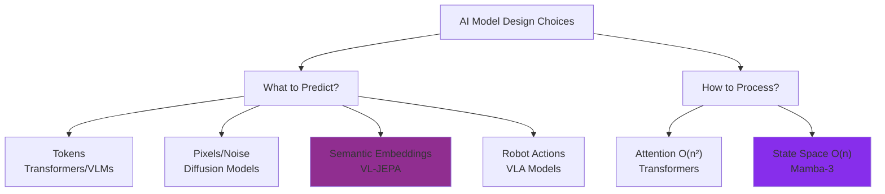
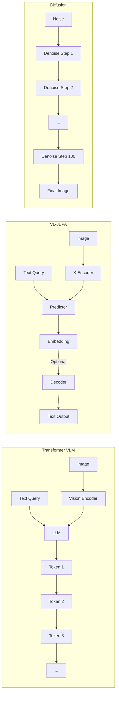
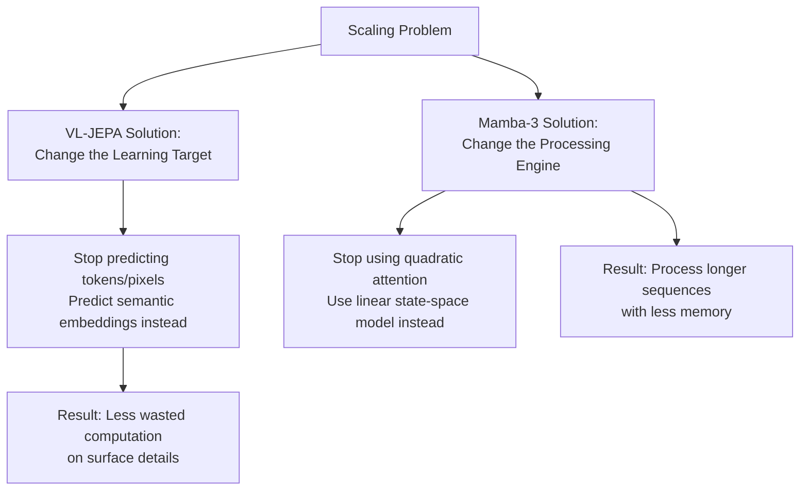
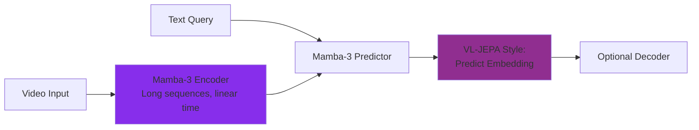
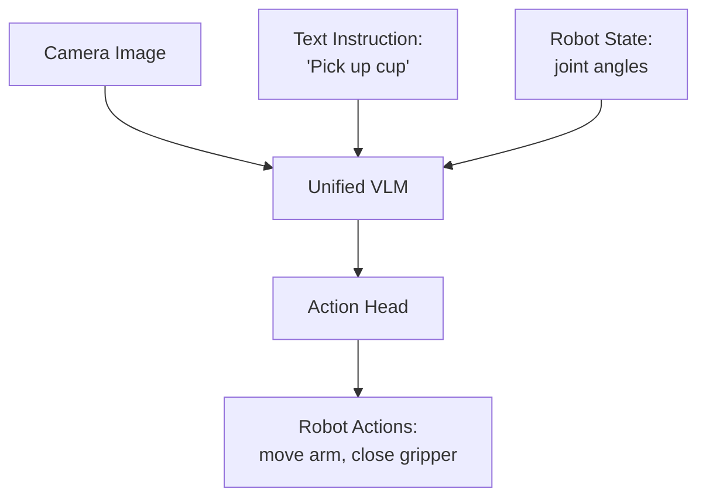
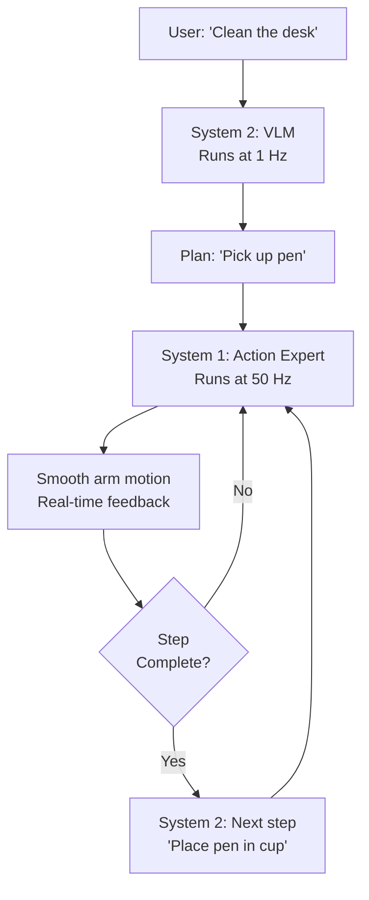
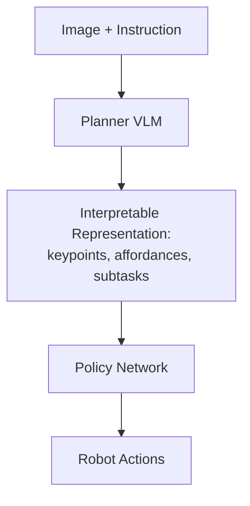

# Comprehensive AI Architecture Comparison Guide

A clean, consolidated comparison of modern AI architectures: VL-JEPA, Mamba-3, Transformers, Diffusion Models, and VLA systems.

---

## Core Philosophy: What Does Each Architecture Optimize?



---

## 1. Quick Architecture Overview

| Architecture | Main Purpose | Key Innovation | Speed Focus |
|-------------|--------------|----------------|-------------|
| **Transformers** | General text/image understanding | Self-attention mechanism | Slow (O(n²)) |
| **VL-JEPA** | Efficient vision-language understanding | Predict concepts, not tokens | Very Fast (single pass) |
| **Mamba-3** | Long sequence processing | Linear-time state tracking | Fast (O(n)) |
| **Diffusion Models** | High-quality image/video generation | Iterative denoising | Very Slow (100s of steps) |
| **VLA Models** | Robot control from vision+language | Action generation from VLMs | Moderate (real-time capable) |

---

## 2. VL-JEPA vs Transformers vs Diffusion Models

### What They Predict (The Core Difference)

**Transformers (VLMs)**
- **Predict:** Next token in a sequence
- **Example:** "The lamp turns" → "off" (one word at a time)
- **Problem:** Many valid answers ("off", "dark", "dim") are treated as completely different in token space
- **Cost:** Must model every possible word variation

**Diffusion Models**
- **Predict:** How to remove noise from images
- **Example:** Pure noise → gradually → clear image
- **Problem:** Models every pixel, texture, shadow—even irrelevant details
- **Cost:** Hundreds of denoising steps per image

**VL-JEPA**
- **Predict:** Semantic meaning in embedding space
- **Example:** "The lamp turns off" and "room goes dark" → similar embeddings
- **Benefit:** Focuses on concepts, not exact words/pixels
- **Cost:** Single forward pass, no iteration

---

### Architecture Comparison



---

### Efficiency Comparison

| Metric | Transformers | Diffusion | VL-JEPA |
|--------|-------------|-----------|---------|
| **Training Parameters** | 7B-70B typical | 1B-10B typical | **1.6B** (50% less than comparable VLM) |
| **Inference Steps** | 1 per token (20-100 tokens) | 100-1000 denoising steps | **1 forward pass** |
| **Output Speed** | Sequential (slow) | Very slow | **Instant** |
| **Use in Video** | Must decode every frame | Must generate every frame | **Selective decoding** (2.85× fewer operations) |
| **Best For** | Reasoning, dialogue | Image/video generation | Real-time perception, retrieval |

**Real Example:** 
- Transformer VLM: Processes 1 second of video → generates 30 captions (one per frame) → 30 sequential predictions
- VL-JEPA: Processes 1 second of video → generates embeddings for all frames → decodes only when scene changes → **10 captions total** (same quality)

---

### When to Use Each

**Use Transformers When:**
- You need step-by-step reasoning ("First do X, then Y, because Z")
- Long-form text generation is critical
- Tool use or code generation required
- Complex multi-step planning

**Use Diffusion When:**
- Generating high-quality images or videos
- Pixel-perfect reconstruction needed
- Creating realistic textures and details
- Artistic or creative content generation

**Use VL-JEPA When:**
- Real-time video understanding
- Retrieval tasks (find similar images/videos)
- Classification with open vocabularies
- Efficient perception for robotics
- Concept-based planning (world models)

---

## 3. VL-JEPA vs Mamba-3

These solve **different problems** and can work together.

### What Each Changes



---

### Key Differences

| Aspect | VL-JEPA | Mamba-3 |
|--------|---------|---------|
| **What it changes** | Learning objective (what's predicted) | Sequence processing mechanism (how it's computed) |
| **Supervision** | Semantic embedding space | Token space (same as transformers) |
| **Main benefit** | Reduces semantic complexity | Reduces computational complexity |
| **Best at** | Vision-language understanding | Long-context modeling (100k+ tokens) |
| **Generative?** | No (concept prediction only) | Yes (can generate tokens) |
| **Time complexity** | Non-autoregressive (parallel) | Linear O(n) vs O(n²) attention |

---

### How They Complement Each Other

**Potential Synergy (mentioned in research):**

Use VL-JEPA's learning objective with Mamba-3's processing engine:



**Benefits:**
- VL-JEPA's efficiency (no token generation)
- Mamba-3's long-context handling (100k+ tokens)
- Linear-time processing of video streams
- Semantic-focused learning

---

### Technical Details

**VL-JEPA Architecture:**
1. **X-Encoder:** Frozen vision model (V-JEPA-2) → visual embeddings
2. **Y-Encoder:** Text embedding model (EmbeddingGemma) → target embeddings
3. **Predictor:** Subset of Llama-3.2-1B layers → predicts target embedding
4. **Loss:** InfoNCE (contrastive) in embedding space to prevent collapse

**Mamba-3 Improvements:**
1. **Trapezoidal Discretization:** Better stability than simple Euler steps
2. **Complex State Updates:** Handles oscillatory patterns (parity, counters) that earlier models failed
3. **MIMO Updates:** Dense matrix operations → high GPU utilization
4. **Result:** Linear time, transformer-level expressivity

---

### Strengths & Weaknesses

**VL-JEPA Strengths:**
- 50% fewer parameters than comparable VLMs
- 2× better learning efficiency (same data/compute)
- 2.85× fewer decoding operations in streaming
- Excels at world modeling (beats GPT-4o on inverse dynamics)

**VL-JEPA Weaknesses:**
- Not for multi-step symbolic reasoning
- Cannot generate images/videos
- Not designed for open-domain text generation

**Mamba-3 Strengths:**
- Linear time/memory (vs quadratic attention)
- 5× faster on long sequences (100k+ tokens)
- 100% accuracy on tasks where Mamba-2 failed (parity, counters)
- High arithmetic intensity (saturates GPU)

**Mamba-3 Weaknesses:**
- Weaker at precise long-range retrieval than attention
- Fixed state size compresses history (hard to cite "50k tokens ago")
- Active research area (hybrid models emerging)

---

## 4. Vision-Language-Action (VLA) Models

VLAs extend VLMs to control robots. Three main patterns exist.

### Pattern 1: Single-System VLA



**Examples:** OpenVLA, RT-2, SmolVLA

**Pros:**
- Simple architecture
- Easy to train and deploy
- Good generalization across robots

**Cons:**
- Slow (autoregressive decoding)
- Must be good at everything
- Limited for complex tasks

**Best For:** General manipulation, moderate complexity tasks

---

### Pattern 2: Dual-System VLA (System 1 + System 2)



**Example:** π0.5 (Physical Intelligence)

**How It Works:**
- **System 2 (Slow):** VLM reasons at 1 Hz, decomposes task into steps
- **System 1 (Fast):** Action expert executes at 50 Hz with real-time control
- Feedback loop: System 1 signals completion or failure → System 2 replans

**Pros:**
- Complex reasoning (planning)
- Real-time execution
- Handles failures gracefully
- Best real-world results

**Cons:**
- More complex training
- Requires more data

**Best For:** Long-horizon tasks, complex manipulation, environments requiring adaptation

---

### Pattern 3: Hierarchical VLA



**Examples:** CLIPort, SpatialVLA

**Intermediate Representations:**
- **Keypoints:** "Hand should go to (x, y, z)"
- **Affordances:** "These pixels are graspable"
- **Subtasks:** "First pick, then move, then place"

**Pros:**
- Very interpretable
- Easy to debug
- Policy specialized for execution

**Cons:**
- Requires careful engineering
- Not end-to-end learning
- Less flexible than unified models

**Best For:** Safety-critical applications, explainability requirements

---

### VLA Architecture Comparison

| Feature | Single-System | Dual-System | Hierarchical |
|---------|--------------|-------------|--------------|
| **Components** | 1 VLM + action head | VLM + action expert | Planner + policy |
| **Reasoning** | Implicit | Explicit (visible steps) | Explicit (interpretable) |
| **Control Frequency** | 1-10 Hz | System 1: 50 Hz<br/>System 2: 1 Hz | Depends on policy |
| **Training Complexity** | Low | Medium | Medium-High |
| **Inference Speed** | Slow | Fast | Moderate |
| **Interpretability** | Low | High | Very High |
| **Real-World Success** | Medium | **Excellent** | Good |

---

### Key VLA Innovations

#### 1. FAST Tokenization (5× Training Speedup)

**Problem:** Robot actions are continuous, smooth motions. Predicting 30 joint angles per timestep = huge, correlated sequences.

**Solution:**
1. **DCT (Discrete Cosine Transform):** Compress like JPEG
   - Smooth motion = low-frequency signal
   - Most high-frequency coefficients ≈ 0
   
2. **BPE (Byte-Pair Encoding):** Merge repeated tokens
   - Example: [0.0, 0.0, 0.0, 0.0, 0.0] → [ZERO_RUN_5]

**Result:** 700 tokens → 53 tokens (13× compression), 5× faster training

---

#### 2. Knowledge Insulation

**Problem:** Training action prediction degrades the VLM's internet knowledge.

**Solution:** Block gradients from action head to VLM
```
FAST Loss → updates VLM ✓
Action Expert Loss → updates ONLY action expert (no gradients to VLM) ✓
```

**Result:** VLM retains language/vision knowledge while learning robotics (5× speedup)

---

#### 3. Real-Time Action Chunking

**Problem:** VLAs predict 30 actions at once, then freeze while predicting next chunk → jerky motion.

**Solution:** Overlap predictions (like inpainting)
```
Chunk 1: [a₁, a₂, ..., a₃₀]
         Execute first 20 actions
         While executing, predict Chunk 2
         Constrain Chunk 2: first 10 actions must match Chunk 1's last 10
         Result: Smooth handoff, no freezing
```

**Result:** 2.85× fewer predictions, smooth continuous motion

---

## 5. Consolidated Use-Case Matrix

| Task | Best Choice | Reason |
|------|-------------|--------|
| **Chatbot/Reasoning** | Transformer LLM | Step-by-step reasoning, dialogue |
| **Image Generation** | Diffusion Model | Highest quality pixel outputs |
| **Real-time Video Understanding** | VL-JEPA | Selective decoding, efficient perception |
| **Image Retrieval** | VL-JEPA | Embedding similarity search |
| **Long Documents (100k+ tokens)** | Mamba-3 | Linear time, fixed memory |
| **Simple Robot Tasks** | Single-System VLA | Easy deployment, good generalization |
| **Complex Robot Tasks** | Dual-System VLA | Reasoning + real-time control |
| **Explainable Robotics** | Hierarchical VLA | Interpretable intermediate steps |
| **World Modeling (planning)** | VL-JEPA | Concept-space planning (inverse dynamics) |
| **Creative Content** | Diffusion + Transformer | Generation quality + text control |

---

## 6. Training & Deployment Quick Reference

### Data Requirements

| Model Type | Training Data | Fine-Tuning Data | Training Time |
|-----------|--------------|------------------|---------------|
| **VL-JEPA** | 10M+ image-text pairs | 100k pairs | Days on 8 GPUs |
| **Mamba-3** | Same as transformers (billions of tokens) | Task-specific | Weeks on cluster |
| **VLA (pre-training)** | 700+ hours robot demos | 50-100 demos | 2 weeks on 24 nodes |
| **VLA (fine-tuning)** | Pre-trained checkpoint | 50-100 demos | 30 min - 2 hrs (1 GPU) |

---

### Performance Metrics

**VL-JEPA (vs comparable VLM):**
- 50% fewer parameters
- 2× better learning curves
- 2.85× fewer decoding operations
- Outperforms GPT-4o on world modeling benchmarks

**Mamba-3 (vs transformers):**
- 5× faster on long sequences (100k tokens)
- Linear O(n) vs quadratic O(n²)
- Matches or beats 2× larger transformers
- 100% accuracy on tasks Mamba-2 failed

**VLA (π0.5):**
- ~97% simulation success rate
- 60-90% real-world success (task-dependent)
- 50 Hz real-time control
- Generalizes across 50+ tasks

---

## 7. Future Directions

### Emerging Trends

1. **VL-JEPA for Robotics**
   - Apply embedding prediction to action generation
   - Could combine efficiency with control

2. **Hybrid Architectures**
   - Mamba backbone + attention patches (retrieval)
   - VL-JEPA objective + Mamba processing

3. **Multimodal Perception**
   - Vision + tactile + audio
   - Better feedback control

4. **Memory & Learning**
   - Episodic memory (learn from failures)
   - Few-shot adaptation (<50 examples)

---

## 8. Key Takeaways (Simple English)

1. **Transformers:** Great at reasoning and text, but slow and wasteful for perception tasks

2. **VL-JEPA:** Fast and efficient vision-language understanding by predicting concepts instead of tokens

3. **Mamba-3:** Handles very long sequences efficiently (linear time instead of quadratic)

4. **Diffusion:** Best image quality, but very slow (hundreds of steps per image)

5. **VLAs:** Robots that understand language and vision, then act
   - Single-system: Simple but limited
   - Dual-system: Best for complex tasks (current state-of-the-art)
   - Hierarchical: Most interpretable

6. **VL-JEPA + Mamba-3:** Could combine efficiency (embeddings) with long-context handling

7. **Practical Advice:** 
   - Use transformers for reasoning
   - Use VL-JEPA for real-time perception
   - Use dual-system VLAs for robot control
   - Use Mamba-3 when context length is critical

---

**The Big Picture:** We're moving from "predict every pixel/token" to "predict only what matters (concepts)." This makes AI faster, cheaper, and better at real-world tasks.