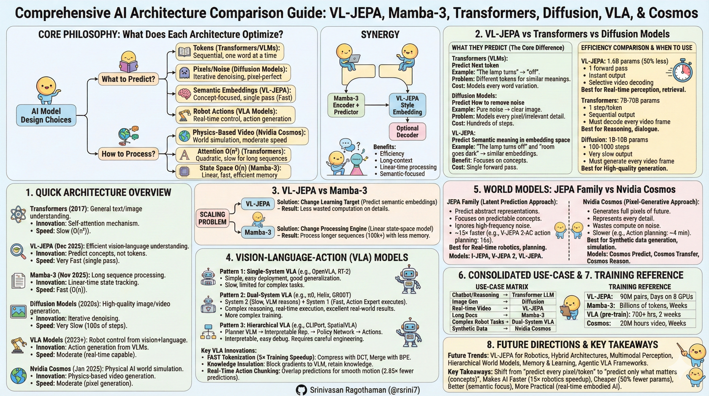
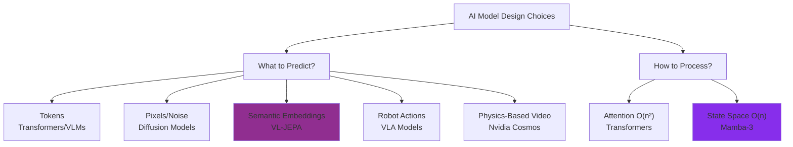
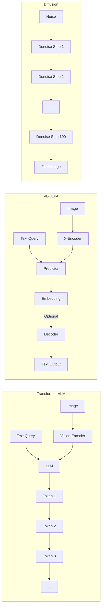
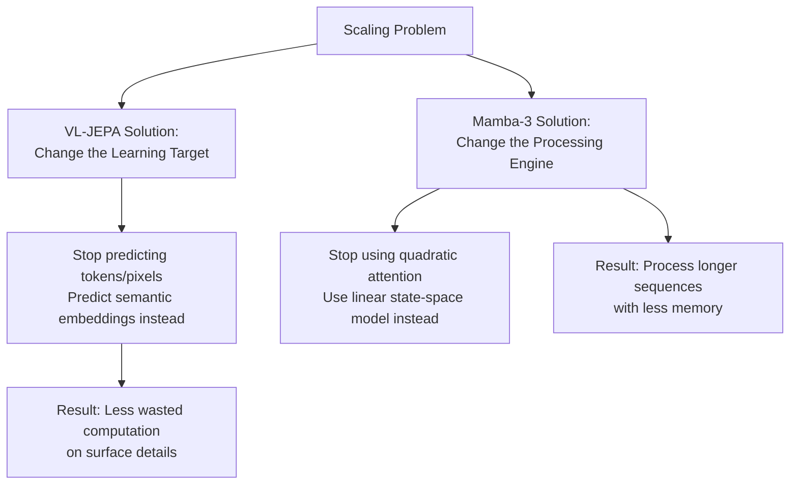
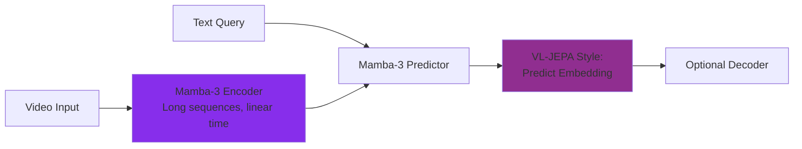
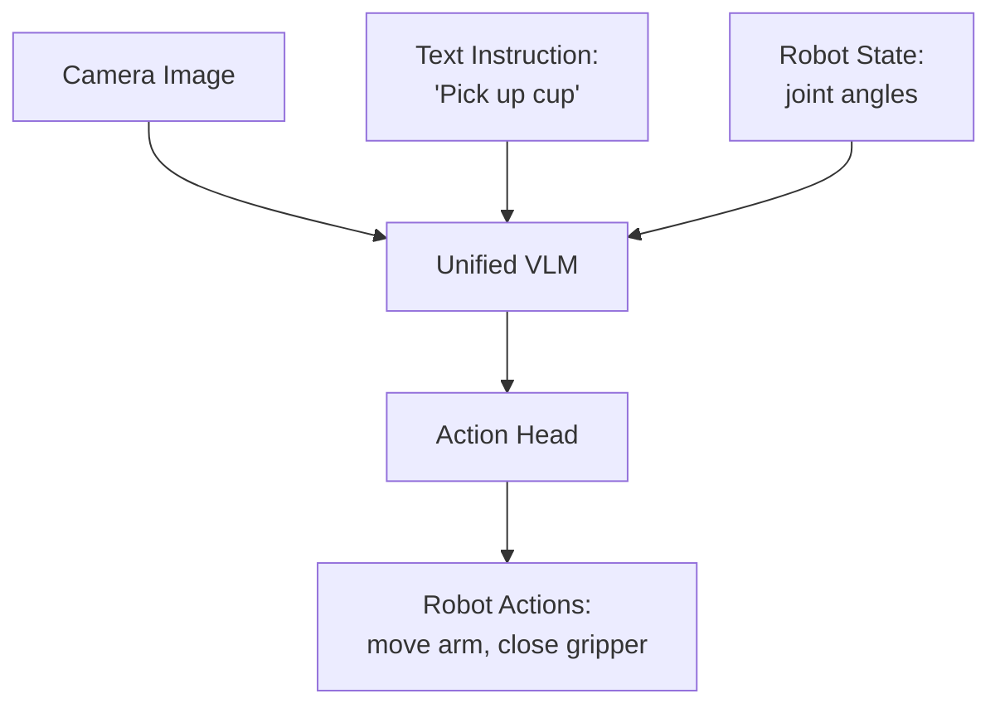
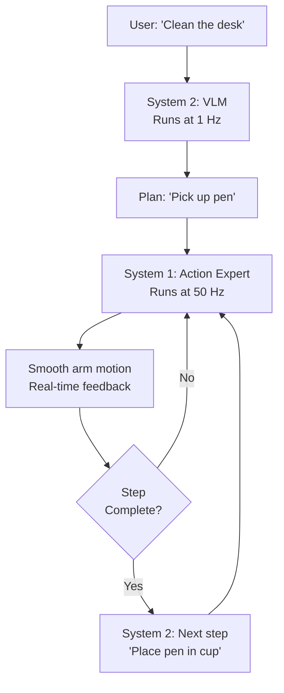
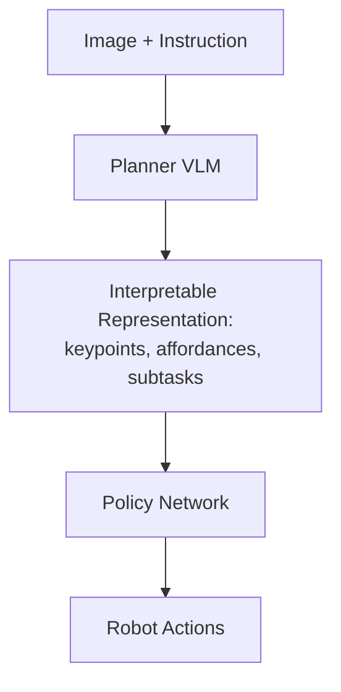

# Comprehensive AI Architecture Comparison Guide

Modern AI architectures: VL-JEPA, Mamba-3, Transformers, Diffusion Models, VLA systems, and Nvidia Cosmos World Models.

## 🎯 What You Need to Know in 120 Seconds

## 🎯 AI Architecture Decision Tree – 2026 Production Reality

𝗪𝗵𝗶𝗰𝗵 𝗔𝗜 𝗔𝗿𝗰𝗵𝗶𝘁𝗲𝗰𝘁𝘂𝗿𝗲 𝗔𝗰𝘁𝘂𝗮𝗹𝗹𝘆 𝗦𝗰𝗮𝗹𝗲𝘀 𝗶𝗻 𝗥𝗲𝗮𝗹-𝗧𝗶𝗺𝗲 𝗘𝗺𝗯𝗼𝗱𝗶𝗲𝗱 𝗦𝘆𝘀𝘁𝗲𝗺𝘀?

━━━━━━━━━━━━━━━━━━━━

🔧 **𝗗𝗲𝗰𝗶𝘀𝗶𝗼𝗻 𝗧𝗿𝗲𝗲: 𝗧𝗮𝘀𝗸 𝗖𝗼𝗻𝘀𝘁𝗿𝗮𝗶𝗻𝘁 → 𝗔𝗿𝗰𝗵𝗶𝘁𝗲𝗰𝘁𝘂𝗿𝗲 𝗖𝗵𝗼𝗶𝗰𝗲**

**Real-time video perception / edge deployment**  
→ **𝗩𝗟-𝗝𝗘𝗣𝗔** (semantic embedding prediction, single forward pass, 2.85× fewer operations on streaming)

**Long-context reasoning (100k+ tokens) / memory-constrained inference**  
→ **𝗠𝗮𝗺𝗯𝗮-𝟯** (linear O(n) state-space, 5× faster than transformers on long sequences)

**Photorealistic generation / synthetic data at scale**  
→ **𝗗𝗶𝗳𝗳𝘂𝘀𝗶𝗼𝗻** or **𝗡𝘃𝗶𝗱𝗶𝗮 𝗖𝗼𝘀𝗺𝗼𝘀** (pixel-level rollout, 20M+ hours video training)

**Complex long-horizon robotics / failure recovery**  
→ **𝗗𝘂𝗮𝗹-𝗦𝘆𝘀𝘁𝗲𝗺 𝗩𝗟𝗔** (System 2 VLM at 1 Hz + System 1 expert at 50 Hz; π₀, Helix, GR00T)

**Zero-shot physical planning / manipulation**  
→ **𝗩-𝗝𝗘𝗣𝗔 𝟮-𝗔𝗖** (latent MPC, ~80% success, 15× faster than pixel rollout)

**Step-by-step symbolic reasoning / tool use**  
→ **𝗧𝗿𝗮𝗻𝘀𝗳𝗼𝗿𝗺𝗲𝗿𝘀** (autoregressive token prediction)

━━━━━━━━━━━━━━━━━━━━

⚡ **𝗣𝗲𝗿𝗳𝗼𝗿𝗺𝗮𝗻𝗰𝗲 𝗕𝗼𝘂𝗻𝗱𝗮𝗿𝗶𝗲𝘀 (𝟮𝟬𝟮𝟲 𝗠𝗲𝘁𝗿𝗶𝗰𝘀)**

- **𝗩𝗟-𝗝𝗘𝗣𝗔**: 1.6B params → beats GPT-4o on Perception Test/TempCompass, 50% fewer params than comparable VLM
- **𝗠𝗮𝗺𝗯𝗮-𝟯**: 100% accuracy on parity/counter tasks, saturates GPU arithmetic intensity
- **𝗗𝘂𝗮𝗹-𝗦𝘆𝘀𝘁𝗲𝗺 𝗩𝗟𝗔**: 60–90% real-world success on long-horizon tasks
- **𝗝𝗘𝗣𝗔 𝗹𝗮𝘁𝗲𝗻𝘁 𝗽𝗹𝗮𝗻𝗻𝗶𝗻𝗴**: 16s vs 4min per action (Cosmos baseline)

━━━━━━━━━━━━━━━━━━━━

🧭 **𝗦𝘁𝗿𝗮𝘁𝗲𝗴𝗶𝗰 𝗣𝗼𝘀𝗶𝘁𝗶𝗼𝗻𝗶𝗻𝗴**

**Efficiency-first stack** (Meta JEPA + Mamba backbone)  
→ Wins edge robotics and real-time agents  
Risk: Weaker at massive synthetic data generation

**Fidelity-first stack** (Nvidia Cosmos + Transformer reasoning)  
→ Dominates simulation and pre-training pipelines  
Risk: Latency prohibits closed-loop control

**Hybrid reality**  
→ Dual-system VLA for control + JEPA perception + Cosmos synthetic data

━━━━━━━━━━━━━━━━━━━━

**𝗧𝗟;𝗗𝗥**
* Prioritize semantic/latent prediction for any real-time or edge-constrained deployment
* Reserve pixel-generative models for offline data synthesis
* Bet on dual-system VLA for production humanoid/robotics in 2026

**Is the winning 2026 embodied stack built on latent efficiency or pixel-scale simulation?**

👤 Srinivasan Ragothaman (@rsrini7)

---



---

## Core Philosophy: What Does Each Architecture Optimize?



---

## 1. Quick Architecture Overview

| Architecture | Main Purpose | Key Innovation | Speed Focus | Released |
|-------------|--------------|----------------|-------------|----------|
| **Transformers** | General text/image understanding | Self-attention mechanism | Slow (O(n²)) | 2017 |
| **VL-JEPA** | Efficient vision-language understanding | Predict concepts, not tokens | Very Fast (single pass) | Dec 2025 |
| **Mamba-3** | Long sequence processing | Linear-time state tracking | Fast (O(n)) | Nov 2025 |
| **Diffusion Models** | High-quality image/video generation | Iterative denoising | Very Slow (100s of steps) | 2020s |
| **VLA Models** | Robot control from vision+language | Action generation from VLMs | Moderate (real-time capable) | 2023+ |
| **Nvidia Cosmos** | Physical AI world simulation | Physics-based video generation | Moderate (pixel generation) | Jan 2025 |

---

## 2. VL-JEPA vs Transformers vs Diffusion Models

### What They Predict (The Core Difference)

**Transformers (VLMs)**
- **Predict:** Next token in a sequence
- **Example:** "The lamp turns" → "off" (one word at a time)
- **Problem:** Many valid answers ("off", "dark", "dim") are treated as completely different in token space
- **Cost:** Must model every possible word variation

**Diffusion Models**
- **Predict:** How to remove noise from images
- **Example:** Pure noise → gradually → clear image
- **Problem:** Models every pixel, texture, shadow—even irrelevant details
- **Cost:** Hundreds of denoising steps per image

**VL-JEPA**
- **Predict:** Semantic meaning in embedding space
- **Example:** "The lamp turns off" and "room goes dark" → similar embeddings
- **Benefit:** Focuses on concepts, not exact words/pixels
- **Cost:** Single forward pass, no iteration

---

### Architecture Comparison



---

### Efficiency Comparison

| Metric | Transformers | Diffusion | VL-JEPA |
|--------|-------------|-----------|---------|
| **Training Parameters** | 7B-70B typical | 1B-10B typical | **1.6B** (50% less than comparable VLM) |
| **Inference Steps** | 1 per token (20-100 tokens) | 100-1000 denoising steps | **1 forward pass** |
| **Output Speed** | Sequential (slow) | Very slow | **Instant** |
| **Use in Video** | Must decode every frame | Must generate every frame | **Selective decoding** (2.85× fewer operations) |
| **Best For** | Reasoning, dialogue | Image/video generation | Real-time perception, retrieval |

**Real Example:** 
- Transformer VLM: Processes 1 second of video → generates 30 captions (one per frame) → 30 sequential predictions
- VL-JEPA: Processes 1 second of video → generates embeddings for all frames → decodes only when scene changes → **10 captions total** (same quality)

---

### When to Use Each

**Use Transformers When:**
- You need step-by-step reasoning ("First do X, then Y, because Z")
- Long-form text generation is critical
- Tool use or code generation required
- Complex multi-step planning

**Use Diffusion When:**
- Generating high-quality images or videos
- Pixel-perfect reconstruction needed
- Creating realistic textures and details
- Artistic or creative content generation

**Use VL-JEPA When:**
- Real-time video understanding
- Retrieval tasks (find similar images/videos)
- Classification with open vocabularies
- Efficient perception for robotics
- Concept-based planning (world models)

---

## 3. VL-JEPA vs Mamba-3

These solve **different problems** and can work together.

### What Each Changes



---

### Key Differences

| Aspect | VL-JEPA | Mamba-3 |
|--------|---------|---------|
| **What it changes** | Learning objective (what's predicted) | Sequence processing mechanism (how it's computed) |
| **Supervision** | Semantic embedding space | Token space (same as transformers) |
| **Main benefit** | Reduces semantic complexity | Reduces computational complexity |
| **Best at** | Vision-language understanding | Long-context modeling (100k+ tokens) |
| **Generative?** | No (concept prediction only) | Yes (can generate tokens) |
| **Time complexity** | Non-autoregressive (parallel) | Linear O(n) vs O(n²) attention |

---

### How They Complement Each Other

**Potential Synergy (mentioned in research):**

Use VL-JEPA's learning objective with Mamba-3's processing engine:



**Benefits:**
- VL-JEPA's efficiency (no token generation)
- Mamba-3's long-context handling (100k+ tokens)
- Linear-time processing of video streams
- Semantic-focused learning

---

### Technical Details

**VL-JEPA Architecture:**
1. **X-Encoder:** Frozen vision model (V-JEPA-2) → visual embeddings
2. **Y-Encoder:** Text embedding model (EmbeddingGemma) → target embeddings
3. **Predictor:** Subset of Llama-3.2-1B layers → predicts target embedding
4. **Loss:** InfoNCE (contrastive) in embedding space to prevent collapse

**Mamba-3 Improvements:**
1. **Trapezoidal Discretization:** Better stability than simple Euler steps
2. **Complex State Updates:** Handles oscillatory patterns (parity, counters) that earlier models failed
3. **MIMO Updates:** Dense matrix operations → high GPU utilization
4. **Result:** Linear time, transformer-level expressivity

---

### Strengths & Weaknesses

**VL-JEPA Strengths:**
- 50% fewer parameters than comparable VLMs
- 2× better learning efficiency (same data/compute)
- 2.85× fewer decoding operations in streaming
- Excels at world modeling (beats GPT-4o on inverse dynamics)
- State-of-the-art on Perception Test and TempCompass benchmarks

**VL-JEPA Weaknesses:**
- Not for multi-step symbolic reasoning
- Cannot generate images/videos
- Not designed for open-domain text generation

**Mamba-3 Strengths:**
- Linear time/memory (vs quadratic attention)
- 5× faster on long sequences (100k+ tokens)
- 100% accuracy on tasks where Mamba-2 failed (parity, counters)
- High arithmetic intensity (saturates GPU)

**Mamba-3 Weaknesses:**
- Weaker at precise long-range retrieval than attention
- Fixed state size compresses history (hard to cite "50k tokens ago")
- Active research area (hybrid models emerging)

---

## 4. Vision-Language-Action (VLA) Models

VLAs extend VLMs to control robots. Three main patterns exist.

### Pattern 1: Single-System VLA



**Examples:** OpenVLA, RT-2, SmolVLA

**Pros:**
- Simple architecture
- Easy to train and deploy
- Good generalization across robots

**Cons:**
- Slow (autoregressive decoding)
- Must be good at everything
- Limited for complex tasks

**Best For:** General manipulation, moderate complexity tasks

---

### Pattern 2: Dual-System VLA (System 1 + System 2)



**Examples:** π0.5 (Physical Intelligence), Helix (Figure AI), GR00T N1 (NVIDIA)

**How It Works:**
- **System 2 (Slow):** VLM reasons at 1 Hz, decomposes task into steps
- **System 1 (Fast):** Action expert executes at 50 Hz with real-time control
- Feedback loop: System 1 signals completion or failure → System 2 replans

**Pros:**
- Complex reasoning (planning)
- Real-time execution
- Handles failures gracefully
- Best real-world results

**Cons:**
- More complex training
- Requires more data

**Best For:** Long-horizon tasks, complex manipulation, environments requiring adaptation

---

### Pattern 3: Hierarchical VLA



**Examples:** CLIPort, SpatialVLA, CoA-VLA

**Intermediate Representations:**
- **Keypoints:** "Hand should go to (x, y, z)"
- **Affordances:** "These pixels are graspable"
- **Subtasks:** "First pick, then move, then place"

**Pros:**
- Very interpretable
- Easy to debug
- Policy specialized for execution

**Cons:**
- Requires careful engineering
- Not end-to-end learning
- Less flexible than unified models

**Best For:** Safety-critical applications, explainability requirements

---

### VLA Architecture Comparison

| Feature | Single-System | Dual-System | Hierarchical |
|---------|--------------|-------------|--------------|
| **Components** | 1 VLM + action head | VLM + action expert | Planner + policy |
| **Reasoning** | Implicit | Explicit (visible steps) | Explicit (interpretable) |
| **Control Frequency** | 1-10 Hz | System 1: 50 Hz<br/>System 2: 1 Hz | Depends on policy |
| **Training Complexity** | Low | Medium | Medium-High |
| **Inference Speed** | Slow | Fast | Moderate |
| **Interpretability** | Low | High | Very High |
| **Real-World Success** | Medium | **Excellent** | Good |

---

### Key VLA Innovations

#### 1. FAST Tokenization (5× Training Speedup)

**Problem:** Robot actions are continuous, smooth motions. Predicting 30 joint angles per timestep = huge, correlated sequences.

**Solution:**
1. **DCT (Discrete Cosine Transform):** Compress like JPEG
   - Smooth motion = low-frequency signal
   - Most high-frequency coefficients ≈ 0
   
2. **BPE (Byte-Pair Encoding):** Merge repeated tokens
   - Example: [0.0, 0.0, 0.0, 0.0, 0.0] → [ZERO_RUN_5]

**Result:** 700 tokens → 53 tokens (13× compression), 5× faster training

---

#### 2. Knowledge Insulation

**Problem:** Training action prediction degrades the VLM's internet knowledge.

**Solution:** Block gradients from action head to VLM
```
FAST Loss → updates VLM ✓
Action Expert Loss → updates ONLY action expert (no gradients to VLM) ✓
```

**Result:** VLM retains language/vision knowledge while learning robotics (5× speedup)

---

#### 3. Real-Time Action Chunking

**Problem:** VLAs predict 30 actions at once, then freeze while predicting next chunk → jerky motion.

**Solution:** Overlap predictions (like inpainting)
```
Chunk 1: [a₁, a₂, ..., a₃₀]
         Execute first 20 actions
         While executing, predict Chunk 2
         Constrain Chunk 2: first 10 actions must match Chunk 1's last 10
         Result: Smooth handoff, no freezing
```

**Result:** 2.85× fewer predictions, smooth continuous motion

---

### Major VLA Models (2025)

**OpenVLA (Stanford)**
- 7B parameters, open-source
- Trained on 970k robot episodes (Open X-Embodiment)
- 22 different robot embodiments
- Strong baseline for research

**π₀ (Physical Intelligence)**
- Flow-matching based
- 50 Hz action generation
- ~97% simulation success
- 60-90% real-world success

**Helix (Figure AI)**
- First VLA for full humanoid upper body control
- Dual-system architecture (7B + 80M parameters)
- ~500 hours training data
- Runs on embedded low-power GPUs

**GR00T N1 (NVIDIA)**
- Humanoid-focused VLA
- Heterogeneous training data (robots, humans, synthetic)
- Dual-system architecture
- Released March 2025

**SmolVLA (Hugging Face)**
- 450M parameters
- Compact, democratized access
- Trained on LeRobot dataset
- Consumer hardware compatible

**Gemini Robotics (Google DeepMind)**
- Built on Gemini 2.0
- Highly dexterous (origami folding, card playing)
- Cross-platform generalization
- On-device version available (June 2025)

---

## 5. World Models: JEPA Family vs Nvidia Cosmos

### What Are World Models?

World models let AI **imagine** and predict how the real world changes over time, like simulating what happens if you drop a ball (it falls due to gravity). LLMs are not true world models—they're great at predicting the next word in text but don't natively represent physics, space, or causal dynamics of the physical world.

### Simple World Model Analogy

Think of a world model like a video game engine inside an AI system. It builds a compact internal version of reality from videos/images/sensors and then runs "what-if" simulations: "If I push this block left, where does it roll?" This enables robots or agents to plan safely in imagination before acting in the real world.

---

### Why LLMs Aren't World Models

- LLMs predict text patterns from internet-scale corpora (e.g., "rain follows clouds" as words), not grounded trajectories like water actually falling and wetting streets
- They lack an explicit state-transition mechanism; small changes in a scenario can break their "understanding" because it is largely correlational, not a structured causal simulator
- World models typically use multimodal data (video, 3D scenes, sensors) to learn dynamics; LLMs are text-first **statisticians**, not **simulators** of physical state

---

### Core Differences: World Models vs LLMs

| Aspect | World Models | LLMs |
|--------|--------------|------|
| **Predicts** | Next real-world state (object motion, scene evolution) | Next word/token in text sequence |
| **Data** | Videos, images, 3D scenes, robot sensors | Massive text/code corpora |
| **Strength** | Planning, robotics, "imagination" of futures | Language tasks, reasoning, coding |
| **Weakness** | Needs large-scale real-world data; compute-heavy | No built-in physical causality; brittle with novel dynamics |

---

### JEPA: World Models via Latent Prediction

JEPA (Joint Embedding Predictive Architecture) is Yann LeCun's design for learning world models by predicting abstract **representations** of future data instead of reconstructing pixels, yielding much more efficient and stable learning.

#### Intuition

Imagine watching a ball bounce in a video. A pixel-level generative model tries to predict every pixel of the next frame, including random lighting flicker and background noise, which are fundamentally unpredictable and task-irrelevant. JEPA instead compresses the scene into a latent summary (e.g., "ball at position X, moving right with velocity v"), and predicts the next latent ("ball lower, still moving"). This focuses on predictable structure (dynamics, identities, motion) and ignores high-frequency noise, making scaling far easier.

#### Core Components

- **Context encoder:** Encodes visible part of input into latent representation
- **Target encoder:** Encodes masked/hidden or future part into target latent
- **Predictor network:** Maps from context latent to target latent
- **Stop-gradient:** Prevents trivial collapse, forces genuine semantic structure

---

### JEPA Family

#### I-JEPA (Image JEPA)

- Operates on static images: masks out patches and predicts their abstract features
- Removes need for heavy data augmentations
- Produces robust high-level visual representations

#### V-JEPA and V-JEPA 2 (Video JEPA)

**V-JEPA 2 Specifications:**
- 1.2 billion parameters
- Trained on ~22M videos (up from 2M in V-JEPA)
- Uses 3D rotary positional embeddings
- 252k training iterations
- Progressive higher-resolution training (8.4× GPU efficiency gain)
- 77.3% top-1 on Something-Something V2
- Released: June 2025

**Key Capabilities:**
- Predicts spatiotemporal dynamics from masked video segments
- Zero-shot robot planning in new environments
- Trained on 62 hours of robot data (Droid dataset)
- Accomplishes reaching, grasping, pick-and-place tasks

#### V-JEPA 2-AC: Action-Conditioned World Model

- Takes pretrained V-JEPA 2 encoder (frozen)
- ~300M-parameter predictor for control
- Input: encoded frames + robot state + candidate actions
- Uses model predictive control (MPC) in latent space
- ~80% zero-shot success on manipulation tasks
- **~15× faster than Nvidia Cosmos** (16 seconds vs 4 minutes per action)

#### VL-JEPA (Vision-Language JEPA)

**Released:** December 2025

**Architecture:**
- Combines V-JEPA 2 visual encoder with text-based predictor
- Predicts continuous text **embeddings** (not tokens)
- 1.6B parameters total
- Uses bidirectional contrastive losses (InfoNCE/E-loss)
- Trained on 90M video-text pairs (scaled from 18M)

**Performance:**
- State-of-the-art in ~8B parameter regime
- Beats comparable VLMs with 50% fewer trainable parameters
- Outperforms GPT-4o on world modeling benchmarks
- 2.85× fewer decoding operations in streaming video
- Excels on Perception Test and TempCompass

**Capabilities:**
- Open-vocabulary classification
- Text-to-video retrieval
- Discriminative VQA
- Video question answering
- World modeling and inverse dynamics

---

### Nvidia Cosmos World Foundation Models

**Released:** January 2025 (CES)
**Major Update:** March 2025 (GTC)

#### Overview

NVIDIA Cosmos is a platform of generative world foundation models (WFMs) designed for physical AI development (autonomous vehicles, robots).

**Training Data:**
- 20 million hours of video
- 9,000 trillion tokens
- Real-world human interactions, robotics, driving data

#### Model Categories

1. **Cosmos Predict**
   - Generate virtual world states from text, images, video
   - Multi-frame generation (up to 30s)
   - Predict intermediate actions/motion trajectories
   - Purpose-built for post-training

2. **Cosmos Transfer**
   - Photorealistic data from spatial inputs
   - 3.5× smaller in Transfer 2.5
   - Faster and higher quality
   - Generates controllable synthetic data

3. **Cosmos Reason** (March 2025)
   - 7B-parameter reasoning VLM
   - Spatiotemporal awareness
   - Chain-of-thought reasoning
   - Understands video data and predicts interaction outcomes

#### Model Sizes

- **Nano:** Edge deployment, real-time, low-latency
- **Super:** High-performance baseline
- **Ultra:** Maximum quality and fidelity (4-14B parameters)

#### Key Adopters

1X, Agility Robotics, Figure AI, Skild AI, Foretellix, Uber, Waabi, XPENG

---

### VL-JEPA vs Nvidia Cosmos: Philosophical Difference

**Cosmos (Pixel-Generative Approach):**
- Must generate every pixel/token of the future
- Forces model to represent even fundamentally unpredictable details
- Wastes parameters and compute on irrelevant noise
- ~4 minutes per robotic action planning

**JEPA Family (Latent Prediction Approach):**
- Only predicts abstract latent representations
- Focuses on predictable components: object identities, trajectories, coarse structure
- Ignores high-frequency noise
- ~16 seconds per robotic action planning
- **~15× speedup for practical robotics**

---

### Practical Impact Comparison

| Metric | V-JEPA 2-AC | Nvidia Cosmos |
|--------|-------------|---------------|
| **Action Planning Time** | ~16 seconds | ~4 minutes |
| **Speedup** | **15× faster** | Baseline |
| **Approach** | Latent space planning | Pixel-level rollout |
| **Zero-shot Success** | ~80% manipulation | Not reported |
| **Parameters** | 1.2B encoder + 300M predictor | 4-14B (varies) |
| **Best Use** | Real-time robotics, planning | Synthetic data generation, simulation |

---

### World Model Family Comparison

| Model | Core Focus | Key Strength | Domain | Release |
|-------|-----------|--------------|---------|---------|
| **I-JEPA** | Image latent prediction | Efficient self-supervised vision | Images | 2023 |
| **V-JEPA 2** | Video world modeling | Physical reasoning, zero-shot robotics | Video, robotics | June 2025 |
| **VL-JEPA** | Vision-language understanding | Semantic prediction, 50% fewer parameters | Video + language | Dec 2025 |
| **Cosmos** | Physics-based video generation | Massive synthetic data generation | Physical AI, AVs | Jan 2025 |
| **DreamerV3** | RL world simulation | Sample-efficient planning | Games, control | 2023 |
| **Genie 3** | Interactive environments | Diverse simulated 2D worlds | Games, embodied AI | 2024 |

---

## 6. Consolidated Use-Case Matrix

| Task | Best Choice | Reason |
|------|-------------|--------|
| **Chatbot/Reasoning** | Transformer LLM | Step-by-step reasoning, dialogue |
| **Image Generation** | Diffusion Model | Highest quality pixel outputs |
| **Real-time Video Understanding** | VL-JEPA | Selective decoding, efficient perception |
| **Image Retrieval** | VL-JEPA | Embedding similarity search |
| **Long Documents (100k+ tokens)** | Mamba-3 | Linear time, fixed memory |
| **Simple Robot Tasks** | Single-System VLA | Easy deployment, good generalization |
| **Complex Robot Tasks** | Dual-System VLA | Reasoning + real-time control |
| **Humanoid Robots** | Helix, GR00T N1 | Full-body control, dexterous manipulation |
| **Explainable Robotics** | Hierarchical VLA | Interpretable intermediate steps |
| **World Modeling (planning)** | VL-JEPA, V-JEPA 2-AC | Concept-space planning, 15× faster |
| **Synthetic Data Generation** | Nvidia Cosmos | Physics-based video at scale |
| **Creative Content** | Diffusion + Transformer | Generation quality + text control |
| **Autonomous Vehicles** | Cosmos + VLA hybrid | Simulation + control |

---

## 7. Training & Deployment Quick Reference

### Data Requirements

| Model Type | Training Data | Fine-Tuning Data | Training Time |
|-----------|--------------|------------------|---------------|
| **VL-JEPA** | 90M video-text pairs | 100k pairs | Days on 8 GPUs |
| **V-JEPA 2** | 22M videos | Task-specific | Weeks on cluster |
| **Mamba-3** | Billions of tokens | Task-specific | Weeks on cluster |
| **VLA (pre-training)** | 700+ hours robot demos | 50-100 demos | 2 weeks on 24 nodes |
| **VLA (fine-tuning)** | Pre-trained checkpoint | 50-100 demos | 30 min - 2 hrs (1 GPU) |
| **Cosmos** | 20M hours video | Custom datasets | Weeks on DGX cluster |

---

### Performance Metrics

**VL-JEPA (vs comparable VLM):**
- 50% fewer parameters
- 2× better learning curves
- 2.85× fewer decoding operations
- Outperforms GPT-4o on world modeling benchmarks
- State-of-the-art on Perception Test and TempCompass

**Mamba-3 (vs transformers):**
- 5× faster on long sequences (100k tokens)
- Linear O(n) vs quadratic O(n²)
- Matches or beats 2× larger transformers
- 100% accuracy on tasks Mamba-2 failed

**VLA (π₀):**
- ~97% simulation success rate
- 60-90% real-world success (task-dependent)
- 50 Hz real-time control
- Generalizes across 50+ tasks

**V-JEPA 2-AC (vs Cosmos):**
- 15× faster action planning (16s vs 4 min)
- ~80% zero-shot manipulation success
- Runs in latent space (not pixels)

**Nvidia Cosmos:**
- 8× better compression (tokenizer)
- 12× faster processing vs leading tokenizers
- 20M hours video processed in 14 days (Blackwell platform)

---

## 8. Future Directions

### Emerging Trends

1. **VL-JEPA for Robotics**
   - Apply embedding prediction to action generation
   - Could combine efficiency with control
   - Potential for real-time embodied AI

2. **Hybrid Architectures**
   - Mamba backbone + attention patches (retrieval)
   - VL-JEPA objective + Mamba processing
   - Transformer + SSM combinations (Jamba, Bamba)

3. **Multimodal Perception**
   - Vision + tactile + audio
   - Better feedback control
   - Richer world representations

4. **Hierarchical World Models**
   - Multiple time scales (from milliseconds to hours)
   - Break down complex tasks into steps
   - Better long-horizon planning

5. **Memory & Learning**
   - Episodic memory (learn from failures)
   - Few-shot adaptation (<50 examples)
   - Continual learning without forgetting

6. **Agentic VLA Frameworks**
   - LLM planners with VLA skills as verifiable tools
   - Closed feedback loops for adaptive control
   - Self-improving robotic systems

---

## 9. Key Takeaways

### Simple English Summary

1. **Transformers:** Great at reasoning and text, but slow and wasteful for perception tasks

2. **VL-JEPA:** Fast and efficient vision-language understanding by predicting concepts instead of tokens
   - 50% fewer parameters than comparable VLMs
   - 2.85× fewer operations in streaming
   - Beats GPT-4o on world modeling

3. **Mamba-3:** Handles very long sequences efficiently (linear time instead of quadratic)
   - 5× faster on 100k+ token sequences
   - Perfect accuracy on tasks Mamba-2 failed

4. **Diffusion:** Best image quality, but very slow (hundreds of steps per image)
   - Used for creative and artistic content
   - Not suitable for real-time applications

5. **VLAs:** Robots that understand language and vision, then act
   - **Single-system:** Simple but limited (OpenVLA, RT-2)
   - **Dual-system:** Best for complex tasks - current state-of-the-art (π₀, Helix, GR00T)
   - **Hierarchical:** Most interpretable (CLIPort, SpatialVLA)

6. **World Models (JEPA vs Cosmos):**
   - **JEPA:** Predicts abstract representations (15× faster for robotics)
   - **Cosmos:** Generates full pixels (better for simulation/synthetic data)

7. **Practical Advice:**
   - Use transformers for reasoning and text generation
   - Use VL-JEPA for real-time perception and world modeling
   - Use dual-system VLAs for robot control
   - Use Mamba-3 when context length is critical
   - Use Cosmos for synthetic data generation and physical AI simulation

---

### The Big Picture

We're moving from **"predict every pixel/token"** to **"predict only what matters (concepts)."**

This shift makes AI:
- **Faster:** 15× speedup in robotics planning
- **Cheaper:** 50% fewer parameters needed
- **Better:** Focus on semantics, not surface details
- **More practical:** Real-time capable for embodied AI

---

## 10. Embodied AI Context

**Embodied AI** refers to artificial intelligence integrated into physical bodies (robots, drones, autonomous vehicles). This allows AI to perceive, learn, and act directly in the real world through sensors and actuators.

### Key Characteristics

- **Physical Presence:** Exists in physical form, not just software
- **Sensory Interaction:** Uses cameras, LIDAR, tactile sensors for real-time data
- **Action & Learning:** Translates perceptions into physical actions
- **Real-World Adaptation:** Navigates complex, dynamic environments

### Applications

- Autonomous vehicles (Uber, Waabi, XPENG with Cosmos)
- Surgical robots (dexterous manipulation)
- Warehouse automation (Amazon, 1X)
- Humanoid robots (Figure AI Helix, NVIDIA GR00T)
- Household assistance (folding laundry, cleaning)

### Why World Models Matter for Embodied AI

Traditional AI processes data and makes predictions. Embodied AI extends this to **physical interaction** — moving from "knowing" to "doing" in the physical world. World models like JEPA and Cosmos enable this by:

1. **Planning before acting:** Simulate outcomes in "imagination"
2. **Learning physics:** Understand gravity, friction, object dynamics
3. **Generalizing:** Apply knowledge across environments
4. **Real-time adaptation:** React to unexpected changes

---

## Complete Technology Timeline

| Date | Technology | Organization | Significance |
|------|-----------|--------------|--------------|
| 2017 | Transformers | Google | Attention mechanism foundation |
| 2020s | Diffusion Models | Various | High-quality generation |
| 2023 | I-JEPA | Meta AI | Image world models |
| 2023 | RT-2 | Google DeepMind | First vision-language-action model |
| 2023 | DreamerV3 | Various | RL world models |
| 2024 | Mamba-2 | Carnegie Mellon | State space models |
| 2024 | OpenVLA | Stanford | Open-source VLA baseline |
| Jan 2025 | Nvidia Cosmos | NVIDIA | Physical AI world models |
| March 2025 | Cosmos Reason | NVIDIA | Spatiotemporal reasoning |
| March 2025 | GR00T N1 | NVIDIA | Humanoid VLA |
| June 2025 | V-JEPA 2 | Meta AI | Scalable video world models |
| June 2025 | Helix | Figure AI | Full humanoid control |
| Nov 2025 | Mamba-3 | Carnegie Mellon | Improved SSM expressivity |
| Dec 2025 | VL-JEPA | Meta AI | Vision-language world models |

---

## References & Resources

### Original Research

- **JEPA Family:** [Meta AI JEPA Models](https://ai.meta.com/research/jepa/)
- **V-JEPA 2:** Meta AI Technical Report, June 2025
- **VL-JEPA:** Meta AI Technical Report, December 2025
- **Mamba-3:** Carnegie Mellon, November 2025
- **Nvidia Cosmos:** NVIDIA Developer Blog, January 2025

### Key Papers

- "Joint Embedding Predictive Architecture" (LeCun et al.)
- "V-JEPA: Latent Video Prediction for Visual Representation Learning"
- "VL-JEPA: Vision-Language Joint Embedding for Efficient Multimodal Understanding"
- "Mamba: Linear-Time Sequence Modeling with Selective State Spaces"
- "RT-2: Vision-Language-Action Models Transfer Web Knowledge to Robotic Control"
- "OpenVLA: An Open-Source Vision-Language-Action Model"

### Additional Documentation

- [NVIDIA Cosmos Platform](https://developer.nvidia.com/cosmos)
- [OpenVLA GitHub](https://github.com/openvla)
- [Physical Intelligence Blog](https://physicalintelligence.company/)
- [Figure AI Research](https://www.figure.ai/)

---

## License & Attribution

This guide synthesizes information from:
- Meta AI Research (JEPA family)
- NVIDIA Developer Documentation (Cosmos)
- Carnegie Mellon University (Mamba-3)
- Stanford University (OpenVLA)
- Physical Intelligence (π₀)
- Figure AI (Helix)
- Google DeepMind (RT-2, Gemini Robotics)

All trademarks and product names are property of their respective owners.
