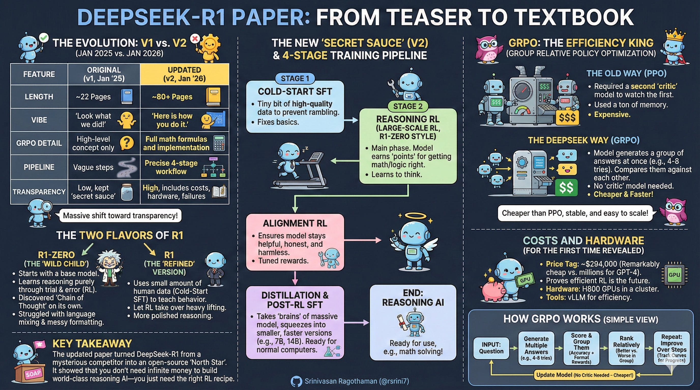

### DeepSeek-R1 Paper

The DeepSeek-R1 paper is about a new way to train AI models to think and reason better, like solving math problems or answering questions step-by-step. It's called "R1" because it uses a method called Reinforcement Learning (RL) to improve reasoning without needing lots of human examples. The paper was first posted on arXiv (a site for research papers) in January 2025 as a short version (about 22 pages). Then, in early January 2026, it was updated to a much longer version (about 80-86 pages) with way more details. This update made it easier for others to understand and copy the ideas.



#### Core Ideas of DeepSeek-R1 (What It's All About)
DeepSeek-R1 trains AI models to "think" better using RL. Instead of just feeding the model examples (called Supervised Fine-Tuning or SFT), it lets the model try answers, scores them, and improves based on rewards. There are two flavors:
- **R1-Zero**: Starts from a basic model with no human thinking examples. It uses pure RL to learn reasoning.
- **R1**: Adds a tiny bit of SFT first to fix issues like repeating words or mixing languages, then does RL.

The goal? Make open-source AI as good as closed ones (like OpenAI's o1) at reasoning, but cheaper and easier to copy. It works well on benchmarks like GSM8K (math problems) and AlpacaEval (general tasks).

Now, let's break down the versions.

#### Version 1: Original Paper (January 2025, ~22 Pages)
This was a short intro to the ideas. It showed cool results but kept many "how-to" details secret. It felt like: "Hey, this works—trust us!"

- **What It Covered**:
  - Basic explanation of R1-Zero and R1.
  - Introduced GRPO (Group Relative Policy Optimization) as the RL method, but didn't explain it much. GRPO is like PPO (a common RL tool) but simpler—no extra "critic" model needed. It compares groups of answers to give rewards.
  - High-level training flow: Start with SFT (if needed), then RL to boost reasoning.
  - Results: Scores on tests like GSM8K (e.g., high accuracy on math) and comparisons to other models like GPT-4o.
  - Distillation: Mentioned making smaller models from big ones, but no details.

- **What Was Missing**:
  - No full steps for training.
  - No math formulas for GRPO or rewards.
  - No charts showing how training improves over time.
  - No costs, hardware info, or safety risks.
  - Hard to copy because it was vague on implementation.

- **Strengths**: Proved RL can create reasoning from scratch. Exciting for AI fans, but not a full guide.

- **Weaknesses**: Too mysterious. People couldn't easily build their own versions.

#### Version 2: Updated Paper (Early January 2026, ~80-86 Pages)
This is the big expansion! It adds tons of details, making it a "recipe book" for building similar AI. Now it's like: "Here's exactly how we did it—try it yourself!"

- **New and Expanded Parts**:
  - **Full Training Pipeline**: Clear 4-stage process (see diagram below).
    1. **Cold-Start SFT**: A quick fine-tune with a few examples to fix basic issues (like bad language).
    2. **Large-Scale RL (R1-Zero Style)**: Main RL phase where the model learns to think by trying answers and getting rewards.
    3. **Alignment RL**: Extra RL to make sure the model is helpful and safe.
    4. **Post-RL SFT and Distillation**: Fine-tune again and shrink the model to smaller sizes (like 1.5B or 7B parameters) so it runs on normal computers.
  - **GRPO in Detail**: Full breakdown.
    - How it works: Groups answers (e.g., 4-8 per question), ranks them relatively (better vs. worse), and updates the model without a critic.
    - Math formulas for objectives, sampling, and rewards.
    - Why it's better: Cheaper than PPO (saves compute), stable, and easy to scale.
    - Comparisons: Charts showing GRPO beats PPO on speed and results.
  - **Rewards and Losses**:
    - Rewards based on accuracy (right answer?) and format (clear steps?).
    - Groups rewards to compare multiple tries.
    - Charts: Training curves showing rewards going up over thousands of steps, plus when things fail (e.g., model gets stuck).
  - **Benchmark Results**:
    - Detailed tables comparing to GPT-4o, o1, and others on math (AIME, GSM8K, GPQA) and reasoning tasks.
    - Error analysis: Why it fails sometimes, like on hard problems.
    - Distilled models: How small ones (7B) get close to big ones (70B) on tests.
  - **Scaling and Distillation**:
    - How reasoning "transfers" to tiny models via logit matching (copying probabilities).
    - Tradeoffs: Smaller models are faster but slightly weaker.
  - **Costs and Setup**:
    - Training cost: About $294K.
    - Hardware: H800 GPUs in a cluster, with tools like vLLM for efficiency.
    - Diagrams: Shows how data flows in distributed training.
  - **Security and Risks**:
    - New 10-page section on dangers, like misalignment (model does bad things) or failures.
    - How they tested for safety.

- **Strengths**: Now reproducible! Labs or hobbyists can follow it. Less hype, more engineering.

- **Weaknesses**: Still based on the same 2025 models—no brand-new AI, just better docs.

#### Key Differences: Original vs. Updated
- **Length and Focus**: Original = Short proof (results + ideas). Updated = Long guide (recipes + proofs).
- **Depth**: Original skimmed RL and pipeline. Updated dives deep with math, charts, and steps.
- **Reproducibility**: Original = Low (mysterious). Updated = High (open playbook).
- **Ecosystem Impact**: The update sparked new videos because now there's real tech to explain. Plus, others have made better small models based on it.
- **Why the Change?**: To share more openly, "break the moat" on fancy AI, and help the community build reasoning models.

#### Why This Matters in Simple Terms
The original showed RL can make AI thinkers. The update gives the full "how-to" so anyone can try. It's like going from a teaser trailer to the full movie. Now, R1 is a go-to open method for reasoning AI, rivaling big companies but free to use. Videos are popping up because it's matured—no more guesses, just facts.

If you're a builder: Copy the pipeline and GRPO for your own models. But you can't copy their exact data or huge compute without resources.

#### Mermaid Diagrams for Visuals

1. **Training Pipeline (Updated Version)**  
This shows the 4 stages clearly.

```mermaid
flowchart TD
    A[Start: Base Model] --> B[Stage 1: Cold-Start SFT\n(Fix basics with few examples)]
    B --> C[Stage 2: Large-Scale RL\n(R1-Zero: Pure RL for reasoning)]
    C --> D[Stage 3: Alignment RL\n(Make it helpful/safe with tuned rewards)]
    D --> E[Stage 4: Post-RL SFT + Distillation\n(Shrink to small models)]
    E --> F[End: Reasoning AI\n(Ready for use, e.g., math solving)]
```

2. **How GRPO Works (Core RL Algorithm)**  
This breaks down the key step in RL.

```mermaid
flowchart LR
    A[Input: Question] --> B[Generate Multiple Answers\n(e.g., 4-8 tries)]
    B --> C[Score & Group Them\n(Accuracy + Format Rewards)]
    C --> D[Rank Relatively\n(Better vs. Worse in Group)]
    D --> E[Update Model\n(No Critic Needed - Cheaper!)]
    E --> F[Repeat: Improve Over Steps\n(Track Curves for Progress)]
    F --> A
```

**Related:**
- [mHC-Deepseek](mHC-Deepseek.md) — DeepSeek's stability-focused multi-stream architecture that pairs with R1's MoE training at scale.
- [Deepseek-Engram](Deepseek-Engram.md) — DeepSeek's conditional memory module addressing transformer compute waste, released alongside R1-era work.
